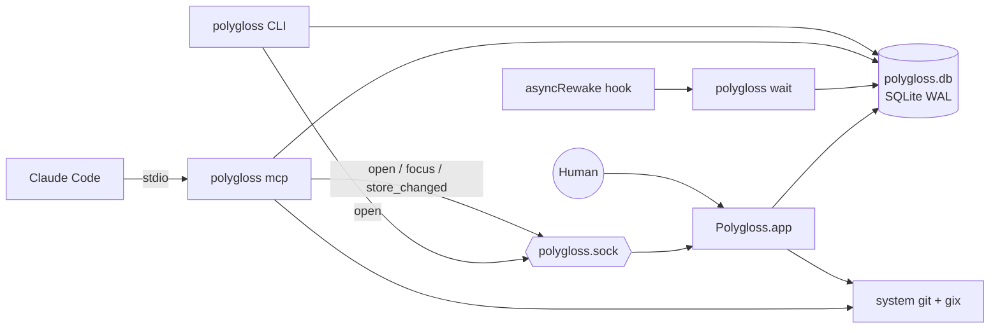
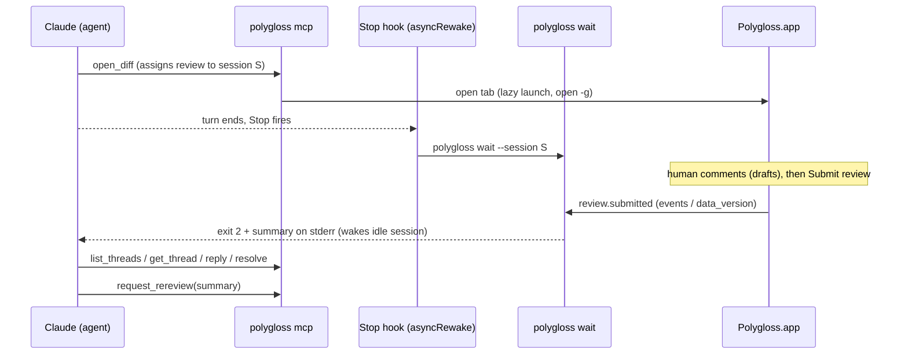

# Polygloss design

> Single source of truth for builders. **Status:** draft for v1, 2026-09-28; §11 rewritten for the M6 redesign and file categories, 2026-10-05.
>
> Decisions come from the design log and are recorded as ADRs in [`docs/adr/`](adr/README.md). Anything marked **Provisional** is a default picked where the log is silent. Each one is listed in [§26 Open questions](#26-open-questions) and can change until it is decided.

## Contents

1. [Overview](#1-overview)
2. [Glossary](#2-glossary)
3. [Diff sources and resolution](#3-diff-sources-and-resolution)
4. [Identity](#4-identity)
5. [Snapshots](#5-snapshots)
6. [Git and diff engine](#6-git-and-diff-engine)
7. [Data model (SQLite)](#7-data-model-sqlite)
8. [Comments](#8-comments)
9. [Viewed](#9-viewed)
10. [Live mode](#10-live-mode)
11. [UI](#11-ui)
12. [Performance](#12-performance)
13. [Processes and IPC](#13-processes-and-ipc)
14. [CLI](#14-cli)
15. [MCP surface](#15-mcp-surface)
16. [Claude Code plugin](#16-claude-code-plugin)
17. [Notifications and Dock badge](#17-notifications-and-dock-badge)
18. [Settings and keymap files](#18-settings-and-keymap-files)
19. [Security and privacy](#19-security-and-privacy)
20. [Testing strategy](#20-testing-strategy)
21. [Packaging and distribution](#21-packaging-and-distribution)
22. [Platform scope](#22-platform-scope)
23. [Libraries](#23-libraries)
24. [Repository layout](#24-repository-layout)
25. [Risks](#25-risks)
26. [Open questions](#26-open-questions)

---

## 1. Overview

Polygloss is a native macOS app for reviewing diffs locally, especially code written by coding agents. It works like GitHub's "Files changed" tab, with each file as a card on a light canvas (ADR-0027): split and unified views, word diff, a **Viewed** checkbox per file, threaded comments that can be resolved, and a batched **Submit review**. Agents take part through a local MCP server. They open diffs for the human, annotate them, wait for the verdict, then reply to threads and resolve them.

Everything is local. Polygloss reads repositories that are already on disk and keeps its state in one SQLite file. It never fetches, never calls a forge API and has no accounts.

### Goals

| #   | Goal                                                                                          | Acceptance (checked by)                                                                                                 |
| --- | --------------------------------------------------------------------------------------------- | ----------------------------------------------------------------------------------------------------------------------- |
| G1  | GitHub-grade review: split/unified, word diff, Viewed, threads, drafts + Submit with verdict  | GPUI E2E + screenshot suites green (plan M3 gate) and the keyboard-only review E2E (plan T5.6)                          |
| G2  | Fast on huge diffs (up to Linux v6.10..v6.11, ~13k files)                                     | Every §12.1 budget met on all four §12.2 corpora in both layouts (`run-perf.ts --check-budgets`, plan T2.9)             |
| G3  | Closed agent loop: agent opens, human reviews, agent wakes, fixes, asks for re-review         | bun MCP/CLI/E2E suites green, and manual wake gate W1–W8 recorded in real Claude Code (§16.4)                           |
| G4  | Deterministic identity: same trees give the same `diff_id` and the same comments in any clone | sha1 + sha256 golden vectors agree in Rust and TypeScript (§4.1); cross-clone test shows the same threads               |
| G5  | Fully offline                                                                                 | Static crate audit (no HTTP crates) and runtime check (no inet sockets during E2E) both pass (§19, plan T5.7)           |
| G6  | Keyboard-first, every binding remappable                                                      | Every §11.9 binding has a passing default-binding test, and a `keymap.json` override rebinds and unbinds it (plan T3.2) |
| G7  | Open source `MIT OR Apache-2.0`; our own code on permissive libraries                         | `cargo deny check licenses` clean (no GPL/AGPL/FSL) and third-party notices cover every shipped crate (§21, plan T5.7)  |

### Non-goals (v1)

| Out of scope                                                                                          | Reference     |
| ----------------------------------------------------------------------------------------------------- | ------------- |
| Any network access for repo data: `git fetch`, GitHub/GitLab APIs, PR import, posting, managed clones | ADR-0005      |
| Acting as a git client: staging, committing, resolving conflicts                                      |               |
| Editing code inside Polygloss; an "Apply suggestion" button (agents apply suggestions)                | ADR-0011      |
| Combined (`--cc`) merge diffs (merge commits diff against the first parent)                           | §3            |
| Image 2-up/swipe diffs, export review as markdown, Vim mode                                           | post-v1       |
| Linux, Windows, Intel Macs, Mac App Store                                                             | ADR-0016/0019 |
| Web, Tauri or Electron shells, embedded web views; forking or vendoring Zed or pierre-native code     | ADR-0001/0003 |
| Multi-user sync, accounts                                                                             |               |

---

## 2. Glossary

| Term                     | Meaning                                                                                                                                                                  |
| ------------------------ | ------------------------------------------------------------------------------------------------------------------------------------------------------------------------ |
| **Repo**                 | A git repository on disk. Its identity is the canonical path of its git common dir, so all linked worktrees of one clone are one repo.                                   |
| **Base / head**          | The old side and new side of a diff. Both are git tree OIDs.                                                                                                             |
| **Diff**                 | The ordered file changes between a base tree and a head tree.                                                                                                            |
| **`diff_id`**            | Content address of a diff: SHA-256 over object format, base tree OID and head tree OID (§4.1). Same trees give the same id in every clone.                               |
| **File change**          | One entry in a diff: status (A/M/D/R/T), old/new path, modes, old/new blob OIDs, rename similarity.                                                                      |
| **Snapshot**             | A tree OID captured from the working tree through a temporary index (§5).                                                                                                |
| **Pin**                  | Making a live snapshot durable: its objects are written into the repo and `refs/polygloss/snapshots/<tree>` keeps them alive.                                            |
| **Review**               | A repo-scoped container for one review intent, such as "feature vs main" or "worktree since merge-base". It groups iterations and owns drafts, submissions and assignee. |
| **Review key**           | The review's stable text key inside its repo, for example `compare:refs/remotes/origin/main...refs/heads/feature` (§4.2).                                                |
| **Iteration**            | One pinned diff inside a review, numbered 1, 2, 3 and so on. A new iteration is recorded when the resolved tree pair changes.                                            |
| **Thread**               | A root comment plus flat replies. It is anchored to lines, a file or the whole review, and its status is open or resolved.                                               |
| **Comment**              | One markdown message in a thread, written by a human or an agent.                                                                                                        |
| **Anchor**               | Where a thread points: `(path, side old/new, start_line..line, blob OID)`. Line numbers are lines of that immutable blob, not positions in a hunk.                       |
| **Draft**                | A human comment (new thread or reply) that agents cannot see yet. Submit review publishes it.                                                                            |
| **Submission**           | One Submit review: all drafts are published at once, together with a summary and a verdict.                                                                              |
| **Verdict**              | `request_changes`, `comment` or `approve`. `approve` tells the agent it is done.                                                                                         |
| **Viewed**               | A human's mark on a file change, keyed by `(path, old_blob, new_blob)` (§9).                                                                                             |
| **Changed since viewed** | The file was marked viewed in an earlier iteration of this review, and its blob pair has changed since.                                                                  |
| **Carry-forward**        | Mapping a thread's lines from its anchor blob into the current blob with a line diff (§8.6).                                                                             |
| **Outdated**             | A thread whose anchored lines changed in the current iteration. It is shown with its original snippet.                                                                   |
| **Agent note**           | A thread an agent creates to explain code. Collapsed by default, and hidden by the "Hide agent notes" toggle.                                                            |
| **Agent question**       | A thread an agent creates to ask the human something. It counts toward "waiting on you" until the human replies or resolves it.                                          |
| **Session**              | One agent session talking to Polygloss: the Claude Code session id, or a generated id for other clients.                                                                 |
| **Assignment**           | The one session a review belongs to: the session that opened it, reassignable. That session receives the wake-up.                                                        |
| **Live review**          | A review whose head is the working tree. It updates when the user clicks Refresh.                                                                                        |
| **Category**             | A named set of path patterns (Tests, Generated, …) whose files leave the main list for a collapsed section at the bottom of the diff (§11.15). Computed, never stored.   |
| **Section**              | The viewport's group of one category's files, below the uncategorized files, with a band to show, hide or mark them viewed.                                              |
| **Shown file**           | A file of the main list or of an open section. Stepwise keys walk shown files only (§11.6).                                                                              |

---

## 3. Diff sources and resolution

Every source resolves to `{object_format, base_commit?, base_tree, head_commit?, head_tree}` before anything else runs. Hunks depend only on the two trees, never on refs.

| Source                       | Entry points                                                                     | Base tree                                                                                                           | Head tree                                                              | Review key (§4.2)                                               | Moves when           |
| ---------------------------- | -------------------------------------------------------------------------------- | ------------------------------------------------------------------------------------------------------------------- | ---------------------------------------------------------------------- | --------------------------------------------------------------- | -------------------- |
| Commit                       | `polygloss show <rev>`, ⌘O → commit from log, MCP `open_diff{commit}`            | First parent's tree. Root commit: empty tree. Merge commit: first parent.                                           | The commit's tree                                                      | `commit:<commit_oid>` **Provisional** (OQ-2)                    | never                |
| Compare, three-dot (default) | `polygloss compare <base> <head>`, ⌘O → branch compare, MCP `open_diff{compare}` | Tree of `merge-base(base, head)`                                                                                    | Head's tree                                                            | `compare:<base>...<head>`                                       | either ref moves     |
| Compare, direct              | `polygloss compare <base> <head> --direct`                                       | Base's tree                                                                                                         | Head's tree                                                            | `compare:<base>..<head>`                                        | either ref moves     |
| Branch compare as PR         | `compare … --label "PR #123"`, MCP `label`                                       | As three-dot                                                                                                        | As three-dot                                                           | Same key as the compare; the label is display only              | either ref moves     |
| Live worktree                | `polygloss` inside a worktree, ⌘O → Live, MCP `open_diff{live}`                  | `since=merge-base` (default): tree of `merge-base(HEAD, origin/<default>)`. `since=HEAD`. `since=<commit>` (fixed). | Snapshot of the working tree: tracked plus untracked, not ignored (§5) | `worktree:<repo>@<branch>#since=merge-base\|HEAD\|<commit_oid>` | user refreshes (§10) |

Resolution rules:

- **Revisions:** `git rev-parse --verify --end-of-options <rev>^{commit}`. Ref inputs are stored by full name (`git rev-parse --symbolic-full-name`). If the input is an OID or not a ref, the key uses the commit OID, so that review never moves.
- **Default branch:** detected offline from `refs/remotes/origin/HEAD` (`git symbolic-ref`). **Provisional** fallback (OQ-5): `origin/main`, `origin/master`, `main`, `master`, then `since=HEAD` with a notice.
- **Merge-base:** for compares, no common ancestor is an error that suggests `--direct` (in a shallow clone it is `objects_missing`, since the merge base is most likely beyond the boundary). For live `since=merge-base`, it falls back to HEAD as the base with a notice, like the default-branch chain (in a shallow clone the notice blames the missing history). The review key keeps `since=merge-base`, so the review does not split once a merge base exists; an unborn HEAD uses the empty tree as base (**Provisional**, plan OQ-P5). If there are several merge bases, use git's first result and show a warning (**Provisional**).
- **Empty tree:** sha1 `4b825dc642cb6eb9a060e54bf8d69288fbee4904`, sha256 `6ef19b41225c5369f1c104d45d8d85efa9b057b53b14b4b9b939dd74decc5321` (both checked with git 2.54).
- **PRs are branch compares.** Polygloss only compares refs that already exist locally. The user or agent runs `gh pr checkout` or `git fetch` themselves.
- **Provenance:** requested refs, commit OIDs and resolved ref names are stored on the iteration. They never feed `diff_id`.
- **Submodules** (mode `160000`) show as one line `abc1234 → def5678` and are never recursed.

---

## 4. Identity

### 4.1 `diff_id`

```text
diff_id = lowercase_hex( sha256( "polygloss/diff/v1\n" + objfmt + "\n" + base_tree + "\n" + head_tree ) )

objfmt     = "sha1" | "sha256"           # git rev-parse --show-object-format
base_tree  = lowercase hex tree OID      # 40 chars (sha1) or 64 (sha256)
head_tree  = lowercase hex tree OID
```

| Property                   | Rule                                                                                                                                                                            |
| -------------------------- | ------------------------------------------------------------------------------------------------------------------------------------------------------------------------------- |
| Trees, not commits         | Amend, reword and no-op rebase keep the `diff_id`, so comments and Viewed state survive them (ADR-0006).                                                                        |
| No repo component          | Any clone or worktree that has both trees opens the same diff and sees the same threads and Viewed marks.                                                                       |
| View options are not in it | Whitespace, algorithm, split/unified, context, word/char and rename settings are view settings. Anchors are blob line numbers, so they do not depend on how hunks are computed. |
| Versioned                  | The `v1` prefix names the scheme. A new encoding means a new prefix plus a migration.                                                                                           |
| Encoding                   | Field separators and output form are **Provisional** (OQ-1). The log fixes the fields and their order. Frozen at the first public release.                                      |
| Display                    | UI shows the first 12 hex chars. Inputs accept any unique prefix of at least 8 chars (**Provisional**).                                                                         |
| Tests                      | Golden vectors for sha1 and sha256 repos in `polygloss-core`.                                                                                                                   |

Opening by id (`polygloss open`, `polygloss://diff/<id>`) finds a repo that has both trees. It tries the cwd repo, then repos whose iterations reference the id, then every known repo, and checks each with `git cat-file -e`.

### 4.2 Review keys

Reviews are unique per `(repo_id, key)`. `review_id` is a UUIDv7 (**Provisional**).

| Kind            | Key grammar                                 | Example                                                       |
| --------------- | ------------------------------------------- | ------------------------------------------------------------- |
| live            | `worktree:<worktree>@<branch>#since=<base>` | `worktree:/Users/d/src/app@feature/login#since=merge-base`    |
| compare (3-dot) | `compare:<base_ref>...<head_ref>`           | `compare:refs/remotes/origin/main...refs/heads/feature/login` |
| compare (2-dot) | `compare:<base_ref>..<head_ref>`            | `compare:refs/heads/main..refs/heads/spike`                   |
| commit          | `commit:<commit_oid>` **Provisional**       | `commit:9f1c…`                                                |

- `<worktree>` is the canonical worktree root path. It keeps linked worktrees of one repo apart. `<branch>` is the short branch name, or `detached` on a detached HEAD (**Provisional**, OQ-3).
- `<base>` is `merge-base`, `HEAD` or a full commit OID. Each base is its own review.
- The "PR" label lives in `reviews.label` and is not part of the key. The earlier key form `github.com/owner/repo#N` is superseded (ADR-0005, ADR-0007).

### 4.3 Repo identity

`repo identity = realpath(git rev-parse --path-format=absolute --git-common-dir)`

- Linked worktrees collapse into one repo row.
- Moving or renaming a clone creates a new repo row. The old reviews stay in recents as orphans and can be pruned. Their threads still show up wherever the same `diff_id` is opened (§8.6).

### 4.4 Other identifiers

| Id                                                      | Form                                                                                                       |
| ------------------------------------------------------- | ---------------------------------------------------------------------------------------------------------- |
| `thread_id`, `comment_id`, `submission_id`, `review_id` | UUIDv7 text (**Provisional**)                                                                              |
| Event cursor                                            | `events.seq`: an integer that only grows                                                                   |
| Session id                                              | `CLAUDE_CODE_SESSION_ID` when set, otherwise `pg-<uuidv7>` per MCP process or `--session` for the JSON CLI |

---

## 5. Snapshots

A snapshot turns the working tree into a tree OID. It never touches the user's index, HEAD or refs (other than `refs/polygloss/*`), and nothing is written to the repo until the state is pinned.

### 5.1 Mechanism

| Step | Unpinned live state (every recompute)                                                                                                                                                                                                                                                                                                                   |
| ---- | ------------------------------------------------------------------------------------------------------------------------------------------------------------------------------------------------------------------------------------------------------------------------------------------------------------------------------------------------------- |
| 1    | Copy `$GIT_DIR/index` to `~/Library/Caches/polygloss/scratch/<repo-hash>/<worktree-hash>/index` (objects are shared per repo in `scratch/<repo-hash>/objects/`). The temp index must live **outside the worktree**, or `add -A` picks it up. The copy reuses git's stat cache, so only changed files get hashed.                                        |
| 2    | With `GIT_INDEX_FILE=<scratch index>`, `GIT_OBJECT_DIRECTORY=<scratch>/objects` (whose `info/alternates` file points at the repo objects dir; the `GIT_ALTERNATE_OBJECT_DIRECTORIES` list form breaks on paths containing `:`), `core.splitIndex=false` and `GIT_OPTIONAL_LOCKS=0`, run `git add -A`, then `git write-tree`. The result is `head_tree`. |
| 3    | New blobs and trees go only to the scratch store. The repo's `.git` is unchanged (checked: object count, `git status` and every file's bytes identical before and after; git only bumps the mtime of existing objects it finds through the alternate).                                                                                                  |
| 4    | Structure (`diff-tree`, §6) runs with the same environment so both trees can be read.                                                                                                                                                                                                                                                                   |
| 5    | The scratch store is cleared once no displayed state needs it. Keep the last 2 states per worktree (**Provisional**).                                                                                                                                                                                                                                   |

This is the **Provisional** mechanism for the log's "content-hashed in memory, written to git only when pinned" (OQ-4). It gives exactly the OIDs, filters and rename pairs that a real `git add -A` would, so unpinned and pinned states agree on `diff_id` and on Viewed keys.

| Step | Pin                                                                                                                                                                       |
| ---- | ------------------------------------------------------------------------------------------------------------------------------------------------------------------------- |
| 1    | Copy the objects reachable from `head_tree` that the repo lacks from the scratch store into the repo's object store. Write only if absent; the loose format is identical. |
| 2    | `git update-ref refs/polygloss/snapshots/<head_tree> <head_tree>`. A ref can point straight at a tree, and it survives `git gc --prune=now` (checked).                    |
| 3    | Record the iteration: review, `diff_id`, `snapshot_ref`, `pinned_by`.                                                                                                     |

### 5.2 Pin triggers

| Trigger                                                                                | Actor | `pinned_by`                 |
| -------------------------------------------------------------------------------------- | ----- | --------------------------- |
| A draft or comment is added to a live diff                                             | human | `comment`                   |
| An agent needs a durable id: `open_diff`, `create_comment`, `request_rereview` on live | agent | `agent` / `rereview`        |
| Explicit **Snapshot** command                                                          | human | `manual`                    |
| Submit review (so "changes since last review" has a fixed old head)                    | human | `submit`                    |
| Toggling Viewed                                                                        | —     | never pins (keys are blobs) |

### 5.3 Retention and guards

- A snapshot ref is kept while any iteration references it. The "Prune old reviews" setting deletes reviews, then deletes snapshot refs nothing references anymore. Pins and prunes of one repo hold an exclusive advisory lock (`locks/repo-<hash>.lock` in the data dir, §13.2), from creating the ref until the iteration naming it commits, and from reading the referenced set until the refs are deleted, so a prune never deletes the ref of a pin in flight. Waiting for the lock gives up after 120 s with an error, so a pin or prune stuck in git cannot block the other forever (**Provisional**). Polygloss never runs `git gc` itself (**Provisional**).
- A fixed `since=<commit>` base also gets a ref (`refs/polygloss/snapshots/<base_tree>`) so it cannot be collected (**Provisional**). Commit and compare iterations rely on the user's own refs; if those objects are gone, the UI says "objects no longer available".
- `git add -A` runs the repo's configured clean filters. git-lfs, for example, may write to `.git/lfs/objects`. Documented as a risk (§25).
- If `index.lock` exists while copying the index, retry after the next debounce.
- Never use `git stash`. Never modify HEAD, the real index or any ref outside `refs/polygloss/`.

---

## 6. Git and diff engine

### 6.1 Division of work (ADR-0014)

| Concern                                         | Tool                                                                                                                                                                                                                                                                                                                                      | Why                                                                                |
| ----------------------------------------------- | ----------------------------------------------------------------------------------------------------------------------------------------------------------------------------------------------------------------------------------------------------------------------------------------------------------------------------------------- | ---------------------------------------------------------------------------------- |
| Revs, merge-base, default branch, object format | git CLI: `rev-parse`, `merge-base`, `symbolic-ref`                                                                                                                                                                                                                                                                                        | Exact git semantics                                                                |
| File list and renames                           | `git diff-tree -r -z --raw -M50% -l1000 --no-ext-diff --no-textconv <base_tree> <head_tree>`                                                                                                                                                                                                                                              | Git-exact rename pairing; 171 ms on Linux v6.10..v6.11 (13,283 paths, 173 renames) |
| Snapshots                                       | git CLI `add -A` + `write-tree` with a temp index (§5)                                                                                                                                                                                                                                                                                    | Uses the user's ignore rules and filters                                           |
| Blob reads                                      | gix 0.88, in process; the object handle includes the scratch store as an alternate                                                                                                                                                                                                                                                        | No subprocess per blob                                                             |
| Hunks                                           | gix-imara-diff 0.3, used directly (no `gix-diff`): Histogram and the indent/slider post-processing, run in git's order (old side first). Myers is git's preprocessing on whole files, then imara's Myers core ported without its own preprocessing (`myers_core.rs`, plan T1.16). Myers + indent heuristic by default, Histogram optional | Same output whatever the user's git version or config                              |
| Word/char diff, line mapping                    | gix-imara-diff                                                                                                                                                                                                                                                                                                                            | One engine for hunks, word ranges, carry-forward and open-in-editor mapping        |
| Binary detection                                | NUL byte in the first 8,000 bytes (git's rule), plus `binary` / `-diff` attributes read from the head tree                                                                                                                                                                                                                                | Consistent with git                                                                |
| Generated detection                             | `linguist-generated` (set, unset or unspecified) from the head tree, stored; the Generated category's patterns applied at view time (§11.15)                                                                                                                                                                                              | GitHub-like collapsing; patterns follow `settings.json`                            |
| Syntax highlighting                             | lumis 0.15 (§11.11)                                                                                                                                                                                                                                                                                                                       |                                                                                    |

The earlier plan (git ≥ 2.50 `diff-pairs` patches parsed in Rust) is superseded. Git produces structure only.

### 6.2 Git invocation rules

- Use the **system git**, never a bundled one, so no GPL code ships (ADR-0004). When `PATH`'s `git` is the Xcode command-line-tools shim (`/usr/bin/git`), the runner spawns the git the shim would run (`<xcode-select -p>/usr/bin/git`, found once per process): the shim costs about 9 ms per process. Minimum version is **Provisional** 2.39 (the Xcode Command Line Tools git, OQ-6). Check it at startup and show a clear error.
- Flags on every call: `-z`, `-c core.quotePath=false`, `--no-ext-diff`, `--no-textconv`, and explicit `-M50% -l1000`. The last two pin git's defaults so a user `diff.renameLimit` cannot leak in. Copy detection (`-C`) is off, so copies show as adds.
- Environment on every call: `GIT_OPTIONAL_LOCKS=0` (never take `index.lock` during refresh), `GIT_TERMINAL_PROMPT=0`, `GIT_NO_LAZY_FETCH=1`, `GIT_ALLOW_PROTOCOL=` (empty), `GIT_NO_REPLACE_OBJECTS=1`, `LC_ALL=C`, and `-c protocol.allow=never`. With `GIT_NO_LAZY_FETCH` and no allowed transport, a partial clone fails to read a missing object instead of fetching it (ADR-0005). The empty `GIT_ALLOW_PROTOCOL` matters because `protocol.<name>.allow` in user config or inherited `GIT_CONFIG_*` overrides `protocol.allow=never`, and git before 2.44 ignores `GIT_NO_LAZY_FETCH`. `GIT_NO_REPLACE_OBJECTS` keeps `refs/replace/*` (not shared between clones) out of resolved trees and so out of `diff_id`.
- Inherited `GIT_DIR`, `GIT_WORK_TREE`, `GIT_INDEX_FILE`, `GIT_OBJECT_DIRECTORY`, `GIT_COMMON_DIR`, `GIT_ALTERNATE_OBJECT_DIRECTORIES`, `GIT_CONFIG_PARAMETERS` and `GIT_CONFIG_COUNT` are cleared, because agents, hooks and `git -c` parents often export them. Snapshots (§5) set some of them on purpose.
- The user's global and system config are **not** disabled. Global `core.excludesFile` and filters such as LFS must apply to snapshots. The outputs we depend on are pinned by flags instead.
- Git runs on the GPUI background executor in the app and on worker threads in the CLI, never on the UI thread. Requests that go stale are cancelled.
- The `diff-tree` result is stored in `file_changes` (§7). A diff's structure then stays stable even if a later git version pairs renames differently. Non-default rename settings are computed on the fly and not stored.

### 6.3 Hunks and word diff

| Topic      | Rule                                                                                                                                                                                                                                                                                                |
| ---------- | --------------------------------------------------------------------------------------------------------------------------------------------------------------------------------------------------------------------------------------------------------------------------------------------------- |
| Algorithm  | Myers + indent/slider heuristic (GitHub-like) by default; Histogram as a setting.                                                                                                                                                                                                                   |
| Context    | 3 lines. Hunks merge when the unchanged gap is 7 lines or less, like `git diff -U3 --inter-hunk-context=1`, which matched GitHub on 519 of 519 files in research (**Provisional** parity target).                                                                                                   |
| When       | Lazily per file, for files near the viewport, on background threads. Cached by `(old_blob, new_blob, algorithm, whitespace)`.                                                                                                                                                                       |
| Whitespace | `w` hides whitespace by diffing whitespace-normalized lines. Anchors do not change.                                                                                                                                                                                                                 |
| Word diff  | Every modified line pair. Removed and added lines in a change block pair up in order, GitHub-style (**Provisional** pairing). Granularity: words (default) or chars. Lines over 1,000 chars get no word diff (**Provisional**).                                                                     |
| Counts     | Additions and deletions for every file are computed in the background after first paint and fill in progressively.                                                                                                                                                                                  |
| Parity     | CI compares imara hunks with `git diff -U3 --inter-hunk-context=1 --diff-algorithm=myers --indent-heuristic` on real repos. Target: at least 99.9% of files identical (**Provisional**). Mismatches are reviewed as snapshots. In research, imara histogram differed from git on 7 of 13,283 files. |

### 6.4 Special files

| Kind             | Detection                                            | Rendering                                                                      |
| ---------------- | ---------------------------------------------------- | ------------------------------------------------------------------------------ |
| Rename           | raw status `R<score>`                                | Header `old/path → new/path` and similarity; body diffs the two blobs          |
| Mode-only change | modes differ, blobs equal                            | Header badge `100644 → 100755`, no body                                        |
| Binary           | NUL heuristic or attribute                           | Placeholder "Binary file · 12.0 KB → 14.2 KB"                                  |
| Symlink          | mode `120000`                                        | Target text diff plus a `symlink` badge                                        |
| Submodule        | mode `160000`                                        | One line: `abc1234 → def5678`                                                  |
| Generated        | `linguist-generated`, or Generated patterns (§11.15) | Collapsed, with "Load diff"; in the Generated section when that category is on |
| Large            | more than ~20k changed lines                         | Collapsed, with "Load diff"                                                    |
| LFS pointer      | pointer text in the blob                             | Pointer shown as text, `LFS` badge (**Provisional**)                           |
| Merge commit     | more than one parent                                 | Diff against the first parent                                                  |

---

## 7. Data model (SQLite)

### 7.1 Store rules (ADR-0015)

| Topic               | Rule                                                                                                                                                                                                                                                                             |
| ------------------- | -------------------------------------------------------------------------------------------------------------------------------------------------------------------------------------------------------------------------------------------------------------------------------- |
| File                | `~/Library/Application Support/polygloss/polygloss.db`, directory mode `0700`, file `0600`. `POLYGLOSS_DATA_DIR` overrides the directory for tests (**Provisional** name).                                                                                                       |
| Shared by           | The app, the CLI, `polygloss mcp` and `polygloss wait` all open it directly. No process proxies another.                                                                                                                                                                         |
| Binding             | rusqlite 0.40 with the `bundled` feature.                                                                                                                                                                                                                                        |
| Bootstrap order     | `busy_timeout=5000` first, then `journal_mode=WAL` in a retry loop on `SQLITE_BUSY` (a fresh file can return BUSY without calling the busy handler), then `synchronous=NORMAL` and `foreign_keys=ON`.                                                                            |
| Writes              | Always `BEGIN IMMEDIATE` (`TransactionBehavior::Immediate`). Every mutation appends its `events` row in the same transaction.                                                                                                                                                    |
| Checkpoints         | Periodic `wal_checkpoint(PASSIVE)` and a `journal_size_limit`, so a long-lived reader cannot starve checkpoints.                                                                                                                                                                 |
| Migrations          | rusqlite_migration 2.6 on `user_version`, run while holding `std::fs::File::lock` on `polygloss.db.lock`. Take a `VACUUM INTO` backup before migrating. Run `PRAGMA quick_check` when the app starts.                                                                            |
| Change notification | A dedicated read connection polls `PRAGMA data_version` (about 1.3 µs per poll), every 150 ms while focused and 1 s in the background (**Provisional**), then reads `events` after the last seen `seq`. Writers also send `store_changed` over the socket if the app is running. |
| Conventions         | Timestamps are INTEGER Unix milliseconds (UTC). Ids are TEXT. Booleans are INTEGER 0/1. Paths are git paths as UTF-8 TEXT; non-UTF-8 paths are an open question (OQ-25).                                                                                                         |

### 7.2 Schema (v1)

```sql
-- One row per git common dir (worktrees collapse).
CREATE TABLE repos (
  id             INTEGER PRIMARY KEY,
  common_dir     TEXT    NOT NULL UNIQUE,        -- realpath of git common dir
  display_name   TEXT    NOT NULL,               -- basename of main worktree
  object_format  TEXT    NOT NULL CHECK (object_format IN ('sha1','sha256')),
  default_branch TEXT,                           -- cached target of refs/remotes/origin/HEAD
  created_at     INTEGER NOT NULL,
  last_opened_at INTEGER NOT NULL
);

-- Immutable diffs, keyed by diff_id.
CREATE TABLE diffs (
  id            TEXT    PRIMARY KEY,             -- diff_id, 64 hex chars
  object_format TEXT    NOT NULL,
  base_tree     TEXT    NOT NULL,
  head_tree     TEXT    NOT NULL,
  files_count   INTEGER,                         -- filled after diff-tree
  additions     INTEGER,                         -- filled progressively
  deletions     INTEGER,
  created_at    INTEGER NOT NULL
);

-- diff-tree output, stored once per diff so structure stays stable.
CREATE TABLE file_changes (
  diff_id    TEXT    NOT NULL REFERENCES diffs(id) ON DELETE CASCADE,
  idx        INTEGER NOT NULL,                   -- order in diff-tree output
  status     TEXT    NOT NULL CHECK (status IN ('A','M','D','R','T')),
  old_path   TEXT,                               -- NULL for A
  new_path   TEXT,                               -- NULL for D
  old_mode   TEXT,
  new_mode   TEXT,
  old_blob   TEXT    NOT NULL,                   -- all-zero OID when absent
  new_blob   TEXT    NOT NULL,
  similarity INTEGER,                            -- renames only
  kind       TEXT    NOT NULL DEFAULT 'text'
             CHECK (kind IN ('text','binary','symlink','submodule')),
  generated  INTEGER NOT NULL DEFAULT 0,
  additions  INTEGER,                            -- NULL until computed (default algorithm)
  deletions  INTEGER,
  PRIMARY KEY (diff_id, idx)
);
CREATE INDEX file_changes_new_path ON file_changes(diff_id, new_path);
CREATE INDEX file_changes_old_path ON file_changes(diff_id, old_path);

CREATE TABLE reviews (
  id               TEXT    PRIMARY KEY,          -- UUIDv7
  repo_id          INTEGER NOT NULL REFERENCES repos(id),
  key              TEXT    NOT NULL,             -- §4.2
  kind             TEXT    NOT NULL CHECK (kind IN ('live','compare','commit')),
  label            TEXT,                         -- e.g. 'PR #123'
  base_spec        TEXT,                         -- normalized input refs/revs
  head_spec        TEXT,
  compare_mode     TEXT    CHECK (compare_mode IN ('three-dot','direct')),
  since            TEXT,                         -- live: 'merge-base' | 'HEAD' | commit OID
  worktree_path    TEXT,                         -- live only
  status           TEXT    NOT NULL DEFAULT 'open'
                   CHECK (status IN ('open','changes_requested','commented','approved','rereview_requested')),
  rereview_summary TEXT,
  rereview_at      INTEGER,
  muted            INTEGER NOT NULL DEFAULT 0,
  last_seen_seq    INTEGER NOT NULL DEFAULT 0,   -- human has seen events up to here
  created_at       INTEGER NOT NULL,
  updated_at       INTEGER NOT NULL,             -- last activity
  archived_at      INTEGER,
  UNIQUE (repo_id, key)
);
CREATE INDEX reviews_recent ON reviews(archived_at, updated_at DESC);

CREATE TABLE iterations (
  id           INTEGER PRIMARY KEY,
  review_id    TEXT    NOT NULL REFERENCES reviews(id) ON DELETE CASCADE,
  seq          INTEGER NOT NULL,                 -- 1-based within review
  diff_id      TEXT    NOT NULL REFERENCES diffs(id),
  base_commit  TEXT,                             -- provenance
  head_commit  TEXT,                             -- NULL for live
  base_ref     TEXT,
  head_ref     TEXT,
  snapshot_ref TEXT,                             -- refs/polygloss/snapshots/<tree>
  pinned_by    TEXT    NOT NULL
               CHECK (pinned_by IN ('open','refresh','comment','agent','manual','submit','rereview')),
  created_at   INTEGER NOT NULL,
  UNIQUE (review_id, seq)
);
CREATE INDEX iterations_diff ON iterations(diff_id);

CREATE TABLE viewed_files (
  path      TEXT    NOT NULL,
  old_blob  TEXT    NOT NULL,
  new_blob  TEXT    NOT NULL,
  review_id TEXT    REFERENCES reviews(id) ON DELETE SET NULL,  -- where marked
  viewed_at INTEGER NOT NULL,
  PRIMARY KEY (path, old_blob, new_blob)
) WITHOUT ROWID;
CREATE INDEX viewed_files_review ON viewed_files(review_id, path);

CREATE TABLE sessions (
  id             TEXT    PRIMARY KEY,            -- CLAUDE_CODE_SESSION_ID or 'pg-<uuidv7>'
  canonical_id   TEXT    REFERENCES sessions(id), -- set when linked after id drift (§16.4)
  client_name    TEXT    NOT NULL,               -- MCP clientInfo.name, e.g. 'claude-code'; 'cli'
  client_version TEXT,
  owner_pid      INTEGER,                        -- agent host process (Provisional, §16.4)
  cwd            TEXT,
  last_woken_seq INTEGER NOT NULL DEFAULT 0,     -- dedupes wake-ups
  first_seen_at  INTEGER NOT NULL,
  last_seen_at   INTEGER NOT NULL
);

CREATE TABLE review_assignments (
  review_id   TEXT    PRIMARY KEY REFERENCES reviews(id) ON DELETE CASCADE,
  session_id  TEXT    NOT NULL REFERENCES sessions(id),
  assigned_at INTEGER NOT NULL,
  assigned_by TEXT    NOT NULL CHECK (assigned_by IN ('open_diff','human','agent'))
);
CREATE INDEX review_assignments_session ON review_assignments(session_id);

CREATE TABLE waiters (                           -- live `polygloss wait` processes
  session_id  TEXT    PRIMARY KEY REFERENCES sessions(id) ON DELETE CASCADE,
  pid         INTEGER NOT NULL,
  started_at  INTEGER NOT NULL,
  deadline_at INTEGER NOT NULL
);

CREATE TABLE threads (
  id                  TEXT    PRIMARY KEY,       -- UUIDv7
  review_id           TEXT    REFERENCES reviews(id) ON DELETE CASCADE,
  origin_diff_id      TEXT    NOT NULL REFERENCES diffs(id),
  origin_iteration_id INTEGER REFERENCES iterations(id) ON DELETE SET NULL,
  subject             TEXT    NOT NULL CHECK (subject IN ('line','file','review')),
  kind                TEXT    NOT NULL DEFAULT 'comment' CHECK (kind IN ('comment','note','question')),
  path                TEXT,                      -- line/file subjects
  side                TEXT    CHECK (side IN ('old','new')),
  start_line          INTEGER,                   -- 1-based, inclusive; = line for single lines
  line                INTEGER,
  anchor_blob         TEXT,                      -- blob the line numbers refer to
  anchor_snippet      TEXT,                      -- anchored lines + 3 lines context, for outdated display
  status              TEXT    NOT NULL DEFAULT 'open' CHECK (status IN ('open','resolved')),
  resolved_by_kind    TEXT    CHECK (resolved_by_kind IN ('human','agent')),
  resolved_by_name    TEXT,
  resolved_at         INTEGER,
  created_by_kind     TEXT    NOT NULL CHECK (created_by_kind IN ('human','agent')),
  created_by_name     TEXT    NOT NULL,
  created_at          INTEGER NOT NULL,
  updated_at          INTEGER NOT NULL,
  CHECK (subject <> 'line' OR (path IS NOT NULL AND side IS NOT NULL
                               AND start_line IS NOT NULL AND line IS NOT NULL
                               AND line >= start_line AND anchor_blob IS NOT NULL)),
  CHECK (subject <> 'file' OR path IS NOT NULL),
  CHECK (kind = 'comment' OR created_by_kind = 'agent')
);
CREATE INDEX threads_review ON threads(review_id, status);
CREATE INDEX threads_origin_diff ON threads(origin_diff_id);

CREATE TABLE review_submissions (
  id            TEXT    PRIMARY KEY,             -- UUIDv7
  review_id     TEXT    NOT NULL REFERENCES reviews(id) ON DELETE CASCADE,
  iteration_id  INTEGER NOT NULL REFERENCES iterations(id),
  verdict       TEXT    NOT NULL CHECK (verdict IN ('request_changes','comment','approve')),
  summary_md    TEXT    NOT NULL DEFAULT '',
  comment_count INTEGER NOT NULL,                -- drafts published by this submission
  submitted_at  INTEGER NOT NULL
);
CREATE INDEX review_submissions_review ON review_submissions(review_id, submitted_at);

CREATE TABLE comments (
  id            TEXT    PRIMARY KEY,             -- UUIDv7
  thread_id     TEXT    NOT NULL REFERENCES threads(id) ON DELETE CASCADE,
  author_kind   TEXT    NOT NULL CHECK (author_kind IN ('human','agent')),
  author_name   TEXT    NOT NULL,                -- 'you' or clientInfo.name
  session_id    TEXT    REFERENCES sessions(id),
  body_md       TEXT    NOT NULL,
  submission_id TEXT    REFERENCES review_submissions(id),
  published_at  INTEGER,                         -- NULL = draft (humans only)
  created_at    INTEGER NOT NULL,
  edited_at     INTEGER,
  deleted_at    INTEGER,                         -- soft delete (Provisional)
  CHECK (author_kind = 'human' OR published_at IS NOT NULL)
);
CREATE INDEX comments_thread ON comments(thread_id, created_at);
CREATE INDEX comments_drafts ON comments(thread_id) WHERE published_at IS NULL;

CREATE TABLE review_drafts (                     -- autosaved Submit dialog
  review_id  TEXT    PRIMARY KEY REFERENCES reviews(id) ON DELETE CASCADE,
  summary_md TEXT    NOT NULL DEFAULT '',
  verdict    TEXT    CHECK (verdict IN ('request_changes','comment','approve')),
  updated_at INTEGER NOT NULL
);

CREATE TABLE thread_positions (                  -- carry-forward cache (§8.6)
  thread_id      TEXT    NOT NULL REFERENCES threads(id) ON DELETE CASCADE,
  diff_id        TEXT    NOT NULL REFERENCES diffs(id) ON DELETE CASCADE,
  state          TEXT    NOT NULL CHECK (state IN ('exact','moved','outdated','absent')),
  path           TEXT,
  side           TEXT,
  start_line     INTEGER,                        -- mapped range (nearest line when outdated)
  line           INTEGER,
  engine_version INTEGER NOT NULL,               -- recompute when the mapper changes
  PRIMARY KEY (thread_id, diff_id)
) WITHOUT ROWID;

CREATE TABLE events (                            -- append-only; no FKs so it outlives rows
  seq        INTEGER PRIMARY KEY AUTOINCREMENT,
  at         INTEGER NOT NULL,
  kind       TEXT    NOT NULL,                   -- see table below
  review_id  TEXT,
  diff_id    TEXT,
  thread_id  TEXT,
  comment_id TEXT,
  actor_kind TEXT    NOT NULL CHECK (actor_kind IN ('human','agent','system')),
  actor_name TEXT,
  session_id TEXT,
  payload    TEXT                                -- JSON
);
CREATE INDEX events_review ON events(review_id, seq);
CREATE INDEX events_thread ON events(thread_id, seq);

CREATE TABLE view_state (                        -- per diff_id (§11.12)
  diff_id    TEXT    PRIMARY KEY REFERENCES diffs(id) ON DELETE CASCADE,
  state_json TEXT    NOT NULL,                   -- versioned JSON, see below
  updated_at INTEGER NOT NULL
);
```

`view_state.state_json` (v1): `{ "v": 1, "scroll_anchor": { "path", "side", "line" }, "collapsed": [path], "expanded": { path: [[start, end]] }, "layout": "split" | "unified" | null, "tree_expanded": [dir], "composer": { key: text }, "threads_panel": bool, "open_sections": [category] }`. The last two are optional additions (M6; absent = default), so the version stays 1.

Migration 2 (M6, ADR-0028) adds the `linguist-generated` tri-state that the `generated` bit folds away. `generated` is still written as in v1 (attribute set, or the v1 built-in list), so older readers see the same bit. Rows written before migration 2 read as unknown; v1 always wrote the bit as "the attribute if specified, else the v1 built-in list", so core recovers the tri-state from the bit and that list, frozen (§11.15).

```sql
ALTER TABLE file_changes ADD COLUMN generated_attr INTEGER
  CHECK (generated_attr IN (0, 1, 2));           -- 0 unspecified, 1 set, 2 unset; NULL = row from before migration 2
```

### 7.3 Events

| `kind`                                     | Actor        | Seen by agents | Payload                                                     |
| ------------------------------------------ | ------------ | -------------- | ----------------------------------------------------------- |
| `review.created`, `review.archived`        | any          | yes            | `key`, `kind` (+ `pruned: true` when the review was pruned) |
| `iteration.created`                        | any          | yes            | `seq`, `diff_id`, `pinned_by`                               |
| `thread.created`                           | human, agent | yes            | `kind`, `subject`                                           |
| `comment.created` / `.edited` / `.deleted` | human, agent | yes            | —                                                           |
| `thread.resolved` / `thread.unresolved`    | human, agent | yes            | —                                                           |
| `review.submitted`                         | human        | yes            | `submission_id`, `verdict`                                  |
| `review.rereview_requested`                | agent        | yes            | `summary`                                                   |
| `review.assigned`                          | any          | yes            | `session_id`                                                |
| `viewed.changed`                           | human        | no             | `path`, blobs, `viewed`                                     |
| `draft.changed`                            | human        | **no**         | app-internal                                                |

Human `thread.created` and `comment.created` events are written when a submission publishes them, not when the draft is saved.

### 7.4 Deletion

- Pruning a review cascades to its iterations, submissions, assignment, drafts and threads (**Provisional**, OQ-24). Diffs and `file_changes` go when no iteration or thread references them.
- An orphaned review (the clone moved) is never deleted automatically.

---

## 8. Comments

### 8.1 Anchors

| Subject | Stored fields                                          | GitHub projection (MCP/JSON)        |
| ------- | ------------------------------------------------------ | ----------------------------------- |
| Line    | `path`, `side`, `line` (= `start_line`), `anchor_blob` | `side` LEFT/RIGHT, `line`           |
| Range   | plus `start_line < line`, same side                    | `start_line`, `start_side` = `side` |
| File    | `path`                                                 | `subject_type: file`                |
| Review  | —                                                      | review-level comment                |

- Line numbers are 1-based lines of `anchor_blob`: the old-side blob for `side=old`, the new-side blob for `side=new`. They are not hunk positions.
- Any displayed line can be anchored: changed lines, context lines and expanded context.
- A range is contiguous lines on one side. A deleted file anchors `old`; an added file anchors `new`.

### 8.2 Threads, status, authorship

| Rule          | Detail                                                                                                                                                                                                            |
| ------------- | ----------------------------------------------------------------------------------------------------------------------------------------------------------------------------------------------------------------- |
| Shape         | A root comment plus flat replies. No nesting.                                                                                                                                                                     |
| Status        | `open` or `resolved`. Humans and agents can both resolve and unresolve. Who and when are recorded. Takes effect immediately, not as a draft (**Provisional**, OQ-10).                                             |
| Authors       | `human` (shown as "you") or `agent`, named from MCP `clientInfo.name` such as `claude-code`, with an agent badge.                                                                                                 |
| Bodies        | Markdown. Authors, human or agent, edit and delete only their own comments. Agents do it through MCP `edit_comment` / `delete_comment`; "own" for an agent means the same `author_name` (**Provisional**, OQ-30). |
| Delete        | Deleting a draft removes it. Deleting a published comment that has replies leaves a "comment deleted" placeholder; a thread left without comments is deleted (**Provisional**).                                   |
| Derived state | Outdated (§8.6), awaiting you, awaiting agent. These are computed, never stored.                                                                                                                                  |

### 8.3 Drafts and Submit review (ADR-0011)

1. A human's new threads and replies are **drafts**. They show a Draft badge in the app and are invisible to MCP, the JSON CLI and waiters.
2. `c` opens the composer. `⌘⏎` saves a draft and `Esc` cancels. Unsaved composer text is autosaved in `view_state` (**Provisional**). File-level threads start from the file header's ⋯ menu ("Comment on file"); review-level threads start from the threads panel ("Comment on review"). Both are also palette actions (**Provisional**, OQ-31).
3. **Submit review** (`⌘⇧⏎`, or the toolbar button that shows the draft count) opens a dialog with a markdown summary (optional) and a verdict: Request changes, Comment or Approve. Submitting with zero drafts is allowed, for example to approve.
4. Submitting pins a live state first (§5.2). Then one transaction publishes every draft of the review, writes `review_submissions`, sets `reviews.status`, and appends `review.submitted`, which wakes waiters.
5. Agent comments and replies are **never drafts**. The app shows the banner "claude-code replied to N threads", where N counts events after `reviews.last_seen_seq`.

### 8.4 Agent notes and questions (ADR-0020)

| Kind       | Created by               | Display                                                               | Counts toward "waiting on you"                             | Draft?               |
| ---------- | ------------------------ | --------------------------------------------------------------------- | ---------------------------------------------------------- | -------------------- |
| `note`     | agent (`create_comment`) | Collapsed to a one-line chip by default; "Hide agent notes" hides all | no                                                         | never                |
| `question` | agent (`create_comment`) | Expanded, with a question badge                                       | yes, until the human replies (submitted) or it is resolved | never                |
| `comment`  | human                    | Normal thread                                                         | —                                                          | yes, until submitted |

- The cap is **50 agent-created threads per iteration** (the log says "~50"; exact number and scope are **Provisional**, OQ-13). Replies do not count. Going over returns `cap_exceeded`.
- Guided tour pattern: `open_diff`, then annotate with notes, then `wait_for_review`.

### 8.5 Suggestion blocks

- A ` ```suggestion ` fenced block in a comment proposes a replacement for the thread's anchored **new-side** lines `start_line..line`.
- The app renders it as a mini-diff: anchored lines versus the suggested text. On old-side or file-level anchors it renders as a plain code block (**Provisional**).
- MCP `get_thread` returns it structurally: `{comment_id, path, start_line, line, original, replacement}`.
- The agent applies suggestions by editing files itself. There is no Apply button in v1.

### 8.6 Carry-forward and outdated (ADR-0010)

Which threads a review tab shows for iteration I (diff D): `threads.review_id = R`, plus `threads.origin_diff_id = D` (the same diff opened in another review or clone).

```text
position(thread T, diff D):
  review subject        -> review panel (exact, no path)
  file = file change in D where new_path = T.path
         or (status R or D and old_path = T.path)     # follow renames; deleted files keep their old path
  file missing          -> absent   (threads panel only)
  file subject          -> exact    (on the file header)
  T.side missing in file (old of added, new of deleted) -> absent
  cur = file.new_blob if T.side = new else file.old_blob
  cur == T.anchor_blob  -> exact    (same lines)
  map T.start_line..T.line through imara(T.anchor_blob -> cur):
    all lines in one equal region -> moved    (new line numbers)
    otherwise                     -> outdated (original snippet; placed at nearest mapped line,
                                                 or on the file when the side has no lines)
  cache in thread_positions(T, D, engine_version)
```

- This applies the same way to live refreshes, compare iterations and "changes since last review". It amends the earlier "no re-anchoring in v1" rule.
- Old-side anchors map against the current base blob. If the base did not move, they are exact.
- Outdated threads stay `open` until someone resolves them. Replies still work. They render inline at the nearest mapped line with an **Outdated** badge and the original snippet, and are also listed in the threads panel.
- MCP returns both the original anchor and `position.state`.

### 8.7 Rendering and composer

- Bodies render with gpui-kit `TextView::markdown`, with lumis highlighting code blocks. Every body is sanitized: raw HTML nodes are dropped and images become links, so nothing is fetched (§19).
- The composer is a gpui-kit `Textarea` (auto-grow, IME, undo/redo) with a Write/Preview toggle (**Provisional**). There is no spellcheck in v1 (**Provisional**, OQ-22).

---

## 9. Viewed

(ADR-0022)

| Rule                 | Detail                                                                                                                                                                                                                                                                                                                                                                                                                                                                                                                                                                                                             |
| -------------------- | ------------------------------------------------------------------------------------------------------------------------------------------------------------------------------------------------------------------------------------------------------------------------------------------------------------------------------------------------------------------------------------------------------------------------------------------------------------------------------------------------------------------------------------------------------------------------------------------------------------------ |
| Key                  | `(path, old_blob, new_blob)`. Added files use an all-zero `old_blob`; deleted files use an all-zero `new_blob`. Scope is global, not per review (**Provisional**, OQ-8).                                                                                                                                                                                                                                                                                                                                                                                                                                           |
| Toggle               | The file header's Viewed pill, the tree row's Viewed circle, `v`, a folder's circle (its panel's files under it, §11.5), or a section's Mark all viewed (Mark all unviewed once all are). Marking shown files viewed collapses each of them. Marking one jumps to the next unviewed shown file after it in display order, wrapping; never into a closed section; no jump when none is left. Marking several (a folder, a section, open or closed) jumps only when they hold the cursor's file (else the anchor's), from the last of them in display order. Marking files in a closed section never moves the view. |
| Carry-over           | A file stays viewed across iterations and reviews exactly while its key is unchanged. It unchecks itself when the file changes.                                                                                                                                                                                                                                                                                                                                                                                                                                                                                    |
| Changed since viewed | A `viewed_files` row exists for `(review_id, path)` with a different blob pair. Shows a "changed since viewed" pill in the file header, like GitHub's dismissed state, and a dot in the tree, on the section band and on its sidebar panel.                                                                                                                                                                                                                                                                                                                                                                        |
| Pinning              | Never needed. Unpinned live states already have blob OIDs (§5).                                                                                                                                                                                                                                                                                                                                                                                                                                                                                                                                                    |
| Progress             | `N/M` in the toolbar, over every file, categorized ones included. The tree shows folder aggregates as a tri-state Viewed circle and offers "Mark folder viewed" (**Provisional**).                                                                                                                                                                                                                                                                                                                                                                                                                                 |
| Agents               | Read-only: `list_reviews` returns viewed counts. Agents cannot set Viewed.                                                                                                                                                                                                                                                                                                                                                                                                                                                                                                                                         |
| Known limit          | A base-only move (rebase) changes `old_blob`, so the file becomes unviewed. Carrying Viewed over by patch-id is a post-v1 idea (OQ-8).                                                                                                                                                                                                                                                                                                                                                                                                                                                                             |

---

## 10. Live mode

(ADR-0008, ADR-0009)

| Stage      | Behavior                                                                                                                                                                                                                                                                                                                                                                                                        |
| ---------- | --------------------------------------------------------------------------------------------------------------------------------------------------------------------------------------------------------------------------------------------------------------------------------------------------------------------------------------------------------------------------------------------------------------- |
| Watch      | `notify` (FSEvents backend) on the worktree root (recursive), plus the git dir (`HEAD`, `index`, `refs/`, `packed-refs`) and the common dir for linked worktrees. Ignore `.git/objects`, `.git/logs`, the scratch store, and gitignored paths (**Provisional** filter).                                                                                                                                         |
| Debounce   | 200 ms trailing, 1 s max wait (**Provisional**). Then recompute in the background: unpinned snapshot (§5) + `diff-tree` + compare blob pairs with the displayed state.                                                                                                                                                                                                                                          |
| Banner     | If the tree pair differs: "N files changed · Refresh (R)". N counts files whose status or blobs differ from what is displayed. A variant says "Base moved" when the merge-base or HEAD changed. Budget: under 500 ms from a single file save (no further writes) to the banner being visible, on the typical-PR corpus. Continuous write bursts may take up to the 1 s max wait (**Provisional**, plan OQ-P15). |
| Apply      | Only when the user clicks the banner or presses `R`. Nothing auto-applies, not even the agent's own changes. The view never shifts under the user.                                                                                                                                                                                                                                                              |
| Refresh    | Swap in the new state. Keep the scroll anchor by line-mapping (path + line), plus collapsed files, expanded context and Viewed marks. Unpinned states never create iterations; pins do (§5.2).                                                                                                                                                                                                                  |
| Base       | Toolbar picker: merge-base (default), HEAD, or a fixed commit picked from the log. Each is its own review key. With merge-base, agent commits do not change the diff (it shows branch plus uncommitted work). With HEAD, a commit moves the base.                                                                                                                                                               |
| Compare    | Compare reviews watch their two refs and show "New iteration available · Refresh (R)" (**Provisional**, OQ-27).                                                                                                                                                                                                                                                                                                 |
| Background | Watchers keep running for open live tabs while the app is unfocused. The banner count keeps growing.                                                                                                                                                                                                                                                                                                            |

---

## 11. UI

### 11.1 Window and navigation (ADR-0023, ADR-0026)

- Single instance, **one main window**. One tab per review (the tab model; Home is its first item and cannot close); opening a review that is already open focuses it. There is no tab row: open reviews are listed in the sidebar (§11.2).
- The app keeps running after the last window closes, as macOS apps do. Clicking the Dock icon reopens the window on Home.
- Chrome: transparent titlebar, traffic lights at (19, 19) pt inside the sidebar's 52 pt top row, no native window tabs, an opaque window and sidebar (**Provisional**, OQ-50). Every page (Home, a review) renders the same shell:

```text
┌ sidebar 280 pt (220–480, hideable)  ┬ main column (min 320 pt) ────────────────────────────────────────┐
│ ● ● ●           [Files|Reviews] [◧] │ repo · pills …          find · threads · N/M · ⫼≡ · ⚙ · Submit   │ 52 pt rows; both drag
│ Files: filter, accordion of trees,  ├──────────────────────────────────────────────────────────────────┤
│        footer "Total: +X −Y"        │ banner strip, 32 pt, reserved                                    │
│ Reviews: Home, Open, Awaiting, …    │ viewport: header card, file cards           │ threads panel      │
└─────────────────────────────────────┴─────────────────────────────────────────────┴────────────────────┘
```

- **Top rows:** the sidebar's top row (traffic lights, then right-aligned the `[Files | Reviews]` segmented control and the sidebar toggle) and the toolbar row (§11.4) are one height. Both move the window when dragged and zoom on double-click (the system's setting); a press on a button or pill never moves it.
- **Sidebar:** one width for the window, kept when switching reviews. It gives way first: it never takes more than the window minus the main column's minimum, 320 pt, or 480 pt while the threads panel shows (viewport 260 + panel 220), so a 720 pt window always fits. The threads panel gives way next, down to 220 pt, so the viewport keeps 260 pt; stored widths are kept and come back when the window widens. ⌃⌘S or its toggle hides it; the toolbar row then takes the traffic-light inset and a "show sidebar" button. In fullscreen the inset goes. **Files** shows the review's files (§11.5) and is disabled on Home; **Reviews** shows the reviews list (§11.2). Opening a review for the first time switches to Files; focusing one already open keeps the segment. Sidebar state lasts for the session (**Provisional**, OQ-37).
- **Threads panel:** right of the viewport and under the toolbar, 340 pt (220–720), **hidden by default**. The toolbar's threads button, View › Toggle Threads Panel and the palette toggle it. Its visibility is remembered per diff in view state and kept across Refresh and iteration switches in the tab (**Provisional**, OQ-38). Comment on review, a panel-only thread, an agent-replies "Show", a URL or `focus` on a thread open it.
- **Keys:** ⌘W closes the active review (on Home with none open, the window). ⌘{ / ⌘} and ⌃⇧Tab / ⌃Tab cycle through Home and the open reviews. ⌘0 shows Home, ⌘1–⌘8 select the Nth open review, ⌘9 the last (**Provisional**, OQ-35). `⇥` pane cycling skips the tree while the sidebar is hidden or shows Reviews; ⌘F, `/`, ⌘P and cycling into the tree show Files first. Hiding the tree or the find field while it has the keyboard gives the keyboard to the diff; pressing a top row never moves it.
- **Menus:** File › Close Review (⌘W); Window › Show Next Review / Show Previous Review; View › Toggle Sidebar, Toggle Threads Panel. Action names are unchanged.

### 11.2 Home and the Reviews list

- Recent reviews across all repos, sorted by activity, in two sections: **Awaiting you** (re-review requested, or open agent questions) and **Recent**.
- **Home page** (the main column while no review is active): a toolbar row with "Reviews", the count and **Open…** (⌘O), then the rows as cards on the canvas. Each row: repo, title (label, branch or commit subject), kind icon, status or last verdict, viewed N/M, open threads, agent badge, relative time. Keys: `j`/`k`, `⏎`, `e` archive, ⌘⌫ prune, `m` mute, `a` assign, `R` refresh.
- Row actions: open, archive, prune, mute, and "Assign to session…" to reassign the review to another agent session (**Provisional**, OQ-32), from the row's ⋯ menu or context menu.
- **Reviews segment** (sidebar): a Home row (inbox icon, awaiting count); **Open**, with an Open… (`+`, ⌘O) button in its heading and one row per open review (kind icon, `repo · summary`, live dot, × on hover, the active one highlighted); while a review is active, also Awaiting you and Recent as compact rows with the same ⋯ and context menus. On Home it lists only Home and Open (**Provisional**, OQ-36). A click opens or focuses the row's review; × closes it like ⌘W. The list is for the mouse; the keyboard uses the Home page (⌘0) and the keys in §11.1.
- When `storage.prune_reviews_after_days` is set, stale reviews are pruned at launch and every 24 h. Orphaned reviews, reviews with drafts and reviews awaiting you are never auto-pruned (**Provisional**, OQ-34). The rules are checked again inside each review's delete transaction, so a review reopened, drafted on or asked about after the candidates were chosen (for example by the `polygloss open` that launched the app) is kept.

### 11.3 Open flow (⌘O)

1. **Repo:** fuzzy list of recent repos, or "Browse…" (native folder picker).
2. **Source:** Live (with base picker), Commit (virtualized log, fuzzy), or Branch compare (base and head ref pickers, three-dot by default, direct toggle, optional label).
3. Built on gpui-kit `Command`/`List`, ranked with `nucleo-matcher`.

### 11.4 Toolbar

The main column's 52 pt top row; it is also the window's drag region.

**Left:** the repo name (bold) over its parent directory (dim; `~` for the home directory), then pills by kind:

| Kind    | Pills                                                                                                          |
| ------- | -------------------------------------------------------------------------------------------------------------- |
| Commit  | Commit icon + short SHA (orange, monospace)                                                                    |
| Compare | Base ref pill, a subtle `…` (three-dot) or `..` (direct), head ref pill (branch icons); a label is the tooltip |
| Live    | Branch pill, then "Live · <base>", which opens the base picker                                                 |

Then the **iteration pill** ("Iteration 2 of 3", "Changes since last review") when the review has more than one state to show; its menu holds "Changes since last review" and the iterations, and `i` opens it.

**Right:** Find (⌘F) · threads button (message icon + open threads, selected while the panel shows; while agent notes are hidden it carries a muted dot and its tooltip adds "N agent notes hidden") · viewed progress `N/M` (tooltip "N of M files viewed") · split | unified segmented icon toggle (`s`) · display options menu · **Submit review** with the drafts count (⌘⇧⏎), in the accent color (**Provisional**, OQ-41).

**Display options menu:** Automatic layout · Hide whitespace (`w`) · Wrap lines · Word diff, Character diff, No inline highlights · Hide agent notes / Show agent notes (count) (only when there are notes).

Where the previous controls went:

| Control                                      | Now                                                                 |
| -------------------------------------------- | ------------------------------------------------------------------- |
| Kind badge (COMPARE, COMMIT, LIVE)           | The pills; the repo block's tooltip; kind icons in the Reviews list |
| Title `repo · base..head`                    | Repo block and pills; still the Reviews row label and window title  |
| "Base: … ▾" (live)                           | The Live pill                                                       |
| Snapshot (live)                              | The live header card (§11.6); also the palette and Review menu      |
| Unified / Split buttons                      | The segmented icon toggle                                           |
| View options (⚙)                             | The display options menu, which gains Wrap lines and agent notes    |
| Viewed bar "N / M viewed"                    | `N/M` with a tooltip                                                |
| Hide agent notes button                      | The display options menu                                            |
| Threads panel toggle                         | The threads button                                                  |
| Context line "base (…) → head (…) · N files" | The header card                                                     |
| Comment on review                            | Unchanged: threads panel header, palette, Review menu               |

When the row narrows, in order: the parent path hides; ref, branch and SHA pills truncate (to 64 pt); the iteration pill shortens ("2/3", "Since review"); Submit's label becomes "Submit"; Find moves into the display options menu; `N/M` moves into it too (as its first, disabled row, "N of M files viewed"); the kind and iteration pills become icon-only (text in the tooltip); the repo name truncates (to 48 pt). Should the row still not fit (a compare review with an iteration pill in a 320 pt main column), the left side's items go from its end, the repo block last; `i` then opens the iteration menu under the row's left end. The threads button, the layout toggle, the display options menu and Submit never hide.

"Changes since last review" is the pinned diff (head of the iteration at the last submission → current head). Its semantics are **Provisional** (OQ-9): comments allowed on the new side only, and a rebased base shows up as noise until range-diff (post-v1).

### 11.5 Sidebar and file tree

- **Files segment:** a rounded filter field ("Filter files"; `/` focuses it; fuzzy, `nucleo-matcher`; its filter menu offers unviewed, has comments, status A/M/D/R and extension), then an accordion: **Changes** (every uncategorized file), then one panel per non-empty enabled category (§11.15) in category order. One panel is open at a time and scrolls on its own; each header shows its icon, title and file count, then, over its files, the open-thread count, an agent badge and the changed-since-viewed dot. When every file is categorized, the empty Changes panel is left out and the first category panel opens.
- **Filter** (**Provisional**, OQ-44): one filter (text and menu) for the whole segment, applied to every panel at once. While it is active, each panel header shows "matches of total" ("3 of 12"), panels without a match are hidden, and when the open panel has no match the first panel with one opens. Clearing the filter keeps the open panel. The footer ignores the filter.
- **Footer:** "Total: +X −Y" over the Changes panel's files ("…" until all are counted), then category chips ("6 tests · 2 generated"); the tooltip is the breakdown of §11.15. When every file is categorized, the footer shows the chips only.
- **Numbers:** counts of 1,000 or more are grouped with commas (`+7,726`), here and in the header card, file header pills, section bands and panel headers.
- **Tree:** a gpui-kit `Tree` per panel (virtualized). Chains of single-child directories are compacted (`src/app/ui`); children keep diff order (the reference lists folders first: OQ-55). A row (28 pt): chevron, outline `folder` or `file` icon, name (UI font; dimmed when viewed, struck through when deleted), then right-aligned the changed-since-viewed dot, open-thread pill, agent icon, `+a −d` (monospace, green and red, both shown once counted, zeros included: `+430 −0`), the status letter (A green, M amber, D red, R violet, T amber) and, last, the Viewed circle.
- **Viewed:** a circle slot at the row's right end, after the status letter, is the toggle; the `file` and `folder` icons never toggle and never change (folders show `folder` whether expanded or not, as in the reference). One click toggles; `v` toggles the selected file or folder; pressing the circle never selects the row or expands or collapses a folder (**Provisional**, OQ-43). The circle highlights under the pointer, and its tooltip says what a click does ("Mark viewed (v)", "Mark unviewed (v)"). A folder row covers only its panel's files: `src/` in Changes leaves `src/a.test.rs` (in Tests) alone, and its tri-state ignores it.

| Row                 | At rest                 | Row hovered             | Click or `v`       |
| ------------------- | ----------------------- | ----------------------- | ------------------ |
| File, not viewed    | nothing                 | `circle` (muted)        | Marks it viewed    |
| File, viewed        | `circle-check` (accent) | `circle-check` (accent) | Marks it unviewed  |
| Folder, none viewed | nothing                 | `circle` (muted)        | Marks all viewed   |
| Folder, some viewed | `circle-minus` (muted)  | `circle-minus` (muted)  | Marks all viewed   |
| Folder, all viewed  | `circle-check` (accent) | `circle-check` (accent) | Marks all unviewed |

- Selecting a row scrolls the viewport to it, opening its section. The open panel follows the viewport: a jump or a scroll into another section opens that section's panel and highlights the row; a panel the user opens stays open until the next such crossing (**Provisional**, OQ-44).
- ⌘F replaces the accordion with the find pane while it is open (§11.14).

### 11.6 Diff viewport (ADR-0003)

The look follows ADR-0027: the canvas uses the theme's `background`; each file is a card (radius 8 pt, 1 px border, 16 pt from the sides, 12 pt apart, 8 pt of padding below its last row), and rows fill the card's inner width. The header card, else the first file card, starts right under the banner strip, which is the canvas above it. A fresh review opens at the top of the header card and stays there while the card loads or its commit list grows: the scroll anchor has a key for the top of each card's lead, the canvas above it.

| Aspect        | Behavior                                                                                                                                                                                                                                                                                                                                                                                                                                                                                                                                                                                                                                                                                                                                                                                                                                                                                                                                                                                                                                                                                |
| ------------- | --------------------------------------------------------------------------------------------------------------------------------------------------------------------------------------------------------------------------------------------------------------------------------------------------------------------------------------------------------------------------------------------------------------------------------------------------------------------------------------------------------------------------------------------------------------------------------------------------------------------------------------------------------------------------------------------------------------------------------------------------------------------------------------------------------------------------------------------------------------------------------------------------------------------------------------------------------------------------------------------------------------------------------------------------------------------------------------- |
| Layout        | Split when a card's inner width holds at least ~160 monospace columns, otherwise unified. A manual choice (`s`) is remembered per diff in `view_state`. One-sided files ignore the layout (next row).                                                                                                                                                                                                                                                                                                                                                                                                                                                                                                                                                                                                                                                                                                                                                                                                                                                                                   |
| Line numbers  | Split: one column per side. Unified: **two** columns, old and new. Changed rows tint their numbers and the number gutter. **One-sided files** (an added or deleted text file: every row on one side) render in both layouts as one full-width pane with one number column (new for added, old for deleted), as in the reference; threads anchor to that side and span the card; `s` changes nothing for them (**Provisional**, OQ-54).                                                                                                                                                                                                                                                                                                                                                                                                                                                                                                                                                                                                                                                  |
| Word diff     | On every modified line pair, paired GitHub-style. Word granularity by default, char as an option. Highlights are a step stronger than the row tint.                                                                                                                                                                                                                                                                                                                                                                                                                                                                                                                                                                                                                                                                                                                                                                                                                                                                                                                                     |
| Context       | 3 lines. Gap rows "⋯ N unchanged lines ↑20 / ↓20 / Expand all" in the canvas color inside the card. `e` expands the nearest gap by 20 lines; `E` expands the whole file.                                                                                                                                                                                                                                                                                                                                                                                                                                                                                                                                                                                                                                                                                                                                                                                                                                                                                                                |
| Cursor        | A line cursor (`j`/`k`, arrows) moves across rows and files. It is the target for `c`, `o` and `e`. `shift+↑/↓` extends a range.                                                                                                                                                                                                                                                                                                                                                                                                                                                                                                                                                                                                                                                                                                                                                                                                                                                                                                                                                        |
| Commenting    | A "+" appears over the right edge of the line-number column when hovering a line number. Dragging across line numbers selects a range. `c` comments on the cursor line or selection.                                                                                                                                                                                                                                                                                                                                                                                                                                                                                                                                                                                                                                                                                                                                                                                                                                                                                                    |
| Threads       | Below the anchored line (the last line of a range). In split, a thread sits in its side's column with a same-height spacer on the other side. In unified it spans the full width. Outdated threads also appear in the threads panel.                                                                                                                                                                                                                                                                                                                                                                                                                                                                                                                                                                                                                                                                                                                                                                                                                                                    |
| Header card   | Above the first file, scrolling with the diff (a host element the viewport measures like a block). Commit: avatar (the author's initial on a color picked by FNV-1a of the lowercased email from the theme's player colors; never fetched), subject (bold), "<author> committed <relative time>", short SHA (orange, monospace). Compare: the label or `base…head`, "N commits · <head author> committed <time>", and a "Show commits" expander (newest first; 50, then "and N more"). Live: "Changes on <branch>" ("Uncommitted changes on <branch>" when the base is HEAD, the only base whose diff is uncommitted work alone), "vs <base>" and **Snapshot** (disabled once pinned, tooltip "Saved as iteration N"). Every kind: a muted "N files · +X −Y" over the uncategorized files, then category chips (§11.15), in the card's right cluster before its trailing item (the SHA, nothing for compare, Snapshot for live).                                                                                                                                                        |
| File header   | Sticky inside its card: in place it has the card's rounded top corners; pinned it sits flush and square at the top edge with a bottom border. 2.25 rows tall. Left to right: collapse chevron; path in the code font with the directory dim and the file name bold (`old → new` for renames); muted kind pills ("92% similar" for renames, mode, binary, symlink, submodule, generated, LFS); then, right-aligned, the review-state pills ("changed since viewed" in the accent color, message icon + open threads, bot icon + "agent"), an open-in-editor icon, a `+a −d` pill (both counts once known), a "Viewed" pill button holding a checkbox, and the ⋯ menu (Open in editor, Comment on file, Copy path, Expand all, Load diff, and Highlight anyway while a side renders plain for its size, §11.11). As the header narrows, kind pills go first (right to left), then review-state pills, then the `+a −d` pill; the title keeps 12 columns; the open-in-editor icon, Viewed and ⋯ stay (as in v1, Viewed loses its label before its box).                                    |
| Sections      | Categorized files follow the others, one section per category (§11.15). A band on the canvas ("▸ 12 test files · +300 −20", the section's open-thread, agent and changed-since-viewed indicators, Show, Mark all viewed) opens or closes it. A closed section's files are hidden: never laid out, painted or walked. **Stepwise keys** (`j`/`k`, `]`/`[`, `n`/`p`, the jump after marking viewed) walk shown files only, pass over closed sections and stop at the last shown file. **Explicit targets** open the section (and its sidebar panel) first: a tree row, ⌘P, Find, a thread (threads panel, `.`/`,`, the agent-replies banner), a URL, MCP `focus`, Show Next Section. Anything else that would leave the anchor in a hidden file (closing its section, a settings change or palette toggle, a Refresh or iteration switch, a restored view state) moves the anchor to that section's band and drops a cursor there; an anchor at the top of the document stays at the top. A view-state restore never opens a section; the saved open sections are applied first (§11.12). |
| Special files | See §6.4.                                                                                                                                                                                                                                                                                                                                                                                                                                                                                                                                                                                                                                                                                                                                                                                                                                                                                                                                                                                                                                                                               |
| Selection     | Text selection within one side. Copy yields source text without gutters or markers (**Provisional**).                                                                                                                                                                                                                                                                                                                                                                                                                                                                                                                                                                                                                                                                                                                                                                                                                                                                                                                                                                                   |
| Styles        | Diff-style settings: backgrounds; indicators, by default `"bars"` (a 3 pt bar at the row's left edge, each half's own edge in split; no glyph), or `"+-"` glyphs, or `"none"`; word diff on/off; wrap on/off (default off, **Provisional**; also in the display options menu). With wrap on, a split row is as tall as its taller side.                                                                                                                                                                                                                                                                                                                                                                                                                                                                                                                                                                                                                                                                                                                                                 |

The viewport has no review semantics: the app hands it sections (label, icon, file indices, open or not) and the header card's render function; every API stays keyed by `file_idx` (git order), and the display order lives inside the viewport.

### 11.7 Banners

Banners sit in a reserved 32 pt strip under the toolbar, on the canvas color; it is the canvas above the first card (the reference has about 13 pt there; D4 keeps the strip, OQ-39). They never insert rows into the viewport, so content never moves. Each banner is a rounded inline notice (info tint, 1 px border, a dot, its text and a button); several share the strip and truncate. Without banners the strip shows the context line only while the tab is not on the latest state ("Iteration 2 of 3 · base → head", "Changes since your last review · … · comments on new lines only"), and is otherwise empty (**Provisional**, OQ-39).

| Banner                  | Trigger                            | Action                                                      |
| ----------------------- | ---------------------------------- | ----------------------------------------------------------- |
| Live changes            | Watcher (§10)                      | Refresh (`R`)                                               |
| New iteration available | Compare refs moved                 | Refresh (`R`)                                               |
| Agent replies           | Agent events after `last_seen_seq` | "claude-code replied to N threads": jump to the next unread |
| Re-review requested     | `request_rereview`                 | Show summary; "View changes since last review"              |

### 11.8 Palette and finder

- `⌘K` command palette: every action with its keybinding hint (gpui-kit `Command`), including Toggle Sidebar, Show Files, Show Reviews, the category toggles, the section actions and "Explain file category" (§11.15).
- `⌘P` file finder, ranked with `nucleo-matcher`; it searches every file, categorized ones included.
- `⌘O` open flow (§11.3). `?` opens the cheat sheet.

### 11.9 Keymap (ADR-0025)

GPUI actions, remappable through `keymap.json` (§18).

| Key                   | Action                                                     | Context        |
| --------------------- | ---------------------------------------------------------- | -------------- |
| `j` / `k`, `↓` / `↑`  | Line cursor down / up                                      | Viewport       |
| `shift+↓` / `shift+↑` | Extend line selection (range)                              | Viewport       |
| `n` / `p`             | Next / previous file                                       | Viewport, tree |
| `]` / `[`             | Next / previous change                                     | Viewport       |
| `v`                   | Toggle Viewed, then collapse and jump to the next unviewed | Viewport, tree |
| `c`                   | Comment on cursor line or selection                        | Viewport       |
| `⌘⏎`                  | Save draft (reply)                                         | Composer       |
| `.` / `,`             | Next / previous open thread                                | Viewport       |
| `e` / `E`             | Expand context / expand whole file                         | Viewport       |
| `s`                   | Toggle split and unified                                   | Viewport       |
| `w`                   | Toggle hide whitespace                                     | Viewport       |
| `R`                   | Refresh (apply banner)                                     | Tab            |
| `o`                   | Open in editor                                             | Viewport       |
| `⌘P`                  | File finder                                                | Window         |
| `⌘K`                  | Command palette                                            | Window         |
| `⌘O`                  | Open…                                                      | Window         |
| `⌘F`                  | Find across all files                                      | Tab            |
| `⌘⇧⏎`                 | Submit review                                              | Tab            |
| `?`                   | Cheat sheet                                                | Window         |
| `⌃⌘S`                 | Toggle sidebar                                             | Window         |
| `⌘0`                  | Home                                                       | Window         |
| `⌘1` … `⌘8` / `⌘9`    | Open review 1 to 8 / the last open review                  | Window         |

**Provisional** additions following macOS conventions: `Esc` (cancel composer, close popover), `⌘W` (close the review), `⌘⇧[` / `⌘⇧]` (previous/next review), `⌘,` (open `settings.json`). `⌃⌘S` and `⌘0`–`⌘9` are M6 additions (§11.1; OQ-35); dialogs keep their own `⌘1`–`⌘3`. Vim mode is optional and comes later.

Keyboard-only use (OQ-23, plan T5.6): every action has a key or a palette row, and these reach what only the mouse did before.

| Key                | Action                                                                                                         | Context       |
| ------------------ | -------------------------------------------------------------------------------------------------------------- | ------------- |
| `⇥` / `⇧⇥`         | Next / previous pane: file tree (when shown) → diff → threads panel (when shown) → open composers              | Tab           |
| `i`                | Iteration menu (the toolbar picker's)                                                                          | Tab           |
| `m`                | The cursor file's ⋯ menu (Open in editor, Comment on file, Copy path, Expand all, Load diff, Highlight anyway) | Viewport      |
| `z`                | Collapse or expand the cursor's file                                                                           | Viewport      |
| `/` / `f`          | Filter box / filter menu                                                                                       | Tree          |
| `j` `k` / `↓` `↑`  | Select the next / previous thread                                                                              | ThreadsPanel  |
| `⏎`                | Go to the selected thread (or open it in the panel)                                                            | ThreadsPanel  |
| `r` / `x` / `e`    | Reply / resolve or unresolve / edit your latest comment ("Delete my comment": palette)                         | ThreadsPanel  |
| `⌘1` / `⌘2` / `⌘3` | Verdict Comment / Approve / Request changes                                                                    | Submit dialog |
| `R`                | Reload the list                                                                                                | Home          |

The pane with the keyboard shows a focus ring while the keyboard is in use (focus-visible: a click does not light it). In the composer and the Submit review summary, `⇥` moves on instead of indenting (`⌘]` / `⌘[` indent). `Esc` closes every dialog, popover and menu and hands the keyboard back. The threads actions act on the panel's selected row while the panel has the keyboard; from the diff, on the thread the last `.` / `,` (or a panel jump) went to while the cursor is still there, else the one on the cursor's line, else on none. Anywhere else (the tree, a toolbar button) they act on none: the panel's selection may be off screen, and "Delete my comment" drops a draft without asking.

### 11.10 Themes and fonts (ADR-0024)

- The defaults are **Polygloss Light** and **Polygloss Dark** (ADR-0027): our own palette, modeled on the redesign reference ([research](research/redesign-reference.md)), with syntax colors darkened from it for contrast (**Provisional**, OQ-42). They follow the system appearance. **Pierre Light** and **Pierre Dark**, a port of the Apache-2.0 `@pierre/theme` 2.0 (NOTICE kept), stay bundled and selectable. An unknown theme name falls back to Polygloss of that appearance.
- Any Zed theme JSON dropped into `~/.config/polygloss/themes/` can be loaded. We parse the format with our own serde model and keep unknown keys. The mapping: Zed `style` UI colors go to gpui-kit theme tokens; Zed `syntax` capture colors go to lumis highlight captures; created/deleted/modified colors go to diff rows and word highlights. Colors Zed has no key for (sidebar field, changed-line numbers and gutters, stat colors, commit SHA) use `polygloss.*` style keys, each with a fallback derived from standard keys.
- Fonts: code uses bundled **Lilex** (OFL) by default; family and size are configurable. `"SF Mono"` and `"System Mono"` select the system monospaced font, which is also the fallback for a missing family (**Provisional**, OQ-40). UI uses the system font.
- Icons are Lucide (gpui-kit-assets), embedded selectively.

### 11.11 Syntax highlighting

- lumis 0.15, with grammars trimmed to a curated set (**Provisional**: about the 30 most common languages). lumis is the only tree-sitter user: every gpui-kit `tree-sitter*` feature stays off, because `tree-sitter`'s `links` key allows one version in the graph (library-choices §4). If a gpui-kit tree-sitter feature is ever enabled, bump lumis and gpui-kit together.
- Runs on the background executor using lumis Budget and cancellation. Each side is parsed over the full blob so context is correct. Results are cached by `(blob, language, theme)`.
- Plain text paints first and tokens swap in. Budget: visible lines highlighted within 100 ms of scroll stop.
- Files over 100k lines per side render without syntax unless the user picks "Highlight anyway" (**Provisional**, OQ-14).

### 11.12 View-state restore

Per `diff_id`: scroll anchor (path, side, line; never pixels), collapsed files, expanded context ranges, split/unified choice, tree expansion, threads panel visibility and open category sections. Restored on reopen and saved on change (debounced). A review scrolled no further than its header card saves no anchor and reopens at the top. Restore order: collapsed files, context, tree, open sections, then the anchor, which never opens a section: a line in a closed section lands on its band.

### 11.13 Open in editor (ADR-0021)

| Case                                                 | Opens                                                                                                                                                            |
| ---------------------------------------------------- | ---------------------------------------------------------------------------------------------------------------------------------------------------------------- |
| New-side line, file exists on disk                   | The current on-disk file (review worktree, or the repo's main worktree) at the **line-mapped** position: imara maps the diff's new blob onto the on-disk content |
| Old-side line, deleted file, or file missing on disk | A read-only temp copy of the blob: `~/Library/Caches/polygloss/blobs/<oid>/<basename>`, mode `0444`                                                              |

- Trigger: `o`, the file header's open-in-editor icon, or its ⋯ menu.
- Editor: auto-detect Zed, Cursor, VS Code, then `$VISUAL`, then `$EDITOR` (**Provisional** order), or the `editor.command` template, for example `zed {path}:{line}` or `code -g {path}:{line}`. Spawned as an argv, never through a shell.
- Terminal editors: **Provisional** (OQ-21).
- MCP `focus` only scrolls Polygloss. Opening an editor is human-only.

### 11.14 Find (⌘F)

- Searches every file, including files not loaded yet. Blobs are searched in the background (new side and old side) and results stream in.
- A count and a result list. `⏎` / `⇧⏎` go to the next and previous match. Going to a match inside collapsed context expands it (**Provisional**). Matches in collapsed large or generated files are listed and load on demand.
- Case-sensitive and regex toggles (**Provisional**).
- Categorized files are searched too and listed in display order. Going to a match in a closed section opens the section and its sidebar panel.

### 11.15 File categories (ADR-0028)

Files that support the change (tests, generated code, docs, agent config, …) leave the main list. A category is a named set of path patterns; categories are computed from the path, the file's `linguist-generated` attribute and `settings.json`, never stored, and recomputed when the settings change.

**Built-in categories** (match order; lists ported from geld at commit `5b8ce0e`, MIT, credited in `NOTICE`; nouns are geld's):

| Key         | Title              | Default | Pattern groups                                                 | Icon            | Label noun (one / many)                                | Chip noun (one / many)   |
| ----------- | ------------------ | ------- | -------------------------------------------------------------- | --------------- | ------------------------------------------------------ | ------------------------ |
| `tests`     | Tests              | on      | `unit`, `e2e`, `directories`, `snapshots`, `tooling`           | `flask-conical` | test file / test files                                 | test / tests             |
| `generated` | Generated          | on      | `lockfiles`, `generated-code`, `build-output` (off by default) | `file-cog`      | generated file / generated files                       | generated / generated    |
| `vendored`  | Vendored           | off     | `vendored`                                                     | `package`       | vendored file / vendored files                         | vendored / vendored      |
| `agents`    | Agent config       | off     | `agents`                                                       | `bot`           | agent config file / agent config files                 | agent file / agent files |
| `docs`      | Docs               | off     | `docs`                                                         | `book-open`     | documentation file / documentation files               | doc / docs               |
| `tooling`   | Tooling & CI       | off     | `ci`, `lint-format`, `build-config`                            | `wrench`        | tooling file / tooling files                           | tooling / tooling        |
| `stories`   | Stories & fixtures | off     | `stories`, `fixtures`, `i18n`                                  | `layers`        | story or fixture file / stories, fixtures & i18n files | fixture / fixtures       |

`build-output` holds `dist/`, `build/` and `out/`, which geld keeps in `generated-code`; it is off by default because Generated is on (**Provisional**, OQ-46). A custom category's label is "<Name> · N file(s)" and its chip "N <name, lowercased>".

**Patterns** are matched against the display path (new path, or old for deletions), case-sensitively. Braces expand first (at most 64 alternatives per pattern), and each alternative is read by the rules below on its own, as in geld: `{generated/,*.pb.ts}` is `generated/` or `*.pb.ts`. A `{` without its `}` is a literal, as in geld (`a{b` matches the file `a{b`). `\` escapes the next character: `\{a,b\}` never expands and matches `{a,b}`.

| Form             | Meaning                                                                                                                                                                                                                                                                       |
| ---------------- | ----------------------------------------------------------------------------------------------------------------------------------------------------------------------------------------------------------------------------------------------------------------------------- |
| `name`, `*.snap` | No slash: the file name at any depth                                                                                                                                                                                                                                          |
| `tests/`         | Trailing slash: a directory of that name at any depth and everything in it (even `a/b/`); never a file or submodule of that name, as in gitignore (`test/` matches `a/test/x.rs`, not a `bin/test` or `scripts/test` script; geld matches those too) (**Provisional**, OQ-45) |
| `src/gen/*.rs`   | An inner slash: the path from the repo root                                                                                                                                                                                                                                   |
| `/build/`        | A leading slash: anchored at the repo root (**Provisional**, OQ-45)                                                                                                                                                                                                           |
| `*`, `?`, `**`   | Within one segment; `**` spans whole segments                                                                                                                                                                                                                                 |
| `{a,b}`, `[ab]`  | Alternatives (may nest) and character classes                                                                                                                                                                                                                                 |
| `!pattern`       | A rescue: the path skips this category, and matching goes on with the next one                                                                                                                                                                                                |
| `# …`, blank     | Ignored                                                                                                                                                                                                                                                                       |

**Order:** custom categories in settings order, then an explicit `linguist-generated` (set) → Generated (**Provisional**, OQ-47), then the built-ins above. For each enabled category: a matching rescue skips it; then its enabled groups; then its extra patterns. The first match wins. The attribute is read as git reports it: `set` and `true` are Set, `unset` and `false` are Unset, anything else (unspecified, another value, git without `check-attr --source`) is Unspecified. The cases:

| Attribute                | Category                                                                                                                                          | Generated (`is_generated`)                       |
| ------------------------ | ------------------------------------------------------------------------------------------------------------------------------------------------- | ------------------------------------------------ |
| Set                      | Generated at the attribute step, after custom categories; Generated's rescues do not apply. With Generated disabled, matching goes on with Tests. | Yes                                              |
| Unset                    | Never Generated: both Generated steps are skipped; other categories still apply (`Cargo.lock` with `-linguist-generated` is uncategorized).       | No                                               |
| Unspecified              | By patterns, at Generated's place                                                                                                                 | When the Generated patterns match, minus rescues |
| Unknown (rows before v2) | Recovered first from the stored bit and v1's built-in list (frozen; `BUILTIN_GENERATED`), then read as above                                      | As recovered                                     |

v1 wrote the bit as "the attribute if specified, else the built-in list" (no other patterns), so most rows recover exactly. In a bare repo, where v1 read no attributes, listed files recover as Unset and keep their v1 full display:

| Bit | Built-in list matches | Recovered   | Example                                                                        |
| --- | --------------------- | ----------- | ------------------------------------------------------------------------------ |
| 0   | yes                   | Unset       | `Cargo.lock` with `-linguist-generated`: uncategorized, shown in full as in v1 |
| 1   | no                    | Set         | `gen.txt` with `linguist-generated`: Generated                                 |
| 1   | yes                   | Unspecified | `Cargo.lock`: Generated by pattern; a rescue works                             |
| 0   | no                    | Unspecified | `src/a.test.ts`: Tests by pattern                                              |

**Generated** has one meaning everywhere: `is_generated` above, over the enabled groups, `categories.generated.patterns` and `diff.generated_patterns`, whether or not the category is enabled. Generated files show "Load diff" (§6.4).

**Display:**

- Files of an enabled category leave the Changes panel and the main diff. They follow it as one section per category, in match order, files in git order.
- The partition is computed synchronously when a review tab attaches, before its first frame (classification is path-only), so a review never opens with its tests inline. A section starts closed unless every file is categorized, or one of its files holds an agent question waiting on you (§8.4) when the review's threads first load and the user has not opened or closed a section yet (**Provisional**, OQ-53). A saved state (`open_sections`, per diff) wins over both. Questions that arrive later show on the band, the panel and the threads button, and the agent-replies banner's jump opens the section.
- The section band: chevron, icon, label ("12 test files"), `+300 −20`, the open-thread count, an agent badge and a changed-since-viewed dot over its files, Show / Hide, **Mark all viewed** (every file of the section; **Mark all unviewed** once all are). It never moves the view while the section is closed.
- Navigation: stepwise keys pass over closed sections; explicit targets open them; a hidden anchor moves to its band (§11.6; **Provisional**, OQ-52).
- The sidebar shows one accordion panel per non-empty enabled category (§11.5).
- The header card and the tree footer count uncategorized files only and add chips ("6 tests · 1 generated"). When every file is categorized they show the chips only. Their tooltip has three lines, counts grouped (§11.5) and `…` for lines not yet counted:

  ```text
  Without categorized files: 12 files · +300 −20
  With categorized files: 18 files · +1,240 −35
  Categorized only: 6 files · +940 −15
  ```

- Viewed progress `N/M` counts every file.
- A settings change re-partitions open reviews on the background executor; only the result of the latest settings load is applied. The anchor stays when its file stays shown. Files whose Generated verdict changes are relabeled in place ("Load diff" shows or goes); every other file keeps its rows, collapse state, Viewed mark and threads.
- Refresh (`R`) and an iteration or "Changes since last review" switch re-partition the new file list before the next frame and keep each section's open state by category.
- Palette: Toggle Tests, Toggle Generated, … (one per built-in; **Provisional**, OQ-48). A toggle stores the category's resulting on/off for this review tab and session; it wins over `settings.json`, also across hot reloads that change the same `enabled`; **Show Next Section** (opens the first closed section after the cursor, else the anchor, and puts the cursor on its first line), **Hide Section** (the cursor's, else the anchor's section), **Mark Section Viewed** (the cursor's or anchor's section, else the next one below; toggles like the band); **Explain file category** (the cursor's file: category, pattern and source, in a toast). Custom categories change in `settings.json` only.

**Settings** (`categories` in `settings.json`, hot-reloaded):

```jsonc
"categories": {
  "tests":     { "enabled": true, "disabled_groups": ["snapshots"], "patterns": ["spec/", "!spec/support/"] },
  "generated": { "enabled": true, "disabled_groups": ["build-output"], "patterns": ["!Cargo.lock"] },
  "docs":      { "enabled": true },
  "custom": [
    { "id": "tokens", "name": "Design tokens", "icon": "tag", "patterns": ["tokens/", "*.tokens.json"], "enabled": true }
  ]
}
```

- Every built-in has `enabled`, `disabled_groups` (group keys of that category) and `patterns` (extras and rescues); a key left out keeps that category's default, so `"generated": { "patterns": ["!Cargo.lock"] }` still leaves `build-output` off.
- `diff.generated_patterns` stays as more Generated patterns, now in this syntax (`[` starts a class; `!` lines are Generated rescues). A legacy pattern that does not compile is logged and dropped; it never invalidates the file.
- Custom categories: `id` matches `^[a-z][a-z0-9-]{0,40}$`, unique and not a built-in key (agents see `custom:<id>`); `name` non-empty; `icon` one of `tag`, `layers`, `package`, `book-open`, `wrench`, `flask-conical`, `file-cog`, `bot`, `languages`, `folder`, `file` (absent means `tag`; anything else falls back to `tag` with one logged warning per value); `enabled` defaults to `true`.
- A pattern in `categories` that does not compile, a bad or duplicate custom id, an empty name, or more than 500 patterns in one category (before brace expansion) make the file invalid: the previous settings stay and a toast says why (§18). An unknown group key and an unknown key in `categories` or in a category object (for example `"test"`) are logged and ignored.
- No per-repo overrides in v1 (**Provisional**, OQ-51).

**Agents:** `open_diff` returns each file's `category` and per-category stats (§15.2); the diff resource adds a Category column (§15.3). Unlike the app's totals, `stats.files`, `stats.additions` and `stats.deletions` include categorized files; a category's `files` counts all its files, and its line counts, like `stats`, cover the listed (first 200) files. `polygloss debug categorize [--repo <path>] <path>…` explains verdicts: category, title, source (`built-in`, `extra`, `custom` or `attribute`), group, pattern, or the rescue that skipped one. With `--repo`, the attribute comes from that repo's HEAD tree; without it, the attribute is Unspecified, so `attribute` never appears. The JSON CLI reports' `categories` counts are absent when nothing is categorized, like `stats.categories`. Agents see `settings.json` only: the app's per-tab palette toggles are invisible to them, so an agent's `category` can differ from what the human sees. `polygloss mcp` reads the same settings leniently: an invalid section counts as the defaults. Threads, anchors and `focus` are path-based and unchanged; `focus` on a file or thread in a closed section opens it.

### 11.16 Motion (ADR-0029)

Two motions, both on occasional surfaces; no exit motion:

| Surface                                    | Motion                                                                                          |
| ------------------------------------------ | ----------------------------------------------------------------------------------------------- |
| Threads panel opened by its toolbar button | Content: opacity 0→1 and 12 pt from the right, 180 ms, ease-out quint. The panel's width snaps. |
| A banner notice appearing                  | Opacity 0→1 and 4 pt down, 160 ms, ease-out cubic; not replayed when its text or count changes  |

- The threads panel opened by keyboard, restored from view state or opened automatically shows its end state at once. Banner notices always appear on their own and are the exception: they are small, peripheral, take no focus and move no content.
- Both run on gpui-base's executor clock (`animate_keyframes`), so tests step them.
- macOS Reduce Motion is re-read on every window activation; with it on, nothing moves.
- Nothing else moves: not the cursor, scrolling or jumps, switching reviews, toolbar menus, Viewed, tree or accordion expansion, sections, the commit list, sidebar or panel widths, hovers, counters or theme colors. gpui-kit's own dialog, toast, tooltip and scrollbar motion is kept (**Provisional**, OQ-49).

---

## 12. Performance

### 12.1 Budgets (Apple Silicon, release build)

| Metric                             | Target                                   |
| ---------------------------------- | ---------------------------------------- |
| First paint, typical agent PR      | < 300 ms                                 |
| First paint, Linux v6.10..v6.11    | < 2 s                                    |
| Scroll frame time, p95             | < 8.3 ms (120 Hz)                        |
| Visible lines highlighted          | < 100 ms after scroll stops              |
| Add or resolve a comment → repaint | < 50 ms                                  |
| Watcher event → banner             | < 500 ms (single file save)              |
| Memory on the Linux corpus         | < 1.5 GB                                 |
| Open or close a category section   | < 50 ms to repaint (**Provisional**, M6) |

Exact metric definitions (what is timed, percentile, sample count, corpora, layouts) live in plan T2.9. A budget counts as met only when `bun benches/run-perf.ts --check-budgets` passes.

### 12.2 Corpora

| Corpus             | Shape                              |
| ------------------ | ---------------------------------- |
| Typical agent PR   | ~30 files, ~2k changed lines       |
| Synthetic large    | 2,000 files, ~500k lines           |
| Linux v6.10..v6.11 | ~13,283 changed paths, 173 renames |
| Single huge file   | one 200k-line file                 |

Scripts under `benches/corpora/` generate or fetch the corpora once, outside the app and outside the repo. The app itself never fetches.

### 12.3 Policies

| Case                                 | Policy                                                                                               |
| ------------------------------------ | ---------------------------------------------------------------------------------------------------- |
| Every file                           | Loaded lazily per file; only metadata (`file_changes`) is loaded up front                            |
| More than ~20k changed lines         | Collapsed with "Load diff"                                                                           |
| Generated or lockfile                | Collapsed with "Load diff" (`linguist-generated` plus the Generated patterns, §11.15)                |
| Categorized (§11.15)                 | In a section at the bottom; a closed section's files are never laid out, painted or walked per frame |
| Binary                               | Placeholder with sizes                                                                               |
| Images                               | Placeholder in v1; 2-up post-v1                                                                      |
| Huge file (over 100k lines per side) | No syntax unless requested (**Provisional**)                                                         |

### 12.4 Virtualization strategy

Nobody has built or measured this viewport yet, so this is the central engineering problem. The Zed spike showed that per-file models which stay fully loaded fail at scale: about 1 MB per file with syntax, 4.3 GB RSS and 23 ms frames at 3,000 files in split with syntax. Unified with syntax (1.9 ms) and split without syntax (2.8 ms) were fine, and a single 150k-line file was fine.

| Layer            | Design                                                                                                                                                                                            |
| ---------------- | ------------------------------------------------------------------------------------------------------------------------------------------------------------------------------------------------- |
| Document         | `Vec<FileEntry>` for **all** files, metadata only, plus a prefix-sum height index (Fenwick or sum tree) for O(log n) lookups between offset and file.                                             |
| File states      | `Estimated` (height from counts) → `Loading` → `Materialized` (rows, word ranges, tokens) → `Evicted`.                                                                                            |
| Window           | Materialize files within the visible range ± 2 screens (**Provisional**). Cancel background work for files scrolled away. An LRU capped by bytes evicts rows and tokens (**Provisional** 256 MB). |
| Rows             | Lay out and shape only visible rows. Cache shaped lines per `(row, theme, font)`.                                                                                                                 |
| Blocks           | Threads, composers and notes are variable-height blocks, measured when visible, with cached heights. In split, the spacer on the other side mirrors the height.                                   |
| Scroll anchoring | Scroll position is logical: `(file_idx, row key, offset)`. Height corrections above the anchor (estimated → exact) never move visible content.                                                    |
| Syntax memory    | Drop tree-sitter trees after tokenizing. Keep tokens as compact spans (`u32` start and length plus a style id).                                                                                   |
| Threads          | Keep the comment → row lookup incremental. Adding or resolving a thread invalidates one file's blocks, not the whole document (the 50 ms budget).                                                 |

Reference measurements from research: `diff-tree --raw` on the Linux range took 171 ms; gix-imara-diff histogram over all 13k pairs took 0.72 s; lumis on a 60k-line TypeScript file took 341 ms; a `data_version` poll takes about 1.3 µs.

Perf CI runs on macOS arm64 against the corpora and fails on a regression of more than 10% against the budget baseline (**Provisional**).

---

## 13. Processes and IPC

(ADR-0012)

### 13.1 Processes

| Process    | Binary                                                 | Links GPUI | Lifetime                                          | Store access                   |
| ---------- | ------------------------------------------------------ | ---------- | ------------------------------------------------- | ------------------------------ |
| App        | `Polygloss.app/Contents/MacOS/Polygloss`               | yes        | Long-lived; stays up after the last window closes | read/write                     |
| CLI        | `Contents/MacOS/polygloss-cli`, on PATH as `polygloss` | no         | Short-lived                                       | read/write                     |
| MCP server | `polygloss mcp` (the CLI binary)                       | no         | One per agent session (stdio)                     | read/write                     |
| Waiter     | `polygloss wait` (the CLI binary)                      | no         | Up to the hook timeout                            | read (+ `waiters`, `sessions`) |
| git        | system `git`                                           | —          | Per request                                       | —                              |

- Two executables are the **Provisional** reading of the log, which says both "single binary" (entry points) and "`polygloss mcp` = separate slim binary" (distribution) (OQ-29).
- The two executables need different names. The default APFS volume is case-insensitive, so `Polygloss` and `polygloss` cannot sit in the same directory.
- The CLI binary links `polygloss-core`, rmcp and tokio, and never GPUI. Claude Code spawns `polygloss mcp` in every session, so its cold start must stay small (**Provisional** target < 100 ms to ready).
- The GUI has no tokio. Its IPC listener runs on a dedicated thread or the GPUI executor (**Provisional**, OQ-17).



### 13.2 Files on disk

```text
~/Library/Application Support/polygloss/        0700
  polygloss.db, polygloss.db-wal, polygloss.db-shm, polygloss.db.lock
  polygloss.sock                                 0600  app IPC
  app.lock                                       single-instance lock (dev builds)
  locks/repo-<sha256(common_dir)[..16]>.lock     per-repo pin/prune guard (§5.3)
  bin/polygloss -> …/Polygloss.app/Contents/MacOS/polygloss-cli   stable path, refreshed at launch
~/Library/Caches/polygloss/
  scratch/<repo-hash>/{objects/,<worktree-hash>/index}   unpinned snapshots (§5)
  blobs/<oid>/<basename>                         read-only copies for open-in-editor
  commands/open-*.command                        self-deleting terminal-editor launchers (OQ-21)
~/Library/Logs/polygloss/                        app rolling log (CLI and MCP log to stderr only)
~/.config/polygloss/
  settings.json, keymap.json, themes/*.json
```

`POLYGLOSS_DATA_DIR` moves the data dir and, unless `POLYGLOSS_CACHE_DIR` or `POLYGLOSS_LOG_DIR` set them, the cache and log dirs to `<data dir>/cache` and `<data dir>/logs`, so a sandboxed data dir (tests, the wake-gate kit) never writes the real `~/Library/Caches` or `~/Library/Logs`. Every override must be an absolute path.

macOS limits `sun_path` to 104 bytes. If the socket path would be longer, fall back to `$TMPDIR/polygloss-<uid>/polygloss-<hash>.sock` (the hash is the first 16 hex digits of the SHA-256 of the data dir, so two long data dirs never share a socket; `/tmp` when `$TMPDIR` is unusable) inside a per-user `0700` directory (**Provisional**).

### 13.3 App socket protocol

JSON Lines over the unix socket. Request `{"v":1,"id":7,"op":"…",…}`; response `{"id":7,"ok":true,"result":{…}}` or `{"id":7,"ok":false,"error":{"code","message"}}`. The server checks the peer's uid with `getpeereid` (**Provisional**); the client checks, before sending anything, that the socket and its directory belong to its uid and that no one else may write to the directory (the `/tmp` fallback is a shared place). There are no exec or shell operations.

The server answers every connection on its own thread and runs ops concurrently, so a slow `open` or `focus` never delays a `store_changed` nudge. It closes a connection idle for 60 s; a client whose connection was closed that way reconnects once and sends the request again.

| Op              | Params                                                         | Effect                                                                                                       |
| --------------- | -------------------------------------------------------------- | ------------------------------------------------------------------------------------------------------------ |
| `hello`         | `client`                                                       | Returns app version, pid and protocol version                                                                |
| `open`          | `review_id` or `diff_id`, `activate: bool`                     | Open or focus the tab; with neither, only show the window (`status` `shown`, or `activated` with `activate`) |
| `focus`         | `diff_id`/`review_id`, `path?`, `side?`, `line?`, `thread_id?` | Scroll to the location, opening the tab if needed                                                            |
| `store_changed` | `seq`                                                          | Nudge: read events now instead of at the next poll                                                           |

### 13.4 Launch and single instance

| Situation                   | Behavior                                                                                                                                                                                                                                                                                     |
| --------------------------- | -------------------------------------------------------------------------------------------------------------------------------------------------------------------------------------------------------------------------------------------------------------------------------------------- |
| Bundled app                 | LaunchServices guarantees one instance, and activates user launches itself; the app never activates itself at startup, so a background launch (`open -g`) never steals focus. An unbundled dev build activates at startup unless launched in the background (`POLYGLOSS_LAUNCH_ACTIVATE=0`). |
| CLI or MCP needs the app    | Connect to the socket. If it is absent, run `open -g -b dev.dak.polygloss` (the background launch does not steal focus), poll the socket for up to 10 s (**Provisional**), then send the op. Human CLI commands send `activate: true`.                                                       |
| URL scheme                  | `open -g "polygloss://…"` works too. GPUI `App::on_open_urls` plus `CFBundleURLTypes` handle it.                                                                                                                                                                                             |
| Dev (unbundled `cargo run`) | Socket liveness plus an `app.lock` flock. A second instance forwards its argv and exits.                                                                                                                                                                                                     |
| MCP startup                 | **Never** launches the app. Only `open_diff` (with `show`), `focus` and `request_rereview` (to deliver the notification) launch it lazily.                                                                                                                                                   |

### 13.5 URL scheme

| URL                                                 | Opens                                                |
| --------------------------------------------------- | ---------------------------------------------------- |
| `polygloss://diff/<diff_id>`                        | The diff (in its most recent review, if any)         |
| `polygloss://diff/<diff_id>?path=…&side=new&line=…` | The same, focused on a line (**Provisional**)        |
| `polygloss://review/<review_id>`                    | A review tab (**Provisional**)                       |
| `polygloss://thread/<thread_id>`                    | A review tab focused on the thread (**Provisional**) |

MCP resource URIs (§15.3) use the same forms, so any of them also works as a deep link.

---

## 14. CLI

(ADR-0023)

| Command                                                       | Does                                                                                                                                     |
| ------------------------------------------------------------- | ---------------------------------------------------------------------------------------------------------------------------------------- |
| `polygloss [--since merge-base\|HEAD\|<rev>] [<path>]`        | Opens a live review of the worktree at `<path>` (default cwd), base merge-base                                                           |
| `polygloss show <rev>`                                        | Commit vs its first parent                                                                                                               |
| `polygloss compare <base> <head> [--direct] [--label <text>]` | Branch compare, three-dot by default                                                                                                     |
| `polygloss open <diff_id\|prefix>`                            | Opens a diff by id                                                                                                                       |
| `polygloss mcp [--channel]`                                   | stdio MCP server (§15). `--channel` opts in to `claude/channel` push (§16.4; **Provisional** flag name, OQ-33)                           |
| `polygloss wait --session <id> [--timeout <s>]`               | Hook waiter (§16). Exit 0: nothing to report, timeout or no assigned review. Exit 2: review submitted, summary on stderr. Exit 1: error. |

**JSON CLI for non-MCP agents** (diffity pattern). It mirrors the MCP tools with the same result shapes. Command names are **Provisional** (OQ-20):

| Command                                                                                                         | MCP twin                          |
| --------------------------------------------------------------------------------------------------------------- | --------------------------------- |
| `polygloss reviews [--status …] [--json]`                                                                       | `list_reviews`                    |
| `polygloss threads <review_id> [--status open] [--since <seq>] [--cursor …]`                                    | `list_threads`                    |
| `polygloss thread <thread_id> [--cursor …]`                                                                     | `get_thread`                      |
| `polygloss reply <thread_id> --body-file -`                                                                     | `reply`                           |
| `polygloss resolve <thread_id>` / `polygloss unresolve <thread_id>`                                             | `resolve` / `unresolve`           |
| `polygloss edit <comment_id> --body-file -` / `polygloss delete <comment_id>`                                   | `edit_comment` / `delete_comment` |
| `polygloss comment <review_id> --kind note\|question [--path … --side … --line … --start-line …] --body-file -` | `create_comment`                  |
| `polygloss wait-review <review_id> [--since <seq>] [--timeout <s>]`                                             | `wait_for_review`                 |
| `polygloss rereview <review_id> --summary-file -`                                                               | `request_rereview`                |
| `polygloss focus <diff_id\|review_id> [--path … --line …]`                                                      | `focus`                           |
| `polygloss snapshot [<path>]`                                                                                   | pin the live state                |

Hidden developer commands live under `polygloss debug`; `polygloss debug categorize [--repo <path>] <path>…` explains file categories (§11.15).

Global flags: `--repo <path>`, `--json` (the default when stdout is not a TTY), `--no-open` (resolve and print ids without launching the app), `--agent <name>` (author name for writes; default `$POLYGLOSS_AGENT`, else `agent`), and `--session <id>`. They go before or after the subcommand. The live review's `--since` and `<path>` never combine with a subcommand; a directory named like a subcommand needs `./`.

Errors exit 1, in JSON mode as `{"error": {"code", "message"}}` on stdout with the §15.1 codes. Usage errors (unknown or missing arguments) exit 2, in JSON mode with the CLI-only code `invalid_args`; `polygloss wait` exits 1 instead, because its exit 2 wakes the session.

---

## 15. MCP surface

(ADR-0012)

### 15.1 Server

| Topic          | Rule                                                                                                                                                                                                                                                                                                                                                                                                                                                                        |
| -------------- | --------------------------------------------------------------------------------------------------------------------------------------------------------------------------------------------------------------------------------------------------------------------------------------------------------------------------------------------------------------------------------------------------------------------------------------------------------------------------- |
| SDK            | rmcp `~3.5.0` (minor pinned), `default-features = false`, features `server`, `macros`, `transport-io` (`server` implies `schemars`). Serves both the 2025 handshake (Claude Code's stdio default) and the 2026 stateless era.                                                                                                                                                                                                                                               |
| Transport      | stdio only. An in-app HTTP endpoint is out of scope for v1.                                                                                                                                                                                                                                                                                                                                                                                                                 |
| Author         | `author_name` = `clientInfo.name` (for example `claude-code`); `author_kind` = `agent`.                                                                                                                                                                                                                                                                                                                                                                                     |
| Session        | `CLAUDE_CODE_SESSION_ID` from the environment if set, otherwise `pg-<uuidv7>` per process. Upserted into `sessions`.                                                                                                                                                                                                                                                                                                                                                        |
| Repo default   | `repo` param, else the first `roots/list` root that is a git worktree, else `CLAUDE_PROJECT_DIR`, else cwd. Only `open_diff` asks for `roots/list`; tools that name their review, thread or diff never wait for it.                                                                                                                                                                                                                                                         |
| App dependency | Works with the GUI closed. Only UI side effects (`open_diff` with `show`, `focus`, the `request_rereview` notification) talk to the app, launching it lazily (§13.4). Every write also sends a best-effort `store_changed` nudge if the app is already running; the nudge never launches it.                                                                                                                                                                                |
| Visibility     | Agents never see drafts. A thread whose root comment is a draft, or whose published comments are all deleted, does not exist for them.                                                                                                                                                                                                                                                                                                                                      |
| Results        | `structuredContent` plus the same JSON as text. Errors use `isError: true` with `{code, message}`. Codes: `not_found` (also a malformed or ambiguous diff id prefix; the message lists the matches), `repo_not_found`, `objects_missing`, `invalid_anchor`, `cap_exceeded`, `forbidden` (not your comment), `app_unavailable`, `conflict` (also a request the rules reject as given, such as an empty body), `internal` (anything else: store, filesystem or git failures). |
| Size           | Claude Code caps tool output at 25k tokens by default. Every list paginates so one page stays under about 60k characters, with an opaque `next_cursor`.                                                                                                                                                                                                                                                                                                                     |
| Meta           | `_meta["anthropic/alwaysLoad"] = true` on `open_diff`, `list_threads` and `wait_for_review`: Claude Code's MCP docs (checked 2026-09-30) document it as marking one tool always loaded, exempt from tool-search deferral.                                                                                                                                                                                                                                                   |

### 15.2 Tools

Shared shapes:

```text
Source        = { kind: "live",    since?: "merge-base" | "HEAD" | <rev> }           // default kind
              | { kind: "commit",  rev: string }
              | { kind: "compare", base: string, head: string, mode?: "three-dot" | "direct" }
Anchor        = { path, side: "old" | "new", line, start_line? }                     // line thread
              | { path }                                                             // file thread
Position      = { state: "exact" | "moved" | "outdated" | "absent", start_line?, line? }
ThreadSummary = { thread_id, review_id, kind: "comment" | "note" | "question",
                  subject: "line" | "file" | "review", path?, side?, start_line?, line?,
                  position: Position, status: "open" | "resolved",
                  created_by: { kind, name }, comment_count, has_suggestion,
                  last_comment: { author_kind, author_name, excerpt /* ≤300 chars */, at },
                  updated_at }
```

Positions are relative to the review's latest iteration, or to `diff_id` when one is passed.

Times (`at`, `created_at`, `edited_at`, `updated_at`) are RFC 3339 UTC strings with milliseconds, as in GitHub's API.

| Tool               | Params                                                                                                                                                                         | Returns                                                                                                                                                                                                                                                                                                                                                                            | Side effects                                                                                                                                                                                                                                                                                                                                                                                                                                                         |
| ------------------ | ------------------------------------------------------------------------------------------------------------------------------------------------------------------------------ | ---------------------------------------------------------------------------------------------------------------------------------------------------------------------------------------------------------------------------------------------------------------------------------------------------------------------------------------------------------------------------------- | -------------------------------------------------------------------------------------------------------------------------------------------------------------------------------------------------------------------------------------------------------------------------------------------------------------------------------------------------------------------------------------------------------------------------------------------------------------------- |
| `open_diff`        | `repo?`, `source?: Source` (default live), `label?`, `show? = true`, `assign? = true`                                                                                          | `{review_id, review_key, iteration, diff_id, url, base:{rev?, commit?, tree}, head:{rev?, commit?, tree}, stats:{files, additions, deletions, categories?:{<category>: {files, additions, deletions}}}, files: [{path, old_path?, status, additions?, deletions?, category?}] (first 200, git order), files_truncated, app: "opened" \| "launched" \| "skipped" \| "unavailable"}` | Resolves the source; pins a live state; creates or refreshes the review and iteration; assigns the review to the caller (latest opener wins, **Provisional**); asks the app to open the tab in the background.                                                                                                                                                                                                                                                       |
| `list_reviews`     | `repo?` (omit for all repos), `status?`, `assigned? = "any" \| "me"`, `cursor?`, `limit? = 50`                                                                                 | `{reviews: [{review_id, key, label, kind, repo, status, iterations, latest_diff_id, viewed:{done, total}, open_threads, open_questions, last_submission?:{verdict, summary_md, at}, rereview?:{summary, at}, assigned_session?, updated_at}], next_cursor?}`                                                                                                                       | none                                                                                                                                                                                                                                                                                                                                                                                                                                                                 |
| `list_threads`     | `review_id` or `diff_id`, `status? = "open" \| "resolved" \| "all"`, `author? = "human" \| "agent" \| "any"`, `kind?`, `path?`, `since?` (event seq), `cursor?`, `limit? = 50` | `{threads: ThreadSummary[], next_cursor?, latest_seq}`                                                                                                                                                                                                                                                                                                                             | none                                                                                                                                                                                                                                                                                                                                                                                                                                                                 |
| `get_thread`       | `thread_id`, `cursor?`                                                                                                                                                         | `ThreadSummary` + `{anchor:{path, side, start_line, line, anchor_blob, original_snippet, current_snippet?, diff_hunk}, comments:[{comment_id, author_kind, author_name, body_md, suggestions:[{start_line, line, original, replacement}], created_at, edited_at?}], resolved_by?:{kind, name, at}, origin_diff_id}`                                                                | none. `diff_hunk` follows GitHub: the hunk header through the commented line. Bodies over 20k chars are truncated and flagged (**Provisional**); a comment's suggestions count toward those 20k and are never cut (one that does not fit is left out and the comment flagged). The result stays within the page budget: snippets and `diff_hunk` are cut at 5,000 chars (`anchor.snippets_truncated`), and comments are paged (`comments_truncated`, `next_cursor`). |
| `reply`            | `thread_id`, `body_md`, `resolve? = false`                                                                                                                                     | `{comment_id, thread_id, status}`                                                                                                                                                                                                                                                                                                                                                  | Published immediately; `comment.created` event; app banner.                                                                                                                                                                                                                                                                                                                                                                                                          |
| `resolve`          | `thread_id`, `body_md?` (optional closing reply)                                                                                                                               | `{thread_id, status: "resolved", resolved_by}`                                                                                                                                                                                                                                                                                                                                     | `thread.resolved` event                                                                                                                                                                                                                                                                                                                                                                                                                                              |
| `unresolve`        | `thread_id`                                                                                                                                                                    | `{thread_id, status: "open"}`                                                                                                                                                                                                                                                                                                                                                      | `thread.unresolved` event                                                                                                                                                                                                                                                                                                                                                                                                                                            |
| `edit_comment`     | `comment_id`, `body_md`                                                                                                                                                        | `{comment_id, edited_at}`                                                                                                                                                                                                                                                                                                                                                          | Own comments only (`forbidden` otherwise, OQ-30); `comment.edited` event                                                                                                                                                                                                                                                                                                                                                                                             |
| `delete_comment`   | `comment_id`                                                                                                                                                                   | `{comment_id, deleted: true, placeholder: bool}`                                                                                                                                                                                                                                                                                                                                   | Own comments only; a comment with replies leaves a "comment deleted" placeholder (§8.2); `comment.deleted` event                                                                                                                                                                                                                                                                                                                                                     |
| `create_comment`   | `review_id` or `diff_id`, `kind: "note" \| "question"`, `body_md`, `anchor?: Anchor` (omit for review-level)                                                                   | `{thread_id, diff_id, iteration}`                                                                                                                                                                                                                                                                                                                                                  | Pins a live state. Validates the path and lines (`invalid_anchor`). Enforces the per-iteration cap (`cap_exceeded`). Never a draft.                                                                                                                                                                                                                                                                                                                                  |
| `wait_for_review`  | `review_id`, `since?` (event seq; default: now), `timeout_s? = 1500` (max 1500, **Provisional**)                                                                               | `{outcome: "submitted", submission:{submission_id, verdict, summary_md, iteration, at}, threads: ThreadSummary[] /* new or updated since */, next_since}` or `{outcome: "timeout" \| "archived", next_since}`                                                                                                                                                                      | Blocks. Returns at once if a submission already exists after `since`. Sends a progress notification every 60 s when the call has a `progressToken`. `approve` means done.                                                                                                                                                                                                                                                                                            |
| `request_rereview` | `review_id`, `summary_md`                                                                                                                                                      | `{review_id, status: "rereview_requested", iteration, diff_id}`                                                                                                                                                                                                                                                                                                                    | Live: pins the worktree as a new iteration. Sets status and summary; macOS notification (§17), launching the app hidden if needed.                                                                                                                                                                                                                                                                                                                                   |
| `focus`            | `diff_id` or `review_id`, `path?`, `side?`, `line?`, `thread_id?`                                                                                                              | `{status: "focused" \| "launched" \| "unavailable"}`                                                                                                                                                                                                                                                                                                                               | Scrolls Polygloss, opening the tab if needed. Never opens an external editor. The location must exist in the diff positions refer to: a path not in it, or a side the file lacks (the old side of an added file), is `not_found`; a line past the end of that side is `conflict`; a `diff_id` other than the one the review's tab shows is `conflict`.                                                                                                               |

`wait_for_review` notes: Claude Code moves a main-conversation tool call to the background after 2 minutes and delivers the result as a task notification. The stdio idle window is 30 minutes. The default timeout stays under that even without heartbeats. A summary over 20k characters is cut and flagged `summary_truncated`; `threads` stay within the page budget and set `threads_truncated` when some were left out (page through them with `list_threads(since=…)`). A review already archived when the call starts returns `archived` at once. A `since` above the latest event seq is clamped to it, so later events are never skipped.

### 15.3 Resources

Offered as resource templates and @-mentionable in Claude Code (**Provisional** set):

| URI                                      | Content (markdown)                                            |
| ---------------------------------------- | ------------------------------------------------------------- |
| `polygloss://review/{review_id}`         | Status, iterations, last verdict and summary, counts          |
| `polygloss://review/{review_id}/threads` | Digest of open threads: anchor, last comment, suggestion flag |
| `polygloss://thread/{thread_id}`         | Full thread                                                   |
| `polygloss://diff/{diff_id}`             | File list with statuses, counts and categories                |

`resources/list` returns reviews assigned to the caller plus the 20 most recent. There are no prompts in v1; the plugin's skill covers the workflow (**Provisional**).

### 15.4 Server instructions

Must stay under 2,048 characters:

````text
Polygloss is the human's local code-review app (GitHub-style diffs, threads, Viewed checkboxes). Use it to get your changes reviewed.

Loop:
1. open_diff to show your work. The default source is the live working tree vs the merge-base with the default branch. Use source.kind=compare for branch vs branch ("PR", add a label) and commit for one commit. Keep the review_id.
2. Optional guided tour: create_comment kind=note to explain non-obvious changes; kind=question only when you need a decision. At most ~50 per iteration. Be brief.
3. Tell the human the review is ready and end your turn. The Polygloss plugin wakes you when they submit. Without the plugin, call wait_for_review(review_id).
4. After a submission: list_threads(review_id, status=open), then get_thread for details. Human comments become visible only when the human presses Submit review.
5. Fix the code. reply to each thread saying what changed; resolve only when it is fully addressed. Apply ```suggestion blocks yourself: they replace the anchored new-side lines.
6. request_rereview(review_id, summary) when done, then wait again. verdict=approve means done; request_changes means keep going.

Line numbers are 1-based lines of the file on that side (old = base, new = head). Use focus to point the human at a location. Lists are paginated: pass next_cursor.
````

---

## 16. Claude Code plugin

(ADR-0013)

### 16.1 Contents

Ships in this repo as a plugin marketplace. Install with `claude plugin marketplace add <user>/polygloss`, then install the `polygloss` plugin. Layout is **Provisional**:

```text
.claude-plugin/marketplace.json
plugins/polygloss/
  .claude-plugin/plugin.json
  .mcp.json                 # { "mcpServers": { "polygloss": { "command": "${CLAUDE_PLUGIN_ROOT}/bin/polygloss-shim", "args": ["mcp"] } } }
  hooks/hooks.json          # Stop -> asyncRewake waiter
  bin/polygloss-shim        # finds the stable CLI path (below)
  skills/review-loop/SKILL.md
```

The plugin calls the CLI through a stable path, because stdio clients do not respawn servers after an app update. `polygloss-shim` tries `~/Library/Application Support/polygloss/bin/polygloss` (a symlink the app refreshes at launch; under `$POLYGLOSS_DATA_DIR` when that is set, like every data-dir path), then `polygloss` on `PATH`, then `/Applications/Polygloss.app/Contents/MacOS/polygloss-cli` (**Provisional** order), and `exec`s the first executable one. A relative `$POLYGLOSS_DATA_DIR` is an error, as it is for the CLI. With no CLI found, it prints a one-line hint on stderr (never stdout, the MCP channel) and exits 0, so an enabled plugin without Polygloss installed never reports a hook error on every turn.

### 16.2 Wake-up flow



### 16.3 Hook and waiter

```json
{
  "hooks": {
    "Stop": [
      {
        "hooks": [
          {
            "type": "command",
            "command": "\"${CLAUDE_PLUGIN_ROOT}/bin/polygloss-shim\" wait --session \"$CLAUDE_CODE_SESSION_ID\"",
            "asyncRewake": true,
            "timeout": 3600
          }
        ]
      }
    ]
  }
}
```

The `timeout` value is **Provisional** (OQ-12). Claude Code's hooks reference (checked 2026-09-30) says it "still enforces `timeout` on a hook you run with `asyncRewake`" (it does not for plain `async` hooks), with a default of 600 s for command hooks, and that an `asyncRewake` hook exiting 2 wakes Claude "immediately even when the session is idle". Whether a value as large as 3600 is honored has not been tested (wake gate W2).

`polygloss wait` does the following:

1. Resolve the session: `--session`, else the hook's stdin `session_id`, else the environment. Follow `sessions.canonical_id`.
2. If no open review is assigned to the session, exit 0 at once. Waiters that could never fire are not left running.
3. Register in `waiters`. A newer waiter for the same session replaces the older one: signal the old pid only after proving the process is that waiter: its executable is `polygloss-cli` and it started no later than its `waiters.started_at`, so a process that reused the pid is never signaled (**Provisional**). A waiter that gets `SIGTERM` (or `SIGINT`/`SIGHUP`) stops, removes its row and exits 0.
4. Watch `data_version` and `events` for `review.submitted` on assigned reviews with `seq > sessions.last_woken_seq` and after the review's assignment to the session began (a session that opens a review with an old verdict is not woken with it).
5. On a submission, write a summary to stderr (verdict, summary, number of open threads, "call list_threads(review_id=…)"), set `last_woken_seq`, and exit 2. That wakes the session.
6. Exit 0 about 30 s before the deadline so the hook is never killed.

### 16.4 Known risks and fallbacks

| Risk                                                                                                                                                  | Mitigation                                                                                                                                                                                                                                                                                                                                              |
| ----------------------------------------------------------------------------------------------------------------------------------------------------- | ------------------------------------------------------------------------------------------------------------------------------------------------------------------------------------------------------------------------------------------------------------------------------------------------------------------------------------------------------- |
| The `asyncRewake` timeout is enforced (600 s by default; Claude Code hooks reference, checked 2026-09-30)                                             | Set a larger `timeout`, and test whether it is honored (wake gate W2).                                                                                                                                                                                                                                                                                  |
| An idle session cannot re-arm: Stop only fires on activity, so after a timeout nobody is listening                                                    | The Submit dialog shows whether a waiter is live ("claude-code isn't listening; it will see this on its next turn") (**Provisional**). The human can nudge the agent.                                                                                                                                                                                   |
| Session-id drift: after `/clear` or `--continue`/`--resume` without an id, the MCP subprocess keeps its spawn id while hooks and Bash get the new one | **Provisional**: both `polygloss mcp` and `polygloss wait` record the pid of the Claude Code process that owns them (`sessions.owner_pid`). Ids with the same owner pid are linked through `canonical_id`. Unproven.                                                                                                                                    |
| Other clients (Codex, Cursor, Claude Desktop)                                                                                                         | `wait_for_review` long-poll, plus the JSON CLI.                                                                                                                                                                                                                                                                                                         |
| Instant push                                                                                                                                          | Opt-in only: `polygloss mcp --channel` declares `experimental["claude/channel"]` and sends `notifications/claude/channel` (rmcp `CustomNotification`) when a review assigned to the session is submitted. Research preview; stdio only; needs `claude --dangerously-load-development-channels`. The plugin does not enable it (**Provisional**, OQ-33). |

**Release gate:** the wake path must be proven end to end in real Claude Code before v1 ships: idle wake, a timeout longer than 600 s, and behavior after `/clear` and `--resume`.

---

## 17. Notifications and Dock badge

| Event                                 | In-app                                                            | macOS notification                                                                       | Dock badge |
| ------------------------------------- | ----------------------------------------------------------------- | ---------------------------------------------------------------------------------------- | ---------- |
| `request_rereview`                    | Status "Ready for re-review", summary banner, Home "Awaiting you" | Only when the app is unfocused and neither the review nor global notifications are muted | counted    |
| Agent reply, resolve or note          | Banner "claude-code replied to N threads"                         | never                                                                                    | —          |
| Agent question (open, no human reply) | Question badge, Home "Awaiting you"                               | never                                                                                    | counted    |
| Human submission                      | —                                                                 | —                                                                                        | —          |

- Dock badge = the number of reviews awaiting you: status `rereview_requested`, or at least one open agent question with no published human reply.
- If the app is not running, MCP launches it hidden (`open -g`) so it can deliver the notification.
- Implementation: notifications use GPUI's `App::show_system_notification` (built on `UNUserNotificationCenter`; no objc2). It aborts outside an app bundle, so it is gated on `is_bundled()`. The Dock badge uses objc2 `NSApplication.dockTile.setBadgeLabel` in `polygloss-platform`, because GPUI has no Dock-tile API (library-choices §12). Clicking a notification focuses the review tab.
- Mute works per review (`reviews.muted`) and globally (settings). `polygloss mcp` reads the global `notifications.enabled` from `settings.json` too, and never launches the app to notify when either is off.

---

## 18. Settings and keymap files

| File                                | Purpose                         | Reload                                                                                         |
| ----------------------------------- | ------------------------------- | ---------------------------------------------------------------------------------------------- |
| `~/.config/polygloss/settings.json` | Preferences                     | Hot-reloaded (`notify`). An invalid file keeps the previous settings and shows an error toast. |
| `~/.config/polygloss/keymap.json`   | Overrides for GPUI key bindings | Hot-reloaded                                                                                   |
| `~/.config/polygloss/themes/*.json` | Zed-format themes               | Hot-reloaded                                                                                   |

`settings.json` keys. Names and defaults are **Provisional** (OQ-19):

| Key                                                | Default                                                                                                  |
| -------------------------------------------------- | -------------------------------------------------------------------------------------------------------- |
| `theme.mode` / `theme.light` / `theme.dark`        | `"system"` / `"Polygloss Light"` / `"Polygloss Dark"`                                                    |
| `buffer_font.family` / `.size`                     | `"Lilex"` / `13`                                                                                         |
| `buffer_font.ligatures`                            | `false` (code shows as typed: `->` is never `→`)                                                         |
| `diff.layout`                                      | `"auto"` (`auto`, `split`, `unified`)                                                                    |
| `diff.split_min_columns`                           | `160`                                                                                                    |
| `diff.word_diff`                                   | `"word"` (`word`, `char`, `off`)                                                                         |
| `diff.algorithm`                                   | `"myers"` (`myers`, `histogram`)                                                                         |
| `diff.hide_whitespace`                             | `false`                                                                                                  |
| `diff.style.backgrounds` / `.indicators` / `.wrap` | `true` / `"bars"` (`"bars"`, `"+-"`, `"none"`) / `false`                                                 |
| `diff.large_file_changed_lines`                    | `20000`                                                                                                  |
| `diff.generated_patterns`                          | `[]` (more Generated patterns, §11.15)                                                                   |
| `diff.renames` / `diff.rename_threshold`           | `true` / `50`                                                                                            |
| `categories.<key>.enabled`                         | `true` for `tests`, `generated`; `false` for `vendored`, `agents`, `docs`, `tooling`, `stories` (§11.15) |
| `categories.<key>.disabled_groups`                 | `["build-output"]` for `generated`, else `[]`                                                            |
| `categories.<key>.patterns`                        | `[]` (extras; `!` rescues)                                                                               |
| `categories.custom`                                | `[]` (`{id, name, icon, patterns, enabled}`)                                                             |
| `editor.command`                                   | `null` (auto-detect), e.g. `"zed {path}:{line}"`                                                         |
| `agent_notes.hidden`                               | `false`                                                                                                  |
| `notifications.enabled`                            | `true`                                                                                                   |
| `storage.prune_reviews_after_days`                 | `null` (off)                                                                                             |
| `updates.automatic_checks`                         | set by Sparkle's first-launch prompt                                                                     |

`keymap.json` uses a Zed-like shape (our own parser): `[{ "context": "Viewport", "bindings": { "j": "viewport::CursorDown", "shift-v": null } }]`. `null` unbinds a key.

---

## 19. Security and privacy

| Area           | Rule                                                                                                                                                                                                                                                                                                                                                                                                                                                                                                                                        |
| -------------- | ------------------------------------------------------------------------------------------------------------------------------------------------------------------------------------------------------------------------------------------------------------------------------------------------------------------------------------------------------------------------------------------------------------------------------------------------------------------------------------------------------------------------------------------- |
| Network        | The app and CLI open no network sockets, only the local unix socket. Git runs with `GIT_NO_LAZY_FETCH=1`, an empty `GIT_ALLOW_PROTOCOL`, `-c protocol.allow=never` and `GIT_TERMINAL_PROMPT=0`. No telemetry, no crash upload, no remote images. The only exception is Sparkle update checks (OQ-16). CI audits egress: statically (`scripts/check-deps.sh`) and at runtime (`lsof -i` on the app and `polygloss mcp` during E2E, plan T5.7; the samples are snapshots, so a socket opened and closed between two of them would go unseen). |
| Socket         | Directory `0700`, socket `0600`, peer uid check. The protocol has no exec or shell operations.                                                                                                                                                                                                                                                                                                                                                                                                                                              |
| Agent markdown | Raw HTML nodes are dropped. Images become links, so nothing remote is fetched. Links open in the default browser through NSWorkspace, `http`, `https` and `mailto` only (**Provisional**). The same rules apply to every comment body.                                                                                                                                                                                                                                                                                                      |
| Repo content   | Treated as untrusted and never executed by Polygloss. `--no-ext-diff` and `--no-textconv` are always passed. The only programs `git add -A` can run are the clean filters the user already configured, the same as running git by hand.                                                                                                                                                                                                                                                                                                     |
| Open in editor | Spawned as an argv with no shell. Temp blob copies are read-only.                                                                                                                                                                                                                                                                                                                                                                                                                                                                           |
| Config files   | Plain JSON parsed with serde. They cannot run code.                                                                                                                                                                                                                                                                                                                                                                                                                                                                                         |
| Test hygiene   | Every test and spike sandboxes `HOME`, `POLYGLOSS_DATA_DIR` and the cache dirs. A Zed spike once truncated the user's real `~/Library/Logs/Zed/telemetry.log`; that must not happen again.                                                                                                                                                                                                                                                                                                                                                  |

---

## 20. Testing strategy

(ADR-0017) Every code change adds or updates tests. `bun test` and `bun run test:e2e` must pass before work counts as complete.

| Layer                     | Tooling                                                                                                                                                                                                                           | Covers                                                                                                                                                                        |
| ------------------------- | --------------------------------------------------------------------------------------------------------------------------------------------------------------------------------------------------------------------------------- | ----------------------------------------------------------------------------------------------------------------------------------------------------------------------------- |
| Rust unit and integration | `cargo nextest`, `insta` snapshots                                                                                                                                                                                                | `diff_id` golden vectors, resolver, snapshot mechanism, `diff-tree` parser, hunk grouping, word ranges, row model, carry-forward, Viewed rules, migrations, store concurrency |
| GPUI                      | `#[gpui_kit::test]` (GPUI's test macro via gpui-kit) with `TestAppContext` / `VisualTestContext`, plus gpui-kit `test-support` locators (`find`, `within`, `click`, `press`, `input`, `wait_for`)                                 | Keymap actions, composer, submit flow, banners never shifting content, view-state restore                                                                                     |
| Screenshots               | Our own baseline runner on GPUI `HeadlessAppContext` capture (real CoreText, Metal, fixed 2×; plan T2.8). `UPDATE_BASELINE=1` rewrites baselines. Window size, scale and runner image are pinned. Zed's GPL runner is not copied. | Pierre themes, split and unified, threads, badges                                                                                                                             |
| Git parity                | `scripts/git-parity.ts` compares our hunks with `git diff -U3 --inter-hunk-context=1 --diff-algorithm=myers --indent-heuristic`                                                                                                   | Mismatch rate against the threshold (§6.3)                                                                                                                                    |
| Performance               | `benches/corpora/` generators plus bench harness, nightly on macOS arm64                                                                                                                                                          | Budgets in §12                                                                                                                                                                |
| Agent surface             | `bun test`: TypeScript suites that spawn `polygloss mcp` via `@modelcontextprotocol/client` (`StdioClientTransport`) and run the JSON CLI against temp git repos and a temp data dir                                              | Every MCP tool, pagination under the size budget, drafts never visible, `wait` exit codes, multi-process SQLite writers                                                       |
| End to end                | `bun run test:e2e`: build, then GPUI E2E and screenshots, then MCP E2E against a headless app                                                                                                                                     | open_diff → app tab, focus, re-review notification path                                                                                                                       |
| Manual gates              | Real Claude Code session                                                                                                                                                                                                          | asyncRewake wake, timeouts, session drift (§16.4)                                                                                                                             |

Root `package.json` scripts:

| Script      | Runs                                                                       |
| ----------- | -------------------------------------------------------------------------- |
| `test`      | `bun test` (agent-surface suites; builds the CLI first via preload)        |
| `test:unit` | `cargo nextest run --workspace`                                            |
| `test:e2e`  | Build, then GPUI E2E and screenshots, then MCP E2E                         |
| `lint`      | `cargo clippy --workspace --all-targets -- -D warnings` and `tsc --noEmit` |
| `format`    | `cargo fmt --all` and `prettier --write .`                                 |

Test rules: temp git repos come from fixture scripts (kebab-case names). Every process gets its own `HOME`, `POLYGLOSS_DATA_DIR`, `XDG_CONFIG_HOME` and `GIT_CONFIG_GLOBAL`. TypeScript tests use inline parameter types with no standalone `interface` declarations. CI runs on macOS arm64.

---

## 21. Packaging and distribution

(ADR-0019)

| Item            | Decision                                                                                                                                                                                                                                                                                                                                                                                                                                                                                                                 |
| --------------- | ------------------------------------------------------------------------------------------------------------------------------------------------------------------------------------------------------------------------------------------------------------------------------------------------------------------------------------------------------------------------------------------------------------------------------------------------------------------------------------------------------------------------ |
| Bundle          | `Polygloss.app`, bundle id **`dev.dak.polygloss`**, `CFBundleURLTypes` for `polygloss`, hardened runtime.                                                                                                                                                                                                                                                                                                                                                                                                                |
| Bundler         | cargo-packager 0.11.8 lays out the `.app`; `scripts/package-release.sh` stamps the version, signs (ad-hoc without credentials), notarizes via `scripts/sign-and-notarize.sh` and makes the DMG with `hdiutil`.                                                                                                                                                                                                                                                                                                           |
| Signing         | Developer ID Application, team **5U7E4UQ5M3** (the same team as the "shows" app, `dev.dak.shows`). Both executables are signed. Notarize with `notarytool`, then staple.                                                                                                                                                                                                                                                                                                                                                 |
| Release blocker | The keychain has only an _Apple Distribution_ cert for 5U7E4UQ5M3. The Developer ID certs present belong to team FCSF68W94H and must not be used. Create a Developer ID Application cert for 5U7E4UQ5M3 and a `notarytool` credential before the first release.                                                                                                                                                                                                                                                          |
| Channels        | Public GitHub Releases (DMG). Personal Homebrew tap cask: `binary "#{appdir}/Polygloss.app/Contents/MacOS/polygloss-cli", target: "polygloss"`, `auto_updates true`.                                                                                                                                                                                                                                                                                                                                                     |
| Updates         | Sparkle 2 through hand-written objc2 FFI. Appcast on Releases or Pages, signed with an EdDSA key held in CI secrets. Sparkle relaunches the app itself after an update; GPUI `App::restart` is kept only for our own "relaunch to apply" actions.                                                                                                                                                                                                                                                                        |
| CLI install     | Homebrew puts it on PATH. For DMG installs, an in-app **Install CLI** command symlinks `/usr/local/bin/polygloss`, with an admin prompt as fallback; written from scratch because Zed's is GPL.                                                                                                                                                                                                                                                                                                                          |
| Plugin          | The Claude Code plugin marketplace lives in this repo (§16).                                                                                                                                                                                                                                                                                                                                                                                                                                                             |
| Mac App Store   | Ruled out: the sandbox breaks git subprocesses, sockets and the CLI install.                                                                                                                                                                                                                                                                                                                                                                                                                                             |
| Licenses        | `LICENSE-MIT`, `LICENSE-APACHE` and a `NOTICE` (Pierre theme port, Apache-2.0; Lilex, OFL; the Myers core port, Apache-2.0; geld's category patterns, MIT), bundled in `Contents/Resources` with `third-party-notices.md` (every linked crate's license, authors and license files, the lumis grammars and queries, the MPL-2.0 source notice; generated from `cargo metadata`, plan T5.7). CI runs `cargo-deny` to reject GPL, AGPL and FSL dependencies and checks the notices are current. System git is not bundled. |
| Build toolchain | `rust-toolchain.toml` pinned to **1.98.1** (gpui-pre 0.3.7 needs rustc ≥ 1.95; 1.98.1 verified). Put `~/.cargo/bin` first on PATH, because Homebrew's rustc otherwise shadows rustup's. No Metal toolchain is needed: gpui-kit hard-enables `runtime_shaders`, so shaders compile at runtime in every build (library-choices, Verification).                                                                                                                                                                             |
| CI              | GitHub Actions on macOS arm64: lint, unit, E2E, parity, notarized release, tap bump.                                                                                                                                                                                                                                                                                                                                                                                                                                     |

---

## 22. Platform scope

(ADR-0016)

- v1 supports **macOS on Apple Silicon only**. Minimum macOS version is **Provisional** 14 (OQ-18).
- Portable seams: `notify` (watcher), `interprocess` (sockets). One `polygloss-platform` crate holds every macOS-specific call: app launch (`open -g -b`), Sparkle, Dock badge, editor detection and Install CLI. It links no GPUI, so the slim CLI can use its launcher.
- Notifications and URL opening go through GPUI's portable APIs (`App::show_system_notification`, `Application::on_open_urls`) called from the app. The URL-scheme registration itself is packaging (`CFBundleURLTypes` in Info.plist).
- Linux comes next, Windows later. GPUI's `register_url_scheme` is not implemented on Windows.

---

## 23. Libraries

Picked by research (26-agent study, 2026-09-28), following the rule "best existing library per sub-problem" (ADR-0002, ADR-0014, ADR-0015).

| Concern                | Pick                                                                                                                                                                |
| ---------------------- | ------------------------------------------------------------------------------------------------------------------------------------------------------------------- |
| UI runtime and widgets | gpui-kit 0.7 on gpui-pre `=0.3.7`: Tree, VirtualList, Textarea, `TextView::markdown`, Command, Popover, Notification, resizable panes, `native_menu`, test locators |
| Diff viewport          | **Ours**, from scratch (ADR-0003)                                                                                                                                   |
| Git                    | system git CLI + gix 0.88 + gix-imara-diff 0.3                                                                                                                      |
| Highlighting           | lumis 0.15 + our Pierre theme mapping                                                                                                                               |
| Store                  | rusqlite 0.40 (`bundled`) + rusqlite_migration 2.6                                                                                                                  |
| MCP                    | rmcp 3.5.x (minor pinned) + tokio, CLI binary only                                                                                                                  |
| Fuzzy matching         | nucleo-matcher (frizbee as the fallback)                                                                                                                            |
| Hashing                | sha2                                                                                                                                                                |
| File watching, sockets | notify, interprocess                                                                                                                                                |
| Tests                  | cargo-nextest, insta, `#[gpui_kit::test]`, bun + `@modelcontextprotocol/client`                                                                                     |
| Packaging, updates     | cargo-packager 0.11.8, Sparkle (objc2)                                                                                                                              |

Study-only references (read, never vendored): pierre-native-view (Apache-2.0), zeron/Comet `changes.rs` and `comments.rs` (MIT), lgtm and rgitui (MIT), diffz, arbor and diri (permissive), crit and plannotator semantics, and Zed. Off-limits as code: Zed crates (GPL), GitComet (AGPL), reviu and GitButler (FSL).

---

## 24. Repository layout

**Provisional.** Directories and packages use kebab-case. Rust `.rs` module files use snake_case (ADR-0018). This matches the plan's [workspace layout](plan.md#workspace-layout-and-crate-ownership); its ownership table and `scripts/check-deps.sh` are binding for builders.

```text
Cargo.toml  rust-toolchain.toml  deny.toml      # workspace, toolchain 1.98.1, license policy
package.json  tsconfig.json                     # bun scripts, TS tests
crates/
  polygloss-diff/               # diff model: hunks, word diff, row model, line mapping (leaf; no git, IO or GPUI)
  polygloss-core/               # git layer, ids, snapshots, store, events, review domain, carry-forward, IPC (no GPUI)
  polygloss-highlight/          # lumis adapter, compact tokens, Zed-format theme model, Pierre themes (no GPUI)
  polygloss-viewport/           # our GPUI diff viewport (document model + element); no core dependency
  polygloss-platform/           # macOS-only calls: launch, Sparkle, Dock badge, editor detection, Install CLI (no GPUI)
  polygloss-app/                # GPUI app, bin `Polygloss`
  polygloss-mcp/                # transport-agnostic agent API + rmcp stdio server (lib)
  polygloss-cli/                # bin `polygloss-cli`: CLI, mcp, wait, JSON commands (no GPUI, lumis or tree-sitter)
  polygloss-perf/               # bin `polygloss-perf`: perf harness (dev only, never shipped)
tests/                          # bun suites: support/, cli/, mcp/, plugin/, scripts/, e2e/ (*.test.ts)
scripts/                        # cargo.sh, check-deps.sh, make-fixture-repo.ts, git-parity.ts, package-release.sh, …
benches/                        # corpora generators, budgets.json, baseline.json, run-perf.ts
fixtures/
assets/                         # Lilex, Polygloss and Pierre themes, icons
packaging/                      # Info.plist, entitlements, icon, Homebrew cask template
plugins/polygloss/              # Claude Code plugin
.claude-plugin/marketplace.json
docs/                           # design.md, adr/, research/, plan.md
```

---

## 25. Risks

| Risk                                                                                                                                                                                        | Impact                              | Mitigation                                                                                    |
| ------------------------------------------------------------------------------------------------------------------------------------------------------------------------------------------- | ----------------------------------- | --------------------------------------------------------------------------------------------- |
| The viewport is the largest from-scratch piece (split alignment with variable-height blocks, selection and copy, scroll anchoring, incremental syntax) and its effort has not been measured | Schedule                            | Build it first, behind the perf harness. Study zeron, pierre-native-view and lgtm.            |
| Scale is unproven. Keeping every file fully loaded failed in the Zed spike (4.3 GB, 23 ms frames at 3k files)                                                                               | G2 missed                           | File-level windowing, syntax only near the viewport, compact tokens (§12.4), nightly perf CI. |
| gpui-pre/gpui-kit break every week (gpui-kit 0.6 → 0.7 took 25 days; one gpui signature change broke gpui-kit in 3 places)                                                                  | Upgrade chores                      | Pin exactly. Upgrade on a schedule, one PR per bump, gated by screenshot tests.               |
| The asyncRewake wake path is unproven: timeout, no re-arm while idle, session-id drift                                                                                                      | G3 degraded                         | Release gate (§16.4); long-poll fallback; waiter state shown in the UI.                       |
| Snapshot side effects: `add -A` runs LFS and other clean filters (possibly writing `.git/lfs`), hashes large untracked files, and can race writers of the user's index                      | Slow refresh; writes to `.git/lfs`  | Scratch store, optional locks off, retry on `index.lock`, measure on large dirty worktrees.   |
| imara hunks differ from git/GitHub on a few files                                                                                                                                           | Parity complaints                   | Parity suite with a threshold. Anchors are blob lines, so comments are unaffected.            |
| Rename pairing varies with git version                                                                                                                                                      | Different structure across machines | `file_changes` is stored per `diff_id` on first compute.                                      |
| Shared ids mean unrelated repos with identical tree pairs (templates, forks) share comments                                                                                                 | Surprising shared threads           | Accepted by design (ADR-0006). Threads show their origin review.                              |
| lumis colors differ from Shiki/diffs.com; `tree-sitter`'s `links` key allows one version in the graph                                                                                       | Visual mismatch, build conflicts    | Hand-tuned Pierre mapping; gpui-kit `tree-sitter*` features off so lumis is the only user.    |
| gpui-kit `TextView` renders raw HTML and remote images by default; its markdown-rs dependency is stale                                                                                      | Remote fetch or XSS-like content    | Sanitizing filter before rendering (§19). Track markdown-rs.                                  |
| Developer ID cert for 5U7E4UQ5M3 does not exist yet                                                                                                                                         | Cannot ship                         | Release blocker checklist (§21).                                                              |
| Build gotchas: Homebrew rustc shadowing, large `target/` dirs (~8 GB), shaders compiled at runtime (gpui-kit forces `runtime_shaders`)                                                      | Lost dev time; launch cost          | Documented in §21. `scripts/cargo.sh`, shared target dir; first-paint budget covers launch.   |
| Sparkle checks are network egress                                                                                                                                                           | Conflicts with "fully offline"      | OQ-16.                                                                                        |

---

## 26. Open questions

Each row has a **Provisional** default that builders use until the user decides.

| #     | Question                                                                                                                                                          | Provisional default                                                                                                                                                                                                                                                                                                                                                                                                          |
| ----- | ----------------------------------------------------------------------------------------------------------------------------------------------------------------- | ---------------------------------------------------------------------------------------------------------------------------------------------------------------------------------------------------------------------------------------------------------------------------------------------------------------------------------------------------------------------------------------------------------------------------- |
| OQ-1  | Exact byte encoding and display form of `diff_id` (the log fixes fields and order only)                                                                           | `"polygloss/diff/v1\n" + objfmt + "\n" + base_tree + "\n" + head_tree`, lowercase hex, full 64 chars stored, 12 shown, unique prefixes of 8+ accepted. Frozen at first release.                                                                                                                                                                                                                                              |
| OQ-2  | The log says single commits get no review record, but submit, wait, assignment and recents all hang off reviews                                                   | A degenerate review keyed `commit:<oid>` that never gains a second iteration.                                                                                                                                                                                                                                                                                                                                                |
| OQ-3  | Exact review-key grammar: meaning of `<repo>` in the live key, detached HEAD, SHA inputs                                                                          | `<repo>` = canonical worktree root; detached HEAD → `@detached`; non-ref inputs keyed by commit OID (§4.2).                                                                                                                                                                                                                                                                                                                  |
| OQ-4  | How unpinned live states are hashed without writing to the repo (the log says "in memory")                                                                        | A scratch object dir via `GIT_OBJECT_DIRECTORY` + alternates (verified to leave `.git` untouched). Alternative: gix in-memory objects with gix status and filters, at the cost of git-exact renames.                                                                                                                                                                                                                         |
| OQ-5  | Default branch fallback when `refs/remotes/origin/HEAD` is missing                                                                                                | `origin/main` → `origin/master` → `main` → `master` → `since=HEAD` with a notice.                                                                                                                                                                                                                                                                                                                                            |
| OQ-6  | Minimum git version                                                                                                                                               | 2.39 (Xcode CLT); CI tests the oldest and newest.                                                                                                                                                                                                                                                                                                                                                                            |
| OQ-7  | Rename parameters                                                                                                                                                 | `-M50% -l1000` (git's defaults, pinned); `-C` off; rename-limit warning shown in the UI.                                                                                                                                                                                                                                                                                                                                     |
| OQ-8  | Viewed scope, and carry-over after rebases                                                                                                                        | Global key `(path, old_blob, new_blob)`. Patch-id carry-over post-v1.                                                                                                                                                                                                                                                                                                                                                        |
| OQ-9  | "Changes since last review": commenting and rebased iterations                                                                                                    | New-side comments only; rebase noise accepted; `range-diff` post-v1.                                                                                                                                                                                                                                                                                                                                                         |
| OQ-10 | Human resolve and unresolve: immediate or drafted                                                                                                                 | Immediate, like GitHub.                                                                                                                                                                                                                                                                                                                                                                                                      |
| OQ-11 | What `wait_for_review` and `polygloss wait` fire on                                                                                                               | Submissions only (plus review archived).                                                                                                                                                                                                                                                                                                                                                                                     |
| OQ-12 | asyncRewake `timeout`, hook event, and fixing session-id drift                                                                                                    | Stop hook, `timeout` 3600, owner-pid linking. Claude Code enforces `timeout` for `asyncRewake` hooks (docs checked 2026-09-30); whether 3600 is honored and the drift fix must pass the real-Claude-Code gate (W2, W4, W5).                                                                                                                                                                                                  |
| OQ-13 | Exact agent-thread cap and scope ("~50 per iteration")                                                                                                            | 50 agent-created threads per iteration; replies excluded.                                                                                                                                                                                                                                                                                                                                                                    |
| OQ-14 | Syntax cutoff for huge files                                                                                                                                      | More than 100k lines per side → plain text, with "Highlight anyway".                                                                                                                                                                                                                                                                                                                                                         |
| OQ-15 | How to measure the "≳160 columns" split threshold                                                                                                                 | Viewport width divided by the code font's advance width; hysteresis ±8 columns.                                                                                                                                                                                                                                                                                                                                              |
| OQ-16 | Sparkle update checks versus "the app never touches the network"                                                                                                  | Sparkle is the single allowed egress. Sparkle's standard opt-in prompt on first launch, and a setting to turn it off.                                                                                                                                                                                                                                                                                                        |
| OQ-17 | Whether the GUI needs tokio (`gpui_tokio`, listed in the research BOM)                                                                                            | No. rmcp and tokio live only in the CLI binary. If ever needed, write a clean-room bridge; do not vendor Zed code.                                                                                                                                                                                                                                                                                                           |
| OQ-18 | Minimum macOS version                                                                                                                                             | macOS 14.                                                                                                                                                                                                                                                                                                                                                                                                                    |
| OQ-19 | Settings key names and defaults                                                                                                                                   | Table in §18.                                                                                                                                                                                                                                                                                                                                                                                                                |
| OQ-20 | JSON CLI command names                                                                                                                                            | Table in §14.                                                                                                                                                                                                                                                                                                                                                                                                                |
| OQ-21 | Terminal `$EDITOR` (vim and similar) for open-in-editor                                                                                                           | Run it in the default terminal app through a temporary `.command` file.                                                                                                                                                                                                                                                                                                                                                      |
| OQ-22 | Spellcheck in the composer                                                                                                                                        | None in v1.                                                                                                                                                                                                                                                                                                                                                                                                                  |
| OQ-23 | Accessibility bar                                                                                                                                                 | Every action reachable by keyboard; VoiceOver semantics post-v1.                                                                                                                                                                                                                                                                                                                                                             |
| OQ-24 | Does pruning a review delete its threads? Is there a "relink moved clone" command?                                                                                | Pruning cascades to threads. No relink in v1; orphans stay until pruned.                                                                                                                                                                                                                                                                                                                                                     |
| OQ-25 | Non-UTF-8 paths                                                                                                                                                   | Store git's C-style escaped form (as with `core.quotePath=true`) and flag the row; render escaped.                                                                                                                                                                                                                                                                                                                           |
| OQ-26 | Can agents create file-level and review-level notes and questions, not only line-level?                                                                           | Yes: all three subjects.                                                                                                                                                                                                                                                                                                                                                                                                     |
| OQ-27 | Do compare reviews watch refs and show a banner?                                                                                                                  | Yes: "New iteration available", refreshed manually.                                                                                                                                                                                                                                                                                                                                                                          |
| OQ-28 | Should older iterations of commit and compare reviews be protected from `git gc`?                                                                                 | No. Only live snapshots and fixed bases get refs; missing objects show "no longer available".                                                                                                                                                                                                                                                                                                                                |
| OQ-29 | Binary layout: the log says "single binary" (entry points) and "`polygloss mcp` = separate slim binary" (distribution)                                            | Two executables: `Polygloss` (GPUI) and `polygloss-cli` (CLI, `mcp`, `wait`; on PATH as `polygloss`). Verified: the CLI graph has zero `gpui-*` crates and strips to 3.1 MB (library-choices L2).                                                                                                                                                                                                                            |
| OQ-30 | The log says authors "edit/delete own". Does that include agents, and what is an agent's "own"?                                                                   | Yes. MCP `edit_comment` / `delete_comment` and JSON CLI `edit` / `delete`. "Own" = same `author_kind` and `author_name` (for example any `claude-code` session). Others get `forbidden`.                                                                                                                                                                                                                                     |
| OQ-31 | How does a human start a file-level or review-level thread?                                                                                                       | File header ⋯ → "Comment on file"; threads panel → "Comment on review"; both also palette actions. Both create drafts like line comments.                                                                                                                                                                                                                                                                                    |
| OQ-32 | How is a review reassigned ("reassignable" in the log)?                                                                                                           | Humans: Home row or tab menu "Assign to session…", listing sessions seen in the last 7 days. Agents: `open_diff` on the review with `assign = true` (latest opener wins).                                                                                                                                                                                                                                                    |
| OQ-33 | How is `claude/channel` push opted into?                                                                                                                          | `polygloss mcp --channel` (or `POLYGLOSS_MCP_CHANNEL=1`). Off by default and not enabled by the plugin. Sends one notification per submission on reviews assigned to the session.                                                                                                                                                                                                                                            |
| OQ-34 | Which reviews does the "prune old reviews" setting delete?                                                                                                        | Reviews whose `updated_at` is older than `storage.prune_reviews_after_days`, excluding orphaned reviews, reviews with drafts and reviews awaiting you. Runs at launch and every 24 h.                                                                                                                                                                                                                                        |
| OQ-35 | ⌘-number shortcuts once the tab row is gone (M6)                                                                                                                  | ⌘0 shows Home, ⌘1–⌘8 select the Nth open review and ⌘9 the last.                                                                                                                                                                                                                                                                                                                                                             |
| OQ-36 | The Reviews segment while Home is showing the same lists as cards                                                                                                 | On Home it lists only Home and Open; with a review active it adds Awaiting you and Recent.                                                                                                                                                                                                                                                                                                                                   |
| OQ-37 | Do sidebar width, visibility and segment persist across launches?                                                                                                 | No: they last for the session.                                                                                                                                                                                                                                                                                                                                                                                               |
| OQ-38 | Threads panel visibility: per diff (view state), per review, or app-wide?                                                                                         | Hidden by default; saved per diff in view state and carried across Refresh and iteration switches in the open tab.                                                                                                                                                                                                                                                                                                           |
| OQ-39 | What the reserved banner strip shows without banners, once the header card holds base → head; its 32 pt above the first card, where the reference has about 13 pt | The iteration or "Changes since last review" context line when not on the latest state; otherwise nothing. The strip stays (D4); floating notices over the canvas would match the reference but cover the pinned file header.                                                                                                                                                                                                |
| OQ-40 | Code font: the reference uses SF Mono, reachable only through the private `.AppleSystemUIFontMonospaced`                                                          | Keep Lilex as the default; `"SF Mono"` and `"System Mono"` select the system monospaced font, which also replaces Menlo as the missing-font fallback. At the M6 gate the user sees both side by side; the alternative is the system mono by default when it resolves (it does on stock macOS), Lilex as its fallback and in every screenshot baseline.                                                                       |
| OQ-41 | Submit review's color in a monochrome chrome (the reference shows no primary button)                                                                              | The accent blue (`text.accent`), as before.                                                                                                                                                                                                                                                                                                                                                                                  |
| OQ-42 | Sampled syntax colors below 4.5:1                                                                                                                                 | Darken strings, types and comments keeping their hue (research/redesign-reference.md).                                                                                                                                                                                                                                                                                                                                       |
| OQ-43 | Tree row height and the Viewed affordance                                                                                                                         | 28 pt rows; a separate circle at the row's right end, after the status letter, toggles Viewed: an empty `circle` while the row is hovered, `circle-minus` for a partly viewed folder, `circle-check` once viewed; the `file` / `folder` icon is never a toggle (§11.5; orchestrator decision of 2026-10-05, since an icon slot sits where users click to select a row). The alternative: the icon slot itself as the toggle. |
| OQ-44 | Does the sidebar accordion follow the viewport into category sections? How does the filter work across its panels?                                                | Yes, on jumps and when scrolling crosses into another section; a panel the user opens stays until the next crossing. One filter for every panel; headers show "matches of total", panels without a match hide, and the first panel with a match opens when the open one has none (§11.5).                                                                                                                                    |
| OQ-45 | A leading `/` in category patterns: anchored (gitignore) or any depth (geld)? Should a trailing slash also match a file of that name (geld)?                      | Anchored at the repo root. A trailing slash matches only a directory of that name, as in gitignore, never a file or submodule of that name, so `scripts/test` and `bin/test` stay out of Tests. This deviates from geld, whose tests pin `tests/` matching the file `tests` (orchestrator decision, 2026-10-05; ADR-0028).                                                                                                   |
| OQ-46 | `dist/`, `build/`, `out/` with Generated on by default                                                                                                            | A separate `build-output` group, off by default (`categories.generated.disabled_groups` = `["build-output"]`).                                                                                                                                                                                                                                                                                                               |
| OQ-47 | A file with `linguist-generated` set that also matches Tests patterns                                                                                             | The attribute wins after custom categories: the file goes to Generated.                                                                                                                                                                                                                                                                                                                                                      |
| OQ-48 | Scope of palette category toggles; custom categories in the palette; a public path tester                                                                         | Per review tab, for the session, as an absolute on/off that wins over `settings.json` across hot reloads; custom categories only in `settings.json`; the path tester stays `polygloss debug categorize`.                                                                                                                                                                                                                     |
| OQ-49 | gpui-kit motion that breaks the M6 motion rules: dialogs (250 ms, also ⌘K, ⌘P, ⌘O) and toasts (400 ms in)                                                         | Kept as library defaults in M6; owning those overlays is a follow-up if the user wants them instant.                                                                                                                                                                                                                                                                                                                         |
| OQ-50 | Translucent (vibrant) sidebar as in the reference                                                                                                                 | Opaque `panel.background`; translucency deferred (ADR-0026).                                                                                                                                                                                                                                                                                                                                                                 |
| OQ-51 | Per-repo category settings (geld's `[owner/repo]` headers, or a committed file)                                                                                   | None in v1; `settings.json` only.                                                                                                                                                                                                                                                                                                                                                                                            |
| OQ-52 | Do `n`/`p`, `]`/`[`, `j`/`k` and the jump after `v` enter a closed category section?                                                                              | No: stepwise keys pass over closed sections and stop at the last shown file; explicit targets (tree row, ⌘P, Find, threads, URLs, `focus`, Show Next Section) open the section; a hidden anchor moves to its band.                                                                                                                                                                                                           |
| OQ-53 | Does a section holding an agent question waiting on you start open?                                                                                               | Yes, when the review's threads first load, no saved state exists and the user has not toggled a section; later questions show on the band, the panel, the threads button and the agent-replies banner.                                                                                                                                                                                                                       |
| OQ-54 | Added and deleted files in split: v1 paints an empty half (and an empty number column in unified); the reference shows one full-width pane                        | One full-width pane with one number column in both layouts; `s` does not affect them; threads anchor to the one side (§11.6).                                                                                                                                                                                                                                                                                                |
| OQ-55 | Tree and diff order: git order (root files interleaved with folders) or folders first, as in the reference                                                        | Git order, as in v1. Folders first would be cheap (the viewport's display order) but changes v1 behavior.                                                                                                                                                                                                                                                                                                                    |
