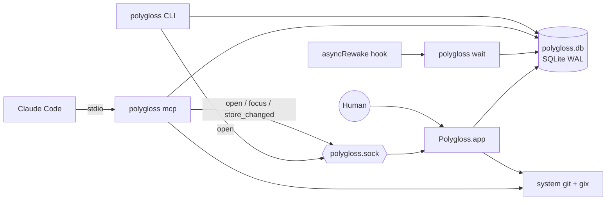
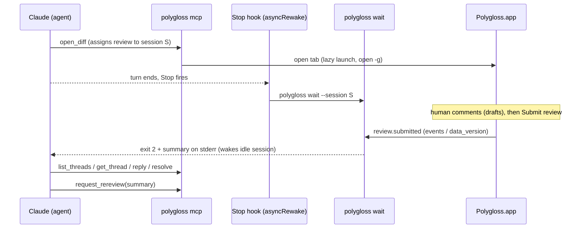

# Polygloss design

> Single source of truth for builders. **Status:** draft for v1, 2026-09-28.
>
> Decisions come from the design log and are recorded as ADRs in [`docs/adr/`](adr/README.md). Anything marked **Provisional** is a default picked where the log is silent. Each one is listed in [§26 Open questions](#26-open-questions) and can change until it is decided.

## Contents

1. [Overview](#1-overview)
2. [Glossary](#2-glossary)
3. [Diff sources and resolution](#3-diff-sources-and-resolution)
4. [Identity](#4-identity)
5. [Snapshots](#5-snapshots)
6. [Git and diff engine](#6-git-and-diff-engine)
7. [Data model (SQLite)](#7-data-model-sqlite)
8. [Comments](#8-comments)
9. [Viewed](#9-viewed)
10. [Live mode](#10-live-mode)
11. [UI](#11-ui)
12. [Performance](#12-performance)
13. [Processes and IPC](#13-processes-and-ipc)
14. [CLI](#14-cli)
15. [MCP surface](#15-mcp-surface)
16. [Claude Code plugin](#16-claude-code-plugin)
17. [Notifications and Dock badge](#17-notifications-and-dock-badge)
18. [Settings and keymap files](#18-settings-and-keymap-files)
19. [Security and privacy](#19-security-and-privacy)
20. [Testing strategy](#20-testing-strategy)
21. [Packaging and distribution](#21-packaging-and-distribution)
22. [Platform scope](#22-platform-scope)
23. [Libraries](#23-libraries)
24. [Repository layout](#24-repository-layout)
25. [Risks](#25-risks)
26. [Open questions](#26-open-questions)

---

## 1. Overview

Polygloss is a native macOS app for reviewing diffs locally, especially code written by coding agents. It works like GitHub's "Files changed" tab and looks like Pierre's diffs (diffs.com): split and unified views, word diff, a **Viewed** checkbox per file, threaded comments that can be resolved, and a batched **Submit review**. Agents take part through a local MCP server. They open diffs for the human, annotate them, wait for the verdict, then reply to threads and resolve them.

Everything is local. Polygloss reads repositories that are already on disk and keeps its state in one SQLite file. It never fetches, never calls a forge API and has no accounts.

### Goals

| #   | Goal                                                                                          | Acceptance (checked by)                                                                                                 |
| --- | --------------------------------------------------------------------------------------------- | ----------------------------------------------------------------------------------------------------------------------- |
| G1  | GitHub-grade review: split/unified, word diff, Viewed, threads, drafts + Submit with verdict  | GPUI E2E + screenshot suites green (plan M3 gate) and the keyboard-only review E2E (plan T5.6)                          |
| G2  | Fast on huge diffs (up to Linux v6.10..v6.11, ~13k files)                                     | Every §12.1 budget met on all four §12.2 corpora in both layouts (`run-perf.ts --check-budgets`, plan T2.9)             |
| G3  | Closed agent loop: agent opens, human reviews, agent wakes, fixes, asks for re-review         | bun MCP/CLI/E2E suites green, and manual wake gate W1–W8 recorded in real Claude Code (§16.4)                           |
| G4  | Deterministic identity: same trees give the same `diff_id` and the same comments in any clone | sha1 + sha256 golden vectors agree in Rust and TypeScript (§4.1); cross-clone test shows the same threads               |
| G5  | Fully offline                                                                                 | Static crate audit (no HTTP crates) and runtime check (no inet sockets during E2E) both pass (§19, plan T5.7)           |
| G6  | Keyboard-first, every binding remappable                                                      | Every §11.9 binding has a passing default-binding test, and a `keymap.json` override rebinds and unbinds it (plan T3.2) |
| G7  | Open source `MIT OR Apache-2.0`; our own code on permissive libraries                         | `cargo deny check licenses` clean (no GPL/AGPL/FSL) and third-party notices cover every shipped crate (§21, plan T5.7)  |

### Non-goals (v1)

| Out of scope                                                                                          | Reference     |
| ----------------------------------------------------------------------------------------------------- | ------------- |
| Any network access for repo data: `git fetch`, GitHub/GitLab APIs, PR import, posting, managed clones | ADR-0005      |
| Acting as a git client: staging, committing, resolving conflicts                                      |               |
| Editing code inside Polygloss; an "Apply suggestion" button (agents apply suggestions)                | ADR-0011      |
| Combined (`--cc`) merge diffs (merge commits diff against the first parent)                           | §3            |
| Image 2-up/swipe diffs, export review as markdown, Vim mode                                           | post-v1       |
| Linux, Windows, Intel Macs, Mac App Store                                                             | ADR-0016/0019 |
| Web, Tauri or Electron shells, embedded web views; forking or vendoring Zed or pierre-native code     | ADR-0001/0003 |
| Multi-user sync, accounts                                                                             |               |

---

## 2. Glossary

| Term                     | Meaning                                                                                                                                                                  |
| ------------------------ | ------------------------------------------------------------------------------------------------------------------------------------------------------------------------ |
| **Repo**                 | A git repository on disk. Its identity is the canonical path of its git common dir, so all linked worktrees of one clone are one repo.                                   |
| **Base / head**          | The old side and new side of a diff. Both are git tree OIDs.                                                                                                             |
| **Diff**                 | The ordered file changes between a base tree and a head tree.                                                                                                            |
| **`diff_id`**            | Content address of a diff: SHA-256 over object format, base tree OID and head tree OID (§4.1). Same trees give the same id in every clone.                               |
| **File change**          | One entry in a diff: status (A/M/D/R/T), old/new path, modes, old/new blob OIDs, rename similarity.                                                                      |
| **Snapshot**             | A tree OID captured from the working tree through a temporary index (§5).                                                                                                |
| **Pin**                  | Making a live snapshot durable: its objects are written into the repo and `refs/polygloss/snapshots/<tree>` keeps them alive.                                            |
| **Review**               | A repo-scoped container for one review intent, such as "feature vs main" or "worktree since merge-base". It groups iterations and owns drafts, submissions and assignee. |
| **Review key**           | The review's stable text key inside its repo, for example `compare:refs/remotes/origin/main...refs/heads/feature` (§4.2).                                                |
| **Iteration**            | One pinned diff inside a review, numbered 1, 2, 3 and so on. A new iteration is recorded when the resolved tree pair changes.                                            |
| **Thread**               | A root comment plus flat replies. It is anchored to lines, a file or the whole review, and its status is open or resolved.                                               |
| **Comment**              | One markdown message in a thread, written by a human or an agent.                                                                                                        |
| **Anchor**               | Where a thread points: `(path, side old/new, start_line..line, blob OID)`. Line numbers are lines of that immutable blob, not positions in a hunk.                       |
| **Draft**                | A human comment (new thread or reply) that agents cannot see yet. Submit review publishes it.                                                                            |
| **Submission**           | One Submit review: all drafts are published at once, together with a summary and a verdict.                                                                              |
| **Verdict**              | `request_changes`, `comment` or `approve`. `approve` tells the agent it is done.                                                                                         |
| **Viewed**               | A human's mark on a file change, keyed by `(path, old_blob, new_blob)` (§9).                                                                                             |
| **Changed since viewed** | The file was marked viewed in an earlier iteration of this review, and its blob pair has changed since.                                                                  |
| **Carry-forward**        | Mapping a thread's lines from its anchor blob into the current blob with a line diff (§8.6).                                                                             |
| **Outdated**             | A thread whose anchored lines changed in the current iteration. It is shown with its original snippet.                                                                   |
| **Agent note**           | A thread an agent creates to explain code. Collapsed by default, and hidden by the "Hide agent notes" toggle.                                                            |
| **Agent question**       | A thread an agent creates to ask the human something. It counts toward "waiting on you" until the human replies or resolves it.                                          |
| **Session**              | One agent session talking to Polygloss: the Claude Code session id, or a generated id for other clients.                                                                 |
| **Assignment**           | The one session a review belongs to: the session that opened it, reassignable. That session receives the wake-up.                                                        |
| **Live review**          | A review whose head is the working tree. It updates when the user clicks Refresh.                                                                                        |

---

## 3. Diff sources and resolution

Every source resolves to `{object_format, base_commit?, base_tree, head_commit?, head_tree}` before anything else runs. Hunks depend only on the two trees, never on refs.

| Source                       | Entry points                                                                     | Base tree                                                                                                           | Head tree                                                              | Review key (§4.2)                                               | Moves when           |
| ---------------------------- | -------------------------------------------------------------------------------- | ------------------------------------------------------------------------------------------------------------------- | ---------------------------------------------------------------------- | --------------------------------------------------------------- | -------------------- |
| Commit                       | `polygloss show <rev>`, ⌘O → commit from log, MCP `open_diff{commit}`            | First parent's tree. Root commit: empty tree. Merge commit: first parent.                                           | The commit's tree                                                      | `commit:<commit_oid>` **Provisional** (OQ-2)                    | never                |
| Compare, three-dot (default) | `polygloss compare <base> <head>`, ⌘O → branch compare, MCP `open_diff{compare}` | Tree of `merge-base(base, head)`                                                                                    | Head's tree                                                            | `compare:<base>...<head>`                                       | either ref moves     |
| Compare, direct              | `polygloss compare <base> <head> --direct`                                       | Base's tree                                                                                                         | Head's tree                                                            | `compare:<base>..<head>`                                        | either ref moves     |
| Branch compare as PR         | `compare … --label "PR #123"`, MCP `label`                                       | As three-dot                                                                                                        | As three-dot                                                           | Same key as the compare; the label is display only              | either ref moves     |
| Live worktree                | `polygloss` inside a worktree, ⌘O → Live, MCP `open_diff{live}`                  | `since=merge-base` (default): tree of `merge-base(HEAD, origin/<default>)`. `since=HEAD`. `since=<commit>` (fixed). | Snapshot of the working tree: tracked plus untracked, not ignored (§5) | `worktree:<repo>@<branch>#since=merge-base\|HEAD\|<commit_oid>` | user refreshes (§10) |

Resolution rules:

- **Revisions:** `git rev-parse --verify --end-of-options <rev>^{commit}`. Ref inputs are stored by full name (`git rev-parse --symbolic-full-name`). If the input is an OID or not a ref, the key uses the commit OID, so that review never moves.
- **Default branch:** detected offline from `refs/remotes/origin/HEAD` (`git symbolic-ref`). **Provisional** fallback (OQ-5): `origin/main`, `origin/master`, `main`, `master`, then `since=HEAD` with a notice.
- **Merge-base:** for compares, no common ancestor is an error that suggests `--direct` (in a shallow clone it is `objects_missing`, since the merge base is most likely beyond the boundary). For live `since=merge-base`, it falls back to HEAD as the base with a notice, like the default-branch chain (in a shallow clone the notice blames the missing history). The review key keeps `since=merge-base`, so the review does not split once a merge base exists; an unborn HEAD uses the empty tree as base (**Provisional**, plan OQ-P5). If there are several merge bases, use git's first result and show a warning (**Provisional**).
- **Empty tree:** sha1 `4b825dc642cb6eb9a060e54bf8d69288fbee4904`, sha256 `6ef19b41225c5369f1c104d45d8d85efa9b057b53b14b4b9b939dd74decc5321` (both checked with git 2.54).
- **PRs are branch compares.** Polygloss only compares refs that already exist locally. The user or agent runs `gh pr checkout` or `git fetch` themselves.
- **Provenance:** requested refs, commit OIDs and resolved ref names are stored on the iteration. They never feed `diff_id`.
- **Submodules** (mode `160000`) show as one line `abc1234 → def5678` and are never recursed.

---

## 4. Identity

### 4.1 `diff_id`

```text
diff_id = lowercase_hex( sha256( "polygloss/diff/v1\n" + objfmt + "\n" + base_tree + "\n" + head_tree ) )

objfmt     = "sha1" | "sha256"           # git rev-parse --show-object-format
base_tree  = lowercase hex tree OID      # 40 chars (sha1) or 64 (sha256)
head_tree  = lowercase hex tree OID
```

| Property                   | Rule                                                                                                                                                                            |
| -------------------------- | ------------------------------------------------------------------------------------------------------------------------------------------------------------------------------- |
| Trees, not commits         | Amend, reword and no-op rebase keep the `diff_id`, so comments and Viewed state survive them (ADR-0006).                                                                        |
| No repo component          | Any clone or worktree that has both trees opens the same diff and sees the same threads and Viewed marks.                                                                       |
| View options are not in it | Whitespace, algorithm, split/unified, context, word/char and rename settings are view settings. Anchors are blob line numbers, so they do not depend on how hunks are computed. |
| Versioned                  | The `v1` prefix names the scheme. A new encoding means a new prefix plus a migration.                                                                                           |
| Encoding                   | Field separators and output form are **Provisional** (OQ-1). The log fixes the fields and their order. Frozen at the first public release.                                      |
| Display                    | UI shows the first 12 hex chars. Inputs accept any unique prefix of at least 8 chars (**Provisional**).                                                                         |
| Tests                      | Golden vectors for sha1 and sha256 repos in `polygloss-core`.                                                                                                                   |

Opening by id (`polygloss open`, `polygloss://diff/<id>`) finds a repo that has both trees. It tries the cwd repo, then repos whose iterations reference the id, then every known repo, and checks each with `git cat-file -e`.

### 4.2 Review keys

Reviews are unique per `(repo_id, key)`. `review_id` is a UUIDv7 (**Provisional**).

| Kind            | Key grammar                                 | Example                                                       |
| --------------- | ------------------------------------------- | ------------------------------------------------------------- |
| live            | `worktree:<worktree>@<branch>#since=<base>` | `worktree:/Users/d/src/app@feature/login#since=merge-base`    |
| compare (3-dot) | `compare:<base_ref>...<head_ref>`           | `compare:refs/remotes/origin/main...refs/heads/feature/login` |
| compare (2-dot) | `compare:<base_ref>..<head_ref>`            | `compare:refs/heads/main..refs/heads/spike`                   |
| commit          | `commit:<commit_oid>` **Provisional**       | `commit:9f1c…`                                                |

- `<worktree>` is the canonical worktree root path. It keeps linked worktrees of one repo apart. `<branch>` is the short branch name, or `detached` on a detached HEAD (**Provisional**, OQ-3).
- `<base>` is `merge-base`, `HEAD` or a full commit OID. Each base is its own review.
- The "PR" label lives in `reviews.label` and is not part of the key. The earlier key form `github.com/owner/repo#N` is superseded (ADR-0005, ADR-0007).

### 4.3 Repo identity

`repo identity = realpath(git rev-parse --path-format=absolute --git-common-dir)`

- Linked worktrees collapse into one repo row.
- Moving or renaming a clone creates a new repo row. The old reviews stay in recents as orphans and can be pruned. Their threads still show up wherever the same `diff_id` is opened (§8.6).

### 4.4 Other identifiers

| Id                                                      | Form                                                                                                       |
| ------------------------------------------------------- | ---------------------------------------------------------------------------------------------------------- |
| `thread_id`, `comment_id`, `submission_id`, `review_id` | UUIDv7 text (**Provisional**)                                                                              |
| Event cursor                                            | `events.seq`: an integer that only grows                                                                   |
| Session id                                              | `CLAUDE_CODE_SESSION_ID` when set, otherwise `pg-<uuidv7>` per MCP process or `--session` for the JSON CLI |

---

## 5. Snapshots

A snapshot turns the working tree into a tree OID. It never touches the user's index, HEAD or refs (other than `refs/polygloss/*`), and nothing is written to the repo until the state is pinned.

### 5.1 Mechanism

| Step | Unpinned live state (every recompute)                                                                                                                                                                                                                                                                                                                   |
| ---- | ------------------------------------------------------------------------------------------------------------------------------------------------------------------------------------------------------------------------------------------------------------------------------------------------------------------------------------------------------- |
| 1    | Copy `$GIT_DIR/index` to `~/Library/Caches/polygloss/scratch/<repo-hash>/<worktree-hash>/index` (objects are shared per repo in `scratch/<repo-hash>/objects/`). The temp index must live **outside the worktree**, or `add -A` picks it up. The copy reuses git's stat cache, so only changed files get hashed.                                        |
| 2    | With `GIT_INDEX_FILE=<scratch index>`, `GIT_OBJECT_DIRECTORY=<scratch>/objects` (whose `info/alternates` file points at the repo objects dir; the `GIT_ALTERNATE_OBJECT_DIRECTORIES` list form breaks on paths containing `:`), `core.splitIndex=false` and `GIT_OPTIONAL_LOCKS=0`, run `git add -A`, then `git write-tree`. The result is `head_tree`. |
| 3    | New blobs and trees go only to the scratch store. The repo's `.git` is unchanged (checked: object count, `git status` and every file's bytes identical before and after; git only bumps the mtime of existing objects it finds through the alternate).                                                                                                  |
| 4    | Structure (`diff-tree`, §6) runs with the same environment so both trees can be read.                                                                                                                                                                                                                                                                   |
| 5    | The scratch store is cleared once no displayed state needs it. Keep the last 2 states per worktree (**Provisional**).                                                                                                                                                                                                                                   |

This is the **Provisional** mechanism for the log's "content-hashed in memory, written to git only when pinned" (OQ-4). It gives exactly the OIDs, filters and rename pairs that a real `git add -A` would, so unpinned and pinned states agree on `diff_id` and on Viewed keys.

| Step | Pin                                                                                                                                                                       |
| ---- | ------------------------------------------------------------------------------------------------------------------------------------------------------------------------- |
| 1    | Copy the objects reachable from `head_tree` that the repo lacks from the scratch store into the repo's object store. Write only if absent; the loose format is identical. |
| 2    | `git update-ref refs/polygloss/snapshots/<head_tree> <head_tree>`. A ref can point straight at a tree, and it survives `git gc --prune=now` (checked).                    |
| 3    | Record the iteration: review, `diff_id`, `snapshot_ref`, `pinned_by`.                                                                                                     |

### 5.2 Pin triggers

| Trigger                                                                                | Actor | `pinned_by`                 |
| -------------------------------------------------------------------------------------- | ----- | --------------------------- |
| A draft or comment is added to a live diff                                             | human | `comment`                   |
| An agent needs a durable id: `open_diff`, `create_comment`, `request_rereview` on live | agent | `agent` / `rereview`        |
| Explicit **Snapshot** command                                                          | human | `manual`                    |
| Submit review (so "changes since last review" has a fixed old head)                    | human | `submit`                    |
| Toggling Viewed                                                                        | —     | never pins (keys are blobs) |

### 5.3 Retention and guards

- A snapshot ref is kept while any iteration references it. The "Prune old reviews" setting deletes reviews, then deletes snapshot refs nothing references anymore. Pins and prunes of one repo hold an exclusive advisory lock (`locks/repo-<hash>.lock` in the data dir, §13.2), from creating the ref until the iteration naming it commits, and from reading the referenced set until the refs are deleted, so a prune never deletes the ref of a pin in flight. Polygloss never runs `git gc` itself (**Provisional**).
- A fixed `since=<commit>` base also gets a ref (`refs/polygloss/snapshots/<base_tree>`) so it cannot be collected (**Provisional**). Commit and compare iterations rely on the user's own refs; if those objects are gone, the UI says "objects no longer available".
- `git add -A` runs the repo's configured clean filters. git-lfs, for example, may write to `.git/lfs/objects`. Documented as a risk (§25).
- If `index.lock` exists while copying the index, retry after the next debounce.
- Never use `git stash`. Never modify HEAD, the real index or any ref outside `refs/polygloss/`.

---

## 6. Git and diff engine

### 6.1 Division of work (ADR-0014)

| Concern                                         | Tool                                                                                                                                                            | Why                                                                                |
| ----------------------------------------------- | --------------------------------------------------------------------------------------------------------------------------------------------------------------- | ---------------------------------------------------------------------------------- |
| Revs, merge-base, default branch, object format | git CLI: `rev-parse`, `merge-base`, `symbolic-ref`                                                                                                              | Exact git semantics                                                                |
| File list and renames                           | `git diff-tree -r -z --raw -M50% -l1000 --no-ext-diff --no-textconv <base_tree> <head_tree>`                                                                    | Git-exact rename pairing; 171 ms on Linux v6.10..v6.11 (13,283 paths, 173 renames) |
| Snapshots                                       | git CLI `add -A` + `write-tree` with a temp index (§5)                                                                                                          | Uses the user's ignore rules and filters                                           |
| Blob reads                                      | gix 0.88, in process; the object handle includes the scratch store as an alternate                                                                              | No subprocess per blob                                                             |
| Hunks                                           | gix-imara-diff 0.3, used directly (`postprocess_lines` = git's indent/slider heuristic; no `gix-diff`). Myers + indent heuristic by default, Histogram optional | Same output whatever the user's git version or config                              |
| Word/char diff, line mapping                    | gix-imara-diff                                                                                                                                                  | One engine for hunks, word ranges, carry-forward and open-in-editor mapping        |
| Binary detection                                | NUL byte in the first 8,000 bytes (git's rule), plus `binary` / `-diff` attributes read from the head tree                                                      | Consistent with git                                                                |
| Generated detection                             | `linguist-generated` attribute from the head tree plus a built-in list (lockfiles, `*.min.js`, …)                                                               | GitHub-like collapsing                                                             |
| Syntax highlighting                             | lumis 0.15 (§11.11)                                                                                                                                             |                                                                                    |

The earlier plan (git ≥ 2.50 `diff-pairs` patches parsed in Rust) is superseded. Git produces structure only.

### 6.2 Git invocation rules

- Use the **system git**, never a bundled one, so no GPL code ships (ADR-0004). Minimum version is **Provisional** 2.39 (the Xcode Command Line Tools git, OQ-6). Check it at startup and show a clear error.
- Flags on every call: `-z`, `-c core.quotePath=false`, `--no-ext-diff`, `--no-textconv`, and explicit `-M50% -l1000`. The last two pin git's defaults so a user `diff.renameLimit` cannot leak in. Copy detection (`-C`) is off, so copies show as adds.
- Environment on every call: `GIT_OPTIONAL_LOCKS=0` (never take `index.lock` during refresh), `GIT_TERMINAL_PROMPT=0`, `GIT_NO_LAZY_FETCH=1`, `GIT_ALLOW_PROTOCOL=` (empty), `GIT_NO_REPLACE_OBJECTS=1`, `LC_ALL=C`, and `-c protocol.allow=never`. With `GIT_NO_LAZY_FETCH` and no allowed transport, a partial clone fails to read a missing object instead of fetching it (ADR-0005). The empty `GIT_ALLOW_PROTOCOL` matters because `protocol.<name>.allow` in user config or inherited `GIT_CONFIG_*` overrides `protocol.allow=never`, and git before 2.44 ignores `GIT_NO_LAZY_FETCH`. `GIT_NO_REPLACE_OBJECTS` keeps `refs/replace/*` (not shared between clones) out of resolved trees and so out of `diff_id`.
- Inherited `GIT_DIR`, `GIT_WORK_TREE`, `GIT_INDEX_FILE`, `GIT_OBJECT_DIRECTORY`, `GIT_COMMON_DIR`, `GIT_ALTERNATE_OBJECT_DIRECTORIES`, `GIT_CONFIG_PARAMETERS` and `GIT_CONFIG_COUNT` are cleared, because agents, hooks and `git -c` parents often export them. Snapshots (§5) set some of them on purpose.
- The user's global and system config are **not** disabled. Global `core.excludesFile` and filters such as LFS must apply to snapshots. The outputs we depend on are pinned by flags instead.
- Git runs on the GPUI background executor in the app and on worker threads in the CLI, never on the UI thread. Requests that go stale are cancelled.
- The `diff-tree` result is stored in `file_changes` (§7). A diff's structure then stays stable even if a later git version pairs renames differently. Non-default rename settings are computed on the fly and not stored.

### 6.3 Hunks and word diff

| Topic      | Rule                                                                                                                                                                                                                                                                                                |
| ---------- | --------------------------------------------------------------------------------------------------------------------------------------------------------------------------------------------------------------------------------------------------------------------------------------------------- |
| Algorithm  | Myers + indent/slider heuristic (GitHub-like) by default; Histogram as a setting.                                                                                                                                                                                                                   |
| Context    | 3 lines. Hunks merge when the unchanged gap is 7 lines or less, like `git diff -U3 --inter-hunk-context=1`, which matched GitHub on 519 of 519 files in research (**Provisional** parity target).                                                                                                   |
| When       | Lazily per file, for files near the viewport, on background threads. Cached by `(old_blob, new_blob, algorithm, whitespace)`.                                                                                                                                                                       |
| Whitespace | `w` hides whitespace by diffing whitespace-normalized lines. Anchors do not change.                                                                                                                                                                                                                 |
| Word diff  | Every modified line pair. Removed and added lines in a change block pair up in order, GitHub-style (**Provisional** pairing). Granularity: words (default) or chars. Lines over 1,000 chars get no word diff (**Provisional**).                                                                     |
| Counts     | Additions and deletions for every file are computed in the background after first paint and fill in progressively.                                                                                                                                                                                  |
| Parity     | CI compares imara hunks with `git diff -U3 --inter-hunk-context=1 --diff-algorithm=myers --indent-heuristic` on real repos. Target: at least 99.9% of files identical (**Provisional**). Mismatches are reviewed as snapshots. In research, imara histogram differed from git on 7 of 13,283 files. |

### 6.4 Special files

| Kind             | Detection                             | Rendering                                                             |
| ---------------- | ------------------------------------- | --------------------------------------------------------------------- |
| Rename           | raw status `R<score>`                 | Header `old/path → new/path` and similarity; body diffs the two blobs |
| Mode-only change | modes differ, blobs equal             | Header badge `100644 → 100755`, no body                               |
| Binary           | NUL heuristic or attribute            | Placeholder "Binary file · 12.0 KB → 14.2 KB"                         |
| Symlink          | mode `120000`                         | Target text diff plus a `symlink` badge                               |
| Submodule        | mode `160000`                         | One line: `abc1234 → def5678`                                         |
| Generated        | `linguist-generated` or built-in list | Collapsed, with "Load diff"                                           |
| Large            | more than ~20k changed lines          | Collapsed, with "Load diff"                                           |
| LFS pointer      | pointer text in the blob              | Pointer shown as text, `LFS` badge (**Provisional**)                  |
| Merge commit     | more than one parent                  | Diff against the first parent                                         |

---

## 7. Data model (SQLite)

### 7.1 Store rules (ADR-0015)

| Topic               | Rule                                                                                                                                                                                                                                                                             |
| ------------------- | -------------------------------------------------------------------------------------------------------------------------------------------------------------------------------------------------------------------------------------------------------------------------------- |
| File                | `~/Library/Application Support/polygloss/polygloss.db`, directory mode `0700`, file `0600`. `POLYGLOSS_DATA_DIR` overrides the directory for tests (**Provisional** name).                                                                                                       |
| Shared by           | The app, the CLI, `polygloss mcp` and `polygloss wait` all open it directly. No process proxies another.                                                                                                                                                                         |
| Binding             | rusqlite 0.40 with the `bundled` feature.                                                                                                                                                                                                                                        |
| Bootstrap order     | `busy_timeout=5000` first, then `journal_mode=WAL` in a retry loop on `SQLITE_BUSY` (a fresh file can return BUSY without calling the busy handler), then `synchronous=NORMAL` and `foreign_keys=ON`.                                                                            |
| Writes              | Always `BEGIN IMMEDIATE` (`TransactionBehavior::Immediate`). Every mutation appends its `events` row in the same transaction.                                                                                                                                                    |
| Checkpoints         | Periodic `wal_checkpoint(PASSIVE)` and a `journal_size_limit`, so a long-lived reader cannot starve checkpoints.                                                                                                                                                                 |
| Migrations          | rusqlite_migration 2.6 on `user_version`, run while holding `std::fs::File::lock` on `polygloss.db.lock`. Take a `VACUUM INTO` backup before migrating. Run `PRAGMA quick_check` when the app starts.                                                                            |
| Change notification | A dedicated read connection polls `PRAGMA data_version` (about 1.3 µs per poll), every 150 ms while focused and 1 s in the background (**Provisional**), then reads `events` after the last seen `seq`. Writers also send `store_changed` over the socket if the app is running. |
| Conventions         | Timestamps are INTEGER Unix milliseconds (UTC). Ids are TEXT. Booleans are INTEGER 0/1. Paths are git paths as UTF-8 TEXT; non-UTF-8 paths are an open question (OQ-25).                                                                                                         |

### 7.2 Schema (v1)

```sql
-- One row per git common dir (worktrees collapse).
CREATE TABLE repos (
  id             INTEGER PRIMARY KEY,
  common_dir     TEXT    NOT NULL UNIQUE,        -- realpath of git common dir
  display_name   TEXT    NOT NULL,               -- basename of main worktree
  object_format  TEXT    NOT NULL CHECK (object_format IN ('sha1','sha256')),
  default_branch TEXT,                           -- cached target of refs/remotes/origin/HEAD
  created_at     INTEGER NOT NULL,
  last_opened_at INTEGER NOT NULL
);

-- Immutable diffs, keyed by diff_id.
CREATE TABLE diffs (
  id            TEXT    PRIMARY KEY,             -- diff_id, 64 hex chars
  object_format TEXT    NOT NULL,
  base_tree     TEXT    NOT NULL,
  head_tree     TEXT    NOT NULL,
  files_count   INTEGER,                         -- filled after diff-tree
  additions     INTEGER,                         -- filled progressively
  deletions     INTEGER,
  created_at    INTEGER NOT NULL
);

-- diff-tree output, stored once per diff so structure stays stable.
CREATE TABLE file_changes (
  diff_id    TEXT    NOT NULL REFERENCES diffs(id) ON DELETE CASCADE,
  idx        INTEGER NOT NULL,                   -- order in diff-tree output
  status     TEXT    NOT NULL CHECK (status IN ('A','M','D','R','T')),
  old_path   TEXT,                               -- NULL for A
  new_path   TEXT,                               -- NULL for D
  old_mode   TEXT,
  new_mode   TEXT,
  old_blob   TEXT    NOT NULL,                   -- all-zero OID when absent
  new_blob   TEXT    NOT NULL,
  similarity INTEGER,                            -- renames only
  kind       TEXT    NOT NULL DEFAULT 'text'
             CHECK (kind IN ('text','binary','symlink','submodule')),
  generated  INTEGER NOT NULL DEFAULT 0,
  additions  INTEGER,                            -- NULL until computed (default algorithm)
  deletions  INTEGER,
  PRIMARY KEY (diff_id, idx)
);
CREATE INDEX file_changes_new_path ON file_changes(diff_id, new_path);
CREATE INDEX file_changes_old_path ON file_changes(diff_id, old_path);

CREATE TABLE reviews (
  id               TEXT    PRIMARY KEY,          -- UUIDv7
  repo_id          INTEGER NOT NULL REFERENCES repos(id),
  key              TEXT    NOT NULL,             -- §4.2
  kind             TEXT    NOT NULL CHECK (kind IN ('live','compare','commit')),
  label            TEXT,                         -- e.g. 'PR #123'
  base_spec        TEXT,                         -- normalized input refs/revs
  head_spec        TEXT,
  compare_mode     TEXT    CHECK (compare_mode IN ('three-dot','direct')),
  since            TEXT,                         -- live: 'merge-base' | 'HEAD' | commit OID
  worktree_path    TEXT,                         -- live only
  status           TEXT    NOT NULL DEFAULT 'open'
                   CHECK (status IN ('open','changes_requested','commented','approved','rereview_requested')),
  rereview_summary TEXT,
  rereview_at      INTEGER,
  muted            INTEGER NOT NULL DEFAULT 0,
  last_seen_seq    INTEGER NOT NULL DEFAULT 0,   -- human has seen events up to here
  created_at       INTEGER NOT NULL,
  updated_at       INTEGER NOT NULL,             -- last activity
  archived_at      INTEGER,
  UNIQUE (repo_id, key)
);
CREATE INDEX reviews_recent ON reviews(archived_at, updated_at DESC);

CREATE TABLE iterations (
  id           INTEGER PRIMARY KEY,
  review_id    TEXT    NOT NULL REFERENCES reviews(id) ON DELETE CASCADE,
  seq          INTEGER NOT NULL,                 -- 1-based within review
  diff_id      TEXT    NOT NULL REFERENCES diffs(id),
  base_commit  TEXT,                             -- provenance
  head_commit  TEXT,                             -- NULL for live
  base_ref     TEXT,
  head_ref     TEXT,
  snapshot_ref TEXT,                             -- refs/polygloss/snapshots/<tree>
  pinned_by    TEXT    NOT NULL
               CHECK (pinned_by IN ('open','refresh','comment','agent','manual','submit','rereview')),
  created_at   INTEGER NOT NULL,
  UNIQUE (review_id, seq)
);
CREATE INDEX iterations_diff ON iterations(diff_id);

CREATE TABLE viewed_files (
  path      TEXT    NOT NULL,
  old_blob  TEXT    NOT NULL,
  new_blob  TEXT    NOT NULL,
  review_id TEXT    REFERENCES reviews(id) ON DELETE SET NULL,  -- where marked
  viewed_at INTEGER NOT NULL,
  PRIMARY KEY (path, old_blob, new_blob)
) WITHOUT ROWID;
CREATE INDEX viewed_files_review ON viewed_files(review_id, path);

CREATE TABLE sessions (
  id             TEXT    PRIMARY KEY,            -- CLAUDE_CODE_SESSION_ID or 'pg-<uuidv7>'
  canonical_id   TEXT    REFERENCES sessions(id), -- set when linked after id drift (§16.4)
  client_name    TEXT    NOT NULL,               -- MCP clientInfo.name, e.g. 'claude-code'; 'cli'
  client_version TEXT,
  owner_pid      INTEGER,                        -- agent host process (Provisional, §16.4)
  cwd            TEXT,
  last_woken_seq INTEGER NOT NULL DEFAULT 0,     -- dedupes wake-ups
  first_seen_at  INTEGER NOT NULL,
  last_seen_at   INTEGER NOT NULL
);

CREATE TABLE review_assignments (
  review_id   TEXT    PRIMARY KEY REFERENCES reviews(id) ON DELETE CASCADE,
  session_id  TEXT    NOT NULL REFERENCES sessions(id),
  assigned_at INTEGER NOT NULL,
  assigned_by TEXT    NOT NULL CHECK (assigned_by IN ('open_diff','human','agent'))
);
CREATE INDEX review_assignments_session ON review_assignments(session_id);

CREATE TABLE waiters (                           -- live `polygloss wait` processes
  session_id  TEXT    PRIMARY KEY REFERENCES sessions(id) ON DELETE CASCADE,
  pid         INTEGER NOT NULL,
  started_at  INTEGER NOT NULL,
  deadline_at INTEGER NOT NULL
);

CREATE TABLE threads (
  id                  TEXT    PRIMARY KEY,       -- UUIDv7
  review_id           TEXT    REFERENCES reviews(id) ON DELETE CASCADE,
  origin_diff_id      TEXT    NOT NULL REFERENCES diffs(id),
  origin_iteration_id INTEGER REFERENCES iterations(id) ON DELETE SET NULL,
  subject             TEXT    NOT NULL CHECK (subject IN ('line','file','review')),
  kind                TEXT    NOT NULL DEFAULT 'comment' CHECK (kind IN ('comment','note','question')),
  path                TEXT,                      -- line/file subjects
  side                TEXT    CHECK (side IN ('old','new')),
  start_line          INTEGER,                   -- 1-based, inclusive; = line for single lines
  line                INTEGER,
  anchor_blob         TEXT,                      -- blob the line numbers refer to
  anchor_snippet      TEXT,                      -- anchored lines + 3 lines context, for outdated display
  status              TEXT    NOT NULL DEFAULT 'open' CHECK (status IN ('open','resolved')),
  resolved_by_kind    TEXT    CHECK (resolved_by_kind IN ('human','agent')),
  resolved_by_name    TEXT,
  resolved_at         INTEGER,
  created_by_kind     TEXT    NOT NULL CHECK (created_by_kind IN ('human','agent')),
  created_by_name     TEXT    NOT NULL,
  created_at          INTEGER NOT NULL,
  updated_at          INTEGER NOT NULL,
  CHECK (subject <> 'line' OR (path IS NOT NULL AND side IS NOT NULL
                               AND start_line IS NOT NULL AND line IS NOT NULL
                               AND line >= start_line AND anchor_blob IS NOT NULL)),
  CHECK (subject <> 'file' OR path IS NOT NULL),
  CHECK (kind = 'comment' OR created_by_kind = 'agent')
);
CREATE INDEX threads_review ON threads(review_id, status);
CREATE INDEX threads_origin_diff ON threads(origin_diff_id);

CREATE TABLE review_submissions (
  id            TEXT    PRIMARY KEY,             -- UUIDv7
  review_id     TEXT    NOT NULL REFERENCES reviews(id) ON DELETE CASCADE,
  iteration_id  INTEGER NOT NULL REFERENCES iterations(id),
  verdict       TEXT    NOT NULL CHECK (verdict IN ('request_changes','comment','approve')),
  summary_md    TEXT    NOT NULL DEFAULT '',
  comment_count INTEGER NOT NULL,                -- drafts published by this submission
  submitted_at  INTEGER NOT NULL
);
CREATE INDEX review_submissions_review ON review_submissions(review_id, submitted_at);

CREATE TABLE comments (
  id            TEXT    PRIMARY KEY,             -- UUIDv7
  thread_id     TEXT    NOT NULL REFERENCES threads(id) ON DELETE CASCADE,
  author_kind   TEXT    NOT NULL CHECK (author_kind IN ('human','agent')),
  author_name   TEXT    NOT NULL,                -- 'you' or clientInfo.name
  session_id    TEXT    REFERENCES sessions(id),
  body_md       TEXT    NOT NULL,
  submission_id TEXT    REFERENCES review_submissions(id),
  published_at  INTEGER,                         -- NULL = draft (humans only)
  created_at    INTEGER NOT NULL,
  edited_at     INTEGER,
  deleted_at    INTEGER,                         -- soft delete (Provisional)
  CHECK (author_kind = 'human' OR published_at IS NOT NULL)
);
CREATE INDEX comments_thread ON comments(thread_id, created_at);
CREATE INDEX comments_drafts ON comments(thread_id) WHERE published_at IS NULL;

CREATE TABLE review_drafts (                     -- autosaved Submit dialog
  review_id  TEXT    PRIMARY KEY REFERENCES reviews(id) ON DELETE CASCADE,
  summary_md TEXT    NOT NULL DEFAULT '',
  verdict    TEXT    CHECK (verdict IN ('request_changes','comment','approve')),
  updated_at INTEGER NOT NULL
);

CREATE TABLE thread_positions (                  -- carry-forward cache (§8.6)
  thread_id      TEXT    NOT NULL REFERENCES threads(id) ON DELETE CASCADE,
  diff_id        TEXT    NOT NULL REFERENCES diffs(id) ON DELETE CASCADE,
  state          TEXT    NOT NULL CHECK (state IN ('exact','moved','outdated','absent')),
  path           TEXT,
  side           TEXT,
  start_line     INTEGER,                        -- mapped range (nearest line when outdated)
  line           INTEGER,
  engine_version INTEGER NOT NULL,               -- recompute when the mapper changes
  PRIMARY KEY (thread_id, diff_id)
) WITHOUT ROWID;

CREATE TABLE events (                            -- append-only; no FKs so it outlives rows
  seq        INTEGER PRIMARY KEY AUTOINCREMENT,
  at         INTEGER NOT NULL,
  kind       TEXT    NOT NULL,                   -- see table below
  review_id  TEXT,
  diff_id    TEXT,
  thread_id  TEXT,
  comment_id TEXT,
  actor_kind TEXT    NOT NULL CHECK (actor_kind IN ('human','agent','system')),
  actor_name TEXT,
  session_id TEXT,
  payload    TEXT                                -- JSON
);
CREATE INDEX events_review ON events(review_id, seq);
CREATE INDEX events_thread ON events(thread_id, seq);

CREATE TABLE view_state (                        -- per diff_id (§11.12)
  diff_id    TEXT    PRIMARY KEY REFERENCES diffs(id) ON DELETE CASCADE,
  state_json TEXT    NOT NULL,                   -- versioned JSON, see below
  updated_at INTEGER NOT NULL
);
```

`view_state.state_json` (v1): `{ "v": 1, "scroll_anchor": { "path", "side", "line" }, "collapsed": [path], "expanded": { path: [[start, end]] }, "layout": "split" | "unified" | null, "tree_expanded": [dir], "composer": { key: text } }`.

### 7.3 Events

| `kind`                                     | Actor        | Seen by agents | Payload                                                     |
| ------------------------------------------ | ------------ | -------------- | ----------------------------------------------------------- |
| `review.created`, `review.archived`        | any          | yes            | `key`, `kind` (+ `pruned: true` when the review was pruned) |
| `iteration.created`                        | any          | yes            | `seq`, `diff_id`, `pinned_by`                               |
| `thread.created`                           | human, agent | yes            | `kind`, `subject`                                           |
| `comment.created` / `.edited` / `.deleted` | human, agent | yes            | —                                                           |
| `thread.resolved` / `thread.unresolved`    | human, agent | yes            | —                                                           |
| `review.submitted`                         | human        | yes            | `submission_id`, `verdict`                                  |
| `review.rereview_requested`                | agent        | yes            | `summary`                                                   |
| `review.assigned`                          | any          | yes            | `session_id`                                                |
| `viewed.changed`                           | human        | no             | `path`, blobs, `viewed`                                     |
| `draft.changed`                            | human        | **no**         | app-internal                                                |

Human `thread.created` and `comment.created` events are written when a submission publishes them, not when the draft is saved.

### 7.4 Deletion

- Pruning a review cascades to its iterations, submissions, assignment, drafts and threads (**Provisional**, OQ-24). Diffs and `file_changes` go when no iteration or thread references them.
- An orphaned review (the clone moved) is never deleted automatically.

---

## 8. Comments

### 8.1 Anchors

| Subject | Stored fields                                          | GitHub projection (MCP/JSON)        |
| ------- | ------------------------------------------------------ | ----------------------------------- |
| Line    | `path`, `side`, `line` (= `start_line`), `anchor_blob` | `side` LEFT/RIGHT, `line`           |
| Range   | plus `start_line < line`, same side                    | `start_line`, `start_side` = `side` |
| File    | `path`                                                 | `subject_type: file`                |
| Review  | —                                                      | review-level comment                |

- Line numbers are 1-based lines of `anchor_blob`: the old-side blob for `side=old`, the new-side blob for `side=new`. They are not hunk positions.
- Any displayed line can be anchored: changed lines, context lines and expanded context.
- A range is contiguous lines on one side. A deleted file anchors `old`; an added file anchors `new`.

### 8.2 Threads, status, authorship

| Rule          | Detail                                                                                                                                                                                                            |
| ------------- | ----------------------------------------------------------------------------------------------------------------------------------------------------------------------------------------------------------------- |
| Shape         | A root comment plus flat replies. No nesting.                                                                                                                                                                     |
| Status        | `open` or `resolved`. Humans and agents can both resolve and unresolve. Who and when are recorded. Takes effect immediately, not as a draft (**Provisional**, OQ-10).                                             |
| Authors       | `human` (shown as "you") or `agent`, named from MCP `clientInfo.name` such as `claude-code`, with an agent badge.                                                                                                 |
| Bodies        | Markdown. Authors, human or agent, edit and delete only their own comments. Agents do it through MCP `edit_comment` / `delete_comment`; "own" for an agent means the same `author_name` (**Provisional**, OQ-30). |
| Delete        | Deleting a draft removes it. Deleting a published comment that has replies leaves a "comment deleted" placeholder (**Provisional**).                                                                              |
| Derived state | Outdated (§8.6), awaiting you, awaiting agent. These are computed, never stored.                                                                                                                                  |

### 8.3 Drafts and Submit review (ADR-0011)

1. A human's new threads and replies are **drafts**. They show a Draft badge in the app and are invisible to MCP, the JSON CLI and waiters.
2. `c` opens the composer. `⌘⏎` saves a draft and `Esc` cancels. Unsaved composer text is autosaved in `view_state` (**Provisional**). File-level threads start from the file header's ⋯ menu ("Comment on file"); review-level threads start from the threads panel ("Comment on review"). Both are also palette actions (**Provisional**, OQ-31).
3. **Submit review** (`⌘⇧⏎`, or the toolbar button that shows the draft count) opens a dialog with a markdown summary (optional) and a verdict: Request changes, Comment or Approve. Submitting with zero drafts is allowed, for example to approve.
4. Submitting pins a live state first (§5.2). Then one transaction publishes every draft of the review, writes `review_submissions`, sets `reviews.status`, and appends `review.submitted`, which wakes waiters.
5. Agent comments and replies are **never drafts**. The app shows the banner "claude-code replied to N threads", where N counts events after `reviews.last_seen_seq`.

### 8.4 Agent notes and questions (ADR-0020)

| Kind       | Created by               | Display                                                               | Counts toward "waiting on you"                             | Draft?               |
| ---------- | ------------------------ | --------------------------------------------------------------------- | ---------------------------------------------------------- | -------------------- |
| `note`     | agent (`create_comment`) | Collapsed to a one-line chip by default; "Hide agent notes" hides all | no                                                         | never                |
| `question` | agent (`create_comment`) | Expanded, with a question badge                                       | yes, until the human replies (submitted) or it is resolved | never                |
| `comment`  | human                    | Normal thread                                                         | —                                                          | yes, until submitted |

- The cap is **50 agent-created threads per iteration** (the log says "~50"; exact number and scope are **Provisional**, OQ-13). Replies do not count. Going over returns `cap_exceeded`.
- Guided tour pattern: `open_diff`, then annotate with notes, then `wait_for_review`.

### 8.5 Suggestion blocks

- A ` ```suggestion ` fenced block in a comment proposes a replacement for the thread's anchored **new-side** lines `start_line..line`.
- The app renders it as a mini-diff: anchored lines versus the suggested text. On old-side or file-level anchors it renders as a plain code block (**Provisional**).
- MCP `get_thread` returns it structurally: `{comment_id, path, start_line, line, original, replacement}`.
- The agent applies suggestions by editing files itself. There is no Apply button in v1.

### 8.6 Carry-forward and outdated (ADR-0010)

Which threads a review tab shows for iteration I (diff D): `threads.review_id = R`, plus `threads.origin_diff_id = D` (the same diff opened in another review or clone).

```text
position(thread T, diff D):
  review subject        -> review panel
  file = file change in D where new_path = T.path
         or (status R and old_path = T.path)          # follow renames
  file missing          -> absent   (threads panel only)
  file subject          -> exact    (on the file header)
  cur = file.new_blob if T.side = new else file.old_blob
  cur == T.anchor_blob  -> exact    (same lines)
  map T.start_line..T.line through imara(T.anchor_blob -> cur):
    all lines in one equal region -> moved    (new line numbers)
    otherwise                     -> outdated (original snippet; placed at nearest mapped line)
  cache in thread_positions(T, D, engine_version)
```

- This applies the same way to live refreshes, compare iterations and "changes since last review". It amends the earlier "no re-anchoring in v1" rule.
- Old-side anchors map against the current base blob. If the base did not move, they are exact.
- Outdated threads stay `open` until someone resolves them. Replies still work. They render inline at the nearest mapped line with an **Outdated** badge and the original snippet, and are also listed in the threads panel.
- MCP returns both the original anchor and `position.state`.

### 8.7 Rendering and composer

- Bodies render with gpui-kit `TextView::markdown`, with lumis highlighting code blocks. Every body is sanitized: raw HTML nodes are dropped and images become links, so nothing is fetched (§19).
- The composer is a gpui-kit `Textarea` (auto-grow, IME, undo/redo) with a Write/Preview toggle (**Provisional**). There is no spellcheck in v1 (**Provisional**, OQ-22).

---

## 9. Viewed

(ADR-0022)

| Rule                 | Detail                                                                                                                                                                   |
| -------------------- | ------------------------------------------------------------------------------------------------------------------------------------------------------------------------ |
| Key                  | `(path, old_blob, new_blob)`. Added files use an all-zero `old_blob`; deleted files use an all-zero `new_blob`. Scope is global, not per review (**Provisional**, OQ-8). |
| Toggle               | Header checkbox, tree checkbox, or `v`. Marking viewed collapses the file and jumps to the next unviewed file.                                                           |
| Carry-over           | A file stays viewed across iterations and reviews exactly while its key is unchanged. It unchecks itself when the file changes.                                          |
| Changed since viewed | A `viewed_files` row exists for `(review_id, path)` with a different blob pair. Shows a "Changed since viewed" badge, like GitHub's dismissed state.                     |
| Pinning              | Never needed. Unpinned live states already have blob OIDs (§5).                                                                                                          |
| Progress             | "N / M viewed" in the toolbar. The tree shows folder aggregates as tri-state checkboxes and offers "Mark folder viewed" (**Provisional**).                               |
| Agents               | Read-only: `list_reviews` returns viewed counts. Agents cannot set Viewed.                                                                                               |
| Known limit          | A base-only move (rebase) changes `old_blob`, so the file becomes unviewed. Carrying Viewed over by patch-id is a post-v1 idea (OQ-8).                                   |

---

## 10. Live mode

(ADR-0008, ADR-0009)

| Stage      | Behavior                                                                                                                                                                                                                                                                                                                                                                                                        |
| ---------- | --------------------------------------------------------------------------------------------------------------------------------------------------------------------------------------------------------------------------------------------------------------------------------------------------------------------------------------------------------------------------------------------------------------- |
| Watch      | `notify` (FSEvents backend) on the worktree root (recursive), plus the git dir (`HEAD`, `index`, `refs/`, `packed-refs`) and the common dir for linked worktrees. Ignore `.git/objects`, `.git/logs`, the scratch store, and gitignored paths (**Provisional** filter).                                                                                                                                         |
| Debounce   | 200 ms trailing, 1 s max wait (**Provisional**). Then recompute in the background: unpinned snapshot (§5) + `diff-tree` + compare blob pairs with the displayed state.                                                                                                                                                                                                                                          |
| Banner     | If the tree pair differs: "N files changed · Refresh (R)". N counts files whose status or blobs differ from what is displayed. A variant says "Base moved" when the merge-base or HEAD changed. Budget: under 500 ms from a single file save (no further writes) to the banner being visible, on the typical-PR corpus. Continuous write bursts may take up to the 1 s max wait (**Provisional**, plan OQ-P15). |
| Apply      | Only when the user clicks the banner or presses `R`. Nothing auto-applies, not even the agent's own changes. The view never shifts under the user.                                                                                                                                                                                                                                                              |
| Refresh    | Swap in the new state. Keep the scroll anchor by line-mapping (path + line), plus collapsed files, expanded context and Viewed marks. Unpinned states never create iterations; pins do (§5.2).                                                                                                                                                                                                                  |
| Base       | Toolbar picker: merge-base (default), HEAD, or a fixed commit picked from the log. Each is its own review key. With merge-base, agent commits do not change the diff (it shows branch plus uncommitted work). With HEAD, a commit moves the base.                                                                                                                                                               |
| Compare    | Compare reviews watch their two refs and show "New iteration available · Refresh (R)" (**Provisional**, OQ-27).                                                                                                                                                                                                                                                                                                 |
| Background | Watchers keep running for open live tabs while the app is unfocused. The banner count keeps growing.                                                                                                                                                                                                                                                                                                            |

---

## 11. UI

### 11.1 Window and tabs (ADR-0023)

- Single instance, **one main window with tabs** (gpui-kit). One tab per review; opening a review that is already open focuses its tab. Home is the first tab (**Provisional**).
- The app keeps running after the last window closes, as macOS apps do. Clicking the Dock icon reopens the window.
- Tab layout: toolbar, banner strip, then three resizable panes: file tree | diff viewport | threads panel (toggleable).

### 11.2 Home and recents

- Recent reviews across all repos, sorted by activity, in two sections: **Awaiting you** (re-review requested, or open agent questions) and **Recent**.
- Each row: repo, title (label, branch or commit subject), kind badge, status or last verdict, viewed N/M, open threads, agent badge, relative time.
- Row actions: open, archive, prune, mute, and "Assign to session…" to reassign the review to another agent session (**Provisional**, OQ-32).
- When `storage.prune_reviews_after_days` is set, stale reviews are pruned at launch and every 24 h. Orphaned reviews, reviews with drafts and reviews awaiting you are never auto-pruned (**Provisional**, OQ-34).

### 11.3 Open flow (⌘O)

1. **Repo:** fuzzy list of recent repos, or "Browse…" (native folder picker).
2. **Source:** Live (with base picker), Commit (virtualized log, fuzzy), or Branch compare (base and head ref pickers, three-dot by default, direct toggle, optional label).
3. Built on gpui-kit `Command`/`List`, ranked with `nucleo-matcher`.

### 11.4 Toolbar

Iteration picker ("Iteration 3 of 3") with a **Changes since last review** toggle · base picker (live) · Snapshot (live) · split/unified · hide whitespace · word/char · "N / M viewed" · Hide agent notes · drafts count + **Submit review**.

"Changes since last review" is the pinned diff (head of the iteration at the last submission → current head). Its semantics are **Provisional** (OQ-9): comments allowed on the new side only, and a rebased base shows up as noise until range-diff (post-v1).

### 11.5 File tree

- gpui-kit `Tree` (virtualized). Chains of single-child directories are compacted (`src/app/ui`).
- Each row: Viewed checkbox (wrapped so its mouse-down does not toggle the folder), status letter and color, +/− counts, open-thread badge, agent badge, "changed since viewed" dot.
- Filters: unviewed, has comments, status (A/M/D/R), extension. A fuzzy filter box uses `nucleo-matcher`.
- Selecting a row scrolls the viewport. Scrolling the viewport highlights the current file in the tree.

### 11.6 Diff viewport (ADR-0003)

| Aspect        | Behavior                                                                                                                                                                                                                             |
| ------------- | ------------------------------------------------------------------------------------------------------------------------------------------------------------------------------------------------------------------------------------ |
| Layout        | Split when the viewport is at least ~160 monospace columns wide, otherwise unified. A manual choice (`s`) is remembered per diff in `view_state`.                                                                                    |
| Line numbers  | Split: one column per side. Unified: **two** columns, old and new.                                                                                                                                                                   |
| Word diff     | On every modified line pair, paired GitHub-style. Word granularity by default, char as an option.                                                                                                                                    |
| Context       | 3 lines. Gap expanders "↑20 / ↓20 / Expand all". `e` expands the nearest gap by 20 lines; `E` expands the whole file.                                                                                                                |
| Cursor        | A line cursor (`j`/`k`, arrows) moves across rows and files. It is the target for `c`, `o` and `e`. `shift+↑/↓` extends a range.                                                                                                     |
| Commenting    | A "+" appears when hovering a line number. Dragging across line numbers selects a range. `c` comments on the cursor line or selection.                                                                                               |
| Threads       | Below the anchored line (the last line of a range). In split, a thread sits in its side's column with a same-height spacer on the other side. In unified it spans the full width. Outdated threads also appear in the threads panel. |
| Sticky header | Path; `old → new` for renames; +/− counts; badges for mode, binary, symlink, submodule, generated and LFS; Viewed checkbox; collapse chevron; ⋯ menu (Open in editor, Comment on file, Copy path, Expand all, Load diff).            |
| Special files | See §6.4.                                                                                                                                                                                                                            |
| Selection     | Text selection within one side. Copy yields source text without gutters or markers (**Provisional**).                                                                                                                                |
| Styles        | Pierre diff-style settings: backgrounds, `+/-` indicators or bars, word-diff on/off, wrap on/off (default off, **Provisional**). With wrap on, a split row is as tall as its taller side.                                            |

### 11.7 Banners

Banners sit in a reserved strip under the toolbar, or float as an overlay. They never insert rows into the viewport, so content never moves.

| Banner                  | Trigger                            | Action                                                      |
| ----------------------- | ---------------------------------- | ----------------------------------------------------------- |
| Live changes            | Watcher (§10)                      | Refresh (`R`)                                               |
| New iteration available | Compare refs moved                 | Refresh (`R`)                                               |
| Agent replies           | Agent events after `last_seen_seq` | "claude-code replied to N threads": jump to the next unread |
| Re-review requested     | `request_rereview`                 | Show summary; "View changes since last review"              |

### 11.8 Palette and finder

- `⌘K` command palette: every action with its keybinding hint (gpui-kit `Command`).
- `⌘P` file finder, ranked with `nucleo-matcher`.
- `⌘O` open flow (§11.3). `?` opens the cheat sheet.

### 11.9 Keymap (ADR-0025)

GPUI actions, remappable through `keymap.json` (§18).

| Key                   | Action                                                     | Context        |
| --------------------- | ---------------------------------------------------------- | -------------- |
| `j` / `k`, `↓` / `↑`  | Line cursor down / up                                      | Viewport       |
| `shift+↓` / `shift+↑` | Extend line selection (range)                              | Viewport       |
| `n` / `p`             | Next / previous file                                       | Viewport, tree |
| `]` / `[`             | Next / previous change                                     | Viewport       |
| `v`                   | Toggle Viewed, then collapse and jump to the next unviewed | Viewport, tree |
| `c`                   | Comment on cursor line or selection                        | Viewport       |
| `⌘⏎`                  | Save draft (reply)                                         | Composer       |
| `.` / `,`             | Next / previous open thread                                | Viewport       |
| `e` / `E`             | Expand context / expand whole file                         | Viewport       |
| `s`                   | Toggle split and unified                                   | Viewport       |
| `w`                   | Toggle hide whitespace                                     | Viewport       |
| `R`                   | Refresh (apply banner)                                     | Tab            |
| `o`                   | Open in editor                                             | Viewport       |
| `⌘P`                  | File finder                                                | Window         |
| `⌘K`                  | Command palette                                            | Window         |
| `⌘O`                  | Open…                                                      | Window         |
| `⌘F`                  | Find across all files                                      | Tab            |
| `⌘⇧⏎`                 | Submit review                                              | Tab            |
| `?`                   | Cheat sheet                                                | Window         |

**Provisional** additions following macOS conventions: `Esc` (cancel composer, close popover), `⌘W` (close tab), `⌘⇧[` / `⌘⇧]` (previous/next tab), `⌘,` (open `settings.json`). Vim mode is optional and comes later.

### 11.10 Themes and fonts (ADR-0024)

- The defaults are **Pierre Light** and **Pierre Dark**, a port of the Apache-2.0 `@pierre/theme` 2.0 into Zed's theme JSON format (NOTICE kept). They follow the system appearance.
- Any Zed theme JSON dropped into `~/.config/polygloss/themes/` can be loaded. We parse the format with our own serde model and ignore unknown keys. The mapping: Zed `style` UI colors go to gpui-kit theme tokens; Zed `syntax` capture colors go to lumis highlight captures; created/deleted/modified colors go to diff rows and word highlights.
- Fonts: code uses bundled **Lilex** (OFL) by default; family and size are configurable. UI uses the system font.

### 11.11 Syntax highlighting

- lumis 0.15, with grammars trimmed to a curated set (**Provisional**: about the 30 most common languages). lumis is the only tree-sitter user: every gpui-kit `tree-sitter*` feature stays off, because `tree-sitter`'s `links` key allows one version in the graph (library-choices §4). If a gpui-kit tree-sitter feature is ever enabled, bump lumis and gpui-kit together.
- Runs on the background executor using lumis Budget and cancellation. Each side is parsed over the full blob so context is correct. Results are cached by `(blob, language, theme)`.
- Plain text paints first and tokens swap in. Budget: visible lines highlighted within 100 ms of scroll stop.
- Files over 100k lines per side render without syntax unless the user picks "Highlight anyway" (**Provisional**, OQ-14).

### 11.12 View-state restore

Per `diff_id`: scroll anchor (path, side, line; never pixels), collapsed files, expanded context ranges, split/unified choice and tree expansion. Restored on reopen and saved on change (debounced).

### 11.13 Open in editor (ADR-0021)

| Case                                                 | Opens                                                                                                                                                            |
| ---------------------------------------------------- | ---------------------------------------------------------------------------------------------------------------------------------------------------------------- |
| New-side line, file exists on disk                   | The current on-disk file (review worktree, or the repo's main worktree) at the **line-mapped** position: imara maps the diff's new blob onto the on-disk content |
| Old-side line, deleted file, or file missing on disk | A read-only temp copy of the blob: `~/Library/Caches/polygloss/blobs/<oid>/<basename>`, mode `0444`                                                              |

- Trigger: `o`, or the header ⋯ menu.
- Editor: auto-detect Zed, Cursor, VS Code, then `$VISUAL`, then `$EDITOR` (**Provisional** order), or the `editor.command` template, for example `zed {path}:{line}` or `code -g {path}:{line}`. Spawned as an argv, never through a shell.
- Terminal editors: **Provisional** (OQ-21).
- MCP `focus` only scrolls Polygloss. Opening an editor is human-only.

### 11.14 Find (⌘F)

- Searches every file, including files not loaded yet. Blobs are searched in the background (new side and old side) and results stream in.
- A count and a result list. `⏎` / `⇧⏎` go to the next and previous match. Going to a match inside collapsed context expands it (**Provisional**). Matches in collapsed large or generated files are listed and load on demand.
- Case-sensitive and regex toggles (**Provisional**).

---

## 12. Performance

### 12.1 Budgets (Apple Silicon, release build)

| Metric                             | Target                      |
| ---------------------------------- | --------------------------- |
| First paint, typical agent PR      | < 300 ms                    |
| First paint, Linux v6.10..v6.11    | < 2 s                       |
| Scroll frame time, p95             | < 8.3 ms (120 Hz)           |
| Visible lines highlighted          | < 100 ms after scroll stops |
| Add or resolve a comment → repaint | < 50 ms                     |
| Watcher event → banner             | < 500 ms (single file save) |
| Memory on the Linux corpus         | < 1.5 GB                    |

Exact metric definitions (what is timed, percentile, sample count, corpora, layouts) live in plan T2.9. A budget counts as met only when `bun benches/run-perf.ts --check-budgets` passes.

### 12.2 Corpora

| Corpus             | Shape                              |
| ------------------ | ---------------------------------- |
| Typical agent PR   | ~30 files, ~2k changed lines       |
| Synthetic large    | 2,000 files, ~500k lines           |
| Linux v6.10..v6.11 | ~13,283 changed paths, 173 renames |
| Single huge file   | one 200k-line file                 |

Scripts under `scripts/` generate or fetch the corpora once, outside the app. The app itself never fetches.

### 12.3 Policies

| Case                                 | Policy                                                                    |
| ------------------------------------ | ------------------------------------------------------------------------- |
| Every file                           | Loaded lazily per file; only metadata (`file_changes`) is loaded up front |
| More than ~20k changed lines         | Collapsed with "Load diff"                                                |
| Generated or lockfile                | Collapsed with "Load diff" (`linguist-generated` plus built-in list)      |
| Binary                               | Placeholder with sizes                                                    |
| Images                               | Placeholder in v1; 2-up post-v1                                           |
| Huge file (over 100k lines per side) | No syntax unless requested (**Provisional**)                              |

### 12.4 Virtualization strategy

Nobody has built or measured this viewport yet, so this is the central engineering problem. The Zed spike showed that per-file models which stay fully loaded fail at scale: about 1 MB per file with syntax, 4.3 GB RSS and 23 ms frames at 3,000 files in split with syntax. Unified with syntax (1.9 ms) and split without syntax (2.8 ms) were fine, and a single 150k-line file was fine.

| Layer            | Design                                                                                                                                                                                            |
| ---------------- | ------------------------------------------------------------------------------------------------------------------------------------------------------------------------------------------------- |
| Document         | `Vec<FileEntry>` for **all** files, metadata only, plus a prefix-sum height index (Fenwick or sum tree) for O(log n) lookups between offset and file.                                             |
| File states      | `Estimated` (height from counts) → `Loading` → `Materialized` (rows, word ranges, tokens) → `Evicted`.                                                                                            |
| Window           | Materialize files within the visible range ± 2 screens (**Provisional**). Cancel background work for files scrolled away. An LRU capped by bytes evicts rows and tokens (**Provisional** 256 MB). |
| Rows             | Lay out and shape only visible rows. Cache shaped lines per `(row, theme, font)`.                                                                                                                 |
| Blocks           | Threads, composers and notes are variable-height blocks, measured when visible, with cached heights. In split, the spacer on the other side mirrors the height.                                   |
| Scroll anchoring | Scroll position is logical: `(file_idx, row key, offset)`. Height corrections above the anchor (estimated → exact) never move visible content.                                                    |
| Syntax memory    | Drop tree-sitter trees after tokenizing. Keep tokens as compact spans (`u32` start and length plus a style id).                                                                                   |
| Threads          | Keep the comment → row lookup incremental. Adding or resolving a thread invalidates one file's blocks, not the whole document (the 50 ms budget).                                                 |

Reference measurements from research: `diff-tree --raw` on the Linux range took 171 ms; gix-imara-diff histogram over all 13k pairs took 0.72 s; lumis on a 60k-line TypeScript file took 341 ms; a `data_version` poll takes about 1.3 µs.

Perf CI runs on macOS arm64 against the corpora and fails on a regression of more than 10% against the budget baseline (**Provisional**).

---

## 13. Processes and IPC

(ADR-0012)

### 13.1 Processes

| Process    | Binary                                                 | Links GPUI | Lifetime                                          | Store access                   |
| ---------- | ------------------------------------------------------ | ---------- | ------------------------------------------------- | ------------------------------ |
| App        | `Polygloss.app/Contents/MacOS/Polygloss`               | yes        | Long-lived; stays up after the last window closes | read/write                     |
| CLI        | `Contents/MacOS/polygloss-cli`, on PATH as `polygloss` | no         | Short-lived                                       | read/write                     |
| MCP server | `polygloss mcp` (the CLI binary)                       | no         | One per agent session (stdio)                     | read/write                     |
| Waiter     | `polygloss wait` (the CLI binary)                      | no         | Up to the hook timeout                            | read (+ `waiters`, `sessions`) |
| git        | system `git`                                           | —          | Per request                                       | —                              |

- Two executables are the **Provisional** reading of the log, which says both "single binary" (entry points) and "`polygloss mcp` = separate slim binary" (distribution) (OQ-29).
- The two executables need different names. The default APFS volume is case-insensitive, so `Polygloss` and `polygloss` cannot sit in the same directory.
- The CLI binary links `polygloss-core`, rmcp and tokio, and never GPUI. Claude Code spawns `polygloss mcp` in every session, so its cold start must stay small (**Provisional** target < 100 ms to ready).
- The GUI has no tokio. Its IPC listener runs on a dedicated thread or the GPUI executor (**Provisional**, OQ-17).



### 13.2 Files on disk

```text
~/Library/Application Support/polygloss/        0700
  polygloss.db, polygloss.db-wal, polygloss.db-shm, polygloss.db.lock
  polygloss.sock                                 0600  app IPC
  app.lock                                       single-instance lock (dev builds)
  locks/repo-<sha256(common_dir)[..16]>.lock     per-repo pin/prune guard (§5.3)
  bin/polygloss -> …/Polygloss.app/Contents/MacOS/polygloss-cli   stable path, refreshed at launch
~/Library/Caches/polygloss/
  scratch/<repo-hash>/{objects/,<worktree-hash>/index}   unpinned snapshots (§5)
  blobs/<oid>/<basename>                         read-only copies for open-in-editor
~/Library/Logs/polygloss/                        app rolling log (CLI and MCP log to stderr only)
~/.config/polygloss/
  settings.json, keymap.json, themes/*.json
```

macOS limits `sun_path` to 104 bytes. If the socket path would be longer, fall back to `$TMPDIR/polygloss-<uid>/polygloss.sock` inside a per-user `0700` directory (**Provisional**).

### 13.3 App socket protocol

JSON Lines over the unix socket. Request `{"v":1,"id":7,"op":"…",…}`; response `{"id":7,"ok":true,"result":{…}}` or `{"id":7,"ok":false,"error":{"code","message"}}`. The server checks the peer's uid with `getpeereid` (**Provisional**). There are no exec or shell operations.

| Op              | Params                                                         | Effect                                             |
| --------------- | -------------------------------------------------------------- | -------------------------------------------------- |
| `hello`         | `client`                                                       | Returns app version, pid and protocol version      |
| `open`          | `review_id` or `diff_id`, `activate: bool`                     | Open or focus the tab                              |
| `focus`         | `diff_id`/`review_id`, `path?`, `side?`, `line?`, `thread_id?` | Scroll to the location, opening the tab if needed  |
| `store_changed` | `seq`                                                          | Nudge: read events now instead of at the next poll |

### 13.4 Launch and single instance

| Situation                   | Behavior                                                                                                                                                                                                                               |
| --------------------------- | -------------------------------------------------------------------------------------------------------------------------------------------------------------------------------------------------------------------------------------- |
| Bundled app                 | LaunchServices guarantees one instance.                                                                                                                                                                                                |
| CLI or MCP needs the app    | Connect to the socket. If it is absent, run `open -g -b dev.dak.polygloss` (the background launch does not steal focus), poll the socket for up to 10 s (**Provisional**), then send the op. Human CLI commands send `activate: true`. |
| URL scheme                  | `open -g "polygloss://…"` works too. GPUI `App::on_open_urls` plus `CFBundleURLTypes` handle it.                                                                                                                                       |
| Dev (unbundled `cargo run`) | Socket liveness plus an `app.lock` flock. A second instance forwards its argv and exits.                                                                                                                                               |
| MCP startup                 | **Never** launches the app. Only `open_diff` (with `show`), `focus` and `request_rereview` (to deliver the notification) launch it lazily.                                                                                             |

### 13.5 URL scheme

| URL                                                 | Opens                                                |
| --------------------------------------------------- | ---------------------------------------------------- |
| `polygloss://diff/<diff_id>`                        | The diff (in its most recent review, if any)         |
| `polygloss://diff/<diff_id>?path=…&side=new&line=…` | The same, focused on a line (**Provisional**)        |
| `polygloss://review/<review_id>`                    | A review tab (**Provisional**)                       |
| `polygloss://thread/<thread_id>`                    | A review tab focused on the thread (**Provisional**) |

MCP resource URIs (§15.3) use the same forms, so any of them also works as a deep link.

---

## 14. CLI

(ADR-0023)

| Command                                                       | Does                                                                                                                                     |
| ------------------------------------------------------------- | ---------------------------------------------------------------------------------------------------------------------------------------- |
| `polygloss [--since merge-base\|HEAD\|<rev>] [<path>]`        | Opens a live review of the worktree at `<path>` (default cwd), base merge-base                                                           |
| `polygloss show <rev>`                                        | Commit vs its first parent                                                                                                               |
| `polygloss compare <base> <head> [--direct] [--label <text>]` | Branch compare, three-dot by default                                                                                                     |
| `polygloss open <diff_id\|prefix>`                            | Opens a diff by id                                                                                                                       |
| `polygloss mcp [--channel]`                                   | stdio MCP server (§15). `--channel` opts in to `claude/channel` push (§16.4; **Provisional** flag name, OQ-33)                           |
| `polygloss wait --session <id> [--timeout <s>]`               | Hook waiter (§16). Exit 0: nothing to report, timeout or no assigned review. Exit 2: review submitted, summary on stderr. Exit 1: error. |

**JSON CLI for non-MCP agents** (diffity pattern). It mirrors the MCP tools with the same result shapes. Command names are **Provisional** (OQ-20):

| Command                                                                                                         | MCP twin                          |
| --------------------------------------------------------------------------------------------------------------- | --------------------------------- |
| `polygloss reviews [--status …] [--json]`                                                                       | `list_reviews`                    |
| `polygloss threads <review_id> [--status open] [--since <seq>] [--cursor …]`                                    | `list_threads`                    |
| `polygloss thread <thread_id>`                                                                                  | `get_thread`                      |
| `polygloss reply <thread_id> --body-file -`                                                                     | `reply`                           |
| `polygloss resolve <thread_id>` / `polygloss unresolve <thread_id>`                                             | `resolve` / `unresolve`           |
| `polygloss edit <comment_id> --body-file -` / `polygloss delete <comment_id>`                                   | `edit_comment` / `delete_comment` |
| `polygloss comment <review_id> --kind note\|question [--path … --side … --line … --start-line …] --body-file -` | `create_comment`                  |
| `polygloss wait-review <review_id> [--since <seq>] [--timeout <s>]`                                             | `wait_for_review`                 |
| `polygloss rereview <review_id> --summary-file -`                                                               | `request_rereview`                |
| `polygloss focus <diff_id\|review_id> [--path … --line …]`                                                      | `focus`                           |
| `polygloss snapshot [<path>]`                                                                                   | pin the live state                |

Global flags: `--repo <path>`, `--json` (the default when stdout is not a TTY), `--no-open` (resolve and print ids without launching the app), `--agent <name>` (author name for writes; default `$POLYGLOSS_AGENT`, else `agent`), and `--session <id>`.

---

## 15. MCP surface

(ADR-0012)

### 15.1 Server

| Topic          | Rule                                                                                                                                                                                                                                                                                         |
| -------------- | -------------------------------------------------------------------------------------------------------------------------------------------------------------------------------------------------------------------------------------------------------------------------------------------- |
| SDK            | rmcp `~3.5.0` (minor pinned), `default-features = false`, features `server`, `macros`, `transport-io` (`server` implies `schemars`). Serves both the 2025 handshake (Claude Code's stdio default) and the 2026 stateless era.                                                                |
| Transport      | stdio only. An in-app HTTP endpoint is out of scope for v1.                                                                                                                                                                                                                                  |
| Author         | `author_name` = `clientInfo.name` (for example `claude-code`); `author_kind` = `agent`.                                                                                                                                                                                                      |
| Session        | `CLAUDE_CODE_SESSION_ID` from the environment if set, otherwise `pg-<uuidv7>` per process. Upserted into `sessions`.                                                                                                                                                                         |
| Repo default   | `repo` param, else the first `roots/list` root that is a git worktree, else `CLAUDE_PROJECT_DIR`, else cwd.                                                                                                                                                                                  |
| App dependency | Works with the GUI closed. Only UI side effects (`open_diff` with `show`, `focus`, the `request_rereview` notification) talk to the app, launching it lazily (§13.4). Every write also sends a best-effort `store_changed` nudge if the app is already running; the nudge never launches it. |
| Visibility     | Agents never see drafts. A thread whose root comment is a draft does not exist for them.                                                                                                                                                                                                     |
| Results        | `structuredContent` plus the same JSON as text. Errors use `isError: true` with `{code, message}`. Codes: `not_found`, `repo_not_found`, `objects_missing`, `invalid_anchor`, `cap_exceeded`, `forbidden` (not your comment), `app_unavailable`, `conflict`.                                 |
| Size           | Claude Code caps tool output at 25k tokens by default. Every list paginates so one page stays under about 60k characters, with an opaque `next_cursor`.                                                                                                                                      |
| Meta           | `_meta["anthropic/alwaysLoad"] = true` on `open_diff`, `list_threads` and `wait_for_review` (**Provisional**).                                                                                                                                                                               |

### 15.2 Tools

Shared shapes:

```text
Source        = { kind: "live",    since?: "merge-base" | "HEAD" | <rev> }           // default kind
              | { kind: "commit",  rev: string }
              | { kind: "compare", base: string, head: string, mode?: "three-dot" | "direct" }
Anchor        = { path, side: "old" | "new", line, start_line? }                     // line thread
              | { path }                                                             // file thread
Position      = { state: "exact" | "moved" | "outdated" | "absent", start_line?, line? }
ThreadSummary = { thread_id, review_id, kind: "comment" | "note" | "question",
                  subject: "line" | "file" | "review", path?, side?, start_line?, line?,
                  position: Position, status: "open" | "resolved",
                  created_by: { kind, name }, comment_count, has_suggestion,
                  last_comment: { author_kind, author_name, excerpt /* ≤300 chars */, at },
                  updated_at }
```

Positions are relative to the review's latest iteration, or to `diff_id` when one is passed.

| Tool               | Params                                                                                                                                                                         | Returns                                                                                                                                                                                                                                                                                                             | Side effects                                                                                                                                                                                                   |
| ------------------ | ------------------------------------------------------------------------------------------------------------------------------------------------------------------------------ | ------------------------------------------------------------------------------------------------------------------------------------------------------------------------------------------------------------------------------------------------------------------------------------------------------------------- | -------------------------------------------------------------------------------------------------------------------------------------------------------------------------------------------------------------- |
| `open_diff`        | `repo?`, `source?: Source` (default live), `label?`, `show? = true`, `assign? = true`                                                                                          | `{review_id, review_key, iteration, diff_id, url, base:{rev?, commit?, tree}, head:{rev?, commit?, tree}, stats:{files, additions, deletions}, files: [{path, old_path?, status, additions?, deletions?}] (first 200), files_truncated, app: "opened" \| "launched" \| "skipped" \| "unavailable"}`                 | Resolves the source; pins a live state; creates or refreshes the review and iteration; assigns the review to the caller (latest opener wins, **Provisional**); asks the app to open the tab in the background. |
| `list_reviews`     | `repo?` (omit for all repos), `status?`, `assigned? = "any" \| "me"`, `cursor?`, `limit? = 50`                                                                                 | `{reviews: [{review_id, key, label, kind, repo, status, iterations, latest_diff_id, viewed:{done, total}, open_threads, open_questions, last_submission?:{verdict, summary_md, at}, rereview?:{summary, at}, assigned_session?, updated_at}], next_cursor?}`                                                        | none                                                                                                                                                                                                           |
| `list_threads`     | `review_id` or `diff_id`, `status? = "open" \| "resolved" \| "all"`, `author? = "human" \| "agent" \| "any"`, `kind?`, `path?`, `since?` (event seq), `cursor?`, `limit? = 50` | `{threads: ThreadSummary[], next_cursor?, latest_seq}`                                                                                                                                                                                                                                                              | none                                                                                                                                                                                                           |
| `get_thread`       | `thread_id`                                                                                                                                                                    | `ThreadSummary` + `{anchor:{path, side, start_line, line, anchor_blob, original_snippet, current_snippet?, diff_hunk}, comments:[{comment_id, author_kind, author_name, body_md, suggestions:[{start_line, line, original, replacement}], created_at, edited_at?}], resolved_by?:{kind, name, at}, origin_diff_id}` | none. `diff_hunk` follows GitHub: the hunk header through the commented line. Bodies over 20k chars are truncated and flagged (**Provisional**).                                                               |
| `reply`            | `thread_id`, `body_md`, `resolve? = false`                                                                                                                                     | `{comment_id, thread_id, status}`                                                                                                                                                                                                                                                                                   | Published immediately; `comment.created` event; app banner.                                                                                                                                                    |
| `resolve`          | `thread_id`, `body_md?` (optional closing reply)                                                                                                                               | `{thread_id, status: "resolved", resolved_by}`                                                                                                                                                                                                                                                                      | `thread.resolved` event                                                                                                                                                                                        |
| `unresolve`        | `thread_id`                                                                                                                                                                    | `{thread_id, status: "open"}`                                                                                                                                                                                                                                                                                       | `thread.unresolved` event                                                                                                                                                                                      |
| `edit_comment`     | `comment_id`, `body_md`                                                                                                                                                        | `{comment_id, edited_at}`                                                                                                                                                                                                                                                                                           | Own comments only (`forbidden` otherwise, OQ-30); `comment.edited` event                                                                                                                                       |
| `delete_comment`   | `comment_id`                                                                                                                                                                   | `{comment_id, deleted: true, placeholder: bool}`                                                                                                                                                                                                                                                                    | Own comments only; a comment with replies leaves a "comment deleted" placeholder (§8.2); `comment.deleted` event                                                                                               |
| `create_comment`   | `review_id` or `diff_id`, `kind: "note" \| "question"`, `body_md`, `anchor?: Anchor` (omit for review-level)                                                                   | `{thread_id, diff_id, iteration}`                                                                                                                                                                                                                                                                                   | Pins a live state. Validates the path and lines (`invalid_anchor`). Enforces the per-iteration cap (`cap_exceeded`). Never a draft.                                                                            |
| `wait_for_review`  | `review_id`, `since?` (event seq; default: now), `timeout_s? = 1500` (max 1500, **Provisional**)                                                                               | `{outcome: "submitted", submission:{submission_id, verdict, summary_md, iteration, at}, threads: ThreadSummary[] /* new or updated since */, next_since}` or `{outcome: "timeout" \| "archived", next_since}`                                                                                                       | Blocks. Returns at once if a submission already exists after `since`. Sends a progress notification every 60 s when the call has a `progressToken`. `approve` means done.                                      |
| `request_rereview` | `review_id`, `summary_md`                                                                                                                                                      | `{review_id, status: "rereview_requested", iteration, diff_id}`                                                                                                                                                                                                                                                     | Live: pins the worktree as a new iteration. Sets status and summary; macOS notification (§17), launching the app hidden if needed.                                                                             |
| `focus`            | `diff_id` or `review_id`, `path?`, `side?`, `line?`, `thread_id?`                                                                                                              | `{status: "focused" \| "launched" \| "unavailable"}`                                                                                                                                                                                                                                                                | Scrolls Polygloss, opening the tab if needed. Never opens an external editor.                                                                                                                                  |

`wait_for_review` notes: Claude Code moves a main-conversation tool call to the background after 2 minutes and delivers the result as a task notification. The stdio idle window is 30 minutes. The default timeout stays under that even without heartbeats.

### 15.3 Resources

Offered as resource templates and @-mentionable in Claude Code (**Provisional** set):

| URI                                      | Content (markdown)                                            |
| ---------------------------------------- | ------------------------------------------------------------- |
| `polygloss://review/{review_id}`         | Status, iterations, last verdict and summary, counts          |
| `polygloss://review/{review_id}/threads` | Digest of open threads: anchor, last comment, suggestion flag |
| `polygloss://thread/{thread_id}`         | Full thread                                                   |
| `polygloss://diff/{diff_id}`             | File list with statuses and counts                            |

`resources/list` returns reviews assigned to the caller plus the 20 most recent. There are no prompts in v1; the plugin's skill covers the workflow (**Provisional**).

### 15.4 Server instructions

Must stay under 2,048 characters:

````text
Polygloss is the human's local code-review app (GitHub-style diffs, threads, Viewed checkboxes). Use it to get your changes reviewed.

Loop:
1. open_diff to show your work. The default source is the live working tree vs the merge-base with the default branch. Use source.kind=compare for branch vs branch ("PR", add a label) and commit for one commit. Keep the review_id.
2. Optional guided tour: create_comment kind=note to explain non-obvious changes; kind=question only when you need a decision. At most ~50 per iteration. Be brief.
3. Tell the human the review is ready and end your turn. The Polygloss plugin wakes you when they submit. Without the plugin, call wait_for_review(review_id).
4. After a submission: list_threads(review_id, status=open), then get_thread for details. Human comments become visible only when the human presses Submit review.
5. Fix the code. reply to each thread saying what changed; resolve only when it is fully addressed. Apply ```suggestion blocks yourself: they replace the anchored new-side lines.
6. request_rereview(review_id, summary) when done, then wait again. verdict=approve means done; request_changes means keep going.

Line numbers are 1-based lines of the file on that side (old = base, new = head). Use focus to point the human at a location. Lists are paginated: pass next_cursor.
````

---

## 16. Claude Code plugin

(ADR-0013)

### 16.1 Contents

Ships in this repo as a plugin marketplace. Install with `claude plugin marketplace add <user>/polygloss`, then install the `polygloss` plugin. Layout is **Provisional**:

```text
.claude-plugin/marketplace.json
plugins/polygloss/
  .claude-plugin/plugin.json
  .mcp.json                 # "polygloss": { "command": "${CLAUDE_PLUGIN_ROOT}/bin/polygloss-shim", "args": ["mcp"] }
  hooks/hooks.json          # Stop -> asyncRewake waiter
  bin/polygloss-shim        # finds the stable CLI path (below)
  skills/review-loop/SKILL.md
```

The plugin calls the CLI through a stable path, because stdio clients do not respawn servers after an app update. `polygloss-shim` tries `~/Library/Application Support/polygloss/bin/polygloss` (a symlink the app refreshes at launch), then `polygloss` on `PATH`, then `/Applications/Polygloss.app/Contents/MacOS/polygloss-cli` (**Provisional** order).

### 16.2 Wake-up flow



### 16.3 Hook and waiter

```json
{
  "hooks": {
    "Stop": [
      {
        "hooks": [
          {
            "type": "command",
            "command": "\"${CLAUDE_PLUGIN_ROOT}/bin/polygloss-shim\" wait --session \"$CLAUDE_CODE_SESSION_ID\"",
            "asyncRewake": true,
            "timeout": 3600
          }
        ]
      }
    ]
  }
}
```

The `timeout` value is **Provisional** (OQ-12). Claude Code enforces it for `asyncRewake` (600 s by default), and whether large values are honored has not been tested.

`polygloss wait` does the following:

1. Resolve the session: `--session`, else the hook's stdin `session_id`, else the environment. Follow `sessions.canonical_id`.
2. If no open review is assigned to the session, exit 0 at once. Waiters that could never fire are not left running.
3. Register in `waiters`. A newer waiter for the same session replaces the older one: signal the old pid after checking that the process really is `polygloss` (**Provisional**).
4. Watch `data_version` and `events` for `review.submitted` on assigned reviews with `seq > sessions.last_woken_seq`.
5. On a submission, write a summary to stderr (verdict, summary, number of open threads, "call list_threads(review_id=…)"), set `last_woken_seq`, and exit 2. That wakes the session.
6. Exit 0 about 30 s before the deadline so the hook is never killed.

### 16.4 Known risks and fallbacks

| Risk                                                                                                                                                  | Mitigation                                                                                                                                                                                                                                                                                                                                              |
| ----------------------------------------------------------------------------------------------------------------------------------------------------- | ------------------------------------------------------------------------------------------------------------------------------------------------------------------------------------------------------------------------------------------------------------------------------------------------------------------------------------------------------- |
| The `asyncRewake` timeout is enforced (600 s by default)                                                                                              | Set a larger `timeout`, and test whether it is honored.                                                                                                                                                                                                                                                                                                 |
| An idle session cannot re-arm: Stop only fires on activity, so after a timeout nobody is listening                                                    | The Submit dialog shows whether a waiter is live ("claude-code isn't listening; it will see this on its next turn") (**Provisional**). The human can nudge the agent.                                                                                                                                                                                   |
| Session-id drift: after `/clear` or `--continue`/`--resume` without an id, the MCP subprocess keeps its spawn id while hooks and Bash get the new one | **Provisional**: both `polygloss mcp` and `polygloss wait` record the pid of the Claude Code process that owns them (`sessions.owner_pid`). Ids with the same owner pid are linked through `canonical_id`. Unproven.                                                                                                                                    |
| Other clients (Codex, Cursor, Claude Desktop)                                                                                                         | `wait_for_review` long-poll, plus the JSON CLI.                                                                                                                                                                                                                                                                                                         |
| Instant push                                                                                                                                          | Opt-in only: `polygloss mcp --channel` declares `experimental["claude/channel"]` and sends `notifications/claude/channel` (rmcp `CustomNotification`) when a review assigned to the session is submitted. Research preview; stdio only; needs `claude --dangerously-load-development-channels`. The plugin does not enable it (**Provisional**, OQ-33). |

**Release gate:** the wake path must be proven end to end in real Claude Code before v1 ships: idle wake, a timeout longer than 600 s, and behavior after `/clear` and `--resume`.

---

## 17. Notifications and Dock badge

| Event                                 | In-app                                                            | macOS notification                                                                       | Dock badge |
| ------------------------------------- | ----------------------------------------------------------------- | ---------------------------------------------------------------------------------------- | ---------- |
| `request_rereview`                    | Status "Ready for re-review", summary banner, Home "Awaiting you" | Only when the app is unfocused and neither the review nor global notifications are muted | counted    |
| Agent reply, resolve or note          | Banner "claude-code replied to N threads"                         | never                                                                                    | —          |
| Agent question (open, no human reply) | Question badge, Home "Awaiting you"                               | never                                                                                    | counted    |
| Human submission                      | —                                                                 | —                                                                                        | —          |

- Dock badge = the number of reviews awaiting you: status `rereview_requested`, or at least one open agent question with no published human reply.
- If the app is not running, MCP launches it hidden (`open -g`) so it can deliver the notification.
- Implementation: notifications use GPUI's `App::show_system_notification` (built on `UNUserNotificationCenter`; no objc2). It aborts outside an app bundle, so it is gated on `is_bundled()`. The Dock badge uses objc2 `NSApplication.dockTile.setBadgeLabel` in `polygloss-platform`, because GPUI has no Dock-tile API (library-choices §12). Clicking a notification focuses the review tab.
- Mute works per review (`reviews.muted`) and globally (settings).

---

## 18. Settings and keymap files

| File                                | Purpose                         | Reload                                                                                         |
| ----------------------------------- | ------------------------------- | ---------------------------------------------------------------------------------------------- |
| `~/.config/polygloss/settings.json` | Preferences                     | Hot-reloaded (`notify`). An invalid file keeps the previous settings and shows an error toast. |
| `~/.config/polygloss/keymap.json`   | Overrides for GPUI key bindings | Hot-reloaded                                                                                   |
| `~/.config/polygloss/themes/*.json` | Zed-format themes               | Hot-reloaded                                                                                   |

`settings.json` keys. Names and defaults are **Provisional** (OQ-19):

| Key                                                | Default                                                |
| -------------------------------------------------- | ------------------------------------------------------ |
| `theme.mode` / `theme.light` / `theme.dark`        | `"system"` / `"Pierre Light"` / `"Pierre Dark"`        |
| `buffer_font.family` / `.size`                     | `"Lilex"` / `13`                                       |
| `diff.layout`                                      | `"auto"` (`auto`, `split`, `unified`)                  |
| `diff.split_min_columns`                           | `160`                                                  |
| `diff.word_diff`                                   | `"word"` (`word`, `char`, `off`)                       |
| `diff.algorithm`                                   | `"myers"` (`myers`, `histogram`)                       |
| `diff.hide_whitespace`                             | `false`                                                |
| `diff.style.backgrounds` / `.indicators` / `.wrap` | `true` / `"+-"` (`"+-"`, `"bars"`, `"none"`) / `false` |
| `diff.large_file_changed_lines`                    | `20000`                                                |
| `diff.generated_patterns`                          | `[]` (extends the built-in list)                       |
| `diff.renames` / `diff.rename_threshold`           | `true` / `50`                                          |
| `editor.command`                                   | `null` (auto-detect), e.g. `"zed {path}:{line}"`       |
| `agent_notes.hidden`                               | `false`                                                |
| `notifications.enabled`                            | `true`                                                 |
| `storage.prune_reviews_after_days`                 | `null` (off)                                           |
| `updates.automatic_checks`                         | set by Sparkle's first-launch prompt                   |

`keymap.json` uses a Zed-like shape (our own parser): `[{ "context": "Viewport", "bindings": { "j": "viewport::CursorDown", "shift-v": null } }]`. `null` unbinds a key.

---

## 19. Security and privacy

| Area           | Rule                                                                                                                                                                                                                                                                                                                    |
| -------------- | ----------------------------------------------------------------------------------------------------------------------------------------------------------------------------------------------------------------------------------------------------------------------------------------------------------------------- |
| Network        | The app and CLI open no network sockets, only the local unix socket. Git runs with `GIT_NO_LAZY_FETCH=1`, an empty `GIT_ALLOW_PROTOCOL`, `-c protocol.allow=never` and `GIT_TERMINAL_PROMPT=0`. No telemetry, no crash upload, no remote images. The only exception is Sparkle update checks (OQ-16). CI audits egress. |
| Socket         | Directory `0700`, socket `0600`, peer uid check. The protocol has no exec or shell operations.                                                                                                                                                                                                                          |
| Agent markdown | Raw HTML nodes are dropped. Images become links, so nothing remote is fetched. Links open in the default browser through NSWorkspace, `http`, `https` and `mailto` only (**Provisional**). The same rules apply to every comment body.                                                                                  |
| Repo content   | Treated as untrusted and never executed by Polygloss. `--no-ext-diff` and `--no-textconv` are always passed. The only programs `git add -A` can run are the clean filters the user already configured, the same as running git by hand.                                                                                 |
| Open in editor | Spawned as an argv with no shell. Temp blob copies are read-only.                                                                                                                                                                                                                                                       |
| Config files   | Plain JSON parsed with serde. They cannot run code.                                                                                                                                                                                                                                                                     |
| Test hygiene   | Every test and spike sandboxes `HOME`, `POLYGLOSS_DATA_DIR` and the cache dirs. A Zed spike once truncated the user's real `~/Library/Logs/Zed/telemetry.log`; that must not happen again.                                                                                                                              |

---

## 20. Testing strategy

(ADR-0017) Every code change adds or updates tests. `bun test` and `bun run test:e2e` must pass before work counts as complete.

| Layer                     | Tooling                                                                                                                                                                                           | Covers                                                                                                                                                                        |
| ------------------------- | ------------------------------------------------------------------------------------------------------------------------------------------------------------------------------------------------- | ----------------------------------------------------------------------------------------------------------------------------------------------------------------------------- |
| Rust unit and integration | `cargo nextest`, `insta` snapshots                                                                                                                                                                | `diff_id` golden vectors, resolver, snapshot mechanism, `diff-tree` parser, hunk grouping, word ranges, row model, carry-forward, Viewed rules, migrations, store concurrency |
| GPUI                      | `#[gpui_kit::test]` (GPUI's test macro via gpui-kit) with `TestAppContext` / `VisualTestContext`, plus gpui-kit `test-support` locators (`find`, `within`, `click`, `press`, `input`, `wait_for`) | Keymap actions, composer, submit flow, banners never shifting content, view-state restore                                                                                     |
| Screenshots               | Our own baseline runner on `VisualTestAppContext` capture. `UPDATE_BASELINE=1` rewrites baselines. Window size, scale and runner image are pinned. Zed's GPL runner is not copied.                | Pierre themes, split and unified, threads, badges                                                                                                                             |
| Git parity                | `scripts/git-parity.ts` compares our hunks with `git diff -U3 --inter-hunk-context=1 --diff-algorithm=myers --indent-heuristic`                                                                   | Mismatch rate against the threshold (§6.3)                                                                                                                                    |
| Performance               | `scripts/perf-corpora.ts` plus bench harness, nightly on macOS arm64                                                                                                                              | Budgets in §12                                                                                                                                                                |
| Agent surface             | `bun test`: TypeScript suites that spawn `polygloss mcp` via `@modelcontextprotocol/client` (`StdioClientTransport`) and run the JSON CLI against temp git repos and a temp data dir              | Every MCP tool, pagination under the size budget, drafts never visible, `wait` exit codes, multi-process SQLite writers                                                       |
| End to end                | `bun run test:e2e`: build, then GPUI E2E and screenshots, then MCP E2E against a headless app                                                                                                     | open_diff → app tab, focus, re-review notification path                                                                                                                       |
| Manual gates              | Real Claude Code session                                                                                                                                                                          | asyncRewake wake, timeouts, session drift (§16.4)                                                                                                                             |

Root `package.json` scripts:

| Script      | Runs                                                                       |
| ----------- | -------------------------------------------------------------------------- |
| `test`      | `bun test` (agent-surface suites; builds the CLI first via preload)        |
| `test:unit` | `cargo nextest run --workspace`                                            |
| `test:e2e`  | Build, then GPUI E2E and screenshots, then MCP E2E                         |
| `lint`      | `cargo clippy --workspace --all-targets -- -D warnings` and `tsc --noEmit` |
| `format`    | `cargo fmt --all` and `prettier --write .`                                 |

Test rules: temp git repos come from fixture scripts (kebab-case names). Every process gets its own `HOME`, `POLYGLOSS_DATA_DIR`, `XDG_CONFIG_HOME` and `GIT_CONFIG_GLOBAL`. TypeScript tests use inline parameter types with no standalone `interface` declarations. CI runs on macOS arm64.

---

## 21. Packaging and distribution

(ADR-0019)

| Item            | Decision                                                                                                                                                                                                                                                                                                                                     |
| --------------- | -------------------------------------------------------------------------------------------------------------------------------------------------------------------------------------------------------------------------------------------------------------------------------------------------------------------------------------------- |
| Bundle          | `Polygloss.app`, bundle id **`dev.dak.polygloss`**, `CFBundleURLTypes` for `polygloss`, hardened runtime.                                                                                                                                                                                                                                    |
| Bundler         | cargo-packager 0.11.8: `.app` plus DMG, signing, notarization.                                                                                                                                                                                                                                                                               |
| Signing         | Developer ID Application, team **5U7E4UQ5M3** (the same team as the "shows" app, `dev.dak.shows`). Both executables are signed. Notarize with `notarytool`, then staple.                                                                                                                                                                     |
| Release blocker | The keychain has only an _Apple Distribution_ cert for 5U7E4UQ5M3. The Developer ID certs present belong to team FCSF68W94H and must not be used. Create a Developer ID Application cert for 5U7E4UQ5M3 and a `notarytool` credential before the first release.                                                                              |
| Channels        | Public GitHub Releases (DMG). Personal Homebrew tap cask: `binary "#{appdir}/Polygloss.app/Contents/MacOS/polygloss-cli", target: "polygloss"`, `auto_updates true`.                                                                                                                                                                         |
| Updates         | Sparkle 2 through hand-written objc2 FFI. Appcast on Releases or Pages, signed with an EdDSA key held in CI secrets. Sparkle relaunches the app itself after an update; GPUI `App::restart` is kept only for our own "relaunch to apply" actions.                                                                                            |
| CLI install     | Homebrew puts it on PATH. For DMG installs, an in-app **Install CLI** command symlinks `/usr/local/bin/polygloss`, with an admin prompt as fallback; written from scratch because Zed's is GPL.                                                                                                                                              |
| Plugin          | The Claude Code plugin marketplace lives in this repo (§16).                                                                                                                                                                                                                                                                                 |
| Mac App Store   | Ruled out: the sandbox breaks git subprocesses, sockets and the CLI install.                                                                                                                                                                                                                                                                 |
| Licenses        | `LICENSE-MIT`, `LICENSE-APACHE` and a `NOTICE` (Pierre theme port, Apache-2.0; Lilex, OFL). CI runs `cargo-deny` to reject GPL, AGPL and FSL dependencies. System git is not bundled.                                                                                                                                                        |
| Build toolchain | `rust-toolchain.toml` pinned to **1.98.1** (gpui-pre 0.3.7 needs rustc ≥ 1.95; 1.98.1 verified). Put `~/.cargo/bin` first on PATH, because Homebrew's rustc otherwise shadows rustup's. No Metal toolchain is needed: gpui-kit hard-enables `runtime_shaders`, so shaders compile at runtime in every build (library-choices, Verification). |
| CI              | GitHub Actions on macOS arm64: lint, unit, E2E, parity, notarized release, tap bump.                                                                                                                                                                                                                                                         |

---

## 22. Platform scope

(ADR-0016)

- v1 supports **macOS on Apple Silicon only**. Minimum macOS version is **Provisional** 14 (OQ-18).
- Portable seams: `notify` (watcher), `interprocess` (sockets). One `polygloss-platform` crate holds every macOS-specific call: app launch (`open -g -b`), Sparkle, Dock badge, editor detection and Install CLI. It links no GPUI, so the slim CLI can use its launcher.
- Notifications and URL opening go through GPUI's portable APIs (`App::show_system_notification`, `Application::on_open_urls`) called from the app. The URL-scheme registration itself is packaging (`CFBundleURLTypes` in Info.plist).
- Linux comes next, Windows later. GPUI's `register_url_scheme` is not implemented on Windows.

---

## 23. Libraries

Picked by research (26-agent study, 2026-09-28), following the rule "best existing library per sub-problem" (ADR-0002, ADR-0014, ADR-0015).

| Concern                | Pick                                                                                                                                                                |
| ---------------------- | ------------------------------------------------------------------------------------------------------------------------------------------------------------------- |
| UI runtime and widgets | gpui-kit 0.7 on gpui-pre `=0.3.7`: Tree, VirtualList, Textarea, `TextView::markdown`, Command, Popover, Notification, resizable panes, `native_menu`, test locators |
| Diff viewport          | **Ours**, from scratch (ADR-0003)                                                                                                                                   |
| Git                    | system git CLI + gix 0.88 + gix-imara-diff 0.3                                                                                                                      |
| Highlighting           | lumis 0.15 + our Pierre theme mapping                                                                                                                               |
| Store                  | rusqlite 0.40 (`bundled`) + rusqlite_migration 2.6                                                                                                                  |
| MCP                    | rmcp 3.5.x (minor pinned) + tokio, CLI binary only                                                                                                                  |
| Fuzzy matching         | nucleo-matcher (frizbee as the fallback)                                                                                                                            |
| Hashing                | sha2                                                                                                                                                                |
| File watching, sockets | notify, interprocess                                                                                                                                                |
| Tests                  | cargo-nextest, insta, `#[gpui_kit::test]`, bun + `@modelcontextprotocol/client`                                                                                     |
| Packaging, updates     | cargo-packager 0.11.8, Sparkle (objc2)                                                                                                                              |

Study-only references (read, never vendored): pierre-native-view (Apache-2.0), zeron/Comet `changes.rs` and `comments.rs` (MIT), lgtm and rgitui (MIT), diffz, arbor and diri (permissive), crit and plannotator semantics, and Zed. Off-limits as code: Zed crates (GPL), GitComet (AGPL), reviu and GitButler (FSL).

---

## 24. Repository layout

**Provisional.** Directories and packages use kebab-case. Rust `.rs` module files use snake_case (ADR-0018). This matches the plan's [workspace layout](plan.md#workspace-layout-and-crate-ownership); its ownership table and `scripts/check-deps.sh` are binding for builders.

```text
Cargo.toml  rust-toolchain.toml  deny.toml      # workspace, toolchain 1.98.1, license policy
package.json  tsconfig.json                     # bun scripts, TS tests
crates/
  polygloss-diff/               # diff model: hunks, word diff, row model, line mapping (leaf; no git, IO or GPUI)
  polygloss-core/               # git layer, ids, snapshots, store, events, review domain, carry-forward, IPC (no GPUI)
  polygloss-highlight/          # lumis adapter, compact tokens, Zed-format theme model, Pierre themes (no GPUI)
  polygloss-viewport/           # our GPUI diff viewport (document model + element); no core dependency
  polygloss-platform/           # macOS-only calls: launch, Sparkle, Dock badge, editor detection, Install CLI (no GPUI)
  polygloss-app/                # GPUI app, bin `Polygloss`
  polygloss-mcp/                # transport-agnostic agent API + rmcp stdio server (lib)
  polygloss-cli/                # bin `polygloss-cli`: CLI, mcp, wait, JSON commands (no GPUI, lumis or tree-sitter)
  polygloss-perf/               # bin `polygloss-perf`: perf harness (dev only, never shipped)
tests/                          # bun suites: support/, cli/, mcp/, plugin/, scripts/, e2e/ (*.test.ts)
scripts/                        # cargo.sh, check-deps.sh, make-fixture-repo.ts, git-parity.ts, package-release.sh, …
benches/                        # corpora generators, budgets.json, baseline.json, run-perf.ts
fixtures/
assets/                         # Lilex, Pierre themes, icons
packaging/                      # Info.plist, entitlements, icon, Homebrew cask template
plugins/polygloss/              # Claude Code plugin
.claude-plugin/marketplace.json
docs/                           # design.md, adr/, research/, plan.md
```

---

## 25. Risks

| Risk                                                                                                                                                                                        | Impact                              | Mitigation                                                                                    |
| ------------------------------------------------------------------------------------------------------------------------------------------------------------------------------------------- | ----------------------------------- | --------------------------------------------------------------------------------------------- |
| The viewport is the largest from-scratch piece (split alignment with variable-height blocks, selection and copy, scroll anchoring, incremental syntax) and its effort has not been measured | Schedule                            | Build it first, behind the perf harness. Study zeron, pierre-native-view and lgtm.            |
| Scale is unproven. Keeping every file fully loaded failed in the Zed spike (4.3 GB, 23 ms frames at 3k files)                                                                               | G2 missed                           | File-level windowing, syntax only near the viewport, compact tokens (§12.4), nightly perf CI. |
| gpui-pre/gpui-kit break every week (gpui-kit 0.6 → 0.7 took 25 days; one gpui signature change broke gpui-kit in 3 places)                                                                  | Upgrade chores                      | Pin exactly. Upgrade on a schedule, one PR per bump, gated by screenshot tests.               |
| The asyncRewake wake path is unproven: timeout, no re-arm while idle, session-id drift                                                                                                      | G3 degraded                         | Release gate (§16.4); long-poll fallback; waiter state shown in the UI.                       |
| Snapshot side effects: `add -A` runs LFS and other clean filters (possibly writing `.git/lfs`), hashes large untracked files, and can race writers of the user's index                      | Slow refresh; writes to `.git/lfs`  | Scratch store, optional locks off, retry on `index.lock`, measure on large dirty worktrees.   |
| imara hunks differ from git/GitHub on a few files                                                                                                                                           | Parity complaints                   | Parity suite with a threshold. Anchors are blob lines, so comments are unaffected.            |
| Rename pairing varies with git version                                                                                                                                                      | Different structure across machines | `file_changes` is stored per `diff_id` on first compute.                                      |
| Shared ids mean unrelated repos with identical tree pairs (templates, forks) share comments                                                                                                 | Surprising shared threads           | Accepted by design (ADR-0006). Threads show their origin review.                              |
| lumis colors differ from Shiki/diffs.com; `tree-sitter`'s `links` key allows one version in the graph                                                                                       | Visual mismatch, build conflicts    | Hand-tuned Pierre mapping; gpui-kit `tree-sitter*` features off so lumis is the only user.    |
| gpui-kit `TextView` renders raw HTML and remote images by default; its markdown-rs dependency is stale                                                                                      | Remote fetch or XSS-like content    | Sanitizing filter before rendering (§19). Track markdown-rs.                                  |
| Developer ID cert for 5U7E4UQ5M3 does not exist yet                                                                                                                                         | Cannot ship                         | Release blocker checklist (§21).                                                              |
| Build gotchas: Homebrew rustc shadowing, large `target/` dirs (~8 GB), shaders compiled at runtime (gpui-kit forces `runtime_shaders`)                                                      | Lost dev time; launch cost          | Documented in §21. `scripts/cargo.sh`, shared target dir; first-paint budget covers launch.   |
| Sparkle checks are network egress                                                                                                                                                           | Conflicts with "fully offline"      | OQ-16.                                                                                        |

---

## 26. Open questions

Each row has a **Provisional** default that builders use until the user decides.

| #     | Question                                                                                                               | Provisional default                                                                                                                                                                                  |
| ----- | ---------------------------------------------------------------------------------------------------------------------- | ---------------------------------------------------------------------------------------------------------------------------------------------------------------------------------------------------- |
| OQ-1  | Exact byte encoding and display form of `diff_id` (the log fixes fields and order only)                                | `"polygloss/diff/v1\n" + objfmt + "\n" + base_tree + "\n" + head_tree`, lowercase hex, full 64 chars stored, 12 shown, unique prefixes of 8+ accepted. Frozen at first release.                      |
| OQ-2  | The log says single commits get no review record, but submit, wait, assignment and recents all hang off reviews        | A degenerate review keyed `commit:<oid>` that never gains a second iteration.                                                                                                                        |
| OQ-3  | Exact review-key grammar: meaning of `<repo>` in the live key, detached HEAD, SHA inputs                               | `<repo>` = canonical worktree root; detached HEAD → `@detached`; non-ref inputs keyed by commit OID (§4.2).                                                                                          |
| OQ-4  | How unpinned live states are hashed without writing to the repo (the log says "in memory")                             | A scratch object dir via `GIT_OBJECT_DIRECTORY` + alternates (verified to leave `.git` untouched). Alternative: gix in-memory objects with gix status and filters, at the cost of git-exact renames. |
| OQ-5  | Default branch fallback when `refs/remotes/origin/HEAD` is missing                                                     | `origin/main` → `origin/master` → `main` → `master` → `since=HEAD` with a notice.                                                                                                                    |
| OQ-6  | Minimum git version                                                                                                    | 2.39 (Xcode CLT); CI tests the oldest and newest.                                                                                                                                                    |
| OQ-7  | Rename parameters                                                                                                      | `-M50% -l1000` (git's defaults, pinned); `-C` off; rename-limit warning shown in the UI.                                                                                                             |
| OQ-8  | Viewed scope, and carry-over after rebases                                                                             | Global key `(path, old_blob, new_blob)`. Patch-id carry-over post-v1.                                                                                                                                |
| OQ-9  | "Changes since last review": commenting and rebased iterations                                                         | New-side comments only; rebase noise accepted; `range-diff` post-v1.                                                                                                                                 |
| OQ-10 | Human resolve and unresolve: immediate or drafted                                                                      | Immediate, like GitHub.                                                                                                                                                                              |
| OQ-11 | What `wait_for_review` and `polygloss wait` fire on                                                                    | Submissions only (plus review archived).                                                                                                                                                             |
| OQ-12 | asyncRewake `timeout`, hook event, and fixing session-id drift                                                         | Stop hook, `timeout` 3600, owner-pid linking. Must pass the real-Claude-Code gate.                                                                                                                   |
| OQ-13 | Exact agent-thread cap and scope ("~50 per iteration")                                                                 | 50 agent-created threads per iteration; replies excluded.                                                                                                                                            |
| OQ-14 | Syntax cutoff for huge files                                                                                           | More than 100k lines per side → plain text, with "Highlight anyway".                                                                                                                                 |
| OQ-15 | How to measure the "≳160 columns" split threshold                                                                      | Viewport width divided by the code font's advance width; hysteresis ±8 columns.                                                                                                                      |
| OQ-16 | Sparkle update checks versus "the app never touches the network"                                                       | Sparkle is the single allowed egress. Sparkle's standard opt-in prompt on first launch, and a setting to turn it off.                                                                                |
| OQ-17 | Whether the GUI needs tokio (`gpui_tokio`, listed in the research BOM)                                                 | No. rmcp and tokio live only in the CLI binary. If ever needed, write a clean-room bridge; do not vendor Zed code.                                                                                   |
| OQ-18 | Minimum macOS version                                                                                                  | macOS 14.                                                                                                                                                                                            |
| OQ-19 | Settings key names and defaults                                                                                        | Table in §18.                                                                                                                                                                                        |
| OQ-20 | JSON CLI command names                                                                                                 | Table in §14.                                                                                                                                                                                        |
| OQ-21 | Terminal `$EDITOR` (vim and similar) for open-in-editor                                                                | Run it in the default terminal app through a temporary `.command` file.                                                                                                                              |
| OQ-22 | Spellcheck in the composer                                                                                             | None in v1.                                                                                                                                                                                          |
| OQ-23 | Accessibility bar                                                                                                      | Every action reachable by keyboard; VoiceOver semantics post-v1.                                                                                                                                     |
| OQ-24 | Does pruning a review delete its threads? Is there a "relink moved clone" command?                                     | Pruning cascades to threads. No relink in v1; orphans stay until pruned.                                                                                                                             |
| OQ-25 | Non-UTF-8 paths                                                                                                        | Store git's C-style escaped form (as with `core.quotePath=true`) and flag the row; render escaped.                                                                                                   |
| OQ-26 | Can agents create file-level and review-level notes and questions, not only line-level?                                | Yes: all three subjects.                                                                                                                                                                             |
| OQ-27 | Do compare reviews watch refs and show a banner?                                                                       | Yes: "New iteration available", refreshed manually.                                                                                                                                                  |
| OQ-28 | Should older iterations of commit and compare reviews be protected from `git gc`?                                      | No. Only live snapshots and fixed bases get refs; missing objects show "no longer available".                                                                                                        |
| OQ-29 | Binary layout: the log says "single binary" (entry points) and "`polygloss mcp` = separate slim binary" (distribution) | Two executables: `Polygloss` (GPUI) and `polygloss-cli` (CLI, `mcp`, `wait`; on PATH as `polygloss`). Verified: the CLI graph has zero `gpui-*` crates and strips to 3.1 MB (library-choices L2).    |
| OQ-30 | The log says authors "edit/delete own". Does that include agents, and what is an agent's "own"?                        | Yes. MCP `edit_comment` / `delete_comment` and JSON CLI `edit` / `delete`. "Own" = same `author_kind` and `author_name` (for example any `claude-code` session). Others get `forbidden`.             |
| OQ-31 | How does a human start a file-level or review-level thread?                                                            | File header ⋯ → "Comment on file"; threads panel → "Comment on review"; both also palette actions. Both create drafts like line comments.                                                            |
| OQ-32 | How is a review reassigned ("reassignable" in the log)?                                                                | Humans: Home row or tab menu "Assign to session…", listing sessions seen in the last 7 days. Agents: `open_diff` on the review with `assign = true` (latest opener wins).                            |
| OQ-33 | How is `claude/channel` push opted into?                                                                               | `polygloss mcp --channel` (or `POLYGLOSS_MCP_CHANNEL=1`). Off by default and not enabled by the plugin. Sends one notification per submission on reviews assigned to the session.                    |
| OQ-34 | Which reviews does the "prune old reviews" setting delete?                                                             | Reviews whose `updated_at` is older than `storage.prune_reviews_after_days`, excluding orphaned reviews, reviews with drafts and reviews awaiting you. Runs at launch and every 24 h.                |
