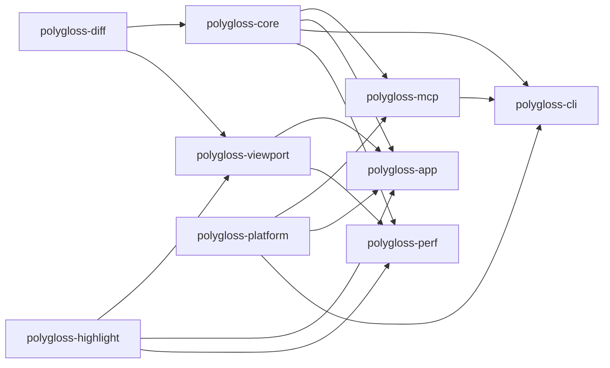

# Polygloss v1 implementation plan

> **For agentic workers:** REQUIRED SUB-SKILL: use `superpowers:subagent-driven-development` (recommended) or `superpowers:executing-plans` to run this plan task by task. Steps use checkbox (`- [ ]`) syntax for tracking.

**Goal:** Ship Polygloss v1: a native macOS (Apple Silicon) diff reviewer with split/unified diffs, Viewed, threaded drafts + Submit review, live worktree diffs, and a local MCP/CLI agent loop that wakes Claude Code on submit.

**Architecture:** A Cargo workspace. Pure-Rust, GPUI-free crates (`polygloss-diff`, `polygloss-core`) own the diff model, git, SQLite store and review domain, and are shared by two executables: the GPUI app `Polygloss` (gpui-kit chrome plus our own from-scratch diff viewport) and the slim `polygloss-cli` (human CLI, JSON CLI, `polygloss mcp` stdio server on rmcp, `polygloss wait` hook waiter). Processes share one SQLite WAL database and talk to the app over a unix socket. A Claude Code plugin in this repo wires the MCP server and the `asyncRewake` hook.

**Tech stack:** Rust 1.98.1, gpui-kit `=0.7.0` (gpui-pre `=0.3.7`), system git + gix 0.88 + gix-imara-diff 0.3, lumis 0.15, rusqlite 0.40 (bundled) + rusqlite_migration 2.6, rmcp `~3.5.0` + tokio (CLI only), notify 8, interprocess 2.4, nucleo-matcher, sha2, cargo-nextest + insta, bun + TypeScript 7 + `@modelcontextprotocol/client` 2.2, cargo-packager 0.11.8, Sparkle 2 via objc2.

**Spec (read before any task):**

| Doc                                                                                                  | Role                                                                                       |
| ---------------------------------------------------------------------------------------------------- | ------------------------------------------------------------------------------------------ |
| Decision log `~/.claude/projects/-Users-dak-projects-polygloss/memory/polygloss-design-decisions.md` | Authoritative. Wins over everything below.                                                 |
| [`docs/design.md`](design.md)                                                                        | Builder-facing spec. Section numbers (`§n`) below point here.                              |
| [`docs/adr/`](adr/README.md)                                                                         | Why each decision was made. Do not relitigate.                                             |
| [`docs/research/library-choices.md`](research/library-choices.md)                                    | Exact versions, features, APIs and gotchas. The verified `[workspace.dependencies]` block. |

If a task seems to need a decision the spec does not make, use the provisional default in [Open questions](#open-questions) and record it there. Never change a decision in the log or an ADR without the user.

---

## Contents

1. [How to execute this plan](#how-to-execute-this-plan)
2. [Global constraints](#global-constraints)
3. [Review focus](#review-focus)
4. [Workspace layout and crate ownership](#workspace-layout-and-crate-ownership)
5. [Milestones at a glance](#milestones-at-a-glance)
6. [M0 Scaffold](#m0-scaffold)
7. [M1 Core](#m1-core)
8. [M2 Viewport gate](#m2-viewport-gate)
9. [M3 Review UX](#m3-review-ux)
10. [M4 Agent integration](#m4-agent-integration)
11. [M5 Packaging and polish](#m5-packaging-and-polish)
12. [Manual gate: agent wake-up in real Claude Code](#manual-gate-agent-wake-up-in-real-claude-code)
13. [Risks and spikes](#risks-and-spikes)
14. [Definition of done (v1)](#definition-of-done-v1)
15. [Open questions](#open-questions)
16. [Spec coverage map](#spec-coverage-map)
17. [Decision log coverage](#decision-log-coverage)

---

## How to execute this plan

### Task card format

Every task has: **Files** (create/modify), **Interfaces** (what it consumes and produces, with exact names), **Steps** (TDD checklist with named tests), **Acceptance** (observable behavior) and **Verify** (commands that must pass). An agent sees only its own task, so the Interfaces block is the contract with neighboring tasks. Names in it are binding; if one must change, update every later task card that uses it in the same change.

### Per-task protocol

- [ ] Read Global constraints, the task card, and every `§` and ADR it cites.
- [ ] Write the failing tests named in the card first; run them and see them fail for the expected reason.
- [ ] Implement the minimum to pass. Keep files focused (one responsibility per `.rs`/`.ts` file).
- [ ] Run the card's **Verify** block, then the standard completion block:

```bash
bun run format            # cargo fmt --all + prettier --write .
bun run lint              # clippy -D warnings + tsc --noEmit
bun run test:unit         # cargo nextest run --workspace
bun test                  # bun suites (builds polygloss-cli via preload)
bun run test:e2e          # build + GPUI E2E/screenshots + MCP E2E
```

- [ ] Commit only if the orchestrator has authorized commits: one commit per task, message `<type>(<crate-or-area>): <task id> <summary>`. Otherwise leave the changes uncommitted in the worktree for review.

### Cargo invocation (read once)

Homebrew's cargo/rustc/rustdoc 1.93 shadow rustup on this machine's `PATH`, and doc-tests then fail with `E0514`. Always run cargo through **`scripts/cargo.sh`** (added by T0.1). It:

- runs rustup's `$CARGO_HOME/bin/cargo` (default `~/.cargo/bin`) with that directory first on `PATH`, and exports `RUSTC`/`RUSTDOC` as the rustup proxies next to it;
- keeps **shared build intermediates** in `CARGO_BUILD_BUILD_DIR=<main checkout>/target-shared`, where the main checkout is the parent of `git rev-parse --path-format=absolute --git-common-dir`, so every git worktree reuses one set of compiled dependencies (cargo ≥ 1.91 `build.build-dir`);
- keeps **final artifacts per worktree** in `CARGO_TARGET_DIR=<git toplevel>/target` (`target/debug/polygloss-cli` is always this checkout's build);
- makes sharing safe. Cargo names workspace-member outputs by the package path relative to the workspace root, so every worktree writes the _same_ member files in `target-shared` and cargo's mtime check alone would reuse another worktree's compiled members (and run its test binaries). So every command that can touch the build dir holds an exclusive lock, `<build dir>.lock` (`/usr/bin/lockf`), for its whole run, including nextest's run phase and `cargo run`. When the build dir was last used by a different checkout (recorded in `<build dir>/.polygloss-checkout`), cargo.sh first runs `cargo clean --workspace` for every profile dir present, so this checkout's members rebuild from its own sources while registry dependencies stay shared. `tree`, `metadata`, `fmt`, `deny`, `--version` and similar commands skip the lock. A nested cargo.sh (e.g. from a test) in the same checkout reuses the held lock; from a different checkout it fails loudly instead of deadlocking;
- derives both dirs from the checkout that contains the script (not the caller's cwd), ignores inherited `GIT_DIR`/`GIT_WORK_TREE`, and respects caller-provided `CARGO_TARGET_DIR`, `CARGO_BUILD_BUILD_DIR`, `RUSTC` and `RUSTDOC`. Outside any git checkout (a source tarball) both dirs go in the script's own checkout; inside one, a failing `git` is an error, never a silent fallback to a second target dir.

Cost: switching worktrees rebuilds the nine workspace members (not dependencies), and one worktree's long test run or `cargo.sh run` blocks the others' builds until it ends. For long-lived processes, `scripts/cargo.sh build` and then run `target/<profile>/<bin>` directly. `tests/scripts/cargo-sh.test.ts` pins this behavior, including a real-cargo test with two checkouts whose sources diverge. `/target`, `/target-shared` and `/target-shared.lock` are gitignored. Never create other target dirs. All commands in this plan are written `scripts/cargo.sh …`. Before T0.1 lands, use `PATH="$HOME/.cargo/bin:$PATH" ~/.cargo/bin/cargo …`.

### Parallelism rules

| Rule         | Detail                                                                                                                                                                                                                                                                                                                                                                                                                                                                                                                                                                                |
| ------------ | ------------------------------------------------------------------------------------------------------------------------------------------------------------------------------------------------------------------------------------------------------------------------------------------------------------------------------------------------------------------------------------------------------------------------------------------------------------------------------------------------------------------------------------------------------------------------------------- |
| Waves        | Each milestone lists waves. Tasks in one wave touch disjoint files and may run at once. A wave starts when every task of the previous wave passed its Verify block and was reviewed.                                                                                                                                                                                                                                                                                                                                                                                                  |
| Worktrees    | Parallel tasks run in separate git worktrees (`superpowers:using-git-worktrees`). Through `scripts/cargo.sh` they share build intermediates in `<main checkout>/target-shared` (`CARGO_BUILD_BUILD_DIR`) and each keeps its own final artifacts in `<worktree>/target` (`CARGO_TARGET_DIR`). cargo.sh serializes building commands across worktrees for their whole run (tests included) and rebuilds workspace members when another worktree used the build dir last, so a waiting agent prints `cargo.sh: waiting for another cargo.sh using …`. That wait is expected, not a hang. |
| Concurrency  | At most **3** cargo-building agents at once. The disk had 30 GB free on 2026-09-28, and a gpui-kit target dir peaks around 8.3 GB (almost all of it in the shared `target-shared`; per-worktree `target/` holds only final binaries). Check `df -h /System/Volumes/Data` before building; stop and report below 15 GB free.                                                                                                                                                                                                                                                           |
| Shared files | `Cargo.toml` (workspace), `package.json`, `crates/polygloss-app/src/features.rs` and the default keymap are edited only by the task that the card names. Other tasks add code in their own modules.                                                                                                                                                                                                                                                                                                                                                                                   |
| Merge order  | Merge in wave order, task-id order inside a wave. Re-run the completion block after each merge.                                                                                                                                                                                                                                                                                                                                                                                                                                                                                       |

### Milestone exit gates

A milestone is done only when its **Exit gate** commands all pass on a clean checkout of the merged branch, and its gate checklist is ticked. The next milestone does not start before that. Optional parallel track: M4 tasks marked **(core-only)** depend only on M1 and may start after the M1 gate if capacity allows; they still count toward the M4 gate.

---

## Global constraints

Every task's requirements include this section.

| Area         | Constraint (exact values)                                                                                                                                                                                                                                                                                                                                                                                                                                                                                                                                                                                                                                                                                                                                                                                          |
| ------------ | ------------------------------------------------------------------------------------------------------------------------------------------------------------------------------------------------------------------------------------------------------------------------------------------------------------------------------------------------------------------------------------------------------------------------------------------------------------------------------------------------------------------------------------------------------------------------------------------------------------------------------------------------------------------------------------------------------------------------------------------------------------------------------------------------------------------ |
| Toolchain    | `rust-toolchain.toml` channel **`1.98.1`**, profile `minimal`, components `rustfmt`, `clippy`. Edition 2024, `resolver = "3"`. Cargo via `scripts/cargo.sh` (`~/.cargo/bin/cargo`).                                                                                                                                                                                                                                                                                                                                                                                                                                                                                                                                                                                                                                |
| Platform     | macOS on Apple Silicon only; minimum macOS **14** (provisional OQ-18). Keep macOS-only code in `polygloss-platform` or behind `cfg(target_os = "macos")`.                                                                                                                                                                                                                                                                                                                                                                                                                                                                                                                                                                                                                                                          |
| License      | `MIT OR Apache-2.0` on every crate and package. No GPL, AGPL or FSL code or dependencies. Zed, GitComet, reviu, GitButler, pierre-native: **study only, never copy**. System git, never bundled.                                                                                                                                                                                                                                                                                                                                                                                                                                                                                                                                                                                                                   |
| UI deps      | `gpui-kit = "=0.7.0"` only. **Never** depend on `gpui-pre` directly; import via `gpui_kit::*`. All gpui-kit `tree-sitter*` features **off**. `test-support` only in `[dev-dependencies]`. **Never call `cx.set_http_client`.** No web views of any kind.                                                                                                                                                                                                                                                                                                                                                                                                                                                                                                                                                           |
| Other pins   | Copy the verified `[workspace.dependencies]` block from `docs/research/library-choices.md` verbatim. `rmcp = "~3.5.0"` (no default features; `server`, `macros`, `transport-io`). `lumis` default features off; never enable `lumis-wasm-runtime/wasm`. One SQLite crate only.                                                                                                                                                                                                                                                                                                                                                                                                                                                                                                                                     |
| Slim CLI     | `polygloss-cli` must link **zero** `gpui-*`, `lumis` and `tree-sitter` crates (`scripts/check-deps.sh`).                                                                                                                                                                                                                                                                                                                                                                                                                                                                                                                                                                                                                                                                                                           |
| Offline      | No network in app or CLI: no `git fetch`, no HTTP clients (`ureq`, `reqwest`, `hyper`, `curl`, `wasmtime` must not appear in the normal graph). Every git call sets `GIT_NO_LAZY_FETCH=1`, `GIT_TERMINAL_PROMPT=0`, `GIT_OPTIONAL_LOCKS=0`, `GIT_ALLOW_PROTOCOL=` (empty: no transport, whatever `protocol.*` config says), `GIT_NO_REPLACE_OBJECTS=1`, `LC_ALL=C`, `-c protocol.allow=never`, `-c core.quotePath=false`, and clears inherited `GIT_DIR`, `GIT_WORK_TREE`, `GIT_INDEX_FILE`, `GIT_OBJECT_DIRECTORY`, `GIT_COMMON_DIR`, `GIT_ALTERNATE_OBJECT_DIRECTORIES` (except where snapshots set them on purpose) and inherited `GIT_CONFIG_PARAMETERS`/`GIT_CONFIG_COUNT`. In-process gix object reads must ignore `refs/replace/*` too. Sparkle is the only allowed egress (OQ-16).                         |
| Git safety   | Never modify the user's index, HEAD, branches or any ref outside `refs/polygloss/`. Never run `git stash` or `git gc`. Diff flags: `-z --no-ext-diff --no-textconv -M50% -l1000`, no `-C`.                                                                                                                                                                                                                                                                                                                                                                                                                                                                                                                                                                                                                         |
| Identity     | `diff_id = lowercase_hex(sha256("polygloss/diff/v1\n" + objfmt + "\n" + base_tree + "\n" + head_tree))` (§4.1, OQ-1). Repo identity = realpath of `git rev-parse --path-format=absolute --git-common-dir`.                                                                                                                                                                                                                                                                                                                                                                                                                                                                                                                                                                                                         |
| Store        | `~/Library/Application Support/polygloss/polygloss.db` (dir `0700`, file `0600`); override dir with `POLYGLOSS_DATA_DIR`. Bootstrap order and `BEGIN IMMEDIATE` per §7.1. Every mutation appends its `events` row in the same transaction. Schema = §7.2 exactly.                                                                                                                                                                                                                                                                                                                                                                                                                                                                                                                                                  |
| MCP          | stdout is the JSON-RPC channel: never `println!` in `polygloss mcp`; log to stderr with `with_ansi(false)`, default filter `warn`. Server instructions < 2,048 chars. `polygloss mcp` never launches the app at startup.                                                                                                                                                                                                                                                                                                                                                                                                                                                                                                                                                                                           |
| Bundle       | Bundle id **`dev.dak.polygloss`**, team **`5U7E4UQ5M3`**, executables `Polygloss` and `polygloss-cli` (installed as `polygloss`). Never use team `FCSF68W94H`.                                                                                                                                                                                                                                                                                                                                                                                                                                                                                                                                                                                                                                                     |
| Naming       | kebab-case for crate dirs, package names, TS files, scripts, docs, fixtures, assets. snake_case only for Rust `.rs` module files (no `#[path]`). Bin names `Polygloss`, `polygloss-cli`, `polygloss-perf`.                                                                                                                                                                                                                                                                                                                                                                                                                                                                                                                                                                                                         |
| TypeScript   | Inline function parameter types; **no standalone `interface` declarations** (use inline object types or `type` aliases only where unavoidable). Strict `tsc`. Prettier-formatted.                                                                                                                                                                                                                                                                                                                                                                                                                                                                                                                                                                                                                                  |
| Test hygiene | Every test process gets its own temp `HOME`, `POLYGLOSS_DATA_DIR`, `XDG_CONFIG_HOME`, `GIT_CONFIG_GLOBAL` (empty file) and `GIT_CONFIG_NOSYSTEM=1`, and a cache dir under the temp `HOME`. Never read or write the real `~/Library` or `~/.config` from tests or spikes.                                                                                                                                                                                                                                                                                                                                                                                                                                                                                                                                           |
| Tests        | Every code change adds or updates tests. `bun test` and `bun run test:e2e` pass before any task counts as complete. GPUI-linking crates (`polygloss-viewport`, `polygloss-app`) have **one** integration test binary each to save link time and disk: `tests/viewport/main.rs` and `tests/app/main.rs`, one module per feature, plus `polygloss-app`'s `tests/e2e/main.rs` (feature `e2e`). A card path such as `crates/polygloss-viewport/tests/blocks.rs` means module `tests/viewport/blocks.rs`; `crates/polygloss-app/tests/shell.rs` means `tests/app/shell.rs`; `tests/e2e_<name>.rs` means `tests/e2e/<name>.rs`. T2.3, T2.8 and T3.1 pre-create the module lists (T0.1 already created `tests/app/main.rs` with `mod version;`; T0.2 created the empty `tests/e2e/main.rs` target and the `e2e` feature). |

---

## Review focus

Inputs the spec implies but that feature tests tend to miss. Each has a named test in the task that owns the code.

| #   | Input or condition                                                                                                        | Expected behavior                                                                                                    | Pinned by                                                                                                                        |
| --- | ------------------------------------------------------------------------------------------------------------------------- | -------------------------------------------------------------------------------------------------------------------- | -------------------------------------------------------------------------------------------------------------------------------- |
| RF1 | Paths with spaces, quotes, tabs, newlines, non-ASCII and non-UTF-8 bytes; renames into and out of such paths              | `-z` parsing keeps them exact; non-UTF-8 is stored escaped and flagged (OQ-25); nothing panics                       | T1.3 `diff_tree_parses_hostile_paths`, T1.3 `diff_tree_non_utf8_path_is_escaped_and_flagged`                                     |
| RF2 | Unborn HEAD (fresh `git init`), no commits on either side, no `origin`, detached HEAD, shallow clone missing objects      | Live diff vs the empty tree; default-branch fallback chain with a notice; `objects_missing` error, never a fetch     | T1.2 `resolve_live_in_unborn_repo_uses_empty_tree`, T1.2 `resolve_shallow_missing_objects_errors`                                |
| RF3 | Agents and hooks that export `GIT_DIR`/`GIT_INDEX_FILE`/`GIT_WORK_TREE`; running from a subdirectory or a linked worktree | Env is scrubbed; all worktrees collapse to one repo row; the user's index is byte-identical after a snapshot         | T1.2 `git_runner_scrubs_inherited_git_env`, T1.5 `snapshot_leaves_user_index_untouched`, T1.12 `linked_worktrees_share_repo_row` |
| RF4 | CRLF files, missing trailing newline, whitespace-only changes, a 5 MB minified single line, a file with 200k lines        | Correct hunks and line numbers; word diff skipped above 1,000 chars; no quadratic blowups; `\ No newline` marker row | T1.6 `hunks_crlf_and_no_trailing_newline`, T1.7 `word_diff_skips_long_lines`, T1.9 `rows_no_newline_marker`                      |
| RF5 | Several processes at once: first-ever launch of app + two `polygloss mcp` + `polygloss wait` against a missing DB         | Exactly one migration runs; no `SQLITE_BUSY` surfaced; every event observed exactly once by each reader              | T1.10 `store_concurrent_first_open_migrates_once`, T4.11 `mcp-multi-process-writers.test.ts`                                     |

---

## Workspace layout and crate ownership

Design §24 and the library-choices member wiring now mirror this layout. OQ-P1 records why it differs from the first sketch: the highlight adapter is its own crate (so the slim CLI never links lumis or tree-sitter), `polygloss-platform` does not depend on gpui-kit (so the CLI can use its launcher), and a separate `polygloss-perf` crate holds the perf harness.

```text
Cargo.toml  Cargo.lock  rust-toolchain.toml  deny.toml  rustfmt.toml  clippy.toml
package.json  bun.lock  bunfig.toml  tsconfig.json  .prettierrc.json  .prettierignore
LICENSE-MIT  LICENSE-APACHE  NOTICE  README.md  AGENTS.md
crates/
  polygloss-diff/        # diff model + algorithms (no git, no IO, no GPUI)
  polygloss-core/        # git, ids, snapshots, store, review domain, carry-forward, events, IPC (no GPUI)
  polygloss-highlight/   # lumis adapter, compact tokens, Zed-theme model, Pierre themes (no GPUI)
  polygloss-viewport/    # our GPUI diff viewport (document model + element)
  polygloss-platform/    # macOS glue: launch, Dock badge, Sparkle, editor detection, CLI install (no GPUI)
  polygloss-app/         # bin `Polygloss`: window, tabs, panes, review UX
  polygloss-mcp/         # transport-agnostic agent API + rmcp stdio server (no GPUI)
  polygloss-cli/         # bin `polygloss-cli` (on PATH as `polygloss`)
  polygloss-perf/        # bin `polygloss-perf`: perf harness (dev only, never shipped)
tests/                   # bun suites: support/, cli/, mcp/, plugin/, scripts/, e2e/
scripts/                 # cargo.sh, check-deps.sh, make-fixture-repo.ts, git-parity.ts, test-e2e.sh, …
benches/                 # corpora/ generators, budgets.json, run-perf.ts, results/ (gitignored)
fixtures/                # small committed fixture inputs (kebab-case)
assets/                  # fonts/lilex/, themes/pierre-{light,dark}.json, icons/
plugins/polygloss/       # Claude Code plugin (design §16.1)
.claude-plugin/marketplace.json
packaging/               # Info.plist, entitlements.plist, icon.icns, homebrew/, sparkle/
.github/workflows/       # ci.yml, nightly.yml, release.yml
docs/                    # design.md, adr/, research/, plan.md, testing/
```

### Ownership

| Crate                 | Owns                                                                                                                                                                                                                                                                                                                                                                                                                                                                                                                                                           | Must not contain                                          |
| --------------------- | -------------------------------------------------------------------------------------------------------------------------------------------------------------------------------------------------------------------------------------------------------------------------------------------------------------------------------------------------------------------------------------------------------------------------------------------------------------------------------------------------------------------------------------------------------------- | --------------------------------------------------------- |
| `polygloss-diff`      | Shared plain types (`Oid`, `ObjectFormat`, `Side`, `FileStatus`, `FileKind`, `FileChange`); hunk computation with context grouping; whitespace mode; word/char ranges and line pairing; `LineMap` (blob→blob line mapping); split/unified **row model** incl. gap/expander rows.                                                                                                                                                                                                                                                                               | git, SQLite, filesystem, GPUI, lumis                      |
| `polygloss-core`      | Git runner and version check; repo discovery; source resolution (§3); `diff-tree` parser; attribute/binary/generated detection; gix blob reads incl. scratch store; snapshots and pinning (§5); `diff_id` and review keys (§4); store, schema, migrations, events, `data_version` feed (§7); review domain: reviews, iterations, threads, comments, drafts, submissions, Viewed, view_state, sessions, assignments, waiters; carry-forward (§8.6); suggestion parsing via `markdown`; data/cache paths; socket protocol types, client and server loop (§13.3). | GPUI, tokio, rmcp, lumis                                  |
| `polygloss-highlight` | Language guess; lumis highlighting with budget + cancellation into compact spans; token cache keyed by `(blob, language, theme)`; Zed theme JSON serde model; Pierre Light/Dark; scope→style longest-prefix mapping.                                                                                                                                                                                                                                                                                                                                           | GPUI, git, SQLite                                         |
| `polygloss-viewport`  | Document model (file entries, states, height prefix sums, logical scroll anchor, materialization window, LRU); `DiffViewport` GPUI view/element: painting, shaping cache, sticky headers, gap expanders, collapse, line cursor/selection, gutter "+", variable-height block slots with split spacers; `DiffProvider` trait.                                                                                                                                                                                                                                    | SQLite, git, review semantics (threads are opaque blocks) |
| `polygloss-platform`  | `launch_app(url, activate)` (`open -g -b dev.dak.polygloss`, dev override); Dock badge (objc2, feature `appkit`); Sparkle loader (feature `appkit`); editor detection and argv templates; Install CLI symlink; bundle detection.                                                                                                                                                                                                                                                                                                                               | GPUI, tokio                                               |
| `polygloss-app`       | Everything user-facing in the GUI: window, tabs, Home, open flow, file tree, threads UI, composer, submit dialog, banners, live watcher, palette, keymap, settings, themes→gpui-kit tokens, find, notifications (GPUI APIs), socket server wiring, URL handling, logging.                                                                                                                                                                                                                                                                                      | tokio, rmcp                                               |
| `polygloss-mcp`       | `api` module: transport-agnostic functions with serde request/response types shared by MCP and the JSON CLI; `server` module: rmcp tool router, instructions, resources, pagination cursors, error-code mapping.                                                                                                                                                                                                                                                                                                                                               | GPUI, lumis                                               |
| `polygloss-cli`       | clap entry points (§14), lazy app launch, human output vs `--json`, `mcp` and `wait` subcommands, tokio `current_thread` runtime.                                                                                                                                                                                                                                                                                                                                                                                                                              | GPUI, lumis                                               |
| `polygloss-perf`      | Headed perf scenarios over corpora, JSON results.                                                                                                                                                                                                                                                                                                                                                                                                                                                                                                              | Shipping code (nothing depends on it)                     |

### Dependency direction



Arrows point from dependency to dependent. `polygloss-diff` is the leaf. `polygloss-viewport` does not depend on `polygloss-core`: the app adapts core data to the `DiffProvider` trait, so the viewport is testable with synthetic data. `scripts/check-deps.sh` enforces the crate-level parts of the "Must not contain" column on the macOS normal+build graph: GPUI = `gpui*`, lumis = `lumis*`, tokio = `tokio`, rmcp = `rmcp*`, git = `gix`/`git2`/`libgit2-sys` (not the standalone `gix-imara-diff`), SQLite = `rusqlite`/`libsqlite3-sys`; `polygloss-diff` additionally has no tokio or rmcp. "Filesystem" (diff) and "review semantics" (viewport) are code-review items. Each member is checked with its own feature resolution (`cargo tree -p`), so a `--workspace` build can still unify features (e.g. the CLI links `polygloss-platform` with `appkit` there); ship binaries built with `-p` (T5.1).

---

## Milestones at a glance

| Milestone               | Delivers                                                                                                                 | Tasks      | Exit gate (summary)                                                        |
| ----------------------- | ------------------------------------------------------------------------------------------------------------------------ | ---------- | -------------------------------------------------------------------------- |
| M0 Scaffold             | Workspace, toolchain, profiles, bun scripts, prettier, CI, README                                                        | T0.1–T0.3  | All scripts green on empty crates; dependency audit passes                 |
| M1 Core                 | Git layer, sources, ids, snapshots, hunks, word diff, line mapping, rows, store, domain                                  | T1.1–T1.16 | Unit + integration + git-parity suites pass; store concurrency tests pass  |
| M2 Viewport gate        | GPUI window rendering real diffs; virtualization, highlighting, sticky headers, gaps; perf harness                       | T2.1–T2.10 | **All §12.1 budgets met on all four corpora**, or fallbacks approved       |
| M3 Review UX            | Tabs, Home, open flow, tree, Viewed, threads, drafts, submit, live, palette, keymap, themes, find, editor, notifications | T3.1–T3.17 | GPUI E2E + screenshot suites pass; keyboard-only review flow passes        |
| M4 Agent integration    | Socket IPC, single instance, URL scheme, CLI, MCP tools, wait, plugin, JSON CLI, opt-in `claude/channel`                 | T4.1–T4.13 | bun MCP/CLI/E2E suites pass; manual wake gate W1–W3 recorded               |
| M5 Packaging and polish | cargo-packager, signing/notarization scripts, Sparkle stub, cask, docs, a11y pass, audits                                | T5.1–T5.8  | Full E2E on the bundled app; audits; manual wake gate W1–W8; DoD checklist |

---

## M0 Scaffold

**Goal:** an empty but fully wired workspace where every script and CI job runs green, so later tasks only add code and tests.

**Waves:** W1 = T0.1. W2 = T0.2 ∥ T0.3.

### T0.1 Workspace, toolchain, profiles, crate skeletons, dependency audit

**Files**

- Create: `rust-toolchain.toml`, `Cargo.toml`, `rustfmt.toml`, `clippy.toml`, `deny.toml`, `.gitignore`, `.config/nextest.toml`, `LICENSE-MIT`, `LICENSE-APACHE`, `NOTICE`, `scripts/cargo.sh`, `scripts/check-deps.sh`
- Test: `tests/scripts/cargo-sh.test.ts`, `tests/scripts/check-deps.test.ts` (run with `bun test tests/scripts` before T0.2 adds `package.json`), `crates/polygloss-app/tests/app/{main.rs, version.rs}` (T2.8 and T3.1 extend this module list and keep `mod version;`)
- Create: `crates/<crate>/Cargo.toml` and `crates/<crate>/src/lib.rs` for `polygloss-diff`, `-core`, `-highlight`, `-viewport`, `-platform`, `-mcp`; `crates/polygloss-app/src/main.rs` (bin `Polygloss`), `crates/polygloss-cli/src/main.rs` (bin `polygloss-cli`), `crates/polygloss-perf/src/main.rs` (bin `polygloss-perf`, `publish = false`)

**Interfaces**

- Produces: `polygloss_core::VERSION: &str` (from `CARGO_PKG_VERSION`); `polygloss-cli --version` prints `polygloss <version>`; `Polygloss` opens nothing yet and exits 0 with `--version`.
- Produces: `scripts/cargo.sh` (see [Cargo invocation](#cargo-invocation-read-once)) and `scripts/check-deps.sh` used by every later gate.

**Steps**

- [x] Prerequisites (dev tools, not project deps): `rustup toolchain install 1.98.1` (already present), `curl -LsSf https://get.nexte.st/latest/mac | tar zxf - -C ~/.cargo/bin`, then cargo-deny and cargo-insta into `~/.cargo/bin` (prebuilt, checksum-verified GitHub release binaries `cargo-deny-<v>-aarch64-apple-darwin.tar.gz` and `cargo-insta-aarch64-apple-darwin.tar.xz` save a from-source build; `scripts/cargo.sh install --locked cargo-deny cargo-insta` also works). Check `df -h /System/Volumes/Data` ≥ 15 GB free.
- [x] `rust-toolchain.toml`: exactly the block in library-choices "Verified `[workspace.dependencies]`" (channel `1.98.1`, profile `minimal`, components `rustfmt`, `clippy`).
- [x] `Cargo.toml`: `resolver = "3"`, all nine members, `[workspace.package]` (`edition = "2024"`, `rust-version = "1.98.1"`, `license = "MIT OR Apache-2.0"`, `repository`), and the verified `[workspace.dependencies]` block **verbatim**, plus `uuid = { version = "1", features = ["v7", "serde"] }` (OQ-P2). Crates reference deps with `workspace = true`; each crate lists only what the ownership table allows.
- [x] Profiles tuned for small target dirs and fast debug scrolling:

```toml
[profile.dev]
debug = "line-tables-only"   # full debuginfo for gpui-kit bloats target/ by GBs
incremental = true

[profile.dev.package]
"*" = { debug = false }
gpui-pre = { opt-level = 3 }
gpui-pre-platform = { opt-level = 3 }
gpui-pre-sum-tree = { opt-level = 3 }
taffy = { opt-level = 3 }
resvg = { opt-level = 3 }
rustybuzz = { opt-level = 3 }
ttf-parser = { opt-level = 3 }
smol = { opt-level = 3 }
ropey = { opt-level = 3 }
markdown = { opt-level = 3 }
tree-sitter = { opt-level = 3 }
gix-imara-diff = { opt-level = 3 }

[profile.release]
lto = "thin"
debug = false
strip = "debuginfo"

[profile.perf]                  # for polygloss-perf and samply profiles
inherits = "release"
debug = "line-tables-only"
strip = "none"
```

Drop any `profile.dev.package` entry cargo warns does not match a package.

- [x] `#![forbid(unsafe_code)]` in `polygloss-diff`, `-core`, `-highlight`, `-mcp`, `-cli`. `polygloss-platform` allows unsafe only inside `appkit`-feature modules.
- [x] `polygloss-platform` features: `default = []`, `appkit = ["dep:objc2", "dep:objc2-foundation", "dep:objc2-app-kit"]`. The app enables `appkit`; the CLI does not.
- [x] `.config/nextest.toml`: `[profile.default] slow-timeout = { period = "60s", terminate-after = 5 }`; `[profile.ci] fail-fast = false`.
- [x] `deny.toml`: `[graph] targets = ["aarch64-apple-darwin"]`; allow `MIT`, `Apache-2.0`, `Apache-2.0 WITH LLVM-exception`, `BSD-2-Clause`, `BSD-3-Clause`, `ISC`, `Zlib`, `0BSD`, `CC0-1.0`, `Unicode-3.0`, `BSL-1.0`, `MPL-2.0`; everything else (incl. all GPL/LGPL/AGPL) denied, except one per-crate exception: `libbz2-rs-sys` under the permissive `bzip2-1.0.6` license (reached via gpui-pre-http-client → async-compression → bzip2); `[sources] unknown-git = "deny"`, `unknown-registry = "deny"`; `[bans] multiple-versions = "warn"`; `[advisories] unmaintained = "workspace"` (added by T0.3 for the CI `audit` job: vulnerabilities fail anywhere, but "unmaintained" only for direct dependencies, because gpui-kit pulls in unmaintained `instant`, `paste`, `rustybuzz` and `ttf-parser`).
- [x] `scripts/check-deps.sh [--manifest-path <Cargo.toml>]` (runs `cargo tree -e normal,build --target aarch64-apple-darwin`; prints `check-deps: ok`, exits 1 on a violation and 2 if cargo cannot read the workspace): fails if `polygloss-cli` reaches any crate matching `^(gpui|lumis|tree-sitter)`; fails if `polygloss-diff`, `-core`, `-highlight`, `-platform`, `-mcp` reach `^gpui`; fails if `polygloss-diff`/`-core` reach `lumis|tokio|rmcp`; fails if `cargo tree -d` lists more than one `tree-sitter` or `libsqlite3-sys`; fails if `cargo tree --workspace -i <x>` prints any package for any of `ureq reqwest hyper curl wasmtime openssl-sys` (cargo exits 0 with "nothing to print" for `hyper`, which exists only under `cfg(target_family = "wasm")`).
- [x] Tests: `crates/polygloss-core/src/lib.rs` `#[test] fn version_is_semver()`; `crates/polygloss-cli/tests/version.rs` `cli_prints_version` (runs the bin via `env!("CARGO_BIN_EXE_polygloss-cli")`); `crates/polygloss-app/tests/app/version.rs` `app_prints_version_and_exits_zero`; `tests/scripts/cargo-sh.test.ts` (worktree vs main-checkout dirs, caller overrides, `RUSTC`/`RUSTDOC`, inherited `GIT_DIR`, non-git fallback vs failing git, takeover clean, cross-checkout lock and nesting, real cargo 1.98.1 with two diverging checkouts sharing one build dir); `tests/scripts/check-deps.test.ts` (real workspace passes; path-only fixture workspaces with fake `gpui-kit`, `lumis`, `tokio`, `rmcp`, `gix`, `rusqlite`, two `tree-sitter` or `libsqlite3-sys` versions and `ureq` each fail with the rule named; a crate only under a non-macOS cfg passes). The Rust version tests run the binaries with a sandboxed `HOME`, `XDG_CONFIG_HOME`, `XDG_CACHE_HOME`, `POLYGLOSS_DATA_DIR` and git config.
- [x] `.gitignore`: `/target`, `/target-shared`, `/target-shared.lock`, `/node_modules`, `/vendor/`, `/dist/`, `/benches/results/`, `*.profraw`, `.DS_Store`.
- [x] `NOTICE`: project header only; T2.2 and T3.3 append the Pierre theme and Lilex credits.

**Acceptance:** `scripts/cargo.sh --version` reports 1.98.1; the workspace builds; `polygloss-cli --version` prints `polygloss 0.1.0`; the dependency audit passes.

**Verify**

```bash
scripts/cargo.sh check --workspace --all-targets
scripts/cargo.sh nextest run --workspace --no-tests=warn
scripts/check-deps.sh
scripts/cargo.sh deny check licenses bans sources
bun test tests/scripts
du -sh target "$(git rev-parse --path-format=absolute --git-common-dir)/../target-shared"   # record; together < 10 GB
```

### T0.2 Bun and TypeScript scaffold, package scripts, prettier

**Files**

- Create: `package.json`, `bunfig.toml`, `tsconfig.json`, `.prettierrc.json`, `.prettierignore`, `scripts/test-e2e.sh`, `scripts/make-fixture-repo.ts`
- Create: `tests/support/preload.ts`, `tests/support/sandbox.ts`, `tests/support/bins.ts`, `tests/support/fixture-repo.ts`
- Modify: `crates/polygloss-app/Cargo.toml` (feature `e2e`, empty `e2e` test target); create `crates/polygloss-app/tests/e2e/main.rs`
- Test: `tests/support/sandbox.test.ts`, `tests/scripts/fixture-repo.test.ts`, `tests/cli/version.test.ts`, `tests/e2e/smoke.test.ts` (plus `tests/support/{bins,preload}.test.ts`, `tests/scripts/test-e2e.test.ts`)

**Interfaces**

- Produces (TS, inline types only):
  - `makeSandbox(): { home: string; dataDir: string; configDir: string; env: Record<string, string>; cleanup: () => void }`
  - `makeFixtureRepo(opts: { dir: string; kind: "basic" | "renames" | "hostile-paths" | "worktrees" | "sha256" | "unborn" }): { path: string; git: (args: string[]) => string }`
  - `cliBin(): string` (absolute path of the built `polygloss-cli`, or `$POLYGLOSS_CLI_BIN` when set), `appBin(): string` (built `Polygloss`, E2E only)
- Produces: package scripts `test`, `test:unit`, `test:e2e`, `lint`, `format`, `format:check`.

**Steps**

- [x] `package.json` (`"private": true`, `"type": "module"`, `"license": "MIT OR Apache-2.0"`). devDependencies exactly `@modelcontextprotocol/client@2.2.0`, `@types/bun@1.4.2`, `typescript@7.0.2`, `prettier@3.9.9`. No `peerDependencies` (library-choices §15 gotcha). Scripts:

```json
{
  "test": "bun test",
  "test:unit": "scripts/cargo.sh nextest run --workspace --no-tests=warn",
  "test:e2e": "scripts/test-e2e.sh",
  "lint": "scripts/cargo.sh clippy --workspace --all-targets -- -D warnings && tsc --noEmit -p .",
  "format": "scripts/cargo.sh fmt --all && prettier --write .",
  "format:check": "scripts/cargo.sh fmt --all --check && prettier --check ."
}
```

- [x] `bunfig.toml`: `[test] root = "tests"`, `preload = ["./tests/support/preload.ts"]`.
- [x] `preload.ts`: unless `POLYGLOSS_SKIP_BUILD=1`, run `scripts/cargo.sh build -p polygloss-cli` once and fail loudly with cargo's stderr.
- [x] `tsconfig.json`: `"strict": true`, `"module": "Preserve"`, `"moduleResolution": "bundler"`, `"types": ["bun"]`, `"noEmit": true`, include `tests`, `scripts`, `benches`, `plugins`.
- [x] `.prettierignore`: `target/`, `node_modules/`, `vendor/`, `bun.lock`, `crates/**/snapshots/`, `**/*.png`.
- [x] `sandbox.ts` sets `HOME`, `POLYGLOSS_DATA_DIR`, `XDG_CONFIG_HOME`, `GIT_CONFIG_GLOBAL` (empty file), `GIT_CONFIG_NOSYSTEM=1`, `GIT_AUTHOR_*`/`GIT_COMMITTER_*` fixed names and dates.
- [x] `scripts/test-e2e.sh`: build `polygloss-app` and `polygloss-cli` (one `-p` each, so the CLI never links `appkit`); run `scripts/cargo.sh nextest run -p polygloss-app --features e2e --no-tests=warn -E 'binary(e2e)'`; then `POLYGLOSS_E2E=1 POLYGLOSS_SKIP_BUILD=1 bun test tests/e2e`. nextest rejects a filterset that matches no binary, so this task also declares the `e2e` feature (`[features] e2e = []`) and an empty `[[test]] name = "e2e"`, `path = "tests/e2e/main.rs"`, `required-features = ["e2e"]` in `crates/polygloss-app/Cargo.toml`. Until M2 that binary has no tests, so the nextest step reports "no tests to run" and passes.
- [x] `makeFixtureRepo` creates the repo at `<dir>/<kind>` (`dir` is created if missing; the repo path must not exist) and returns its realpath; kind `worktrees` adds linked worktrees `feature` (branch with one extra commit) and `detached` under `<dir>/worktrees-linked/`. Git runs hermetically (`GIT_CONFIG_GLOBAL=/dev/null`, `GIT_CONFIG_NOSYSTEM=1`, fixed identity and per-commit dates, nothing inherited but `PATH`), so object ids are reproducible. `hostile-paths` builds its trees with plumbing and includes a non-UTF-8 path, which APFS cannot create, so that entry is `skip-worktree` in the checkout. `bun scripts/make-fixture-repo.ts <kind> <dir>` prints the repo path.
- [x] Tests: `sandbox.test.ts` → `sandbox never points at the real HOME`; `fixture-repo.test.ts` → `basic repo has two commits`, `sha256 repo reports sha256 object format`, `hostile-paths repo contains a path with a newline`; `version.test.ts` → `polygloss-cli --version prints the crate version`; `e2e/smoke.test.ts` → `describe.skipIf(!process.env.POLYGLOSS_E2E)` placeholder asserting `appBin()` exists.

**Acceptance:** `bun install` creates `bun.lock`; `bun test`, `bun run lint`, `bun run format:check` and `bun run test:e2e` all pass.

**Verify:** the standard completion block.

### T0.3 CI workflow, README, AGENTS.md

**Files**

- Create: `.github/workflows/ci.yml`, `README.md`, `AGENTS.md`

**Interfaces**

- Produces: CI jobs `lint`, `unit`, `bun`, `e2e`, `audit` on macOS arm64. Later milestones add `nightly.yml` (T1.6, T2.9) and `release.yml` (T5.2).

**Steps**

- [x] `ci.yml`: trigger on push and pull_request; runner `macos-15` (arm64, OQ-P9); steps: `actions/checkout@v7`, `rustup toolchain install` (no argument: installs the toolchain `rust-toolchain.toml` pins; rustup ≥ 1.28 no longer installs it on `rustup show`) then `rustup show`, `Swatinem/rust-cache@v2` with `workspaces: ". -> target-shared"` (cargo.sh keeps intermediates there), `taiki-e/install-action@v2` with `cargo-nextest,cargo-deny`, `oven-sh/setup-bun@v2` (`bun-version: 1.3.14`), `bun install --frozen-lockfile`. Jobs: `lint` (`bun run format:check && bun run lint`), `unit` (`scripts/cargo.sh nextest run --workspace --no-tests=warn --profile ci`), `bun` (`bun test`), `e2e` (`bun run test:e2e`), `audit` (`scripts/check-deps.sh && scripts/cargo.sh deny check licenses bans sources advisories`). In CI, `scripts/cargo.sh` still works because rustup's cargo lives in `~/.cargo/bin`.
- [x] `README.md` (concise): what Polygloss is, status (pre-alpha), requirements (macOS 14+ on Apple Silicon, system git ≥ 2.39, rustup with 1.98.1, bun 1.3), the cargo `PATH` gotcha, build/test commands, layout table, links to `docs/design.md`, `docs/adr/`, `docs/plan.md`, dual license.
- [x] `AGENTS.md`: one screen: link to plan Global constraints, the completion block, "never touch the real HOME in tests", "never add GPL deps", "cargo only via `scripts/cargo.sh`".
- [x] Test: `tests/scripts/repo-hygiene.test.ts` → `every tracked file name is kebab-case` (walks `git ls-files`; lowercase kebab-case required everywhere except this fixed allowlist: `README.md`, `AGENTS.md`, `CONTRIBUTING.md`, `LICENSE-*`, `NOTICE`, `Cargo.toml`, `Cargo.lock`, dotfiles and dot-directories, `.rs` files (Rust rules), insta `*.snap` files (named by insta), `SKILL.md` (Claude Code convention) and `Info.plist` (Apple convention)) and `no TypeScript file declares an interface` (regex `^\s*(export\s+)?interface\s`). Screenshot baselines, fonts and every other asset use kebab-case names. Directories are kebab-case too, except dot-directories and snake_case Rust module directories inside `crates/*/` (holding `.rs` or `.snap` files). The interface regex also catches `export default interface` and `declare interface`. `tests/scripts/ci-workflow.test.ts` pins the job set, runner, setup steps and job commands of `ci.yml`, and checks that README/AGENTS relative links resolve.

**Acceptance:** the CI file is valid YAML (`bun -e 'Bun.YAML.parse(await Bun.file(".github/workflows/ci.yml").text())'`), the new hygiene tests pass, and every command in the README's build and test section exits 0 when run in order on a clean clone after `bun install`.

**Verify:** the standard completion block.

### M0 exit gate

```bash
scripts/cargo.sh --version                  # cargo 1.98.1
bun install --frozen-lockfile
bun run format:check && bun run lint
bun run test:unit && bun test && bun run test:e2e
scripts/check-deps.sh
scripts/cargo.sh deny check licenses bans sources
```

- [x] If a GitHub remote exists, `ci.yml` is green on the merge commit. Otherwise every job's command passed locally. (M0 gate, 2026-09-28: no remote configured; all five `ci.yml` job commands passed locally on `polygloss-v1` at a9faace.)

---

## M1 Core

**Goal:** everything below the UI, proven by tests: sources resolve to trees, ids are deterministic, snapshots never touch the user's repo state, hunks match git, the store is safe across processes, and the review domain enforces drafts, visibility, caps and carry-forward.

**Conventions for M1**

- Line numbers are **0-based `u32`** inside `polygloss-diff` and the viewport; they become **1-based** at the store, MCP and JSON boundaries (anchors are 1-based per §8.1). Convert only in `polygloss-core::review`.
- Every core integration test starts with `let _sb = polygloss_core::testing::Sandbox::isolate();` (temp `HOME`, `POLYGLOSS_DATA_DIR`, `XDG_CONFIG_HOME`, `GIT_CONFIG_GLOBAL`, `GIT_CONFIG_NOSYSTEM=1`). nextest runs each test in its own process, so setting process env inside `isolate()` is safe (integration tests may use `unsafe { std::env::set_var }`; library code may not).
- Git fixtures come from `polygloss_core::testing::FixtureRepo` (feature `test-support`; core lists itself as a dev-dependency with that feature).

**Waves:** W1 = T1.1. W2 = T1.2 ∥ T1.6 ∥ T1.10. W3 = T1.3 ∥ T1.4 ∥ T1.7 ∥ T1.8 ∥ T1.11. W4 = T1.5 ∥ T1.9 ∥ T1.16. W5 = T1.12. W6 = T1.13 ∥ T1.14. W7 = T1.15. (At most 3 cargo-building agents at once; a wave may queue.)

### T1.1 Shared types, ids and module skeletons

**Files**

- Create: `crates/polygloss-diff/src/{types.rs, options.rs, lines.rs, hunks.rs, whitespace.rs, word.rs, line_map.rs, rows.rs, unified_text.rs}` (all but `types.rs` as documented empty stubs), `crates/polygloss-diff/benches/{hunks.rs, word.rs, line_map.rs}` (empty criterion groups) and their `[[bench]]` entries
- Create: `crates/polygloss-core/src/{ids.rs, paths.rs, testing.rs, objects.rs}`, `src/git/{mod.rs, runner.rs, version.rs, repo.rs, resolve.rs, diff_tree.rs, attrs.rs, snapshot.rs, listing.rs}`, `src/store/{mod.rs, migrations.rs, schema-v1.sql, events.rs}`, `src/review/{mod.rs, models.rs, open.rs, threads.rs, submit.rs, suggestions.rs, viewed.rs, view_state.rs, sessions.rs, summary.rs, carry_forward.rs}`, `src/ipc/{mod.rs, protocol.rs, client.rs, server.rs}`, `src/urls.rs` (stubs except `ids.rs`)
- Modify: `crates/polygloss-diff/Cargo.toml`, `crates/polygloss-core/Cargo.toml` (add every dependency the ownership table allows, once, so later tasks never edit these manifests; T0.1 already added `gix-imara-diff` to `polygloss-diff` so the workspace `[profile.dev.package]` override matches)
- Create: `fixtures/diff-id-vectors.json` (the golden vectors, read by both the Rust and the TypeScript test)
- Test: `crates/polygloss-diff/src/types.rs` (unit), `crates/polygloss-core/tests/ids.rs`, `tests/scripts/diff-id-vectors.test.ts`, `tests/scripts/module-skeletons.test.ts`

**Interfaces (produces)**

```rust
// polygloss_diff::types  (serde Serialize/Deserialize on all)
pub enum ObjectFormat { Sha1, Sha256 }        // as_str() "sha1"|"sha256"; hex_len() 40|64; empty_tree() -> Oid
pub struct Oid(String);                        // lowercase hex of the format's length
impl Oid { pub fn parse(s: &str, fmt: ObjectFormat) -> Result<Oid, OidError>; pub fn zero(fmt: ObjectFormat) -> Oid;
           pub fn is_zero(&self) -> bool; pub fn as_str(&self) -> &str; pub fn short(&self) -> &str /* 7 */ }
pub enum Side { Old, New }
pub enum FileStatus { Added, Modified, Deleted, Renamed, TypeChanged }   // from_raw(u8) for A/M/D/R/T; as_letter()
pub enum FileKind { Text, Binary, Symlink, Submodule }
pub struct Mode(pub u32);                      // octal; Display "100644"
pub struct GitPath { pub text: String, pub escaped: bool }  // from_bytes(&[u8]): UTF-8 as is, else C-style escape + escaped=true (OQ-25)
pub struct FileChange { pub idx: u32, pub status: FileStatus, pub old_path: Option<GitPath>, pub new_path: Option<GitPath>,
  pub old_mode: Option<Mode>, pub new_mode: Option<Mode>, pub old_blob: Oid, pub new_blob: Oid,
  pub similarity: Option<u8>, pub kind: FileKind, pub generated: bool }
impl FileChange { pub fn display_path(&self) -> &str; pub fn viewed_key(&self) -> (String, Oid, Oid) }

// polygloss_core::ids
pub struct DiffId(String);                     // 64 lowercase hex
pub fn diff_id(fmt: ObjectFormat, base_tree: &Oid, head_tree: &Oid) -> DiffId;
impl DiffId { pub fn as_str(&self) -> &str; pub fn short(&self) -> &str /* 12 */; }
pub struct DiffIdPrefix(String);               // DiffIdPrefix::parse(s) requires >= 8 hex chars
pub fn new_uuid() -> String;                   // UUIDv7 text (OQ-P2)
pub mod review_key { pub fn live(worktree: &Path, branch: Option<&str>, since: &str) -> String;
  pub fn compare(base_ref: &str, head_ref: &str, direct: bool) -> String; pub fn commit(oid: &Oid) -> String; }
```

**Tests:** `oid_parse_rejects_uppercase_and_wrong_length`, `oid_zero_roundtrip`, `empty_tree_constants_match_design` (both formats, §3), `git_path_non_utf8_is_escaped`, `diff_id_golden_sha1`, `diff_id_golden_sha256`, `diff_id_ignores_nothing_but_trees` (same trees, different commits → same id), `review_key_live_detached`, `review_key_compare_three_dot_and_direct`, `review_key_commit`. The bun test `diff-id-vectors.test.ts` recomputes both golden vectors with `Bun.CryptoHasher("sha256")` from the §4.1 formula, so the vectors are checked by an independent implementation.

**Acceptance:** golden vectors agree in Rust and TypeScript; every module file named above exists with a `//!` doc line; manifests are final for M1.

**As built (T1.1):** `polygloss-core`'s `lib.rs` uses `#![deny(unsafe_code)]` instead of `forbid`, because Rust 2024 makes `std::env::set_var` unsafe and `testing::Sandbox::isolate()` (library code behind `test-support`) must set process env; `testing.rs` opts in with `#![allow(unsafe_code)]`, nothing else may. Extra helpers beyond the contract: `ObjectFormat::from_name`, `Oid::object_format`, `Oid: Display + TryFrom<String>`, `Mode::{parse_octal, is_symlink, is_submodule}`, `GitPath::to_bytes` (unescapes), `DiffId::parse`, `DiffIdPrefix::{as_str, matches}`, `IdError`. Serde forms: `Oid`/`DiffId` as validated strings, enums lower/snake case, `Mode` as its `u32`. Non-UTF-8 `GitPath.text` is git's quoted form including the surrounding `"`. `libc` is not in core's manifest until T4.1 (OQ-P8).

### T1.2 Git runner, version check, repo discovery, source resolution

**Files:** `crates/polygloss-core/src/git/{runner.rs, version.rs, repo.rs, resolve.rs}`, `src/testing.rs`; test `crates/polygloss-core/tests/git_resolve.rs`

**Interfaces (produces)**

```rust
pub struct Git { /* worktree, extra env */ }
impl Git {
  pub fn new(worktree: impl Into<PathBuf>) -> Git;
  pub fn with_env(self, key: &str, val: impl AsRef<OsStr>) -> Git;          // snapshots set GIT_INDEX_FILE etc.
  pub fn output(&self, args: &[&OsStr]) -> Result<Vec<u8>, GitError>;       // applies Global constraints env + -c flags
  pub fn output_stdin(&self, args: &[&OsStr], stdin: &[u8]) -> Result<Vec<u8>, GitError>;
  pub fn status(&self, args: &[&OsStr]) -> Result<i32, GitError>;           // exit code without error mapping
}
pub fn git_binary() -> PathBuf;              // $POLYGLOSS_GIT_BIN (tests/CI only) else "git"
pub struct GitVersion { pub major: u32, pub minor: u32, pub patch: u32 }
pub fn check_version() -> Result<GitVersion, GitError>;   // >= 2.39.0 (OQ-6) else GitError::TooOld
pub struct RepoInfo { pub common_dir: PathBuf, pub git_dir: PathBuf, pub toplevel: Option<PathBuf>, pub object_format: ObjectFormat }
pub fn discover(path: &Path) -> Result<RepoInfo, GitError>;               // realpath'd; NotARepo
pub enum Since { MergeBase, Head, Commit(String) }
pub enum CompareMode { ThreeDot, Direct }
pub enum Source { Live { since: Since }, Commit { rev: String }, Compare { base: String, head: String, mode: CompareMode } }
pub struct ResolvedSide { pub tree: Oid, pub commit: Option<Oid>, pub ref_name: Option<String> }
pub enum HeadSpec { Tree(ResolvedSide), Worktree }                          // Worktree: snapshot taken by T1.5
pub enum ReviewKind { Live, Compare, Commit }
pub struct Resolution { pub object_format: ObjectFormat, pub base: ResolvedSide, pub head: HeadSpec,
  pub kind: ReviewKind, pub review_key: String, pub warnings: Vec<ResolveWarning> }
pub fn resolve(repo: &RepoInfo, worktree: &Path, source: &Source) -> Result<Resolution, ResolveError>;
pub fn default_branch(git: &Git) -> Result<(String, bool /* fallback_used */), GitError>;   // OQ-5 chain
pub enum ResolveError { BadRevision(String), NoMergeBase { suggestion: &'static str }, ObjectsMissing(String), Git(GitError) }

// polygloss_core::testing (feature test-support)
pub struct Sandbox; impl Sandbox { pub fn isolate() -> Sandbox; pub fn home(&self) -> &Path; }
pub struct FixtureRepo; impl FixtureRepo { pub fn init(fmt: ObjectFormat) -> FixtureRepo; pub fn path(&self) -> &Path;
  pub fn write(&self, rel: &str, bytes: &[u8]); pub fn commit(&self, msg: &str) -> Oid; pub fn git(&self, args: &[&str]) -> String;
  pub fn branch(&self, name: &str); pub fn checkout(&self, name: &str); pub fn add_worktree(&self, name: &str) -> PathBuf;
  pub fn clone_shallow(&self) -> FixtureRepo; pub fn clone_blobless(&self) -> FixtureRepo; }
```

**Tests:** `git_runner_scrubs_inherited_git_env` (RF3), `git_runner_sets_offline_env_and_flags`, `git_version_parses_apple_suffix` (`git version 2.54.0 (Apple Git-157)`), `git_version_too_old_is_rejected`, `discover_from_subdirectory`, `discover_linked_worktree_shares_common_dir`, `resolve_commit_uses_first_parent_tree`, `resolve_root_commit_uses_empty_tree`, `resolve_merge_commit_uses_first_parent`, `resolve_three_dot_uses_merge_base`, `resolve_direct_uses_base_tree`, `resolve_no_merge_base_suggests_direct`, `resolve_ref_inputs_store_full_names`, `resolve_oid_input_keys_by_commit`, `resolve_live_default_since_merge_base_with_origin_head`, `default_branch_fallback_chain`, `resolve_live_in_unborn_repo_uses_empty_tree` (RF2, OQ-P5), `resolve_live_without_merge_base_falls_back_to_head_with_notice` (OQ-P5), `resolve_detached_head_live_key`, `resolve_shallow_missing_objects_errors` (RF2), `rev_starting_with_dash_is_not_an_option`. Added in review: `sandbox_keeps_caller_git_bin` (S13), `git_runner_stays_offline_despite_inherited_overrides`, `git_runner_ignores_replace_refs`, `discover_repo_path_with_newline`, `resolve_live_in_shallow_clone_blames_missing_history`, `resolve_blobless_clone_never_fetches` (exercises `clone_blobless`).

`polygloss-core` denies `unsafe_code` crate-wide (T1.1); `testing.rs` starts with `#![allow(unsafe_code)]` so `isolate()` can call `std::env::set_var`.

**Acceptance:** every test above passes; each §3 resolution rule has at least one of them; every test runs under `Sandbox::isolate()`, so `GIT_CONFIG_GLOBAL` is an empty temp file and `GIT_CONFIG_NOSYSTEM=1`.

**As built (T1.2):** `polygloss_core::git` re-exports everything above (`git::{Git, GitError, GitOutput, git_binary, GitVersion, check_version, RepoInfo, discover, Source, Since, CompareMode, ResolvedSide, HeadSpec, ReviewKind, Resolution, ResolveWarning, ResolveError, resolve, default_branch}`). Extras beyond the contract: `Git::{run, worktree}` (`run` returns `GitOutput { code, stdout, stderr }` unmapped), `GitVersion::{parse, at_least, MIN}` (`GitVersion` is `Ord` + `Display`), `ReviewKind::as_str`, serde on all resolve types. `GitError` variants: `Spawn { bin, source }`, `Failed { args, code, stderr }`, `TooOld { found, min }`, `NotARepo(PathBuf)`, `NoDefaultBranch` (end of the OQ-5 chain), `Parse(String)`, `Io`. `ResolveWarning` = `UnbornHead`, `NoDefaultBranch`, `NoMergeBase { default_branch }`, `MergeBaseBeyondShallow { default_branch }`, `MultipleMergeBases { count, used }` (serde `tag = "code"`, `Display` = the user-facing notice). `default_branch` returns **full** ref names (`refs/remotes/origin/main`, `refs/heads/main`); a dangling `origin/HEAD` falls through the chain. Resolution rules as built: commits are read raw with `cat-file commit`, so a shallow-boundary or missing parent is `ObjectsMissing`, never a fake root commit; a full-length object id that does not resolve is `ObjectsMissing` when the repo is shallow or partial (a promisor remote or `extensions.partialClone`) and the object is absent, otherwise `BadRevision`; a three-dot compare with no merge base in a shallow repo (`<common_dir>/shallow` exists) is `ObjectsMissing`, otherwise `NoMergeBase { suggestion: "--direct" }`; live `since=merge-base` with no merge base falls back to HEAD with `NoMergeBase`, or with `MergeBaseBeyondShallow { default_branch }` in a shallow repo; resolved trees are checked with `cat-file --batch-check` (never fetches). `ResolvedSide.commit` is the commit whose tree it is (the merge base for three-dot and live `merge-base`); `ref_name` is the requested input's full ref (or the default branch for live `merge-base`, the current branch for live `HEAD`), `None` for OIDs, expressions, a detached `HEAD` and ambiguous names. A live key keeps `since=merge-base` when the HEAD fallback applies (warning attached), so the review does not split once the default branch appears (recorded in design §3). The runner also pins `GIT_ALLOW_PROTOCOL=` (empty) and `GIT_NO_REPLACE_OBJECTS=1` and clears inherited `GIT_CONFIG_PARAMETERS`/`GIT_CONFIG_COUNT` (Global constraints "Offline"; a user's `protocol.file.allow=always` or an inherited `GIT_ALLOW_PROTOCOL` otherwise re-enables transports that `-c protocol.allow=never` alone does not stop, which matters on git 2.39–2.43 without `GIT_NO_LAZY_FETCH`). `discover` reads one path per `rev-parse` call (git's output minus one trailing newline, bytes kept as-is), so repo paths with newlines or non-UTF-8 bytes work. Test support extras: `Sandbox::{data_dir, config_dir, cache_dir, git_config_global}` (it also sets `XDG_CACHE_HOME` and clears the scrubbed repo-redirecting `GIT_*` vars; it keeps a caller-set `POLYGLOSS_GIT_BIN`, so `POLYGLOSS_GIT_BIN=/Library/Developer/CommandLineTools/usr/bin/git scripts/cargo.sh nextest run -p polygloss-core` runs the runner under test against that git, S13; fixtures always use `git` from `PATH`), `FixtureRepo::oid(rev)`; `FixtureRepo::init` uses branch `main`, repos live at `<tmp>/repo` and worktrees at `<tmp>/worktrees/<name>` (branch `name`, created from HEAD if missing); `clone_blobless` sets `uploadpack.allowFilter` on the source. Test hook for T1.12: `testing::git_spawns(subcommand) -> usize` counts processes the runner started in this process (feature `test-support` only).

### T1.3 `diff-tree` parser, attributes, binary and generated detection

**Files:** `crates/polygloss-core/src/git/{diff_tree.rs, attrs.rs}`; test `crates/polygloss-core/tests/diff_tree.rs`; fixtures built in code (hostile paths cannot live in a checkout)

**Interfaces**

```rust
pub fn list_changes(git: &Git, fmt: ObjectFormat, base_tree: &Oid, head_tree: &Oid) -> Result<Vec<FileChange>, GitError>;
// runs: diff-tree -r -z --raw -M50% -l1000 --no-ext-diff --no-textconv --full-index <base> <head>
pub fn parse_raw_z(bytes: &[u8], fmt: ObjectFormat) -> Result<Vec<FileChange>, ParseError>;
pub fn classify(git: &Git, head_tree: &Oid, changes: &mut [FileChange], extra_generated: &[String]) -> Result<(), GitError>;
pub const BUILTIN_GENERATED: &[&str];   // lockfiles (package-lock.json, yarn.lock, pnpm-lock.yaml, bun.lock, bun.lockb, Cargo.lock,
                                        // Gemfile.lock, poetry.lock, composer.lock, go.sum), *.min.js, *.min.css, *.map, *.pb.go, *_pb2.py
```

Attributes (`binary`, `-diff`, `linguist-generated`) come from `git check-attr -z --stdin --source=<head_tree>` when git ≥ 2.40, else the built-in list and the NUL rule only, with a one-time notice (OQ-P3). Submodule = mode `160000`, symlink = `120000`. NUL-byte binary detection happens when a blob is first read (T1.4, T2.6) and writes `file_changes.kind` back.

**Tests:** `diff_tree_parses_modify_add_delete`, `diff_tree_parses_rename_with_score`, `diff_tree_parses_typechange_and_modes`, `diff_tree_submodule_kind`, `diff_tree_symlink_kind`, `diff_tree_parses_hostile_paths` (RF1: space, quote, tab, newline, emoji), `diff_tree_non_utf8_path_is_escaped_and_flagged` (RF1), `diff_tree_ignores_user_rename_limit` (repo config `diff.renameLimit=1`), `diff_tree_ignores_ext_diff_and_textconv` (configured driver would write a marker file; assert absent), `generated_builtin_list_and_attribute`, `binary_attribute_marks_kind`, `merge_commit_diffs_first_parent`.

**As built (T1.3):** `polygloss_core::git` re-exports `list_changes`, `parse_raw_z`, `ParseError`, `classify` and `BUILTIN_GENERATED`. `ParseError { offset, reason }` (byte offset of the failing record); `From<ParseError> for GitError` maps it to `GitError::Parse`. `parse_raw_z` sets `kind` from the modes only (a submodule on either side wins, then a symlink on either side, else `Text`, so a type change keeps the special badge), rejects `C`/`U`/`X` statuses, scores on non-renames, mode/status mismatches, non-ASCII headers and unterminated fields, and assigns `idx` in git's output order. `classify` makes at most one batched `check-attr` call (none for an empty slice), looks each file up by its new path (old path for deletions) as raw bytes, so non-UTF-8 paths work; the `Git` must be rooted at the repo top level because `check-attr` resolves paths relative to its cwd. Attribute rules: `binary` set or `diff` unset turns a `Text` file into `Binary` (symlinks and submodules keep their kind; `diff=<driver>` stays text); `linguist-generated` set/`true` forces generated and `-linguist-generated`/`=false` forces not generated, overriding both lists (GitHub semantics); otherwise `BUILTIN_GENERATED` or `extra_generated` decides. Patterns are a gitignore-like subset on raw path bytes: no `/` matches the file name, with `/` the whole path (leading `/` ignored), `*`/`?` stop at `/`, `**` crosses it, `**/` also matches zero dirs, no character classes. `check-attr --source` support is decided by `check_version()` (≥ 2.40), cached per git binary; below that a one-time `tracing::warn!` notice is logged (OQ-P3). Worktree `.gitattributes` never apply (verified: `--source` ignores them); `$GIT_DIR/info/attributes` and a global `core.attributesFile` still do, as in git. Added tests: `diff_tree_identical_trees_is_empty`, `classify_batches_one_check_attr_call`, `classify_on_git_2_39_uses_builtin_list_only` (a wrapper git that reports 2.39), plus unit tests for the raw parser, the `check-attr -z` parser and the pattern matcher. `diff_tree_ignores_user_rename_limit` was checked to fail without `-l1000`.

### T1.4 Blob reader (gix) with scratch-store alternates

**Files:** `crates/polygloss-core/src/objects.rs`; test `crates/polygloss-core/tests/objects.rs`

**Interfaces**

```rust
pub struct BlobReader { /* gix::ThreadSafeRepository + optional scratch odb */ }
impl BlobReader {
  pub fn open(repo: &RepoInfo) -> Result<BlobReader, ObjectError>;          // gix::open_opts(git_dir, Options::isolated())
  pub fn with_scratch(&self, scratch_objects: &Path) -> Result<BlobReader, ObjectError>;  // info/alternates -> repo objects
  pub fn read(&self, oid: &Oid) -> Result<Arc<[u8]>, ObjectError>;          // Clone + Send + Sync; thread-local handles inside
  pub fn exists(&self, oid: &Oid) -> bool;
  pub fn size(&self, oid: &Oid) -> Result<u64, ObjectError>;
}
pub enum ObjectError { Missing(Oid), Corrupt(String), Io(std::io::Error) }  // Missing -> MCP `objects_missing`
pub fn is_binary(bytes: &[u8]) -> bool;   // NUL in the first 8,000 bytes
```

gix errors that are `gix_error::Exn` convert with `.map_err(|e| e.into_error())` (library-choices §3b).

**Tests:** `blob_read_sha1`, `blob_read_sha256`, `blob_read_from_scratch_store_with_alternates`, `blob_missing_is_missing_error`, `blob_read_in_blobless_clone_never_fetches` (a `file://` blobless clone: read fails with `Missing`, `git count-objects -v` unchanged), `blob_reader_is_send_sync_and_parallel` (8 threads), `is_binary_nul_rule`. Added while building: `blob_read_ignores_replace_refs`, `blob_read_from_linked_worktree_uses_common_objects`, `blob_read_from_scratch_sees_objects_added_later`, `blob_read_from_scratch_with_hostile_repo_path`, `with_scratch_requires_an_existing_store`, `blob_read_rejects_non_blob_objects`.

**As built (T1.4):** `open` does **not** use `gix::open_opts(git_dir, Options::isolated())`. It opens `<common_dir>/objects` directly with `gix::odb::Store::at_opts(…, hash kind from RepoInfo.object_format, no replacements, default options)`, and every handle also sets `ignore_replacements`. Reason: gix 0.88 reads `core.useReplaceRefs` in the inverted `GIT_NO_REPLACE_OBJECTS` sense, so a repo with `core.useReplaceRefs=false` made `gix::open_opts` + `find_blob` return the **replacement** (checked while building), violating Global constraints "Offline"; opening the store directly also means no repo config, refs, trust checks or env can make blob reads fail. `BlobReader` = `Arc` of the store plus a small pool of gix handles (each with a 64-entry pack delta cache), so it is `Clone + Send + Sync` and handles are reused across reads. `with_scratch(scratch_objects)` requires the dir to exist (else `Io(NotFound)`, never creates it) and writes `<scratch_objects>/info/alternates` = the repo objects dir (temp file + rename; C-quoted when the path has control characters or starts with `"`, which git and gix both unquote) when missing or different, so T1.5's snapshotter may rely on that file for gix and for git (`GIT_OBJECT_DIRECTORY=<scratch>` alone then sees repo objects too). Reads: the null id or an id of the other object format is `Missing`; a non-blob id is `Corrupt("… is a tree, not a blob")` for `read`/`size`, while `exists` is true for any object kind; `size` uses the object header. Extra public item: `objects::BINARY_SNIFF_LEN = 8_000`. `ObjectError` is `thiserror` with exactly the three contract variants (`Io` has `#[from] std::io::Error`).

### T1.5 Snapshots and pinning

**Files:** `crates/polygloss-core/src/git/snapshot.rs`; test `crates/polygloss-core/tests/snapshot.rs`

**Interfaces**

```rust
pub struct Snapshotter { /* cache root = DataPaths.scratch_dir */ }
pub struct LiveState { pub head_tree: Oid, pub scratch_objects: PathBuf, pub worktree: PathBuf }
impl Snapshotter {
  pub fn new(scratch_root: PathBuf) -> Snapshotter;
  pub fn snapshot(&self, repo: &RepoInfo, worktree: &Path) -> Result<LiveState, SnapshotError>;   // §5.1 steps 1–4
  pub fn diff_env(&self, state: &LiveState, git: Git) -> Git;   // sets GIT_OBJECT_DIRECTORY = scratch store (its info/alternates reaches the repo) so diff-tree sees both trees
  pub fn pin(&self, repo: &RepoInfo, state: &LiveState) -> Result<String, SnapshotError>;  // copies reachable missing objects as loose objects, children first; update-ref
  pub fn pin_tree(&self, repo: &RepoInfo, tree: &Oid) -> Result<String, SnapshotError>;   // fixed since=<commit> base (§5.3)
  pub fn prune_scratch(&self, repo: &RepoInfo, worktree: &Path, keep_last: usize) -> Result<(), SnapshotError>;  // keep 2
  pub fn delete_unreferenced_refs(&self, repo: &RepoInfo, referenced: &HashSet<String>) -> Result<Vec<String>, SnapshotError>;
}
pub enum SnapshotError { IndexLocked, Git(GitError), Io(std::io::Error) }
```

Layout: `<scratch_root>/<sha256(common_dir)[..16]>/objects/` shared per repo, and `<…>/<sha256(worktree)[..16]>/index` per worktree, both outside the worktree. Ref name: `refs/polygloss/snapshots/<tree>`.

**Tests:** `snapshot_includes_untracked_excludes_ignored`, `snapshot_leaves_user_index_untouched` (RF3: `.git/index` bytes and `git status --porcelain=v2 -z` identical), `snapshot_writes_no_objects_into_repo` (`count-objects -v` identical), `snapshot_tree_equals_real_add_all` (same OID as `git add -A && git write-tree` on a copy), `snapshot_in_linked_worktree_uses_its_index`, `snapshot_honors_global_excludes_file`, `snapshot_unborn_repo`, `snapshot_returns_index_locked_when_lock_present`, `pin_copies_objects_and_survives_gc` (`git gc --prune=now`, then `cat-file -e`), `pin_is_idempotent`, `prune_scratch_keeps_last_two`, `delete_unreferenced_refs_only_touches_polygloss_namespace`.

**Spike S3 (in this task):** `#[ignore] snapshot_cost_large_dirty_worktree` builds 50k files with 1k modified and 200 untracked, runs `snapshot` 5 times, and prints p50/max. Record the numbers in the task report; if p50 > 1 s, open a follow-up before M3 T3.11.

**As built (T1.5):** `polygloss_core::git` re-exports `Snapshotter`, `LiveState`, `SnapshotError`, plus extras `snapshot_ref(tree) -> String` (`refs/polygloss/snapshots/<tree>`), `SNAPSHOT_REF_PREFIX` and `Snapshotter::scratch_root()`. `LiveState` is `Clone + Eq + serde`; `Snapshotter` is `Clone + Debug`. `SnapshotError` keeps exactly the three contract variants; damaged or unreadable scratch objects are `Io` with kind `InvalidData`. Mechanism: `snapshot` accepts any path inside a worktree of `repo` (it reuses `repo.git_dir` when `repo.toplevel` is that worktree, else rediscovers and checks the common dir) and `LiveState.worktree` is the canonical top level. It copies `<git_dir>/index` (keeping its mtime, so git's racy-entry check behaves as on the original; a missing index, as in an unborn repo, starts from nothing) to `<repo-hash>/<worktree-hash>/index`, returns `IndexLocked` when `<git_dir>/index.lock` exists before or after the copy (the user's lock is never removed), then runs `git add -A` and `git write-tree` with `GIT_INDEX_FILE`, `GIT_OBJECT_DIRECTORY=<repo-hash>/objects`, `core.splitIndex=false` and `core.fsmonitor=false` (passed as `GIT_CONFIG_COUNT/KEY_n/VALUE_n`, so the runner's spawn hook still sees `add`); without the first a user's split index made git write a new `sharedindex.*` into the real git dir (test `snapshot_with_split_index_writes_nothing_into_git_dir`), and without the second `core.fsmonitor=true` made `add` start the fsmonitor daemon, which creates `fsmonitor--daemon.ipc` and `fsmonitor--daemon/` in the real git dir (test `snapshot_with_fsmonitor_configured_starts_no_daemon`). The repo's objects are reached through the scratch store's `info/alternates` (the T1.4 helper, C-quoted for hostile paths), **not** `GIT_ALTERNATE_OBJECT_DIRECTORIES`, whose `:`-separated form breaks on repo paths containing `:`; `diff_env` therefore only sets `GIT_OBJECT_DIRECTORY`. Git "freshens" (bumps the mtime of) existing repo objects that `add`/`write-tree` would otherwise write, and a split index's `sharedindex.*` on read; no file in `.git` changes content and none is added or removed (tests compare every file's bytes). `pin` returns early when the ref already points at the tree; otherwise it walks the tree with gix and writes every object the repo lacks with `git hash-object -w --no-filters -t <type> --stdin-paths` (plus `--literally` for trees: without it hash-object's strict fsck treats INFO-level findings as fatal and refuses any tree holding a symlinked `.gitignore`, `.gitattributes` or `.mailmap`, which `git add -A` and `write-tree` accept; test `pin_with_symlinked_dotfiles_at_root_and_in_subdir`) over temp files in `<repo-hash>/pin-tmp-*` (so git applies `core.sharedRepository`, `core.fsync` and its own `tmp_obj_*` handling, which `git prune` cleans; each printed id is checked; blobs above `core.bigFileThreshold` that `git add` streamed into a scratch pack are covered too): all blobs first, then trees **children-first** (post-order), so any tree in the repo is complete even when a pin stops midway (ENOSPC, a damaged scratch object, the process killed). The walk trusts only subtrees equal to the tree at the same path of the worktree's `HEAD^{tree}` (a ref keeps those complete); every other tree is walked even when the repo already has it, so a partially copied tree left by any earlier writer is completed rather than referenced (test `pin_completes_a_partially_copied_tree_and_gc_succeeds`: without this, `git gc --prune=now` fails with `bad tree object`). Objects the repo already has are skipped without being freshened (git's own write path bumps their mtime), so a concurrent `git gc` could in principle prune an old unreachable one between the existence check and the new ref; the window is small and accepted for now. SHA-256 repos pin the same way (test `pin_sha256_repo_survives_gc`). Gitlinks are skipped. An object in neither store is `Io(InvalidData)` and no ref is created, unless the repo is a partial clone (`extensions.partialClone`, or a `remote.<name>.promisor` that is true), where it is a promisor object and skipped (never fetched). Then `git update-ref --no-deref <ref> <tree>` runs in the common dir with `core.hooksPath=/dev/null`, as do `pin_tree` and `delete_unreferenced_refs`: the user's `reference-transaction` hook never sees Polygloss's refs. `pin_tree` is the ref step alone (a tree the repo lacks is a git error, never a dangling ref). Each worktree dir keeps `states` (its recent snapshot trees, oldest first, repeats moved to the end, capped at 64); `prune_scratch(repo, worktree, keep_last)` (pass `LiveState.worktree`; any path inside the worktree resolves to its top level, and a removed worktree falls back to its canonical path) trims that worktree's list to `keep_last`, removes `pin-tmp-*` dirs a crashed pin left, then deletes every loose object, pack and temp file in the shared store that no listed state of **any** worktree of the repo reaches. Locks (`std::fs::File::lock`): `<worktree-hash>/lock` exclusive during a snapshot, `<repo-hash>/lock` shared for snapshot and pin and exclusive for prune, so concurrent snapshots, pins and prunes across threads and processes are safe. Scratch dirs are created `0700`. `delete_unreferenced_refs` lists `refs/polygloss/snapshots/` only and deletes in one `update-ref --stdin` transaction; it returns names in ref order. It is not atomic with respect to a concurrent `pin`: a ref created after the caller built `referenced` is deleted too (see T1.12's rule). Scratch dirs of removed worktrees and repos are not cleaned up yet. Spike S3 (release, Apple Silicon, git 2.54.0; 50k files, 1k modified in all 500 dirs, 200 untracked): `snapshot` ×5 = 1.33 s (cold) / 0.65 / 0.64 / 0.64 / 0.64 s, **p50 0.64 s**, max 1.33 s; `pin` 0.41 s with the first gix-based writer, **1.12 s** after the review fix (1,202 new objects: plan walk 0.11 s, temp files 0.13 s, and git's loose writes ≈ 0.7 ms per object in system time on APFS, which running 4 writers in parallel did not reduce); `prune_scratch` 0.03 s (debug: same snapshot times, pin 1.43 s, prune 0.10 s). Pins of typical changes (tens of objects) take milliseconds; if first pins of very large dirty states matter (comment pins, §5.2), writing one pack through `git index-pack --stdin` above ~100 objects (git's `transfer.unpackLimit` heuristic) is the follow-up. p50 is under 1 s, so no follow-up is required, but the steady state re-hashes every modified file on each snapshot (the user's index stat cache never records them), which T3.11 must budget against its 500 ms watcher-to-banner target on large dirty worktrees. Reusing the scratch index while the user's index is unchanged would keep that stat data, but is not equivalent: a file first snapshotted as untracked stays tracked in the scratch index after it becomes ignored (and a deleted-then-recreated tracked-but-ignored file is dropped), so the tree would diverge from `git add -A` on the user's index; a correct version must also key on the ignore rules.

### T1.6 Hunks, context grouping, whitespace mode

**Files:** `crates/polygloss-diff/src/{options.rs, lines.rs, hunks.rs, whitespace.rs, unified_text.rs}`, `benches/hunks.rs`; tests `crates/polygloss-diff/tests/{hunks.rs, git_parity_fixtures.rs}`; fixtures `fixtures/parity/<case>/{old,new}` for `indent-heuristic-slider`, `crlf`, `no-trailing-newline`, `whitespace-only`, `large-insert`, `moved-block`, `empty-to-content`, `content-to-empty`, `unicode`

**Interfaces**

```rust
pub enum Algorithm { Myers, Histogram }
pub struct DiffOptions { pub algorithm: Algorithm, pub ignore_whitespace: bool, pub context: u32, pub inter_hunk_context: u32 }
// Default: Myers, false, 3, 1  -> hunks merge when the unchanged gap is <= 7 lines (§6.3)
pub struct LineIndex { /* byte range per line; CR kept as content */ }
impl LineIndex { pub fn new(bytes: &[u8]) -> LineIndex; pub fn len(&self) -> u32; pub fn line<'a>(&self, bytes: &'a [u8], i: u32) -> &'a [u8];
                 pub fn has_trailing_newline(&self) -> bool; }
pub enum Block { Equal { old: Range<u32>, new: Range<u32> }, Change { old: Range<u32>, new: Range<u32> } }
pub struct Hunk { pub old: Range<u32>, pub new: Range<u32>, pub blocks: Vec<Block> }   // ranges include context
pub struct FileDiff { pub old: LineIndex, pub new: LineIndex, pub hunks: Vec<Hunk>, pub additions: u32, pub deletions: u32 }
pub fn diff_blobs(old: &[u8], new: &[u8], opts: &DiffOptions) -> FileDiff;   // imara byte_lines + postprocess_lines (indent heuristic)
pub fn unified_text(fd: &FileDiff, old: &[u8], new: &[u8]) -> String;       // "@@ -a,b +c,d @@" + body, git-compatible
```

**Tests:** `hunks_match_git_on_parity_fixtures` (each fixture vs `git diff --no-index -U3 --inter-hunk-context=1 --diff-algorithm=myers --indent-heuristic`, headers stripped), `hunks_context_merge_gap_7`, `hunks_crlf_and_no_trailing_newline` (RF4), `hunks_ignore_whitespace_mode`, `hunks_histogram_option`, `hunks_counts_additions_deletions`, `hunks_empty_old_or_new`, insta `hunks_snapshot_<case>` per fixture.

**Acceptance:** 100% fixture parity; `cargo bench -p polygloss-diff --bench hunks -- --quick` runs.

**As built (T1.6):** module paths are `polygloss_diff::{options, lines, hunks, whitespace, unified_text}` (nothing re-exported from the crate root). Extra helpers beyond the contract: `DiffOptions::max_merge_gap()` (`2 * context + inter_hunk_context`), `LineIndex::{range, is_empty}`, `whitespace::{is_git_space, strip_whitespace}`, and `unified_text::strip_git_headers(&str)`, which normalizes one file's `git diff` output (drops the file headers and the function context git appends after `@@ … @@`, since we emit none); T1.16 uses it for its comparison. `Algorithm` and `DiffOptions` are `Copy + Hash + serde` (the §6.3 cache key); `Block`/`Hunk`/`FileDiff` derive `Debug, Clone, PartialEq, Eq`. An empty blob has `len() == 0` and `has_trailing_newline() == true`, so no marker row follows it. `unified_text` prints context from the new side (git does; it matters in whitespace mode) and replaces non-UTF-8 bytes with U+FFFD. Whitespace mode (git `-w`) interns lines with all C-locale whitespace removed; the indent heuristic then scores each stripped key by the first original line that produced it (git scores by position; they differ only when a slidable block repeats with different indentation). Beyond the named tests, `git_parity_fixtures.rs` also checks `-w` and `--diff-algorithm=histogram` parity on every fixture (all 100%), and `hunks.rs` adds `hunks_200k_lines_stay_fast` (RF4, < 5 s in dev). `fixtures/parity/.gitattributes` (`* -text`) keeps CRLF fixtures byte-exact. Bench (`--quick`, release, M-series): 20k-line synthetic file, Myers ≈ 1.3 ms, Histogram ≈ 11.5 ms, whitespace mode ≈ 6.0 ms, `unified_text` ≈ 0.3 ms.

### T1.7 Word and char diff with GitHub-style pairing

**Files:** `crates/polygloss-diff/src/word.rs`, `benches/word.rs`; test `crates/polygloss-diff/tests/word.rs`

**Interfaces**

```rust
pub enum Granularity { Word, Char }
pub const WORD_DIFF_MAX_LINE_CHARS: usize = 1000;    // provisional (§6.3)
pub struct LinePair { pub old: u32, pub new: u32 }
pub fn pair_lines(old: Range<u32>, new: Range<u32>) -> Vec<LinePair>;   // zip in order; extras unpaired
pub struct WordRanges { pub old: Vec<Range<u32>>, pub new: Vec<Range<u32>> }   // byte ranges within each line, on char boundaries
pub fn word_ranges(old_line: &[u8], new_line: &[u8], g: Granularity) -> Option<WordRanges>;   // None if either line > limit
```

**Tests:** `pair_lines_zips_in_order`, `pair_lines_unbalanced_block`, `word_ranges_single_identifier_change`, `word_ranges_char_granularity`, `word_diff_skips_long_lines` (RF4: a 5 MB minified line returns `None` in < 50 ms), `word_ranges_utf8_boundaries`, `word_ranges_identical_lines_empty`, `word_ranges_crlf_ignores_cr`.

**As built (T1.7):** module path `polygloss_diff::word` (nothing re-exported from the crate root). `Granularity` is `Copy + Hash + Default (Word) + serde` (`"word"`/`"char"`, matching `diff.word_diff`); `LinePair` is `Copy + Hash + serde`; `WordRanges` derives `Debug, Clone, PartialEq, Eq, Default, serde`. Ranges are `u32` byte offsets, sorted, disjoint and non-empty. Tokens: word mode groups runs of word chars (`char::is_alphanumeric` or `_`) and runs of whitespace; any other char is its own token; char mode makes every char a token. Tokens go through gix-imara-diff Myers plus `postprocess_no_heuristic`. A single trailing `\r` on either line is dropped before comparing, so it is never marked and CRLF→LF alone yields empty ranges; a CR mid-line is content. Non-UTF-8 lines never panic: each maximal invalid sequence (as `from_utf8_lossy` sees it) is one char token. The limit counts chars after the CR strip, and is O(1) for lines over 4,000 bytes (the 5 MB case costs ≈ 3 ns). Identical lines return `Some` with empty vectors. Extra test beyond the card: `word_ranges_whitespace_runs_are_one_token`. Bench (`--quick`, release, M-series): 1,000 code line pairs ≈ 2.2 ms (word) / 3.4 ms (char); a 1,000-char pair ≈ 105 µs (word) / 146 µs (char).

### T1.8 Line mapping

**Files:** `crates/polygloss-diff/src/line_map.rs`, `benches/line_map.rs`; test `crates/polygloss-diff/tests/line_map.rs`

**Interfaces**

```rust
pub enum Mapped { Unchanged(u32), Changed { nearest: u32 } }
pub enum MappedRange { Moved { start: u32, end: u32 }, Outdated { nearest: u32 } }   // end inclusive
pub struct LineMap { /* equal regions from Myers + indent heuristic, whitespace exact */ }
impl LineMap {
  pub fn new(old: &[u8], new: &[u8]) -> LineMap;
  pub fn from_diff(fd: &FileDiff) -> LineMap;
  pub fn map_line(&self, old_line: u32) -> Mapped;
  pub fn map_range(&self, start: u32, end_inclusive: u32) -> MappedRange;   // Moved only if every line is in one equal region (contiguous)
  pub fn map_line_back(&self, new_line: u32) -> Mapped;                     // new -> old, used by scroll anchors
}
```

Used by carry-forward (T1.15), refresh anchor restore (T3.11) and open-in-editor (T3.16).

**Tests:** `line_map_identity`, `line_map_shift_after_insert_above`, `line_map_changed_line_reports_nearest`, `line_map_range_partially_changed_is_outdated`, `line_map_delete_everything`, `line_map_append_at_eof`, `line_map_back_roundtrip`, `line_map_150k_lines_fast` (asserts < 500 ms in the dev profile; criterion bench tracks the release number).

**As built (T1.8):** module path `polygloss_diff::line_map` (not re-exported from the crate root). `LineMap` stores only the changed `(old, new)` ranges plus both line counts, so building is one diff and each query is a binary search. `LineMap::new` shares `hunks::line_changes` (a `pub(crate)` helper extracted from `diff_blobs`, context-free) with the §6.3 defaults (Myers + indent heuristic, whitespace exact), so it agrees with `diff_blobs` alignment; `from_diff` reads the `Change` blocks and is independent of the diff's context settings (in whitespace mode, whitespace-only differences count as unchanged). `Mapped`/`MappedRange` are `Copy + Eq + Hash`; `LineMap` is `Clone + Eq`. Extra helpers: `old_len()`, `new_len()`. Semantics beyond the contract: **`Changed { nearest }`** is the line at the same offset inside the replacement block (clamped to its last line); for a pure deletion or insertion, the line right after the gap, clamped to the last line (0 when that side is empty). **`map_range`** accepts bounds in either order and returns `Moved` only when the whole range lies in _one_ equal region, i.e. it stays contiguous: an insertion between two unchanged commented lines makes it `Outdated` (§8.6 wording clarified to match); `Outdated { nearest }` is where the range's last line maps (where the thread renders). Lines past the end of a side report `Changed { nearest: last line }` and never panic. Tests beyond the named ones: `line_map_range_split_by_insertion_is_outdated`, `line_map_range_accepts_reversed_bounds`, `line_map_from_diff_ignores_context_settings`, `line_map_out_of_range_lines_do_not_panic`. `line_map_150k_lines_fast` takes ≈ 0.14 s in dev. Bench (`--quick`, release, M-series), 150k lines: `new` ≈ 6.5 ms, `from_diff` ≈ 1.8 µs, 10k × (`map_line` + `map_line_back` + `map_range`) ≈ 0.27 ms.

### T1.9 Row model for split and unified

**Files:** `crates/polygloss-diff/src/rows.rs`; test `crates/polygloss-diff/tests/rows.rs` with insta snapshots

**Interfaces**

```rust
pub enum Layout { Split, Unified }                     // serde: "split" | "unified"
pub enum LineKind { Context, Removed, Added }
pub struct GapId(pub u32);                             // index of the unchanged gap before hunk i (last = trailing gap)
pub enum ExpandBy { Up(u32), Down(u32), All }          // "↑20 / ↓20 / Expand all"
pub struct Expansions { /* revealed old-line ranges per gap */ }
impl Expansions { pub fn expand(&mut self, fd: &FileDiff, gap: GapId, by: ExpandBy); pub fn expand_file(&mut self, fd: &FileDiff);
                  pub fn to_ranges(&self) -> Vec<[u32; 2]>; pub fn from_ranges(r: &[[u32; 2]]) -> Expansions; }
pub struct Cell { pub line: u32, pub kind: LineKind, pub pair: Option<u32> }   // pair = index into the block's LinePair list
pub enum Row {
  Gap { id: GapId, old: Range<u32>, new: Range<u32>, can_up: bool, can_down: bool },
  Unified { old: Option<u32>, new: Option<u32>, kind: LineKind, pair: Option<u32> },
  Split { left: Option<Cell>, right: Option<Cell> },
  NoNewline { side: Side },
}
pub fn build_rows(fd: &FileDiff, exp: &Expansions, layout: Layout) -> Vec<Row>;
```

Split pairs removed and added lines of a change block row by row (same order as `pair_lines`); extras leave the other cell empty. Revealed context rows are ordinary context rows; gaps shrink or disappear.

**Tests:** `rows_unified_basic` (insta), `rows_split_pairs_change_blocks` (insta), `rows_split_unbalanced_block_leaves_empty_cells`, `rows_gaps_between_hunks_and_at_edges`, `rows_expand_up_20_down_20_all`, `rows_expand_all_merges_adjacent_hunks`, `rows_no_newline_marker` (RF4), `rows_unified_line_numbers_both_columns`, `expansions_roundtrip_ranges`.

**As built (T1.9):** module path `polygloss_diff::rows` (not re-exported from the crate root). `Layout`, `LineKind` (`"context"`/`"removed"`/`"added"`), `GapId`, `ExpandBy`, `Cell` and `Row` derive `Debug, Clone, PartialEq, Eq, Hash` + serde (`Copy` except `Row`); `Expansions` is `Default + Eq + Hash`, not serde (persist `to_ranges()`). **Expansions** is a normalized set of revealed **old-side**, 0-based, half-open line ranges (`to_ranges`/`from_ranges` pairs are `[start, end)`; `from_ranges` sorts, merges overlapping or touching ranges and drops empty or reversed ones). Old lines alone suffice because a gap maps old to new one to one, so the same set survives a whitespace toggle; ranges overlapping hunks or past EOF are harmless (T3.11/T3.14 map or convert them as they need). Extra helpers: `Expansions::reveal(Range<u32>)` (any old-line range: a find match inside collapsed context for T3.15, or one hidden run of a split gap) and `is_empty()`. **Gaps:** `GapId(i)` is the gap before hunk `i`, `GapId(hunks.len())` the trailing gap; a file without hunks has one gap `GapId(0)` over the whole file; empty gaps emit no row. `ExpandBy::Up(n)` reveals the `n` hidden lines at the gap's bottom (just above the following content, GitHub's "expand up"), `Down(n)` those at its top, `All` the whole gap; both clamp to the gap. `can_up` is false when the hidden run reaches the file's last line, `can_down` when it starts at line 0. If revealed ranges leave several hidden runs in one gap (restored, mapped or find-revealed ranges), each run gets its own `Row::Gap` with the **same** `id` and its own `old`/`new`; `Up` acts on the last run and `Down` on the first, so a viewport expander on a middle run should call `reveal` with that run's sub-range instead. T2.3's `RowKey::Gap(GapId)` is therefore unique per file only while a gap has one hidden run; key such rows by `(GapId, old.start)` if that matters. **Rows:** unified lists a change block's removed lines, then its added lines; `pair` is `Some(k)` for the `k`-th removed/added line while `k < min(old.len(), new.len())` (index into `pair_lines(block.old, block.new)`), context has `pair: None`. **`NoNewline { side }`** follows the row showing that side's last line in unified (after the removed run for `Old`, after the added run for `New`) and follows the whole change block in split (`Old` first); an unchanged last line lacking the newline on both sides gets one marker (`side: New`, as git prints it) in unified and one per side in split; nothing while the line is hidden; empty blobs never get one. Tests beyond the card: `rows_file_without_hunks_is_one_gap`, `rows_mid_gap_reveal_splits_the_gap`, `rows_stale_ranges_past_eof_do_not_panic`, `rows_whitespace_mode_context_is_ordinary_context`, `layout_serde_names`, `rows_200k_lines_expand_all_fast` (collapsed + expanded unified + split build of a 200k-line file, < 2 s in dev; ≈ 0.1 s).

### T1.10 Data paths, store bootstrap, schema v1, migrations

**Files:** `crates/polygloss-core/src/{paths.rs, store/mod.rs, store/migrations.rs, store/schema-v1.sql}`; test `crates/polygloss-core/tests/store.rs`

**Interfaces**

```rust
pub struct DataPaths { pub data_dir: PathBuf, pub db: PathBuf, pub db_lock: PathBuf, pub socket: PathBuf, pub app_lock: PathBuf,
  pub bin_dir: PathBuf, pub cache_dir: PathBuf, pub scratch_dir: PathBuf, pub blobs_dir: PathBuf, pub logs_dir: PathBuf, pub config_dir: PathBuf }
impl DataPaths { pub fn resolve() -> Result<DataPaths, PathsError>; }   // POLYGLOSS_DATA_DIR overrides data_dir; config = $XDG_CONFIG_HOME|~/.config /polygloss
#[derive(Clone)] pub struct Store { /* Arc<Mutex<Connection>> writer */ }
impl Store {
  pub fn open(paths: &DataPaths) -> Result<Store, StoreError>;           // mkdir 0700, file 0600, §7.1 bootstrap order, migrate under File::lock
  pub fn write<T>(&self, f: impl FnOnce(&rusqlite::Transaction) -> Result<T, StoreError>) -> Result<T, StoreError>;  // BEGIN IMMEDIATE
  pub fn read<T>(&self, f: impl FnOnce(&rusqlite::Connection) -> Result<T, StoreError>) -> Result<T, StoreError>;
  pub fn quick_check(&self) -> Result<(), StoreError>;
  pub fn checkpoint(&self) -> Result<(), StoreError>;                     // wal_checkpoint(PASSIVE)
}
```

`schema-v1.sql` is §7.2 copied exactly. `journal_size_limit` = 64 MB (provisional). Before migrating an existing DB (user_version > 0), `VACUUM INTO 'polygloss.db.bak-v<N>'`.

**Tests:** `store_open_creates_dir_0700_and_file_0600`, `store_bootstrap_sets_wal_sync_normal_foreign_keys`, `store_schema_matches_design` (insta of `sqlite_master.sql`), `store_concurrent_first_open_migrates_once` (RF5: 8 child processes of the test binary open a missing DB at once; all succeed, `user_version = 1`, exactly one observed `user_version = 0` under the lock), `store_parallel_writers_never_surface_busy` (4 processes × 500 immediate transactions), `store_backup_before_migration` (test-only 2-step migration list), `data_dir_env_override`, `socket_path_longer_than_104_bytes_is_flagged` (consumed by T4.1).

**As built (T1.10):** extras beyond the contract: `paths::{DATA_DIR_ENV, SOCKET_PATH_MAX (= 103: sun_path is 104 bytes incl. NUL; the test cross-checks with a real bind), socket_path_fits}`, `DataPaths::{resolve_with(env lookup), socket_path_too_long}`, `PathsError::{NoHome, NotAbsolute}` (a relative `POLYGLOSS_DATA_DIR` is an error; a relative `XDG_CONFIG_HOME` is ignored per XDG; empty values count as unset; cache and logs always follow `HOME`). `store::{bootstrap_connection(&Connection)` (the §7.1 pragma order: busy_timeout → WAL retry → synchronous → foreign_keys → journal_size_limit; T1.11's feed connection should call it), `BUSY_TIMEOUT`, `JOURNAL_SIZE_LIMIT`, `BootstrapReport { version_before, version_after, backup }` via `Store::bootstrap()`, `Store::open_with_migrations(paths, &Migrations)`}; `store::migrations::{LATEST_VERSION, migrations()}`. `StoreError` = `Sqlite`, `Migration(Box<_>)`, `Io { op, path, source }`, `Wal`, `Integrity`, `Json`; later tasks may add variants. `Store::read` runs the closure in a deferred transaction (one snapshot); `Store::open` chmods an existing data dir to `0700` and db to `0600`; the backup is written `0600` to a `.tmp` file and renamed. A database newer than the build fails with `StoreError::Migration` and is not backed up. Tests: `tests/store.rs` isolates the process env itself (a once-per-process sandbox) because `testing::Sandbox` belongs to T1.2 in the same wave; it can switch to `Sandbox::isolate()` later. Extra tests: `store_open_tightens_existing_dir_and_file`, `store_write_begins_immediate_and_rolls_back_on_error`, `store_quick_check_and_checkpoint`, `store_quick_check_reports_corruption`, `schema_v1_sql_is_design_7_2_verbatim` (reads `docs/design.md`), `store_open_rejects_newer_schema`, `migrations_are_valid`; the multi-process tests re-run the test binary's `child_process_entry` (a no-op without `POLYGLOSS_STORE_CHILD`).

### T1.11 Events and the change feed

**Files:** `crates/polygloss-core/src/store/events.rs`; test `crates/polygloss-core/tests/events.rs`

**Interfaces**

```rust
pub enum EventKind { ReviewCreated, ReviewArchived, IterationCreated, ThreadCreated, CommentCreated, CommentEdited, CommentDeleted,
  ThreadResolved, ThreadUnresolved, ReviewSubmitted, ReviewRereviewRequested, ReviewAssigned, ViewedChanged, DraftChanged }
impl EventKind { pub fn as_str(&self) -> &'static str /* "review.created" … */; pub fn agent_visible(&self) -> bool; }
pub enum ActorKind { Human, Agent, System }
pub struct Actor { pub kind: ActorKind, pub name: Option<String>, pub session_id: Option<String> }
pub struct NewEvent { pub kind: EventKind, pub review_id: Option<String>, pub diff_id: Option<String>, pub thread_id: Option<String>,
  pub comment_id: Option<String>, pub actor: Actor, pub payload: serde_json::Value }
pub struct Event { pub seq: i64, pub at: i64, /* NewEvent fields */ }
pub fn append_event(tx: &rusqlite::Transaction, e: &NewEvent) -> Result<i64, StoreError>;
pub fn events_since(conn: &rusqlite::Connection, after_seq: i64, filter: &EventFilter, limit: u32) -> Result<Vec<Event>, StoreError>;
pub struct EventFilter { pub review_ids: Option<Vec<String>>, pub agent_visible_only: bool, pub kinds: Option<Vec<EventKind>> }
pub struct EventFeed { /* dedicated read-only connection, last data_version, cursor */ }
impl EventFeed {
  pub fn open(paths: &DataPaths, after_seq: i64, filter: EventFilter) -> Result<EventFeed, StoreError>;
  pub fn poll(&mut self) -> Result<Vec<Event>, StoreError>;   // ~1 µs no-op when data_version is unchanged
  pub fn latest_seq(&self) -> Result<i64, StoreError>;
}
```

**Tests:** `append_event_monotonic_seq`, `feed_poll_is_noop_when_data_version_unchanged`, `feed_sees_commit_from_other_connection`, `feed_sees_commit_from_other_process`, `agent_visible_filter_excludes_viewed_and_draft`, `events_survive_row_deletion`, `feed_filter_by_review_ids`.

**As built (T1.11):** extras beyond the contract: `EventKind::{ALL, parse}`, `ActorKind::{as_str, parse}`, `Actor::{human(), system()}`, `events::now_ms()` (Unix ms, used for `events.at`), `EventFeed::{cursor(), scans(), connection()}` (`cursor` = every matching event with `seq <= cursor` was returned, for `next_since`; `scans` counts polls that read `events`; `connection` is the feed's own query-only connection for follow-up reads). `EventFilter` derives `Default` (matches everything); `Some(vec![])` for `review_ids` or `kinds` matches nothing; filters AND together. `NewEvent.payload = Value::Null` is stored as SQL `NULL` and read back as `Null`. `events_since` returns at most `limit` events (`limit = 0` returns none). Rows with a `kind` this build does not know (a newer build) are skipped with a `tracing` warning by every reader; the feed's cursor still moves past them. `EventFeed::open` runs `Store::open` first (creates and migrates a missing DB), then opens its own read-write connection with `bootstrap_connection` + `PRAGMA query_only = ON` (not `SQLITE_OPEN_READ_ONLY`, which cannot recreate `-shm` after the last writer closed); the first `poll` always reads, later polls return at once when `PRAGMA data_version` is unchanged, and a reading poll catches up to `MAX(seq)` of one read snapshot in 500-row pages. `latest_seq` is `MAX(seq)` regardless of the filter (0 when empty). Extra tests: `event_kind_strings_match_design`, `append_event_roundtrips_every_field`, `events_since_respects_cursor_and_limit`, `unknown_kinds_are_skipped`, `feed_filter_by_kinds`, `feed_open_on_missing_db_creates_store`, `feed_is_read_only`, `feed_starts_after_seq_and_pages_large_backlog`; the multi-process test re-runs the test binary's `child_process_entry` (a no-op without `POLYGLOSS_EVENTS_CHILD`).

### T1.12 Review open orchestration, repos, diffs, iterations, prune

**Files:** `crates/polygloss-core/src/review/{mod.rs, models.rs, open.rs}`; test `crates/polygloss-core/tests/review_open.rs`

**Interfaces**

```rust
#[derive(Clone)] pub struct Core { pub store: Store, pub paths: DataPaths, pub snapshots: Arc<Snapshotter> }
impl Core { pub fn open_default() -> Result<Core, CoreError>; pub fn with_paths(paths: DataPaths) -> Result<Core, CoreError>; }
pub enum PinnedBy { Open, Refresh, Comment, Agent, Manual, Submit, Rereview }
pub struct OpenRequest { pub worktree: PathBuf, pub source: Source, pub label: Option<String>, pub pin: Option<PinnedBy>, pub actor: Actor }
pub struct IterationInfo { pub id: i64, pub seq: u32, pub diff_id: DiffId, pub snapshot_ref: Option<String> }
pub struct OpenedDiff { pub repo: RepoInfo, pub repo_id: i64, pub review_id: String, pub review_key: String, pub kind: ReviewKind,
  pub iteration: Option<IterationInfo>, pub diff_id: DiffId, pub base: ResolvedSide, pub head_tree: Oid, pub head_commit: Option<Oid>,
  pub files: Arc<Vec<FileChange>>, pub live: Option<LiveState>, pub warnings: Vec<ResolveWarning> }
impl Core {
  pub fn open(&self, req: &OpenRequest) -> Result<OpenedDiff, CoreError>;
  pub fn pin_live(&self, review_id: &str, live: &LiveState, by: PinnedBy, actor: &Actor) -> Result<IterationInfo, CoreError>;
  pub fn iterations(&self, review_id: &str) -> Result<Vec<IterationInfo>, CoreError>;
  pub fn files_for_diff(&self, diff_id: &DiffId) -> Result<Option<Arc<Vec<FileChange>>>, CoreError>;
  pub fn find_repo_for_diff(&self, id_or_prefix: &str, cwd: Option<&Path>) -> Result<(RepoInfo, DiffId), CoreError>;   // §4.1 order
  pub fn archive_review(&self, review_id: &str, actor: &Actor) -> Result<(), CoreError>;
  pub fn prune_review(&self, review_id: &str) -> Result<(), CoreError>;   // cascade (OQ-24), then delete_unreferenced_refs
  pub fn prune_stale(&self, older_than_days: u32, now_ms: i64) -> Result<Vec<String> /* pruned ids */, CoreError>;
  // `storage.prune_reviews_after_days` (design OQ-34): updated_at older than N days; skips orphaned repos (common_dir gone),
  // reviews with drafts and reviews awaiting you
}
```

Rules: every open upserts the repo row (`common_dir` unique) and the review row (unique `(repo_id, key)`; OQ-2 degenerate `commit:<oid>` review). Commit/compare opens record a new iteration only when the tree pair differs from the latest iteration (`pinned_by = open`, or `refresh` on refresh). Live opens create the review but **no iteration** unless `pin` is set; `file_changes` and `diffs` rows are written when a diff is first pinned or for commit/compare opens, and served from the table afterwards. Every mutation appends its event in the same transaction. Snapshot refs vs prune (T1.5 review): `Snapshotter::delete_unreferenced_refs` deletes every `refs/polygloss/snapshots/*` ref missing from the `referenced` set it is given, including one a concurrent `pin_live` created after that set was read, and re-pinning afterwards does not close the window (the delete can land after the re-pin). So `prune_review`/`prune_stale` must read `referenced` and call `delete_unreferenced_refs` under one guard that `pin_live` also holds from `Snapshotter::pin` until its iteration row is committed (e.g. an exclusive advisory file lock per repo under `DataPaths`, shared across the app, CLI and MCP processes); test it with a pin racing a prune.

**Tests:** `open_commit_creates_review_and_iteration_1`, `open_same_compare_twice_reuses_iteration`, `open_compare_after_ref_moves_creates_iteration_2`, `open_live_unpinned_creates_review_without_iteration`, `pin_live_creates_iteration_with_snapshot_ref`, `linked_worktrees_share_repo_row` (RF3), `file_changes_cached_by_diff_id` (second open runs no `diff-tree`; count with `testing::git_spawns("diff-tree")`, added by T1.2), `amend_keeps_diff_id`, `diff_id_same_across_clones`, `find_repo_for_diff_by_prefix_and_ambiguity_error`, `label_is_display_only`, `prune_cascades_and_deletes_unreferenced_snapshot_refs`, `orphaned_review_after_clone_move_is_kept`, `prune_stale_deletes_only_old_reviews`, `prune_stale_skips_orphans_drafts_and_awaiting_you`.

**As built (T1.12):** `polygloss_core::review` re-exports `Core`, `CoreError`, `PinnedBy`, `OpenRequest`, `IterationInfo` and `OpenedDiff` (`Core` lives in `review/open.rs`, the models in `review/models.rs`, `CoreError` in `review/mod.rs`). **`CoreError`** = `Store`, `Paths`, `Git` (incl. `NotARepo`), `Resolve`, `Snapshot`, `Objects`, `Id` (bad prefix), `NotFound { what, id }`, `RepoNotFound(diff_id)`, `Ambiguous { prefix, matches }`, `Conflict(String)`, plus `From<rusqlite::Error>`; T1.13 adds its variants. Extra `CoreError::code()` maps to the §15.1 codes (`not_found` incl. malformed or ambiguous prefixes and bad revisions, `repo_not_found`, `objects_missing`, `conflict`, else `internal`; design §15.1 now lists `internal` and the prefix cases), so T4.4/T4.9 can reuse it. `PinnedBy::{as_str, parse}` + serde snake_case. **Open:** `discover` → `resolve` → (live: `Snapshotter::snapshot`) → one write transaction upserting the repo row (`display_name` = main worktree basename, or a bare dir's name without `.git`; `default_branch` = the OQ-5 chain's full ref name, `NULL` when none, unchanged when git fails; a live `since=merge-base` open takes it from its resolution instead of running the chain twice; `last_opened_at`) and the review row (`review.created` with `{key, kind}` on insert; on reopen `updated_at` is bumped, `archived_at` cleared (no event: §7.3 has no un-archive kind, so this one mutation appends none), and a given `label` replaces the stored one while `None` keeps it; `base_spec`/`head_spec` = the two sides of the compare key, `head_spec` = the commit OID for commit reviews, `since` and `worktree_path` for live). Commit/compare: `diffs` + `file_changes` inserted once per `diff_id` (files served from the table afterwards: no `diff-tree`, no `check-attr`; a `diffs` row some other writer left with `files_count` NULL is completed with `files_count` and a fresh file list rather than recomputed on every open), iteration reused when the latest one has the same `diff_id`, else a new one with `pinned_by = req.pin.unwrap_or(Open)`, provenance columns from the resolved sides, `iteration.created {seq, diff_id, pinned_by}` (event `diff_id` set) and `updated_at` bumped. Live: unpinned opens write no `diffs`/`file_changes`/iteration rows (files are computed with `diff_env`, or read from the table when that diff was pinned before); `OpenedDiff.iteration` is the latest iteration when it shows the same `diff_id`, else `None`; `head_commit` is `None`. `classify` runs with `extra_generated = &[]` at the worktree top level; bare repos keep mode-based kinds (first writer of a `diff_id` wins). **Pinning:** `pin_live` checks the review is live (`Conflict` otherwise), that `live.worktree` equals its `worktree_path` and is still a worktree of its repo, that the worktree is still on the branch in the review key (`symbolic-ref HEAD` at pin time, since `LiveState` records no branch; after a `git checkout` of another branch the pin is a `Conflict`), **re-resolves the base** from the review's `since` (the `LiveState` carries no base), and records the iteration (`snapshot_ref` set, head provenance `NULL`), reusing the latest one when its `diff_id` matches. Extra `Core::pin_live_on_base(review_id, base: &ResolvedSide, live, by, actor)` pins against the base the caller displayed (`OpenedDiff.base`), so a base that moved after the snapshot cannot change the pinned diff. T1.13's `submit_review`/`request_rereview` as specified receive only `Option<&LiveState>`, which carries no base, so they cannot call it; see the note on the T1.13 card. A fixed `since=<commit>` base is also pinned with `pin_tree` (§5.3). **Guard:** pins and prunes of one repo hold an exclusive `File::lock` on `<data_dir>/locks/repo-<sha256(common_dir)[..16]>.lock` (dir `0700`), a pin from before `Snapshotter::pin` until its iteration commits, a prune from before its delete transaction (which also reads the referenced set) until `delete_unreferenced_refs` returns; waiting gives up after 120 s with `Store(Io)` of kind `TimedOut` (test hook `testing::set_repo_guard_timeout`); test hook `testing::pause_after_snapshot_pin(Duration)` (feature `test-support`) sleeps inside that window, and `prune_waits_for_a_pin_in_flight` was checked to fail without the guard. Referenced refs = every iteration `snapshot_ref` of the repo's reviews plus `refs/polygloss/snapshots/<tree>` for the base and head tree of every diff their iterations and threads reference. **Prune:** `prune_review` deletes the review row (SQLite cascades per §7.4; `viewed_files.review_id` becomes `NULL`), then each of its diffs (iterations + thread origins) that no iteration or thread references anymore (cascading `file_changes`, `view_state`, `thread_positions`), appends `review.archived` with `{key, kind, pruned: true}` (actor `system`; no dedicated kind exists, and waiters should wake as on archive, OQ-11), then deletes unreferenced snapshot refs; an orphan (common dir gone) only loses rows. `prune_stale` cutoff is `updated_at < now_ms - days * 86_400_000`; skips orphans, reviews with drafts (an unpublished undeleted comment, or a `review_drafts` row with a summary or verdict) and reviews awaiting you (`rereview_requested`, or an open agent question without a published, undeleted human reply; SQL shared with T1.14 as `review::models::AWAITING_YOU_SQL`); returns ids oldest first and logs and skips a review that fails to prune. Candidates come from one read, and each delete transaction re-checks `updated_at < cutoff`, no drafts and not awaiting you (and skips a repo gone since), so a review another process reopened, drafted on or asked about in between is kept (test hook `testing::before_prune_stale_deletes(FnOnce)`). `archive_review` is a no-op on an archived review. **Find:** `find_repo_for_diff` accepts a full id or 8+ hex prefix (`DiffIdPrefix`), looks it up in `diffs` (0 → `NotFound`, >1 → `Ambiguous` with sorted ids), then tries the cwd's repo, the repos whose iterations use it and every known repo (each by `last_opened_at DESC`, deduped by common dir before any git runs, skipping vanished dirs and other object formats; known repos open through their main worktree so `toplevel` is set) with `git cat-file -e` on both trees, else `RepoNotFound`. Store TEXT paths (`repos.common_dir`, `reviews.worktree_path`) are C-quoted when not UTF-8, and `file_changes` paths come back escaped exactly when they are git's canonical quoted form of non-UTF-8 bytes (the schema has no flag column; OQ-25). Extra tests: `open_live_with_pin_records_iteration_and_since_commit_pins_its_base`, `pin_live_rejects_a_state_from_another_worktree_or_a_non_live_review`, `pin_live_rejects_a_state_after_the_branch_changed`, `file_changes_roundtrip_every_field_through_the_table`, `open_completes_a_diffs_row_without_file_changes`, `open_stores_default_branch_without_a_second_lookup`, `archive_review_records_event_and_reopening_unarchives`, `prune_waits_for_a_pin_in_flight`, `prune_stale_rechecks_each_candidate_when_deleting`, `repo_guard_gives_up_after_its_timeout`, `open_errors_map_to_agent_codes`, plus unit tests for `PinnedBy`, path round trips and `display_name`.

### T1.13 Threads, comments, drafts, submission, resolve, suggestions

**Files:** `crates/polygloss-core/src/review/{threads.rs, submit.rs, suggestions.rs}`; test `crates/polygloss-core/tests/review_threads.rs`

**Interfaces**

````rust
pub enum ThreadKind { Comment, Note, Question }
pub enum Subject { Line { path: String, side: Side, start_line: u32, line: u32 /* 1-based, inclusive */ }, File { path: String }, Review }
pub enum AuthorKind { Human, Agent }
pub struct Author { pub kind: AuthorKind, pub name: String, pub session_id: Option<String> }
pub struct NewThread { pub review_id: String, pub diff_id: DiffId, pub subject: Subject, pub kind: ThreadKind, pub body_md: String, pub author: Author }
pub enum Viewer { Human, Agent }
pub enum Verdict { RequestChanges, Comment, Approve }
impl Core {
  pub fn create_thread(&self, t: &NewThread, blobs: &BlobReader) -> Result<String, CoreError>;  // human: draft; agent: published, cap, anchor checks
  pub fn reply(&self, thread_id: &str, body_md: &str, author: &Author) -> Result<String, CoreError>;
  pub fn edit_comment(&self, comment_id: &str, body_md: &str, author: &Author) -> Result<(), CoreError>;
  pub fn delete_comment(&self, comment_id: &str, author: &Author) -> Result<DeletedComment /* { placeholder, thread_removed } */, CoreError>;
  pub fn set_resolved(&self, thread_id: &str, resolved: bool, actor: &Actor, closing_reply: Option<&str>) -> Result<(), CoreError>;
  pub fn threads(&self, scope: ThreadScope, viewer: Viewer, filter: &ThreadFilter) -> Result<Vec<ThreadView>, CoreError>;
  pub fn thread(&self, thread_id: &str, viewer: Viewer) -> Result<ThreadView, CoreError>;
  pub fn drafts_count(&self, review_id: &str) -> Result<u32, CoreError>;
  pub fn save_submit_draft(&self, review_id: &str, summary_md: &str, verdict: Option<Verdict>) -> Result<(), CoreError>;
  pub fn submit_review(&self, review_id: &str, verdict: Verdict, summary_md: &str, live: Option<(&ResolvedSide, &LiveState)>) -> Result<Submission, CoreError>;
  pub fn request_rereview(&self, review_id: &str, summary_md: &str, actor: &Actor, live: Option<(&ResolvedSide, &LiveState)>) -> Result<IterationInfo, CoreError>;
}
pub enum ThreadScope { Review(String), Diff(DiffId) }   // Review = review threads plus threads whose origin_diff_id is the current diff (§8.6)
pub fn parse_suggestions(body_md: &str) -> Vec<String>;  // replacement text of each ```suggestion block (markdown::to_mdast, GFM)
````

Rules: a human's new thread and replies are drafts (`published_at NULL`); `submit_review` pins a live state first, then in **one** `BEGIN IMMEDIATE` transaction publishes all drafts, writes `review_submissions`, sets `reviews.status`, and appends `thread.created`/`comment.created` for published drafts and finally `review.submitted`. Agents never see drafts or threads whose root is a draft. Agent threads count against the cap of 50 per iteration (OQ-13) and return `CoreError::CapExceeded`. Anchor validation returns `CoreError::InvalidAnchor` (path not in diff, line beyond the blob, `start_line > line`, old side on an added file, new side on a deleted file). Resolve/unresolve are immediate (OQ-10). Captures `anchor_blob` and `anchor_snippet` (anchored lines + 3 lines context).

**Open point from the T1.12 review (decided in T1.13):** `submit_review` and `request_rereview` take the live state **with the base the caller displayed**, `live: Option<(&ResolvedSide, &LiveState)>` (fed from `OpenedDiff.{base, live}`), and pin through `Core::pin_live_on_base`, so a `since=merge-base` base that moved after the snapshot cannot change the pinned `diff_id`. `create_thread` does not pin: its `NewThread.diff_id` must already be stored, so callers on a live diff (T3.10, T4.6) pin first with `pin_live_on_base(review_id, &opened.base, &state, PinnedBy::Comment | Agent, actor)` and pass the returned iteration's `diff_id`. The T3.10 and T4.6 cards are updated accordingly (T3.13 and T4.7 only read submissions and events).

**Tests:** `human_thread_is_draft_until_submit`, `agent_viewer_never_sees_drafts_or_draft_roots`, `submit_publishes_all_drafts_in_one_transaction` (contiguous seqs, `review.submitted` last), `submit_with_zero_drafts_approve`, `submit_sets_review_status_per_verdict`, `submit_pins_live_state_first`, `agent_comment_never_draft`, `agent_thread_cap_50_per_iteration`, `agent_replies_do_not_count_toward_cap`, `invalid_anchor_cases`, `note_and_question_require_agent_author` (schema CHECK), `resolve_unresolve_records_actor_immediately`, `edit_and_delete_only_own`, `delete_published_with_replies_leaves_placeholder`, `delete_draft_removes_it`, `suggestion_blocks_parsed_structurally`, `rereview_sets_status_summary_and_event`, `question_awaits_human_until_submitted_reply_or_resolve`, `threads_from_other_clone_visible_via_origin_diff_id` (a second clone opens the same trees in its own review and sees the first clone's published threads).

**As built (T1.13):** `polygloss_core::review` re-exports `ThreadKind`, `ThreadStatus`, `Subject`, `AuthorKind`, `Author`, `NewThread`, `Viewer`, `ThreadScope`, `ThreadFilter`, `ThreadAnchor`, `ThreadView`, `CommentView`, `ResolvedBy`, `DeletedComment`, `AGENT_THREAD_CAP` (= 50) from `threads.rs`, `Verdict` and `Submission` from `submit.rs`, and `parse_suggestions`. **Types:** `ThreadKind`/`ThreadStatus`/`AuthorKind`/`Verdict` have `as_str`/`parse` (column text) and snake_case serde; `Verdict::review_status()` gives `changes_requested`/`commented`/`approved`; `Subject` serializes with tag `subject` and has `as_str()` (`line`/`file`/`review`) and `path()`; `Author::actor()` gives the event `Actor`. `ThreadFilter { status, author /* creator kind */, kind, path, since_seq }` derives `Default` (all), filters AND together; `since_seq` keeps threads with an event after that seq (agent viewers: agent-visible kinds only). `ThreadAnchor { subject, anchor_blob: Option<Oid>, anchor_snippet: Option<String> }` is what T1.15's `position_of` takes: the stored anchor as created, never re-mapped. `ThreadView { id, review_id, origin_diff_id, origin_iteration_id, kind, anchor, status, resolved_by: Option<ResolvedBy { kind, name, at }>, created_by: Author, draft /* root is a draft */, created_at, updated_at, comments: Vec<CommentView> }` with `awaiting_you()`; `CommentView { id, thread_id, author, body_md, draft, deleted /* placeholder */, published_at, created_at, edited_at, submission_id }`; `Submission { id, review_id, iteration: IterationInfo, verdict, summary_md, comment_count, submitted_at, seq /* review.submitted */ }`. Positions are not in `ThreadView` (T1.15's `Core::positions`). **`CoreError`** gains `CapExceeded { cap }` (`cap_exceeded`), `InvalidAnchor(String)` (`invalid_anchor`), `Forbidden(String)` (`forbidden`) and `InvalidRequest(String)` (an empty or whitespace-only body, a human `note`/`question`, a resolve by the system actor; code `conflict`, since §15.1 has no code for malformed requests and `internal` would invite retries). **Anchors:** validated for every author against the stored file list of `NewThread.diff_id` (`NotFound("diff")` when not stored, `NotFound("review")` for an unknown review): a path matches a file's new path first, then its old path (a renamed file by its old name, a deleted file), and is stored as the file's `display_path()` (new path, or old path for deletions); so a deleted file's thread has `path = old_path`, which T1.15 must match too (§8.6's lookup only tries `old_path` for renames). Line anchors also reject binary and submodule entries (kind, or a NUL in the first 8,000 bytes of the blob) and lines past the blob (git's line count: a final unterminated line counts). `anchor_snippet` = lines `max(1, start_line - 3)..=min(n, line + 3)` of the anchor blob, each without a final `\r` (CRLF files), joined with `\n`, lossy UTF-8. `origin_iteration_id` = the review's latest iteration with that `diff_id`, else `NULL`; the agent cap counts agent threads with that `origin_iteration_id` (or, for a diff that is no iteration of the review, with the same review and diff and no iteration), inside the insert's transaction. **Visibility:** a thread's root is its first comment by `(created_at, rowid)`. `Viewer::Agent` never sees draft comments, draft-root threads, or threads whose published comments are all deleted (e.g. an agent's deleted root above only human drafts); such threads are `NotFound` for agents from `thread`, `threads`, `reply`, `set_resolved`, `edit_comment` and `delete_comment` alike. **Human author:** a human `Author`/`Actor` is stored as `you` with no session, whatever name the caller passes (ownership ignores the name anyway). `ThreadScope::Review(R)` = `review_id = R` or `origin_diff_id` = R's latest iteration's diff; the human sees drafts only of R's own threads (another review's drafts belong to that review's submission). `ThreadScope::Diff(D)` = `origin_diff_id = D` plus the threads of every review with an iteration on D (`NotFound` when D is not stored); the human sees all drafts. Lists are ordered by `(created_at, rowid)`. **Drafts and events:** human thread/reply/edit/delete of drafts and `save_submit_draft` append only `draft.changed` (actor human `you`, payload `{op: created|edited|deleted, target: thread|comment|submit_dialog}`, `thread_id`/`comment_id` set when known); every thread/comment event carries `review_id`, `diff_id` = the thread's origin diff, `thread_id` and (except resolve) `comment_id`. The root comment of a new thread is covered by `thread.created` (payload `{kind, subject}`, `comment_id` = root), replies by `comment.created`; a submission emits them in draft order, then `review.submitted` (`diff_id` = the submitted iteration's). Submitting also deletes the `review_drafts` row and sets `threads.updated_at` of every published thread. `threads.updated_at` changes only on published changes (so "updated since" never reveals drafts); `reviews.updated_at` on every mutation. **Resolve:** a no-op when the status already matches (the closing reply is still added); `closing_reply` is a draft for the human and published for an agent, added before the status change; unresolve clears `resolved_by_*`; a human resolving a draft thread gets `Conflict`. **Edit/delete:** "own" = same author kind, and for agents the same `author_name` (humans own every human comment). Editing a draft changes the body only (no `edited_at`, `draft.changed`); editing a published comment sets `edited_at` and appends `comment.edited`. Deleting a draft deletes the row (a draft root deletes its thread); deleting a published comment sets `deleted_at` and appends `comment.deleted`; a thread left with no undeleted comment (drafts included) is deleted (`thread_removed`), also when the last one was a draft reply under a deleted root (otherwise an unlistable open question would keep the review awaiting you and unprunable); a deleted root with published replies is a placeholder (`CommentView.deleted`, empty body); other deleted comments are not listed, and a thread whose visible comments are all deleted is not listed. **Submit/re-review without `live`:** against the latest iteration; a review with none (unpinned live) is `Conflict`. **Sessions:** a comment's `session_id` not in `sessions` is stored `NULL` instead of failing the foreign key. **Suggestions:** `parse_suggestions` returns the content (without the final newline) of each **top-level** fenced code block whose info string's first word is exactly `suggestion`; fences inside blockquotes or list items, indented code and fences nested in longer fences do not count; an unclosed fence runs to the end. Extra `Core::review_awaiting_you(review_id)` evaluates `AWAITING_YOU_SQL` for one review. **Cross-review drafts:** a draft belongs to its thread's review, so a human reply (or human `closing_reply`) to another review's thread shown in `ThreadScope::Review(R)` is S's draft, not R's (see OQ-P16; T3.10 enforces it in the UI). **Cost:** `threads` loads each listed thread with its own two queries (fine for v1 sizes); T4.5's paginated `list_threads` may batch them. `review::open::{latest_iteration, review_exists}` are now `pub(crate)`. Extra tests: `anchor_captures_blob_and_snippet_with_three_lines_of_context`, `rereview_on_live_pins_the_worktree_as_a_new_iteration`, `thread_filters_select_by_status_author_kind_path_and_since`, `create_thread_needs_a_known_review_and_stored_diff_and_a_body`, `save_submit_draft_upserts_and_is_consumed_by_submit`, `deleting_the_last_draft_under_a_deleted_root_removes_the_thread`, `agents_cannot_act_on_threads_they_cannot_see`, `human_author_names_are_stored_as_you`, `submit_rolls_back_everything_when_a_step_fails` (a trigger fails the final `review.submitted` insert; checked to fail when the event is written in a second transaction), `submit_pins_the_displayed_merge_base_after_main_moves` (checked to fail when submit re-resolves the base with `pin_live`), plus unit tests for the enums, line counting, CRLF snippets, author normalization, ownership and suggestion edge cases.

### T1.14 Viewed, view state, sessions, assignments, waiters, review summaries

**Files:** `crates/polygloss-core/src/review/{viewed.rs, view_state.rs, sessions.rs, summary.rs}`; test `crates/polygloss-core/tests/review_state.rs`

**Interfaces**

```rust
pub enum ViewedState { NotViewed, Viewed, ChangedSinceViewed }
pub struct ViewState { pub v: u32, pub scroll_anchor: Option<ScrollAnchorState>, pub collapsed: Vec<String>,
  pub expanded: BTreeMap<String, Vec<[u32; 2]>>, pub layout: Option<Layout>, pub tree_expanded: Vec<String>,
  pub composer: BTreeMap<String, String> }                       // §7.2 JSON v1; unknown `v` -> ignored
pub struct ScrollAnchorState { pub path: String, pub side: Side, pub line: u32 }
pub struct SessionInfo { pub id: String, pub client_name: String, pub client_version: Option<String>, pub owner_pid: Option<i32>, pub cwd: Option<PathBuf> }
pub enum AssignedBy { OpenDiff, Human, Agent }
pub struct ReviewSummary { pub review_id: String, pub key: String, pub label: Option<String>, pub kind: ReviewKind, pub repo_display: String,
  pub repo_path: PathBuf, pub status: String, pub iterations: u32, pub latest_diff_id: Option<DiffId>, pub viewed_done: u32, pub viewed_total: u32,
  pub open_threads: u32, pub open_questions: u32, pub awaiting_you: bool, pub last_submission: Option<SubmissionSummary>,
  pub rereview: Option<(String, i64)>, pub assigned_session: Option<String>, pub muted: bool, pub updated_at: i64 }
impl Core {
  pub fn set_viewed(&self, review_id: Option<&str>, change: &FileChange, viewed: bool) -> Result<(), CoreError>;  // never pins
  pub fn viewed_states(&self, review_id: Option<&str>, files: &[FileChange]) -> Result<Vec<ViewedState>, CoreError>;
  pub fn load_view_state(&self, diff_id: &DiffId) -> Result<Option<ViewState>, CoreError>;
  pub fn save_view_state(&self, diff_id: &DiffId, s: &ViewState) -> Result<(), CoreError>;
  pub fn upsert_session(&self, s: &SessionInfo) -> Result<String /* canonical id */, CoreError>;   // owner_pid linking (§16.4)
  pub fn canonical_session(&self, id: &str) -> Result<String, CoreError>;
  pub fn assign_review(&self, review_id: &str, session_id: &str, by: AssignedBy) -> Result<(), CoreError>;   // latest opener wins
  pub fn recent_sessions(&self, seen_since_ms: i64) -> Result<Vec<SessionInfo>, CoreError>;               // "Assign to session…" (OQ-32)
  pub fn assigned_open_reviews(&self, session_id: &str) -> Result<Vec<String>, CoreError>;
  pub fn register_waiter(&self, session_id: &str, pid: i32, deadline_at: i64) -> Result<Option<i32> /* replaced pid */, CoreError>;
  pub fn remove_waiter(&self, session_id: &str, pid: i32) -> Result<(), CoreError>;
  pub fn live_waiter_for_review(&self, review_id: &str) -> Result<Option<(String, i32)>, CoreError>;   // dead pids count as absent
  pub fn mark_seen(&self, review_id: &str, seq: i64) -> Result<(), CoreError>;
  pub fn set_muted(&self, review_id: &str, muted: bool) -> Result<(), CoreError>;
  pub fn review_summaries(&self, filter: &ReviewFilter) -> Result<Vec<ReviewSummary>, CoreError>;   // Home + list_reviews
}
```

**Tests:** `viewed_carries_over_when_blobs_unchanged`, `viewed_clears_when_new_blob_changes`, `changed_since_viewed_rule`, `viewed_added_file_uses_zero_old_blob`, `viewed_never_creates_iteration`, `view_state_roundtrip_v1`, `view_state_unknown_version_ignored`, `session_owner_pid_links_canonical_id`, `assign_latest_opener_wins`, `human_reassign_records_assigned_by_human`, `recent_sessions_filters_by_last_seen`, `waiter_replacement_returns_previous_pid`, `live_waiter_ignores_dead_pid`, `summaries_awaiting_you_for_rereview_and_open_questions`, `summaries_viewed_counts_use_latest_iteration`, `summaries_sorted_by_updated_at_and_exclude_archived`.

The M1 core manifest has no `libc` (it arrives with T4.1) and core denies `unsafe_code`, so the dead-pid check behind `live_waiter_for_review` uses a safe probe (e.g. `/bin/kill -0 <pid>` via `std::process::Command`; waiters run as the same user) rather than `libc::kill`.

**As built (T1.14):** `polygloss_core::review` re-exports `ViewedState`, `ViewState`, `ScrollAnchorState`, `VIEW_STATE_VERSION`, `SessionInfo`, `AssignedBy` (+ `as_str`), `ReviewSummary` (+ `cursor()`), `SubmissionSummary`, `ReviewFilter` and `SummaryCursor`. Types the card left open: **`SubmissionSummary { submission_id, verdict: Verdict /* T1.13's enum, serialized request_changes|comment|approve */, summary_md, at }`** (built as a `String` in parallel with T1.13; converted to `Verdict` at the M1 wave merge, an unknown stored verdict is `StoreError::Integrity`). **`ReviewFilter { repo_common_dir: Option<PathBuf> /* RepoInfo::common_dir */, status: Option<String>, assigned_session: Option<String> /* any id; follows canonical links */, include_archived: bool, after: Option<SummaryCursor { updated_at, review_id }>, limit: Option<u32> /* None = DEFAULT_SUMMARY_LIMIT 500 */ }`**, `Default` = every unarchived review; order `updated_at DESC, id DESC` with keyset paging (T4.5 builds `next_cursor` from `ReviewSummary::cursor()`). `ViewState.layout` is `polygloss_diff::rows::Layout`. **Viewed:** the key is `FileChange::viewed_key()` (display path, both blobs); marking writes `viewed_files` and `viewed.changed {path, old_blob, new_blob, viewed}` (actor human) and bumps the review's `updated_at`; setting the state a key already has writes nothing (except a key first marked without a review, which the first review to mark it claims); unmarking deletes the key **and detaches (`review_id = NULL`) the review's other rows for that path**, so an explicit "not viewed" clears the "Changed since viewed" badge while older pairs stay viewed globally; an unknown review is `NotFound`; `viewed_states(None, …)` never reports `ChangedSinceViewed`. **View state:** loads `None` for a missing row, another `v`, a missing `v` or unparsable JSON (logged); missing fields default, unknown fields are ignored; `save_view_state` always writes `v = 1` and returns `NotFound { what: "diff" }` when the diff has no `diffs` row (an **unpinned live** diff: T3.14 must treat that as "not persisted", or pin first); no event (UI state). `ScrollAnchorState.line` is 1-based (store convention); `expanded` ranges are stored as the app gives them. **Sessions:** a session first seen, or seen with a new `owner_pid`, links to the canonical root of the earliest-seen other session with that pid (links always point at a root; sessions without a pid never link); `canonical_session` of an unknown id is the id itself. `assign_review` stores the canonical session, is a no-op for the same session and `assigned_by`, else appends `review.assigned {session_id, assigned_by}` (actor human for `Human`, else agent named by the session's `client_name`); unknown review or session is `NotFound`. `assigned_open_reviews` = not archived and status not `approved`, over every id linked to the root, newest first. `recent_sessions` lists canonical roots whose own or any linked id's `last_seen_at >= since`, newest first. **Waiters:** one row per canonical session; `register_waiter` returns the replaced pid (not when it is the same pid), `NotFound` for an unknown session; `remove_waiter` deletes only when the row still has that pid; `live_waiter_for_review` returns `(canonical session, pid)` only while `deadline_at > now` and `/bin/kill -0 pid` succeeds (pids ≤ 0 count as dead), `NotFound` for an unknown review. `mark_seen` never moves `last_seen_seq` backwards; `set_muted`/`mark_seen` are `NotFound` for an unknown review; sessions, waiters, seen and mute append no event (no §7.3 kind). **Summaries:** `open_threads` counts open threads with at least one published comment (draft-rooted threads are invisible to agents; drafts come from `drafts_count`), `open_questions` open agent questions, `awaiting_you` uses `AWAITING_YOU_SQL`, `viewed_done/total` use the latest iteration's `file_changes` (0/0 without an iteration), `rereview` is set only while the status is `rereview_requested`, `repo_path` is the main worktree (common dir minus `.git`; a bare repo's common dir). Extra tests: `set_viewed_on_unknown_review_is_not_found`, `viewed_survives_review_prune_as_global_key`, `view_state_for_unstored_diff`, `assignment_follows_canonical_session`, `summaries_hide_draft_threads_from_counts`, `summaries_filters_submission_assignment_and_mute`, `mark_seen_only_moves_forward`, plus unit tests in `summary.rs`.

### T1.15 Carry-forward positions

**Files:** `crates/polygloss-core/src/review/carry_forward.rs`; test `crates/polygloss-core/tests/carry_forward.rs`

**Interfaces**

```rust
pub const CARRY_FORWARD_ENGINE_VERSION: i64 = 1;
pub enum PositionState { Exact, Moved, Outdated, Absent }
pub struct Position { pub state: PositionState, pub path: Option<String>, pub side: Option<Side>, pub start_line: Option<u32>, pub line: Option<u32> }
pub fn position_of(anchor: &ThreadAnchor, files: &[FileChange], blobs: &BlobReader) -> Result<Position, CoreError>;   // §8.6 pseudocode; ThreadAnchor from T1.13 (a deleted file's thread stores its old path)
impl Core { pub fn positions(&self, diff_id: &DiffId, files: &[FileChange], thread_ids: &[String], blobs: &BlobReader)
              -> Result<HashMap<String, Position>, CoreError>; }   // thread_positions cache keyed by engine version
```

**Tests:** `position_exact_when_blob_same`, `position_moved_when_lines_unchanged`, `position_outdated_when_anchored_line_changed`, `position_outdated_placed_at_nearest_line`, `position_follows_rename`, `position_absent_when_file_removed`, `position_old_side_maps_against_current_base`, `position_file_subject_exact`, `position_review_subject_panel`, `position_cache_hit_then_engine_version_bump_recomputes`, `live_refresh_positions_without_pinning`.

**As built (T1.15):** `polygloss_core::review` re-exports `CARRY_FORWARD_ENGINE_VERSION`, `PositionState` (`as_str`/`parse` column text, snake_case serde), `Position` (serde, `Hash`) and `position_of`. Positions use 1-based inclusive lines (store convention); `path` is the file's `display_path()` in the target diff (a renamed file's new name, for either side). Semantics the card left open: a **review** subject is `Exact` with every field `None` (the review panel); a **file** subject is `Exact` with only `path`, or `Absent`. The file lookup is by new path, else the old path of a `Renamed` **or `Deleted`** file (T1.13 stores a deleted file's thread under its old path; design §8.6 now says so). A line thread whose side is missing in the target (old side of an added file, new side of a deleted file) is `Absent`, like a missing file; `Absent` has every field but `state` `None`. A changed blob gives `Moved` even when the numbers stay the same (§8.6: equal region → moved). `Outdated` has `start_line = line = ` where `LineMap::map_range` places the range's last line, or no lines when the target side has none (empty blob, `Binary`/`Submodule` kind, or a NUL in the first 8,000 bytes). Mapping is `LineMap::new(anchor_blob, current)` (§6.3 defaults, whitespace exact). `position_of` reads blobs only when the blob differs; a missing blob is `CoreError::Objects(Missing)` (`objects_missing`), a line thread without `anchor_blob` is `Store(Integrity)`. **`Core::positions`:** loads anchors (joined with the origin diff for the object format) and, when `diff_id` has a `diffs` row, the cached rows with the current engine version in one read; computes the rest outside the store lock; writes them back in one write transaction (`INSERT … SELECT … WHERE` the thread and diff still exist, `ON CONFLICT DO UPDATE … WHERE excluded.engine_version >= engine_version`, so an older engine's row is replaced and a newer build's row is ignored but kept). No event (derived state); a failing cache write is logged and the computed positions are still returned. A diff without a `diffs` row (an unpinned live refresh) is computed every time and never cached or pinned (the table's foreign key needs the row). Unknown thread ids are left out of the map; duplicates are computed once; cache hits use neither `files` nor `blobs`. For a live diff the caller passes `BlobReader::with_scratch(live.scratch_objects)`. `threads::{parse_side, subject_from_columns}` are now `pub(crate)` and shared with `load_thread`. Extra tests: `position_moved_keeps_numbers_when_the_change_is_below`, `position_outdated_without_lines_when_the_file_has_none`, `position_on_a_deleted_file`, `positions_skip_unknown_threads_and_cache_every_state`, `positions_in_the_origin_diff_are_exact_and_cached`, `position_serializes_state_snake_case`, plus a unit test for `PositionState`.

### T1.16 Git parity tooling and nightly job

**Files:** `crates/polygloss-cli/src/debug.rs` (hidden `debug` subcommand), `crates/polygloss-cli/src/main.rs` (only to register `debug`), `scripts/git-parity.ts`, `scripts/make-parity-repo.ts`, `.github/workflows/nightly.yml`; tests `tests/scripts/git-parity.test.ts`

**Interfaces**

- `polygloss-cli debug parity --repo <path> --base <rev> --head <rev> [--algorithm myers|histogram] --json`: for every text M/R pair from `list_changes`, compares `unified_text` with `git diff -U3 --inter-hunk-context=1 --diff-algorithm=myers --indent-heuristic --no-color --no-ext-diff --no-textconv <old_blob> <new_blob>` (normalized with `polygloss_diff::unified_text::strip_git_headers`, which also drops git's hunk-header function context). Output `{ files, identical, mismatches: [{ path, ours, git }] }`. Hidden from `--help`.
- `bun scripts/git-parity.ts --repo <path> --range <a>..<b> [--min-rate 0.999]` aggregates, prints a table and exits non-zero below the rate (§6.3 provisional 99.9%).
- `bun scripts/make-parity-repo.ts --seed <n> --files <n> --out <dir>` builds a deterministic repo with two commits tagged `parity-base` and `parity-head`: code-like files (Rust, TypeScript, Python, Go, Markdown; nested blocks, blank lines, repeated braces) and seeded edits (insert, delete, move block, re-indent, whitespace-only, CRLF, drop trailing newline). It does not depend on this repo's history, which may have no commits (OQ-P11).

**Tests:** `git-parity reports 100% on the parity fixtures repo`, `git-parity fails below min rate` (injects a mismatch via `--algorithm histogram` on a crafted repo where histogram and myers differ), `debug subcommand is hidden from help`, `parity repo is deterministic for a seed` (two runs → same tree OIDs).

**Acceptance:** `make-parity-repo.ts --seed 1 --files 500` reaches ≥ 99.9% identical files; `nightly.yml` (cron, macOS arm64) runs parity on seeds 1–5 at 500 files and, once T2.1 lands, on the Linux corpus; mismatches upload as an artifact.

**As built (T1.16):** `polygloss-cli debug parity` (`crates/polygloss-cli/src/debug.rs`, `#[command(hide = true)]`, not gated on `POLYGLOSS_TEST` because it only reads) resolves `--base`/`--head` with `rev-parse --verify <rev>^{tree}`, lists changes with `list_changes` plus `classify` (skipped in a bare repo), and compares every `Modified`/`Renamed` pair of `Text` kind with different blobs; pairs where either blob is binary by the NUL rule are skipped and not counted. git runs through the core `Git` runner (offline env, scrubbed inherited env) with `-c diff.suppressBlankEmpty=false` pinned too, on up to 8 worker threads; the report keeps `diff-tree` order. `--algorithm` changes only our side. A bad revision exits 1 with the message on stderr. `scripts/git-parity.ts` also takes `--algorithm myers|histogram` (passed through) and `--mismatches-dir <dir>` (writes `NNNN.ours.diff`, `NNNN.git.diff` and `summary.json`; nightly uploads it); it uses `$POLYGLOSS_CLI_BIN` or builds the debug CLI through `scripts/cargo.sh`; exit 1 below the rate, 2 on usage or tool errors; an empty range counts as 100%. `scripts/make-parity-repo.ts` exports `buildParityRepo({ out, base, head })` (exact bytes via `git fast-import`, tags `parity-base`/`parity-head`, `main` checked out) and `makeParityRepo({ seed, files, out })` (mulberry32 PRNG; returns `{ path, files, edits }`); `--out` must be missing or empty (exit 2 otherwise). Besides the card's edits it also renames ~5% of files, and adds and deletes ~3% each. Extra tests: `tests/scripts/nightly-workflow.test.ts`, and in `git-parity.test.ts` checks for skipped pair kinds, the mismatch report shape, bad revisions, and the 500-file seed-1 acceptance run itself.

**Engine fix found by this task:** the first seed-1 run was 99.53% (2 of 427 files). imara applies git's multimatch cleanup (`xdl_cleanup_records`/`xdl_clean_mmatch`) to the prefix/suffix-trimmed middle, while git uses whole-file counts and `xdl_bogosqrt(nrec)`, so a blank line inside a rewrite split one change into two. New `crates/polygloss-diff/src/git_myers.rs` (private) runs git's trim and cleanup on the whole files, runs imara Myers on the kept lines, and rebuilds an imara `Diff` from the flags for the usual indent-heuristic postprocess; `hunks.rs` uses it for Myers in both normal and whitespace mode (Histogram unchanged, as in git), so `LineMap` gets it too. New fixture `fixtures/parity/blank-line-multimatch` (in `git_parity_fixtures.rs` and a `hunks_snapshot_blank_line_multimatch` snapshot). Results (500 files, Myers): seed 1 100% (427/427), seed 2 99.765% (425/426; was 98.592%), seed 3 100%, seed 4 99.761% (417/418; was 99.282%), seed 5 100%. **Known gap (follow-up, S14):** imara prunes lines of the reduced input that do not occur in the other reduced side, which git keeps in its Myers input; that shifts tie-breaks on the remaining seed-2 and seed-4 files, so the nightly fails on those two seeds until the Myers core stops pre-pruning.

### M1 exit gate

```bash
bun run format:check && bun run lint
bun run test:unit && bun test && bun run test:e2e
scripts/check-deps.sh
bun scripts/make-parity-repo.ts --seed 1 --files 500 --out /tmp/polygloss-parity
bun scripts/git-parity.ts --repo /tmp/polygloss-parity --range parity-base..parity-head --min-rate 0.999
scripts/cargo.sh bench -p polygloss-diff --no-run
```

- [x] Golden `diff_id` vectors pass in Rust and TypeScript.
- [x] RF1–RF3 tests pass; `store_concurrent_first_open_migrates_once` passes 20 runs in a row (`scripts/cargo.sh nextest run -p polygloss-core -E 'test(store_concurrent)' --retries 0` in a loop).
- [x] Spike S3 numbers recorded in the T1.5 report (the **As built (T1.5)** note above).

---

## M2 Viewport gate

**Goal:** prove the from-scratch viewport (ADR-0003) on real diffs before building review UX on it. A GPUI window renders split and unified diffs with virtualization, highlighting, sticky headers and gap expansion, and a perf harness measures the §12.1 budgets on all four §12.2 corpora. **M3 does not start until every budget passes or the user approves the fallbacks used.**

**Design anchor:** §11.6, §11.11, §12 (especially §12.4 virtualization layers). Study references (read, never copy): pierre-native-view (Apache), zeron/Comet `changes.rs` (MIT), lgtm/rgitui (MIT). Zed is study-only.

**Waves:** W1 = T2.1 ∥ T2.2 ∥ T2.3. W2 = T2.4 (starts with spike S1). W3 = T2.5 ∥ T2.6 ∥ T2.7 ∥ T2.8. W4 = T2.9. W5 = T2.10 (iterate until the gate passes).

### T2.1 Corpora generators

**Files:** `benches/corpora/{lib.ts, make-typical.ts, make-synthetic.ts, make-huge-file.ts, fetch-linux.sh, manifest.ts}`, extend `.github/workflows/nightly.yml` (Linux parity step); test `tests/scripts/corpora.test.ts`

**Interfaces**

- Output root `$POLYGLOSS_CORPORA` (default `polygloss-corpora` next to the main checkout, outside the repo; see As built). Each generator is deterministic (seeded PRNG, fixed author/committer dates) and prints `{ name, repo, base, head, mode }` JSON.
- `bun benches/corpora/manifest.ts` prints all four entries; used by `run-perf.ts` and `git-parity.ts`.

| Corpus    | Generator           | Shape                                                                                                                                                              |
| --------- | ------------------- | ------------------------------------------------------------------------------------------------------------------------------------------------------------------ |
| typical   | `make-typical.ts`   | ~30 files, ~2k changed lines; TS/Rust/Go/Markdown; adds, modifies, deletes, 1 rename, 1 binary                                                                     |
| synthetic | `make-synthetic.ts` | 2,000 files, ~500k diff lines total, 30 languages by extension, 5% renames, a few generated lockfiles (OQ-P7)                                                      |
| huge-file | `make-huge-file.ts` | one 200k-line file with ~100 hunks                                                                                                                                 |
| linux     | `fetch-linux.sh`    | `git init`, `git fetch --depth=1 <kernel.org or GitHub mirror> tag v6.10 tag v6.11`; compared `--direct` (OQ-P7). The script uses the network; the app never does. |

**Tests:** `typical corpus is deterministic` (two runs → same tree OIDs), `synthetic generator honors --scale` (runs at `--scale 0.01`), `manifest lists four corpora`.

**As built (T2.1):** the corpora root is `$POLYGLOSS_CORPORA`, else `polygloss-corpora` **next to the main checkout** (the parent of `git rev-parse --git-common-dir`; `/Users/dak/projects/polygloss-corpora` on the dev machine) instead of `~/.cache/polygloss-corpora`, so all worktrees share one set and the existing Linux clone is found without a fetch (orchestrator decision). Generated corpora live in `<root>/generated/{typical,synthetic,huge-file}`; the Linux corpus in `$POLYGLOSS_LINUX_REPO`, else `<root>/linux`. Entries: generated corpora `base: "corpus-base", head: "corpus-head", mode: "three-dot"` (head is base's only child, so three-dot equals direct and first paint includes a real merge-base); linux `base: "v6.10", head: "v6.11", mode: "direct"`. `lib.ts` exports `corpusNames`, `CorpusEntry`, `corporaRoot(env)`, `corpusEntry(name, env)` (paths only, reads nothing), `hasCommits(repo, revs)`, `writeCorpus({ repo, base, head })` and `corpusCommands`; consumers (T2.9) take paths from these or from `manifest.ts`, never recompute the root. `manifest.ts` prints a JSON array (one object with `--corpus <name>`); `--check` also verifies each repo has both revisions and exits 1 naming the command that creates a missing corpus. Generators write through T1.16's `buildParityRepo` (now with a `label` option: tags `<label>-base`/`<label>-head`; `makeRng`/`Rng` are exported) into `<repo>.partial-<pid>`, then swap it in, replacing their own earlier output and refusing any other non-empty directory (exit 2); the head is checked out on `main`. Extra file `benches/corpora/content.ts`: statement templates for 30 languages by extension (21 code languages plus md, html, xml, css, scss, json, yaml, toml, sql), heavy-tailed sizes (`1/(0.03+u)`, no `Math.log`/`exp`, so output does not depend on the JS engine), `editLines` hunks at least 8 lines apart, and `modifiedPair` plans `1/0.915` more edits because git pairs blank and closing lines inside replace hunks. "Diff lines" (OQ-P7) = added + deleted as `git diff --numstat -M50%` counts them. Measured: **typical** 30 files (20 modified + the PNG, 5 added, 3 deleted, 1 rename), 1,992 changed lines, next to 10 untouched files; **synthetic** 2,000 files (1,595 modified, 5 lockfiles, 200 added, 100 deleted, 100 renames of which 50 exact), 499,353 changed lines, largest file 3,000 lines (a lockfile), 45 MB with checkout, ~2.5 s; `--scale s` (0.005–1) writes `generated/synthetic-scale-<s>` so the manifest's full corpus is never replaced; **huge-file** `src/compiler/checker.ts`, 200,000 base lines, exactly 100 hunks (952 changed lines). `fetch-linux.sh` reuses a repo where both tags resolve without fetching or writing (safe on a full clone); otherwise, for a missing or empty path or a repo with no refs yet, it runs `git init` and `git fetch --depth=1 --no-tags <url> tag v6.10 tag v6.11` (`$POLYGLOSS_LINUX_URL`, default the GitHub mirror) with no checkout (about 1.5 GB saved); any other repo is refused (exit 1); `--dry-run` prints the entry only. `scripts/git-parity.ts --corpus <name>` takes repo and range from the manifest (exit 2 naming the creating command when the corpus is missing); nightly job `linux-parity` fetches into `$RUNNER_TEMP/corpora` and runs `--corpus linux --min-rate 0.999`. **Linux parity today: 98.503%** (11,452 of 11,626 text pairs; 166 of the 174 mismatches have the same +/− counts as git, i.e. tie-breaks, and 8 differ in size), so `linux-parity` fails until S14 is fixed. Extra tests: `typical corpus looks like an agent PR`, `synthetic corpus at full scale has 2,000 files and ~500k diff lines`, `synthetic plan at full scale matches design §12.2`, `synthetic rejects a bad --scale`, `huge-file corpus is one 200k-line file with about 100 hunks`, `a generator refuses to replace a directory it did not create`, manifest `--corpus`/`--check`/default-root/unknown-corpus tests, four `fetch-linux.sh` tests against a local `file://` upstream (shallow fetch, read-only reuse, refusal, `--dry-run` agrees with the manifest), three `git-parity --corpus` tests and a `linux-parity` workflow test.

### T2.2 Highlight crate and Pierre themes

**Files:** `crates/polygloss-highlight/src/{lib.rs, language.rs, highlighter.rs, tokens.rs, theme.rs, scope_map.rs, cache.rs}`, `benches/highlight.rs`, `scripts/port-pierre-theme.ts`, `assets/themes/{pierre-light.json, pierre-dark.json}`, `fixtures/themes/minimal-zed-theme.json`, `NOTICE` (append Pierre credit), `package.json` (devDependency `@pierre/theme@2.x`, Apache-2.0); tests `crates/polygloss-highlight/tests/*.rs`, `tests/scripts/port-pierre-theme.test.ts`

**Interfaces**

```rust
pub struct Language(/* lumis language */);
pub fn guess_language(path: &str, head: &[u8]) -> Option<Language>;                 // extension, then shebang
pub struct StyleId(pub u16);
pub struct Span { pub start: u32, pub len: u32, pub style: StyleId }                  // byte offsets within the line; 12 bytes
pub struct Tokens { /* line_starts: Vec<u32>, spans: Vec<Span> */ }
impl Tokens { pub fn line(&self, i: u32) -> &[Span]; pub fn heap_bytes(&self) -> usize; }
pub enum HighlightError { Cancelled, BudgetExceeded, Unsupported }
pub struct Budget { pub time: Duration, pub max_lines: u32 }                        // max_lines default 100_000 (OQ-14)
pub struct Highlighter { /* Arc<SyntaxTheme> */ }
impl Highlighter { pub fn new(theme: Arc<SyntaxTheme>) -> Highlighter;
  pub fn highlight(&self, src: &[u8], lang: &Language, cancel: &AtomicUsize, budget: Budget) -> Result<Tokens, HighlightError>; }
pub struct ZedThemeFamily { pub name: String, pub themes: Vec<ZedTheme> }             // serde, unknown keys ignored
pub struct ZedTheme { pub name: String, pub appearance: Appearance, pub style: serde_json::Map<String, Value>, pub syntax: BTreeMap<String, SyntaxStyle> }
pub fn load_theme_family(json: &str) -> Result<ZedThemeFamily, ThemeError>;
pub struct SyntaxTheme { /* styles + scope table */ }
impl SyntaxTheme { pub fn from_zed(t: &ZedTheme) -> SyntaxTheme; pub fn style_for_scope(&self, scope: &str) -> StyleId;   // longest dotted prefix
                   pub fn style(&self, id: StyleId) -> &SyntaxStyle; }
pub struct TokenCache { /* LRU by heap bytes, key (blob oid, language, theme id) */ }
```

`port-pierre-theme.ts` converts the `@pierre/theme` 2.0 light/dark themes into Zed theme-family JSON: UI colors into `style`, token scopes into `syntax` captures, diff colors into `created`/`deleted`/`modified` plus word-highlight keys. It is re-runnable and its output is committed.

**Tests:** `guess_language_by_extension_and_shebang`, `highlight_rust_marks_keywords`, `spans_are_byte_ranges_within_lines`, `highlight_cancel_returns_cancelled`, `highlight_budget_exceeded_returns_within_budget` (a 200k-line file with a 20 ms budget returns `BudgetExceeded` in < 70 ms), `highlight_non_utf8_is_unsupported_not_panic`, `scope_longest_prefix_match`, `load_pierre_light_and_dark`, `load_minimal_zed_theme_ignores_unknown_keys`, `token_cache_evicts_by_bytes`; TS: `port output is stable` (running the script twice yields identical files).

### T2.3 Viewport document model (pure Rust)

**Files:** `crates/polygloss-viewport/src/document/{mod.rs, height_index.rs, file_state.rs, anchor.rs, window.rs}`; test binary `crates/polygloss-viewport/tests/viewport/main.rs` (declares modules `document`, `viewport_render`, `headers_gaps`, `pipeline`, `blocks`, `cursor` as empty files for later tasks) with `document.rs`

**Interfaces**

```rust
pub struct HeightIndex { /* Fenwick tree over f32 heights */ }
impl HeightIndex { pub fn new(heights: &[f32]) -> HeightIndex; pub fn set(&mut self, i: usize, h: f32); pub fn prefix(&self, i: usize) -> f32;
                   pub fn total(&self) -> f32; pub fn find(&self, offset: f32) -> (usize, f32 /* offset within item */); }
pub enum FileState { Estimated, Loading { generation: u64 }, Materialized(Arc<MaterializedFile>), Evicted, Failed(String) }
pub enum RowKey { Header, Line { side: Side, line: u32 }, Gap(GapId), Block(BlockId), Placeholder }
pub struct ScrollAnchor { pub file_idx: u32, pub row: RowKey, pub offset_px: f32 }
pub struct Document { /* Vec<FileEntry>, HeightIndex, anchor */ }
impl Document {
  pub fn new(files: Arc<Vec<FileChange>>, metrics: Metrics) -> Document;          // heights estimated from counts or blob sizes
  pub fn scroll_by(&mut self, dy: f32);
  pub fn scroll_to(&mut self, file_idx: u32, row: RowKey);
  pub fn set_file_height(&mut self, idx: u32, h: f32);                               // never moves visible content (anchor fixed)
  pub fn visible(&self, viewport_h: f32) -> Range<u32>;
  pub fn materialize_range(&self, viewport_h: f32, screens: f32) -> Range<u32>;      // default ±2 screens (provisional)
  pub fn evict_over_budget(&mut self, budget_bytes: usize) -> Vec<u32>;              // default 256 MB, farthest first
  pub fn anchor(&self) -> &ScrollAnchor;
}
```

`GapId` comes from `polygloss_diff::rows` (T1.9). One gap can show several hidden runs that share its `GapId` when restored or find-revealed ranges split it (see T1.9 As built), so `RowKey::Gap` must tolerate that (e.g. resolve to the first matching run).

**Tests:** `height_index_prefix_and_find`, `height_index_100k_updates_fast` (100k `set` + 100k `find` calls < 50 ms in the dev profile), `anchor_stable_when_height_above_changes` (core invariant), `anchor_stable_when_estimated_becomes_exact`, `visible_range_for_offset`, `materialize_window_two_screens`, `evict_farthest_first_under_budget`, `collapsed_file_height_is_header_only`, `scroll_to_file_and_line`.

### T2.4 Viewport view and element (paint, shaping, scroll)

**Spike S1 first (≤ half a day, throwaway branch):** a custom gpui-kit Element that paints 10,000 shaped monospace lines with per-row backgrounds and scrolls through them. Measure prepaint+paint time per frame in the `perf` profile. If p95 > 4 ms for 80 visible rows, stop and report before continuing; this is the earliest signal for the gate.

**Files:** `crates/polygloss-viewport/src/{lib.rs, provider.rs, view.rs, element.rs, paint_rows.rs, gutter.rs, text_cache.rs, style.rs, layout.rs, debug.rs}`; test `crates/polygloss-viewport/tests/viewport_render.rs` (`#[gpui_kit::test]`)

**Interfaces**

```rust
pub trait DiffProvider: Send + Sync + 'static {
  fn object_format(&self) -> ObjectFormat;
  fn files(&self) -> Arc<Vec<FileChange>>;
  fn load_blob(&self, oid: &Oid) -> anyhow::Result<Arc<[u8]>>;   // called on the background executor only
  fn blob_size(&self, oid: &Oid) -> anyhow::Result<u64>;
}
pub enum LayoutMode { Auto, Split, Unified }
pub struct DiffStyle { pub backgrounds: bool, pub indicators: Indicators /* PlusMinus | Bars | None */, pub wrap: bool }
pub struct ViewportOptions { pub layout: LayoutMode, pub split_min_columns: u32 /* 160 */, pub word_diff: Option<Granularity>,
  pub diff: DiffOptions, pub style: DiffStyle, pub code_font: SharedString, pub code_font_size: f32, pub theme: Arc<ViewportTheme>,
  pub large_file_changed_lines: u32 /* 20_000 */ }
pub struct DiffViewport { /* Document, provider, caches */ }
impl DiffViewport {
  pub fn new(provider: Arc<dyn DiffProvider>, opts: ViewportOptions, window: &mut Window, cx: &mut Context<Self>) -> DiffViewport;
  pub fn set_options(&mut self, opts: ViewportOptions, cx: &mut Context<Self>);
  pub fn scroll_to(&mut self, target: ScrollTarget, cx: &mut Context<Self>);   // File(idx) | Line { file_idx, side, line } | Block(BlockId)
  pub fn anchor(&self) -> ScrollAnchor;
  pub fn effective_layout(&self) -> Layout;
}
pub enum ViewportEvent { VisibleFileChanged(u32), CursorMoved { file_idx: u32, side: Side, line: u32 },
  CommentRequested { file_idx: u32, side: Side, start_line: u32, line: u32 }, FileCommentRequested(u32), ViewedToggled(u32), OpenInEditor { file_idx: u32, side: Side, line: u32 },
  LoadDiffRequested(u32), FrameStats(FrameStats) }
impl EventEmitter<ViewportEvent> for DiffViewport {}
pub struct ViewportDebug { pub visible_rows: Vec<String>, pub anchor: ScrollAnchor, pub layout: Layout, pub shaped_cache_hits: u64 }  // feature "debug-inspect"
```

Rendering rules: split vs unified per §11.6 with auto threshold = viewport width / code-font advance ≥ 160 columns and ±8 hysteresis (OQ-15); unified shows two line-number columns; word-diff highlights on paired lines; only visible rows are shaped; shaped lines cached per `(file, row key, theme, font)`; plain text paints first and tokens swap in without layout change. `DiffStyle`: backgrounds on/off, `+/-` indicators, bars or none; `wrap` on wraps rows at the column width, a split row takes the taller side's height, and the scroll anchor stays fixed.

**Tests:** `viewport_renders_first_rows_of_synthetic_diff`, `viewport_unified_has_two_line_number_columns`, `viewport_split_left_old_right_new`, `viewport_auto_layout_switches_at_160_columns_with_hysteresis`, `viewport_scroll_updates_anchor`, `viewport_plain_text_then_tokens_same_geometry`, `shaped_line_cache_hits_on_rescroll`, `word_ranges_painted_on_paired_lines`, `diff_style_bars_and_no_backgrounds`, `wrap_on_wraps_long_lines_and_keeps_anchor` (a 400-char line spans ≥ 2 visual rows; a split row's height equals its taller side).

### T2.5 Sticky headers, gap expansion, collapse, special files

**Files:** `crates/polygloss-viewport/src/{header.rs, gap.rs, special.rs, file_flags.rs}`; test `crates/polygloss-viewport/tests/headers_gaps.rs`

**Interfaces**

```rust
pub struct FileFlags { pub viewed: bool, pub changed_since_viewed: bool, pub open_threads: u32, pub agent_threads: bool }
impl DiffViewport {
  pub fn set_file_flags(&mut self, flags: Vec<FileFlags>, cx: &mut Context<Self>);   // host-owned state; viewport only renders + emits
  pub fn set_collapsed(&mut self, file_idx: u32, collapsed: bool, cx: &mut Context<Self>);
  pub fn expand(&mut self, file_idx: u32, gap: GapId, by: ExpandBy, cx: &mut Context<Self>);
  pub fn expand_file(&mut self, file_idx: u32, cx: &mut Context<Self>);
  pub fn load_diff(&mut self, file_idx: u32, cx: &mut Context<Self>);      // large or generated files
  pub fn expansions(&self) -> Vec<(u32, Vec<[u32; 2]>)>; pub fn collapsed(&self) -> Vec<u32>;
}
```

Header (§11.6): path; `old → new` + similarity for renames; +/− counts (fill in progressively); badges mode, binary, symlink, submodule, generated, LFS; Viewed checkbox (emits `ViewedToggled`); collapse chevron; ⋯ menu (Open in editor, Comment on file → `FileCommentRequested`, Copy path, Expand all, Load diff). Special files per §6.4 (binary placeholder "Binary file · 12.0 KB → 14.2 KB", submodule one line `abc1234 → def5678`, mode-only badge with no body, LFS pointer as text with badge).

**Tests:** `sticky_header_pins_while_file_scrolls`, `sticky_header_pushed_by_next_header`, `gap_expand_up_20_keeps_anchor`, `gap_expand_all_and_expand_file`, `collapse_toggle_keeps_anchor`, `large_file_over_threshold_shows_load_diff`, `generated_file_collapsed_with_load_diff`, `binary_placeholder_shows_sizes`, `submodule_one_line`, `mode_only_change_badge_no_body`, `rename_header_old_to_new`, `lfs_pointer_badge`, `header_menu_comment_on_file_emits_event`.

### T2.6 Background materialization pipeline

**Files:** `crates/polygloss-viewport/src/{pipeline.rs, materialize.rs}`; test `crates/polygloss-viewport/tests/pipeline.rs`

**Interfaces**

```rust
pub struct MaterializedFile { pub diff: FileDiff, pub rows_split: OnceLock<Vec<Row>>, pub rows_unified: OnceLock<Vec<Row>>,
  pub words: Vec<Option<WordRanges>>, pub old_tokens: Option<Arc<Tokens>>, pub new_tokens: Option<Arc<Tokens>>, pub heap_bytes: usize }
// pipeline: priority = visible files, then the ±N-screen window; per-file generation counter + AtomicUsize cancel for lumis;
// stages: blobs -> diff_blobs -> word ranges (paired lines) -> rows -> (swap in) -> highlight old+new -> (swap in tokens)
// background: additions/deletions for every file after first paint (progressive header counts)
```

**Tests:** `materializes_visible_files_first`, `scrolled_away_work_is_cancelled`, `tokens_swap_in_without_moving_anchor`, `counts_fill_progressively_after_first_paint`, `eviction_drops_rows_and_tokens_keeps_metadata`, `file_over_100k_lines_skips_syntax_until_requested`, `binary_detected_on_first_read_sets_kind`.

### T2.7 Variable-height blocks with split spacers

**Files:** `crates/polygloss-viewport/src/blocks.rs`; test `crates/polygloss-viewport/tests/blocks.rs`

**Interfaces**

```rust
pub struct BlockId(pub u64);
pub enum BlockAnchor { Line { side: Side, line: u32 }, FileTop }
pub struct BlockSpec { pub id: BlockId, pub anchor: BlockAnchor, pub render: Rc<dyn Fn(&mut Window, &mut App) -> AnyElement> }
impl DiffViewport { pub fn set_blocks(&mut self, file_idx: u32, blocks: Vec<BlockSpec>, cx: &mut Context<Self>);
                    pub fn invalidate_block(&mut self, id: BlockId, cx: &mut Context<Self>); }
```

Blocks render below their anchored line (the last line of a range). In split they sit in their side's column with a same-height spacer on the other side; in unified they span the full width. Heights are measured when visible and cached; `set_blocks` re-lays out only that file. Blocks are opaque: threads, composers and notes are provided by the app in M3.

**Tests:** `block_below_anchored_line_unified`, `block_split_left_column_with_right_spacer`, `block_height_change_keeps_anchor`, `set_blocks_relayouts_only_that_file`, `file_top_block_under_header`, `blocks_survive_layout_toggle` (split ↔ unified keeps every block; the Zed spike lost left-side blocks here).

### T2.8 Gate shell, core provider and screenshot runner

**Files:** `crates/polygloss-app/src/{main.rs, provider.rs, gate_shell.rs}`, `crates/polygloss-app/tests/support/{mod.rs, screenshot.rs}`, `crates/polygloss-app/tests/app/{main.rs (extend T0.1's), provider.rs}`, `crates/polygloss-app/tests/e2e/{main.rs (extend T0.2's empty binary), viewport_screenshots.rs}`, `crates/polygloss-app/tests/baselines/*.png`, `crates/polygloss-app/Cargo.toml` (feature `e2e` and its `[[test]]` target already exist from T0.2; add dev-dep `image` matching the version already in the graph)

**Interfaces**

- `CoreDiffProvider::new(opened: &OpenedDiff, blobs: BlobReader) -> CoreDiffProvider` implements `DiffProvider` (kept for M3).
- `Polygloss --gate --repo <path> (--compare <base> <head> [--direct] | --commit <rev> | --live)` opens one window with a `DiffViewport`. `gate_shell.rs` is deleted by T3.1.
- Screenshot runner (clean-room): renders a window at 1280×800 @2x with a pinned theme, captures via the GPUI visual test context, compares with `tests/baselines/<kebab-name>.png` (the test name with `_` → `-`, e.g. `e2e-viewport-split-pierre-light.png`; per-channel tolerance 2, at most 0.1% differing pixels), writes `<name>.actual.png` and `<name>.diff.png` on failure; `UPDATE_BASELINE=1` rewrites baselines.

**Tests:** `core_provider_reads_blobs_for_fixture_repo`, `gate_shell_opens_fixture_compare` (GPUI test); E2E `e2e_viewport_split_pierre_light`, `e2e_viewport_unified_pierre_dark`, `e2e_viewport_special_files`.

### T2.9 Perf harness

**Files:** `crates/polygloss-perf/src/{main.rs, scenarios/mod.rs, scenarios/open.rs, scenarios/scroll.rs, scenarios/highlight.rs, scenarios/blocks.rs, metrics.rs}`, `benches/{run-perf.ts, budgets.json, baseline.json}`, `.github/workflows/nightly.yml` (perf job); test `tests/scripts/run-perf.test.ts`

**Metric definitions** (measured in the `perf` profile on Apple Silicon, headed window, Pierre Light, syntax on, both layouts):

| Metric               | Definition                                                                                                                                                                                                                                                          | Budget (§12.1)               | Corpora                  |
| -------------------- | ------------------------------------------------------------------------------------------------------------------------------------------------------------------------------------------------------------------------------------------------------------------- | ---------------------------- | ------------------------ |
| `first_paint_ms`     | Process start → first frame where every visible row is painted (plain text allowed). Includes resolve, `diff-tree`, first materialization.                                                                                                                          | typical < 300; linux < 2,000 | typical, linux           |
| `scroll_p95_ms`      | p95 of per-frame prepaint+paint CPU time during 10 s of scripted scrolling at 4,000 px/s plus 20 random file jumps (OQ-P6)                                                                                                                                          | < 8.3                        | all four                 |
| `highlight_ms`       | Last scroll event → all visible rows carry tokens; p95 over 20 stops                                                                                                                                                                                                | < 100                        | all four                 |
| `comment_repaint_ms` | M2 (`polygloss-perf`): `set_blocks` adding one 6-line block on a visible file → next completed frame. From M3 (`Polygloss --perf-scenario comment-roundtrip`, T3.10): save a draft and resolve a thread through `Core` → next completed frame. p95 over 20 ops each | < 50                         | typical, synthetic       |
| `watcher_banner_ms`  | One file write (no further writes) → banner visible; p95 over 20 writes. Measured by `Polygloss --perf-scenario watcher-banner` (T3.11); reports `null` until then                                                                                                  | < 500                        | typical (live)           |
| `peak_rss_mb`        | Max RSS sampled every 100 ms by `run-perf.ts` (`ps -o rss= -p`) over the whole run                                                                                                                                                                                  | < 1,536                      | linux (reported for all) |

- `polygloss-perf --corpus <name> --layout split|unified --scenario <name> --json` prints one result object. Corpus paths and revisions come from `benches/corpora/manifest.ts` / `lib.ts` `corpusEntry` (T2.1); nothing else recomputes the corpora root. App-level scenarios (`watcher-banner`, `comment-roundtrip`) run in the app itself: `Polygloss --perf-scenario <name> --corpus <name> --json`, enabled only with `POLYGLOSS_TEST=1` (OQ-P4), because `polygloss-perf` does not link the app. Both print the same result shape. `bun benches/run-perf.ts --corpus all --layouts split,unified [--check-budgets] [--compare-baseline]` runs the matrix, prints a table and exits non-zero on any budget miss or > 10% regression against `benches/baseline.json` (provisional).
- Results go to `benches/results/<date>-<git-sha>.json` (gitignored). `baseline.json` is updated only by T2.10 after a passing run, and records the machine (`sysctl -n machdep.cpu.brand_string`, macOS version).

**Tests (TS):** `p95 of a known sample`, `budget check flags a miss`, `baseline regression over 10 percent fails`, `missing metric null is reported not failed`.

### T2.10 Gate run and iteration

**Files:** whatever the profile points at, plus `benches/baseline.json`.

**Steps**

- [ ] Build `scripts/cargo.sh build --profile perf -p polygloss-perf`, generate all corpora, run `bun benches/run-perf.ts --corpus all --layouts split,unified --check-budgets`.
- [ ] For each miss: profile with `samply record` (`~/.cargo/bin/samply`), fix the top hotspot, re-run. Each fix is its own sub-task card `T2.10.<n>` with a regression test or bench.
- [ ] Walk the [perf fallback ladder](#perf-gate-fallback-ladder) in order. Neutral steps need no approval; **visible steps need the user's approval and an ADR** before merging.
- [ ] When all budgets pass, commit `benches/baseline.json`.

### Perf gate fallback ladder

| Step | Change                                                                                                                      | Visible to users?                               |
| ---- | --------------------------------------------------------------------------------------------------------------------------- | ----------------------------------------------- |
| F1   | Fix profiled hotspots: no per-frame allocation, batch quads, reuse shaped lines, avoid re-running layout for unchanged rows | No                                              |
| F2   | Shrink the materialization window (±2 → ±1 screens) and the LRU budget (256 → 128 MB)                                       | No                                              |
| F3   | Highlight only visible ±1 screen; drop tokens outside the window; plain text first everywhere                               | Briefly unhighlighted rows while scrolling fast |
| F4   | Word diff computed only for rows about to be painted                                                                        | No                                              |
| F5   | Header counts computed after first paint only for the materialized window, the rest in idle time                            | Counts appear later                             |
| F6   | Auto-select unified above N files (starting N = 3,000) or when split p95 misses, with a toolbar notice; `s` still toggles   | **Yes: needs approval + ADR**                   |
| F7   | Syntax off by default above N files or above a per-file line count, with "Highlight anyway"                                 | **Yes: needs approval + ADR**                   |
| F8   | Collapse every file by default above N files ("large diff" mode, GitHub-like)                                               | **Yes: needs approval + ADR**                   |
| F9   | Lower the "Load diff" threshold below 20k changed lines                                                                     | **Yes: changes a §12.3 default**                |

The Zed spike suggests where to look first: unified + syntax (1.9 ms) and split without syntax (2.8 ms) were fast while split + syntax at 3k files was 23 ms, and per-file models that stay loaded used ~1 MB per file.

### M2 exit gate

```bash
bun run format:check && bun run lint
bun run test:unit && bun test && bun run test:e2e
scripts/check-deps.sh
scripts/cargo.sh build --profile perf -p polygloss-perf
bun benches/run-perf.ts --corpus all --layouts split,unified --check-budgets
```

- [ ] Every §12.1 budget met on every applicable corpus in both layouts (watcher→banner is measured in M3).
- [ ] Any fallback from F6 on is approved by the user and recorded as an ADR.
- [ ] A human looked at the screenshot baselines (split/unified, light/dark, special files) and accepted them.
- [ ] `du -sh target` recorded; the release `Polygloss` binary size recorded.

---

## M3 Review UX

**Goal:** the full human review experience in the GUI (§8–§11, §17, §18), on the viewport proven in M2, with GPUI tests, screenshots and a re-run of the perf budgets including watcher→banner.

**App module map** (created as stubs by T3.1 so parallel tasks never edit shared files): `crates/polygloss-app/src/` → `main.rs`, `app_state.rs`, `features.rs`, `window.rs`, `tabs.rs`, `settings/`, `keymap/`, `palette/`, `theme/`, `home/`, `open_flow/`, `review_tab/` (`mod.rs`, `toolbar.rs`, `banners.rs`, `panes.rs`), `tree/`, `viewed/`, `cursor/`, `markdown/`, `threads/`, `composer/`, `submit/`, `live/`, `iterations/`, `feed/`, `view_state/`, `find/`, `editor/`, `notify/`, `perf/` (`mod.rs`, `watcher_banner.rs`, `comment_roundtrip.rs`; test-only `--perf-scenario`, OQ-P4), `ipc/` (M4), `urls.rs` (M4). Every feature module exposes `pub fn init(cx: &mut App)`; toolbar and panel contributions are functions the T3.1 stubs already call.

**Test locations:** GPUI tests are modules of the single `app` test binary (`crates/polygloss-app/tests/app/<feature>.rs`, `#[gpui_kit::test]`, gpui-kit locators); screenshot tests are modules of the `e2e` binary (`crates/polygloss-app/tests/e2e/<feature>.rs`, feature `e2e`). Short paths in the cards below (`tests/shell.rs`, `tests/e2e_home.rs`) follow the mapping in Global constraints. Settings, keymap and theme files come from the sandboxed `XDG_CONFIG_HOME`.

**Waves:** W1 = T3.1. W2 = T3.2 ∥ T3.3 ∥ T3.4. W3 = T3.5 ∥ T3.6 ∥ T3.8. W4 = T3.7 ∥ T3.9 ∥ T3.11 ∥ T3.14 ∥ T3.15. W5 = T3.10 ∥ T3.12 ∥ T3.13 ∥ T3.16. W6 = T3.17.

### T3.1 App shell: window, tabs, review tab layout, settings, logging

**Files:** `crates/polygloss-app/src/{main.rs, app_state.rs, features.rs, window.rs, tabs.rs, settings/{mod.rs, model.rs, loader.rs}, review_tab/{mod.rs, toolbar.rs, banners.rs, panes.rs}}` and a stub `mod.rs` with an empty `init` for every other module in the map, plus an empty test module per feature in `tests/app/main.rs` and `tests/e2e/main.rs`; delete `gate_shell.rs`; test `tests/shell.rs`, `tests/settings.rs`

**Interfaces**

```rust
pub struct AppState { pub core: Core, pub paths: DataPaths }                     // gpui Global
pub struct Settings { /* §18 keys with provisional defaults (OQ-19) */ }        // serde, deny nothing, ignore unknown keys
pub struct SettingsStore;  // Global; load ~/.config/polygloss/settings.json, hot reload via notify, keep last good on error + toast
pub fn open_review(req: OpenRequest, window: &mut Window, cx: &mut App) -> Task<Result<Entity<ReviewTab>>>;   // focuses an existing tab
pub struct ReviewTab { pub review_id: String, pub opened: OpenedDiff, pub viewport: Entity<DiffViewport> /* + panes */ }
pub enum BannerKind { LiveChanges, NewIteration, AgentReplies, Rereview }
impl BannerStrip { pub fn set(&mut self, kind: BannerKind, text: SharedString, action: Box<dyn Action>, cx: &mut Context<Self>); pub fn clear(&mut self, kind: BannerKind, cx: &mut Context<Self>); }
```

Layout (§11.1): tab bar; per tab: toolbar, banner strip (reserved height, overlays never insert viewport rows), resizable panes file tree | viewport | threads panel (toggleable). Home is the first tab. One window; the app keeps running after the last window closes and `on_reopen` reopens it. Native menu skeleton (App, File, Edit, View, Review, Window, Help). Logs: `tracing-appender` rolling file in `DataPaths.logs_dir`.

**Tests:** `home_is_first_tab`, `opening_same_review_twice_focuses_existing_tab`, `close_tab_cmd_w`, `next_prev_tab_shortcuts`, `last_window_closed_app_keeps_running_and_reopens`, `review_tab_has_toolbar_banner_strip_and_three_panes`, `banner_strip_never_changes_viewport_anchor`, `settings_defaults_match_design_table`, `settings_invalid_json_keeps_previous_and_toasts`, `settings_hot_reload_changes_font_size`, `missing_objects_show_no_longer_available` (§5.3).

### T3.2 Actions, keymap file, command palette, cheat sheet, view toggles

**Files:** `crates/polygloss-app/src/keymap/{mod.rs, actions.rs, defaults.rs, file.rs}`, `src/palette/{mod.rs, cheat_sheet.rs}`; tests `tests/keymap.rs`, `tests/palette.rs`

**Interfaces**

- `keymap/actions.rs` declares **every** action of §11.9, the provisional macOS extras, and the palette-only actions later cards use (`actions!` namespaces `viewport`, `tree`, `composer`, `tab`, `window`), e.g. `viewport::CursorDown`, `viewport::ToggleViewed`, `viewport::Comment`, `viewport::ExpandContext`, `viewport::ExpandFile`, `viewport::NextOpenThread`, `viewport::PrevOpenThread`, `tab::Refresh`, `tab::Snapshot`, `tab::SubmitReview`, `tab::CommentOnFile`, `tab::CommentOnReview`, `tab::AssignToSession`, `window::OpenFlow`, `window::OpenSettings`. Feature tasks attach handlers with `cx.on_action`; unhandled actions are no-ops.
- `defaults.rs`: the §11.9 table as data `&[(&str /*keys*/, &str /*action*/, &str /*context*/)]`.
- `file.rs`: parse `keymap.json` (`[{ "context": "Viewport", "bindings": { "j": "viewport::CursorDown", "shift-v": null } }]`), `null` unbinds; hot reload; invalid file → toast, keep previous.
- Palette `⌘K` (gpui-kit `Command`) lists every registered action with its current binding; `?` opens the cheat sheet; view toggles `s` (split/unified), `w` (hide whitespace), word/char/off.

**Tests:** `default_bindings_match_design_11_9` (table-driven), `keymap_override_rebinds_and_null_unbinds`, `keymap_invalid_file_keeps_previous`, `single_letter_keys_inactive_in_composer_context`, `palette_lists_every_action_with_binding_hint`, `cheat_sheet_opens_on_question_mark`, `toggle_split_unified_is_remembered_per_diff`, `toggle_whitespace_recomputes_hunks_keeps_anchors`.

### T3.3 Themes and fonts

**Files:** `crates/polygloss-app/src/theme/{mod.rs, zed_to_kit.rs, viewport_theme.rs, registry.rs}`, `assets/fonts/lilex/*` (upstream files renamed to kebab-case, e.g. `lilex-regular.ttf`, plus `ofl.txt`), `NOTICE` (append Lilex); tests `tests/theme.rs`, `tests/e2e_theme.rs`

**Interfaces:** `ThemeRegistry` (Global) loads built-in Pierre Light/Dark and every `~/.config/polygloss/themes/*.json` (hot reload); `apply_theme(name, cx)` maps Zed `style` colors → gpui-kit theme tokens, `syntax` → `SyntaxTheme`, created/deleted/modified → `ViewportTheme`; follows system appearance when `theme.mode = "system"`. Lilex registered with the text system and used as the default code font; UI uses the system font.

**Tests:** `pierre_light_maps_every_required_kit_token`, `system_appearance_switch_changes_theme`, `user_theme_file_is_listed_and_applies`, `broken_user_theme_is_skipped_with_toast`, `lilex_is_default_code_font`; screenshots `e2e_theme_pierre_light_split`, `e2e_theme_pierre_dark_unified`.

### T3.4 Home and recents

**Files:** `crates/polygloss-app/src/home/{mod.rs, row.rs}`; test `tests/home.rs`, `tests/e2e_home.rs`

**Interfaces:** Home renders `Core::review_summaries` in two sections, **Awaiting you** and **Recent** (§11.2): repo, title (label, branch or commit subject), kind badge, status or last verdict, viewed N/M, open threads, agent badge, relative time. Row actions: open, archive, prune (confirm), mute, and "Assign to session…" (`tab::AssignToSession`; lists `Core::recent_sessions` of the last 7 days, calls `Core::assign_review(.., AssignedBy::Human)`; OQ-32). When `storage.prune_reviews_after_days` is set, run `Core::prune_stale` at launch and every 24 h on the background executor (OQ-34). Refreshes on store events (T3.13 hooks in; until then on focus).

**Tests:** `home_sections_awaiting_you_and_recent`, `rereview_requested_review_is_awaiting_you`, `open_question_makes_review_awaiting_you`, `archive_hides_review`, `prune_confirms_then_deletes`, `mute_toggles_review_muted`, `assign_to_session_reassigns_review`, `auto_prune_runs_at_launch_only_when_setting_is_set`, screenshot `e2e_home_populated`.

### T3.5 Open flow (⌘O)

**Files:** `crates/polygloss-app/src/open_flow/{mod.rs, repo_step.rs, source_step.rs, ranking.rs}`, `crates/polygloss-core/src/git/listing.rs`; tests `tests/open_flow.rs`, `crates/polygloss-core/tests/listing.rs`

**Interfaces:** `polygloss_core::git::listing::{list_refs(git) -> Vec<RefInfo>, list_commits(git, skip: u32, limit: u32) -> Vec<CommitInfo>}` (`for-each-ref -z`, `log -z --format=%H%x00%T%x00%P%x00%an%x00%at%x00%s`). Flow: repo (recents + "Browse…" via `cx.prompt_for_paths`) → source: Live (base picker), Commit (virtualized log, fuzzy), Branch compare (base/head pickers, three-dot default, direct toggle, optional label). Ranking with `nucleo-matcher` (`Config::DEFAULT.match_paths()` for repos).

**Tests:** `listing_refs_heads_remotes_tags`, `listing_log_parses_nul_fields`, `open_flow_recent_repos_ranked_by_nucleo`, `open_flow_commit_list_is_virtualized_and_fuzzy`, `open_flow_compare_defaults_to_three_dot`, `open_flow_direct_toggle_and_label`, `open_flow_opens_tab_or_focuses_existing`.

### T3.6 File tree and file finder (⌘P)

**Files:** `crates/polygloss-app/src/tree/{mod.rs, model.rs, row.rs, filters.rs, finder.rs}`; tests `tests/tree.rs`, `tests/e2e_tree.rs`

**Interfaces:** `FileTree` entity over gpui-kit `Tree` with directory chains pre-compacted (`src/app/ui`); row: Viewed checkbox wrapped in a div that stops mouse-down propagation, status letter + color, +/− counts, open-thread badge, agent badge, changed-since-viewed dot; filters (unviewed, has comments, status A/M/D/R, extension) and a nucleo fuzzy filter; selecting a row calls `viewport.scroll_to(File)`; `ViewportEvent::VisibleFileChanged` highlights the row; tree expansion exposed for view-state (`expanded_dirs()` / `set_expanded_dirs`). `⌘P` finder ranks paths with nucleo and jumps.

**Tests:** `tree_compacts_single_child_dirs`, `tree_checkbox_click_does_not_toggle_folder`, `tree_filters_unviewed_status_extension`, `tree_fuzzy_filter_uses_nucleo`, `tree_select_scrolls_viewport`, `viewport_scroll_highlights_tree_row`, `file_finder_jumps_to_file`, `tree_builds_13k_files_under_200ms`, screenshot `e2e_tree_badges`.

### T3.7 Viewed UX

**Files:** `crates/polygloss-app/src/viewed/mod.rs`; test `tests/viewed.rs`

**Interfaces:** handlers for `viewport::ToggleViewed` / `tree::ToggleViewed` and header/tree checkboxes → `Core::set_viewed`, then collapse and jump to the next unviewed file; toolbar "N / M viewed"; folder tri-state + "Mark folder viewed" (provisional); "Changed since viewed" badge from `Core::viewed_states`; pushes `FileFlags` to the viewport and the tree.

**Tests:** `v_marks_viewed_collapses_and_jumps_to_next_unviewed`, `viewed_survives_reopen_and_new_iteration_when_unchanged`, `viewed_clears_and_badges_when_file_changes`, `folder_tristate_and_mark_folder_viewed`, `viewed_progress_in_toolbar`, `viewed_toggle_never_pins_live_state`.

### T3.8 Line cursor, ranges, gutter "+", selection and copy

**Files:** `crates/polygloss-viewport/src/{cursor.rs, selection.rs, gutter.rs}`, `crates/polygloss-app/src/cursor/mod.rs` (action wiring); tests `crates/polygloss-viewport/tests/cursor.rs`, `crates/polygloss-app/tests/cursor.rs`

**Interfaces:** viewport API `move_cursor(Direction)`, `extend_selection(Direction)`, `next_change()/prev_change()`, `next_file()/prev_file()`, `cursor() -> Option<CursorPos { file_idx, side, line, range_start }>`; hover "+" on line numbers and drag across numbers emit `CommentRequested`; text selection within one side and `⌘C` copying source text without gutters or `+/-` markers (provisional). Handlers for `e` (`viewport::ExpandContext`: expand the gap nearest the cursor by 20 lines toward the cursor) and `E` (`viewport::ExpandFile`: expand the cursor's whole file), calling the T2.5 API.

**Tests:** `cursor_moves_across_rows_and_files`, `shift_arrow_extends_range_on_one_side`, `bracket_keys_jump_between_changes`, `n_p_jump_between_files`, `gutter_plus_on_hover_emits_comment_requested`, `drag_line_numbers_selects_range`, `copy_excludes_gutters_and_markers`, `c_on_cursor_emits_comment_requested_with_range`, `e_expands_nearest_gap_by_20_lines`, `shift_e_expands_whole_file`.

### T3.9 Thread rendering, markdown sanitizer, suggestions, threads panel

**Files:** `crates/polygloss-app/src/markdown/{mod.rs, sanitize.rs, code_blocks.rs, suggestion.rs}`, `src/threads/{mod.rs, block.rs, panel.rs, placement.rs}`; tests `tests/markdown.rs`, `tests/threads.rs`, `tests/e2e_threads.rs`

**Interfaces:** `render_markdown(id, body, cx) -> TextView` using `gpui_kit::base::TextView` with (1) a `MarkdownPlugin` rendering `mdast::Node::Html` as literal text, (2) `image_source` returning a bundled placeholder for anything not bundled, images shown as links, (3) `on_link_click` allowing only `http`, `https`, `mailto`, (4) lumis `code_block_highlighter`, (5) a block parser for ` ```suggestion ` that renders a mini-diff of the anchored new-side lines (plain code block on old-side or file anchors). `threads::placement` turns `Core::threads` + `Core::positions` into `BlockSpec`s per file; thread block = root + flat replies, author and agent badges, Draft badge, Outdated badge + original snippet, resolved collapsed; agent notes collapsed to a chip, hidden by the "Hide agent notes" toggle; question badge. Threads panel: open first, outdated always listed, click jumps. `.` / `,` (`viewport::NextOpenThread` / `PrevOpenThread`) move the cursor to the next or previous open thread across files (outdated included, resolved skipped), expanding collapsed files and context as needed.

**Tests:** `sanitizer_renders_raw_html_as_text`, `images_become_links_and_never_load`, `link_click_allows_only_http_https_mailto`, `suggestion_renders_mini_diff_on_new_side`, `suggestion_on_old_side_renders_plain_code`, `agent_note_collapsed_and_hidden_by_toggle`, `question_badge_visible`, `outdated_thread_inline_with_snippet_and_in_panel`, `split_thread_in_side_column_with_spacer`, `thread_update_invalidates_one_file_only`, `dot_and_comma_jump_between_open_threads_across_files`; screenshots `e2e_threads_split`, `e2e_threads_unified`, `e2e_threads_outdated`.

### T3.10 Composer, drafts, resolve, Submit review dialog

**Files:** `crates/polygloss-app/src/composer/{mod.rs, draft_store.rs}`, `src/submit/{mod.rs, dialog.rs}`, `src/perf/comment_roundtrip.rs`; tests `tests/composer.rs`, `tests/submit.rs`, `tests/e2e_submit.rs`

**Interfaces:** `c` / `CommentRequested` opens a gpui-kit `Textarea` composer block (Write/Preview toggle, provisional) under the target line; `⌘⏎` saves a draft (`Core::create_thread`/`reply`; on a live diff pin first with `Core::pin_live_on_base(review_id, &opened.base, &state, PinnedBy::Comment, actor)` and use that iteration's `diff_id`), `Esc` cancels; unsaved text autosaves into `view_state.composer`; `FileCommentRequested` / `tab::CommentOnFile` opens a file-level composer under the file header (`BlockAnchor::FileTop`) and the threads panel's "Comment on review" / `tab::CommentOnReview` opens a review-level composer in the panel (both drafts; OQ-31); reply, edit and delete own comments; resolve/unresolve buttons act immediately. Threads of another review shown in this tab through `origin_diff_id` (`ThreadView.review_id != Some(this review)`) offer no reply composer and no closing reply, since the draft would belong to that other review (OQ-P16): they show "Reply in <that review>", which opens its tab; resolve/unresolve without a closing reply stays. Submit (`⌘⇧⏎` or toolbar button showing the draft count) opens a dialog: markdown summary, verdict radio (Request changes / Comment / Approve), autosaved via `Core::save_submit_draft`, submitted with `Core::submit_review(…, live: Some((&opened.base, &state)))` for live tabs (the displayed base, T1.13), and a waiter line from `Core::live_waiter_for_review` ("claude-code is listening" / "claude-code isn't listening; it will see this on its next turn").

**Tests:** `c_opens_composer_on_cursor_line`, `cmd_enter_saves_draft_with_draft_badge`, `escape_cancels_without_saving`, `composer_text_autosaved_and_restored`, `comment_on_live_diff_pins_snapshot_first`, `resolve_is_immediate_not_draft`, `edit_and_delete_own_only`, `submit_dialog_publishes_drafts_with_verdict`, `submit_with_zero_drafts_allowed`, `submit_dialog_shows_waiter_state`, `comment_on_file_creates_file_thread_draft`, `comment_on_review_creates_review_thread_draft`, `other_reviews_thread_offers_reply_in_its_review_only`, screenshot `e2e_submit_dialog`. Perf: `Polygloss --perf-scenario comment-roundtrip` (T2.9 definition) reports `comment_repaint_ms` for real draft saves and resolves.

### T3.11 Live mode: watcher, banner, refresh, base picker, Snapshot, compare refs

**Files:** `crates/polygloss-app/src/live/{mod.rs, watcher.rs, recompute.rs, refresh.rs, base_picker.rs}`, `crates/polygloss-app/src/perf/watcher_banner.rs`; tests `tests/live.rs`

**Interfaces:** `LiveWatcher::start(repo: &RepoInfo, worktree: &Path, cx) -> Entity<LiveWatcher>` using `notify-debouncer-full` with `NoCache`, 200 ms trailing / 1 s max wait (provisional; ≤ 500 ms total budget), watching the worktree (recursive), `--git-dir` and `--git-common-dir`; drops `.git/objects/**`, `.git/logs/**`, `*.lock`, the scratch dir, and gitignored paths (`git check-ignore -z --stdin`). Recompute in the background (snapshot + `diff-tree` + blob-pair compare) → banner "N files changed · Refresh (R)" or "Base moved". `tab::Refresh` swaps state keeping the scroll anchor via `LineMap`, collapsed files, expansions and Viewed. Base picker: merge-base (default), HEAD, fixed commit — each opens its own review key. `Snapshot` pins (`pinned_by = manual`). Compare reviews watch their two refs → "New iteration available · Refresh (R)" (OQ-27). Watchers keep running while unfocused; `index.lock` → retry on the next debounce.

**Tests:** `watcher_change_shows_banner_without_shifting_view` (anchor and visible rows identical until `R`), `refresh_keeps_scroll_anchor_via_line_mapping`, `refresh_preserves_collapsed_expanded_viewed`, `gitignored_and_objects_changes_do_not_trigger`, `base_moved_banner_when_head_moves_with_since_head`, `agent_commit_does_not_change_merge_base_diff`, `base_picker_opens_separate_review_key`, `snapshot_command_pins_manual_iteration`, `compare_ref_move_shows_new_iteration_banner`, `index_locked_retries_next_debounce`; `Polygloss --perf-scenario watcher-banner` now reports `watcher_banner_ms` (T2.9 definition).

### T3.12 Iterations and "Changes since last review"

**Files:** `crates/polygloss-app/src/iterations/mod.rs`; test `tests/iterations.rs`

**Interfaces:** toolbar "Iteration k of n" picker (switches the displayed diff, threads carried forward); toggle **Changes since last review** = pinned diff (head tree of the iteration at the last submission → current head), opened in the same tab; comments allowed on the new side only (OQ-9).

**Tests:** `iteration_picker_lists_and_switches`, `changes_since_last_review_diffs_submission_head_to_current`, `changes_since_mode_blocks_old_side_comments`, `threads_carry_forward_when_switching_iterations`, `no_submission_disables_toggle`.

### T3.13 Store feed in the app: agent replies and re-review banners

**Files:** `crates/polygloss-app/src/feed/mod.rs`; test `tests/feed.rs`

**Interfaces:** `StoreFeed` Global polls `EventFeed` every 150 ms focused / 1 s unfocused on the background executor, exposes `nudge()` (called by the socket `store_changed` op in M4), and dispatches events to open tabs and Home. Banner "claude-code replied to N threads" counts agent events after `reviews.last_seen_seq`; clicking jumps to the next unread thread and advances `mark_seen`. Re-review banner shows the summary and "View changes since last review". Only affected files' blocks are invalidated.

**Tests:** `agent_reply_from_other_process_shows_banner`, `banner_count_uses_last_seen_seq`, `jump_to_next_unread_marks_seen`, `rereview_banner_offers_changes_since`, `agent_event_invalidates_only_that_files_blocks`, `feed_poll_interval_slows_when_unfocused`.

### T3.14 View-state persistence

**Files:** `crates/polygloss-app/src/view_state/mod.rs`; test `tests/view_state.rs`

**Interfaces:** on change (debounced 500 ms, provisional) save `ViewState` per `diff_id`: scroll anchor as `(path, side, line)`, collapsed files, expansions, layout choice, tree expansion, composer text; restore on open. `Core::save_view_state` returns `NotFound { what: "diff" }` for a diff without a `diffs` row (an unpinned live state, T1.14): skip persisting then (do not pin just to save view state), and write it once the state is pinned.

**Tests:** `reopen_restores_scroll_anchor_by_line_not_pixels`, `reopen_restores_collapsed_expanded_layout_tree`, `restore_after_window_resize_keeps_line`, `view_state_saves_debounced`.

### T3.15 Find across all files (⌘F)

**Files:** `crates/polygloss-app/src/find/{mod.rs, search.rs}`; test `tests/find.rs`

**Interfaces:** background search over every file's old and new blobs (loaded or not) via the provider, results streamed with a count and list; `⏎`/`⇧⏎` next/previous; a match inside collapsed context expands it; matches in collapsed large/generated files are listed and load on demand; case-sensitive and regex toggles (regex via the `regex` crate, OQ-P8); a new query cancels the old search.

**Tests:** `find_searches_unloaded_files`, `find_next_prev_wraps`, `find_match_in_collapsed_context_expands`, `find_lists_matches_in_generated_files`, `find_case_and_regex_toggles`, `find_cancels_on_new_query`.

### T3.16 Open in editor

**Files:** `crates/polygloss-platform/src/editor.rs`, `crates/polygloss-app/src/editor/mod.rs`; tests `crates/polygloss-platform/tests/editor.rs`, `crates/polygloss-app/tests/editor.rs`

**Interfaces:** `polygloss_platform::editor::{detect() -> Option<EditorCommand>, EditorCommand::from_template(t: &str) -> EditorCommand, EditorCommand::argv(path, line) -> Vec<OsString>}`; auto-detect Zed, Cursor, VS Code (app bundles or CLI shims), then `$VISUAL`, then `$EDITOR`; template `{path}`/`{line}` from `editor.command`; spawned as argv (no shell) through an injectable `Spawner`. `o` on a new-side line opens the on-disk file (review worktree, else main worktree) at the line mapped with `LineMap(new blob → disk)`; old side, deleted or missing files open `~/Library/Caches/polygloss/blobs/<oid>/<basename>` (mode `0444`). Terminal editors run through a temporary `.command` file (OQ-21). `⌘,` (`window::OpenSettings`) opens `settings.json` in the same editor, creating it with the §18 defaults if absent (provisional, §11.9).

**Tests:** `template_expands_path_and_line_without_shell`, `detect_order_zed_cursor_vscode_then_env`, `o_on_new_side_maps_line_to_disk_content`, `o_on_old_side_opens_readonly_blob_copy`, `o_on_deleted_file_opens_blob_copy`, `terminal_editor_uses_command_file`, `cmd_comma_opens_settings_file_creating_defaults`.

### T3.17 Notifications, Dock badge, mute

**Files:** `crates/polygloss-platform/src/{dock.rs, bundle.rs}` (feature `appkit`), `crates/polygloss-app/src/notify/mod.rs`; test `tests/notify.rs`

**Interfaces:** `polygloss_platform::bundle::is_bundled() -> bool`; `polygloss_platform::dock::set_badge(label: Option<&str>)` (objc2 `NSApplication.dockTile.setBadgeLabel`, main thread). App: on `review.rereview_requested` show `App::show_system_notification` only when the app is unfocused, notifications are enabled and the review is not muted, and only when bundled; clicking focuses the review tab. Dock badge = reviews awaiting you (§17). Plain agent replies never notify.

**Tests:** `notification_only_when_unfocused_unmuted_and_bundled` (injectable `Notifier`), `plain_agent_reply_never_notifies`, `mute_suppresses_notification_not_badge`, `badge_counts_rereview_and_open_questions`, `notification_click_focuses_review_tab`.

### M3 exit gate

```bash
bun run format:check && bun run lint
bun run test:unit && bun test && bun run test:e2e
scripts/check-deps.sh
scripts/cargo.sh build --profile perf -p polygloss-perf -p polygloss-app
bun benches/run-perf.ts --corpus all --layouts split,unified --check-budgets --compare-baseline
```

- [ ] All §12.1 budgets still pass, now including `watcher_banner_ms` and `comment_repaint_ms` with real thread blocks.
- [ ] Manual smoke (human, 10 min): live review of a real repo; comment, reply, resolve, Viewed, refresh after an edit, submit; reopen restores the position.
- [ ] Screenshot baselines reviewed and accepted.

---

## M4 Agent integration

**Goal:** the closed agent loop (G3): socket IPC and single instance, URL scheme, the `polygloss` CLI, the rmcp stdio server with every §15 tool, `wait_for_review`, the `polygloss wait` hook waiter, the JSON CLI, and the Claude Code plugin, all covered by bun suites that drive the real binaries.

**Structure rules**

- `polygloss-mcp::api` holds one transport-agnostic function per tool (`api::open_diff`, `api::list_reviews`, …) with serde request/response types shaped exactly as §15.2. The rmcp `server` methods and the JSON CLI both call these, so shapes cannot drift.
- T4.3 writes the complete clap command tree (§14, including `wait` and every JSON command) with handler modules that later tasks fill in; T4.4 writes all thirteen rmcp tool methods (the §15.2 table: `open_diff`, `list_reviews`, `list_threads`, `get_thread`, `reply`, `resolve`, `unresolve`, `create_comment`, `edit_comment`, `delete_comment`, `wait_for_review`, `request_rereview`, `focus`) as one-line delegations to `api::*`. Later tasks edit only their handler/api files.
- Test-only surface, enabled only when `POLYGLOSS_TEST=1` (OQ-P4): socket op `debug_state`, `POLYGLOSS_APP_BIN` launch override, and hidden `polygloss-cli debug seed|human-comment|human-submit` commands that act as the human in bun tests.
- **(core-only)** tasks need no running app and may start right after the M1 gate.

**Waves:** W1 = T4.1 ∥ T4.2 ∥ T4.4. W2 = T4.3 ∥ T4.5 ∥ T4.8. W3 = T4.6 ∥ T4.7 ∥ T4.10. W4 = T4.9 ∥ T4.13. W5 = T4.11 ∥ T4.12.

### T4.1 Socket IPC and single instance

**Files:** `crates/polygloss-core/src/ipc/{protocol.rs, client.rs, server.rs}`, `crates/polygloss-app/src/ipc/mod.rs`, core `Cargo.toml` adds `libc` for `getpeereid` (OQ-P8; core denies `unsafe_code` crate-wide, so the FFI call needs a narrow `#[allow(unsafe_code)]`); tests `crates/polygloss-core/tests/ipc.rs`, `crates/polygloss-app/tests/ipc.rs`

**Interfaces**

```rust
pub enum Op { Hello { client: String }, Open { review_id: Option<String>, diff_id: Option<String>, activate: bool },
  Focus { review_id: Option<String>, diff_id: Option<String>, path: Option<String>, side: Option<Side>, line: Option<u32>, thread_id: Option<String> },
  StoreChanged { seq: i64 }, DebugState /* POLYGLOSS_TEST=1 only: { tabs: [{ review_id, diff_id, anchor }], focused_tab, banners, badge, events_seen } */ }
pub struct Request { pub v: u32 /* 1 */, pub id: u64, #[serde(flatten)] pub op: Op }
pub struct Response { pub id: u64, pub ok: bool, pub result: Option<Value>, pub error: Option<IpcError { code: String, message: String }> }
pub fn socket_path(paths: &DataPaths) -> PathBuf;     // falls back to $TMPDIR/polygloss-<uid>/polygloss.sock (0700) if > 104 bytes
pub struct IpcClient; impl IpcClient { pub fn connect(paths: &DataPaths) -> Result<Option<IpcClient>, IpcError>;   // None = no app
  pub fn call(&mut self, op: Op, timeout: Duration) -> Result<Value, IpcError>; }
pub fn serve(paths: &DataPaths, handler: impl Fn(Op) -> Result<Value, IpcError> + Send + 'static) -> Result<ServerHandle, IpcError>;
// std::thread accept loop; stale socket: probe connect, then bind with try_overwrite(true); peer uid must equal ours
```

App: requests forwarded over `futures::channel::mpsc` to a GPUI foreground task (`open` → `open_review`, `focus` → scroll, `store_changed` → `StoreFeed::nudge`). Dev single instance: `app.lock` flock plus socket liveness; a second instance forwards its argv as `open` and exits 0.

**Tests:** `ipc_hello_roundtrip`, `ipc_unknown_op_returns_error_code`, `ipc_rejects_foreign_uid` (uid check unit-tested with an injected uid), `socket_path_falls_back_to_tmpdir_when_too_long`, `socket_dir_0700_socket_0600`, `stale_socket_replaced_after_probe`, `debug_state_disabled_without_test_env`; app: `ipc_open_request_opens_tab`, `ipc_focus_scrolls_to_line_and_spawns_no_editor` (injected `Spawner` records zero calls), `ipc_store_changed_nudges_feed`.

### T4.2 Launch helper and `polygloss://` URLs

**Files:** `crates/polygloss-platform/src/launch.rs`, `crates/polygloss-core/src/urls.rs`, `crates/polygloss-app/src/urls.rs`; tests `crates/polygloss-core/tests/urls.rs`, `crates/polygloss-platform/tests/launch.rs`

**Interfaces**

```rust
pub enum LaunchOutcome { AlreadyRunning, Launched, Unavailable(String) }
pub fn ensure_app(paths: &DataPaths, url: Option<&str>, activate: bool, launcher: &dyn Launcher) -> LaunchOutcome;
// probe socket; else `open -g -b dev.dak.polygloss [url]` (no -g when activate) or $POLYGLOSS_APP_BIN (tests) spawned detached;
// poll the socket up to 10 s (provisional)
pub trait Launcher { fn launch(&self, url: Option<&str>, activate: bool) -> std::io::Result<()>; }
// polygloss_core::urls
pub enum PolyglossUrl { Diff { diff_id: String, path: Option<String>, side: Option<Side>, line: Option<u32> }, Review(String), Thread(String) }
pub fn parse_url(s: &str) -> Result<PolyglossUrl, UrlError>; pub fn format_url(u: &PolyglossUrl) -> String;
```

App registers `on_open_urls` before `run()` and routes URLs to open/focus.

**Tests:** `url_roundtrip_all_forms`, `url_rejects_unknown_host_and_bad_ids`, `url_percent_encodes_paths`, `ensure_app_already_running_skips_launch`, `ensure_app_launches_and_waits_for_socket` (mock launcher binds a socket after 300 ms), `ensure_app_times_out_as_unavailable`, `activate_false_uses_background_flag`.

### T4.3 CLI command tree and human commands

**Files:** `crates/polygloss-cli/src/{main.rs, cli.rs, output.rs, commands/{mod.rs, live.rs, show.rs, compare.rs, open.rs, snapshot.rs, mcp.rs, wait.rs, json.rs}}` (stubs for `mcp`, `wait`, `json`), `crates/polygloss-platform/src/install.rs` (`refresh_stable_symlink`), `crates/polygloss-app/src/main.rs` (call it at launch); tests `tests/cli/open-commands.test.ts`, `crates/polygloss-platform/tests/install.rs`

**Interfaces:** §14 exactly: `polygloss [--since merge-base|HEAD|<rev>] [<path>]`, `show <rev>`, `compare <base> <head> [--direct] [--label <text>]`, `open <diff_id|prefix>`, `snapshot [<path>]`, `mcp [--channel]` (flag parsed here, passed to `serve_stdio`; implemented by T4.13), `wait`, and the JSON commands (including `edit` and `delete`); global flags `--repo`, `--json` (default when stdout is not a TTY), `--no-open`, `--agent`, `--session`. Human commands send `open` with `activate: true` after `ensure_app`. Output: human text or `{review_id, diff_id, url, …}` JSON. Errors: exit 1 with `{ "error": { "code", "message" } }` in JSON mode. The app refreshes `DataPaths.bin_dir/polygloss` → its own `Contents/MacOS/polygloss-cli` at launch.

**Tests:** `live --no-open --json prints review and diff ids`, `show resolves the first parent`, `compare defaults to three-dot and supports --direct`, `compare --label is stored`, `open accepts an 8-char prefix and rejects ambiguous prefixes`, `non-tty stdout defaults to json`, `errors exit 1 with code and message`, `linked worktree keys live review by worktree path`, `snapshot pins the live state`; Rust `stable_symlink_refreshed_and_replaces_stale_target`.

### T4.4 MCP server skeleton **(core-only)**

**Files:** `crates/polygloss-mcp/src/{lib.rs, server.rs, instructions.md, context.rs, session.rs, errors.rs, paging.rs, channel.rs (no-op stub already called from `server.rs`; T4.13 fills it), api/mod.rs}`, `crates/polygloss-cli/src/commands/mcp.rs`, `crates/polygloss-cli/src/debug.rs` (seed commands); tests `tests/mcp/handshake.test.ts`, `crates/polygloss-mcp/tests/paging.rs`

**Interfaces**

```rust
pub struct ApiContext { pub core: Core, pub session_id: String, pub client_name: String, pub launcher: Arc<dyn Launcher>, pub roots: Vec<PathBuf> }
pub enum ApiErrorCode { NotFound, RepoNotFound, ObjectsMissing, InvalidAnchor, CapExceeded, Forbidden, AppUnavailable, Conflict }
pub struct ApiError { pub code: ApiErrorCode, pub message: String }
pub fn encode_cursor(c: &Cursor) -> String; pub fn decode_cursor(s: &str) -> Result<Cursor, ApiError>;   // opaque base64url JSON
pub fn fit_page<T: Serialize>(items: Vec<T>, max_chars: usize /* 60_000 */) -> (Vec<T>, bool /* truncated */);
pub struct ServeOptions { pub channel: bool }        // `--channel` or POLYGLOSS_MCP_CHANNEL=1 (OQ-33); T4.13 implements it
pub async fn serve_stdio(opts: ServeOptions) -> anyhow::Result<()>;   // #[tokio::main(flavor = "current_thread")] in the CLI; core calls via spawn_blocking
pub fn nudge_app(ctx: &ApiContext, seq: i64);        // after every write: if IpcClient::connect finds the app, send StoreChanged{seq} (200 ms timeout); never launches
```

Server: name `polygloss`, version = crate version; instructions = `instructions.md` (the §15.4 text verbatim, < 2,048 chars); session id = `CLAUDE_CODE_SESSION_ID` or `pg-<uuidv7>`, `owner_pid` = parent pid, upserted with `clientInfo.name`/version on initialize; repo default = `repo` param → first `roots/list` root that is a git worktree → `CLAUDE_PROJECT_DIR` → cwd; results carry `structuredContent` plus the same JSON as text; errors `isError: true` with `{code, message}`; `_meta["anthropic/alwaysLoad"] = true` on `open_diff`, `list_threads`, `wait_for_review`; tracing to stderr only, `with_ansi(false)`, default `warn`. The thirteen tools delegate to `api::*`; every write path calls `nudge_app` (design §15.1).

**Tests:** `initialize returns polygloss server info and instructions under 2048 chars`, `listTools returns exactly the thirteen tools with input schemas`, `alwaysLoad meta on open_diff list_threads wait_for_review`, `stdout carries only JSON-RPC lines` (spawned with `RUST_LOG=trace`), `startup never launches the app` (`POLYGLOSS_APP_BIN` points at a script that writes a marker; marker absent after initialize + listTools), `session id and client name recorded`, `initialize-ready median under 100 ms` (only with `POLYGLOSS_PERF=1`, see M4 gate); Rust `cursor_roundtrip_and_tamper_rejected`, `fit_page_stays_under_60k_chars`, `error_codes_map_to_is_error_results`.

### T4.5 MCP read tools and resources **(core-only)**

**Files:** `crates/polygloss-mcp/src/api/{list_reviews.rs, list_threads.rs, get_thread.rs, resources.rs, shapes.rs}`; test `tests/mcp/read-tools.test.ts`

**Interfaces:** `list_reviews`, `list_threads`, `get_thread` exactly as §15.2 (`ThreadSummary`, `Position`, `diff_hunk` GitHub-style from hunk header through the commented line, `original_snippet`, `current_snippet`, structured `suggestions`, bodies > 20k chars truncated and flagged). Resources per §15.3; `resources/list` = reviews assigned to the caller plus the 20 most recent. Agents never see drafts.

**Tests:** `list_reviews shows viewed counts open questions and last submission`, `list_reviews assigned me filter`, `list_threads hides human drafts until submitted`, `list_threads since seq returns only newer`, `list_threads paginates under 60k chars with next_cursor`, `get_thread returns structured suggestions and diff_hunk`, `get_thread position moved after unrelated edit`, `get_thread outdated keeps original snippet`, `resources list assigned plus recent`, `resource thread renders markdown`.

### T4.6 MCP write tools

**Files:** `crates/polygloss-mcp/src/api/{open_diff.rs, create_comment.rs, reply.rs, resolve.rs, edit_comment.rs, delete_comment.rs, request_rereview.rs, focus.rs}`; test `tests/mcp/write-tools.test.ts`

**Interfaces:** §15.2 side effects exactly: `open_diff` resolves, pins live (`pinned_by = agent`), creates or refreshes review + iteration, assigns the review to the caller (latest opener wins), and when `show` asks the app to open the tab (`app: opened|launched|skipped|unavailable`; unavailable is not an error); `create_comment` pins live (`Core::pin_live_on_base` with the `OpenedDiff.base` of a fresh live open, `pinned_by = agent`), validates the anchor, enforces the cap, never drafts; `reply` (+ optional `resolve`), `resolve` (optional closing reply), `unresolve`; `edit_comment` / `delete_comment` on the caller's own comments only (same agent `author_name`, else `forbidden`; OQ-30); `request_rereview` pins live as a new iteration (`rereview`; `Core::request_rereview(…, live: Some((&opened.base, &state)))` from a fresh unpinned live open), sets status and summary, and launches the app hidden so it can notify; `focus` scrolls the app (launching if needed), never opens an editor.

**Tests:** `open_diff live pins snapshot and returns url`, `open_diff show false skips app`, `open_diff app unavailable is reported not thrown`, `open_diff assigns review to caller latest opener wins`, `open_diff compare with label`, `create_comment note is published and visible`, `create_comment invalid anchor`, `create_comment cap exceeded after 50`, `reply and resolve record the clientInfo name`, `unresolve reopens`, `edit_comment edits own comment and emits comment.edited`, `edit_comment on a human comment is forbidden`, `delete_comment with replies leaves a placeholder`, `request_rereview sets status and new live iteration`, `request_rereview launches the app hidden when it is not running` (override records `activate: false`), `focus launches app through override`, `write tools nudge a running app with store_changed and never launch it` (a fake socket server bound at the sandbox socket path records one `store_changed` per write; with no socket, the launch override is never called).

### T4.7 `wait_for_review` long-poll **(core-only)**

**Files:** `crates/polygloss-mcp/src/api/wait_for_review.rs`; test `tests/mcp/wait-for-review.test.ts`

**Interfaces:** blocks on `EventFeed` (250 ms poll) for `review.submitted` or `review.archived` after `since` (default: latest seq at call time); returns at once if one already exists; `timeout_s` default and max 1500 (provisional); progress notification every 60 s when the request has a `progressToken` (interval overridable by `POLYGLOSS_WAIT_PROGRESS_MS` in tests); cancellation via `RequestContext.ct`; result per §15.2 including new or updated `threads` and `next_since`.

**Tests:** `returns immediately when a submission exists after since`, `blocks until a submit from another process`, `timeout returns outcome timeout with next_since`, `archived returns outcome archived`, `progress notifications sent with progressToken`, `cancellation ends the wait`, `threads lists new or updated threads since`.

### T4.8 `polygloss wait` hook waiter **(core-only)**

**Files:** `crates/polygloss-cli/src/commands/wait.rs`; test `tests/cli/wait.test.ts`

**Interfaces:** §16.3 steps 1–6 exactly. Session from `--session`, else hook stdin JSON `session_id`, else env; follow `canonical_id`; exit 0 at once with no assigned open review; register in `waiters`, replacing an older waiter (signal only after confirming the old pid's executable is `polygloss-cli`); watch for `review.submitted` on assigned reviews with `seq > last_woken_seq`; on a hit write the summary to stderr (verdict, summary, open thread count, `call list_threads(review_id=…)`), set `last_woken_seq`, exit 2; exit 0 about 30 s before the deadline (`--timeout`, default 3600); exit 1 on error. Fires on submissions only (OQ-11).

**Tests:** `exits 0 immediately when no review is assigned`, `exits 2 with a summary on stderr after submit`, `reads session_id from hook stdin`, `newer waiter replaces the older one`, `exits 0 thirty seconds before the deadline`, `does not re-fire for an already woken seq`, `follows canonical session after id drift`, `plain agent reply does not wake`, `exit 1 with message on unreadable db`.

### T4.9 JSON CLI

**Files:** `crates/polygloss-cli/src/commands/json.rs`; test `tests/cli/json-cli.test.ts`

**Interfaces:** the §14 JSON table (`reviews`, `threads`, `thread`, `reply`, `resolve`, `unresolve`, `edit`, `delete`, `comment`, `wait-review`, `rereview`, `focus`, `snapshot`), each calling the same `api::*` function as its MCP twin and printing the same JSON. Bodies from `--body-file -`/`--summary-file -`. Author name from `--agent`, else `$POLYGLOSS_AGENT`, else `agent`.

**Tests:** `reviews json equals list_reviews structuredContent`, `threads paginates with cursor`, `thread equals get_thread`, `reply reads body from stdin`, `comment creates a question`, `wait-review times out`, `rereview sets status`, `edit and delete equal their MCP twins`, `focus with --no-open reports unavailable`, `--agent sets the author name`.

### T4.10 Claude Code plugin and marketplace

**Files:** `.claude-plugin/marketplace.json`, `plugins/polygloss/.claude-plugin/plugin.json`, `plugins/polygloss/.mcp.json`, `plugins/polygloss/hooks/hooks.json`, `plugins/polygloss/bin/polygloss-shim`, `plugins/polygloss/skills/review-loop/SKILL.md`; test `tests/plugin/plugin.test.ts`

**Interfaces:** layout and contents per §16.1 and §16.3 (the hooks JSON is the §16.3 block verbatim: `Stop` → command hook running the shim with `wait --session "$CLAUDE_CODE_SESSION_ID"`, `asyncRewake: true`, `timeout: 3600`). `.mcp.json`: server `polygloss` → `${CLAUDE_PLUGIN_ROOT}/bin/polygloss-shim` with `["mcp"]`. The shim (bash, `exec`) tries `~/Library/Application Support/polygloss/bin/polygloss`, then `polygloss` on `PATH`, then `/Applications/Polygloss.app/Contents/MacOS/polygloss-cli`, and exits 127 with a clear stderr message otherwise. The skill teaches the §15.4 loop.

**Tests:** `marketplace lists the polygloss plugin with a relative source`, `plugin json is valid`, `mcp json runs the shim with mcp`, `hooks json equals the design block`, `shim resolution order` (sandbox `HOME` and `PATH` with three fake binaries printing their identity), `shim exits 127 with a message when nothing is found`, `skill has name and description frontmatter`. If the installed `claude` CLI offers plugin validation, run it in the test and skip when absent.

### T4.11 Agent-surface E2E against a running app

**Files:** `tests/e2e/{mcp-app.test.ts, cli-app.test.ts, mcp-multi-process-writers.test.ts}`, `tests/support/app.ts` (start/stop the app with `POLYGLOSS_TEST=1`, query `debug_state`)

**Tests** (all `describe.skipIf(!process.env.POLYGLOSS_E2E)`): `open_diff opens a tab in the running app`, `open_diff launches the app lazily when it is not running`, `focus scrolls to path and line`, `request_rereview shows the banner and badge count`, `agent reply shows the replied banner`, `human submit via debug command wakes polygloss wait`, `second app instance forwards argv and exits`, `polygloss open activates the app`; RF5 `mcp-multi-process-writers.test.ts`: first launch against a missing DB with the app, two `polygloss mcp` processes, one `polygloss wait` and the JSON CLI writing 200 replies concurrently → no errors, one migration, every event seen once by the app feed (`debug_state.events_seen`).

### T4.12 Wake-up gate kit

**Files:** `docs/testing/agent-wake-gate.md` (procedure and results table copied from [Manual gate](#manual-gate-agent-wake-up-in-real-claude-code)), `scripts/wake-gate/prepare.sh` (builds, installs `polygloss-cli` at the stable symlink path, creates a scratch repo with an uncommitted change, prints the exact commands for the human); test `tests/scripts/wake-gate.test.ts` (`prepare script dry run lists every step`).

**Acceptance:** `scripts/wake-gate/prepare.sh --dry-run` prints every setup step and exits 0; `docs/testing/agent-wake-gate.md` gives, for each of W1–W8, the exact commands to type, the pass condition and an empty results row. The agent does **not** mark the gate passed; the user records results.

### T4.13 Opt-in `claude/channel` push **(core-only)**

**Files:** `crates/polygloss-mcp/src/channel.rs`; test `tests/mcp/channel.test.ts`

**Interfaces:** only when `ServeOptions.channel` is true (`polygloss mcp --channel` or `POLYGLOSS_MCP_CHANNEL=1`; OQ-33): declare `capabilities.experimental["claude/channel"] = {}` (rmcp `enable_experimental()`), watch `EventFeed` for `review.submitted` on reviews assigned to this session (canonical id), and send one `notifications/claude/channel` per submission via rmcp `CustomNotification` with `{ content: <the same summary text polygloss wait prints>, meta: { review_id, submission_id, verdict } }`. Without the flag the capability is absent and nothing is sent. The plugin's `.mcp.json` does not pass `--channel` (design §16.4: opt-in only). Claude Code registers channels only on the 2025 stdio handshake and only when started with `--dangerously-load-development-channels`.

**Tests:** `channel capability absent by default`, `with --channel a submit sends one claude/channel notification with review_id meta`, `no notification for a review assigned to another session`, `no notification for plain agent replies`.

**Acceptance:** the four tests pass. Optional manual check (not a release gate): `claude --dangerously-load-development-channels server:polygloss` with `--channel` configured wakes on submit.

### M4 exit gate

```bash
bun run format:check && bun run lint
bun run test:unit && bun test && bun run test:e2e
scripts/check-deps.sh                      # polygloss-cli still has zero gpui/lumis/tree-sitter
```

- [ ] `polygloss mcp` reaches initialize-ready in < 100 ms (provisional, §13.1): `scripts/cargo.sh build --release -p polygloss-cli && POLYGLOSS_CLI_BIN=<target>/release/polygloss-cli POLYGLOSS_PERF=1 bun test tests/mcp/handshake.test.ts` runs `initialize-ready median under 100 ms`, which spawns the release binary 10 times and measures spawn → `initialize` response (skipped unless `POLYGLOSS_PERF=1`; `cliBin()` honors `POLYGLOSS_CLI_BIN`).
- [ ] Manual wake gate **W1–W3** passed and recorded by the user in `docs/testing/agent-wake-gate.md` (W4–W8 are the M5 gate).

---

## M5 Packaging and polish

**Goal:** a signed-when-credentials-exist, notarizable `Polygloss.app` + DMG built by cargo-packager, a Sparkle stub, a Homebrew cask template, user docs, a keyboard-only pass, license and egress audits, and a full E2E run against the bundled app.

**Waves:** W1 = T5.1 ∥ T5.5 ∥ T5.6. W2 = T5.2 ∥ T5.3 ∥ T5.4. W3 = T5.7. W4 = T5.8.

### T5.1 cargo-packager bundle and bundle smoke test

**Files:** `crates/polygloss-app/Cargo.toml` (`[package.metadata.packager]` per library-choices §13, signing identity from env only), `packaging/{Info.plist, entitlements.plist, icon.icns}`, `assets/icons/polygloss.svg`, `scripts/{make-icon.sh, package-release.sh, smoke-bundle.sh}`, `scripts/test-e2e.sh` (add bundle smoke when `POLYGLOSS_BUNDLE_E2E=1`); test `tests/scripts/package.test.ts`

**Interfaces:** `scripts/package-release.sh [--sign]` builds `polygloss-app` and `polygloss-cli` in release, each with its own `-p` invocation (a `--workspace` build unifies features and would link `polygloss-platform`'s `appkit` into the CLI), and runs `cargo packager --release` with `out-dir` = `dist/` (gitignored) → `dist/Polygloss.app` + `dist/Polygloss_<version>_aarch64.dmg`. `Info.plist` sets `CFBundleIdentifier = dev.dak.polygloss`, explicit `CFBundleVersion` and `CFBundleShortVersionString` from the crate version (Sparkle compares them), `LSMinimumSystemVersion = 14.0`, `CFBundleURLTypes` for `polygloss` (also via `deep-link-protocols`). Entitlements: hardened runtime, no exceptions. `smoke-bundle.sh <app>` checks both executables in `Contents/MacOS`, plist keys, launches with `open -g`, sends `hello` over the socket, opens `polygloss://diff/<id>` for a fixture diff and confirms the tab via `debug_state`, then quits.

**Tests:** `bundle contains Polygloss and polygloss-cli`, `info plist has identifier url scheme and explicit version`, `smoke bundle passes on an unsigned local build` (runs when `POLYGLOSS_BUNDLE_E2E=1`), `url scheme opens a diff tab` (same gate).

### T5.2 Signing, notarization and release workflow (env-gated)

**Files:** `scripts/sign-and-notarize.sh`, `scripts/sign-sparkle.sh`, `.github/workflows/release.yml`; test `tests/scripts/sign.test.ts`

**Interfaces:** with no `APPLE_CERTIFICATE`/`APPLE_SIGNING_IDENTITY`, the script prints `signing skipped: no credentials` and exits 0. With credentials: import into a temporary keychain; refuse any identity whose team is not `5U7E4UQ5M3` (explicitly reject `FCSF68W94H`); sign inside-out with `--options runtime --timestamp` (Sparkle's `Autoupdate` and `Updater.app` per library-choices §14 step 5, then the framework, then both executables, then the app); notarize with `notarytool submit --wait` using `APPLE_API_KEY`+`APPLE_API_ISSUER`+`APPLE_API_KEY_PATH` or `APPLE_KEYCHAIN_PROFILE`; staple; verify `codesign --verify --deep --strict` and `spctl -a -vv`. `release.yml` (tag `v*`, macOS arm64): build, sign/notarize from secrets, DMG, `gh release upload`, appcast (T5.3), tap bump (T5.4).

**Tests:** `skips cleanly without credentials`, `refuses team FCSF68W94H identity`, `refuses identity without team 5U7E4UQ5M3`, `release workflow reads secrets only from env`.

**Release blocker (user action):** create a Developer ID Application certificate for team 5U7E4UQ5M3 and a `notarytool` credential (§21). Until then releases are unsigned artifacts.

### T5.3 Sparkle stub

**Files:** `scripts/fetch-sparkle.sh`, `scripts/make-appcast.sh`, `crates/polygloss-platform/src/sparkle.rs` (feature `appkit`), `crates/polygloss-app/src/updates.rs` (menu item + setting), `packaging/Info.plist` (Sparkle keys rendered at package time); tests `crates/polygloss-platform/tests/sparkle.rs`, `crates/polygloss-app/tests/updates.rs`, `tests/scripts/sparkle.test.ts`

**Interfaces:** `fetch-sparkle.sh` downloads the official Sparkle 2.10.0 release into `vendor/` (gitignored), verifies the SHA-256 published for that asset in the GitHub release API, fails on mismatch, and deletes `Versions/B/XPCServices`. `polygloss_platform::sparkle::Updater::start() -> Option<Updater>` loads `Contents/Frameworks/Sparkle.framework` at runtime and creates `SPUStandardUpdaterController` on the main thread; returns `None` when not bundled, the framework is missing, or `SUFeedURL` is absent. `SUFeedURL` and `SUPublicEDKey` come from `POLYGLOSS_APPCAST_URL` and `SPARKLE_PUBLIC_ED_KEY` at package time (OQ-P10); without them the updater is disabled. "Check for Updates…" menu item only when the updater exists; `updates.automatic_checks` follows Sparkle's first-launch prompt (OQ-16). `make-appcast.sh` runs Sparkle's `generate_appcast` with the EdDSA key from env and skips without it.

**Tests:** `updater_none_when_not_bundled`, `menu_item_hidden_without_updater`, `fetch script rejects a checksum mismatch`, `appcast script skips without key`.

### T5.4 Homebrew cask template and Install CLI

**Files:** `packaging/homebrew/polygloss.rb.tmpl`, `scripts/bump-tap.ts`, `crates/polygloss-platform/src/install.rs` (`install_cli`), `crates/polygloss-app/src/install_cli.rs` (menu + palette command); tests `tests/scripts/cask.test.ts`, `crates/polygloss-platform/tests/install.rs`

**Interfaces:** the cask template renders `version`, `sha256`, `url` (GitHub Releases DMG), `app "Polygloss.app"`, `binary "#{appdir}/Polygloss.app/Contents/MacOS/polygloss-cli", target: "polygloss"`, `auto_updates true`, `depends_on arch: :arm64`, `depends_on macos: ">= :sonoma"`. `bun scripts/bump-tap.ts --version <v> --sha256 <sha> --repo <owner/name> --out <tap checkout>` refuses missing values. `install_cli(target: &Path) -> Result<(), InstallError>` symlinks `/usr/local/bin/polygloss` to the bundle's `polygloss-cli`; on permission denied it falls back to an `osascript … with administrator privileges` call built from escaped argv (no string interpolation of paths into shell).

**Tests:** `cask renders with binary stanza and arm64 sonoma`, `bump-tap refuses missing sha`, `install_cli_symlinks_into_writable_dir`, `install_cli_permission_denied_uses_admin_fallback` (mocked runner), `install_cli_replaces_stale_symlink`.

### T5.5 Documentation

**Files:** `README.md` (install via DMG or Homebrew, plugin install, quick start), `docs/user-guide.md` (review flow, keymap table, settings keys, themes, live mode, Viewed rules), `docs/agents.md` (MCP tools, JSON CLI mapping, session and wake behavior, plugin install, non-Claude clients), `CONTRIBUTING.md` (setup, cargo gotcha, gates, test hygiene); hidden `Polygloss --dump-keymap --json` and `--dump-settings --json`; test `tests/scripts/docs.test.ts`

**Tests:** `user guide keymap table matches --dump-keymap`, `user guide lists every settings key`, `agents doc names every MCP tool from listTools`, `readme commands exist in package json`.

### T5.6 Keyboard-only and accessibility pass

**Files:** fixes across `crates/polygloss-app/src/**` and `crates/polygloss-viewport/src/**` as found; tests `crates/polygloss-app/tests/{a11y_keyboard.rs, e2e_keyboard_only_review.rs}`

**Bar (OQ-23):** every action reachable by keyboard; visible focus rings; `Tab`/`⇧Tab` cycles tree → viewport → threads panel → composer; `Esc` closes every popover and dialog; VoiceOver semantics are post-v1.

**Tests:** `every_action_has_binding_or_palette_entry`, `focus_cycles_between_panes`, `escape_closes_popovers_and_dialogs`, `e2e_keyboard_only_review` (⌘O → pick repo → Live; `n`/`p`, `j`/`k`, `v`, `c` + text + `⌘⏎`, `⌘⇧⏎` + verdict by keyboard, then `R` after an edit; no mouse events).

### T5.7 Audits and full E2E on the bundle

**Files:** `scripts/third-party-notices.ts` → `packaging/third-party-notices.md` (bundled into `Contents/Resources`), `tests/e2e/egress.test.ts`, `.github/workflows/ci.yml` (license + advisories in `audit`)

**Interfaces:** notices are generated from `cargo metadata` (license + authors per shipped crate), the lumis grammar list, nucleo-matcher's MPL-2.0 notice, Lilex OFL and the Pierre theme Apache notice. Egress audit: static (`scripts/check-deps.sh`) plus runtime: during E2E, `lsof -a -i -p <pid>` for the app and `polygloss mcp` shows no inet sockets (Sparkle disabled in tests).

**Tests:** `notices cover every shipped crate`, `app and mcp open no inet sockets during e2e`, `deny rejects a GPL crate` (a temp manifest with a GPL dependency fails `cargo deny check licenses`).

### T5.8 Release readiness

**Steps**

- [ ] Run the M5 exit gate on a clean clone.
- [ ] `POLYGLOSS_BUNDLE_E2E=1 bun run test:e2e` against a release bundle.
- [ ] Final perf run on the release bundle; update `benches/baseline.json` if improved.
- [ ] Record cold-launch time of the release bundle (`open -g` → socket `hello` answered; median of 5 launches), since gpui-kit forces runtime shader compilation (OQ-P12). Report it; it is not a budget.
- [ ] The user runs the manual wake gate **W1–W8** and records results.
- [ ] Walk the [Definition of done](#definition-of-done-v1) and tick every line with evidence (test name, command output or recorded manual result).
- [ ] Dry-run `release.yml` on a `v0.1.0-rc.1` tag in a fork or with `workflow_dispatch` (unsigned without secrets).

### M5 exit gate

```bash
bun install --frozen-lockfile
bun run format:check && bun run lint
bun run test:unit && bun test && bun run test:e2e
POLYGLOSS_BUNDLE_E2E=1 bun run test:e2e
scripts/check-deps.sh
scripts/cargo.sh deny check licenses bans sources advisories
scripts/package-release.sh && scripts/smoke-bundle.sh dist/Polygloss.app
scripts/cargo.sh build --profile perf -p polygloss-perf -p polygloss-app
bun benches/run-perf.ts --corpus all --layouts split,unified --check-budgets --compare-baseline
```

- [ ] Manual wake gate W1–W8 recorded (W2, W4, W5 may be "failed with documented fallback" only if the user accepts it).
- [ ] Definition of done fully ticked.

---

## Manual gate: agent wake-up in real Claude Code

The build cannot automate this: it needs a real, idle Claude Code session and a human pressing Submit. The design makes it a **release gate** (§16.4, ADR-0013). T4.12 copies this section into `docs/testing/agent-wake-gate.md`; the **user** runs it and records results. W1–W3 gate M4; W1–W8 gate M5.

### Setup

1. `scripts/wake-gate/prepare.sh` builds `Polygloss` and `polygloss-cli`, points the stable symlink `$POLYGLOSS_DATA_DIR/bin/polygloss` at the built CLI, creates a scratch repo with one uncommitted change, and prints the commands below.
2. In a fresh terminal (the env is inherited by the MCP server, the hook and the dev-launched app):

```bash
export POLYGLOSS_DATA_DIR=/tmp/polygloss-wake-gate          # keeps real state untouched (W1–W7)
export POLYGLOSS_APP_BIN=<target>/debug/Polygloss            # dev launch override; unset for W8
claude plugin marketplace add /Users/dak/projects/polygloss
claude plugin install polygloss@polygloss
cd <scratch repo> && claude
```

3. Record `claude --version` (2.1.283 on 2026-09-28) and the macOS version in the results table.

### Cases

| #   | Case                   | Procedure                                                                                                                                                                                                                                                                | Pass when                                                                                                                                 |
| --- | ---------------------- | ------------------------------------------------------------------------------------------------------------------------------------------------------------------------------------------------------------------------------------------------------------------------ | ----------------------------------------------------------------------------------------------------------------------------------------- |
| W1  | Idle wake              | Ask: "Rename `x` to `y`, open it for review in Polygloss, then end your turn." Check `polygloss reviews --json` shows your session as assignee and `pgrep -fl 'polygloss-cli wait'` shows one waiter. Wait 2 min. In the app add 2 comments, Submit **Request changes**. | Within 10 s, with no typing, Claude wakes, calls `list_threads`/`get_thread`, fixes, replies to both threads. Record wake latency.        |
| W2  | Idle longer than 600 s | As W1, but wait **15 min** before submitting.                                                                                                                                                                                                                            | Claude wakes. Proves `timeout: 3600` is honored for `asyncRewake`.                                                                        |
| W3  | Waiter expired         | Start with `POLYGLOSS_WAIT_TIMEOUT_S=120` exported (OQ-P14). Wait 3 min, open the Submit dialog, submit.                                                                                                                                                                 | Dialog shows "claude-code isn't listening…"; no hook error in the transcript; on your next message Claude reads the submission via tools. |
| W4  | After `/clear`         | After `open_diff`, run `/clear`, ask a trivial question so a turn ends, then submit.                                                                                                                                                                                     | The new session wakes (owner-pid linking, §16.4). Record both ids from the `sessions` table.                                              |
| W5  | After `--resume`       | After `open_diff`, quit Claude; `claude --resume <id>`; end a turn; submit.                                                                                                                                                                                              | Claude wakes in the resumed session.                                                                                                      |
| W6  | Approve ends the loop  | Let Claude call `request_rereview`; submit **Approve**.                                                                                                                                                                                                                  | Claude wakes, reports done, and does not wait again.                                                                                      |
| W7  | Two sessions           | Two terminals, two scratch repos, one review each. Submit only review A.                                                                                                                                                                                                 | Only session A wakes.                                                                                                                     |
| W8  | App closed, bundled    | Install the packaged app (unset `POLYGLOSS_APP_BIN` and `POLYGLOSS_DATA_DIR`). Quit Polygloss. Let Claude call `request_rereview` while another app is focused.                                                                                                          | Polygloss launches hidden, a macOS notification appears, Dock badge shows 1, clicking it focuses the review tab.                          |

Results table columns: case, date, Claude Code version, pass/fail, wake latency, notes.

### If a case fails

| Failure | Fallback (record it; the user decides whether v1 ships with it)                                                                                                    |
| ------- | ------------------------------------------------------------------------------------------------------------------------------------------------------------------ |
| W2      | Find the largest honored timeout by bisection (1,800 / 1,200 / 900 s), set the hook to it, keep the "not listening" hint, point long reviews at `wait_for_review`. |
| W4, W5  | Document the limitation in `docs/agents.md`; the Submit dialog hint tells the human to nudge; open a follow-up design question for session linking.                |
| W1      | Blocks v1 (G3). Re-check the hook JSON against current Claude Code docs, then escalate to the user.                                                                |

---

## Risks and spikes

| ID  | Risk                                                                                                                     | Where handled            | Spike or mitigation                                                                                                                                                                                                                                                                |
| --- | ------------------------------------------------------------------------------------------------------------------------ | ------------------------ | ---------------------------------------------------------------------------------------------------------------------------------------------------------------------------------------------------------------------------------------------------------------------------------- |
| S1  | Cost of painting shaped text in a custom GPUI element is unmeasured                                                      | T2.4 (first half-day)    | Throwaway element with 10k lines; stop and report if p95 > 4 ms for 80 visible rows                                                                                                                                                                                                |
| S2  | Viewport misses §12.1 budgets (Zed spike: 4.3 GB, 23 ms frames at 3k files split + syntax)                               | T2.10, M2 gate           | File-level windowing from day one (§12.4), perf harness, [fallback ladder](#perf-gate-fallback-ladder); visible fallbacks need approval                                                                                                                                            |
| S3  | Snapshot cost on large dirty worktrees; LFS/clean filters run during `add -A`                                            | T1.5                     | `snapshot_cost_large_dirty_worktree` numbers; follow-up before T3.11 if p50 > 1 s                                                                                                                                                                                                  |
| S4  | asyncRewake wake path: enforced timeout, no re-arm while idle, session-id drift                                          | T4.8, T4.10, manual gate | W1–W8 procedure above; `wait_for_review` fallback; waiter state in the Submit dialog                                                                                                                                                                                               |
| S5  | cargo-packager may not re-sign Sparkle's nested `Updater.app` / `Autoupdate` (library-choices L6)                        | T5.2                     | `codesign --verify --deep --strict`, `spctl -a -vv`; fallback `scripts/sign-sparkle.sh` with Sparkle's documented sequence                                                                                                                                                         |
| S6  | gpui-kit / gpui-pre break weekly                                                                                         | all GUI tasks            | Pin `=0.7.0` for all of v1; upgrade only for a blocking bug, as its own task gated by screenshot tests                                                                                                                                                                             |
| S7  | `tree-sitter` `links` conflict between lumis and gpui-kit                                                                | T0.1, T2.2               | gpui-kit `tree-sitter*` features off; `check-deps.sh` asserts a single `tree-sitter` in `cargo tree -d`                                                                                                                                                                            |
| S8  | Disk: 30 GB free, gpui-kit target dirs ~8 GB                                                                             | every task               | Shared `target-shared` build dir, serialized and member-cleaned across worktrees by `scripts/cargo.sh` (per-worktree `target/` for binaries only), `line-tables-only` debug info, ≤ 3 building agents, stop below 15 GB free                                                       |
| S9  | rmcp ships minor versions weekly                                                                                         | T4.4                     | `~3.5.0`; a minor bump is its own task gated by the bun MCP suites                                                                                                                                                                                                                 |
| S10 | `show_system_notification` aborts outside an app bundle                                                                  | T3.17                    | Gate on `is_bundled()`; notification tests use an injected `Notifier`                                                                                                                                                                                                              |
| S11 | `polygloss mcp` cold start (spawned every Claude Code session)                                                           | T4.4                     | Measure initialize-ready; keep the CLI graph slim (`check-deps.sh`)                                                                                                                                                                                                                |
| S12 | GitHub macOS VMs may render or time GPUI differently                                                                     | T0.3, T2.9               | Screenshot tolerance; budgets gated on the developer's Apple Silicon machine; CI perf compares against a CI baseline (OQ-P9)                                                                                                                                                       |
| S13 | Git floor 2.39 is not what CI runs                                                                                       | T1.2                     | `POLYGLOSS_GIT_BIN` lets the core suite run against Xcode CLT git (`/Library/Developer/CommandLineTools/usr/bin/git`) where installed                                                                                                                                              |
| S14 | Hunk parity below 99.9% on some seeded repos: imara Myers pre-prunes lines of git's reduced input that git keeps (T1.16) | T1.16 follow-up          | Nightly seeds 2 and 4 each have one mismatch (99.76%); the Linux corpus is at 98.503% (174 of 11,626 pairs, T2.1). Fix: a Myers core without imara's preprocessing on the lines `git_myers.rs` keeps (port of git's `xdl_recs_cmp` split heuristics), then re-run the parity seeds |

---

## Definition of done (v1)

Each line needs evidence: a passing test, a command's output, or a recorded manual result.

**Product (decision log)**

- [ ] Native GPUI only: gpui-kit chrome and our own viewport; no web views, Tauri, Electron, GPUiX; no Zed or pierre-native code (license audit clean).
- [ ] Sources: live worktree (default base merge-base with `origin/<default>`, plus HEAD and a fixed commit), commit vs first parent, branch compare three-dot (default) and direct with an optional "PR" label. Fully offline: no fetch, no forge APIs, no managed clones.
- [ ] `diff_id = sha256("polygloss/diff/v1", objfmt, base_tree, head_tree)`, no repo component; golden vectors for sha1 and sha256; threads and Viewed shared across clones and worktrees.
- [ ] Reviews group pinned iterations; iteration picker; "Changes since last review".
- [ ] Live mode: FSEvents watcher → "N files changed" banner in < 500 ms; nothing auto-applies; Refresh keeps the scroll anchor by line mapping.
- [ ] Snapshots via temp index + scratch store never touch the user's index, HEAD or refs; pinned under `refs/polygloss/snapshots/<tree>` only when needed.
- [ ] Viewed keyed by `(path, old_blob, new_blob)`: carries over, unchecks on change, "Changed since viewed", never pins.
- [ ] Comments: line, range, file and review anchors on immutable blob lines, each creatable by humans in the UI (line/range via `c` or gutter, file via header ⋯, review via threads panel); flat threads; human and agent resolve/unresolve with attribution; sanitized markdown; ` ```suggestion ` mini-diff and structured MCP output; humans and agents edit/delete their own comments.
- [ ] Carry-forward: moved when lines are unchanged, outdated with the original snippet otherwise; renames followed.
- [ ] Drafts until Submit review with summary and verdict; agents never see drafts; agent replies never drafts; "claude-code replied to N threads" banner.
- [ ] Agent notes (collapsed, hideable) and questions (count toward "awaiting you"); cap 50 per iteration.
- [ ] Viewport: auto split at ≳160 columns and remembered choice; unified with two line-number columns; word diff on every modified pair (word/char); gap expanders and `e`/`E`; gutter "+" and drag ranges; threads in their side's column with spacers; full sticky header; special files; merge commits vs first parent; submodules as one line.
- [ ] Every §12.1 budget met on all four §12.2 corpora; `benches/baseline.json` committed.
- [ ] Keyboard-first: every §11.9 binding has a handler and a test (incl. `.`/`,` threads and `e`/`E` expansion); remappable, hot-reloaded `keymap.json`; ⌘K palette, ⌘P finder, ⌘F find across unloaded files, `?` cheat sheet; keyboard-only E2E passes.
- [ ] Pierre Light/Dark by default following the system; any Zed theme JSON loads; bundled Lilex; diff-style settings.
- [ ] View state per `diff_id` restored (anchor by line, collapsed, expanded, layout, tree).
- [ ] Open in editor at the line-mapped position; read-only blob copies for old side and deleted files; MCP `focus` only scrolls.
- [ ] Single instance, one window with tabs, Home with recents across repos, ⌘O open flow, `polygloss://` URLs, app stays running after the last window closes; "prune old reviews" setting prunes stale reviews (OQ-34).
- [ ] CLI: `polygloss`, `show`, `compare`, `open`, `mcp`, `wait`, JSON CLI; slim `polygloss-cli` with zero GPUI; lazy app launch; stable symlink.
- [ ] MCP: rmcp `~3.5.0` stdio with all thirteen §15.2 tools and the resources; works with the GUI closed; never launches the app at startup; writes nudge a running app; pagination under the size budget; instructions < 2,048 chars; initialize-ready < 100 ms.
- [ ] Reviews are assigned to the opening session and reassignable (agent via `open_diff`, human via "Assign to session…").
- [ ] Claude Code plugin marketplace in this repo with the `asyncRewake` Stop hook; wake gate W1–W8 recorded; `wait_for_review` long-poll fallback; `claude/channel` push available only behind `polygloss mcp --channel`.
- [ ] macOS notification only for re-review requests while unfocused and unmuted; Dock badge = reviews awaiting you; per-review and global mute.
- [ ] `settings.json`, `keymap.json` and themes hot-reload; invalid files keep the previous state.

**Engineering**

- [ ] `MIT OR Apache-2.0` (`LICENSE-MIT`, `LICENSE-APACHE`), `NOTICE`, bundled third-party notices; `cargo deny` clean; no GPL, AGPL or FSL dependencies.
- [ ] Offline audits green: static crate check and runtime socket check; Sparkle is the only egress and is opt-in (OQ-16).
- [ ] Every milestone gate passes on a clean clone; git parity ≥ 99.9% on the Linux corpus; `bun test` and `bun run test:e2e` green.
- [ ] Packaging: cargo-packager `.app` + DMG with bundle id `dev.dak.polygloss`; env-gated signing and notarization for team 5U7E4UQ5M3; Sparkle stub; Homebrew cask template; Install CLI; release workflow dry-run. (The first signed release waits on the user's Developer ID certificate.)
- [ ] Docs: README, user guide, agents doc, CONTRIBUTING; an ADR for every approved perf fallback or decision change.
- [ ] Naming and TypeScript rules enforced by `tests/scripts/repo-hygiene.test.ts`.
- [ ] macOS 14+ on Apple Silicon only.

---

## Open questions

Design §26 OQ-1…OQ-34 stay in force with their provisional defaults. These are the plan's own additions; each has a provisional default builders use until the user decides.

| #      | Question                                                                                                                                                                                                                          | Provisional default                                                                                                                                                                                                                                                                                                 |
| ------ | --------------------------------------------------------------------------------------------------------------------------------------------------------------------------------------------------------------------------------- | ------------------------------------------------------------------------------------------------------------------------------------------------------------------------------------------------------------------------------------------------------------------------------------------------------------------- |
| OQ-P1  | Crate split differs from the first design sketch                                                                                                                                                                                  | Separate `polygloss-highlight` (keeps lumis out of the CLI); `polygloss-platform` without gpui-kit (CLI uses its launcher; the app calls GPUI notification/URL APIs directly); `polygloss-viewport` independent of core; extra dev-only `polygloss-perf`. Design §24, §22 and the library-choices wiring now match. |
| OQ-P2  | UUIDv7 needs a crate the library research did not list                                                                                                                                                                            | `uuid` 1.x with `v7` and `serde` (MIT/Apache).                                                                                                                                                                                                                                                                      |
| OQ-P3  | Attributes from the head tree need `git check-attr --source` (git ≥ 2.40) but the floor is 2.39                                                                                                                                   | Use `--source` when available; otherwise the built-in generated list and the NUL rule, with a one-time notice.                                                                                                                                                                                                      |
| OQ-P4  | Test-only surface                                                                                                                                                                                                                 | Only with `POLYGLOSS_TEST=1`: socket op `debug_state`, `POLYGLOSS_APP_BIN`, `polygloss-cli debug …` human-simulation commands, `Polygloss --perf-scenario …`; plus `POLYGLOSS_GIT_BIN`, `POLYGLOSS_CLI_BIN`, `POLYGLOSS_PERF` and `POLYGLOSS_WAIT_PROGRESS_MS` for tests. Not in user docs.                         |
| OQ-P5  | Live diff with an unborn HEAD or no merge base                                                                                                                                                                                    | Unborn HEAD: base = empty tree. No merge base with the default branch: fall back to `since=HEAD` with a notice (matches design §3 and OQ-5).                                                                                                                                                                        |
| OQ-P6  | How "scroll frame time" is measured                                                                                                                                                                                               | CPU prepaint + paint per frame (as in the Zed spike), plus a count of frames over 16.7 ms. Presented-frame timing is not measured in v1.                                                                                                                                                                            |
| OQ-P7  | Corpus details                                                                                                                                                                                                                    | Synthetic "~500k lines" = total diff lines. Linux = two shallow tag fetches (v6.10, v6.11) compared `--direct`.                                                                                                                                                                                                     |
| OQ-P8  | Crates not in library-choices                                                                                                                                                                                                     | `regex` (find), `libc` (`getpeereid`, `getppid`), `image` (dev-only screenshots, same version as in the graph). All MIT/Apache.                                                                                                                                                                                     |
| OQ-P9  | CI runner and perf CI                                                                                                                                                                                                             | `macos-15` (arm64). Budgets are gated on the developer's Apple Silicon machine; nightly CI perf compares against a baseline recorded on the CI runner class.                                                                                                                                                        |
| OQ-P10 | GitHub owner/repo for releases, appcast, tap and `claude plugin marketplace add <user>/polygloss`                                                                                                                                 | Unknown; supplied via env (`POLYGLOSS_GITHUB_REPO`, `POLYGLOSS_APPCAST_URL`) at packaging time. Local marketplace path works meanwhile.                                                                                                                                                                             |
| OQ-P11 | Commits by executing agents                                                                                                                                                                                                       | None unless the orchestrator explicitly authorizes them (user rule: commit only when asked).                                                                                                                                                                                                                        |
| OQ-P12 | Launch cost of runtime shader compilation (gpui-kit forces `runtime_shaders`; design §21 now says so)                                                                                                                             | Runtime shaders in v1; T5.8 records cold-launch time. Revisit only if first paint misses its budget.                                                                                                                                                                                                                |
| OQ-P13 | Data dir for the manual wake gate                                                                                                                                                                                                 | Dedicated `POLYGLOSS_DATA_DIR` + dev app override for W1–W7; W8 uses the installed bundle and the real data dir.                                                                                                                                                                                                    |
| OQ-P14 | Waiter timeout override                                                                                                                                                                                                           | `POLYGLOSS_WAIT_TIMEOUT_S` env (and `--timeout`), documented in `docs/agents.md`.                                                                                                                                                                                                                                   |
| OQ-P15 | Debounce for the live watcher (design 200 ms trailing / 1 s max vs the 500 ms banner budget)                                                                                                                                      | Keep 200 ms trailing and 1 s max wait; the budget is measured for a single save (design §10, T2.9 `watcher_banner_ms`). If bursts are a problem in use, lower max wait to 400 ms.                                                                                                                                   |
| OQ-P16 | Human replies in review R's tab to a thread owned by another review S (shown through `origin_diff_id`, design §8.6): a draft belongs to its thread's review, so it would count toward S's Submit, not R's, and hide from R's list | Drafts keep belonging to the thread's review (no owning-review column in v1). T3.10 offers no reply composer or closing reply on such threads, only "Reply in <S>" (opens S's tab); resolve/unresolve without a closing reply stays. Revisit if cross-review threads turn out to be common.                         |

---

## Spec coverage map

| Design section                               | Tasks                                                           |
| -------------------------------------------- | --------------------------------------------------------------- |
| §3 Sources                                   | T1.2, T1.12, T3.5, T4.3                                         |
| §4 Identity                                  | T1.1, T1.12                                                     |
| §5 Snapshots                                 | T1.5, T3.11                                                     |
| §6 Git and diff engine                       | T1.2–T1.4, T1.6–T1.8, T1.16                                     |
| §7 Data model                                | T1.10, T1.11, T1.12–T1.14, T3.4 (auto-prune)                    |
| §8 Comments                                  | T1.13, T1.15, T3.9, T3.10, T4.6 (agent edit/delete)             |
| §9 Viewed                                    | T1.14, T3.7                                                     |
| §10 Live mode                                | T3.11                                                           |
| §11.1–11.5 Window, Home, open, toolbar, tree | T3.1, T3.4 (incl. reassign), T3.5, T3.6, T3.7, T3.12            |
| §11.6 Viewport                               | T1.9, T2.3–T2.7, T3.8, T3.9                                     |
| §11.7 Banners                                | T3.1, T3.11, T3.13                                              |
| §11.8–11.9 Palette, keymap                   | T3.2 (declares), T3.6–T3.11, T3.16 (handlers), T5.6             |
| §11.10–11.11 Themes, highlighting            | T2.2, T2.6, T3.3                                                |
| §11.12 View state                            | T1.14, T3.14                                                    |
| §11.13 Open in editor                        | T3.16                                                           |
| §11.14 Find                                  | T3.15                                                           |
| §12 Performance                              | T2.1, T2.3, T2.6, T2.9, T2.10, T3.10, T3.11, M3 gate            |
| §13 Processes and IPC                        | T4.1, T4.2                                                      |
| §14 CLI                                      | T4.3, T4.8, T4.9                                                |
| §15 MCP                                      | T4.4–T4.7, T4.13                                                |
| §16 Plugin and wake-up                       | T4.7, T4.8, T4.10, T4.12, T4.13, manual gate                    |
| §17 Notifications and badge                  | T3.17, T4.6                                                     |
| §18 Settings and keymap files                | T3.1, T3.2, T3.3                                                |
| §19 Security and privacy                     | T0.1, T1.2, T3.9, T4.1, T5.7                                    |
| §20 Testing                                  | T0.2, T0.3, every task                                          |
| §21 Packaging                                | T5.1–T5.4, T5.7                                                 |
| §22 Platform scope                           | T0.1, T3.16, T3.17                                              |
| §24 Layout                                   | T0.1, [Workspace layout](#workspace-layout-and-crate-ownership) |

## Decision log coverage

Every bullet of the decision log, mapped to the tasks that implement it. Superseded bullets are listed so nobody builds them.

| Log bullet                                                                                                                                                                     | Tasks                                                                                   |
| ------------------------------------------------------------------------------------------------------------------------------------------------------------------------------ | --------------------------------------------------------------------------------------- |
| Summary: PR, commit and ref-vs-ref diffs; Viewed; threads; MCP; ids                                                                                                            | T1.2, T1.12–T1.14, T3.7, T3.9, T4.4–T4.7                                                |
| Stack: pure Rust GPUI, own viewport, gpui-kit; references study-only                                                                                                           | T0.1 (`deny.toml`, `check-deps.sh`), T2.3–T2.7, T5.7                                    |
| Diff identity: SHA-pinned, resolved first, view options not in the id                                                                                                          | T1.1, T1.2, T1.12                                                                       |
| Iterations: reviews, Viewed per file change, "changes since last review"                                                                                                       | T1.12, T1.14, T3.7, T3.12                                                               |
| Uncommitted changes live; temp-index snapshots; `refs/polygloss/snapshots`                                                                                                     | T1.5, T3.11                                                                             |
| Live base: merge-base default, HEAD and fixed commit, one key per base                                                                                                         | T1.2, T3.11                                                                             |
| Live refresh: watcher, debounce, pin only on comment/agent/Snapshot                                                                                                            | T1.5, T1.12, T3.10, T3.11, T4.6                                                         |
| Comment carry-forward (moved or outdated)                                                                                                                                      | T1.8, T1.15, T3.9, T3.12                                                                |
| Banner, never auto-apply                                                                                                                                                       | T3.1, T3.11                                                                             |
| Comment model: anchors, flat threads, resolve by either, authors, markdown, edit/delete own, suggestions                                                                       | T1.13, T3.8–T3.10, T4.5, T4.6, T4.9                                                     |
| Batched Submit review; `wait_for_review`; agent replies never drafts                                                                                                           | T1.13, T3.10, T3.13, T4.7                                                               |
| Fully offline; PR = local branch compare + label; default branch offline                                                                                                       | T0.1, T1.2, T4.3, T5.7                                                                  |
| Central SQLite; `diff_id` without repo; repo = git common dir; orphans                                                                                                         | T1.10, T1.12, T1.13                                                                     |
| Entry points: single instance, tabs, CLI, URL scheme, ⌘O, Home                                                                                                                 | T3.1, T3.4, T3.5, T4.1–T4.3                                                             |
| MCP architecture: stdio rmcp, GUI-closed tools, lazy launch, plugin wake, channel opt-in, assignment, JSON CLI                                                                 | T4.1–T4.10, T4.13, T1.14, T3.4                                                          |
| Research BOM (versions)                                                                                                                                                        | T0.1 (verified block); superseded items: git ≥ 2.50 `diff-pairs`, vendored `gpui_tokio` |
| No Zed fork; `MIT OR Apache-2.0`; system git                                                                                                                                   | T0.1, T5.7                                                                              |
| Hunk engine (Q28) and CI parity                                                                                                                                                | T1.3, T1.4, T1.6, T1.7, T1.16, T2.6                                                     |
| Viewport behavior (Q29)                                                                                                                                                        | T1.9, T2.4, T2.5, T2.7, T3.2, T3.8, T3.9                                                |
| Open in editor (Q30); `focus` human-safe                                                                                                                                       | T1.8, T3.16, T4.1, T4.6                                                                 |
| End-of-grilling defaults: ⌘F, tree filters, pinned-only snapshots + prune setting, sanitized markdown, hot-reloaded config, app stays running, hidden launch for notifications | T3.1–T3.4, T3.6, T3.9, T3.15, T1.5, T1.12, T4.6                                         |
| Foundation Q26: gpui-kit 0.7, upgrade chores                                                                                                                                   | T0.1, risk S6                                                                           |
| Zed spike: lessons only (the fork, patch P1, gates G1–G4 and "never gpui-kit" fallback are superseded)                                                                         | T2.3, T2.10 (perf lessons)                                                              |
| Incident: sandbox `HOME` in every test and spike                                                                                                                               | Global constraints (Test hygiene), T0.2                                                 |
| Signing: team 5U7E4UQ5M3, `dev.dak.polygloss`, no Mac App Store                                                                                                                | T5.1, T5.2                                                                              |
| Distribution: notarized DMG, tap cask, Install CLI, Sparkle, plugin marketplace, slim CLI                                                                                      | T4.3, T4.10, T5.1–T5.4                                                                  |
| Platforms: macOS arm64, portable seams, one platform crate                                                                                                                     | T0.1, T3.16, T3.17, T4.2                                                                |
| Testing/tooling: nextest, insta, GPUI tests, bun suites, package scripts                                                                                                       | T0.2, T0.3, every task                                                                  |
| File naming                                                                                                                                                                    | T0.3 (`repo-hygiene.test.ts`)                                                           |
| Perf budget, corpora and policies                                                                                                                                              | T2.1, T2.5, T2.6, T2.9, T2.10, T3.10, T3.11                                             |
| View state per `diff_id`                                                                                                                                                       | T1.14, T3.14                                                                            |
| Human-side notification, Dock badge, mute                                                                                                                                      | T1.13, T3.17, T4.6                                                                      |
| Agent notes and questions, cap, guided tour                                                                                                                                    | T1.13, T3.9, T4.4 (instructions), T4.6                                                  |
| Keyboard-first bindings                                                                                                                                                        | T3.2, T3.6–T3.11, T3.16, T5.6                                                           |
| Theme, fonts, diff-style settings                                                                                                                                              | T2.2, T2.4, T3.3                                                                        |
| Diff id over tree OIDs                                                                                                                                                         | T1.1                                                                                    |
| Known risks: asyncRewake timeout, re-arm, session drift                                                                                                                        | T1.14, T4.8, T4.12, manual gate                                                         |
