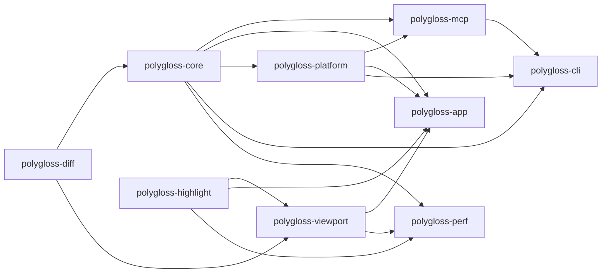

# Polygloss v1 implementation plan

> **For agentic workers:** REQUIRED SUB-SKILL: use `superpowers:subagent-driven-development` (recommended) or `superpowers:executing-plans` to run this plan task by task. Steps use checkbox (`- [ ]`) syntax for tracking.

**Goal:** Ship Polygloss v1: a native macOS (Apple Silicon) diff reviewer with split/unified diffs, Viewed, threaded drafts + Submit review, live worktree diffs, and a local MCP/CLI agent loop that wakes Claude Code on submit.

**Architecture:** A Cargo workspace. Pure-Rust, GPUI-free crates (`polygloss-diff`, `polygloss-core`) own the diff model, git, SQLite store and review domain, and are shared by two executables: the GPUI app `Polygloss` (gpui-kit chrome plus our own from-scratch diff viewport) and the slim `polygloss-cli` (human CLI, JSON CLI, `polygloss mcp` stdio server on rmcp, `polygloss wait` hook waiter). Processes share one SQLite WAL database and talk to the app over a unix socket. A Claude Code plugin in this repo wires the MCP server and the `asyncRewake` hook.

**Tech stack:** Rust 1.98.1, gpui-kit `=0.7.0` (gpui-pre `=0.3.7`), system git + gix 0.88 + gix-imara-diff 0.3, lumis 0.15, rusqlite 0.40 (bundled) + rusqlite_migration 2.6, rmcp `~3.5.0` + tokio (CLI only), notify 8, interprocess 2.4, nucleo-matcher, sha2, cargo-nextest + insta, bun + TypeScript 7 + `@modelcontextprotocol/client` 2.2, cargo-packager 0.11.8, Sparkle 2 via objc2.

**Spec (read before any task):**

| Doc                                                                                                  | Role                                                                                       |
| ---------------------------------------------------------------------------------------------------- | ------------------------------------------------------------------------------------------ |
| Decision log `~/.claude/projects/-Users-dak-projects-polygloss/memory/polygloss-design-decisions.md` | Authoritative. Wins over everything below.                                                 |
| [`docs/design.md`](design.md)                                                                        | Builder-facing spec. Section numbers (`§n`) below point here.                              |
| [`docs/adr/`](adr/README.md)                                                                         | Why each decision was made. Do not relitigate.                                             |
| [`docs/research/library-choices.md`](research/library-choices.md)                                    | Exact versions, features, APIs and gotchas. The verified `[workspace.dependencies]` block. |

If a task seems to need a decision the spec does not make, use the provisional default in [Open questions](#open-questions) and record it there. Never change a decision in the log or an ADR without the user.

---

## Contents

1. [How to execute this plan](#how-to-execute-this-plan)
2. [Global constraints](#global-constraints)
3. [Review focus](#review-focus)
4. [Workspace layout and crate ownership](#workspace-layout-and-crate-ownership)
5. [Milestones at a glance](#milestones-at-a-glance)
6. [M0 Scaffold](#m0-scaffold)
7. [M1 Core](#m1-core)
8. [M2 Viewport gate](#m2-viewport-gate)
9. [M3 Review UX](#m3-review-ux)
10. [M4 Agent integration](#m4-agent-integration)
11. [M5 Packaging and polish](#m5-packaging-and-polish)
12. [Manual gate: agent wake-up in real Claude Code](#manual-gate-agent-wake-up-in-real-claude-code)
13. [Risks and spikes](#risks-and-spikes)
14. [Definition of done (v1)](#definition-of-done-v1)
15. [Open questions](#open-questions)
16. [Spec coverage map](#spec-coverage-map)
17. [Decision log coverage](#decision-log-coverage)

---

## How to execute this plan

### Task card format

Every task has: **Files** (create/modify), **Interfaces** (what it consumes and produces, with exact names), **Steps** (TDD checklist with named tests), **Acceptance** (observable behavior) and **Verify** (commands that must pass). An agent sees only its own task, so the Interfaces block is the contract with neighboring tasks. Names in it are binding; if one must change, update every later task card that uses it in the same change.

### Per-task protocol

- [ ] Read Global constraints, the task card, and every `§` and ADR it cites.
- [ ] Write the failing tests named in the card first; run them and see them fail for the expected reason.
- [ ] Implement the minimum to pass. Keep files focused (one responsibility per `.rs`/`.ts` file).
- [ ] Run the card's **Verify** block, then the standard completion block:

```bash
bun run format            # cargo fmt --all + prettier --write .
bun run lint              # clippy -D warnings + tsc --noEmit
bun run test:unit         # cargo nextest run --workspace
bun test                  # bun suites (builds polygloss-cli via preload)
bun run test:e2e          # build + GPUI E2E/screenshots + MCP E2E
```

- [ ] Commit only if the orchestrator has authorized commits: one commit per task, message `<type>(<crate-or-area>): <task id> <summary>`. Otherwise leave the changes uncommitted in the worktree for review.

### Cargo invocation (read once)

Homebrew's cargo/rustc/rustdoc 1.93 shadow rustup on this machine's `PATH`, and doc-tests then fail with `E0514`. Always run cargo through **`scripts/cargo.sh`** (added by T0.1). It:

- runs rustup's `$CARGO_HOME/bin/cargo` (default `~/.cargo/bin`) with that directory first on `PATH`, and exports `RUSTC`/`RUSTDOC` as the rustup proxies next to it;
- keeps **shared build intermediates** in `CARGO_BUILD_BUILD_DIR=<main checkout>/target-shared`, where the main checkout is the parent of `git rev-parse --path-format=absolute --git-common-dir`, so every git worktree reuses one set of compiled dependencies (cargo ≥ 1.91 `build.build-dir`);
- keeps **final artifacts per worktree** in `CARGO_TARGET_DIR=<git toplevel>/target` (`target/debug/polygloss-cli` is always this checkout's build);
- makes sharing safe. Cargo names workspace-member outputs by the package path relative to the workspace root, so every worktree writes the _same_ member files in `target-shared` and cargo's mtime check alone would reuse another worktree's compiled members (and run its test binaries). So every command that can touch the build dir holds an exclusive lock, `<build dir>.lock` (`/usr/bin/lockf`), for its whole run, including nextest's run phase and `cargo run`. When the build dir was last used by a different checkout (recorded in `<build dir>/.polygloss-checkout`), cargo.sh first runs `cargo clean --workspace` for every profile dir present, so this checkout's members rebuild from its own sources while registry dependencies stay shared. `tree`, `metadata`, `fmt`, `deny`, `--version` and similar commands skip the lock. A nested cargo.sh (e.g. from a test) in the same checkout reuses the held lock; from a different checkout it fails loudly instead of deadlocking;
- derives both dirs from the checkout that contains the script (not the caller's cwd), ignores inherited `GIT_DIR`/`GIT_WORK_TREE`, and respects caller-provided `CARGO_TARGET_DIR`, `CARGO_BUILD_BUILD_DIR`, `RUSTC` and `RUSTDOC`. Outside any git checkout (a source tarball) both dirs go in the script's own checkout; inside one, a failing `git` is an error, never a silent fallback to a second target dir.

Cost: switching worktrees rebuilds the nine workspace members (not dependencies), and one worktree's long test run or `cargo.sh run` blocks the others' builds until it ends. For long-lived processes, `scripts/cargo.sh build` and then run `target/<profile>/<bin>` directly. `tests/scripts/cargo-sh.test.ts` pins this behavior, including a real-cargo test with two checkouts whose sources diverge. `/target`, `/target-shared` and `/target-shared.lock` are gitignored. Never create other target dirs. All commands in this plan are written `scripts/cargo.sh …`. Before T0.1 lands, use `PATH="$HOME/.cargo/bin:$PATH" ~/.cargo/bin/cargo …`.

### Parallelism rules

| Rule         | Detail                                                                                                                                                                                                                                                                                                                                                                                                                                                                                                                                                                                |
| ------------ | ------------------------------------------------------------------------------------------------------------------------------------------------------------------------------------------------------------------------------------------------------------------------------------------------------------------------------------------------------------------------------------------------------------------------------------------------------------------------------------------------------------------------------------------------------------------------------------- |
| Waves        | Each milestone lists waves. Tasks in one wave touch disjoint files and may run at once. A wave starts when every task of the previous wave passed its Verify block and was reviewed.                                                                                                                                                                                                                                                                                                                                                                                                  |
| Worktrees    | Parallel tasks run in separate git worktrees (`superpowers:using-git-worktrees`). Through `scripts/cargo.sh` they share build intermediates in `<main checkout>/target-shared` (`CARGO_BUILD_BUILD_DIR`) and each keeps its own final artifacts in `<worktree>/target` (`CARGO_TARGET_DIR`). cargo.sh serializes building commands across worktrees for their whole run (tests included) and rebuilds workspace members when another worktree used the build dir last, so a waiting agent prints `cargo.sh: waiting for another cargo.sh using …`. That wait is expected, not a hang. |
| Concurrency  | At most **3** cargo-building agents at once. The disk had 30 GB free on 2026-09-28, and a gpui-kit target dir peaks around 8.3 GB (almost all of it in the shared `target-shared`; per-worktree `target/` holds only final binaries). Check `df -h /System/Volumes/Data` before building; stop and report below 15 GB free.                                                                                                                                                                                                                                                           |
| Shared files | `Cargo.toml` (workspace), `package.json`, `crates/polygloss-app/src/features.rs` and the default keymap are edited only by the task that the card names. Other tasks add code in their own modules.                                                                                                                                                                                                                                                                                                                                                                                   |
| Merge order  | Merge in wave order, task-id order inside a wave. Re-run the completion block after each merge.                                                                                                                                                                                                                                                                                                                                                                                                                                                                                       |

### Milestone exit gates

A milestone is done only when its **Exit gate** commands all pass on a clean checkout of the merged branch, and its gate checklist is ticked. The next milestone does not start before that. Optional parallel track: M4 tasks marked **(core-only)** depend only on M1 and may start after the M1 gate if capacity allows; they still count toward the M4 gate.

---

## Global constraints

Every task's requirements include this section.

| Area         | Constraint (exact values)                                                                                                                                                                                                                                                                                                                                                                                                                                                                                                                                                                                                                                                                                                                                                                                                                                                                                                                                                                   |
| ------------ | ------------------------------------------------------------------------------------------------------------------------------------------------------------------------------------------------------------------------------------------------------------------------------------------------------------------------------------------------------------------------------------------------------------------------------------------------------------------------------------------------------------------------------------------------------------------------------------------------------------------------------------------------------------------------------------------------------------------------------------------------------------------------------------------------------------------------------------------------------------------------------------------------------------------------------------------------------------------------------------------- |
| Toolchain    | `rust-toolchain.toml` channel **`1.98.1`**, profile `minimal`, components `rustfmt`, `clippy`. Edition 2024, `resolver = "3"`. Cargo via `scripts/cargo.sh` (`~/.cargo/bin/cargo`).                                                                                                                                                                                                                                                                                                                                                                                                                                                                                                                                                                                                                                                                                                                                                                                                         |
| Platform     | macOS on Apple Silicon only; minimum macOS **14** (provisional OQ-18). Keep macOS-only code in `polygloss-platform` or behind `cfg(target_os = "macos")`.                                                                                                                                                                                                                                                                                                                                                                                                                                                                                                                                                                                                                                                                                                                                                                                                                                   |
| License      | `MIT OR Apache-2.0` on every crate and package. No GPL, AGPL or FSL code or dependencies. Zed, GitComet, reviu, GitButler, pierre-native: **study only, never copy**. System git, never bundled.                                                                                                                                                                                                                                                                                                                                                                                                                                                                                                                                                                                                                                                                                                                                                                                            |
| UI deps      | `gpui-kit = "=0.7.0"` only. **Never** depend on `gpui-pre` directly; import via `gpui_kit::*`. All gpui-kit `tree-sitter*` features **off**. `test-support` only in `[dev-dependencies]`. **Never call `cx.set_http_client`.** No web views of any kind.                                                                                                                                                                                                                                                                                                                                                                                                                                                                                                                                                                                                                                                                                                                                    |
| Other pins   | Copy the verified `[workspace.dependencies]` block from `docs/research/library-choices.md` verbatim. `rmcp = "~3.5.0"` (no default features; `server`, `macros`, `transport-io`). `lumis` default features off; never enable `lumis-wasm-runtime/wasm`. One SQLite crate only.                                                                                                                                                                                                                                                                                                                                                                                                                                                                                                                                                                                                                                                                                                              |
| Slim CLI     | `polygloss-cli` must link **zero** `gpui-*`, `lumis` and `tree-sitter` crates (`scripts/check-deps.sh`).                                                                                                                                                                                                                                                                                                                                                                                                                                                                                                                                                                                                                                                                                                                                                                                                                                                                                    |
| Offline      | No network in app or CLI: no `git fetch`, no HTTP clients (`ureq`, `reqwest`, `hyper`, `curl`, `wasmtime` must not appear in the normal graph). Every git call sets `GIT_NO_LAZY_FETCH=1`, `GIT_TERMINAL_PROMPT=0`, `GIT_OPTIONAL_LOCKS=0`, `GIT_ALLOW_PROTOCOL=` (empty: no transport, whatever `protocol.*` config says), `GIT_NO_REPLACE_OBJECTS=1`, `LC_ALL=C`, `-c protocol.allow=never`, `-c core.quotePath=false`, and clears inherited `GIT_DIR`, `GIT_WORK_TREE`, `GIT_INDEX_FILE`, `GIT_OBJECT_DIRECTORY`, `GIT_COMMON_DIR`, `GIT_ALTERNATE_OBJECT_DIRECTORIES` (except where snapshots set them on purpose) and inherited `GIT_CONFIG_PARAMETERS`/`GIT_CONFIG_COUNT`. In-process gix object reads must ignore `refs/replace/*` too. Sparkle is the only allowed egress (OQ-16).                                                                                                                                                                                                  |
| Git safety   | Never modify the user's index, HEAD, branches or any ref outside `refs/polygloss/`. Never run `git stash` or `git gc`. Diff flags: `-z --no-ext-diff --no-textconv -M50% -l1000`, no `-C`.                                                                                                                                                                                                                                                                                                                                                                                                                                                                                                                                                                                                                                                                                                                                                                                                  |
| Identity     | `diff_id = lowercase_hex(sha256("polygloss/diff/v1\n" + objfmt + "\n" + base_tree + "\n" + head_tree))` (§4.1, OQ-1). Repo identity = realpath of `git rev-parse --path-format=absolute --git-common-dir`.                                                                                                                                                                                                                                                                                                                                                                                                                                                                                                                                                                                                                                                                                                                                                                                  |
| Store        | `~/Library/Application Support/polygloss/polygloss.db` (dir `0700`, file `0600`); override dir with `POLYGLOSS_DATA_DIR`. Bootstrap order and `BEGIN IMMEDIATE` per §7.1. Every mutation appends its `events` row in the same transaction. Schema = §7.2 exactly.                                                                                                                                                                                                                                                                                                                                                                                                                                                                                                                                                                                                                                                                                                                           |
| MCP          | stdout is the JSON-RPC channel: never `println!` in `polygloss mcp`; log to stderr with `with_ansi(false)`, default filter `warn`. Server instructions < 2,048 chars. `polygloss mcp` never launches the app at startup.                                                                                                                                                                                                                                                                                                                                                                                                                                                                                                                                                                                                                                                                                                                                                                    |
| Bundle       | Bundle id **`dev.dak.polygloss`**, team **`5U7E4UQ5M3`**, executables `Polygloss` and `polygloss-cli` (installed as `polygloss`). Never use team `FCSF68W94H`.                                                                                                                                                                                                                                                                                                                                                                                                                                                                                                                                                                                                                                                                                                                                                                                                                              |
| Naming       | kebab-case for crate dirs, package names, TS files, scripts, docs, fixtures, assets. snake_case only for Rust `.rs` module files (no `#[path]`). Bin names `Polygloss`, `polygloss-cli`, `polygloss-perf`.                                                                                                                                                                                                                                                                                                                                                                                                                                                                                                                                                                                                                                                                                                                                                                                  |
| TypeScript   | Inline function parameter types; **no standalone `interface` declarations** (use inline object types or `type` aliases only where unavoidable). Strict `tsc`. Prettier-formatted.                                                                                                                                                                                                                                                                                                                                                                                                                                                                                                                                                                                                                                                                                                                                                                                                           |
| Test hygiene | Every test process gets its own temp `HOME`, `POLYGLOSS_DATA_DIR`, `XDG_CONFIG_HOME`, `GIT_CONFIG_GLOBAL` (empty file) and `GIT_CONFIG_NOSYSTEM=1`, and a cache dir under the temp `HOME`. Never read or write the real `~/Library` or `~/.config` from tests or spikes.                                                                                                                                                                                                                                                                                                                                                                                                                                                                                                                                                                                                                                                                                                                    |
| Tests        | Every code change adds or updates tests. `bun test` and `bun run test:e2e` pass before any task counts as complete. GPUI-linking crates (`polygloss-viewport`, `polygloss-app`) have **one** integration test binary each to save link time and disk: `tests/viewport/main.rs` and `tests/app/main.rs`, one module per feature, plus `polygloss-app`'s `tests/e2e/main.rs` (feature `e2e`). A card path such as `crates/polygloss-viewport/tests/blocks.rs` means module `tests/viewport/blocks.rs`; `crates/polygloss-app/tests/shell.rs` means `tests/app/shell.rs`; `tests/e2e_<name>.rs` means `tests/e2e/<name>.rs`. T2.3, T2.8 and T3.1 pre-create the module lists (T0.1 already created `tests/app/main.rs` with `mod version;`; T0.2 created the empty `tests/e2e/main.rs` target and the `e2e` feature). The `e2e` binary is `harness = false` (T2.8 As built): its tests are plain `fn()`s in each module's `TESTS` table, run on the main thread by `tests/support/harness.rs`. |

---

## Review focus

Inputs the spec implies but that feature tests tend to miss. Each has a named test in the task that owns the code.

| #   | Input or condition                                                                                                        | Expected behavior                                                                                                    | Pinned by                                                                                                                        |
| --- | ------------------------------------------------------------------------------------------------------------------------- | -------------------------------------------------------------------------------------------------------------------- | -------------------------------------------------------------------------------------------------------------------------------- |
| RF1 | Paths with spaces, quotes, tabs, newlines, non-ASCII and non-UTF-8 bytes; renames into and out of such paths              | `-z` parsing keeps them exact; non-UTF-8 is stored escaped and flagged (OQ-25); nothing panics                       | T1.3 `diff_tree_parses_hostile_paths`, T1.3 `diff_tree_non_utf8_path_is_escaped_and_flagged`                                     |
| RF2 | Unborn HEAD (fresh `git init`), no commits on either side, no `origin`, detached HEAD, shallow clone missing objects      | Live diff vs the empty tree; default-branch fallback chain with a notice; `objects_missing` error, never a fetch     | T1.2 `resolve_live_in_unborn_repo_uses_empty_tree`, T1.2 `resolve_shallow_missing_objects_errors`                                |
| RF3 | Agents and hooks that export `GIT_DIR`/`GIT_INDEX_FILE`/`GIT_WORK_TREE`; running from a subdirectory or a linked worktree | Env is scrubbed; all worktrees collapse to one repo row; the user's index is byte-identical after a snapshot         | T1.2 `git_runner_scrubs_inherited_git_env`, T1.5 `snapshot_leaves_user_index_untouched`, T1.12 `linked_worktrees_share_repo_row` |
| RF4 | CRLF files, missing trailing newline, whitespace-only changes, a 5 MB minified single line, a file with 200k lines        | Correct hunks and line numbers; word diff skipped above 1,000 chars; no quadratic blowups; `\ No newline` marker row | T1.6 `hunks_crlf_and_no_trailing_newline`, T1.7 `word_diff_skips_long_lines`, T1.9 `rows_no_newline_marker`                      |
| RF5 | Several processes at once: first-ever launch of app + two `polygloss mcp` + `polygloss wait` against a missing DB         | Exactly one migration runs; no `SQLITE_BUSY` surfaced; every event observed exactly once by each reader              | T1.10 `store_concurrent_first_open_migrates_once`, T4.11 `mcp-multi-process-writers.test.ts`                                     |

---

## Workspace layout and crate ownership

Design §24 and the library-choices member wiring now mirror this layout. OQ-P1 records why it differs from the first sketch: the highlight adapter is its own crate (so the slim CLI never links lumis or tree-sitter), `polygloss-platform` does not depend on gpui-kit (so the CLI can use its launcher), and a separate `polygloss-perf` crate holds the perf harness.

```text
Cargo.toml  Cargo.lock  rust-toolchain.toml  deny.toml  rustfmt.toml  clippy.toml
package.json  bun.lock  bunfig.toml  tsconfig.json  .prettierrc.json  .prettierignore
LICENSE-MIT  LICENSE-APACHE  NOTICE  README.md  AGENTS.md
crates/
  polygloss-diff/        # diff model + algorithms (no git, no IO, no GPUI)
  polygloss-core/        # git, ids, snapshots, store, review domain, carry-forward, events, IPC (no GPUI)
  polygloss-highlight/   # lumis adapter, compact tokens, Zed-theme model, Pierre themes (no GPUI)
  polygloss-viewport/    # our GPUI diff viewport (document model + element)
  polygloss-platform/    # macOS glue: launch, Dock badge, Sparkle, editor detection, CLI install (no GPUI)
  polygloss-app/         # bin `Polygloss`: window, tabs, panes, review UX
  polygloss-mcp/         # transport-agnostic agent API + rmcp stdio server (no GPUI)
  polygloss-cli/         # bin `polygloss-cli` (on PATH as `polygloss`)
  polygloss-perf/        # bin `polygloss-perf`: perf harness (dev only, never shipped)
tests/                   # bun suites: support/, cli/, mcp/, plugin/, scripts/, e2e/
scripts/                 # cargo.sh, check-deps.sh, make-fixture-repo.ts, git-parity.ts, test-e2e.sh, …
benches/                 # corpora/ generators, budgets.json, run-perf.ts, results/ (gitignored)
fixtures/                # small committed fixture inputs (kebab-case)
assets/                  # fonts/lilex/, themes/pierre-{light,dark}.json, icons/
plugins/polygloss/       # Claude Code plugin (design §16.1)
.claude-plugin/marketplace.json
packaging/               # Info.plist, entitlements.plist, icon.icns, homebrew/, sparkle/
.github/workflows/       # ci.yml, nightly.yml, release.yml
docs/                    # design.md, adr/, research/, plan.md, testing/
```

### Ownership

| Crate                 | Owns                                                                                                                                                                                                                                                                                                                                                                                                                                                                                                                                                           | Must not contain                                          |
| --------------------- | -------------------------------------------------------------------------------------------------------------------------------------------------------------------------------------------------------------------------------------------------------------------------------------------------------------------------------------------------------------------------------------------------------------------------------------------------------------------------------------------------------------------------------------------------------------- | --------------------------------------------------------- |
| `polygloss-diff`      | Shared plain types (`Oid`, `ObjectFormat`, `Side`, `FileStatus`, `FileKind`, `FileChange`); hunk computation with context grouping; whitespace mode; word/char ranges and line pairing; `LineMap` (blob→blob line mapping); split/unified **row model** incl. gap/expander rows.                                                                                                                                                                                                                                                                               | git, SQLite, filesystem, GPUI, lumis                      |
| `polygloss-core`      | Git runner and version check; repo discovery; source resolution (§3); `diff-tree` parser; attribute/binary/generated detection; gix blob reads incl. scratch store; snapshots and pinning (§5); `diff_id` and review keys (§4); store, schema, migrations, events, `data_version` feed (§7); review domain: reviews, iterations, threads, comments, drafts, submissions, Viewed, view_state, sessions, assignments, waiters; carry-forward (§8.6); suggestion parsing via `markdown`; data/cache paths; socket protocol types, client and server loop (§13.3). | GPUI, tokio, rmcp, lumis                                  |
| `polygloss-highlight` | Language guess; lumis highlighting with budget + cancellation into compact spans; token cache keyed by `(blob, language, theme)`; Zed theme JSON serde model; Pierre Light/Dark; scope→style longest-prefix mapping.                                                                                                                                                                                                                                                                                                                                           | GPUI, git, SQLite                                         |
| `polygloss-viewport`  | Document model (file entries, states, height prefix sums, logical scroll anchor, materialization window, LRU); `DiffViewport` GPUI view/element: painting, shaping cache, sticky headers, gap expanders, collapse, line cursor/selection, gutter "+", variable-height block slots with split spacers; `DiffProvider` trait.                                                                                                                                                                                                                                    | SQLite, git, review semantics (threads are opaque blocks) |
| `polygloss-platform`  | `launch_app(url, activate)` (`open -g -b dev.dak.polygloss`, dev override); Dock badge (objc2, feature `appkit`); Sparkle loader (feature `appkit`); editor detection and argv templates; Install CLI symlink; bundle detection.                                                                                                                                                                                                                                                                                                                               | GPUI, tokio                                               |
| `polygloss-app`       | Everything user-facing in the GUI: window, tabs, Home, open flow, file tree, threads UI, composer, submit dialog, banners, live watcher, palette, keymap, settings, themes→gpui-kit tokens, find, notifications (GPUI APIs), socket server wiring, URL handling, logging.                                                                                                                                                                                                                                                                                      | tokio, rmcp                                               |
| `polygloss-mcp`       | `api` module: transport-agnostic functions with serde request/response types shared by MCP and the JSON CLI; `server` module: rmcp tool router, instructions, resources, pagination cursors, error-code mapping.                                                                                                                                                                                                                                                                                                                                               | GPUI, lumis                                               |
| `polygloss-cli`       | clap entry points (§14), lazy app launch, human output vs `--json`, `mcp` and `wait` subcommands, tokio `current_thread` runtime.                                                                                                                                                                                                                                                                                                                                                                                                                              | GPUI, lumis                                               |
| `polygloss-perf`      | Headed perf scenarios over corpora, JSON results.                                                                                                                                                                                                                                                                                                                                                                                                                                                                                                              | Shipping code (nothing depends on it)                     |

### Dependency direction



Arrows point from dependency to dependent. `polygloss-diff` is the leaf. `polygloss-viewport` does not depend on `polygloss-core`: the app adapts core data to the `DiffProvider` trait, so the viewport is testable with synthetic data. `scripts/check-deps.sh` enforces the crate-level parts of the "Must not contain" column on the macOS normal+build graph: GPUI = `gpui*`, lumis = `lumis*`, tokio = `tokio`, rmcp = `rmcp*`, git = `gix`/`git2`/`libgit2-sys` (not the standalone `gix-imara-diff`), SQLite = `rusqlite`/`libsqlite3-sys`; `polygloss-diff` additionally has no tokio or rmcp. "Filesystem" (diff) and "review semantics" (viewport) are code-review items. Each member is checked with its own feature resolution (`cargo tree -p`), so a `--workspace` build can still unify features (e.g. the CLI links `polygloss-platform` with `appkit` there); ship binaries built with `-p` (T5.1).

---

## Milestones at a glance

| Milestone               | Delivers                                                                                                                 | Tasks      | Exit gate (summary)                                                        |
| ----------------------- | ------------------------------------------------------------------------------------------------------------------------ | ---------- | -------------------------------------------------------------------------- |
| M0 Scaffold             | Workspace, toolchain, profiles, bun scripts, prettier, CI, README                                                        | T0.1–T0.3  | All scripts green on empty crates; dependency audit passes                 |
| M1 Core                 | Git layer, sources, ids, snapshots, hunks, word diff, line mapping, rows, store, domain                                  | T1.1–T1.16 | Unit + integration + git-parity suites pass; store concurrency tests pass  |
| M2 Viewport gate        | GPUI window rendering real diffs; virtualization, highlighting, sticky headers, gaps; perf harness                       | T2.1–T2.10 | **All §12.1 budgets met on all four corpora**, or fallbacks approved       |
| M3 Review UX            | Tabs, Home, open flow, tree, Viewed, threads, drafts, submit, live, palette, keymap, themes, find, editor, notifications | T3.1–T3.17 | GPUI E2E + screenshot suites pass; keyboard-only review flow passes        |
| M4 Agent integration    | Socket IPC, single instance, URL scheme, CLI, MCP tools, wait, plugin, JSON CLI, opt-in `claude/channel`                 | T4.1–T4.13 | bun MCP/CLI/E2E suites pass; manual wake gate W1–W3 recorded               |
| M5 Packaging and polish | cargo-packager, signing/notarization scripts, Sparkle stub, cask, docs, a11y pass, audits                                | T5.1–T5.8  | Full E2E on the bundled app; audits; manual wake gate W1–W8; DoD checklist |

---

## M0 Scaffold

**Goal:** an empty but fully wired workspace where every script and CI job runs green, so later tasks only add code and tests.

**Waves:** W1 = T0.1. W2 = T0.2 ∥ T0.3.

### T0.1 Workspace, toolchain, profiles, crate skeletons, dependency audit

**Files**

- Create: `rust-toolchain.toml`, `Cargo.toml`, `rustfmt.toml`, `clippy.toml`, `deny.toml`, `.gitignore`, `.config/nextest.toml`, `LICENSE-MIT`, `LICENSE-APACHE`, `NOTICE`, `scripts/cargo.sh`, `scripts/check-deps.sh`
- Test: `tests/scripts/cargo-sh.test.ts`, `tests/scripts/check-deps.test.ts` (run with `bun test tests/scripts` before T0.2 adds `package.json`), `crates/polygloss-app/tests/app/{main.rs, version.rs}` (T2.8 and T3.1 extend this module list and keep `mod version;`)
- Create: `crates/<crate>/Cargo.toml` and `crates/<crate>/src/lib.rs` for `polygloss-diff`, `-core`, `-highlight`, `-viewport`, `-platform`, `-mcp`; `crates/polygloss-app/src/main.rs` (bin `Polygloss`), `crates/polygloss-cli/src/main.rs` (bin `polygloss-cli`), `crates/polygloss-perf/src/main.rs` (bin `polygloss-perf`, `publish = false`)

**Interfaces**

- Produces: `polygloss_core::VERSION: &str` (from `CARGO_PKG_VERSION`); `polygloss-cli --version` prints `polygloss <version>`; `Polygloss` opens nothing yet and exits 0 with `--version`.
- Produces: `scripts/cargo.sh` (see [Cargo invocation](#cargo-invocation-read-once)) and `scripts/check-deps.sh` used by every later gate.

**Steps**

- [x] Prerequisites (dev tools, not project deps): `rustup toolchain install 1.98.1` (already present), `curl -LsSf https://get.nexte.st/latest/mac | tar zxf - -C ~/.cargo/bin`, then cargo-deny and cargo-insta into `~/.cargo/bin` (prebuilt, checksum-verified GitHub release binaries `cargo-deny-<v>-aarch64-apple-darwin.tar.gz` and `cargo-insta-aarch64-apple-darwin.tar.xz` save a from-source build; `scripts/cargo.sh install --locked cargo-deny cargo-insta` also works). Check `df -h /System/Volumes/Data` ≥ 15 GB free.
- [x] `rust-toolchain.toml`: exactly the block in library-choices "Verified `[workspace.dependencies]`" (channel `1.98.1`, profile `minimal`, components `rustfmt`, `clippy`).
- [x] `Cargo.toml`: `resolver = "3"`, all nine members, `[workspace.package]` (`edition = "2024"`, `rust-version = "1.98.1"`, `license = "MIT OR Apache-2.0"`, `repository`), and the verified `[workspace.dependencies]` block **verbatim**, plus `uuid = { version = "1", features = ["v7", "serde"] }` (OQ-P2). Crates reference deps with `workspace = true`; each crate lists only what the ownership table allows.
- [x] Profiles tuned for small target dirs and fast debug scrolling:

```toml
[profile.dev]
debug = "line-tables-only"   # full debuginfo for gpui-kit bloats target/ by GBs
incremental = true

[profile.dev.package]
"*" = { debug = false }
gpui-pre = { opt-level = 3 }
gpui-pre-platform = { opt-level = 3 }
gpui-pre-sum-tree = { opt-level = 3 }
taffy = { opt-level = 3 }
resvg = { opt-level = 3 }
rustybuzz = { opt-level = 3 }
ttf-parser = { opt-level = 3 }
smol = { opt-level = 3 }
ropey = { opt-level = 3 }
markdown = { opt-level = 3 }
tree-sitter = { opt-level = 3 }
gix-imara-diff = { opt-level = 3 }

[profile.release]
lto = "thin"
debug = false
strip = "debuginfo"

[profile.perf]                  # for polygloss-perf and samply profiles
inherits = "release"
debug = "line-tables-only"
strip = "none"
```

Drop any `profile.dev.package` entry cargo warns does not match a package.

- [x] `#![forbid(unsafe_code)]` in `polygloss-diff`, `-core`, `-highlight`, `-mcp`, `-cli`. `polygloss-platform` allows unsafe only inside `appkit`-feature modules.
- [x] `polygloss-platform` features: `default = []`, `appkit = ["dep:objc2", "dep:objc2-foundation", "dep:objc2-app-kit"]`. The app enables `appkit`; the CLI does not.
- [x] `.config/nextest.toml`: `[profile.default] slow-timeout = { period = "60s", terminate-after = 5 }`; `[profile.ci] fail-fast = false`.
- [x] `deny.toml`: `[graph] targets = ["aarch64-apple-darwin"]`; allow `MIT`, `Apache-2.0`, `Apache-2.0 WITH LLVM-exception`, `BSD-2-Clause`, `BSD-3-Clause`, `ISC`, `Zlib`, `0BSD`, `CC0-1.0`, `Unicode-3.0`, `BSL-1.0`, `MPL-2.0`; everything else (incl. all GPL/LGPL/AGPL) denied, except one per-crate exception: `libbz2-rs-sys` under the permissive `bzip2-1.0.6` license (reached via gpui-pre-http-client → async-compression → bzip2); `[sources] unknown-git = "deny"`, `unknown-registry = "deny"`; `[bans] multiple-versions = "warn"`; `[advisories] unmaintained = "workspace"` (added by T0.3 for the CI `audit` job: vulnerabilities fail anywhere, but "unmaintained" only for direct dependencies, because gpui-kit pulls in unmaintained `instant`, `paste`, `rustybuzz` and `ttf-parser`).
- [x] `scripts/check-deps.sh [--manifest-path <Cargo.toml>]` (runs `cargo tree -e normal,build --target aarch64-apple-darwin`; prints `check-deps: ok`, exits 1 on a violation and 2 if cargo cannot read the workspace): fails if `polygloss-cli` reaches any crate matching `^(gpui|lumis|tree-sitter)`; fails if `polygloss-diff`, `-core`, `-highlight`, `-platform`, `-mcp` reach `^gpui`; fails if `polygloss-diff`/`-core` reach `lumis|tokio|rmcp`; fails if `cargo tree -d` lists more than one `tree-sitter` or `libsqlite3-sys`; fails if `cargo tree --workspace -i <x>` prints any package for any of `ureq reqwest hyper curl wasmtime openssl-sys` (cargo exits 0 with "nothing to print" for `hyper`, which exists only under `cfg(target_family = "wasm")`).
- [x] Tests: `crates/polygloss-core/src/lib.rs` `#[test] fn version_is_semver()`; `crates/polygloss-cli/tests/version.rs` `cli_prints_version` (runs the bin via `env!("CARGO_BIN_EXE_polygloss-cli")`); `crates/polygloss-app/tests/app/version.rs` `app_prints_version_and_exits_zero`; `tests/scripts/cargo-sh.test.ts` (worktree vs main-checkout dirs, caller overrides, `RUSTC`/`RUSTDOC`, inherited `GIT_DIR`, non-git fallback vs failing git, takeover clean, cross-checkout lock and nesting, real cargo 1.98.1 with two diverging checkouts sharing one build dir); `tests/scripts/check-deps.test.ts` (real workspace passes; path-only fixture workspaces with fake `gpui-kit`, `lumis`, `tokio`, `rmcp`, `gix`, `rusqlite`, two `tree-sitter` or `libsqlite3-sys` versions and `ureq` each fail with the rule named; a crate only under a non-macOS cfg passes). The Rust version tests run the binaries with a sandboxed `HOME`, `XDG_CONFIG_HOME`, `XDG_CACHE_HOME`, `POLYGLOSS_DATA_DIR` and git config.
- [x] `.gitignore`: `/target`, `/target-shared`, `/target-shared.lock`, `/node_modules`, `/vendor/`, `/dist/`, `/benches/results/`, `*.profraw`, `.DS_Store`.
- [x] `NOTICE`: project header only; T2.2 and T3.3 append the Pierre theme and Lilex credits.

**Acceptance:** `scripts/cargo.sh --version` reports 1.98.1; the workspace builds; `polygloss-cli --version` prints `polygloss 0.1.0`; the dependency audit passes.

**Verify**

```bash
scripts/cargo.sh check --workspace --all-targets
scripts/cargo.sh nextest run --workspace --no-tests=warn
scripts/check-deps.sh
scripts/cargo.sh deny check licenses bans sources
bun test tests/scripts
du -sh target "$(git rev-parse --path-format=absolute --git-common-dir)/../target-shared"   # record; together < 10 GB
```

### T0.2 Bun and TypeScript scaffold, package scripts, prettier

**Files**

- Create: `package.json`, `bunfig.toml`, `tsconfig.json`, `.prettierrc.json`, `.prettierignore`, `scripts/test-e2e.sh`, `scripts/make-fixture-repo.ts`
- Create: `tests/support/preload.ts`, `tests/support/sandbox.ts`, `tests/support/bins.ts`, `tests/support/fixture-repo.ts`
- Modify: `crates/polygloss-app/Cargo.toml` (feature `e2e`, empty `e2e` test target); create `crates/polygloss-app/tests/e2e/main.rs`
- Test: `tests/support/sandbox.test.ts`, `tests/scripts/fixture-repo.test.ts`, `tests/cli/version.test.ts`, `tests/e2e/smoke.test.ts` (plus `tests/support/{bins,preload}.test.ts`, `tests/scripts/test-e2e.test.ts`)

**Interfaces**

- Produces (TS, inline types only):
  - `makeSandbox(): { home: string; dataDir: string; configDir: string; env: Record<string, string>; cleanup: () => void }`
  - `makeFixtureRepo(opts: { dir: string; kind: "basic" | "renames" | "hostile-paths" | "worktrees" | "sha256" | "unborn" }): { path: string; git: (args: string[]) => string }`
  - `cliBin(): string` (absolute path of the built `polygloss-cli`, or `$POLYGLOSS_CLI_BIN` when set), `appBin(): string` (built `Polygloss`, E2E only)
- Produces: package scripts `test`, `test:unit`, `test:e2e`, `lint`, `format`, `format:check`.

**Steps**

- [x] `package.json` (`"private": true`, `"type": "module"`, `"license": "MIT OR Apache-2.0"`). devDependencies exactly `@modelcontextprotocol/client@2.2.0`, `@types/bun@1.4.2`, `typescript@7.0.2`, `prettier@3.9.9`. No `peerDependencies` (library-choices §15 gotcha). Scripts:

```json
{
  "test": "bun test",
  "test:unit": "scripts/cargo.sh nextest run --workspace --no-tests=warn",
  "test:e2e": "scripts/test-e2e.sh",
  "lint": "scripts/cargo.sh clippy --workspace --all-targets -- -D warnings && tsc --noEmit -p .",
  "format": "scripts/cargo.sh fmt --all && prettier --write .",
  "format:check": "scripts/cargo.sh fmt --all --check && prettier --check ."
}
```

- [x] `bunfig.toml`: `[test] root = "tests"`, `preload = ["./tests/support/preload.ts"]`.
- [x] `preload.ts`: unless `POLYGLOSS_SKIP_BUILD=1`, run `scripts/cargo.sh build -p polygloss-cli` once and fail loudly with cargo's stderr.
- [x] `tsconfig.json`: `"strict": true`, `"module": "Preserve"`, `"moduleResolution": "bundler"`, `"types": ["bun"]`, `"noEmit": true`, include `tests`, `scripts`, `benches`, `plugins`.
- [x] `.prettierignore`: `target/`, `node_modules/`, `vendor/`, `bun.lock`, `crates/**/snapshots/`, `**/*.png`.
- [x] `sandbox.ts` sets `HOME`, `POLYGLOSS_DATA_DIR`, `XDG_CONFIG_HOME`, `GIT_CONFIG_GLOBAL` (empty file), `GIT_CONFIG_NOSYSTEM=1`, `GIT_AUTHOR_*`/`GIT_COMMITTER_*` fixed names and dates.
- [x] `scripts/test-e2e.sh`: build `polygloss-app` and `polygloss-cli` (one `-p` each, so the CLI never links `appkit`); run `scripts/cargo.sh nextest run -p polygloss-app --features e2e --no-tests=warn -E 'binary(e2e)'`; then `POLYGLOSS_E2E=1 POLYGLOSS_SKIP_BUILD=1 bun test tests/e2e`. nextest rejects a filterset that matches no binary, so this task also declares the `e2e` feature (`[features] e2e = []`) and an empty `[[test]] name = "e2e"`, `path = "tests/e2e/main.rs"`, `required-features = ["e2e"]` in `crates/polygloss-app/Cargo.toml`. Until M2 that binary has no tests, so the nextest step reports "no tests to run" and passes.
- [x] `makeFixtureRepo` creates the repo at `<dir>/<kind>` (`dir` is created if missing; the repo path must not exist) and returns its realpath; kind `worktrees` adds linked worktrees `feature` (branch with one extra commit) and `detached` under `<dir>/worktrees-linked/`. Git runs hermetically (`GIT_CONFIG_GLOBAL=/dev/null`, `GIT_CONFIG_NOSYSTEM=1`, fixed identity and per-commit dates, nothing inherited but `PATH`), so object ids are reproducible. `hostile-paths` builds its trees with plumbing and includes a non-UTF-8 path, which APFS cannot create, so that entry is `skip-worktree` in the checkout. `bun scripts/make-fixture-repo.ts <kind> <dir>` prints the repo path.
- [x] Tests: `sandbox.test.ts` → `sandbox never points at the real HOME`; `fixture-repo.test.ts` → `basic repo has two commits`, `sha256 repo reports sha256 object format`, `hostile-paths repo contains a path with a newline`; `version.test.ts` → `polygloss-cli --version prints the crate version`; `e2e/smoke.test.ts` → `describe.skipIf(!process.env.POLYGLOSS_E2E)` placeholder asserting `appBin()` exists.

**Acceptance:** `bun install` creates `bun.lock`; `bun test`, `bun run lint`, `bun run format:check` and `bun run test:e2e` all pass.

**Verify:** the standard completion block.

### T0.3 CI workflow, README, AGENTS.md

**Files**

- Create: `.github/workflows/ci.yml`, `README.md`, `AGENTS.md`

**Interfaces**

- Produces: CI jobs `lint`, `unit`, `bun`, `e2e`, `audit` on macOS arm64. Later milestones add `nightly.yml` (T1.6, T2.9) and `release.yml` (T5.2).

**Steps**

- [x] `ci.yml`: trigger on push and pull_request; runner `macos-15` (arm64, OQ-P9); steps: `actions/checkout@v7`, `rustup toolchain install` (no argument: installs the toolchain `rust-toolchain.toml` pins; rustup ≥ 1.28 no longer installs it on `rustup show`) then `rustup show`, `Swatinem/rust-cache@v2` with `workspaces: ". -> target-shared"` (cargo.sh keeps intermediates there), `taiki-e/install-action@v2` with `cargo-nextest,cargo-deny`, `oven-sh/setup-bun@v2` (`bun-version: 1.3.14`), `bun install --frozen-lockfile`. Jobs: `lint` (`bun run format:check && bun run lint`), `unit` (`scripts/cargo.sh nextest run --workspace --no-tests=warn --profile ci`), `bun` (`bun test`), `e2e` (`bun run test:e2e`), `audit` (`scripts/check-deps.sh && scripts/cargo.sh deny check licenses bans sources advisories`). In CI, `scripts/cargo.sh` still works because rustup's cargo lives in `~/.cargo/bin`.
- [x] `README.md` (concise): what Polygloss is, status (pre-alpha), requirements (macOS 14+ on Apple Silicon, system git ≥ 2.39, rustup with 1.98.1, bun 1.3), the cargo `PATH` gotcha, build/test commands, layout table, links to `docs/design.md`, `docs/adr/`, `docs/plan.md`, dual license.
- [x] `AGENTS.md`: one screen: link to plan Global constraints, the completion block, "never touch the real HOME in tests", "never add GPL deps", "cargo only via `scripts/cargo.sh`".
- [x] Test: `tests/scripts/repo-hygiene.test.ts` → `every tracked file name is kebab-case` (walks `git ls-files`; lowercase kebab-case required everywhere except this fixed allowlist: `README.md`, `AGENTS.md`, `CONTRIBUTING.md`, `LICENSE-*`, `NOTICE`, `Cargo.toml`, `Cargo.lock`, dotfiles and dot-directories, `.rs` files (Rust rules), insta `*.snap` files (named by insta), `SKILL.md` (Claude Code convention) and `Info.plist` (Apple convention)) and `no TypeScript file declares an interface` (regex `^\s*(export\s+)?interface\s`). Screenshot baselines, fonts and every other asset use kebab-case names. Directories are kebab-case too, except dot-directories and snake_case Rust module directories inside `crates/*/` (holding `.rs` or `.snap` files). The interface regex also catches `export default interface` and `declare interface`. `tests/scripts/ci-workflow.test.ts` pins the job set, runner, setup steps and job commands of `ci.yml`, and checks that README/AGENTS relative links resolve.

**Acceptance:** the CI file is valid YAML (`bun -e 'Bun.YAML.parse(await Bun.file(".github/workflows/ci.yml").text())'`), the new hygiene tests pass, and every command in the README's build and test section exits 0 when run in order on a clean clone after `bun install`.

**Verify:** the standard completion block.

### M0 exit gate

```bash
scripts/cargo.sh --version                  # cargo 1.98.1
bun install --frozen-lockfile
bun run format:check && bun run lint
bun run test:unit && bun test && bun run test:e2e
scripts/check-deps.sh
scripts/cargo.sh deny check licenses bans sources
```

- [x] If a GitHub remote exists, `ci.yml` is green on the merge commit. Otherwise every job's command passed locally. (M0 gate, 2026-09-28: no remote configured; all five `ci.yml` job commands passed locally on `polygloss-v1` at a9faace.)

---

## M1 Core

**Goal:** everything below the UI, proven by tests: sources resolve to trees, ids are deterministic, snapshots never touch the user's repo state, hunks match git, the store is safe across processes, and the review domain enforces drafts, visibility, caps and carry-forward.

**Conventions for M1**

- Line numbers are **0-based `u32`** inside `polygloss-diff` and the viewport; they become **1-based** at the store, MCP and JSON boundaries (anchors are 1-based per §8.1). Convert only in `polygloss-core::review`.
- Every core integration test starts with `let _sb = polygloss_core::testing::Sandbox::isolate();` (temp `HOME`, `POLYGLOSS_DATA_DIR`, `XDG_CONFIG_HOME`, `GIT_CONFIG_GLOBAL`, `GIT_CONFIG_NOSYSTEM=1`). nextest runs each test in its own process, so setting process env inside `isolate()` is safe (integration tests may use `unsafe { std::env::set_var }`; library code may not).
- Git fixtures come from `polygloss_core::testing::FixtureRepo` (feature `test-support`; core lists itself as a dev-dependency with that feature).

**Waves:** W1 = T1.1. W2 = T1.2 ∥ T1.6 ∥ T1.10. W3 = T1.3 ∥ T1.4 ∥ T1.7 ∥ T1.8 ∥ T1.11. W4 = T1.5 ∥ T1.9 ∥ T1.16. W5 = T1.12. W6 = T1.13 ∥ T1.14. W7 = T1.15. (At most 3 cargo-building agents at once; a wave may queue.)

### T1.1 Shared types, ids and module skeletons

**Files**

- Create: `crates/polygloss-diff/src/{types.rs, options.rs, lines.rs, hunks.rs, whitespace.rs, word.rs, line_map.rs, rows.rs, unified_text.rs}` (all but `types.rs` as documented empty stubs), `crates/polygloss-diff/benches/{hunks.rs, word.rs, line_map.rs}` (empty criterion groups) and their `[[bench]]` entries
- Create: `crates/polygloss-core/src/{ids.rs, paths.rs, testing.rs, objects.rs}`, `src/git/{mod.rs, runner.rs, version.rs, repo.rs, resolve.rs, diff_tree.rs, attrs.rs, snapshot.rs, listing.rs}`, `src/store/{mod.rs, migrations.rs, schema-v1.sql, events.rs}`, `src/review/{mod.rs, models.rs, open.rs, threads.rs, submit.rs, suggestions.rs, viewed.rs, view_state.rs, sessions.rs, summary.rs, carry_forward.rs}`, `src/ipc/{mod.rs, protocol.rs, client.rs, server.rs}`, `src/urls.rs` (stubs except `ids.rs`)
- Modify: `crates/polygloss-diff/Cargo.toml`, `crates/polygloss-core/Cargo.toml` (add every dependency the ownership table allows, once, so later tasks never edit these manifests; T0.1 already added `gix-imara-diff` to `polygloss-diff` so the workspace `[profile.dev.package]` override matches)
- Create: `fixtures/diff-id-vectors.json` (the golden vectors, read by both the Rust and the TypeScript test)
- Test: `crates/polygloss-diff/src/types.rs` (unit), `crates/polygloss-core/tests/ids.rs`, `tests/scripts/diff-id-vectors.test.ts`, `tests/scripts/module-skeletons.test.ts`

**Interfaces (produces)**

```rust
// polygloss_diff::types  (serde Serialize/Deserialize on all)
pub enum ObjectFormat { Sha1, Sha256 }        // as_str() "sha1"|"sha256"; hex_len() 40|64; empty_tree() -> Oid
pub struct Oid(String);                        // lowercase hex of the format's length
impl Oid { pub fn parse(s: &str, fmt: ObjectFormat) -> Result<Oid, OidError>; pub fn zero(fmt: ObjectFormat) -> Oid;
           pub fn is_zero(&self) -> bool; pub fn as_str(&self) -> &str; pub fn short(&self) -> &str /* 7 */ }
pub enum Side { Old, New }
pub enum FileStatus { Added, Modified, Deleted, Renamed, TypeChanged }   // from_raw(u8) for A/M/D/R/T; as_letter()
pub enum FileKind { Text, Binary, Symlink, Submodule }
pub struct Mode(pub u32);                      // octal; Display "100644"
pub struct GitPath { pub text: String, pub escaped: bool }  // from_bytes(&[u8]): UTF-8 as is, else C-style escape + escaped=true (OQ-25)
pub struct FileChange { pub idx: u32, pub status: FileStatus, pub old_path: Option<GitPath>, pub new_path: Option<GitPath>,
  pub old_mode: Option<Mode>, pub new_mode: Option<Mode>, pub old_blob: Oid, pub new_blob: Oid,
  pub similarity: Option<u8>, pub kind: FileKind, pub generated: bool }
impl FileChange { pub fn display_path(&self) -> &str; pub fn viewed_key(&self) -> (String, Oid, Oid) }

// polygloss_core::ids
pub struct DiffId(String);                     // 64 lowercase hex
pub fn diff_id(fmt: ObjectFormat, base_tree: &Oid, head_tree: &Oid) -> DiffId;
impl DiffId { pub fn as_str(&self) -> &str; pub fn short(&self) -> &str /* 12 */; }
pub struct DiffIdPrefix(String);               // DiffIdPrefix::parse(s) requires >= 8 hex chars
pub fn new_uuid() -> String;                   // UUIDv7 text (OQ-P2)
pub mod review_key { pub fn live(worktree: &Path, branch: Option<&str>, since: &str) -> String;
  pub fn compare(base_ref: &str, head_ref: &str, direct: bool) -> String; pub fn commit(oid: &Oid) -> String; }
```

**Tests:** `oid_parse_rejects_uppercase_and_wrong_length`, `oid_zero_roundtrip`, `empty_tree_constants_match_design` (both formats, §3), `git_path_non_utf8_is_escaped`, `diff_id_golden_sha1`, `diff_id_golden_sha256`, `diff_id_ignores_nothing_but_trees` (same trees, different commits → same id), `review_key_live_detached`, `review_key_compare_three_dot_and_direct`, `review_key_commit`. The bun test `diff-id-vectors.test.ts` recomputes both golden vectors with `Bun.CryptoHasher("sha256")` from the §4.1 formula, so the vectors are checked by an independent implementation.

**Acceptance:** golden vectors agree in Rust and TypeScript; every module file named above exists with a `//!` doc line; manifests are final for M1.

**As built (T1.1):** `polygloss-core`'s `lib.rs` uses `#![deny(unsafe_code)]` instead of `forbid`, because Rust 2024 makes `std::env::set_var` unsafe and `testing::Sandbox::isolate()` (library code behind `test-support`) must set process env; `testing.rs` opts in with `#![allow(unsafe_code)]`, nothing else may. Extra helpers beyond the contract: `ObjectFormat::from_name`, `Oid::object_format`, `Oid: Display + TryFrom<String>`, `Mode::{parse_octal, is_symlink, is_submodule}`, `GitPath::to_bytes` (unescapes), `DiffId::parse`, `DiffIdPrefix::{as_str, matches}`, `IdError`. Serde forms: `Oid`/`DiffId` as validated strings, enums lower/snake case, `Mode` as its `u32`. Non-UTF-8 `GitPath.text` is git's quoted form including the surrounding `"`. `libc` is not in core's manifest until T4.1 (OQ-P8).

### T1.2 Git runner, version check, repo discovery, source resolution

**Files:** `crates/polygloss-core/src/git/{runner.rs, version.rs, repo.rs, resolve.rs}`, `src/testing.rs`; test `crates/polygloss-core/tests/git_resolve.rs`

**Interfaces (produces)**

```rust
pub struct Git { /* worktree, extra env */ }
impl Git {
  pub fn new(worktree: impl Into<PathBuf>) -> Git;
  pub fn with_env(self, key: &str, val: impl AsRef<OsStr>) -> Git;          // snapshots set GIT_INDEX_FILE etc.
  pub fn output(&self, args: &[&OsStr]) -> Result<Vec<u8>, GitError>;       // applies Global constraints env + -c flags
  pub fn output_stdin(&self, args: &[&OsStr], stdin: &[u8]) -> Result<Vec<u8>, GitError>;
  pub fn status(&self, args: &[&OsStr]) -> Result<i32, GitError>;           // exit code without error mapping
}
pub fn git_binary() -> PathBuf;              // $POLYGLOSS_GIT_BIN (tests/CI only) else "git" (on macOS the Xcode shim's git, T2.10.1)
pub struct GitVersion { pub major: u32, pub minor: u32, pub patch: u32 }
pub fn check_version() -> Result<GitVersion, GitError>;   // >= 2.39.0 (OQ-6) else GitError::TooOld
pub struct RepoInfo { pub common_dir: PathBuf, pub git_dir: PathBuf, pub toplevel: Option<PathBuf>, pub object_format: ObjectFormat }
pub fn discover(path: &Path) -> Result<RepoInfo, GitError>;               // realpath'd; NotARepo
pub enum Since { MergeBase, Head, Commit(String) }
pub enum CompareMode { ThreeDot, Direct }
pub enum Source { Live { since: Since }, Commit { rev: String }, Compare { base: String, head: String, mode: CompareMode } }
pub struct ResolvedSide { pub tree: Oid, pub commit: Option<Oid>, pub ref_name: Option<String> }
pub enum HeadSpec { Tree(ResolvedSide), Worktree }                          // Worktree: snapshot taken by T1.5
pub enum ReviewKind { Live, Compare, Commit }
pub struct Resolution { pub object_format: ObjectFormat, pub base: ResolvedSide, pub head: HeadSpec,
  pub kind: ReviewKind, pub review_key: String, pub warnings: Vec<ResolveWarning> }
pub fn resolve(repo: &RepoInfo, worktree: &Path, source: &Source) -> Result<Resolution, ResolveError>;
pub fn default_branch(git: &Git) -> Result<(String, bool /* fallback_used */), GitError>;   // OQ-5 chain
pub enum ResolveError { BadRevision(String), NoMergeBase { suggestion: &'static str }, ObjectsMissing(String), Git(GitError) }

// polygloss_core::testing (feature test-support)
pub struct Sandbox; impl Sandbox { pub fn isolate() -> Sandbox; pub fn home(&self) -> &Path; }
pub struct FixtureRepo; impl FixtureRepo { pub fn init(fmt: ObjectFormat) -> FixtureRepo; pub fn path(&self) -> &Path;
  pub fn write(&self, rel: &str, bytes: &[u8]); pub fn commit(&self, msg: &str) -> Oid; pub fn git(&self, args: &[&str]) -> String;
  pub fn branch(&self, name: &str); pub fn checkout(&self, name: &str); pub fn add_worktree(&self, name: &str) -> PathBuf;
  pub fn clone_shallow(&self) -> FixtureRepo; pub fn clone_blobless(&self) -> FixtureRepo; }
```

**Tests:** `git_runner_scrubs_inherited_git_env` (RF3), `git_runner_sets_offline_env_and_flags`, `git_version_parses_apple_suffix` (`git version 2.54.0 (Apple Git-157)`), `git_version_too_old_is_rejected`, `discover_from_subdirectory`, `discover_linked_worktree_shares_common_dir`, `resolve_commit_uses_first_parent_tree`, `resolve_root_commit_uses_empty_tree`, `resolve_merge_commit_uses_first_parent`, `resolve_three_dot_uses_merge_base`, `resolve_direct_uses_base_tree`, `resolve_no_merge_base_suggests_direct`, `resolve_ref_inputs_store_full_names`, `resolve_oid_input_keys_by_commit`, `resolve_live_default_since_merge_base_with_origin_head`, `default_branch_fallback_chain`, `resolve_live_in_unborn_repo_uses_empty_tree` (RF2, OQ-P5), `resolve_live_without_merge_base_falls_back_to_head_with_notice` (OQ-P5), `resolve_detached_head_live_key`, `resolve_shallow_missing_objects_errors` (RF2), `rev_starting_with_dash_is_not_an_option`. Added in review: `sandbox_keeps_caller_git_bin` (S13), `git_runner_stays_offline_despite_inherited_overrides`, `git_runner_ignores_replace_refs`, `discover_repo_path_with_newline`, `resolve_live_in_shallow_clone_blames_missing_history`, `resolve_blobless_clone_never_fetches` (exercises `clone_blobless`).

`polygloss-core` denies `unsafe_code` crate-wide (T1.1); `testing.rs` starts with `#![allow(unsafe_code)]` so `isolate()` can call `std::env::set_var`.

**Acceptance:** every test above passes; each §3 resolution rule has at least one of them; every test runs under `Sandbox::isolate()`, so `GIT_CONFIG_GLOBAL` is an empty temp file and `GIT_CONFIG_NOSYSTEM=1`.

**As built (T1.2):** `polygloss_core::git` re-exports everything above (`git::{Git, GitError, GitOutput, git_binary, GitVersion, check_version, RepoInfo, discover, Source, Since, CompareMode, ResolvedSide, HeadSpec, ReviewKind, Resolution, ResolveWarning, ResolveError, resolve, default_branch}`). Extras beyond the contract: `Git::{run, worktree}` (`run` returns `GitOutput { code, stdout, stderr }` unmapped), `GitVersion::{parse, at_least, MIN}` (`GitVersion` is `Ord` + `Display`), `ReviewKind::as_str`, serde on all resolve types. `GitError` variants: `Spawn { bin, source }`, `Failed { args, code, stderr }`, `TooOld { found, min }`, `NotARepo(PathBuf)`, `NoDefaultBranch` (end of the OQ-5 chain), `Parse(String)`, `Io`. `ResolveWarning` = `UnbornHead`, `NoDefaultBranch`, `NoMergeBase { default_branch }`, `MergeBaseBeyondShallow { default_branch }`, `MultipleMergeBases { count, used }` (serde `tag = "code"`, `Display` = the user-facing notice). `default_branch` returns **full** ref names (`refs/remotes/origin/main`, `refs/heads/main`); a dangling `origin/HEAD` falls through the chain. Resolution rules as built: commits are read raw with `cat-file commit`, so a shallow-boundary or missing parent is `ObjectsMissing`, never a fake root commit; a full-length object id that does not resolve is `ObjectsMissing` when the repo is shallow or partial (a promisor remote or `extensions.partialClone`) and the object is absent, otherwise `BadRevision`; a three-dot compare with no merge base in a shallow repo (`<common_dir>/shallow` exists) is `ObjectsMissing`, otherwise `NoMergeBase { suggestion: "--direct" }`; live `since=merge-base` with no merge base falls back to HEAD with `NoMergeBase`, or with `MergeBaseBeyondShallow { default_branch }` in a shallow repo; resolved trees are checked with `cat-file --batch-check` (never fetches). `ResolvedSide.commit` is the commit whose tree it is (the merge base for three-dot and live `merge-base`); `ref_name` is the requested input's full ref (or the default branch for live `merge-base`, the current branch for live `HEAD`), `None` for OIDs, expressions, a detached `HEAD` and ambiguous names. A live key keeps `since=merge-base` when the HEAD fallback applies (warning attached), so the review does not split once the default branch appears (recorded in design §3). The runner also pins `GIT_ALLOW_PROTOCOL=` (empty) and `GIT_NO_REPLACE_OBJECTS=1` and clears inherited `GIT_CONFIG_PARAMETERS`/`GIT_CONFIG_COUNT` (Global constraints "Offline"; a user's `protocol.file.allow=always` or an inherited `GIT_ALLOW_PROTOCOL` otherwise re-enables transports that `-c protocol.allow=never` alone does not stop, which matters on git 2.39–2.43 without `GIT_NO_LAZY_FETCH`). `discover` reads one path per `rev-parse` call (git's output minus one trailing newline, bytes kept as-is), so repo paths with newlines or non-UTF-8 bytes work. Test support extras: `Sandbox::{data_dir, config_dir, cache_dir, git_config_global}` (it also sets `XDG_CACHE_HOME` and clears the scrubbed repo-redirecting `GIT_*` vars; it keeps a caller-set `POLYGLOSS_GIT_BIN`, so `POLYGLOSS_GIT_BIN=/Library/Developer/CommandLineTools/usr/bin/git scripts/cargo.sh nextest run -p polygloss-core` runs the runner under test against that git, S13; fixtures always use `git` from `PATH`), `FixtureRepo::oid(rev)`; `FixtureRepo::init` uses branch `main`, repos live at `<tmp>/repo` and worktrees at `<tmp>/worktrees/<name>` (branch `name`, created from HEAD if missing); `clone_blobless` sets `uploadpack.allowFilter` on the source. Test hook for T1.12: `testing::git_spawns(subcommand) -> usize` counts processes the runner started in this process (feature `test-support` only).

### T1.3 `diff-tree` parser, attributes, binary and generated detection

**Files:** `crates/polygloss-core/src/git/{diff_tree.rs, attrs.rs}`; test `crates/polygloss-core/tests/diff_tree.rs`; fixtures built in code (hostile paths cannot live in a checkout)

**Interfaces**

```rust
pub fn list_changes(git: &Git, fmt: ObjectFormat, base_tree: &Oid, head_tree: &Oid) -> Result<Vec<FileChange>, GitError>;
// runs: diff-tree -r -z --raw -M50% -l1000 --no-ext-diff --no-textconv --full-index <base> <head>
pub fn parse_raw_z(bytes: &[u8], fmt: ObjectFormat) -> Result<Vec<FileChange>, ParseError>;
pub fn classify(git: &Git, head_tree: &Oid, changes: &mut [FileChange], extra_generated: &[String]) -> Result<(), GitError>;
pub const BUILTIN_GENERATED: &[&str];   // lockfiles (package-lock.json, yarn.lock, pnpm-lock.yaml, bun.lock, bun.lockb, Cargo.lock,
                                        // Gemfile.lock, poetry.lock, composer.lock, go.sum), *.min.js, *.min.css, *.map, *.pb.go, *_pb2.py
```

Attributes (`binary`, `-diff`, `linguist-generated`) come from `git check-attr -z --stdin --source=<head_tree>` when git ≥ 2.40, else the built-in list and the NUL rule only, with a one-time notice (OQ-P3). Submodule = mode `160000`, symlink = `120000`. NUL-byte binary detection happens when a blob is first read (T1.4, T2.6) and writes `file_changes.kind` back.

**Tests:** `diff_tree_parses_modify_add_delete`, `diff_tree_parses_rename_with_score`, `diff_tree_parses_typechange_and_modes`, `diff_tree_submodule_kind`, `diff_tree_symlink_kind`, `diff_tree_parses_hostile_paths` (RF1: space, quote, tab, newline, emoji), `diff_tree_non_utf8_path_is_escaped_and_flagged` (RF1), `diff_tree_ignores_user_rename_limit` (repo config `diff.renameLimit=1`), `diff_tree_ignores_ext_diff_and_textconv` (configured driver would write a marker file; assert absent), `generated_builtin_list_and_attribute`, `binary_attribute_marks_kind`, `merge_commit_diffs_first_parent`.

**As built (T1.3):** `polygloss_core::git` re-exports `list_changes`, `parse_raw_z`, `ParseError`, `classify` and `BUILTIN_GENERATED`. `ParseError { offset, reason }` (byte offset of the failing record); `From<ParseError> for GitError` maps it to `GitError::Parse`. `parse_raw_z` sets `kind` from the modes only (a submodule on either side wins, then a symlink on either side, else `Text`, so a type change keeps the special badge), rejects `C`/`U`/`X` statuses, scores on non-renames, mode/status mismatches, non-ASCII headers and unterminated fields, and assigns `idx` in git's output order. `classify` makes at most one batched `check-attr` call (none for an empty slice), looks each file up by its new path (old path for deletions) as raw bytes, so non-UTF-8 paths work; the `Git` must be rooted at the repo top level because `check-attr` resolves paths relative to its cwd. Attribute rules: `binary` set or `diff` unset turns a `Text` file into `Binary` (symlinks and submodules keep their kind; `diff=<driver>` stays text); `linguist-generated` set/`true` forces generated and `-linguist-generated`/`=false` forces not generated, overriding both lists (GitHub semantics); otherwise `BUILTIN_GENERATED` or `extra_generated` decides. Patterns are a gitignore-like subset on raw path bytes: no `/` matches the file name, with `/` the whole path (leading `/` ignored), `*`/`?` stop at `/`, `**` crosses it, `**/` also matches zero dirs, no character classes. `check-attr --source` support is decided by `check_version()` (≥ 2.40), cached per git binary; below that a one-time `tracing::warn!` notice is logged (OQ-P3). Worktree `.gitattributes` never apply (verified: `--source` ignores them); `$GIT_DIR/info/attributes` and a global `core.attributesFile` still do, as in git. Added tests: `diff_tree_identical_trees_is_empty`, `classify_batches_one_check_attr_call`, `classify_on_git_2_39_uses_builtin_list_only` (a wrapper git that reports 2.39), plus unit tests for the raw parser, the `check-attr -z` parser and the pattern matcher. `diff_tree_ignores_user_rename_limit` was checked to fail without `-l1000`.

### T1.4 Blob reader (gix) with scratch-store alternates

**Files:** `crates/polygloss-core/src/objects.rs`; test `crates/polygloss-core/tests/objects.rs`

**Interfaces**

```rust
pub struct BlobReader { /* gix::ThreadSafeRepository + optional scratch odb */ }
impl BlobReader {
  pub fn open(repo: &RepoInfo) -> Result<BlobReader, ObjectError>;          // gix::open_opts(git_dir, Options::isolated())
  pub fn with_scratch(&self, scratch_objects: &Path) -> Result<BlobReader, ObjectError>;  // info/alternates -> repo objects
  pub fn read(&self, oid: &Oid) -> Result<Arc<[u8]>, ObjectError>;          // Clone + Send + Sync; thread-local handles inside
  pub fn exists(&self, oid: &Oid) -> bool;
  pub fn size(&self, oid: &Oid) -> Result<u64, ObjectError>;
}
pub enum ObjectError { Missing(Oid), Corrupt(String), Io(std::io::Error) }  // Missing -> MCP `objects_missing`
pub fn is_binary(bytes: &[u8]) -> bool;   // NUL in the first 8,000 bytes
```

gix errors that are `gix_error::Exn` convert with `.map_err(|e| e.into_error())` (library-choices §3b).

**Tests:** `blob_read_sha1`, `blob_read_sha256`, `blob_read_from_scratch_store_with_alternates`, `blob_missing_is_missing_error`, `blob_read_in_blobless_clone_never_fetches` (a `file://` blobless clone: read fails with `Missing`, `git count-objects -v` unchanged), `blob_reader_is_send_sync_and_parallel` (8 threads), `is_binary_nul_rule`. Added while building: `blob_read_ignores_replace_refs`, `blob_read_from_linked_worktree_uses_common_objects`, `blob_read_from_scratch_sees_objects_added_later`, `blob_read_from_scratch_with_hostile_repo_path`, `with_scratch_requires_an_existing_store`, `blob_read_rejects_non_blob_objects`.

**As built (T1.4):** `open` does **not** use `gix::open_opts(git_dir, Options::isolated())`. It opens `<common_dir>/objects` directly with `gix::odb::Store::at_opts(…, hash kind from RepoInfo.object_format, no replacements, default options)`, and every handle also sets `ignore_replacements`. Reason: gix 0.88 reads `core.useReplaceRefs` in the inverted `GIT_NO_REPLACE_OBJECTS` sense, so a repo with `core.useReplaceRefs=false` made `gix::open_opts` + `find_blob` return the **replacement** (checked while building), violating Global constraints "Offline"; opening the store directly also means no repo config, refs, trust checks or env can make blob reads fail. `BlobReader` = `Arc` of the store plus a small pool of gix handles (each with a 64-entry pack delta cache), so it is `Clone + Send + Sync` and handles are reused across reads. `with_scratch(scratch_objects)` requires the dir to exist (else `Io(NotFound)`, never creates it) and writes `<scratch_objects>/info/alternates` = the repo objects dir (temp file + rename; C-quoted when the path has control characters or starts with `"`, which git and gix both unquote) when missing or different, so T1.5's snapshotter may rely on that file for gix and for git (`GIT_OBJECT_DIRECTORY=<scratch>` alone then sees repo objects too). Reads: the null id or an id of the other object format is `Missing`; a non-blob id is `Corrupt("… is a tree, not a blob")` for `read`/`size`, while `exists` is true for any object kind; `size` uses the object header. Extra public item: `objects::BINARY_SNIFF_LEN = 8_000`. `ObjectError` is `thiserror` with exactly the three contract variants (`Io` has `#[from] std::io::Error`).

### T1.5 Snapshots and pinning

**Files:** `crates/polygloss-core/src/git/snapshot.rs`; test `crates/polygloss-core/tests/snapshot.rs`

**Interfaces**

```rust
pub struct Snapshotter { /* cache root = DataPaths.scratch_dir */ }
pub struct LiveState { pub head_tree: Oid, pub scratch_objects: PathBuf, pub worktree: PathBuf }
impl Snapshotter {
  pub fn new(scratch_root: PathBuf) -> Snapshotter;
  pub fn snapshot(&self, repo: &RepoInfo, worktree: &Path) -> Result<LiveState, SnapshotError>;   // §5.1 steps 1–4
  pub fn diff_env(&self, state: &LiveState, git: Git) -> Git;   // sets GIT_OBJECT_DIRECTORY = scratch store (its info/alternates reaches the repo) so diff-tree sees both trees
  pub fn pin(&self, repo: &RepoInfo, state: &LiveState) -> Result<String, SnapshotError>;  // copies reachable missing objects as loose objects, children first; update-ref
  pub fn pin_tree(&self, repo: &RepoInfo, tree: &Oid) -> Result<String, SnapshotError>;   // fixed since=<commit> base (§5.3)
  pub fn prune_scratch(&self, repo: &RepoInfo, worktree: &Path, keep_last: usize) -> Result<(), SnapshotError>;  // keep 2
  pub fn delete_unreferenced_refs(&self, repo: &RepoInfo, referenced: &HashSet<String>) -> Result<Vec<String>, SnapshotError>;
}
pub enum SnapshotError { IndexLocked, Git(GitError), Io(std::io::Error) }
```

Layout: `<scratch_root>/<sha256(common_dir)[..16]>/objects/` shared per repo, and `<…>/<sha256(worktree)[..16]>/index` per worktree, both outside the worktree. Ref name: `refs/polygloss/snapshots/<tree>`.

**Tests:** `snapshot_includes_untracked_excludes_ignored`, `snapshot_leaves_user_index_untouched` (RF3: `.git/index` bytes and `git status --porcelain=v2 -z` identical), `snapshot_writes_no_objects_into_repo` (`count-objects -v` identical), `snapshot_tree_equals_real_add_all` (same OID as `git add -A && git write-tree` on a copy), `snapshot_in_linked_worktree_uses_its_index`, `snapshot_honors_global_excludes_file`, `snapshot_unborn_repo`, `snapshot_returns_index_locked_when_lock_present`, `pin_copies_objects_and_survives_gc` (`git gc --prune=now`, then `cat-file -e`), `pin_is_idempotent`, `prune_scratch_keeps_last_two`, `delete_unreferenced_refs_only_touches_polygloss_namespace`.

**Spike S3 (in this task):** `#[ignore] snapshot_cost_large_dirty_worktree` builds 50k files with 1k modified and 200 untracked, runs `snapshot` 5 times, and prints p50/max. Record the numbers in the task report; if p50 > 1 s, open a follow-up before M3 T3.11.

**As built (T1.5):** `polygloss_core::git` re-exports `Snapshotter`, `LiveState`, `SnapshotError`, plus extras `snapshot_ref(tree) -> String` (`refs/polygloss/snapshots/<tree>`), `SNAPSHOT_REF_PREFIX` and `Snapshotter::scratch_root()`. `LiveState` is `Clone + Eq + serde`; `Snapshotter` is `Clone + Debug`. `SnapshotError` keeps exactly the three contract variants; damaged or unreadable scratch objects are `Io` with kind `InvalidData`. Mechanism: `snapshot` accepts any path inside a worktree of `repo` (it reuses `repo.git_dir` when `repo.toplevel` is that worktree, else rediscovers and checks the common dir) and `LiveState.worktree` is the canonical top level. It copies `<git_dir>/index` (keeping its mtime, so git's racy-entry check behaves as on the original; a missing index, as in an unborn repo, starts from nothing) to `<repo-hash>/<worktree-hash>/index`, returns `IndexLocked` when `<git_dir>/index.lock` exists before or after the copy (the user's lock is never removed), then runs `git add -A` and `git write-tree` with `GIT_INDEX_FILE`, `GIT_OBJECT_DIRECTORY=<repo-hash>/objects`, `core.splitIndex=false` and `core.fsmonitor=false` (passed as `GIT_CONFIG_COUNT/KEY_n/VALUE_n`, so the runner's spawn hook still sees `add`); without the first a user's split index made git write a new `sharedindex.*` into the real git dir (test `snapshot_with_split_index_writes_nothing_into_git_dir`), and without the second `core.fsmonitor=true` made `add` start the fsmonitor daemon, which creates `fsmonitor--daemon.ipc` and `fsmonitor--daemon/` in the real git dir (test `snapshot_with_fsmonitor_configured_starts_no_daemon`). The repo's objects are reached through the scratch store's `info/alternates` (the T1.4 helper, C-quoted for hostile paths), **not** `GIT_ALTERNATE_OBJECT_DIRECTORIES`, whose `:`-separated form breaks on repo paths containing `:`; `diff_env` therefore only sets `GIT_OBJECT_DIRECTORY`. Git "freshens" (bumps the mtime of) existing repo objects that `add`/`write-tree` would otherwise write, and a split index's `sharedindex.*` on read; no file in `.git` changes content and none is added or removed (tests compare every file's bytes). `pin` returns early when the ref already points at the tree; otherwise it walks the tree with gix and writes every object the repo lacks with `git hash-object -w --no-filters -t <type> --stdin-paths` (plus `--literally` for trees: without it hash-object's strict fsck treats INFO-level findings as fatal and refuses any tree holding a symlinked `.gitignore`, `.gitattributes` or `.mailmap`, which `git add -A` and `write-tree` accept; test `pin_with_symlinked_dotfiles_at_root_and_in_subdir`) over temp files in `<repo-hash>/pin-tmp-*` (so git applies `core.sharedRepository`, `core.fsync` and its own `tmp_obj_*` handling, which `git prune` cleans; each printed id is checked; blobs above `core.bigFileThreshold` that `git add` streamed into a scratch pack are covered too): all blobs first, then trees **children-first** (post-order), so any tree in the repo is complete even when a pin stops midway (ENOSPC, a damaged scratch object, the process killed). The walk trusts only subtrees equal to the tree at the same path of the worktree's `HEAD^{tree}` (a ref keeps those complete); every other tree is walked even when the repo already has it, so a partially copied tree left by any earlier writer is completed rather than referenced (test `pin_completes_a_partially_copied_tree_and_gc_succeeds`: without this, `git gc --prune=now` fails with `bad tree object`). Objects the repo already has are skipped without being freshened (git's own write path bumps their mtime), so a concurrent `git gc` could in principle prune an old unreachable one between the existence check and the new ref; the window is small and accepted for now. SHA-256 repos pin the same way (test `pin_sha256_repo_survives_gc`). Gitlinks are skipped. An object in neither store is `Io(InvalidData)` and no ref is created, unless the repo is a partial clone (`extensions.partialClone`, or a `remote.<name>.promisor` that is true), where it is a promisor object and skipped (never fetched). Then `git update-ref --no-deref <ref> <tree>` runs in the common dir with `core.hooksPath=/dev/null`, as do `pin_tree` and `delete_unreferenced_refs`: the user's `reference-transaction` hook never sees Polygloss's refs. `pin_tree` is the ref step alone (a tree the repo lacks is a git error, never a dangling ref). Each worktree dir keeps `states` (its recent snapshot trees, oldest first, repeats moved to the end, capped at 64); `prune_scratch(repo, worktree, keep_last)` (pass `LiveState.worktree`; any path inside the worktree resolves to its top level, and a removed worktree falls back to its canonical path) trims that worktree's list to `keep_last`, removes `pin-tmp-*` dirs a crashed pin left, then deletes every loose object, pack and temp file in the shared store that no listed state of **any** worktree of the repo reaches. Locks (`std::fs::File::lock`): `<worktree-hash>/lock` exclusive during a snapshot, `<repo-hash>/lock` shared for snapshot and pin and exclusive for prune, so concurrent snapshots, pins and prunes across threads and processes are safe. Scratch dirs are created `0700`. `delete_unreferenced_refs` lists `refs/polygloss/snapshots/` only and deletes in one `update-ref --stdin` transaction; it returns names in ref order. It is not atomic with respect to a concurrent `pin`: a ref created after the caller built `referenced` is deleted too (see T1.12's rule). Scratch dirs of removed worktrees and repos are not cleaned up yet. Spike S3 (release, Apple Silicon, git 2.54.0; 50k files, 1k modified in all 500 dirs, 200 untracked): `snapshot` ×5 = 1.33 s (cold) / 0.65 / 0.64 / 0.64 / 0.64 s, **p50 0.64 s**, max 1.33 s; `pin` 0.41 s with the first gix-based writer, **1.12 s** after the review fix (1,202 new objects: plan walk 0.11 s, temp files 0.13 s, and git's loose writes ≈ 0.7 ms per object in system time on APFS, which running 4 writers in parallel did not reduce); `prune_scratch` 0.03 s (debug: same snapshot times, pin 1.43 s, prune 0.10 s). Pins of typical changes (tens of objects) take milliseconds; if first pins of very large dirty states matter (comment pins, §5.2), writing one pack through `git index-pack --stdin` above ~100 objects (git's `transfer.unpackLimit` heuristic) is the follow-up. p50 is under 1 s, so no follow-up is required, but the steady state re-hashes every modified file on each snapshot (the user's index stat cache never records them), which T3.11 must budget against its 500 ms watcher-to-banner target on large dirty worktrees. Reusing the scratch index while the user's index is unchanged would keep that stat data, but is not equivalent: a file first snapshotted as untracked stays tracked in the scratch index after it becomes ignored (and a deleted-then-recreated tracked-but-ignored file is dropped), so the tree would diverge from `git add -A` on the user's index; a correct version must also key on the ignore rules.

### T1.6 Hunks, context grouping, whitespace mode

**Files:** `crates/polygloss-diff/src/{options.rs, lines.rs, hunks.rs, whitespace.rs, unified_text.rs}`, `benches/hunks.rs`; tests `crates/polygloss-diff/tests/{hunks.rs, git_parity_fixtures.rs}`; fixtures `fixtures/parity/<case>/{old,new}` for `indent-heuristic-slider`, `crlf`, `no-trailing-newline`, `whitespace-only`, `large-insert`, `moved-block`, `empty-to-content`, `content-to-empty`, `unicode`

**Interfaces**

```rust
pub enum Algorithm { Myers, Histogram }
pub struct DiffOptions { pub algorithm: Algorithm, pub ignore_whitespace: bool, pub context: u32, pub inter_hunk_context: u32 }
// Default: Myers, false, 3, 1  -> hunks merge when the unchanged gap is <= 7 lines (§6.3)
pub struct LineIndex { /* byte range per line; CR kept as content */ }
impl LineIndex { pub fn new(bytes: &[u8]) -> LineIndex; pub fn len(&self) -> u32; pub fn line<'a>(&self, bytes: &'a [u8], i: u32) -> &'a [u8];
                 pub fn has_trailing_newline(&self) -> bool; }
pub enum Block { Equal { old: Range<u32>, new: Range<u32> }, Change { old: Range<u32>, new: Range<u32> } }
pub struct Hunk { pub old: Range<u32>, pub new: Range<u32>, pub blocks: Vec<Block> }   // ranges include context
pub struct FileDiff { pub old: LineIndex, pub new: LineIndex, pub hunks: Vec<Hunk>, pub additions: u32, pub deletions: u32 }
pub fn diff_blobs(old: &[u8], new: &[u8], opts: &DiffOptions) -> FileDiff;   // imara byte_lines + postprocess_lines (indent heuristic)
pub fn unified_text(fd: &FileDiff, old: &[u8], new: &[u8]) -> String;       // "@@ -a,b +c,d @@" + body, git-compatible
```

**Tests:** `hunks_match_git_on_parity_fixtures` (each fixture vs `git diff --no-index -U3 --inter-hunk-context=1 --diff-algorithm=myers --indent-heuristic`, headers stripped), `hunks_context_merge_gap_7`, `hunks_crlf_and_no_trailing_newline` (RF4), `hunks_ignore_whitespace_mode`, `hunks_histogram_option`, `hunks_counts_additions_deletions`, `hunks_empty_old_or_new`, insta `hunks_snapshot_<case>` per fixture.

**Acceptance:** 100% fixture parity; `cargo bench -p polygloss-diff --bench hunks -- --quick` runs.

**As built (T1.6):** module paths are `polygloss_diff::{options, lines, hunks, whitespace, unified_text}` (nothing re-exported from the crate root). Extra helpers beyond the contract: `DiffOptions::max_merge_gap()` (`2 * context + inter_hunk_context`), `LineIndex::{range, is_empty}`, `whitespace::{is_git_space, strip_whitespace}`, and `unified_text::strip_git_headers(&str)`, which normalizes one file's `git diff` output (drops the file headers and the function context git appends after `@@ … @@`, since we emit none); T1.16 uses it for its comparison. `Algorithm` and `DiffOptions` are `Copy + Hash + serde` (the §6.3 cache key); `Block`/`Hunk`/`FileDiff` derive `Debug, Clone, PartialEq, Eq`. An empty blob has `len() == 0` and `has_trailing_newline() == true`, so no marker row follows it. `unified_text` prints context from the new side (git does; it matters in whitespace mode) and replaces non-UTF-8 bytes with U+FFFD. Whitespace mode (git `-w`) interns lines with all C-locale whitespace removed; the indent heuristic then scores each stripped key by the first original line that produced it (git scores by position; they differ only when a slidable block repeats with different indentation). Beyond the named tests, `git_parity_fixtures.rs` also checks `-w` and `--diff-algorithm=histogram` parity on every fixture (all 100%), and `hunks.rs` adds `hunks_200k_lines_stay_fast` (RF4, < 5 s in dev). `fixtures/parity/.gitattributes` (`* -text`) keeps CRLF fixtures byte-exact. Bench (`--quick`, release, M-series): 20k-line synthetic file, Myers ≈ 1.3 ms, Histogram ≈ 11.5 ms, whitespace mode ≈ 6.0 ms, `unified_text` ≈ 0.3 ms.

### T1.7 Word and char diff with GitHub-style pairing

**Files:** `crates/polygloss-diff/src/word.rs`, `benches/word.rs`; test `crates/polygloss-diff/tests/word.rs`

**Interfaces**

```rust
pub enum Granularity { Word, Char }
pub const WORD_DIFF_MAX_LINE_CHARS: usize = 1000;    // provisional (§6.3)
pub struct LinePair { pub old: u32, pub new: u32 }
pub fn pair_lines(old: Range<u32>, new: Range<u32>) -> Vec<LinePair>;   // zip in order; extras unpaired
pub struct WordRanges { pub old: Vec<Range<u32>>, pub new: Vec<Range<u32>> }   // byte ranges within each line, on char boundaries
pub fn word_ranges(old_line: &[u8], new_line: &[u8], g: Granularity) -> Option<WordRanges>;   // None if either line > limit
```

**Tests:** `pair_lines_zips_in_order`, `pair_lines_unbalanced_block`, `word_ranges_single_identifier_change`, `word_ranges_char_granularity`, `word_diff_skips_long_lines` (RF4: a 5 MB minified line returns `None` in < 50 ms), `word_ranges_utf8_boundaries`, `word_ranges_identical_lines_empty`, `word_ranges_crlf_ignores_cr`.

**As built (T1.7):** module path `polygloss_diff::word` (nothing re-exported from the crate root). `Granularity` is `Copy + Hash + Default (Word) + serde` (`"word"`/`"char"`, matching `diff.word_diff`); `LinePair` is `Copy + Hash + serde`; `WordRanges` derives `Debug, Clone, PartialEq, Eq, Default, serde`. Ranges are `u32` byte offsets, sorted, disjoint and non-empty. Tokens: word mode groups runs of word chars (`char::is_alphanumeric` or `_`) and runs of whitespace; any other char is its own token; char mode makes every char a token. Tokens go through gix-imara-diff Myers plus `postprocess_no_heuristic`. A single trailing `\r` on either line is dropped before comparing, so it is never marked and CRLF→LF alone yields empty ranges; a CR mid-line is content. Non-UTF-8 lines never panic: each maximal invalid sequence (as `from_utf8_lossy` sees it) is one char token. The limit counts chars after the CR strip, and is O(1) for lines over 4,000 bytes (the 5 MB case costs ≈ 3 ns). Identical lines return `Some` with empty vectors. Extra test beyond the card: `word_ranges_whitespace_runs_are_one_token`. Bench (`--quick`, release, M-series): 1,000 code line pairs ≈ 2.2 ms (word) / 3.4 ms (char); a 1,000-char pair ≈ 105 µs (word) / 146 µs (char).

### T1.8 Line mapping

**Files:** `crates/polygloss-diff/src/line_map.rs`, `benches/line_map.rs`; test `crates/polygloss-diff/tests/line_map.rs`

**Interfaces**

```rust
pub enum Mapped { Unchanged(u32), Changed { nearest: u32 } }
pub enum MappedRange { Moved { start: u32, end: u32 }, Outdated { nearest: u32 } }   // end inclusive
pub struct LineMap { /* equal regions from Myers + indent heuristic, whitespace exact */ }
impl LineMap {
  pub fn new(old: &[u8], new: &[u8]) -> LineMap;
  pub fn from_diff(fd: &FileDiff) -> LineMap;
  pub fn map_line(&self, old_line: u32) -> Mapped;
  pub fn map_range(&self, start: u32, end_inclusive: u32) -> MappedRange;   // Moved only if every line is in one equal region (contiguous)
  pub fn map_line_back(&self, new_line: u32) -> Mapped;                     // new -> old, used by scroll anchors
}
```

Used by carry-forward (T1.15), refresh anchor restore (T3.11) and open-in-editor (T3.16).

**Tests:** `line_map_identity`, `line_map_shift_after_insert_above`, `line_map_changed_line_reports_nearest`, `line_map_range_partially_changed_is_outdated`, `line_map_delete_everything`, `line_map_append_at_eof`, `line_map_back_roundtrip`, `line_map_150k_lines_fast` (asserts < 500 ms in the dev profile; criterion bench tracks the release number).

**As built (T1.8):** module path `polygloss_diff::line_map` (not re-exported from the crate root). `LineMap` stores only the changed `(old, new)` ranges plus both line counts, so building is one diff and each query is a binary search. `LineMap::new` shares `hunks::line_changes` (a `pub(crate)` helper extracted from `diff_blobs`, context-free) with the §6.3 defaults (Myers + indent heuristic, whitespace exact), so it agrees with `diff_blobs` alignment; `from_diff` reads the `Change` blocks and is independent of the diff's context settings (in whitespace mode, whitespace-only differences count as unchanged). `Mapped`/`MappedRange` are `Copy + Eq + Hash`; `LineMap` is `Clone + Eq`. Extra helpers: `old_len()`, `new_len()`. Semantics beyond the contract: **`Changed { nearest }`** is the line at the same offset inside the replacement block (clamped to its last line); for a pure deletion or insertion, the line right after the gap, clamped to the last line (0 when that side is empty). **`map_range`** accepts bounds in either order and returns `Moved` only when the whole range lies in _one_ equal region, i.e. it stays contiguous: an insertion between two unchanged commented lines makes it `Outdated` (§8.6 wording clarified to match); `Outdated { nearest }` is where the range's last line maps (where the thread renders). Lines past the end of a side report `Changed { nearest: last line }` and never panic. Tests beyond the named ones: `line_map_range_split_by_insertion_is_outdated`, `line_map_range_accepts_reversed_bounds`, `line_map_from_diff_ignores_context_settings`, `line_map_out_of_range_lines_do_not_panic`. `line_map_150k_lines_fast` takes ≈ 0.14 s in dev. Bench (`--quick`, release, M-series), 150k lines: `new` ≈ 6.5 ms, `from_diff` ≈ 1.8 µs, 10k × (`map_line` + `map_line_back` + `map_range`) ≈ 0.27 ms.

### T1.9 Row model for split and unified

**Files:** `crates/polygloss-diff/src/rows.rs`; test `crates/polygloss-diff/tests/rows.rs` with insta snapshots

**Interfaces**

```rust
pub enum Layout { Split, Unified }                     // serde: "split" | "unified"
pub enum LineKind { Context, Removed, Added }
pub struct GapId(pub u32);                             // index of the unchanged gap before hunk i (last = trailing gap)
pub enum ExpandBy { Up(u32), Down(u32), All }          // "↑20 / ↓20 / Expand all"
pub struct Expansions { /* revealed old-line ranges per gap */ }
impl Expansions { pub fn expand(&mut self, fd: &FileDiff, gap: GapId, by: ExpandBy); pub fn expand_file(&mut self, fd: &FileDiff);
                  pub fn to_ranges(&self) -> Vec<[u32; 2]>; pub fn from_ranges(r: &[[u32; 2]]) -> Expansions; }
pub struct Cell { pub line: u32, pub kind: LineKind, pub pair: Option<u32> }   // pair = index into the block's LinePair list
pub enum Row {
  Gap { id: GapId, old: Range<u32>, new: Range<u32>, can_up: bool, can_down: bool },
  Unified { old: Option<u32>, new: Option<u32>, kind: LineKind, pair: Option<u32> },
  Split { left: Option<Cell>, right: Option<Cell> },
  NoNewline { side: Side },
}
pub fn build_rows(fd: &FileDiff, exp: &Expansions, layout: Layout) -> Vec<Row>;
```

Split pairs removed and added lines of a change block row by row (same order as `pair_lines`); extras leave the other cell empty. Revealed context rows are ordinary context rows; gaps shrink or disappear.

**Tests:** `rows_unified_basic` (insta), `rows_split_pairs_change_blocks` (insta), `rows_split_unbalanced_block_leaves_empty_cells`, `rows_gaps_between_hunks_and_at_edges`, `rows_expand_up_20_down_20_all`, `rows_expand_all_merges_adjacent_hunks`, `rows_no_newline_marker` (RF4), `rows_unified_line_numbers_both_columns`, `expansions_roundtrip_ranges`.

**As built (T1.9):** module path `polygloss_diff::rows` (not re-exported from the crate root). `Layout`, `LineKind` (`"context"`/`"removed"`/`"added"`), `GapId`, `ExpandBy`, `Cell` and `Row` derive `Debug, Clone, PartialEq, Eq, Hash` + serde (`Copy` except `Row`); `Expansions` is `Default + Eq + Hash`, not serde (persist `to_ranges()`). **Expansions** is a normalized set of revealed **old-side**, 0-based, half-open line ranges (`to_ranges`/`from_ranges` pairs are `[start, end)`; `from_ranges` sorts, merges overlapping or touching ranges and drops empty or reversed ones). Old lines alone suffice because a gap maps old to new one to one, so the same set survives a whitespace toggle; ranges overlapping hunks or past EOF are harmless (T3.11/T3.14 map or convert them as they need). Extra helpers: `Expansions::reveal(Range<u32>)` (any old-line range: a find match inside collapsed context for T3.15, or one hidden run of a split gap) and `is_empty()`. **Gaps:** `GapId(i)` is the gap before hunk `i`, `GapId(hunks.len())` the trailing gap; a file without hunks has one gap `GapId(0)` over the whole file; empty gaps emit no row. `ExpandBy::Up(n)` reveals the `n` hidden lines at the gap's bottom (just above the following content, GitHub's "expand up"), `Down(n)` those at its top, `All` the whole gap; both clamp to the gap. `can_up` is false when the hidden run reaches the file's last line, `can_down` when it starts at line 0. If revealed ranges leave several hidden runs in one gap (restored, mapped or find-revealed ranges), each run gets its own `Row::Gap` with the **same** `id` and its own `old`/`new`; `Up` acts on the last run and `Down` on the first, so a viewport expander on a middle run should call `reveal` with that run's sub-range instead. T2.3's `RowKey::Gap(GapId)` is therefore unique per file only while a gap has one hidden run; key such rows by `(GapId, old.start)` if that matters. **Rows:** unified lists a change block's removed lines, then its added lines; `pair` is `Some(k)` for the `k`-th removed/added line while `k < min(old.len(), new.len())` (index into `pair_lines(block.old, block.new)`), context has `pair: None`. **`NoNewline { side }`** follows the row showing that side's last line in unified (after the removed run for `Old`, after the added run for `New`) and follows the whole change block in split (`Old` first); an unchanged last line lacking the newline on both sides gets one marker (`side: New`, as git prints it) in unified and one per side in split; nothing while the line is hidden; empty blobs never get one. Tests beyond the card: `rows_file_without_hunks_is_one_gap`, `rows_mid_gap_reveal_splits_the_gap`, `rows_stale_ranges_past_eof_do_not_panic`, `rows_whitespace_mode_context_is_ordinary_context`, `layout_serde_names`, `rows_200k_lines_expand_all_fast` (collapsed + expanded unified + split build of a 200k-line file, < 2 s in dev; ≈ 0.1 s).

### T1.10 Data paths, store bootstrap, schema v1, migrations

**Files:** `crates/polygloss-core/src/{paths.rs, store/mod.rs, store/migrations.rs, store/schema-v1.sql}`; test `crates/polygloss-core/tests/store.rs`

**Interfaces**

```rust
pub struct DataPaths { pub data_dir: PathBuf, pub db: PathBuf, pub db_lock: PathBuf, pub socket: PathBuf, pub app_lock: PathBuf,
  pub bin_dir: PathBuf, pub cache_dir: PathBuf, pub scratch_dir: PathBuf, pub blobs_dir: PathBuf, pub logs_dir: PathBuf, pub config_dir: PathBuf }
impl DataPaths { pub fn resolve() -> Result<DataPaths, PathsError>; }   // POLYGLOSS_DATA_DIR overrides data_dir; config = $XDG_CONFIG_HOME|~/.config /polygloss
#[derive(Clone)] pub struct Store { /* Arc<Mutex<Connection>> writer */ }
impl Store {
  pub fn open(paths: &DataPaths) -> Result<Store, StoreError>;           // mkdir 0700, file 0600, §7.1 bootstrap order, migrate under File::lock
  pub fn write<T>(&self, f: impl FnOnce(&rusqlite::Transaction) -> Result<T, StoreError>) -> Result<T, StoreError>;  // BEGIN IMMEDIATE
  pub fn read<T>(&self, f: impl FnOnce(&rusqlite::Connection) -> Result<T, StoreError>) -> Result<T, StoreError>;
  pub fn quick_check(&self) -> Result<(), StoreError>;
  pub fn checkpoint(&self) -> Result<(), StoreError>;                     // wal_checkpoint(PASSIVE)
}
```

`schema-v1.sql` is §7.2 copied exactly. `journal_size_limit` = 64 MB (provisional). Before migrating an existing DB (user_version > 0), `VACUUM INTO 'polygloss.db.bak-v<N>'`.

**Tests:** `store_open_creates_dir_0700_and_file_0600`, `store_bootstrap_sets_wal_sync_normal_foreign_keys`, `store_schema_matches_design` (insta of `sqlite_master.sql`), `store_concurrent_first_open_migrates_once` (RF5: 8 child processes of the test binary open a missing DB at once; all succeed, `user_version = 1`, exactly one observed `user_version = 0` under the lock), `store_parallel_writers_never_surface_busy` (4 processes × 500 immediate transactions), `store_backup_before_migration` (test-only 2-step migration list), `data_dir_env_override`, `socket_path_longer_than_104_bytes_is_flagged` (consumed by T4.1).

**As built (T1.10):** extras beyond the contract: `paths::{DATA_DIR_ENV, SOCKET_PATH_MAX (= 103: sun_path is 104 bytes incl. NUL; the test cross-checks with a real bind), socket_path_fits}`, `DataPaths::{resolve_with(env lookup), socket_path_too_long}`, `PathsError::{NoHome, NotAbsolute}` (a relative `POLYGLOSS_DATA_DIR` is an error; a relative `XDG_CONFIG_HOME` is ignored per XDG; empty values count as unset; cache and logs always follow `HOME`). `store::{bootstrap_connection(&Connection)` (the §7.1 pragma order: busy_timeout → WAL retry → synchronous → foreign_keys → journal_size_limit; T1.11's feed connection should call it), `BUSY_TIMEOUT`, `JOURNAL_SIZE_LIMIT`, `BootstrapReport { version_before, version_after, backup }` via `Store::bootstrap()`, `Store::open_with_migrations(paths, &Migrations)`}; `store::migrations::{LATEST_VERSION, migrations()}`. `StoreError` = `Sqlite`, `Migration(Box<_>)`, `Io { op, path, source }`, `Wal`, `Integrity`, `Json`; later tasks may add variants. `Store::read` runs the closure in a deferred transaction (one snapshot); `Store::open` chmods an existing data dir to `0700` and db to `0600`; the backup is written `0600` to a `.tmp` file and renamed. A database newer than the build fails with `StoreError::Migration` and is not backed up. Tests: `tests/store.rs` isolates the process env itself (a once-per-process sandbox) because `testing::Sandbox` belongs to T1.2 in the same wave; it can switch to `Sandbox::isolate()` later. Extra tests: `store_open_tightens_existing_dir_and_file`, `store_write_begins_immediate_and_rolls_back_on_error`, `store_quick_check_and_checkpoint`, `store_quick_check_reports_corruption`, `schema_v1_sql_is_design_7_2_verbatim` (reads `docs/design.md`), `store_open_rejects_newer_schema`, `migrations_are_valid`; the multi-process tests re-run the test binary's `child_process_entry` (a no-op without `POLYGLOSS_STORE_CHILD`).

### T1.11 Events and the change feed

**Files:** `crates/polygloss-core/src/store/events.rs`; test `crates/polygloss-core/tests/events.rs`

**Interfaces**

```rust
pub enum EventKind { ReviewCreated, ReviewArchived, IterationCreated, ThreadCreated, CommentCreated, CommentEdited, CommentDeleted,
  ThreadResolved, ThreadUnresolved, ReviewSubmitted, ReviewRereviewRequested, ReviewAssigned, ViewedChanged, DraftChanged }
impl EventKind { pub fn as_str(&self) -> &'static str /* "review.created" … */; pub fn agent_visible(&self) -> bool; }
pub enum ActorKind { Human, Agent, System }
pub struct Actor { pub kind: ActorKind, pub name: Option<String>, pub session_id: Option<String> }
pub struct NewEvent { pub kind: EventKind, pub review_id: Option<String>, pub diff_id: Option<String>, pub thread_id: Option<String>,
  pub comment_id: Option<String>, pub actor: Actor, pub payload: serde_json::Value }
pub struct Event { pub seq: i64, pub at: i64, /* NewEvent fields */ }
pub fn append_event(tx: &rusqlite::Transaction, e: &NewEvent) -> Result<i64, StoreError>;
pub fn events_since(conn: &rusqlite::Connection, after_seq: i64, filter: &EventFilter, limit: u32) -> Result<Vec<Event>, StoreError>;
pub struct EventFilter { pub review_ids: Option<Vec<String>>, pub agent_visible_only: bool, pub kinds: Option<Vec<EventKind>> }
pub struct EventFeed { /* dedicated read-only connection, last data_version, cursor */ }
impl EventFeed {
  pub fn open(paths: &DataPaths, after_seq: i64, filter: EventFilter) -> Result<EventFeed, StoreError>;
  pub fn poll(&mut self) -> Result<Vec<Event>, StoreError>;   // ~1 µs no-op when data_version is unchanged
  pub fn latest_seq(&self) -> Result<i64, StoreError>;
}
```

**Tests:** `append_event_monotonic_seq`, `feed_poll_is_noop_when_data_version_unchanged`, `feed_sees_commit_from_other_connection`, `feed_sees_commit_from_other_process`, `agent_visible_filter_excludes_viewed_and_draft`, `events_survive_row_deletion`, `feed_filter_by_review_ids`.

**As built (T1.11):** extras beyond the contract: `EventKind::{ALL, parse}`, `ActorKind::{as_str, parse}`, `Actor::{human(), system()}`, `events::now_ms()` (Unix ms, used for `events.at`), `EventFeed::{cursor(), scans(), connection()}` (`cursor` = every matching event with `seq <= cursor` was returned, for `next_since`; `scans` counts polls that read `events`; `connection` is the feed's own query-only connection for follow-up reads). `EventFilter` derives `Default` (matches everything); `Some(vec![])` for `review_ids` or `kinds` matches nothing; filters AND together. `NewEvent.payload = Value::Null` is stored as SQL `NULL` and read back as `Null`. `events_since` returns at most `limit` events (`limit = 0` returns none). Rows with a `kind` this build does not know (a newer build) are skipped with a `tracing` warning by every reader; the feed's cursor still moves past them. `EventFeed::open` runs `Store::open` first (creates and migrates a missing DB), then opens its own read-write connection with `bootstrap_connection` + `PRAGMA query_only = ON` (not `SQLITE_OPEN_READ_ONLY`, which cannot recreate `-shm` after the last writer closed); the first `poll` always reads, later polls return at once when `PRAGMA data_version` is unchanged, and a reading poll catches up to `MAX(seq)` of one read snapshot in 500-row pages. `latest_seq` is `MAX(seq)` regardless of the filter (0 when empty). Extra tests: `event_kind_strings_match_design`, `append_event_roundtrips_every_field`, `events_since_respects_cursor_and_limit`, `unknown_kinds_are_skipped`, `feed_filter_by_kinds`, `feed_open_on_missing_db_creates_store`, `feed_is_read_only`, `feed_starts_after_seq_and_pages_large_backlog`; the multi-process test re-runs the test binary's `child_process_entry` (a no-op without `POLYGLOSS_EVENTS_CHILD`).

### T1.12 Review open orchestration, repos, diffs, iterations, prune

**Files:** `crates/polygloss-core/src/review/{mod.rs, models.rs, open.rs}`; test `crates/polygloss-core/tests/review_open.rs`

**Interfaces**

```rust
#[derive(Clone)] pub struct Core { pub store: Store, pub paths: DataPaths, pub snapshots: Arc<Snapshotter> }
impl Core { pub fn open_default() -> Result<Core, CoreError>; pub fn with_paths(paths: DataPaths) -> Result<Core, CoreError>; }
pub enum PinnedBy { Open, Refresh, Comment, Agent, Manual, Submit, Rereview }
pub struct OpenRequest { pub worktree: PathBuf, pub source: Source, pub label: Option<String>, pub pin: Option<PinnedBy>, pub actor: Actor }
pub struct IterationInfo { pub id: i64, pub seq: u32, pub diff_id: DiffId, pub snapshot_ref: Option<String> }
pub struct OpenedDiff { pub repo: RepoInfo, pub repo_id: i64, pub review_id: String, pub review_key: String, pub kind: ReviewKind,
  pub iteration: Option<IterationInfo>, pub diff_id: DiffId, pub base: ResolvedSide, pub head_tree: Oid, pub head_commit: Option<Oid>,
  pub files: Arc<Vec<FileChange>>, pub live: Option<LiveState>, pub warnings: Vec<ResolveWarning> }
impl Core {
  pub fn open(&self, req: &OpenRequest) -> Result<OpenedDiff, CoreError>;
  pub fn pin_live(&self, review_id: &str, live: &LiveState, by: PinnedBy, actor: &Actor) -> Result<IterationInfo, CoreError>;
  pub fn iterations(&self, review_id: &str) -> Result<Vec<IterationInfo>, CoreError>;
  pub fn files_for_diff(&self, diff_id: &DiffId) -> Result<Option<Arc<Vec<FileChange>>>, CoreError>;
  pub fn find_repo_for_diff(&self, id_or_prefix: &str, cwd: Option<&Path>) -> Result<(RepoInfo, DiffId), CoreError>;   // §4.1 order
  pub fn archive_review(&self, review_id: &str, actor: &Actor) -> Result<(), CoreError>;
  pub fn prune_review(&self, review_id: &str) -> Result<(), CoreError>;   // cascade (OQ-24), then delete_unreferenced_refs
  pub fn prune_stale(&self, older_than_days: u32, now_ms: i64) -> Result<Vec<String> /* pruned ids */, CoreError>;
  // `storage.prune_reviews_after_days` (design OQ-34): updated_at older than N days; skips orphaned repos (common_dir gone),
  // reviews with drafts and reviews awaiting you
}
```

Rules: every open upserts the repo row (`common_dir` unique) and the review row (unique `(repo_id, key)`; OQ-2 degenerate `commit:<oid>` review). Commit/compare opens record a new iteration only when the tree pair differs from the latest iteration (`pinned_by = open`, or `refresh` on refresh). Live opens create the review but **no iteration** unless `pin` is set; `file_changes` and `diffs` rows are written when a diff is first pinned or for commit/compare opens, and served from the table afterwards. Every mutation appends its event in the same transaction. Snapshot refs vs prune (T1.5 review): `Snapshotter::delete_unreferenced_refs` deletes every `refs/polygloss/snapshots/*` ref missing from the `referenced` set it is given, including one a concurrent `pin_live` created after that set was read, and re-pinning afterwards does not close the window (the delete can land after the re-pin). So `prune_review`/`prune_stale` must read `referenced` and call `delete_unreferenced_refs` under one guard that `pin_live` also holds from `Snapshotter::pin` until its iteration row is committed (e.g. an exclusive advisory file lock per repo under `DataPaths`, shared across the app, CLI and MCP processes); test it with a pin racing a prune.

**Tests:** `open_commit_creates_review_and_iteration_1`, `open_same_compare_twice_reuses_iteration`, `open_compare_after_ref_moves_creates_iteration_2`, `open_live_unpinned_creates_review_without_iteration`, `pin_live_creates_iteration_with_snapshot_ref`, `linked_worktrees_share_repo_row` (RF3), `file_changes_cached_by_diff_id` (second open runs no `diff-tree`; count with `testing::git_spawns("diff-tree")`, added by T1.2), `amend_keeps_diff_id`, `diff_id_same_across_clones`, `find_repo_for_diff_by_prefix_and_ambiguity_error`, `label_is_display_only`, `prune_cascades_and_deletes_unreferenced_snapshot_refs`, `orphaned_review_after_clone_move_is_kept`, `prune_stale_deletes_only_old_reviews`, `prune_stale_skips_orphans_drafts_and_awaiting_you`.

**As built (T1.12):** `polygloss_core::review` re-exports `Core`, `CoreError`, `PinnedBy`, `OpenRequest`, `IterationInfo` and `OpenedDiff` (`Core` lives in `review/open.rs`, the models in `review/models.rs`, `CoreError` in `review/mod.rs`). **`CoreError`** = `Store`, `Paths`, `Git` (incl. `NotARepo`), `Resolve`, `Snapshot`, `Objects`, `Id` (bad prefix), `NotFound { what, id }`, `RepoNotFound(diff_id)`, `Ambiguous { prefix, matches }`, `Conflict(String)`, plus `From<rusqlite::Error>`; T1.13 adds its variants. Extra `CoreError::code()` maps to the §15.1 codes (`not_found` incl. malformed or ambiguous prefixes and bad revisions, `repo_not_found`, `objects_missing`, `conflict`, else `internal`; design §15.1 now lists `internal` and the prefix cases), so T4.4/T4.9 can reuse it. `PinnedBy::{as_str, parse}` + serde snake_case. **Open:** `discover` → `resolve` → (live: `Snapshotter::snapshot`) → one write transaction upserting the repo row (`display_name` = main worktree basename, or a bare dir's name without `.git`; `default_branch` = the OQ-5 chain's full ref name, `NULL` when none, unchanged when git fails; a live `since=merge-base` open takes it from its resolution instead of running the chain twice; `last_opened_at`) and the review row (`review.created` with `{key, kind}` on insert; on reopen `updated_at` is bumped, `archived_at` cleared (no event: §7.3 has no un-archive kind, so this one mutation appends none), and a given `label` replaces the stored one while `None` keeps it; `base_spec`/`head_spec` = the two sides of the compare key, `head_spec` = the commit OID for commit reviews, `since` and `worktree_path` for live). Commit/compare: `diffs` + `file_changes` inserted once per `diff_id` (files served from the table afterwards: no `diff-tree`, no `check-attr`; a `diffs` row some other writer left with `files_count` NULL is completed with `files_count` and a fresh file list rather than recomputed on every open), iteration reused when the latest one has the same `diff_id`, else a new one with `pinned_by = req.pin.unwrap_or(Open)`, provenance columns from the resolved sides, `iteration.created {seq, diff_id, pinned_by}` (event `diff_id` set) and `updated_at` bumped. Live: unpinned opens write no `diffs`/`file_changes`/iteration rows (files are computed with `diff_env`, or read from the table when that diff was pinned before); `OpenedDiff.iteration` is the latest iteration when it shows the same `diff_id`, else `None`; `head_commit` is `None`. `classify` runs with `extra_generated = &[]` at the worktree top level; bare repos keep mode-based kinds (first writer of a `diff_id` wins). **Pinning:** `pin_live` checks the review is live (`Conflict` otherwise), that `live.worktree` equals its `worktree_path` and is still a worktree of its repo, that the worktree is still on the branch in the review key (`symbolic-ref HEAD` at pin time, since `LiveState` records no branch; after a `git checkout` of another branch the pin is a `Conflict`), **re-resolves the base** from the review's `since` (the `LiveState` carries no base), and records the iteration (`snapshot_ref` set, head provenance `NULL`), reusing the latest one when its `diff_id` matches. Extra `Core::pin_live_on_base(review_id, base: &ResolvedSide, live, by, actor)` pins against the base the caller displayed (`OpenedDiff.base`), so a base that moved after the snapshot cannot change the pinned diff. T1.13's `submit_review`/`request_rereview` as specified receive only `Option<&LiveState>`, which carries no base, so they cannot call it; see the note on the T1.13 card. A fixed `since=<commit>` base is also pinned with `pin_tree` (§5.3). **Guard:** pins and prunes of one repo hold an exclusive `File::lock` on `<data_dir>/locks/repo-<sha256(common_dir)[..16]>.lock` (dir `0700`), a pin from before `Snapshotter::pin` until its iteration commits, a prune from before its delete transaction (which also reads the referenced set) until `delete_unreferenced_refs` returns; waiting gives up after 120 s with `Store(Io)` of kind `TimedOut` (test hook `testing::set_repo_guard_timeout`); test hook `testing::pause_after_snapshot_pin(Duration)` (feature `test-support`) sleeps inside that window, and `prune_waits_for_a_pin_in_flight` was checked to fail without the guard. Referenced refs = every iteration `snapshot_ref` of the repo's reviews plus `refs/polygloss/snapshots/<tree>` for the base and head tree of every diff their iterations and threads reference. **Prune:** `prune_review` deletes the review row (SQLite cascades per §7.4; `viewed_files.review_id` becomes `NULL`), then each of its diffs (iterations + thread origins) that no iteration or thread references anymore (cascading `file_changes`, `view_state`, `thread_positions`), appends `review.archived` with `{key, kind, pruned: true}` (actor `system`; no dedicated kind exists, and waiters should wake as on archive, OQ-11), then deletes unreferenced snapshot refs; an orphan (common dir gone) only loses rows. `prune_stale` cutoff is `updated_at < now_ms - days * 86_400_000`; skips orphans, reviews with drafts (an unpublished undeleted comment, or a `review_drafts` row with a summary or verdict) and reviews awaiting you (`rereview_requested`, or an open agent question without a published, undeleted human reply; SQL shared with T1.14 as `review::models::AWAITING_YOU_SQL`); returns ids oldest first and logs and skips a review that fails to prune. Candidates come from one read, and each delete transaction re-checks `updated_at < cutoff`, no drafts and not awaiting you (and skips a repo gone since), so a review another process reopened, drafted on or asked about in between is kept (test hook `testing::before_prune_stale_deletes(FnOnce)`). `archive_review` is a no-op on an archived review. **Find:** `find_repo_for_diff` accepts a full id or 8+ hex prefix (`DiffIdPrefix`), looks it up in `diffs` (0 → `NotFound`, >1 → `Ambiguous` with sorted ids), then tries the cwd's repo, the repos whose iterations use it and every known repo (each by `last_opened_at DESC`, deduped by common dir before any git runs, skipping vanished dirs and other object formats; known repos open through their main worktree so `toplevel` is set) with `git cat-file -e` on both trees, else `RepoNotFound`. Store TEXT paths (`repos.common_dir`, `reviews.worktree_path`) are C-quoted when not UTF-8, and `file_changes` paths come back escaped exactly when they are git's canonical quoted form of non-UTF-8 bytes (the schema has no flag column; OQ-25). Extra tests: `open_live_with_pin_records_iteration_and_since_commit_pins_its_base`, `pin_live_rejects_a_state_from_another_worktree_or_a_non_live_review`, `pin_live_rejects_a_state_after_the_branch_changed`, `file_changes_roundtrip_every_field_through_the_table`, `open_completes_a_diffs_row_without_file_changes`, `open_stores_default_branch_without_a_second_lookup`, `archive_review_records_event_and_reopening_unarchives`, `prune_waits_for_a_pin_in_flight`, `prune_stale_rechecks_each_candidate_when_deleting`, `repo_guard_gives_up_after_its_timeout`, `open_errors_map_to_agent_codes`, plus unit tests for `PinnedBy`, path round trips and `display_name`.

### T1.13 Threads, comments, drafts, submission, resolve, suggestions

**Files:** `crates/polygloss-core/src/review/{threads.rs, submit.rs, suggestions.rs}`; test `crates/polygloss-core/tests/review_threads.rs`

**Interfaces**

````rust
pub enum ThreadKind { Comment, Note, Question }
pub enum Subject { Line { path: String, side: Side, start_line: u32, line: u32 /* 1-based, inclusive */ }, File { path: String }, Review }
pub enum AuthorKind { Human, Agent }
pub struct Author { pub kind: AuthorKind, pub name: String, pub session_id: Option<String> }
pub struct NewThread { pub review_id: String, pub diff_id: DiffId, pub subject: Subject, pub kind: ThreadKind, pub body_md: String, pub author: Author }
pub enum Viewer { Human, Agent }
pub enum Verdict { RequestChanges, Comment, Approve }
impl Core {
  pub fn create_thread(&self, t: &NewThread, blobs: &BlobReader) -> Result<String, CoreError>;  // human: draft; agent: published, cap, anchor checks
  pub fn reply(&self, thread_id: &str, body_md: &str, author: &Author) -> Result<String, CoreError>;
  pub fn edit_comment(&self, comment_id: &str, body_md: &str, author: &Author) -> Result<(), CoreError>;
  pub fn delete_comment(&self, comment_id: &str, author: &Author) -> Result<DeletedComment /* { placeholder, thread_removed } */, CoreError>;
  pub fn set_resolved(&self, thread_id: &str, resolved: bool, actor: &Actor, closing_reply: Option<&str>) -> Result<(), CoreError>;
  pub fn threads(&self, scope: ThreadScope, viewer: Viewer, filter: &ThreadFilter) -> Result<Vec<ThreadView>, CoreError>;
  pub fn thread(&self, thread_id: &str, viewer: Viewer) -> Result<ThreadView, CoreError>;
  pub fn drafts_count(&self, review_id: &str) -> Result<u32, CoreError>;
  pub fn save_submit_draft(&self, review_id: &str, summary_md: &str, verdict: Option<Verdict>) -> Result<(), CoreError>;
  pub fn submit_review(&self, review_id: &str, verdict: Verdict, summary_md: &str, live: Option<(&ResolvedSide, &LiveState)>) -> Result<Submission, CoreError>;
  pub fn request_rereview(&self, review_id: &str, summary_md: &str, actor: &Actor, live: Option<(&ResolvedSide, &LiveState)>) -> Result<IterationInfo, CoreError>;
}
pub enum ThreadScope { Review(String), Diff(DiffId) }   // Review = review threads plus threads whose origin_diff_id is the current diff (§8.6)
pub fn parse_suggestions(body_md: &str) -> Vec<String>;  // replacement text of each ```suggestion block (markdown::to_mdast, GFM)
````

Rules: a human's new thread and replies are drafts (`published_at NULL`); `submit_review` pins a live state first, then in **one** `BEGIN IMMEDIATE` transaction publishes all drafts, writes `review_submissions`, sets `reviews.status`, and appends `thread.created`/`comment.created` for published drafts and finally `review.submitted`. Agents never see drafts or threads whose root is a draft. Agent threads count against the cap of 50 per iteration (OQ-13) and return `CoreError::CapExceeded`. Anchor validation returns `CoreError::InvalidAnchor` (path not in diff, line beyond the blob, `start_line > line`, old side on an added file, new side on a deleted file). Resolve/unresolve are immediate (OQ-10). Captures `anchor_blob` and `anchor_snippet` (anchored lines + 3 lines context).

**Open point from the T1.12 review (decided in T1.13):** `submit_review` and `request_rereview` take the live state **with the base the caller displayed**, `live: Option<(&ResolvedSide, &LiveState)>` (fed from `OpenedDiff.{base, live}`), and pin through `Core::pin_live_on_base`, so a `since=merge-base` base that moved after the snapshot cannot change the pinned `diff_id`. `create_thread` does not pin: its `NewThread.diff_id` must already be stored, so callers on a live diff (T3.10, T4.6) pin first with `pin_live_on_base(review_id, &opened.base, &state, PinnedBy::Comment | Agent, actor)` and pass the returned iteration's `diff_id`. The T3.10 and T4.6 cards are updated accordingly (T3.13 and T4.7 only read submissions and events).

**Tests:** `human_thread_is_draft_until_submit`, `agent_viewer_never_sees_drafts_or_draft_roots`, `submit_publishes_all_drafts_in_one_transaction` (contiguous seqs, `review.submitted` last), `submit_with_zero_drafts_approve`, `submit_sets_review_status_per_verdict`, `submit_pins_live_state_first`, `agent_comment_never_draft`, `agent_thread_cap_50_per_iteration`, `agent_replies_do_not_count_toward_cap`, `invalid_anchor_cases`, `note_and_question_require_agent_author` (schema CHECK), `resolve_unresolve_records_actor_immediately`, `edit_and_delete_only_own`, `delete_published_with_replies_leaves_placeholder`, `delete_draft_removes_it`, `suggestion_blocks_parsed_structurally`, `rereview_sets_status_summary_and_event`, `question_awaits_human_until_submitted_reply_or_resolve`, `threads_from_other_clone_visible_via_origin_diff_id` (a second clone opens the same trees in its own review and sees the first clone's published threads).

**As built (T1.13):** `polygloss_core::review` re-exports `ThreadKind`, `ThreadStatus`, `Subject`, `AuthorKind`, `Author`, `NewThread`, `Viewer`, `ThreadScope`, `ThreadFilter`, `ThreadAnchor`, `ThreadView`, `CommentView`, `ResolvedBy`, `DeletedComment`, `AGENT_THREAD_CAP` (= 50) from `threads.rs`, `Verdict` and `Submission` from `submit.rs`, and `parse_suggestions`. **Types:** `ThreadKind`/`ThreadStatus`/`AuthorKind`/`Verdict` have `as_str`/`parse` (column text) and snake_case serde; `Verdict::review_status()` gives `changes_requested`/`commented`/`approved`; `Subject` serializes with tag `subject` and has `as_str()` (`line`/`file`/`review`) and `path()`; `Author::actor()` gives the event `Actor`. `ThreadFilter { status, author /* creator kind */, kind, path, since_seq }` derives `Default` (all), filters AND together; `since_seq` keeps threads with an event after that seq (agent viewers: agent-visible kinds only). `ThreadAnchor { subject, anchor_blob: Option<Oid>, anchor_snippet: Option<String> }` is what T1.15's `position_of` takes: the stored anchor as created, never re-mapped. `ThreadView { id, review_id, origin_diff_id, origin_iteration_id, kind, anchor, status, resolved_by: Option<ResolvedBy { kind, name, at }>, created_by: Author, draft /* root is a draft */, created_at, updated_at, comments: Vec<CommentView> }` with `awaiting_you()`; `CommentView { id, thread_id, author, body_md, draft, deleted /* placeholder */, published_at, created_at, edited_at, submission_id }`; `Submission { id, review_id, iteration: IterationInfo, verdict, summary_md, comment_count, submitted_at, seq /* review.submitted */ }`. Positions are not in `ThreadView` (T1.15's `Core::positions`). **`CoreError`** gains `CapExceeded { cap }` (`cap_exceeded`), `InvalidAnchor(String)` (`invalid_anchor`), `Forbidden(String)` (`forbidden`) and `InvalidRequest(String)` (an empty or whitespace-only body, a human `note`/`question`, a resolve by the system actor; code `conflict`, since §15.1 has no code for malformed requests and `internal` would invite retries). **Anchors:** validated for every author against the stored file list of `NewThread.diff_id` (`NotFound("diff")` when not stored, `NotFound("review")` for an unknown review): a path matches a file's new path first, then its old path (a renamed file by its old name, a deleted file), and is stored as the file's `display_path()` (new path, or old path for deletions); so a deleted file's thread has `path = old_path`, which T1.15 must match too (§8.6's lookup only tries `old_path` for renames). Line anchors also reject binary and submodule entries (kind, or a NUL in the first 8,000 bytes of the blob) and lines past the blob (git's line count: a final unterminated line counts). `anchor_snippet` = lines `max(1, start_line - 3)..=min(n, line + 3)` of the anchor blob, each without a final `\r` (CRLF files), joined with `\n`, lossy UTF-8. `origin_iteration_id` = the review's latest iteration with that `diff_id`, else `NULL`; the agent cap counts agent threads with that `origin_iteration_id` (or, for a diff that is no iteration of the review, with the same review and diff and no iteration), inside the insert's transaction. **Visibility:** a thread's root is its first comment by `(created_at, rowid)`. `Viewer::Agent` never sees draft comments, draft-root threads, or threads whose published comments are all deleted (e.g. an agent's deleted root above only human drafts); such threads are `NotFound` for agents from `thread`, `threads`, `reply`, `set_resolved`, `edit_comment` and `delete_comment` alike. **Human author:** a human `Author`/`Actor` is stored as `you` with no session, whatever name the caller passes (ownership ignores the name anyway). `ThreadScope::Review(R)` = `review_id = R` or `origin_diff_id` = R's latest iteration's diff; the human sees drafts only of R's own threads (another review's drafts belong to that review's submission). `ThreadScope::Diff(D)` = `origin_diff_id = D` plus the threads of every review with an iteration on D (`NotFound` when D is not stored); the human sees all drafts. Lists are ordered by `(created_at, rowid)`. **Drafts and events:** human thread/reply/edit/delete of drafts and `save_submit_draft` append only `draft.changed` (actor human `you`, payload `{op: created|edited|deleted, target: thread|comment|submit_dialog}`, `thread_id`/`comment_id` set when known); every thread/comment event carries `review_id`, `diff_id` = the thread's origin diff, `thread_id` and (except resolve) `comment_id`. The root comment of a new thread is covered by `thread.created` (payload `{kind, subject}`, `comment_id` = root), replies by `comment.created`; a submission emits them in draft order, then `review.submitted` (`diff_id` = the submitted iteration's). Submitting also deletes the `review_drafts` row and sets `threads.updated_at` of every published thread. `threads.updated_at` changes only on published changes (so "updated since" never reveals drafts); `reviews.updated_at` on every mutation. **Resolve:** a no-op when the status already matches (the closing reply is still added); `closing_reply` is a draft for the human and published for an agent, added before the status change; unresolve clears `resolved_by_*`; a human resolving a draft thread gets `Conflict`. **Edit/delete:** "own" = same author kind, and for agents the same `author_name` (humans own every human comment). Editing a draft changes the body only (no `edited_at`, `draft.changed`); editing a published comment sets `edited_at` and appends `comment.edited`. Deleting a draft deletes the row (a draft root deletes its thread); deleting a published comment sets `deleted_at` and appends `comment.deleted`; a thread left with no undeleted comment (drafts included) is deleted (`thread_removed`), also when the last one was a draft reply under a deleted root (otherwise an unlistable open question would keep the review awaiting you and unprunable); a deleted root with published replies is a placeholder (`CommentView.deleted`, empty body); other deleted comments are not listed, and a thread whose visible comments are all deleted is not listed. **Submit/re-review without `live`:** against the latest iteration; a review with none (unpinned live) is `Conflict`. **Sessions:** a comment's `session_id` not in `sessions` is stored `NULL` instead of failing the foreign key. **Suggestions:** `parse_suggestions` returns the content (without the final newline) of each **top-level** fenced code block whose info string's first word is exactly `suggestion`; fences inside blockquotes or list items, indented code and fences nested in longer fences do not count; an unclosed fence runs to the end. Extra `Core::review_awaiting_you(review_id)` evaluates `AWAITING_YOU_SQL` for one review. **Cross-review drafts:** a draft belongs to its thread's review, so a human reply (or human `closing_reply`) to another review's thread shown in `ThreadScope::Review(R)` is S's draft, not R's (see OQ-P16; T3.10 enforces it in the UI). **Cost:** `threads` loads each listed thread with its own two queries (fine for v1 sizes); T4.5's paginated `list_threads` may batch them. `review::open::{latest_iteration, review_exists}` are now `pub(crate)`. Extra tests: `anchor_captures_blob_and_snippet_with_three_lines_of_context`, `rereview_on_live_pins_the_worktree_as_a_new_iteration`, `thread_filters_select_by_status_author_kind_path_and_since`, `create_thread_needs_a_known_review_and_stored_diff_and_a_body`, `save_submit_draft_upserts_and_is_consumed_by_submit`, `deleting_the_last_draft_under_a_deleted_root_removes_the_thread`, `agents_cannot_act_on_threads_they_cannot_see`, `human_author_names_are_stored_as_you`, `submit_rolls_back_everything_when_a_step_fails` (a trigger fails the final `review.submitted` insert; checked to fail when the event is written in a second transaction), `submit_pins_the_displayed_merge_base_after_main_moves` (checked to fail when submit re-resolves the base with `pin_live`), plus unit tests for the enums, line counting, CRLF snippets, author normalization, ownership and suggestion edge cases.

### T1.14 Viewed, view state, sessions, assignments, waiters, review summaries

**Files:** `crates/polygloss-core/src/review/{viewed.rs, view_state.rs, sessions.rs, summary.rs}`; test `crates/polygloss-core/tests/review_state.rs`

**Interfaces**

```rust
pub enum ViewedState { NotViewed, Viewed, ChangedSinceViewed }
pub struct ViewState { pub v: u32, pub scroll_anchor: Option<ScrollAnchorState>, pub collapsed: Vec<String>,
  pub expanded: BTreeMap<String, Vec<[u32; 2]>>, pub layout: Option<Layout>, pub tree_expanded: Option<Vec<String>> /* T3.14: None = never saved */,
  pub composer: BTreeMap<String, String> }                       // §7.2 JSON v1; unknown `v` -> ignored
pub struct ScrollAnchorState { pub path: String, pub side: Side, pub line: u32 }
pub struct SessionInfo { pub id: String, pub client_name: String, pub client_version: Option<String>, pub owner_pid: Option<i32>, pub cwd: Option<PathBuf> }
pub enum AssignedBy { OpenDiff, Human, Agent }
pub struct ReviewSummary { pub review_id: String, pub key: String, pub label: Option<String>, pub kind: ReviewKind, pub repo_display: String,
  pub repo_path: PathBuf, pub status: String, pub iterations: u32, pub latest_diff_id: Option<DiffId>, pub viewed_done: u32, pub viewed_total: u32,
  pub open_threads: u32, pub open_questions: u32, pub awaiting_you: bool, pub last_submission: Option<SubmissionSummary>,
  pub rereview: Option<(String, i64)>, pub assigned_session: Option<String>, pub muted: bool, pub updated_at: i64 }
impl Core {
  pub fn set_viewed(&self, review_id: Option<&str>, change: &FileChange, viewed: bool) -> Result<(), CoreError>;  // never pins
  pub fn viewed_states(&self, review_id: Option<&str>, files: &[FileChange]) -> Result<Vec<ViewedState>, CoreError>;
  pub fn load_view_state(&self, diff_id: &DiffId) -> Result<Option<ViewState>, CoreError>;
  pub fn save_view_state(&self, diff_id: &DiffId, s: &ViewState) -> Result<(), CoreError>;
  pub fn upsert_session(&self, s: &SessionInfo) -> Result<String /* canonical id */, CoreError>;   // owner_pid linking (§16.4)
  pub fn canonical_session(&self, id: &str) -> Result<String, CoreError>;
  pub fn assign_review(&self, review_id: &str, session_id: &str, by: AssignedBy) -> Result<(), CoreError>;   // latest opener wins
  pub fn recent_sessions(&self, seen_since_ms: i64) -> Result<Vec<SessionInfo>, CoreError>;               // "Assign to session…" (OQ-32)
  pub fn assigned_open_reviews(&self, session_id: &str) -> Result<Vec<String>, CoreError>;
  pub fn register_waiter(&self, session_id: &str, pid: i32, deadline_at: i64) -> Result<Option<i32> /* replaced pid */, CoreError>;
  pub fn remove_waiter(&self, session_id: &str, pid: i32) -> Result<(), CoreError>;
  pub fn live_waiter_for_review(&self, review_id: &str) -> Result<Option<(String, i32)>, CoreError>;   // dead pids count as absent
  pub fn mark_seen(&self, review_id: &str, seq: i64) -> Result<(), CoreError>;
  pub fn set_muted(&self, review_id: &str, muted: bool) -> Result<(), CoreError>;
  pub fn review_summaries(&self, filter: &ReviewFilter) -> Result<Vec<ReviewSummary>, CoreError>;   // Home + list_reviews
}
```

**Tests:** `viewed_carries_over_when_blobs_unchanged`, `viewed_clears_when_new_blob_changes`, `changed_since_viewed_rule`, `viewed_added_file_uses_zero_old_blob`, `viewed_never_creates_iteration`, `view_state_roundtrip_v1`, `view_state_unknown_version_ignored`, `session_owner_pid_links_canonical_id`, `assign_latest_opener_wins`, `human_reassign_records_assigned_by_human`, `recent_sessions_filters_by_last_seen`, `waiter_replacement_returns_previous_pid`, `live_waiter_ignores_dead_pid`, `summaries_awaiting_you_for_rereview_and_open_questions`, `summaries_viewed_counts_use_latest_iteration`, `summaries_sorted_by_updated_at_and_exclude_archived`.

The M1 core manifest has no `libc` (it arrives with T4.1) and core denies `unsafe_code`, so the dead-pid check behind `live_waiter_for_review` uses a safe probe (e.g. `/bin/kill -0 <pid>` via `std::process::Command`; waiters run as the same user) rather than `libc::kill`.

**As built (T1.14):** `polygloss_core::review` re-exports `ViewedState`, `ViewState`, `ScrollAnchorState`, `VIEW_STATE_VERSION`, `SessionInfo`, `AssignedBy` (+ `as_str`), `ReviewSummary` (+ `cursor()`), `SubmissionSummary`, `ReviewFilter` and `SummaryCursor`. Types the card left open: **`SubmissionSummary { submission_id, verdict: Verdict /* T1.13's enum, serialized request_changes|comment|approve */, summary_md, at }`** (built as a `String` in parallel with T1.13; converted to `Verdict` at the M1 wave merge, an unknown stored verdict is `StoreError::Integrity`). **`ReviewFilter { repo_common_dir: Option<PathBuf> /* RepoInfo::common_dir */, status: Option<String>, assigned_session: Option<String> /* any id; follows canonical links */, include_archived: bool, after: Option<SummaryCursor { updated_at, review_id }>, limit: Option<u32> /* None = DEFAULT_SUMMARY_LIMIT 500 */ }`**, `Default` = every unarchived review; order `updated_at DESC, id DESC` with keyset paging (T4.5 builds `next_cursor` from `ReviewSummary::cursor()`). `ViewState.layout` is `polygloss_diff::rows::Layout`. **Viewed:** the key is `FileChange::viewed_key()` (display path, both blobs); marking writes `viewed_files` and `viewed.changed {path, old_blob, new_blob, viewed}` (actor human) and bumps the review's `updated_at`; setting the state a key already has writes nothing (except a key first marked without a review, which the first review to mark it claims); unmarking deletes the key **and detaches (`review_id = NULL`) the review's other rows for that path**, so an explicit "not viewed" clears the "Changed since viewed" badge while older pairs stay viewed globally; an unknown review is `NotFound`; `viewed_states(None, …)` never reports `ChangedSinceViewed`. **View state:** loads `None` for a missing row, another `v`, a missing `v` or unparsable JSON (logged); missing fields default, unknown fields are ignored; `save_view_state` always writes `v = 1` and returns `NotFound { what: "diff" }` when the diff has no `diffs` row (an **unpinned live** diff: T3.14 must treat that as "not persisted", or pin first); no event (UI state). `ScrollAnchorState.line` is 1-based (store convention); `expanded` ranges are stored as the app gives them. **Sessions:** a session first seen, or seen with a new `owner_pid`, links to the canonical root of the earliest-seen other session with that pid (links always point at a root; sessions without a pid never link); `canonical_session` of an unknown id is the id itself. `assign_review` stores the canonical session, is a no-op for the same session and `assigned_by`, else appends `review.assigned {session_id, assigned_by}` (actor human for `Human`, else agent named by the session's `client_name`); unknown review or session is `NotFound`. `assigned_open_reviews` = not archived and status not `approved`, over every id linked to the root, newest first. `recent_sessions` lists canonical roots whose own or any linked id's `last_seen_at >= since`, newest first. **Waiters:** one row per canonical session; `register_waiter` returns the replaced pid (not when it is the same pid), `NotFound` for an unknown session; `remove_waiter` deletes only when the row still has that pid; `live_waiter_for_review` returns `(canonical session, pid)` only while `deadline_at > now` and `/bin/kill -0 pid` succeeds (pids ≤ 0 count as dead), `NotFound` for an unknown review. `mark_seen` never moves `last_seen_seq` backwards; `set_muted`/`mark_seen` are `NotFound` for an unknown review; sessions, waiters, seen and mute append no event (no §7.3 kind). **Summaries:** `open_threads` counts open threads with at least one published comment (draft-rooted threads are invisible to agents; drafts come from `drafts_count`), `open_questions` open agent questions, `awaiting_you` uses `AWAITING_YOU_SQL`, `viewed_done/total` use the latest iteration's `file_changes` (0/0 without an iteration), `rereview` is set only while the status is `rereview_requested`, `repo_path` is the main worktree (common dir minus `.git`; a bare repo's common dir). Extra tests: `set_viewed_on_unknown_review_is_not_found`, `viewed_survives_review_prune_as_global_key`, `view_state_for_unstored_diff`, `assignment_follows_canonical_session`, `summaries_hide_draft_threads_from_counts`, `summaries_filters_submission_assignment_and_mute`, `mark_seen_only_moves_forward`, plus unit tests in `summary.rs`.

### T1.15 Carry-forward positions

**Files:** `crates/polygloss-core/src/review/carry_forward.rs`; test `crates/polygloss-core/tests/carry_forward.rs`

**Interfaces**

```rust
pub const CARRY_FORWARD_ENGINE_VERSION: i64 = 1;
pub enum PositionState { Exact, Moved, Outdated, Absent }
pub struct Position { pub state: PositionState, pub path: Option<String>, pub side: Option<Side>, pub start_line: Option<u32>, pub line: Option<u32> }
pub fn position_of(anchor: &ThreadAnchor, files: &[FileChange], blobs: &BlobReader) -> Result<Position, CoreError>;   // §8.6 pseudocode; ThreadAnchor from T1.13 (a deleted file's thread stores its old path)
impl Core { pub fn positions(&self, diff_id: &DiffId, files: &[FileChange], thread_ids: &[String], blobs: &BlobReader)
              -> Result<HashMap<String, Position>, CoreError>; }   // thread_positions cache keyed by engine version
```

**Tests:** `position_exact_when_blob_same`, `position_moved_when_lines_unchanged`, `position_outdated_when_anchored_line_changed`, `position_outdated_placed_at_nearest_line`, `position_follows_rename`, `position_absent_when_file_removed`, `position_old_side_maps_against_current_base`, `position_file_subject_exact`, `position_review_subject_panel`, `position_cache_hit_then_engine_version_bump_recomputes`, `live_refresh_positions_without_pinning`.

**As built (T1.15):** `polygloss_core::review` re-exports `CARRY_FORWARD_ENGINE_VERSION`, `PositionState` (`as_str`/`parse` column text, snake_case serde), `Position` (serde, `Hash`) and `position_of`. Positions use 1-based inclusive lines (store convention); `path` is the file's `display_path()` in the target diff (a renamed file's new name, for either side). Semantics the card left open: a **review** subject is `Exact` with every field `None` (the review panel); a **file** subject is `Exact` with only `path`, or `Absent`. The file lookup is by new path, else the old path of a `Renamed` **or `Deleted`** file (T1.13 stores a deleted file's thread under its old path; design §8.6 now says so). A line thread whose side is missing in the target (old side of an added file, new side of a deleted file) is `Absent`, like a missing file; `Absent` has every field but `state` `None`. A changed blob gives `Moved` even when the numbers stay the same (§8.6: equal region → moved). `Outdated` has `start_line = line = ` where `LineMap::map_range` places the range's last line, or no lines when the target side has none (empty blob, `Binary`/`Submodule` kind, or a NUL in the first 8,000 bytes). Mapping is `LineMap::new(anchor_blob, current)` (§6.3 defaults, whitespace exact). `position_of` reads blobs only when the blob differs; a missing blob is `CoreError::Objects(Missing)` (`objects_missing`), a line thread without `anchor_blob` is `Store(Integrity)`. **`Core::positions`:** loads anchors (joined with the origin diff for the object format) and, when `diff_id` has a `diffs` row, the cached rows with the current engine version in one read; computes the rest outside the store lock; writes them back in one write transaction (`INSERT … SELECT … WHERE` the thread and diff still exist, `ON CONFLICT DO UPDATE … WHERE excluded.engine_version >= engine_version`, so an older engine's row is replaced and a newer build's row is ignored but kept). No event (derived state); a failing cache write is logged and the computed positions are still returned. A diff without a `diffs` row (an unpinned live refresh) is computed every time and never cached or pinned (the table's foreign key needs the row). Unknown thread ids are left out of the map; duplicates are computed once; cache hits use neither `files` nor `blobs`. For a live diff the caller passes `BlobReader::with_scratch(live.scratch_objects)`. `threads::{parse_side, subject_from_columns}` are now `pub(crate)` and shared with `load_thread`. Extra tests: `position_moved_keeps_numbers_when_the_change_is_below`, `position_outdated_without_lines_when_the_file_has_none`, `position_on_a_deleted_file`, `positions_skip_unknown_threads_and_cache_every_state`, `positions_in_the_origin_diff_are_exact_and_cached`, `position_serializes_state_snake_case`, plus a unit test for `PositionState`.

### T1.16 Git parity tooling and nightly job

**Files:** `crates/polygloss-cli/src/debug.rs` (hidden `debug` subcommand), `crates/polygloss-cli/src/main.rs` (only to register `debug`), `scripts/git-parity.ts`, `scripts/make-parity-repo.ts`, `.github/workflows/nightly.yml`; tests `tests/scripts/git-parity.test.ts`

**Interfaces**

- `polygloss-cli debug parity --repo <path> --base <rev> --head <rev> [--algorithm myers|histogram] --json`: for every text M/R pair from `list_changes`, compares `unified_text` with `git diff -U3 --inter-hunk-context=1 --diff-algorithm=myers --indent-heuristic --no-color --no-ext-diff --no-textconv <old_blob> <new_blob>` (normalized with `polygloss_diff::unified_text::strip_git_headers`, which also drops git's hunk-header function context). Output `{ files, identical, mismatches: [{ path, ours, git }] }`. Hidden from `--help`.
- `bun scripts/git-parity.ts --repo <path> --range <a>..<b> [--min-rate 0.999]` aggregates, prints a table and exits non-zero below the rate (§6.3 provisional 99.9%).
- `bun scripts/make-parity-repo.ts --seed <n> --files <n> --out <dir>` builds a deterministic repo with two commits tagged `parity-base` and `parity-head`: code-like files (Rust, TypeScript, Python, Go, Markdown; nested blocks, blank lines, repeated braces) and seeded edits (insert, delete, move block, re-indent, whitespace-only, CRLF, drop trailing newline). It does not depend on this repo's history, which may have no commits (OQ-P11).

**Tests:** `git-parity reports 100% on the parity fixtures repo`, `git-parity fails below min rate` (injects a mismatch via `--algorithm histogram` on a crafted repo where histogram and myers differ), `debug subcommand is hidden from help`, `parity repo is deterministic for a seed` (two runs → same tree OIDs).

**Acceptance:** `make-parity-repo.ts --seed 1 --files 500` reaches ≥ 99.9% identical files; `nightly.yml` (cron, macOS arm64) runs parity on seeds 1–5 at 500 files and, once T2.1 lands, on the Linux corpus; mismatches upload as an artifact.

**As built (T1.16):** `polygloss-cli debug parity` (`crates/polygloss-cli/src/debug.rs`, `#[command(hide = true)]`, not gated on `POLYGLOSS_TEST` because it only reads) resolves `--base`/`--head` with `rev-parse --verify <rev>^{tree}`, lists changes with `list_changes` plus `classify` (skipped in a bare repo), and compares every `Modified`/`Renamed` pair of `Text` kind with different blobs; pairs where either blob is binary by the NUL rule are skipped and not counted. git runs through the core `Git` runner (offline env, scrubbed inherited env) with `-c diff.suppressBlankEmpty=false` pinned too, on up to 8 worker threads; the report keeps `diff-tree` order. `--algorithm` changes only our side. A bad revision exits 1 with the message on stderr. `scripts/git-parity.ts` also takes `--algorithm myers|histogram` (passed through) and `--mismatches-dir <dir>` (writes `NNNN.ours.diff`, `NNNN.git.diff` and `summary.json`; nightly uploads it); it uses `$POLYGLOSS_CLI_BIN` or builds the debug CLI through `scripts/cargo.sh`; exit 1 below the rate, 2 on usage or tool errors; an empty range counts as 100%. `scripts/make-parity-repo.ts` exports `buildParityRepo({ out, base, head })` (exact bytes via `git fast-import`, tags `parity-base`/`parity-head`, `main` checked out) and `makeParityRepo({ seed, files, out })` (mulberry32 PRNG; returns `{ path, files, edits }`); `--out` must be missing or empty (exit 2 otherwise). Besides the card's edits it also renames ~5% of files, and adds and deletes ~3% each. Extra tests: `tests/scripts/nightly-workflow.test.ts`, and in `git-parity.test.ts` checks for skipped pair kinds, the mismatch report shape, bad revisions, and the 500-file seed-1 acceptance run itself.

**Engine fix found by this task:** the first seed-1 run was 99.53% (2 of 427 files). imara applies git's multimatch cleanup (`xdl_cleanup_records`/`xdl_clean_mmatch`) to the prefix/suffix-trimmed middle, while git uses whole-file counts and `xdl_bogosqrt(nrec)`, so a blank line inside a rewrite split one change into two. New `crates/polygloss-diff/src/git_myers.rs` (private) runs git's trim and cleanup on the whole files, runs imara Myers on the kept lines, and rebuilds an imara `Diff` from the flags for the usual indent-heuristic postprocess; `hunks.rs` uses it for Myers in both normal and whitespace mode (Histogram unchanged, as in git), so `LineMap` gets it too. New fixture `fixtures/parity/blank-line-multimatch` (in `git_parity_fixtures.rs` and a `hunks_snapshot_blank_line_multimatch` snapshot). Results (500 files, Myers): seed 1 100% (427/427), seed 2 99.765% (425/426; was 98.592%), seed 3 100%, seed 4 99.761% (417/418; was 99.282%), seed 5 100%. **Known gap (follow-up, S14):** imara prunes lines of the reduced input that do not occur in the other reduced side, which git keeps in its Myers input; that shifts tie-breaks on the remaining seed-2 and seed-4 files, so the nightly fails on those two seeds until the Myers core stops pre-pruning.

### M1 exit gate

```bash
bun run format:check && bun run lint
bun run test:unit && bun test && bun run test:e2e
scripts/check-deps.sh
bun scripts/make-parity-repo.ts --seed 1 --files 500 --out /tmp/polygloss-parity
bun scripts/git-parity.ts --repo /tmp/polygloss-parity --range parity-base..parity-head --min-rate 0.999
scripts/cargo.sh bench -p polygloss-diff --no-run
```

- [x] Golden `diff_id` vectors pass in Rust and TypeScript.
- [x] RF1–RF3 tests pass; `store_concurrent_first_open_migrates_once` passes 20 runs in a row (`scripts/cargo.sh nextest run -p polygloss-core -E 'test(store_concurrent)' --retries 0` in a loop).
- [x] Spike S3 numbers recorded in the T1.5 report (the **As built (T1.5)** note above).

---

## M2 Viewport gate

**Goal:** prove the from-scratch viewport (ADR-0003) on real diffs before building review UX on it. A GPUI window renders split and unified diffs with virtualization, highlighting, sticky headers and gap expansion, and a perf harness measures the §12.1 budgets on all four §12.2 corpora. **M3 does not start until every budget passes or the user approves the fallbacks used.**

**Design anchor:** §11.6, §11.11, §12 (especially §12.4 virtualization layers). Study references (read, never copy): pierre-native-view (Apache), zeron/Comet `changes.rs` (MIT), lgtm/rgitui (MIT). Zed is study-only.

**Waves:** W1 = T2.1 ∥ T2.2 ∥ T2.3. W2 = T2.4 (starts with spike S1). W3 = T2.5 ∥ T2.6 ∥ T2.7 ∥ T2.8. W4 = T2.9. W5 = T2.10 (iterate until the gate passes).

### T2.1 Corpora generators

**Files:** `benches/corpora/{lib.ts, make-typical.ts, make-synthetic.ts, make-huge-file.ts, fetch-linux.sh, manifest.ts}`, extend `.github/workflows/nightly.yml` (Linux parity step); test `tests/scripts/corpora.test.ts`

**Interfaces**

- Output root `$POLYGLOSS_CORPORA` (default `polygloss-corpora` next to the main checkout, outside the repo; see As built). Each generator is deterministic (seeded PRNG, fixed author/committer dates) and prints `{ name, repo, base, head, mode }` JSON.
- `bun benches/corpora/manifest.ts` prints all four entries; used by `run-perf.ts` and `git-parity.ts`.

| Corpus    | Generator           | Shape                                                                                                                                                              |
| --------- | ------------------- | ------------------------------------------------------------------------------------------------------------------------------------------------------------------ |
| typical   | `make-typical.ts`   | ~30 files, ~2k changed lines; TS/Rust/Go/Markdown; adds, modifies, deletes, 1 rename, 1 binary                                                                     |
| synthetic | `make-synthetic.ts` | 2,000 files, ~500k diff lines total, 30 languages by extension, 5% renames, a few generated lockfiles (OQ-P7)                                                      |
| huge-file | `make-huge-file.ts` | one 200k-line file with ~100 hunks                                                                                                                                 |
| linux     | `fetch-linux.sh`    | `git init`, `git fetch --depth=1 <kernel.org or GitHub mirror> tag v6.10 tag v6.11`; compared `--direct` (OQ-P7). The script uses the network; the app never does. |

**Tests:** `typical corpus is deterministic` (two runs → same tree OIDs), `synthetic generator honors --scale` (runs at `--scale 0.01`), `manifest lists four corpora`.

**As built (T2.1):** the corpora root is `$POLYGLOSS_CORPORA`, else `polygloss-corpora` **next to the main checkout** (the parent of `git rev-parse --git-common-dir`; `/Users/dak/projects/polygloss-corpora` on the dev machine) instead of `~/.cache/polygloss-corpora`, so all worktrees share one set and the existing Linux clone is found without a fetch (orchestrator decision). Generated corpora live in `<root>/generated/{typical,synthetic,huge-file}`; the Linux corpus in `$POLYGLOSS_LINUX_REPO`, else `<root>/linux`. Entries: generated corpora `base: "corpus-base", head: "corpus-head", mode: "three-dot"` (head is base's only child, so three-dot equals direct and first paint includes a real merge-base); linux `base: "v6.10", head: "v6.11", mode: "direct"`. `lib.ts` exports `corpusNames`, `CorpusEntry`, `corporaRoot(env)`, `corpusEntry(name, env)` (paths only, reads nothing), `hasCommits(repo, revs)`, `writeCorpus({ repo, base, head })` and `corpusCommands`; consumers (T2.9) take paths from these or from `manifest.ts`, never recompute the root. `manifest.ts` prints a JSON array (one object with `--corpus <name>`); `--check` also verifies each repo has both revisions and exits 1 naming the command that creates a missing corpus. Generators write through T1.16's `buildParityRepo` (now with a `label` option: tags `<label>-base`/`<label>-head`; `makeRng`/`Rng` are exported) into `<repo>.partial-<pid>`, then swap it in, replacing their own earlier output and refusing any other non-empty directory (exit 2); the head is checked out on `main`. Extra file `benches/corpora/content.ts`: statement templates for 30 languages by extension (21 code languages plus md, html, xml, css, scss, json, yaml, toml, sql), heavy-tailed sizes (`1/(0.03+u)`, no `Math.log`/`exp`, so output does not depend on the JS engine), `editLines` hunks at least 8 lines apart, and `modifiedPair` plans `1/0.915` more edits because git pairs blank and closing lines inside replace hunks. "Diff lines" (OQ-P7) = added + deleted as `git diff --numstat -M50%` counts them. Measured: **typical** 30 files (20 modified + the PNG, 5 added, 3 deleted, 1 rename), 1,992 changed lines, next to 10 untouched files; **synthetic** 2,000 files (1,595 modified, 5 lockfiles, 200 added, 100 deleted, 100 renames of which 50 exact), 499,353 changed lines, largest file 3,000 lines (a lockfile), 45 MB with checkout, ~2.5 s; `--scale s` (0.005–1) writes `generated/synthetic-scale-<s>` so the manifest's full corpus is never replaced; **huge-file** `src/compiler/checker.ts`, 200,000 base lines, exactly 100 hunks (952 changed lines). `fetch-linux.sh` reuses a repo where both tags resolve without fetching or writing (safe on a full clone); otherwise, for a missing or empty path or a repo with no refs yet, it runs `git init` and `git fetch --depth=1 --no-tags <url> tag v6.10 tag v6.11` (`$POLYGLOSS_LINUX_URL`, default the GitHub mirror) with no checkout (about 1.5 GB saved); any other repo is refused (exit 1); `--dry-run` prints the entry only. `scripts/git-parity.ts --corpus <name>` takes repo and range from the manifest (exit 2 naming the creating command when the corpus is missing); nightly job `linux-parity` fetches into `$RUNNER_TEMP/corpora` and runs `--corpus linux --min-rate 0.999`. **Linux parity today: 98.503%** (11,452 of 11,626 text pairs; 166 of the 174 mismatches have the same +/− counts as git, i.e. tie-breaks, and 8 differ in size), so `linux-parity` fails until S14 is fixed. Extra tests: `typical corpus looks like an agent PR`, `synthetic corpus at full scale has 2,000 files and ~500k diff lines`, `synthetic plan at full scale matches design §12.2`, `synthetic rejects a bad --scale`, `huge-file corpus is one 200k-line file with about 100 hunks`, `a generator refuses to replace a directory it did not create`, manifest `--corpus`/`--check`/default-root/unknown-corpus tests, four `fetch-linux.sh` tests against a local `file://` upstream (shallow fetch, read-only reuse, refusal, `--dry-run` agrees with the manifest), three `git-parity --corpus` tests and a `linux-parity` workflow test.

### T2.2 Highlight crate and Pierre themes

**Files:** `crates/polygloss-highlight/src/{lib.rs, language.rs, highlighter.rs, tokens.rs, theme.rs, scope_map.rs, cache.rs}`, `benches/highlight.rs`, `scripts/port-pierre-theme.ts`, `assets/themes/{pierre-light.json, pierre-dark.json}`, `fixtures/themes/minimal-zed-theme.json`, `NOTICE` (append Pierre credit), `package.json` (devDependency `@pierre/theme@2.x`, Apache-2.0); tests `crates/polygloss-highlight/tests/*.rs`, `tests/scripts/port-pierre-theme.test.ts`

**Interfaces**

```rust
pub struct Language(/* lumis language */);
pub fn guess_language(path: &str, head: &[u8]) -> Option<Language>;                 // extension, then shebang
pub struct StyleId(pub u16);
pub struct Span { pub start: u32, pub len: u32, pub style: StyleId }                  // byte offsets within the line; 12 bytes
pub struct Tokens { /* line_starts: Vec<u32>, spans: Vec<Span> */ }
impl Tokens { pub fn line(&self, i: u32) -> &[Span]; pub fn heap_bytes(&self) -> usize; }
pub enum HighlightError { Cancelled, BudgetExceeded, Unsupported }
pub struct Budget { pub time: Duration, pub max_lines: u32 }                        // max_lines default 100_000 (OQ-14)
pub struct Highlighter { /* Arc<SyntaxTheme> */ }
impl Highlighter { pub fn new(theme: Arc<SyntaxTheme>) -> Highlighter;
  pub fn highlight(&self, src: &[u8], lang: &Language, cancel: &AtomicUsize, budget: Budget) -> Result<Tokens, HighlightError>; }
pub struct ZedThemeFamily { pub name: String, pub themes: Vec<ZedTheme> }             // serde, unknown keys ignored
pub struct ZedTheme { pub name: String, pub appearance: Appearance, pub style: serde_json::Map<String, Value>, pub syntax: BTreeMap<String, SyntaxStyle> }
pub fn load_theme_family(json: &str) -> Result<ZedThemeFamily, ThemeError>;
pub struct SyntaxTheme { /* styles + scope table */ }
impl SyntaxTheme { pub fn from_zed(t: &ZedTheme) -> SyntaxTheme; pub fn style_for_scope(&self, scope: &str) -> StyleId;   // longest dotted prefix
                   pub fn style(&self, id: StyleId) -> &SyntaxStyle; }
pub struct TokenCache { /* LRU by heap bytes, key (blob oid, language, theme id) */ }
```

`port-pierre-theme.ts` converts the `@pierre/theme` 2.0 light/dark themes into Zed theme-family JSON: UI colors into `style`, token scopes into `syntax` captures, diff colors into `created`/`deleted`/`modified` plus word-highlight keys. It is re-runnable and its output is committed.

**Tests:** `guess_language_by_extension_and_shebang`, `highlight_rust_marks_keywords`, `spans_are_byte_ranges_within_lines`, `highlight_cancel_returns_cancelled`, `highlight_budget_exceeded_returns_within_budget` (a 200k-line file with a 20 ms budget returns `BudgetExceeded` in < 70 ms), `highlight_non_utf8_is_unsupported_not_panic`, `scope_longest_prefix_match`, `load_pierre_light_and_dark`, `load_minimal_zed_theme_ignores_unknown_keys`, `token_cache_evicts_by_bytes`; TS: `port output is stable` (running the script twice yields identical files).

**As built (T2.2):** everything above is re-exported from the crate root (`polygloss_highlight::{Highlighter, Tokens, …}`); modules `language`, `highlighter`, `tokens`, `theme`, `scope_map`, `cache`. The bench is `crates/polygloss-highlight/benches/highlight.rs`. **Language:** `Copy + Hash`, never plain text ("no grammar" is `None`); extras `Language::{from_name (id, alias or extension, e.g. a code-fence info string), id, name}`. `guess_language` uses lumis's file-name index (`language_id_for_filename`: globs such as `*.rs`, `Makefile`, `Cargo.lock`; lumis also files `README` and `LICENSE` under Markdown) on the path's last segment, then the first ≤ 1 KB of the blob (shebang, Emacs mode line, doctype). It never reads a dotless file name as an extension, which lumis's `FromStr` does (`tool` → Bash via `*.tool`). **Tokens:** `StyleId::DEFAULT` (0) is unstyled; extra `Tokens::line_count()`; `line(i)` past the end is empty. Lines follow `polygloss_diff::lines::LineIndex` (0-based, `\n` excluded, `\r` is content). Only styled text gets spans (uncovered bytes are default); a line's spans are sorted, disjoint, non-empty, on char boundaries and merged when adjacent with the same style; a token crossing lines is split per line. Nested scopes the theme leaves unstyled inherit the enclosing style (e.g. code in a Markdown fence under `markup.raw`). **Highlighter:** uses `lumis::highlight::highlight_events_with_options` (no lumis theme; scopes are pre-mapped per `lumis::highlights::HIGHLIGHT_NAMES` index, so no string lookups per token); extra `Highlighter::theme()`. `Budget::{DEFAULT_MAX_LINES = 100_000, DEFAULT_TIME = 2 s}` and `Default`. `max_lines` refuses up front (no parse). `time` bounds lumis's parse and query walk (lumis `time_limit`, ms rounded up; lumis `TimeLimit` → `BudgetExceeded`); a grammar's one-time query compilation per process is done before the clock starts (as lumis itself does), and building `Tokens` from lumis's events afterwards is one linear pass that checks only `cancel`. `cancel` non-zero → `Cancelled` (checked up front, inside lumis's parse and query walk, and every 4,096 events). `Unsupported` = not UTF-8 or any other lumis error; a blob ≥ 4 GiB is `BudgetExceeded`. lumis resets its per-thread parser after an interrupted parse (pinned by `highlight_after_an_interrupted_one_on_the_same_thread_is_complete`). **Themes:** `Rgba { r, g, b, a }` (`parse` of `#rgb`/`#rgba`/`#rrggbb`/`#rrggbbaa`; `to_u32()` = `0xRRGGBBAA` for GPUI `rgba()`), `Appearance::{Light, Dark}`, `FontStyle::{Normal, Italic, Oblique}`, `SyntaxStyle { color, background_color: Option<Rgba>, font_style: Option<FontStyle>, font_weight: Option<u16> }`. In Zed's format `syntax` sits inside `style`; `ZedTheme.syntax` is `style.syntax` lifted out (and removed from `style`). Lenient like Zed: unknown keys ignored at every level, unparsable colors and font values read as `None`, non-object `syntax` entries skipped; required are the family `name`, a non-empty `themes` (`ThemeError::NoThemes(name)`) and each theme's `name` and `appearance` (`ThemeError::Json`). Extras: `ZedThemeFamily.author: Option<String>`, `ZedTheme::color(key) -> Option<Rgba>` (a `style` UI color), built-ins `PIERRE_LIGHT_JSON`/`PIERRE_DARK_JSON` (`include_str!` of `assets/themes/*`) and `pierre_theme(Appearance) -> &'static ZedTheme`. `SyntaxTheme`: ids in `syntax` key order after `DEFAULT`; `style(id)` of an unknown id is the default style; extras `styles()` and `id() -> ThemeId(u64)` (hash of name, appearance and syntax; stable within a build, never persist it). **TokenCache:** `new(budget_bytes)`, `get(blob, language, theme) -> Option<Arc<Tokens>>` (marks most recently used), `insert(blob, language, theme, Arc<Tokens>)`, `heap_bytes`, `budget_bytes`, `len`, `is_empty`, `clear`; `blob` is the hex object id. An entry costs `Tokens::heap_bytes()` plus key and bookkeeping; `insert` evicts least recently used entries until everything fits; an entry larger than the whole budget is not cached. Not synchronized (T2.6 wraps it in a `Mutex`). **Port** (`bun scripts/port-pierre-theme.ts [--out <dir>]`, default `assets/themes`, prettier-formatted output, `@pierre/theme` pinned to `2.0.0`): one theme per family file ("Pierre Light", "Pierre Dark"), `$schema` v0.2.0. UI colors map onto Zed's `style` keys (surfaces, borders, elements, text, icons, bars, tabs, panels, scrollbars, `editor.*`, `terminal.*`, status colors with `.background`/`.border`, `players`). Diff: `created`/`deleted` = `gitDecoration.{added,deleted}ResourceForeground`; `created.background`/`deleted.background` (line rows) = Pierre's `diffEditor.{inserted,deleted}TextBackground`; word highlights `version_control.word_added`/`version_control.word_deleted` = the same hue at twice that alpha, and `modified.background` = `modified` at the line alpha (**Provisional**, tuned by hand); `version_control.{added,deleted,modified,renamed,conflict,ignored}` too. Syntax: a hand-tuned capture → TextMate scope table (Zed's names plus the lumis/nvim-treesitter names that need their own color), each resolved against Pierre's `tokenColors` with VS Code/Shiki precedence (most specific selector wins, the later rule on ties, descendant selectors ignored); unlisted captures fall back by prefix, so every `keyword.*` is Pierre's keyword color. Bold is `font_weight: 700`. **Tests:** one integration test binary `tests/highlight/main.rs` (modules `language`, `highlighter`, `theme`, `scope_map`, `cache`, `support`) because every test binary links all lumis grammars. Extra tests beyond the card: `language_from_name_and_ids`, `line_count_follows_line_index_rules`, `unstyled_inner_scopes_inherit_the_enclosing_style`, `highlight_cancel_from_another_thread_stops_early`, `highlight_over_max_lines_is_budget_exceeded`, `highlight_after_an_interrupted_one_on_the_same_thread_is_complete`, `tokens_heap_bytes_counts_spans_and_line_table`, `load_theme_family_rejects_malformed_documents`, `rgba_parses_zed_color_forms`, `style_returns_the_theme_entry`, `theme_id_is_stable_and_distinguishes_themes`, `token_cache_replaces_same_key_and_skips_oversized_entries`, `token_cache_keys_include_language_and_theme`; TS `committed themes are the current port output`, `port maps UI, diff and syntax colors from @pierre/theme`, `unknown arguments are rejected`. Measured: a 20 ms budget on a 200k-line Rust file returns `BudgetExceeded` after ≈ 21 ms (dev); unbounded, that file takes ≈ 2.2 s in dev. Bench (`--quick`, release, M-series): 10k-line Rust ≈ 40 ms, 10k-line TypeScript ≈ 66 ms (lumis's event stream alone ≈ 42 ms for the Rust case, so the adapter adds no measurable cost), `guess_language` ≈ 0.17 µs per path, `style_for_scope` ≈ 38 ns. Whole-blob highlighting scales with the blob, not the viewport: at these rates a 20k-line side needs ≈ 80–130 ms of background time, which T2.6/T2.10 weigh against the 100 ms `highlight_ms` budget.

### T2.3 Viewport document model (pure Rust)

**Files:** `crates/polygloss-viewport/src/document/{mod.rs, height_index.rs, file_state.rs, anchor.rs, window.rs}`; test binary `crates/polygloss-viewport/tests/viewport/main.rs` (declares modules `document`, `viewport_render`, `headers_gaps`, `pipeline`, `blocks`, `cursor` as empty files for later tasks) with `document.rs`

**Interfaces**

```rust
pub struct HeightIndex { /* Fenwick tree over f32 heights, f64 sums (see As built) */ }
impl HeightIndex { pub fn new(heights: &[f32]) -> HeightIndex; pub fn set(&mut self, i: usize, h: f32); pub fn prefix(&self, i: usize) -> f64;
                   pub fn total(&self) -> f64; pub fn find(&self, offset: f64) -> (usize, f64 /* offset within item */); }
pub enum FileState { Estimated, Loading { generation: u64 }, Materialized(Arc<MaterializedFile>), Evicted, Failed(String) }
pub enum RowKey { Header, Line { side: Side, line: u32 }, Gap(GapId), Block(BlockId), Placeholder }
pub struct ScrollAnchor { pub file_idx: u32, pub row: RowKey, pub offset_px: f32 }
pub struct Document { /* Vec<FileEntry>, HeightIndex, anchor */ }
impl Document {
  pub fn new(files: Arc<Vec<FileChange>>, metrics: Metrics) -> Document;          // heights estimated from counts or blob sizes
  pub fn scroll_by(&mut self, dy: f32);
  pub fn scroll_to(&mut self, file_idx: u32, row: RowKey);
  pub fn set_file_height(&mut self, idx: u32, h: f32);                               // never moves visible content (anchor fixed)
  pub fn visible(&self, viewport_h: f32) -> Range<u32>;
  pub fn materialize_range(&self, viewport_h: f32, screens: f32) -> Range<u32>;      // default ±2 screens (provisional)
  pub fn evict_over_budget(&mut self, budget_bytes: usize) -> Vec<u32>;              // default 256 MB, farthest first
  pub fn anchor(&self) -> &ScrollAnchor;
}
```

`GapId` comes from `polygloss_diff::rows` (T1.9). One gap can show several hidden runs that share its `GapId` when restored or find-revealed ranges split it (see T1.9 As built), so `RowKey::Gap` must tolerate that (e.g. resolve to the first matching run).

**Tests:** `height_index_prefix_and_find`, `height_index_100k_updates_fast` (100k `set` + 100k `find` calls < 50 ms in the dev profile), `anchor_stable_when_height_above_changes` (core invariant), `anchor_stable_when_estimated_becomes_exact`, `visible_range_for_offset`, `materialize_window_two_screens`, `evict_farthest_first_under_budget`, `collapsed_file_height_is_header_only`, `scroll_to_file_and_line`.

**As built (T2.3):** module `polygloss_viewport::document` (the main types are re-exported at the crate root). **Deviation: offsets are `f64`.** `HeightIndex::{prefix, total, find}` and `Document::{scroll_top, total_height, file_top, key_offset, max_scroll}` use `f64`, while heights, deltas and `ScrollAnchor.offset_px` stay `f32` (GPUI pixels). A Linux-sized diff is ~20–30M px tall, where `f32` resolves only 2 px (scrolling would jitter and sub-pixel trackpad deltas would be lost); sums of the stored `f32` heights are exact in `f64`, so any number of `set`s never drifts (`height_index_is_exact_past_f32_precision`). The element converts to `Pixels` relative to the viewport top (`file_top(f) + row_top(r) - scroll_top()`), never from absolute `f32` offsets. `HeightIndex::find` returns the first item with `prefix(i + 1) > offset` (zero-height items skipped, a boundary belongs to the item starting there; below 0 clamps, past the end returns the last item); heights that are negative, NaN or infinite count as 0; extras `len`, `is_empty`, `get`, `heap_bytes`. **Files beyond the card:** `document/file_layout.rs` (`FileLayout`, `BodyRow`), `document/metrics.rs` (`Metrics`, `SizeHint`, estimates) and `src/materialize.rs` (`MaterializedFile`, see below). **`Metrics`** `{ layout: Layout, row_height, header_height /* a collapsed file is exactly this */, gap_height, placeholder_height, context_lines: 3, load_diff_changed_lines: 20_000, bytes_per_line: 32, default_body_rows: 20 }` (`Default`: split, 20/40/32/48 px). `Document::new` can only use each `FileChange`'s kind and status (it has no counts): binary and generated bodies are one placeholder, a submodule one row, equal blobs (mode-only, pure rename) no body, other text `default_body_rows`. **`set_size_hint(idx, SizeHint::Counts { additions, deletions, hunks: Option<u32> } | SizeHint::BlobSizes { old, new })`** refines estimates (counts win over sizes; ignored for exact files but kept for `set_metrics`); counts over `load_diff_changed_lines` estimate a placeholder; added/deleted files are whole-file bodies without context. **Exact heights:** `set_file_layout(idx, FileLayout)` hands over a laid-out body (the viewport builds it with `FileLayout::from_rows(&rows, &metrics)` or `FileLayout::new(Vec<BodyRow>, &[f32])` to add measured heights; blocks come from `Document::set_blocks` since T2.7, see T2.7 As built); `set_row_height(idx, row, h)` changes one row (blocks, wrap); `set_file_height(idx, h)` sets a row-less body (header included in `h`); `file_layout(idx)`, `is_exact(idx)`. `BodyRow = Line { old: Option<u32>, new: Option<u32>, diff_row } | Gap { id, old_start, new_start, len, diff_row } | NoNewline { side, diff_row } | Block(BlockId) | Placeholder`; `diff_row` indexes the file's `build_rows` output for painting. `FileLayout` resolves keys in O(log n) (`find(RowKey) -> Option<usize>`, `key_at(y) -> Option<(RowKey, f64)>`, `row_top`, `row_at`, `height`, `heap_bytes`). **Anchor semantics:** the anchor is authoritative and `scroll_top` is derived from it after every height change, so content never moves for changes above the anchor (also pinned by `anchor_invariant_under_random_height_changes`). `RowKey::Line { side, line }` resolves to the row showing that line in either layout (a split row matches both of its lines), to the gap hiding it, or else to the nearest earlier row of that side; anchors taken from a scroll position prefer the new side, and a gap row is keyed by its first old line (`Line { side: Old, line: old_start }`), which is unique per hidden run and survives expansion; `RowKey::Gap(id)` (only from `scroll_to`) resolves to the first run. `\ No newline` rows anchor to the row above with a larger offset. If the anchor's row disappears in a relayout (e.g. `Placeholder` once a file gets rows, a removed block), the same pixel of the anchor file stays at the top and a new anchor is taken there. In a file without rows, a line/gap/block target from `scroll_to` stays pending while `scroll_by` moves inside that file, so the target lands exactly once the file is laid out; lines of an estimated body are spread at `row_height` each. Clamping at the document end never replaces the anchor (a jump near the end still lands after heights are corrected); `scroll_by` always re-derives it. Collapsing the anchor's file (`set_collapsed`) or `scroll_to` into a collapsed file pins its header. `set_viewport_height(h)` feeds bottom clamping and the files eviction protects; `set_metrics(m)` (layout toggle, font change) drops every layout and exact height, re-estimates and keeps the anchor. Extra accessors: `files`, `len`, `metrics`, `scroll_top`, `total_height`, `max_scroll`, `file_top`, `file_height`, `file_at`, `key_offset(idx, key)`, `scroll_to_anchor(ScrollAnchor)` (view-state restore, targets above a row), `is_collapsed`. **States:** `begin_loading(idx) -> generation` (bumps the per-file generation), `set_materialized(idx, generation, Arc<MaterializedFile>) -> bool` (accepted only for the current generation while loading or materialized, so token swap-in reuses it), `set_failed(idx, generation, msg) -> bool`, `cancel_loading(idx)` (back to `Estimated`, or `Evicted` if the height is exact), `state(idx)`, `generation(idx)`. **Window:** `visible` and `materialize_range` return files intersecting the half-open pixel band (a file starting exactly at the bottom edge is outside; `viewport_h <= 0` gives an empty range); constants `DEFAULT_WINDOW_SCREENS = 2.0`, `DEFAULT_EVICTION_BUDGET_BYTES = 256 MiB`. `resident_bytes()` counts materialized files' `heap_bytes` plus their layouts; `evict_over_budget` evicts by pixel distance from the viewport (ties: lower index first), never a visible file, keeps the exact height (layout → explicit height, so nothing moves) and bumps the generation so in-flight results are dropped. **`MaterializedFile`** is defined in `src/materialize.rs` (T2.6's module) with T2.6's fields minus the tokens (`polygloss_highlight::Tokens` is not on the branch in W1) and a constructor `MaterializedFile::new(diff, words)` that estimates `heap_bytes`; T2.6 adds `old_tokens`/`new_tokens`. **`BlockId(pub u64)`** is defined in `document/anchor.rs` (needed by `RowKey`); T2.7 re-exports it from `blocks.rs` instead of redefining it. Timing: `height_index_100k_updates_fast` measures ≈ 25 ms in dev. Tests beyond the card: `height_index_is_exact_past_f32_precision`, `layout_toggle_keeps_line_anchor`, `anchor_on_gap_survives_expansion`, `scroll_by_clamps_and_keeps_pending_targets_only_inside_their_file`, `stale_generations_are_rejected`, `estimates_follow_kind_and_size_hints`, `file_layout_resolves_keys_and_markers`, `anchor_invariant_under_random_height_changes`, `restoring_a_line_anchor_into_a_collapsed_file_pins_its_header`, `file_layout_of_200k_rows_is_fast`.

### T2.4 Viewport view and element (paint, shaping, scroll)

**Spike S1 first (≤ half a day, throwaway branch):** a custom gpui-kit Element that paints 10,000 shaped monospace lines with per-row backgrounds and scrolls through them. Measure prepaint+paint time per frame in the `perf` profile. If p95 > 4 ms for 80 visible rows, stop and report before continuing; this is the earliest signal for the gate.

**Files:** `crates/polygloss-viewport/src/{lib.rs, provider.rs, view.rs, element.rs, paint_rows.rs, gutter.rs, text_cache.rs, style.rs, layout.rs, debug.rs}`; test `crates/polygloss-viewport/tests/viewport_render.rs` (`#[gpui_kit::test]`)

**Interfaces**

```rust
pub trait DiffProvider: Send + Sync + 'static {
  fn object_format(&self) -> ObjectFormat;
  fn files(&self) -> Arc<Vec<FileChange>>;
  fn load_blob(&self, oid: &Oid) -> anyhow::Result<Arc<[u8]>>;   // called on the background executor only
  fn blob_size(&self, oid: &Oid) -> anyhow::Result<u64>;
}
pub enum LayoutMode { Auto, Split, Unified }
pub struct DiffStyle { pub backgrounds: bool, pub indicators: Indicators /* PlusMinus | Bars | None */, pub wrap: bool }
pub struct ViewportOptions { pub layout: LayoutMode, pub split_min_columns: u32 /* 160 */, pub word_diff: Option<Granularity>,
  pub diff: DiffOptions, pub style: DiffStyle, pub code_font: SharedString, pub code_font_size: f32, pub theme: Arc<ViewportTheme>,
  pub large_file_changed_lines: u32 /* 20_000 */ }
pub struct DiffViewport { /* Document, provider, caches */ }
impl DiffViewport {
  pub fn new(provider: Arc<dyn DiffProvider>, opts: ViewportOptions, window: &mut Window, cx: &mut Context<Self>) -> DiffViewport;
  pub fn set_options(&mut self, opts: ViewportOptions, cx: &mut Context<Self>);
  pub fn scroll_to(&mut self, target: ScrollTarget, cx: &mut Context<Self>);   // File(idx) | Line { file_idx, side, line } | Block(BlockId)
  pub fn anchor(&self) -> ScrollAnchor;
  pub fn effective_layout(&self) -> Layout;
}
pub enum ViewportEvent { VisibleFileChanged(u32), CursorMoved { file_idx: u32, side: Side, line: u32 },
  CommentRequested { file_idx: u32, side: Side, start_line: u32, line: u32 }, FileCommentRequested(u32), ViewedToggled(u32), OpenInEditor { file_idx: u32, side: Side, line: u32 },
  LoadDiffRequested(u32), FrameStats(FrameStats) }
impl EventEmitter<ViewportEvent> for DiffViewport {}
pub struct ViewportDebug { pub visible_rows: Vec<String>, pub anchor: ScrollAnchor, pub layout: Layout, pub shaped_cache_hits: u64 }  // feature "debug-inspect"
```

Rendering rules: split vs unified per §11.6 with auto threshold = viewport width / code-font advance ≥ 160 columns and ±8 hysteresis (OQ-15); unified shows two line-number columns; word-diff highlights on paired lines; only visible rows are shaped; shaped lines cached per `(file, row key, theme, font)`; plain text paints first and tokens swap in without layout change. `DiffStyle`: backgrounds on/off, `+/-` indicators, bars or none; `wrap` on wraps rows at the column width, a split row takes the taller side's height, and the scroll anchor stays fixed.

**Tests:** `viewport_renders_first_rows_of_synthetic_diff`, `viewport_unified_has_two_line_number_columns`, `viewport_split_left_old_right_new`, `viewport_auto_layout_switches_at_160_columns_with_hysteresis`, `viewport_scroll_updates_anchor`, `viewport_plain_text_then_tokens_same_geometry`, `shaped_line_cache_hits_on_rescroll`, `word_ranges_painted_on_paired_lines`, `diff_style_bars_and_no_backgrounds`, `wrap_on_wraps_long_lines_and_keeps_anchor` (a 400-char line spans ≥ 2 visual rows; a split row's height equals its taller side).

**As built (T2.4):** **Spike S1** (throwaway, deleted): a custom element painting 10,000 shaped monospace lines as split rows (two line numbers and two ~6-run code lines per row) with per-row backgrounds, 80 visible rows, scrolled at 4,000 px/s for 10 s, `perf` profile, Apple M3 Max: prepaint p95 0.44 ms, paint p95 1.80 ms, **total p95 2.2 ms** (max 2.4 ms, ~119 fps), under the 4 ms stop line. **Modules:** `provider` (`DiffProvider`), `style` (`ViewportTheme`, `DiffStyle`, `Indicators`), `layout` (`LayoutMode`, `resolve_layout`, geometry, columns, wrap estimates), `text_cache` (display text, runs, shaping, the shaped-line cache), `paint_rows` (the frame's display list), `gutter` (line numbers, indicators), `element` (`DiffElement`), `view` (`DiffViewport`, `ViewportOptions`, `ScrollTarget`, `FrameStats`, `ViewportEvent`, the basic loader), `debug` (`ViewportDebug`); all re-exported from the crate root. **Frame:** the element's prepaint calls `DiffViewport::prepare_frame`: re-decide the layout from the element's width, set the document's viewport height, lay out (synchronously) and start loading the files in `materialize_range(h, 2 screens)`, then a `Painter` walks only the rows intersecting the viewport (O(log n) to the first) and records quads and text into three layers (whole width, left half, right half), each with its clip. Paint replays every layer's quads, then every layer's text (so GPUI batches them), registers the scroll-wheel handler (`-delta.y` → `scroll_by`) and emits `ViewportEvent::FrameStats` after every frame. Frame buffers are pooled; the only per-frame allocations are lines shaped for the first time plus short header/gap label strings. `scroll_top` is snapped to device pixels. Wrapped rows whose measured height differs from the estimate are corrected with `Document::set_row_height` and the frame is rebuilt (at most 3 passes; corrections found by the last pass are applied and the next frame is requested); the anchor keeps content still. `FrameStats::shaped_lines` counts the lines shaped by every pass. **Geometry:** row height `round(1.5 × code_font_size)` (20 px at 13 px), header 2 rows, gap 1.6, placeholder 2.4 (so `Metrics` equals `Metrics::default()` at 13 px); column width = the code font's `ch_advance`. Columns: unified `[old number][new number][indicator][code]`, split per half `[number][indicator][code]` (half = `floor(width / 2)`, 1 px divider in the left half's last column); a number column is `(digits + 1)` advances with `digits = max(3, digits of the file's longest side)`, numbers right-aligned half a column from its edge; indicator column 2 advances (`+`/`-` glyph), 1 (bars, `BAR_WIDTH` 3 px) or 0.5 (none). **Auto layout:** `resolve_layout(mode, columns, split_min_columns, previous)`: the first decision (the first frame, with the real width) is split at ≥ 160 columns; afterwards unified → split needs ≥ 168 and split → unified < 152, relative to the effective layout. **Text:** a line is displayed with tabs expanded to 4-column stops (`TAB_WIDTH`, **Provisional**), C0 controls and DEL as Control Pictures (`␛`), invalid UTF-8 as U+FFFD and a trailing `\r` hidden; it is cut with `…` after 1,024 chars (wrap off; there is no horizontal scrolling yet, long lines clip at the column edge) or 16,384 chars (wrap on). Token spans and word ranges map through that conversion. Everything is shaped with `shape_text` into GPUI `WrappedLine`s (wrapped or not): `ShapedLine` carries a ~3 KB inline decoration buffer, `WrappedLine` keeps runs on the heap. The shaped-line cache keys `Code { file, side, line, styled, wrap }`, `Number(n)` and `Label { hash, slot }`, keeps the 4,096 most recently used entries, stores each code line's word-highlight rectangles (computed once at shaping) and is cleared on theme, code-font, diff-option or word-diff changes. Syntax colors, weights and slants come from `ViewportTheme::token_style(StyleId)`. **Painting:** unified rows tint the whole width (gutter included) by kind; split cells tint their half, an empty side gets `empty_cell`; word highlights are `added_word`/`removed_word` quads under the text on paired lines; bars are `added_accent`/`removed_accent` quads. Minimal placeholders until T2.5: a non-sticky header (subheader background, 1 px top border, path or `old → new`), gap rows `⋯ N unchanged lines` (no expanders), and one-row bodies `Binary file`, `Generated file`, `Submodule abc1234 → def5678`, `Large diff · N changed lines` (over `large_file_changed_lines`), `Loading…`, `Could not load this file: …`; mode-only and pure-rename changes have no body; `Block` rows paint nothing (T2.7). **Failed loads:** a file whose load fails (e.g. a blob missing from a shallow clone) is laid out as a placeholder (exact height, 2.4 rows) showing `Could not load this file: <error>`; this replaces the rows it kept while reloading, and it never counts as loading. A diff or word-diff change retries failed files: until the new data arrives a reloading file's kept rows paint blank and a kept placeholder shows `Loading…` instead of its stale label, all counted in `loading_rows`. **Theme:** `ViewportTheme::from_zed(&ZedTheme)` (also `pierre(Appearance)`, `Default` = Pierre Light) resolves `background`, `foreground`, `line_number`, `muted`, `border`, `header_background`, `header_foreground`, `gap_background`, `empty_cell`, `added_background`/`removed_background` (`created.background`/`deleted.background`), `added_word`/`removed_word` (`version_control.word_*`), `added_accent`/`removed_accent` (`created`/`deleted`) with neutral fallbacks, plus `syntax: Arc<SyntaxTheme>` and `syntax_id()`. **Loading (basic; T2.6 moves it into `pipeline.rs`):** every file in the materialization window that needs blobs (text or symlink, not generated, blobs differ) gets one background task: `MaterializedFile::load(provider, change, &diff, word_diff)` (blobs → `diff_blobs` → pairs and word ranges), then, still in the background, `rows(layout)` for the current layout unless the file has more than `large_file_changed_lines` changed lines (a large diff shows a placeholder and keeps no rows); on completion `set_materialized` (generation-checked), `SizeHint::Counts`, a re-layout on the next frame, a background highlight of both sides (`guess_language` on each side's path, `Budget::default()`, no cancellation yet) swapped in through `MaterializedFile::with_tokens` + `set_materialized`, then `evict_over_budget(256 MiB)`. Binary, generated, submodule and content-equal files are laid out from metadata and never read. A file is re-laid out (for window files, lazily) when its layout key (layout, wrap width, large-file threshold) changes. With wrap on, row heights start as estimates from each side's display width (`layout::wrapped_heights`; a split row takes its taller side) and visible rows are measured. **Options:** `set_options` keeps the anchor; layout, wrap and font changes re-lay out; a theme change clears the cache, drops tokens of the old theme and re-highlights; diff or word-diff changes send every loaded file back to unloaded (heights kept) and reload the window; turning `syntax` on highlights loaded files. **Deviations and extras (binding for later cards):** `ViewportOptions` also has `syntax: bool` (plain text only when off) and `Default` (auto, 160, word diff `Word`, `DiffOptions::default()`, `DiffStyle::default()` = backgrounds, `+/-`, no wrap, code font `Lilex` at 13 px, Pierre Light, 20,000, syntax on); a code font that is not installed falls back to Menlo (T3.3 bundles Lilex); the check resolves the font once and compares the resolved family (`get_font_for_id`) instead of listing every installed family, since it runs on the first-paint path. `FrameStats { prepaint, paint, visible_rows, shaped_lines, loading_rows, unhighlighted_rows }`: `loading_rows` counts visible bodies still loading (T2.9 `first_paint_ms` waits for 0) and `unhighlighted_rows` code rows painted plain while their tokens are being computed, plus loading rows (`highlight_ms` waits for 0). `ViewportEvent` is `Clone + PartialEq`; `VisibleFileChanged(f)` fires when the anchor's file changes through `scroll_by`/`scroll_to`; the cursor, comment, viewed, editor and load-diff variants are declared for T2.5/T3. Extra API: `DiffViewport::{options, provider, document, scroll_by(dy)}` and, with feature `debug-inspect`, `debug()`. `ViewportDebug` also has `shaped_cache_misses`, `row_bounds` (`(top, height)` per row), `styled_rows` and `painted_text` (every text run painted, `(x, y, text)` relative to the viewport, so tests can check what the gutter and panes drew and where; `visible_rows` is built from row data); `visible_rows` prints headers as `== path`, unified rows as `format!("{:>5} {:>5} {} {}", old, new, marker, text)`, split rows as two `format!("{:>5} {} {}", n, marker, text)` cells joined by `│` and other rows as their label (1-based numbers). `MaterializedFile` (T2.6's module) gained `pairs` (every paired line in file order; `words[i]` belongs to `pairs[i]`, empty when word diff is off), `old_text`/`new_text: Arc<[u8]>`, `old_tokens`/`new_tokens`, and `from_blobs`, `load`, `rows(layout)`, `line(side, i)`, `word_ranges(side, line)`, `tokens(side)`, `with_tokens`, `resident_bytes()`; `new(diff, words)` is kept. Everything but the tokens is behind an `Arc` (`diff: Arc<FileDiff>`, `rows_split`/`rows_unified: Arc<OnceLock<Vec<Row>>>`, `words: Arc<[Option<WordRanges>]>`, `pairs: Arc<[LinePair]>`), so `with_tokens` is O(1) on the main thread and versions share rows built later. `heap_bytes` covers the data and tokens; `resident_bytes()` adds the rows built so far, and the document's eviction budget uses it. `polygloss-viewport` depends on `anyhow` (the `DiffProvider` contract) and enables its own `debug-inspect` feature for its tests through a self dev-dependency. **Tests:** module `tests/viewport/viewport_render.rs`, plus `tests/viewport/support.rs` shared with T2.5–T2.7 (`sandbox()`: every GPUI test starts with `let _sb = sandbox();`, a temp `HOME`, data, config and cache dirs and an empty `GIT_CONFIG_GLOBAL` per test process, which `open` checks; `MemProvider` + `Spec`, `MemProvider::set_broken(idx, bool)` to make a file's blobs fail; `open` at an exact window size, `settle`, `redraw` (one frame, background work left pending), `wheel`, `set_options`, `record_events`, `last_stats`/`all_stats`, `quads_of(color)` in unscaled window pixels, `texts_in_row`/`assert_texts` over `painted_text`, `unified`/`split` row formatters, `ROW_H`/`HEADER_H`/`PLACEHOLDER_H`). Tests beyond the card: `viewport_auto_layout_starts_unified_below_160_columns`, `viewport_scroll_to_line_puts_it_at_top`, `word_diff_off_paints_no_highlights`, `special_files_render_without_loading_blobs`, `display_text_expands_tabs_and_hides_carriage_returns`, `long_lines_are_cut_when_not_wrapping`, `frame_stats_are_emitted_per_frame`, `frame_stats_count_loading_and_unhighlighted_rows`, `theme_change_repaints_with_new_colors`, `failed_load_shows_error_and_is_not_counted_as_loading`, `failed_reload_replaces_stale_rows_with_error`, `large_file_placeholder_keeps_no_rows`, `frame_stats_shaped_lines_add_up_across_wrap_passes` (23 in `viewport_render`), plus `document::resident_bytes_count_rows_built_on_demand`. GPUI snaps quad edges to device pixels, so geometry assertions on painted quads allow half a point at 2×. **Measured** (throwaway headed check, deleted, so not reproducible; T2.9 must measure the real corpora): 2,000 in-memory files of 150–750 lines, 1600×1000 window (49 rows), 4,000 px/s plus 20 random file jumps, `perf` profile, M3 Max: split + syntax p95 2.2 ms (p99 2.9, max 5.1), unified p95 1.9 ms, no frame over 8.3 ms, at most ~115 lines shaped per frame.

**Notes for later cards (T2.4 review):** paint replays the whole-width layer's quads, then the half layers' quads, then all text, so anything drawn over rows (T2.5's sticky header) needs its own overlay pass after the text, not quads in the whole-width layer. Main-thread work outside prepaint and paint (`finish_load`, the O(files) `evict_over_budget`/`resident_bytes` scan per finished load, token swap-in) does not show in `FrameStats`; T2.9/T2.10 also watch frame intervals, not only prepaint + paint.

### T2.5 Sticky headers, gap expansion, collapse, special files

**Files:** `crates/polygloss-viewport/src/{header.rs, gap.rs, special.rs, file_flags.rs}`; test `crates/polygloss-viewport/tests/headers_gaps.rs`

**Interfaces**

```rust
pub struct FileFlags { pub viewed: bool, pub changed_since_viewed: bool, pub open_threads: u32, pub agent_threads: bool }
impl DiffViewport {
  pub fn set_file_flags(&mut self, flags: Vec<FileFlags>, cx: &mut Context<Self>);   // host-owned state; viewport only renders + emits
  pub fn set_collapsed(&mut self, file_idx: u32, collapsed: bool, cx: &mut Context<Self>);
  pub fn expand(&mut self, file_idx: u32, gap: GapId, by: ExpandBy, cx: &mut Context<Self>);
  pub fn expand_file(&mut self, file_idx: u32, cx: &mut Context<Self>);
  pub fn load_diff(&mut self, file_idx: u32, cx: &mut Context<Self>);      // large or generated files
  pub fn expansions(&self) -> Vec<(u32, Vec<[u32; 2]>)>; pub fn collapsed(&self) -> Vec<u32>;
}
```

Header (§11.6): path; `old → new` + similarity for renames; +/− counts (`DiffViewport::file_counts`, filled in progressively by T2.6's background pass); badges mode, binary, symlink, submodule, generated, LFS; Viewed checkbox (emits `ViewedToggled`); collapse chevron; ⋯ menu (Open in editor, Comment on file → `FileCommentRequested`, Copy path, Expand all, Load diff, and "Highlight anyway" while `DiffViewport::syntax_skipped(idx)` → `DiffViewport::highlight_anyway`). Special files per §6.4 (binary placeholder "Binary file · 12.0 KB → 14.2 KB" with sizes from `DiffViewport::blob_sizes`, submodule one line `abc1234 → def5678`, mode-only badge with no body, LFS pointer as text with badge). Build `ViewportOptions` in tests with `..ViewportOptions::default()` (T2.6 added `window_screens` and `eviction_budget_bytes`).

T2.4 paints minimal stand-ins in `paint_rows.rs` (`Painter::header`, the gap-row branch of `body_row`, and placeholder labels from `special_label`/`DiffViewport::labels`); replace them with `header.rs`, `gap.rs` and `special.rs` and keep `ViewportDebug::visible_rows` meaningful (headers print `== path`). Rows come from `MaterializedFile::rows(layout)`, built with no expansions: expansions need per-file rows (and a new layout key) in the view. Paint order (`element.rs`): the whole-width layer's quads, then the half layers' quads, then all text; a sticky header drawn as whole-width quads would sit under split-row backgrounds and body text, so it needs its own overlay pass painted last.

**Tests:** `sticky_header_pins_while_file_scrolls`, `sticky_header_pushed_by_next_header`, `gap_expand_up_20_keeps_anchor`, `gap_expand_all_and_expand_file`, `collapse_toggle_keeps_anchor`, `large_file_over_threshold_shows_load_diff`, `generated_file_collapsed_with_load_diff`, `binary_placeholder_shows_sizes`, `submodule_one_line`, `mode_only_change_badge_no_body`, `rename_header_old_to_new`, `lfs_pointer_badge`, `header_menu_comment_on_file_emits_event`.

**As built (T2.5):** the card's interface as written (`FileFlags` derives `Default`, `Clone`, `Copy`, `PartialEq`, `Eq`, `Hash`; `set_file_flags` pads a short list with defaults and ignores extras). **Modules:** `header` (painting, sticky position, the ⋯ menu, `set_collapsed`/`collapsed`), `gap` (per-file `Expansions`, rows built with them, `expand`/`expand_file`/`expansions`, gap rows), `special` (body labels, blob sizes, LFS, `load_diff`, placeholder rows), `file_flags`, plus **`controls`** (beyond the card: `ControlAction` and the hitbox/hover/click wiring shared by all of them). `DiffViewport`'s fields are `pub(crate)` so these sibling modules implement its API. **Sticky header:** headers are painted in a fourth frame layer (`paint_rows::HEADERS`) after every row layer's quads and text; the first visible file's header sits at `min(0, file_bottom - header_h)` when its natural top is above the viewport (pinned, then pushed up by the next header), otherwise in place. `ViewportDebug::visible_rows` lists each header before its rows, so the pinned header is entry 0 (`== path`) and the rows it covers follow it (T2.4 tests that read `visible_rows[0]` after scrolling now read `[1]`). **Header, left to right:** chevron (`▾`/`▸`, the `Collapse` control, 3 columns), title (path or `old → new`, cut from the left with `…` when it does not fit), `+N` / `−M` (added/removed accent; shown once known from the materialized diff or a `SizeHint::Counts`, hidden when both are 0, so T2.6's background counts appear by themselves), change badges (`90% similar` for renames, `100644 → 100755` when both modes exist and differ, `binary`, `symlink`, `submodule`, `generated`, `LFS`); **right to left:** the ⋯ button (`Menu`, 3 columns), the Viewed checkbox with its label (`Viewed`; checked = accent fill and `✓`), then the host's flag badges (`changed since viewed`, `N open thread(s)`, `agent`). When space runs out, change badges go first, then flag badges, then counts, until the title keeps 12 columns. Badges and the checkbox are rounded quads (`Layer::rounded`). New theme colors: `ViewportTheme::{accent (text.accent), hover (ghost_element.hover), badge_background (element.background)}`. **Controls:** the painter records `Control { action, bounds, layer, run }`; the element inserts hitboxes body controls first, then every header strip with `HitboxBehavior::BlockMouseExceptScroll` (a pinned header takes the clicks meant for rows under it; the wheel still scrolls), then header controls; paint draws a `hover` quad under the control under the pointer, sets `CursorStyle::PointingHand` on every control, and a left press followed by a release on the same control activates it (`Collapse` → `set_collapsed`, `Viewed` → emits `ViewedToggled` only, `Menu` → opens the menu, `Expand` → reveals, `LoadDiff` → `load_diff` + emits `LoadDiffRequested`). A mouse move that changes the hovered control notifies the view. **Menu:** a gpui-kit `PopupMenu` (ADR-0002: no hand-rolled widgets) rendered by `DiffViewport::render`, which now returns `div().size_full()` holding the element and, while open, `deferred(anchored())` at the button's bottom-right; items Open in editor, Comment on file, Copy path, separator, Expand all (enabled when the file shows a gap row), Load diff (enabled when its body shows the link). Open in editor emits `OpenInEditor` for the new side (old for a deleted file) at the first line of that side shown below the pinned header while this file's body is scrolled under it (a gap row counts as its first hidden line), else the first changed line. Copy path writes `display_path()` to the clipboard. `scroll_by`/`scroll_to` close the menu. **Hosts must call `gpui_kit::init`** before a menu opens (the test support has `init_kit`). **Gaps:** a gap row paints `⋯ N unchanged line(s)` and, after it, the accent links `↑ 20` (`ExpandBy::Up(20)`, when content follows the run), `↓ 20` (`Down(20)`, when content precedes it) — both only when the run is longer than `gap::EXPAND_STEP` (20) — and `Expand all`. A clicked expander reveals within the hidden run it was drawn on (`Control::run`), so it stays precise when reveals split a gap into several runs; the public `expand(file, gap, by)` keeps T1.9's semantics (`Up` on the gap's last run, `Down` on its first) and is ignored until the file's diff is loaded. `expand_file` on an unloaded file reveals `0..u32::MAX`. Extra **`set_expansions(file_idx, &[[u32; 2]], cx)`** restores view state (T3.14). A file with revealed context gets rows from `build_rows(diff, expansions, layout)` (on the main thread, once per change; cached per file, layout, expansions version and diff `Arc`, dropped on eviction) and is laid out again on the spot (`DiffViewport::relayout`), so `document()` reflects it immediately; the anchor keeps everything above still (clamping at the document's end still applies). Expansions survive layout toggles and diff/word-diff reloads. `LayoutKey` gained `expansions` (version) and `load_requested`. **Special bodies:** `special::BodyLabel { text, load_diff }` replaces T2.4's label strings. Binary: `Binary file` until `DiffProvider::blob_size` answers (both sides read on the background executor once the file is in the materialization window), then `Binary file · 12.0 KB → 14.2 KB` (`special::format_size`: bytes below 1 KiB as `900 B`, else binary units with one decimal; added or deleted files show their one size). Submodule: one row `abc1234 → def5678` (`Submodule added at …` / `Submodule removed (was …)`). Generated: `Generated file` + "Load diff", never read until requested (`special::needs_blobs(change, load_requested)` replaces view.rs's `needs_blobs`). Large: `Large diff · 20,125 changed lines` + "Load diff"; once requested the threshold is `u32::MAX` for that file and its rows are built on the main thread. `load_diff` shows "Loading…" (counted in `loading_rows`) until the rows arrive. LFS (**Provisional**): `special::is_lfs_pointer` = under 1,024 bytes, first line `version https://git-lfs.github.com/spec/…` (or the old `hawser` URL), an `oid ` line and a numeric `size ` line, checked on either blob when the file is laid out; the badge sticks after eviction. Mode-only and pure renames keep an empty body. **Debug (`debug-inspect`):** `ViewportDebug` gained `headers: Vec<HeaderDebug { file_idx, y, sticky, title, counts, badges, viewed, collapsed }>`, `controls: Vec<ControlDebug { action, bounds }>` (viewport-relative) and `menu: Option<MenuDebug { file_idx, items: Vec<(label, enabled)> }>`. Extra public API: `ControlAction`, `DiffViewport::file_flags()`, `Document::size_hint(idx)`, `gap::EXPAND_STEP`, `special::{format_size, is_lfs_pointer}`. **Review fixes (T2.5 review):** **Hitboxes are clipped to the viewport:** the element inserts every control and header-strip hitbox inside `window.with_content_mask(bounds)` (GPUI hit-tests a hitbox only within the content mask it was inserted under, and the parent `div().size_full()` sets none), so a header pushed up by the next one, a gap row half scrolled off the top or bottom and expanders past the right edge never take hover, clicks or the pointer cursor from host chrome around the viewport (T3.1's toolbar and tab bar). **`scroll_to` lands below the pinned header:** `ScrollTarget::Line` and `ScrollTarget::Block` anchor their row with `offset_px = -header_height`, so the row sits right below its file's header (pinned at the top edge; in place for a body's first row) instead of under it; `File(f)` still puts the header at the top edge. `Document::scroll_by` keeps a pending target (in a file not laid out yet) anywhere below the file's top edge (was: below its header), so such targets still land exactly. `DiffViewport::anchor()` is unchanged: the row at the viewport's top edge, under a pinned header (see the T3.14 note). **Clicks:** press and release must hit the same control, i.e. the same action **and** the same hidden run (`controls::Pressed`), so two runs of one gap no longer mix. **Menu:** pressing ⋯ while its own menu is open closes it (no reopen); the menu follows its button when a frame moves it (a resize, a host relayout: the position is updated in prepaint and shown the next frame) and closes when the button is no longer painted; every close (Escape, a press outside, an item, ⋯ again, `scroll_by`/`scroll_to`, button gone) hands focus back to what had it before the menu opened, unless something else took it meanwhile (a close without a window does it in `cx.defer`). **Tiny widths:** once badges and counts are gone and the title still has fewer than 12 columns, the `Viewed` label goes (the checkbox stays), then the checkbox when it would not fit right of the chevron; the chevron and ⋯ always stay and nothing overlaps. **One-line labels (RF1):** `Shaper::label` shows C0 controls and DEL as Control Pictures (`text_cache::control_picture`, shared with code lines), so a path with a newline or tab shows whole (`odd␊name␉.rs`) and `fit_title` cuts it like any other. **`load_diff`** is ignored for files with no diff to show (binary, submodule, content unchanged) and for a file already shown in full (materialized, not generated, within the threshold); a request for a text file not loaded yet is kept. **Allocations:** `header_title` returns `Cow` (borrowed unless a rename), change and flag badges are `Cow<'static, str>`, and `+N`/`−M` are cached by value (`TextKey::Count`), so no string is built for them per frame (what is left: T2.10 note). **Spec interpretation (design §6.4, §12.3 "Collapsed, with Load diff"):** generated and large files show their header and a one-row placeholder body with "Load diff" (GitHub-like) rather than being collapsed files: `collapsed()` does not list them and the chevron still collapses them to the header. Review tests: `pushed_header_takes_no_clicks_above_the_viewport`, `gap_expanders_take_no_clicks_outside_the_viewport` (both in a host with a toolbar above and a side panel right of the viewport), `menu_button_toggles_and_focus_returns_when_the_menu_closes`, `menu_follows_its_button_and_closes_when_the_button_is_gone`, `press_and_release_on_different_runs_of_a_gap_does_nothing`, `scroll_to_lands_lines_below_the_pinned_header` (laid-out file, a far file laid out only after the jump, a line in a gap, a body's first row), `open_in_editor_defaults_to_the_first_line_below_the_pinned_header`, `header_keeps_its_controls_apart_at_tiny_widths` (150, 110, 60 px), `header_title_shows_control_chars_as_pictures`, `load_diff_is_ignored_for_a_file_shown_in_full`, and document `pending_target_below_a_pinned_header_survives_scrolling_near_the_file_top`; T2.4's `viewport_scroll_to_line_puts_it_at_top` again checks that the line is visible (right below the pinned header), and `gap_expand_up_20_keeps_anchor` jumps to new line 89 so the gap stays above the viewport. Support gained the `Inset` host (a focusable toolbar `TOOLBAR_H` above the viewport and a side panel `SIDE_W` right of it, each counting presses), `open_inset` and `click_window`. **Tests** (`tests/viewport/headers_gaps.rs`, 35): the card's 13, the 10 review tests above, plus `sticky_header_blocks_clicks_on_rows_beneath`, `expansions_survive_layout_toggle_and_restore_with_set_expansions`, `expanders_act_on_the_run_they_are_drawn_on`, `header_menu_open_in_editor_copy_path_expand_all_and_load_diff`, `viewed_checkbox_emits_event_and_flags_render`, `header_counts_fill_in_once_known`, `hovering_a_control_highlights_it`, `press_and_release_on_different_controls_does_nothing`, `header_fits_narrow_widths`, `menu_closes_on_scroll`, `symlink_diffs_its_target_with_a_badge`, `sizes_and_lfs_pointers_follow_their_rules`. Support gained `MemProvider::new_with` (edit `FileChange` metadata), `init_kit`, `click_at`, `control`, `click_control` and `click_menu_item` (gpui-kit test locators: menu items by index, matched by label).

**Notes for later cards (T2.5):** T2.6 (moving the loader out of `view.rs`): keep T2.5's hooks — `needs_blobs(change, self.special.load_requested(f))`, `request_blob_sizes(f, cx)` for every file in the window, `build_layout`'s use of `special.body_label`/`note_lfs`/`large_label` and `self.gaps.rows(..)`, the `LayoutKey` fields, and `self.gaps.forget_rows(f)` wherever a file is evicted. T2.7 (blocks): paint block elements after the row layers and before the `HEADERS` layer, and insert their hitboxes before `controls::insert_hitboxes`, so a pinned header covers and occludes them. T2.8: screenshot baselines recorded before T2.5 merged must be re-recorded (headers now have the chevron, counts, badges, Viewed box and ⋯; binary placeholders show sizes; gap rows show expanders). T3.7 handles `ViewedToggled` and pushes `FileFlags`; T3.8's `e`/`E` call `expand(file, gap, ExpandBy::Up|Down(20))`/`expand_file`; T3.14 persists `collapsed()`/`expansions()` and restores with `set_collapsed`/`set_expansions`; T3.15 can reveal a match by merging its range into `expansions()` and calling `set_expansions`.

**Notes for later cards (T2.5 review):** T2.6: "Load diff" on a large file that is already loaded builds its rows (and wrapped heights) on the main thread when clicked (`load_diff` → `relayout` → `gaps.rows` → `MaterializedFile::rows`), a visible stall for 100k+ line files: build them in the background like a first load (the body shows "Loading…" meanwhile, already counted in `loading_rows`); `start_load` also still decides whether to build rows from `opts.large_file_changed_lines` rather than the file's own threshold (`u32::MAX` once requested, see `layout_key`). LFS detection (`special::note_lfs`, **Provisional**) runs in the viewport and only once a file is materialized, so unloaded or collapsed LFS files show no badge; core owns attribute and binary detection (T1.3), so consider flagging LFS pointers there. T2.7: `ScrollTarget::Block` lands its block right below the file's pinned header, like a line; cover it in `blocks` (a `scroll_to` in `file_top_block_under_header` or its own test). T2.8 and T2.9: every host of a `DiffViewport` (the gate shell, `polygloss-perf`'s window) calls `gpui_kit::init(cx)` before opening it, because the header's ⋯ menu is a gpui-kit `PopupMenu` (also on their cards). T2.9/T2.10: T2.5 still allocates per frame, against T2.4's "only newly shaped lines" goal: the frame's `Rc<[Target]>` and a clone of every control (element prepaint), a `format!` per visible gap row (`⋯ N unchanged lines`), and, for headers that have them, the badge `Vec`s and the `N% similar`/mode/`N open threads` strings, and `fit_title`'s `Vec<char>` and cut `String` for titles that do not fit. Measure them on many-small-files corpora (synthetic: 2,000 files, many headers per screen) and remove the ones that show under F1. T3.8: the ⋯ menu hands focus back to whatever had it when it opened, so a viewport focus handle focused before the menu opens gets it back on every close. T3.14: `anchor()` is the row at the viewport's top edge, which a pinned header covers, while `scroll_to(ScrollTarget::Line)` lands a line _below_ the header, so saving `anchor()`'s `(side, line)` and restoring it with `scroll_to` moves the view down by one header (40 px at 13 px): save the first line shown below the header instead (as "Open in editor" finds it), or add a viewport method that restores a `ScrollAnchor` exactly (`Document::scroll_to_anchor`).

### T2.6 Background materialization pipeline

**Files:** `crates/polygloss-viewport/src/{pipeline.rs, materialize.rs}`; test `crates/polygloss-viewport/tests/pipeline.rs`

**Interfaces**

```rust
pub struct MaterializedFile { pub diff: Arc<FileDiff>, pub rows_split: Arc<OnceLock<Vec<Row>>>, pub rows_unified: Arc<OnceLock<Vec<Row>>>,
  pub words: Arc<[Option<WordRanges>]>, pub pairs: Arc<[LinePair]>, pub old_text: Arc<[u8]>, pub new_text: Arc<[u8]>,   // pairs/texts/Arcs: T2.4
  pub old_tokens: Option<Arc<Tokens>>, pub new_tokens: Option<Arc<Tokens>>, pub heap_bytes: usize }   // + resident_bytes() (heap_bytes + built rows)
// pipeline: priority = visible files, then the ±N-screen window; per-file generation counter + AtomicUsize cancel for lumis;
// stages: blobs -> diff_blobs -> word ranges (paired lines) -> rows -> (swap in) -> highlight old+new -> (swap in tokens)
// background: additions/deletions for every file after first paint (progressive header counts)
```

T2.3 created `src/materialize.rs`; T2.4 added the token fields, the blob texts, `pairs` and `from_blobs`/`load`/`rows`/`line`/`word_ranges`/`tokens`/`with_tokens` (see T2.4 As built). T2.4's basic loader lives in `view.rs` (`start_load`, `finish_load`, `start_highlight`, `highlight_materialized`, `drop_tokens`, `reload_all`, driven from `prepare_window` in prepaint): move it into `pipeline.rs` and add the priorities, cancellation (lumis `AtomicUsize`; T2.4 passes a flag that is never set, and loads for files scrolled away keep running), a `TokenCache`, the 100k-line syntax cutoff and background counts. Known T2.4 loader limits to fix here: `DiffProvider::blob_size` is never called and `SizeHint::BlobSizes` never fed, so every unloaded text file is estimated at `default_body_rows` until its counts arrive (feed blob sizes in the background, never on the main thread); a theme change re-highlights every resident materialized file, not just the window; eviction runs only when a load finishes (run it after tokens arrive too); files over `large_file_changed_lines` are still diffed with word ranges (only their rows are skipped). Keep `FrameStats::{loading_rows, unhighlighted_rows}` accurate (T2.9 depends on them). Drive file states through T2.3's `Document::{begin_loading, set_materialized, set_failed, cancel_loading}` (per-file generations), feed counts with `Document::set_size_hint(SizeHint::Counts { .. })`, and hand rows to the document with `Document::set_file_layout(FileLayout::from_rows(..))` (see T2.3 As built).

**Tests:** `materializes_visible_files_first`, `scrolled_away_work_is_cancelled`, `tokens_swap_in_without_moving_anchor`, `counts_fill_progressively_after_first_paint`, `eviction_drops_rows_and_tokens_keeps_metadata`, `file_over_100k_lines_skips_syntax_until_requested`, `binary_detected_on_first_read_sets_kind`.

**As built (T2.6):** module `polygloss_viewport::pipeline` (`FileCounts`, `PipelineStats` re-exported at the crate root); T2.4's loader in `view.rs` is gone and `view.rs` only wires the pipeline in (`prepare_window` calls `Pipeline::schedule` before laying out, `pipeline_done` takes results in, `finish_frame` starts the background pass). **Jobs and order:** one load job per file (`MaterializedFile::load`: old blob → new blob → `diff_blobs` → word ranges → rows of the layout on screen when the job runs, so a load queued before a split/unified switch builds the new layout's rows; a cancel check between stages and every 256 word-diff pairs) and one highlight job per side. Urgent jobs sit in one queue sorted by `(visible first: loads, then highlights, top to bottom) | (then pixel distance from the viewport, below before above on ties, a file's load before its highlights)`; it is re-sorted only when the window or the visible range changed or jobs were added or cancelled, so an idle frame costs a few checks per window file and no lock. **Workers:** `available_parallelism − 1`, clamped to 2..=8 (**Provisional**; at least two, so the background pass, which never takes the last worker, still runs on a machine with three cores or fewer). Each is a foreground loop that runs one `background_spawn` per job; the background task pops the most urgent job **when it runs** (so the order holds while the queue changes, and GPUI's randomized test scheduler still reads in priority order) and the foreground applies the result (`Pipeline::apply` → `Applied { relayout, binary, grew, repaint }`), queues follow-up work at once (a loaded file's highlights) and pops again; a worker that finds nothing stops. **Cancellation:** a file that leaves the window plus `CANCEL_SLACK_SCREENS` (1, hysteresis) or is collapsed has its flights cancelled: the `Arc<AtomicUsize>` is raised (queued jobs are dropped when popped or at the next re-sort, a running load stops at its next stage, lumis stops mid-parse), the load goes back through `Document::cancel_loading` (generation bump), and results carry a flight id, so nothing stale lands. **Background pass** (after the first frame with `loading_rows == 0`, design §6.3), nearest the viewport first (below before above at the same distance, refocused whenever the visible range moves, so after a deep jump the counts fill in where the user looks): blob sizes of every non-submodule file (256 per job, `SizeHint::BlobSizes`, `DiffViewport::blob_sizes`), then line counts of every changed text/symlink file, generated ones included (16 per job, `SizeHint::Counts` with hunks, `DiffViewport::file_counts`), skipping files whose counts are known (from their load, or content-equal changes, which are `0/0` from the start). Background jobs never take the last worker, and their results repaint only when a file in the window changed. A file whose load is mid-flight when the pass reaches it is read by both (a narrow window; skipping it would lose its counts if that load were cancelled). Diff-option changes restart the counts (`Pipeline::recount`: an epoch drops older results; files already found binary are not read again); word-diff and "Load diff" threshold changes reload the window's files but keep every count. **Binary on first read:** a NUL in the first 8,000 bytes of either blob of a `Text` file (checked after each blob, so a binary old side skips reading the new one; `materialize::is_binary`, the same rule as core's) makes the load or the count return `Binary`: `Document::set_kind(idx, FileKind::Binary)` (new; copy-on-write list, re-estimates an estimated body), the view shows the binary placeholder and emits **`ViewportEvent::BinaryDetected(idx)`** (new) so the host can write `file_changes.kind` back (T1.3; not wired yet: the T3.1 card owns the write-back and its test). **Syntax:** per side `Unknown | Pending | Done | TooLarge`; rows count as `unhighlighted_rows` only while a side is `Unknown`/`Pending`, so sides that will never get tokens (no grammar, symlink targets, a large-diff placeholder, over the time budget, not UTF-8) do not hold up `highlight_ms`, and every accepted highlight result repaints. A side with more than `Budget::DEFAULT_MAX_LINES` (100k) lines renders plain without a job, per side as design §11.11/OQ-14 say (the other side is highlighted; `DiffViewport::syntax_skipped` is true while either side is skipped) until `DiffViewport::highlight_anyway(idx, cx)` (sticks across evictions; `HIGHLIGHT_ANYWAY_BUDGET`: no line limit, 10 s). Tokens are cached in a `Mutex<TokenCache>` of `TOKEN_CACHE_BYTES` = 64 MiB (**Provisional**) keyed by blob, language and theme; loads attach cached tokens before the file is swapped in, so an evicted file comes back highlighted without a lumis run. A theme change drops tokens of the old syntax theme and re-highlights only files in the window, as they are scheduled; it does not cancel loads, so a load carries the theme it was queued under and its cached tokens are dropped (the sides highlighted again) when that theme is no longer current, so no token of another theme lands. **Large files:** over `large_file_changed_lines` a load computes the diff only (no word ranges, no rows, no highlight); changing that threshold now reloads the window like a diff-option change (without recounting). **Eviction** runs after every result that grew resident bytes (loads and tokens) through the new `Document::evict_over_budget_keeping(budget, keep)`, which also keeps the materialization window (evicting it would only reload it; the budget is soft when the window alone exceeds it). **Deviations and extras (binding for later cards):** `MaterializedFile::load(provider, change, &LoadOptions { diff, word_diff, large_file_changed_lines, rows: Option<Layout> }, cancel: &AtomicUsize) -> Result<Loaded /* File | Binary */, LoadError /* Cancelled | Failed(anyhow) */>` replaces T2.4's `load(provider, change, &diff, word_diff)`, plus `MaterializedFile::{changed_lines, is_large}`; `ViewportOptions` gained `window_screens: f32` (default `DEFAULT_WINDOW_SCREENS` = 2) and `eviction_budget_bytes: usize` (default 256 MiB), the F2 knobs; `DiffViewport::{file_counts, blob_sizes, syntax_skipped, highlight_anyway, pipeline_stats}`; `PipelineStats { loads, highlights /* jobs queued */, cancelled, token_cache_hits }`. **Tests** (`tests/viewport/pipeline.rs`; `support.rs` gained `MemProvider::{load_order, loads_of, mark}` + `MARK`, `open_idle`, `open_idle_at` and `pipeline_stats`): the seven card tests plus `running_load_stops_at_its_next_stage_when_cancelled`, `counts_survive_loads_cancelled_during_the_pass`, `highlight_without_tokens_stops_counting_rows`, `theme_change_during_a_cached_load_drops_the_old_tokens` (two themes whose `syntax` keys differ), `theme_change_rehighlights_only_the_window`, `blob_sizes_refine_estimates_before_counts`, `eviction_runs_after_tokens_arrive`, `file_over_100k_lines_on_one_side_highlights_the_other`, `threshold_change_reloads_without_recounting`, `counts_fill_nearest_the_viewport_first`, `binary_file_is_not_counted_again_after_reload`, `queued_load_builds_rows_of_the_layout_on_screen` and `counts_of_window_files_repaint_as_they_arrive` (`counts_fill_progressively_after_first_paint` also steps the executor and checks the counts arrive a chunk at a time); unit tests in `pipeline.rs`: `running_highlight_is_cancelled_when_its_file_scrolls_away` (a real thread runs the lumis job while the file scrolls away, which GPUI's single-threaded test scheduler cannot do), `background_never_takes_the_last_worker` and `outward_hands_out_files_nearest_the_focus_first`; and in `document.rs` `eviction_can_keep_the_materialization_window` and `set_kind_reestimates_unless_exact`. GPUI's test platform draws a frame at the end of every update that notified (and one when a window opens), so the pipeline tests assert read order and use `MemProvider::mark` to place the first-paint frame among the reads instead of assuming no frame was drawn. The pipeline tests pass under `ITERATIONS=25` (25 scheduler seeds). Not measured yet: T2.9's harness measures the corpora.

**Notes for later cards (T2.6):** T2.5: header counts come from `DiffViewport::file_counts` (they fill in after first paint; repaints already happen for window files), the binary placeholder's sizes from `blob_sizes`, and "Highlight anyway" from `syntax_skipped`/`highlight_anyway`. "Load diff" for a large or generated file needs a per-file threshold override: `Pipeline::plan` builds each load's `LoadOptions` from `ViewportOptions`, so add the override to `FileWork` there and send the file back to unloaded (as `Pipeline::reload_all` does for one file) so it reloads with words and rows. Collapsing a file cancels its work at the next schedule. T2.5, T2.7, T2.8: `ViewportOptions` has two more fields (`window_screens`, `eviction_budget_bytes`); build it with `..ViewportOptions::default()` so struct literals keep compiling. T2.9/T2.10: `PipelineStats` and the knobs above (`window_screens`, `eviction_budget_bytes`, `TOKEN_CACHE_BYTES`, `CANCEL_SLACK_SCREENS`, the worker count and chunk sizes in `pipeline.rs`) are where F2–F5 start; per-result main-thread work (apply, a schedule pass over the window, the O(files) `resident_bytes` scan when resident bytes grew) happens outside prepaint/paint, so watch frame intervals too. Watch the split ↔ unified switch on the 200k-line corpus: files already materialized build the new layout's rows lazily on the main thread in prepaint (`MaterializedFile::rows` from `DiffViewport::build_layout`); only loads that had not started yet build them in the background. If it hitches, add a background rows job per window file.

**Integration (T2.5 + T2.6 merge, binding for later cards):** binary placeholder sizes come from the pipeline's background pass (`DiffViewport::blob_sizes`, read after first paint, nearest the viewport first): T2.5's own per-window `request_blob_sizes` reads are gone, `Specials::body_label(f, change, sizes)` takes the sizes, and a sizes result re-lays out binary files so their label updates (`Binary file` until then). "Load diff" goes through the pipeline: `Pipeline::load_diff(f)` sets a sticky per-file override (`FileWork::full`: a generated file loads, the threshold is `u32::MAX`), and a file already loaded, loading or failed goes back to unloaded (height kept) and loads again in the background with word ranges and rows (a large load keeps neither), showing "Loading…" (counted in `loading_rows`) meanwhile, so no rows are built on the main thread for it (resolves the T2.5 review note); `pipeline::needs_blobs` is replaced by `special::needs_blobs(change, load_requested)`. The background counts pass reads generated files too (design §6.3 "every file"), so their headers show counts before "Load diff"; their bodies still load only on request. The ⋯ menu gains a last item "Highlight anyway" while `syntax_skipped(f)` (calls `highlight_anyway`). Eviction forgets both T2.5's expanded rows (`gaps.forget_rows`) and T2.6's token state (`pipeline.forget`). Tests: `load_diff_on_a_loaded_large_file_loads_it_again_in_the_background` and `header_menu_highlight_anyway_while_syntax_is_skipped` (new, `headers_gaps`); `generated_file_collapsed_with_load_diff` (the counts pass reads the generated file, its body is not loaded), `header_fits_narrow_widths` (440 px: counts are known for the generated file, the review flag still outlasts the change badges) and `binary_detected_on_first_read_sets_kind` (the label shows sizes) updated.

### T2.7 Variable-height blocks with split spacers

**Files:** `crates/polygloss-viewport/src/blocks.rs`; test `crates/polygloss-viewport/tests/blocks.rs`

**Interfaces**

```rust
pub struct BlockId(pub u64);                        // defined by T2.3 in document/anchor.rs; blocks.rs re-exports it
pub enum BlockAnchor { Line { side: Side, line: u32 }, FileTop }
pub struct BlockSpec { pub id: BlockId, pub anchor: BlockAnchor, pub render: Rc<dyn Fn(&mut Window, &mut App) -> AnyElement> }
impl DiffViewport { pub fn set_blocks(&mut self, file_idx: u32, blocks: Vec<BlockSpec>, cx: &mut Context<Self>);
                    pub fn invalidate_block(&mut self, id: BlockId, cx: &mut Context<Self>); }
```

T2.4's `Painter::body_row` paints nothing for `BodyRow::Block` (debug prints `[block <id>]`) and the element paints only quads and shaped text: blocks need `AnyElement` layout/prepaint/paint added to `element.rs` (measure when visible, then `Document::set_row_height`).

Blocks render below their anchored line (the last line of a range). In split they sit in their side's column with a same-height spacer on the other side; in unified they span the full width. Heights are measured when visible and cached; `set_blocks` re-lays out only that file. Blocks are opaque: threads, composers and notes are provided by the app in M3.

**Tests:** `block_below_anchored_line_unified`, `block_split_left_column_with_right_spacer`, `block_height_change_keeps_anchor`, `set_blocks_relayouts_only_that_file`, `file_top_block_under_header`, `blocks_survive_layout_toggle` (split ↔ unified keeps every block; the Zed spike lost left-side blocks here).

**As built (T2.7):** module `polygloss_viewport::blocks` (`BlockSpec`, `ESTIMATED_BLOCK_ROWS`, `RenderBlock` and the `DiffViewport` methods); `BlockAnchor`, `BlockId` and the new `PlacedBlock` are defined in `document` (`document/anchor.rs`, `document/placement.rs`) and re-exported from `blocks` and the crate root, so `polygloss_viewport::{BlockAnchor, BlockSpec}` are the card's names. `BlockSpec` is exactly `{ id, anchor, render }` (`Clone`, `Debug` without the closure; `RenderBlock = Rc<dyn Fn(&mut Window, &mut App) -> AnyElement>`). **Blocks belong to the document** (a change from T2.3's note that the viewport would add block rows itself): `Document::set_blocks(idx, Vec<PlacedBlock { id, anchor, height }>)` stores them per file (duplicate ids keep the first) and re-lays out only that file; `Document::set_file_layout` places the file's blocks into every layout it is handed and replaces any block rows the layout already has, so every relayout path (T2.5 expansions, T2.6's pipeline, layout toggles, wrap) keeps them without calling anything; an estimated body adds the blocks' heights, a row-less exact body (`set_file_height`, eviction) includes them, a collapsed file hides them. Extras: `Document::{blocks(idx), set_block_height(idx, id, h) -> bool}` (kept by later relayouts; `set_row_height` on a block row updates it too), `FileLayout::{with_blocks(&[PlacedBlock]), block_rows()}`, and `key_offset(RowKey::Block)` on an estimated body is below its anchor line, so `ScrollTarget::Block` into a file that is not laid out yet lands exactly once it is (the view resolves a block's file from its registry, no longer by scanning layouts). **Placement** (`FileLayout::with_blocks`, pure): a `Line { side, line }` block goes below the row `FileLayout::find(RowKey::Line)` resolves (the row showing the line, the gap hiding it, or the nearest earlier row of that side when the line is past the end) and below the `\ No newline` markers right after it; a side the file lacks puts it at the end of the body; `FileTop` goes first, before any line block (placeholder and empty bodies included); blocks with the same place keep the host's order (in split, blocks on both lines of one row follow it in host order: stacked, each with its own spacer). **Painting:** in split a `Line` block takes its side's column (the left one stops 1 px short, so the divider keeps running through block rows) and the other half gets a same-height `empty_cell` spacer; unified and `FileTop` blocks span the full width; each element is clipped to its row. **Measuring:** GPUI elements live for one frame, so the element's prepaint (`blocks::prepare`, replacing the direct `prepare_frame` call) renders every visible block each frame (inside `window.with_id(("polygloss-block", id))`, so hosts need not make element ids unique across blocks), lays it out at its column width (`layout_as_root`, width definite, height min-content, rounded up to whole px), and when a measured height differs from its row, stores it and rebuilds the frame (at most 3 passes, reusing already laid-out elements, so a visible block is rendered once per frame; leftover corrections request the next frame), so **the first frame after `set_blocks` already shows the measured height** (the frame that `view.update` flushes in tests). Blocks within ±2 screens of the viewport whose height is unknown at their current column width (new, invalidated, or measured in the other layout) are measured off screen, 8 per frame at most, so they are exact before they scroll in. Heights keep the scroll anchor; a block cut by the viewport's top edge that the last frame did not show keeps its bottom edge still instead (scrolling up into an unmeasured block never moves the rows below it). `set_blocks` keeps the stored height of ids it already had (moving an id from another file takes its height and re-lays out that file too); new blocks start at `ESTIMATED_BLOCK_ROWS` (3) rows. `invalidate_block(id)`: the block's content changed, forget its measurement (re-measured on the next frame when visible or near, else when it gets near) and repaint; hosts call it for content changes (a reply, resolve) and `set_blocks` for adds, removes and anchor moves. Paint order (`element.rs`): whole-width quads, half quads, all text, the wheel handler, then the block elements (their mouse handlers run before the viewport's; a block that should let the wheel scroll the diff must not `occlude()`, use `block_mouse_except_scroll()` (`HitboxBehavior::BlockMouseExceptScroll`) for opaque cards); blocks' hitboxes are inserted after the viewport's. **Merging with T2.5:** its sticky-header overlay must paint after `blocks::paint` and insert its hitboxes after `blocks::prepare`, or blocks would draw over the pinned header. `ViewportDebug::visible_rows` shows block rows as `[block <id>]` with their `row_bounds`. **Tests** (module `tests/viewport/blocks.rs`): the card's six plus `placement_puts_blocks_below_their_line_in_host_order`, `placement_keeps_no_newline_markers_with_their_line`, `placement_on_bodies_without_rows`, `placement_replaces_earlier_blocks_and_keeps_row_heights`, `document_blocks_count_in_estimates_layouts_and_explicit_heights`, `document_block_changes_keep_the_anchor`, `document_scroll_to_block_lands_once_its_file_is_laid_out`, `block_scrolled_into_from_below_keeps_rows_below_still`, `scroll_to_block_lands_on_it_before_its_file_is_laid_out`, `block_elements_are_interactive_and_the_wheel_still_scrolls`, `new_block_is_measured_in_the_first_frame_and_rendered_once`; T2.3's `anchor_stable_when_height_above_changes` now adds its block through `Document::set_blocks`.

**Integration (T2.7 merge with T2.5 and T2.6, binding for later cards):** the element's prepaint inserts hitboxes bottom to top: the viewport's, the blocks' (`blocks::prepare`), then T2.5's controls and header strips (`controls::insert_hitboxes`, inside the viewport's content mask), so a pinned header takes the clicks on blocks scrolling under it. Paint registers the wheel handler first (the blocks' and controls' handlers, registered later, run before it), then the row layers' quads and text, `blocks::paint`, then the `HEADERS` layer, so the pinned header covers the blocks too. `ScrollTarget::Block` lands its block right below its file's pinned header (anchor `{ row: Block(id), offset_px: -header_height }`), like a line; blocks re-lay out through every T2.5/T2.6 relayout path because `Document::set_file_layout` places them. Tests: new `pinned_header_covers_blocks_and_takes_their_clicks`; `block_height_change_keeps_anchor` and `scroll_to_block_lands_on_it_before_its_file_is_laid_out` updated (the pinned header is `visible_rows[0]` and targets land below it).

### T2.8 Gate shell, core provider and screenshot runner

**Files:** `crates/polygloss-app/src/{main.rs, provider.rs, gate_shell.rs}`, `crates/polygloss-app/tests/support/{mod.rs, screenshot.rs}`, `crates/polygloss-app/tests/app/{main.rs (extend T0.1's), provider.rs}`, `crates/polygloss-app/tests/e2e/{main.rs (extend T0.2's empty binary), viewport_screenshots.rs}`, `crates/polygloss-app/tests/baselines/*.png`, `crates/polygloss-app/Cargo.toml` (feature `e2e` and its `[[test]]` target already exist from T0.2; add dev-dep `image` matching the version already in the graph)

**Interfaces**

- `CoreDiffProvider::new(opened: &OpenedDiff, blobs: BlobReader) -> CoreDiffProvider` implements `DiffProvider` (kept for M3; its methods return `anyhow::Result`, see T2.4 As built). Build options from `ViewportOptions::default()` with a pinned `theme: Arc::new(ViewportTheme::pierre(Appearance::…))`; until T3.3 bundles Lilex the code font falls back to Menlo, so baselines are re-recorded then. Enable `polygloss-viewport/debug-inspect` in the app's dev-dependencies to read `DiffViewport::debug()` in tests.
- The gate shell (and every test host) calls `gpui_kit::init(cx)` before opening a window with a `DiffViewport`: the header's ⋯ menu is a gpui-kit `PopupMenu` (T2.5 As built; the viewport tests' `init_kit`). Since T2.10.2 through `polygloss_viewport::kit::init_kit(code_font, cx)`, which skips gpui-kit's ≈ 440 ms font scan.
- `Polygloss --gate --repo <path> (--compare <base> <head> [--direct] | --commit <rev> | --live)` opens one window with a `DiffViewport`. `gate_shell.rs` is deleted by T3.1.
- Screenshot runner (clean-room): renders a window at 1280×800 @2x with a pinned theme, captures via the GPUI visual test context, compares with `tests/baselines/<kebab-name>.png` (the test name with `_` → `-`, e.g. `e2e-viewport-split-pierre-light.png`; per-channel tolerance 2, at most 0.1% differing pixels), writes `<name>.actual.png` and `<name>.diff.png` on failure; `UPDATE_BASELINE=1` rewrites baselines.

**Tests:** `core_provider_reads_blobs_for_fixture_repo`, `gate_shell_opens_fixture_compare` (GPUI test); E2E `e2e_viewport_split_pierre_light`, `e2e_viewport_unified_pierre_dark`, `e2e_viewport_special_files`.

**As built (T2.8):** **Library target (deviation):** integration tests can only reach a library, so `polygloss-app` now has `src/lib.rs` (lib `polygloss_app`, modules `provider` and `gate_shell`, re-export `CoreDiffProvider`) and `src/main.rs` is only the entry point; T3.1's module map is declared in `lib.rs`. **`CoreDiffProvider`** (`src/provider.rs`, `Clone`): `new(&OpenedDiff, BlobReader)` as specified (object format from `opened.repo`, the file list is `opened.files`' `Arc`), plus `open(&OpenedDiff) -> Result<_, ObjectError>`, which opens the repo's store and, for live diffs, `with_scratch(live.scratch_objects)` (working-tree blobs exist only there); `load_blob`/`blob_size` are `BlobReader::{read, size}` with `ObjectError` converted to `anyhow` (a missing object names its id). **Gate shell** (`src/gate_shell.rs`): `GateArgs { repo, source, layout: LayoutMode, appearance: Appearance }` with `GateArgs::parse(&[String])` (the arguments after `--gate`); extras beyond the card: `--layout auto|split|unified` (default auto) and `--theme light|dark` (default Pierre Light); `--live` is `Since::MergeBase`; `--direct` only with `--compare`. `viewport_options(&GateArgs)` = `ViewportOptions::default()` with that layout and `Arc::new(ViewportTheme::pierre(appearance))`; `open_diff(&Core, &GateArgs)` = `Core::open` (actor human, no label, live unpinned; the open is recorded in the store like any open); `open_window(OpenedDiff, &GateArgs, &mut App) -> anyhow::Result<WindowHandle<GateShell>>` (1440×900 centered, title `Polygloss gate · <review key>`); `GateShell::{viewport(), opened()}` renders the viewport filling the window; `run(&[String]) -> ExitCode` opens the diff and the provider **before** starting GPUI, so errors print `Polygloss --gate: <error>` and exit 1 without a window, argument errors print the usage and exit 2; resolve warnings go to stderr as notes; ⌘Q (menu + binding) and closing the last window quit. `Polygloss` with neither `--version` nor `--gate` prints the usage and exits 2 (T3.1 replaces this). Checked headed on the typical corpus and on Linux v6.10..v6.11 (sandboxed `HOME`/`POLYGLOSS_DATA_DIR`). **Screenshot runner (deviation):** `tests/support/screenshot.rs` captures with GPUI's `HeadlessAppContext` (test platform: deterministic scheduler, windows at a fixed 2× scale, no `NSWindow`; with the real CoreText text system from `gpui_kit::platform::current_platform(true).text_system()` and `gpui_kit::platform::current_headless_renderer` (Metal) for `capture_screenshot`), not `VisualTestAppContext`, which opens real off-screen `NSWindow`s whose scale follows the display, so 2× could not be pinned. Both need the process's **main thread** (`MacPlatform::new` asserts it), and libtest runs every test on its own thread, so **the `e2e` test binary is `harness = false`** with a small libtest-compatible runner, `tests/support/harness.rs` (`--list [--format terse] [--ignored]`, filters, `--exact`, `--skip`, `--ignored`/`--include-ignored`; display options such as `--nocapture` or `--test-threads` are ignored; unknown options exit 2; failures exit 101), which nextest drives like any test binary (one process per test). E2E tests are plain `fn()`s listed per module in `pub const TESTS: &[Test] = &crate::tests![…]` (the macro names each test after its function) and `tests/e2e/main.rs` passes every table to `support::harness::run`; `#[test]`/`#[gpui_kit::test]` do nothing there. The shared helpers are `tests/support/mod.rs`, included by both test binaries with `#[path = "../support/mod.rs"] mod support;` (the only way two test binaries share a module; not a naming workaround). Runner API: `headless_app()`, `open_window(cx, build)` (1280×800), `draw(cx, window)` (run until parked, then render a frame), `capture(cx, window)` (asserts 2560×1600), `compare(actual, expected) -> Option<Comparison { differing, total, diff }>` (per-channel tolerance `CHANNEL_TOLERANCE` = 2, `within_budget()` = at most 1‰ differing), `check(dir, test_name, image, update) -> Verdict` and `assert_screenshot(image)`, which names the baseline after the running test (`harness::current_test()`, `_` → `-`), honors `UPDATE_BASELINE=1`, writes `<name>.actual.png` (and `<name>.diff.png` for a same-size mismatch: differing pixels in `DIFF_MARK`, the rest a faded baseline) next to the baseline on failure and removes stale ones on success (`*.actual.png`/`*.diff.png` are gitignored). The viewport screenshots open a fixture repo through `Core` (`support::{code_change_repo, special_files_repo, open_compare}`, tags `base`/`head`, direct compare), read it through `CoreDiffProvider::open` and draw frames until one has `loading_rows == 0 && unhighlighted_rows == 0` (at most 20), check the frame's content through `ViewportDebug` first (so `UPDATE_BASELINE=1` cannot bless a wrong frame), then compare. The special-files fixture marks its PNG binary through an unchanged `.gitattributes` (`*.png binary`), since NUL detection on read is T2.6's. **Baselines** (`tests/baselines/e2e-viewport-{split-pierre-light, unified-pierre-dark, special-files}.png`) were recorded on the dev machine (Apple M3 Max, macOS 26) with Menlo as the code font (Lilex is not installed) against **T2.4's** rendering: T2.5–T2.7 change what the viewport paints (headers, gaps, special-file bodies, blocks), so the merge that brings them together re-records the baselines with `UPDATE_BASELINE=1 bun run test:e2e`, and a human accepts them at the M2 gate. Captures need a Metal device; CI's macOS arm64 runner must provide one (not yet verified in CI). Extra tests: app `gate_args_parse_every_source`, `gate_args_pin_layout_and_theme`, `gate_args_reject_incomplete_or_conflicting_input`, `gate_shell_reports_open_errors_before_opening_a_window`, `gate_shell_usage_errors_exit_2` (module `tests/app/gate_shell.rs`, deleted with the gate shell by T3.1), `core_provider_reports_sha256_repos`, `core_provider_open_reads_live_blobs_from_the_scratch_store`, the runner's own tests in `tests/app/screenshot.rs` (`baseline_names_are_kebab_case_test_names`, `compare_tolerates_two_levels_per_channel`, `compare_marks_differing_pixels_in_the_diff_image`, `compare_rejects_images_of_another_size`, `at_most_one_pixel_in_a_thousand_may_differ`, `check_matches_within_budget_and_removes_stale_failure_output`, `check_mismatch_writes_actual_and_diff_pngs`, `check_size_mismatch_writes_actual_only`, `check_without_baseline_fails_and_writes_actual`, `check_with_update_rewrites_the_baseline`) and the harness's in `tests/app/e2e_harness.rs` (`harness_parses_the_nextest_command_lines`, `harness_accepts_and_ignores_display_options`, `harness_rejects_unknown_options_and_missing_values`, `harness_lists_tests_in_libtest_terse_format`, `harness_selects_by_substring_exact_name_skip_and_ignored`); E2E `e2e_harness_runs_tests_on_the_main_thread`. Dependencies: workspace `image = { version = "0.25.10", default-features = false, features = ["png"] }` (dev-only, the version gpui-pre links); app dev-deps `polygloss-core` (`test-support`), `polygloss-viewport` (`debug-inspect`), `image`.

**Integration (M2 wave 3 merge, T2.5–T2.8):** the baselines were re-recorded with `UPDATE_BASELINE=1` against the merged viewport (T2.5 headers with chevron, `+N −M` counts, badges, Viewed box and ⋯; gap rows with expanders; binary placeholders with sizes, the generated file's "Load diff"; T2.6's pipeline; T2.7 blocks, none in these fixtures) on the dev machine (Apple M3 Max, macOS 26, Menlo); a human still has to accept them at the M2 gate. Two runner changes came with it: `screenshot::open_window` parks the pointer outside the window (`POINTER_AWAY`; the test platform starts it at the window's origin, where it hovered the first header's chevron in every capture), and the viewport screenshots draw one more frame after the first settled one, so the background pass that starts after first paint (binary sizes, header counts of files not loaded) is in the capture (`e2e_viewport_special_files` now checks `Binary file · …`). The gate shell gained `gate_shell::init(cx)` (gpui-kit, ⌘Q, the app menu), which `run` calls before opening the window because the header's ⋯ menu is a gpui-kit `PopupMenu` (T2.5); `gate_shell_opens_fixture_compare` calls it and now also opens the first header's menu. T2.9: `polygloss-perf`'s window must call `gpui_kit::init(cx)` too.

### T2.9 Perf harness

**Files:** `crates/polygloss-perf/src/{main.rs, scenarios/mod.rs, scenarios/open.rs, scenarios/scroll.rs, scenarios/highlight.rs, scenarios/blocks.rs, metrics.rs}`, `benches/{run-perf.ts, budgets.json, baseline.json}`, `.github/workflows/nightly.yml` (perf job); test `tests/scripts/run-perf.test.ts`

**Metric definitions** (measured in the `perf` profile on Apple Silicon, headed window, Pierre Light, syntax on, both layouts):

| Metric               | Definition                                                                                                                                                                                                                                                          | Budget (§12.1)               | Corpora                  |
| -------------------- | ------------------------------------------------------------------------------------------------------------------------------------------------------------------------------------------------------------------------------------------------------------------- | ---------------------------- | ------------------------ |
| `first_paint_ms`     | Process start → first frame where every visible row is painted (plain text allowed). Includes resolve, `diff-tree`, first materialization.                                                                                                                          | typical < 300; linux < 2,000 | typical, linux           |
| `scroll_p95_ms`      | p95 of per-frame prepaint+paint CPU time during 10 s of scripted scrolling at 4,000 px/s plus 20 random file jumps (OQ-P6)                                                                                                                                          | < 8.3                        | all four                 |
| `highlight_ms`       | Last scroll event → all visible rows carry tokens; p95 over 20 stops                                                                                                                                                                                                | < 100                        | all four                 |
| `comment_repaint_ms` | M2 (`polygloss-perf`): `set_blocks` adding one 6-line block on a visible file → next completed frame. From M3 (`Polygloss --perf-scenario comment-roundtrip`, T3.10): save a draft and resolve a thread through `Core` → next completed frame. p95 over 20 ops each | < 50                         | typical, synthetic       |
| `watcher_banner_ms`  | One file write (no further writes) → banner visible; p95 over 20 writes. Measured by `Polygloss --perf-scenario watcher-banner` (T3.11); reports `null` until then                                                                                                  | < 500                        | typical (live)           |
| `app_first_paint_ms` | `first_paint_ms` measured in the app itself: `Polygloss --perf-scenario open` (T3.1; `polygloss-perf`'s startup is not the app's, see T2.10's As built)                                                                                                             | typical < 300; linux < 2,000 | typical, linux           |
| `peak_rss_mb`        | Max RSS sampled every 100 ms by `run-perf.ts` (`ps -o rss= -p`) over the whole run                                                                                                                                                                                  | < 1,536                      | linux (reported for all) |

- `polygloss-perf --corpus <name> --layout split|unified --scenario <name> --json` prints one result object. Corpus paths and revisions come from `benches/corpora/manifest.ts` / `lib.ts` `corpusEntry` (T2.1); nothing else recomputes the corpora root. App-level scenarios (`watcher-banner`, `comment-roundtrip`) run in the app itself: `Polygloss --perf-scenario <name> --corpus <name> --json`, enabled only with `POLYGLOSS_TEST=1` (OQ-P4), because `polygloss-perf` does not link the app. Both print the same result shape. `bun benches/run-perf.ts --corpus all --layouts split,unified [--check-budgets] [--compare-baseline]` runs the matrix, prints a table and exits non-zero on any budget miss or > 10% regression against `benches/baseline.json` (provisional).
- Viewport hooks (T2.4): subscribe to `ViewportEvent::FrameStats` (`prepaint + paint` per frame = `scroll_p95_ms` samples; the first frame with `loading_rows == 0` ends `first_paint_ms`; the first frame after a stop with `unhighlighted_rows == 0` ends `highlight_ms`), drive scrolling with `DiffViewport::scroll_by(dy)` from a per-frame driver view (`window.request_animation_frame()`) and jumps with `scroll_to(ScrollTarget::File(f))`. `FrameStats` times only prepaint + paint: main-thread work between frames (load completion, the eviction scan, token swap-in) is not in it, so also record frame-to-frame intervals and report their p95 and max next to `scroll_p95_ms`. None of this needs `debug-inspect`; leave it off in perf builds.
- `polygloss-perf` calls `gpui_kit::init(cx)` before opening its window, like every `DiffViewport` host (the header's ⋯ menu is a gpui-kit `PopupMenu`, T2.5); since T2.10.2 through `polygloss_viewport::kit::init_kit`.
- Results go to `benches/results/<date>-<git-sha>.json` (gitignored). `baseline.json` is updated only by T2.10 after a passing run, and records the machine (`sysctl -n machdep.cpu.brand_string`, macOS version).

**Tests (TS):** `p95 of a known sample`, `budget check flags a miss`, `baseline regression over 10 percent fails`, `missing metric null is reported not failed`.

**As built (T2.9):** **Files beyond the card:** `src/args.rs` (arguments), `src/corpus.rs` (corpus lookup, the private store, `CorpusProvider`) and `src/harness.rs` (the window, the frame log, the scroll driver). **Dependencies (deviation):** `polygloss-perf` also uses `anyhow`, `futures`, `serde_json`, `tempfile` and **`libc`**, which is now a workspace dependency (`libc = "0.2.189"`, the version already in the graph, OQ-P8; T4.1's core use takes the same entry); dev-dependency `polygloss-core` (`test-support`). **CLI:** `polygloss-perf --corpus <name> --layout split|unified --scenario open|scroll|highlight|blocks [--json] [--repo <path> --base <rev> --head <rev> [--direct]] [--seed <n>] [--scroll-secs <s>] [--jumps <n>] [--stops <n>] [--ops <n>]`, plus `--version`; exit 0 with a result, 1 when the corpus cannot be opened or the scenario fails (or a 10 min watchdog fires), 2 for usage errors. Without `--repo/--base/--head` it runs `bun benches/corpora/manifest.ts --corpus <name>` (the checkout is the one it was built from) and leaves that lookup's time out of `first_paint_ms` (`harness_overhead_ms`); `run-perf.ts` passes the entry as flags. The knobs exist for smoke runs; `run-perf.ts` always uses the defaults (10 s, 4,000 px/s, 20 jumps/stops/ops, seed 1). **Store:** every run opens its corpus through `Core::with_paths` + `Core::open` (compare, actor human, unpinned; since T2.10.3 on the background executor once the app has launched, while gpui-kit initializes and the window opens, the viewport going into the window when the file list is there) in a fresh temp dir of its own (`HOME` and data dir inside it, never the environment's data dir), so the file list is computed cold every time (creating the store takes ≈ 2 ms), and deletes it before exiting (`std::process::exit`: GPUI's macOS `run` never returns). The blobs come from `CorpusProvider`, a copy of the app's `CoreDiffProvider` (the harness does not link the app). **Clock:** process start is the kernel's (`proc_pidinfo(PROC_PIDTBSDINFO)`), converted once to an `Instant`, so every time is on one monotonic clock. **Window:** 1440×900 pt, centered, focused and activated, `inactive_frame_interval: None` (a run does not drop to 30 fps when another app takes focus); `ViewportOptions::default()` with the layout pinned, `ViewportTheme::pierre(Light)` and syntax on (the code font falls back to Menlo). **Frames:** a subscription to `ViewportEvent::FrameStats` stamps each frame with `Instant::now()` when it arrives (after paint), into an unbounded channel the scenario awaits (with GPUI timers for timeouts). **Driver (deviation, same mechanism):** scrolling is a chain of `Window::on_next_frame` callbacks (what `request_animation_frame` is built on) instead of a driver view: each display frame first moves the viewport by `velocity × time since the last step` (`scenarios::scroll::Scroller`, turning around within 0.5 px of either end) and is then drawn, so the speed holds at any frame rate. **Scenarios:** all but `open` first settle (first frame with `loading_rows == 0`, then one with `unhighlighted_rows == 0`, then 200 ms without frames). `open`: `first_paint_ms` = process start → the first frame with `loading_rows == 0`, minus harness overhead; info `first_paint { first_frame_ms, frames, window_to_first_paint_ms }`. `scroll`: from the settled top, 10 s at 4,000 px/s; a `scroll_to(File(f))` to a seeded random file in the middle of each twentieth of the run (0.25 s, 0.75 s, …; a one-file corpus always jumps to file 0); samples are the frames that arrive within the 10 s: `scroll_p95_ms` (prepaint + paint), `scroll_p99_ms`, `scroll_max_ms`, `frame_interval_p95_ms`, `frame_interval_max_ms`, `frames_over_16_7ms` (CPU time, OQ-P6), `intervals_over_16_7ms`, `frames`. `highlight` (**interpretation**): each of the 20 stops jumps (`scroll_by`) to a seeded uniformly random document offset, waits until the jump's rows are highlighted (reported, not budgeted: `highlight_after_jump_p95_ms`, the cold case), scrolls 1 s at 4,000 px/s (down, or up when fewer than 4,000 px remain below) and stops; `highlight_ms` is the p95 of last scroll step → first later frame with `unhighlighted_rows == 0` (a stop over 10 s counts as 10 s and in `highlight_timeouts`); also `highlight_max_ms`. `blocks`: each of 20 ops adds a comment-like card of six text lines (`BlockSpec`, ids 1…20) at the code line nearest the middle of the viewport that has no block yet (below the middle first, then above; `BlockAnchor::FileTop` of the middle file when no line is visible), keeping the file's earlier blocks, and times `set_blocks` → the next frame; `comment_repaint_ms` (p95), `comment_repaint_max_ms`. **Result** (one line of JSON; `Polygloss --perf-scenario` must print the same shape): `{ scenario, corpus, layout, metrics: { name: number | null }, samples: { frame_ms, interval_ms | stop_ms, jump_ms | op_ms }, info: { files, store_ms, open_ms, timeline_ms { main, app_launched, kit_initialized, window_opened, corpus_opened, viewport_attached, first_frame } (T2.10.3), corpus, window { width, height, scale }, pipeline (PipelineStats), frames, max_rss_mb (getrusage), seed, knobs (when not default), process_start, harness_overhead_ms, settle | first_paint | scroll | highlight | blocks } }`. Percentiles are nearest-rank in both `metrics.rs` and `run-perf.ts` (the p95 of 20 is the 19th smallest). **`run-perf.ts`** (`bun benches/run-perf.ts [--corpus all|<name>[,…]] [--layouts split,unified] [--scenarios <name>[,…]] [--check-budgets] [--compare-baseline] [--write-baseline] [--baseline <path>] [--repeat <n>] [--bin <path>] [--build] [--out <path>] [--dry-run]`; exports its pure parts for the tests): the plan comes from a scenario table (`open` → `first_paint_ms`, `scroll`, `highlight`, `blocks` → `comment_repaint_ms`, and `watcher-banner` (app, disabled until T3.11)) and `budgets.json` (each metric's budget per corpus): a scenario runs on every requested corpus one of its metrics is budgeted for, in each layout; a disabled app scenario is not run and its metrics are `null` in its rows. Before the matrix it checks the corpora (`hasCommits`, exit 2 naming the creating command) and the binary (default `<CARGO_TARGET_DIR or target>/perf/polygloss-perf`; `--build` builds it first) and launches it once (`--version`), because the first launch of a freshly built binary pays macOS's code assessment (≈ 2 s before `main`), then (since the M2 gate) runs one unmeasured `open` window on the first planned corpus and layout (`warmupRun`), because a new binary's first window can miss Metal's cache of GPUI's compiled shaders (OQ-P12); that warm-up's record is `warmup` in the results file and its first paint is printed; each run gets a fresh `tests/support/sandbox.ts` sandbox (temp `HOME`, data, config, cache, empty git config), its RSS sampled every 100 ms (`ps -o rss= -p`) and a 15 min timeout; its stdout must be one result for that run with every planned metric present. Rows (per corpus and layout, corpus then layout order) take every metric the runs reported (with `--repeat n`, the p95 of the n values, i.e. the worst run for small n) and `peak_rss_mb` = the largest RSS of the row's runs. Budgets are strict (`value < budget`); `null` is `missing` (shown `n/a`, never a miss); the table shows `value ✓/✗`, `n/a`, `—` (not run) and `interval p95 / max` next to `scroll_p95_ms`. `baseline.json` is `{ $comment, entries: [{ machine { cpu, macos }, git_sha, date, rows }] }` (committed empty); `--compare-baseline` uses the entry whose CPU matches this machine (none: a note, not a failure) and flags a budgeted metric of a row's corpus more than 10% above it (exactly 10% passes); `--write-baseline` replaces this machine's entry, refusing (exit 1) after a failed run or, with `--check-budgets`, a missed budget. Results: `benches/results/<YYYY-MM-DD>-<12-char sha>[-dirty].json` (or `--out`) with `date`, `git_sha`, `dirty`, `machine`, `bin`, `repeat`, `rows`, `budgets` (every check), `regressions` and every run (argv, wall time, peak RSS, result or error). Exit 1 on a failed run, a missed budget with `--check-budgets` or a regression with `--compare-baseline`; 2 for usage errors, a missing corpus or a harness that does not start. **Nightly** job `perf` (macOS 15): build `--profile perf -p polygloss-perf`, make all four corpora into `$RUNNER_TEMP/corpora`, `run-perf.ts --corpus all --layouts split,unified --compare-baseline` (no `--check-budgets`: budgets are gated on the developer's machine, OQ-P9), upload `benches/results`; until an entry for the runner's CPU is recorded it only reports. **Tests:** TS (`tests/scripts/run-perf.test.ts`, 24): the card's four plus `repeated runs aggregate to the p95 of their values, ignoring nulls`, `budgets.json holds the design §12.1 budgets per corpus`, `the table shows values with their verdicts`, `a baseline is looked up by the machine's CPU`, `writing a baseline replaces this machine's entry only`, `the committed baseline parses`, two plan tests, and CLI tests against a fake harness script and tiny stand-in corpora (matrix + results file + RSS + sandboxed runs, budget miss exit 1, report-only without `--check-budgets`, baseline compare/write, refusing to write after a miss, a failing run, the `--version` warm-up, a harness that does not start, `--repeat`, `--dry-run`, a missing corpus, usage errors); `nightly-workflow.test.ts` gained the perf job test. Rust (`polygloss-perf` unit tests, 30): `metrics` (`p95_of_a_known_sample` and 7 more: series, intervals, rounding, kernel process start, clock, max RSS, result shape), `args` (5), `corpus` (manifest entries, a fixture repo opened through a private store that is deleted on close, a missing revision), `scenarios` (seeded RNG ×2, jump plan, scroller speed/bounce/deadline, stop offsets, fling direction, block placement ×5, first paint from frames). The GPUI glue (`harness.rs`, the scenarios' `run`) is exercised by headed runs, not by tests. **Measured** (full matrix, 5.4 min, Apple M3 Max, macOS 26.6.2, 120 Hz display, branch point `d89b254`; not a baseline). Only `first_paint_ms` on typical misses. Its timeline (ms from process start): `main` 10, corpus open 295 (`Core::open` for 30 files ≈ 280, store ≈ 2), app launched 341, gpui-kit initialized ≈ 790 (`gpui_kit::init` ≈ 445 ms), window opened +0.5, first frame +58, first paint +57. Linux: open ≈ 700 ms (13,110 files). `highlight_ms` is one or two display frames everywhere (the stop's rows were loaded and highlighted during the fling); the cold jump (`highlight_after_jump_p95_ms`) is 40–57 ms on typical, 141–145 ms on synthetic, 70–91 ms on Linux and ≈ 9 ms on huge-file (its sides are over 100k lines, so plain).

| Corpus    | Layout  | first paint | scroll p95 | interval p95 / max | highlight | comment | peak RSS |
| --------- | ------- | ----------- | ---------- | ------------------ | --------- | ------- | -------- |
| typical   | split   | 900 ✗       | 1.5        | 9.9 / 17.0         | 9.5       | 9.8     | 124 MB   |
| typical   | unified | 899 ✗       | 1.2        | 9.9 / 16.8         | 11.7      | 9.8     | 122 MB   |
| synthetic | split   | —           | 1.4        | 9.7 / 16.7         | 9.8       | 8.8     | 241 MB   |
| synthetic | unified | —           | 1.3        | 9.7 / 16.8         | 9.6       | 12.0    | 250 MB   |
| huge-file | split   | —           | 1.0        | 10.0 / 16.7        | 6.7       | —       | 146 MB   |
| huge-file | unified | —           | 0.8        | 10.0 / 17.2        | 9.1       | —       | 144 MB   |
| linux     | split   | 1,328       | 1.6        | 9.8 / 16.8         | 9.2       | —       | 613 MB   |
| linux     | unified | 1,327       | 1.3        | 9.8 / 17.2         | 15.5      | —       | 606 MB   |

**Notes for later cards (T2.9):** T2.10: the one miss is typical first paint; start with `gpui_kit::init` (≈ 445 ms, before the window exists) and `Core::open` (≈ 280 ms for 30 files, most of it git subprocesses), then the ≈ 115 ms from window to first paint; `info.timeline_ms` splits a run's startup. `highlight_ms` follows the card ("last scroll event", after a 1 s scroll); if the user reads the §12.1 budget as a jump followed by an immediate stop, `highlight_after_jump_p95_ms` is the number to hold to 100 ms and it misses on synthetic (≈ 145 ms): ask before choosing. Record the baseline with `bun benches/run-perf.ts --corpus all --layouts split,unified --check-budgets --write-baseline` and commit `benches/baseline.json` (then `bun run format`). `--repeat 3` damps first-paint noise (a metric is then the worst of the three). T3.10: add an enabled app scenario `comment-roundtrip` (runner `app`) to `run-perf.ts`'s `scenarios` table and give `harnessArgs` the app's command line (`Polygloss --perf-scenario <name> --corpus <name> --json` with `POLYGLOSS_TEST=1`, plus the corpus entry flags; since review of T2.10, T3.1 builds that runner for its `open` scenario, so T3.10 and T3.11 only add rows); drop `blocks` from `comment_repaint_ms` or keep it under another metric name. T3.11: enable `watcher-banner` the same way (its rows show `n/a` until then).

### T2.10 Gate run and iteration

**Files:** whatever the profile points at, plus `benches/baseline.json`.

**Steps**

- [x] Build `scripts/cargo.sh build --profile perf -p polygloss-perf`, generate all corpora, run `bun benches/run-perf.ts --corpus all --layouts split,unified --check-budgets`.
- [x] For each miss: profile with `samply record` (`~/.cargo/bin/samply`), fix the top hotspot, re-run. Each fix is its own sub-task card `T2.10.<n>` with a regression test or bench.
- [x] Walk the [perf fallback ladder](#perf-gate-fallback-ladder) in order. Neutral steps need no approval; **visible steps need the user's approval and an ADR** before merging. F1 candidates known from review: the per-frame allocations T2.5 still makes (headers, gap rows, the controls' `Rc<[Target]>`; see the T2.5 review notes).
- [x] When all budgets pass, commit `benches/baseline.json`.

**As built (T2.10):** **First run** (branch point `25547f6`, Apple M3 Max, macOS 26.6.2, 120 Hz): every budget passed except `first_paint_ms` on typical (949 ms split, 920 ms unified; budget < 300). Its timeline (ms from process start): `main` 9, `Core::open` done 303 (≈ 290 ms, 18 git processes), app launched 352, gpui-kit initialized 831 (`gpui_kit::init` ≈ 450 ms), first frame 894, first paint 949. **Profiling (deviation):** `samply` 0.12 only saves unsymbolicated profiles without its web UI, so the hotspots were found with Instruments' Time Profiler headless (`xctrace record --template 'Time Profiler' --launch -- target/perf/polygloss-perf …`, `xctrace export --xpath '…/table[@schema="time-profile"]'`, summed per frame by a throwaway script) plus `GIT_TRACE2_EVENT` for the git processes. Three neutral fixes (F1), each its own card below; no fallback from F2 on was needed and none is applied. **Result** = the committed baseline (`--repeat 3` at `a3adc6c`, every value the worst of three runs; all budgets ✓; "jump" = `highlight_after_jump_p95_ms`, reported only):

| Corpus    | Layout  | first paint | scroll p95 | interval p95 / max | highlight | comment | jump | peak RSS |
| --------- | ------- | ----------- | ---------- | ------------------ | --------- | ------- | ---- | -------- |
| typical   | split   | 235         | 1.6        | 10.1 / 17.0        | 15.4      | 11.5    | 56   | 113 MB   |
| typical   | unified | 187         | 1.3        | 10.1 / 24.6        | 15.5      | 11.4    | 57   | 112 MB   |
| synthetic | split   | —           | 1.6        | 9.9 / 17.0         | 15.5      | 11.4    | 140  | 231 MB   |
| synthetic | unified | —           | 1.7        | 10.2 / 17.0        | 16.5      | 11.6    | 141  | 234 MB   |
| huge-file | split   | —           | 1.1        | 10.1 / 24.8        | 12.2      | —       | 13   | 134 MB   |
| huge-file | unified | —           | 0.9        | 10.0 / 17.0        | 9.8       | —       | 12   | 134 MB   |
| linux     | split   | 668         | 1.8        | 9.9 / 17.2         | 15.7      | —       | 88   | 621 MB   |
| linux     | unified | 589         | 1.4        | 9.9 / 17.1         | 15.4      | —       | 79   | 646 MB   |

Typical first paint over the six runs: 168–235 ms (the 235 had a 90 ms app launch; typically `main` 6–9, app launched 50–58, gpui-kit initialized +6, window opened at once, corpus open ≈ 75 ms later on a background thread, viewport attached 130–160, first paint 168–196). Linux: 574–668 ms (`Core::open` ≈ 500–600 ms of it). **F1 candidates from review:** measured on the synthetic corpus in split while scrolling (Time Profiler, 1,236 main-thread samples, 837 in viewport code): T2.5's per-frame allocations (the controls' `Rc<[Target]>`, gap labels, header badges and titles) do not show (no allocation sample under the painter's header, gap or control code; the 47 allocation samples in viewport code are lines shaped for the first time), so they stay; frame time is mostly GPUI's glyph painting and scene building. **Not budgeted, reported:** `highlight_after_jump_p95_ms` (a cold jump, T2.9) is 39–57 ms on typical, 132–141 ms on synthetic, 74–90 ms on Linux and ≈ 10–13 ms on huge-file over the runs; the §12.1 reading question is OQ-P17. **Baseline:** `benches/baseline.json` holds this machine's entry, written by `bun benches/run-perf.ts --corpus all --layouts split,unified --check-budgets --write-baseline --repeat 3` (each metric the worst of three runs) on the commit it names. **Worst of three does not keep frame noise out of `--compare-baseline` (corrected in review):** `highlight_ms` and `comment_repaint_ms` end on a display frame, so a run's value moves by one or two 120 Hz frames (≈ 7.5–16.7 ms for `highlight_ms` over the runs), far more than 10% of a one-frame value. The review's full-matrix `--check-budgets --compare-baseline` run at `1fc02f8` met every budget but flagged huge-file unified `highlight_ms` 12.0 vs the baseline's 9.8 (whose three runs were 9.1, 9.7 and 9.8 ms, all one frame), so run-perf exited 1; the compare run made here covered only typical `open`. The same run after the review fixes (full matrix, `--check-budgets --compare-baseline`) again met every budget (typical first paint 202 / 194 ms, Linux 702 / 590 ms) and flagged a different row: huge-file split `highlight_ms` 15.6 vs 12.2. The M3 exit gate runs `--compare-baseline`, so it would flake the same way; the policy is OQ-P18 (user decision). **First paint is the harness's:** `first_paint_ms` is measured in `polygloss-perf`, whose startup (background open while gpui-kit initializes and the window opens, T2.10.3) the app has to copy; the app's own first paint is measured from T3.1 on (`Polygloss --perf-scenario open`, M3 exit gate).

#### T2.10.1 Spawn the git the Xcode shim runs

**Files:** `crates/polygloss-core/src/git/runner.rs`; tests in its `tests` module and `crates/polygloss-core/tests/git_resolve.rs`. **Why:** `GIT_TRACE2_EVENT` showed each of the open's 18 git processes taking ≈ 1 ms in git and ≈ 12 ms apart: `/usr/bin/git` (the only git on this machine's `PATH`) is the Xcode command-line-tools shim, which looks its tool up on every call. **Interfaces:** `git_binary()` unchanged except that when `$POLYGLOSS_GIT_BIN` is unset, on macOS, and the first executable `git` on `PATH` is `/usr/bin/git`, it returns `<xcode-select -p>/usr/bin/git` (asked once per process; honors `DEVELOPER_DIR` like the shim) if that is an executable file, else `git` as before; any other `PATH` git is still spawned as `git`. `xcrun --find git` gives the same answer but takes ≈ 75 ms in a fresh `HOME` (a cold cache, as in every perf run and sandbox), so it is not used. Same system git (design §6.2). **Tests:** `default_git_replaces_the_xcode_shim_with_the_git_it_runs`, `default_git_keeps_the_path_lookup_for_any_other_git`, `default_git_keeps_the_shim_when_the_lookup_has_no_usable_answer` (pure `default_git(PATH, shim, lookup)` over temp dirs), `git_binary_bypasses_the_xcode_shim` (with `$POLYGLOSS_GIT_BIN` set, exactly that git, so the S13 run `POLYGLOSS_GIT_BIN=<older git> scripts/cargo.sh nextest run -p polygloss-core` passes whatever `PATH` holds (fixed in review: it asserted `git` whenever `PATH`'s git was not the shim); else on a machine whose `PATH` git is the shim: an absolute, working git other than the shim, looked up in a fresh sandbox `HOME` in < 40 ms, or 4 × one `/usr/bin/true` spawn on a loaded host; `xcrun` failed it at ≈ 100 ms; else `git`), and `git_version_too_old_is_rejected` checks that a git that cannot start is named in `GitError::Spawn` by both `check_version` and `Git`. The spawn error's `bin` is the spawned command's program (`runner::spawn_error`), so `git_binary()` runs once per spawn. **Measured:** `Core::open` on typical 290 → 75–80 ms; the processes are now ≈ 4 ms apart.

#### T2.10.2 Initialize gpui-kit without its font scan

**Files:** `crates/polygloss-viewport/src/{kit.rs (new), lib.rs, view.rs}`, `crates/polygloss-app/src/gate_shell.rs`, `crates/polygloss-perf/src/main.rs`; test module `crates/polygloss-viewport/tests/viewport/kit.rs` (support's `init_kit` uses it). **Why:** `gpui_kit::init` → `Theme::change` → gpui-kit's `resolve_default_font`/`resolve_default_mono_font` probes call `TextSystem::all_font_names` whenever the theme's UI family is `.SystemUIFont` or its mono family is the platform default (`Menlo`): `CTFontCollectionCreateMatchingFontDescriptors` over XPC for every face, ≈ 440 ms here (404 families), on the main thread before the first window. On macOS the probes change nothing (the families stay `.SystemUIFont`/`Menlo`). **Interfaces:** module `polygloss_viewport::kit`: `init_kit(code_font: &str, cx: &mut App)` (use instead of `gpui_kit::init`; seeds gpui-kit's `Theme` global with named families, runs `gpui_kit::init`, then hands the registry's default light/dark themes to it and applies the light one, as gpui-kit's own init does; plain `gpui_kit::init` off macOS), `kit_fonts(code_font, installed) -> KitFonts { ui, mono }`, `is_installed(&TextSystem, family) -> bool` (one font resolve, no listing; `view.rs`'s code-font fallback uses it too), `SYSTEM_UI_FONT = ".AppleSystemUIFont"` (what GPUI's macOS text system loads for `.SystemUIFont`: same font, same metrics), `SYSTEM_MONO_FONT = ".AppleSystemUIFontMonospaced"` (SF Mono). Mono = the code font when installed and not `Menlo`, else SF Mono (naming `Menlo` would bring the probe back); until T3.3 registers Lilex that is SF Mono, which nothing in M2 draws (gpui-kit's monospace text: markdown code, some widgets). **Tests:** `init_kit_never_lists_installed_fonts` and the control `plain_kit_init_lists_installed_fonts` (a `TestAppContext` over a platform text system that counts `all_font_names`), `init_kit_matches_plain_init_except_fonts` (gpui-kit's whole `Theme` as JSON, fonts left out; fails without the theme hand-over), `kit_fonts_name_the_code_font_or_the_system_mono`; they need one process per test (nextest): gpui-kit caches the listed families and its resolved mono family in process-wide `OnceLock`s, so in a shared process the control fails and the scan test proves nothing. Added in review, in the `e2e` binary on the real CoreText text system (the kit tests' no-op text system counts every family as installed): `e2e_kit_system_families_resolve_on_the_real_text_system` (`SYSTEM_UI_FONT` and `SYSTEM_MONO_FONT` resolve to themselves; an unknown family does not) and `e2e_init_kit_names_resolvable_families_for_a_menlo_code_font`. **Known difference:** a user whose code font is Menlo gets SF Mono in gpui-kit's monospace widgets while the viewport draws Menlo (naming Menlo would bring the scan back); T3.3 decides whether that is acceptable. The screenshot tests do not initialize gpui-kit (nothing they capture draws gpui-kit text), so the `.SystemUIFont` → `.AppleSystemUIFont` rename is not captured; GPUI's macOS text system loads the same font for both. **Measured:** gpui-kit init 450 → 6 ms; typical first paint ≈ 700 → ≈ 250 ms.

#### T2.10.3 Open the corpus while the window opens

**Files:** `crates/polygloss-perf/src/{main.rs, harness.rs, metrics.rs}`. **Why:** the harness opened the corpus on the main thread before GPUI started, while design §6.2 has the app run git on the background executor, never the UI thread; window creation (AppKit ≈ 45 ms) and gpui-kit init do not need the file list. **Interfaces:** `run_app` starts `corpus::open_corpus` with `cx.background_spawn` as soon as the app has launched (the app gets its open request at launch too: URL, socket or argv), then initializes gpui-kit and opens the window empty (`harness::PerfWindow::open`); when the corpus arrives, `Harness::attach(window, cx, provider, options)` puts the `DiffViewport` into it (`PerfShell { viewport: Option<…> }`) and starts the frame log; `Harness::attached_at`; `metrics::timeline_ms(start, marks)`; `timeline_ms` gains `viewport_attached` (and `corpus_opened` may now come after `window_opened`). Added in review: the run's temp dir is `corpus::RunDir` (`create`, `path`, `close`), made in `main` before GPUI starts and owned by the run, and `open_corpus(spec, root)` opens the store in it, so `finish` deletes it on every exit, also when the window fails to open or the watchdog fires while the open is still in flight (before, those exits left a `polygloss-perf-*` dir in `TMPDIR`); test `run_dir_is_deleted_on_close_without_a_corpus`. What `first_paint_ms` measures is unchanged (process start → first frame without loading rows; the open, `diff-tree` and first loads are inside it). **Tests:** `timeline_reports_marks_from_process_start`; the regression bench is `run-perf.ts --scenarios open` (`first_paint_ms` < 300). **Measured:** typical first paint ≈ 250 → ≈ 170 ms.

**Notes for later cards (T2.10):** T3.1: initialize gpui-kit with `polygloss_viewport::kit::init_kit(code_font, cx)`, never `gpui_kit::init` (≈ 440 ms), and open reviews on the background executor while the window and chrome come up (`open_review` returns a `Task`), as `polygloss-perf` does: the typical first-paint budget has ≈ 65–130 ms of headroom (first paint 168–235 ms), and the open is ≈ 75 ms of 18 sequential git processes (running the independent ones of `resolve`, e.g. both `rev-parse`s, the `symbolic-full-name`s, the two `cat-file commit`s and `default_branch`, in parallel would save ≈ 40 ms if the app's own startup eats the headroom). The gate shell still opens its diff before GPUI starts (it goes with T3.1). No M2 gate measures the app's own first paint (`run-perf` only drives `polygloss-perf`), so T3.1 adds `Polygloss --perf-scenario open` (see its card). T3.3: register Lilex (`add_fonts`) **before** `init_kit`, so it names Lilex as gpui-kit's mono family; a theme change through gpui-kit keeps named families, but naming `.SystemUIFont` or `Menlo` again brings the scan back once per process. A `code_font` of Menlo therefore gives gpui-kit's monospace widgets SF Mono while the viewport draws Menlo; T3.3 accepts that or finds a way to name Menlo without the probe. OQ-P18 (frame noise in `--compare-baseline`) must be decided before the M3 exit gate runs it. OQ-P12 (runtime shaders): first paint meets its budget with them.

### Perf gate fallback ladder

| Step | Change                                                                                                                      | Visible to users?                               |
| ---- | --------------------------------------------------------------------------------------------------------------------------- | ----------------------------------------------- |
| F1   | Fix profiled hotspots: no per-frame allocation, batch quads, reuse shaped lines, avoid re-running layout for unchanged rows | No                                              |
| F2   | Shrink the materialization window (±2 → ±1 screens) and the LRU budget (256 → 128 MB)                                       | No                                              |
| F3   | Highlight only visible ±1 screen; drop tokens outside the window; plain text first everywhere                               | Briefly unhighlighted rows while scrolling fast |
| F4   | Word diff computed only for rows about to be painted                                                                        | No                                              |
| F5   | Header counts computed after first paint only for the materialized window, the rest in idle time                            | Counts appear later                             |
| F6   | Auto-select unified above N files (starting N = 3,000) or when split p95 misses, with a toolbar notice; `s` still toggles   | **Yes: needs approval + ADR**                   |
| F7   | Syntax off by default above N files or above a per-file line count, with "Highlight anyway"                                 | **Yes: needs approval + ADR**                   |
| F8   | Collapse every file by default above N files ("large diff" mode, GitHub-like)                                               | **Yes: needs approval + ADR**                   |
| F9   | Lower the "Load diff" threshold below 20k changed lines                                                                     | **Yes: changes a §12.3 default**                |

The Zed spike suggests where to look first: unified + syntax (1.9 ms) and split without syntax (2.8 ms) were fast while split + syntax at 3k files was 23 ms, and per-file models that stay loaded used ~1 MB per file.

### M2 exit gate

```bash
bun run format:check && bun run lint
bun run test:unit && bun test && bun run test:e2e
scripts/check-deps.sh
scripts/cargo.sh build --profile perf -p polygloss-perf
bun benches/run-perf.ts --corpus all --layouts split,unified --check-budgets
```

- [x] Every §12.1 budget met on every applicable corpus in both layouts (watcher→banner is measured in M3). (M2 gate, 2026-09-29, at `3d7f164`: `run-perf --check-budgets` exit 0, 26 checks pass, `watcher_banner_ms` n/a; typical first paint 170.6 / 170.4 ms, Linux 678.5 / 572.9 ms, scroll p95 ≤ 1.8 ms, `highlight_ms` ≤ 15.7 ms, `comment_repaint_ms` ≤ 11.7 ms, Linux peak RSS 612 / 620 MB. Launches after the warm-up window, see the note below and OQ-P12; `highlight_ms` per T2.9's definition, OQ-P17.)
- [x] Any fallback from F6 on is approved by the user and recorded as an ADR. (None used: T2.10 applied only F1 fixes; no fallback ADR exists.)
- [ ] A human looked at the screenshot baselines (split/unified, light/dark, special files) and accepted them.
- [x] `du -sh target` recorded; the release `Polygloss` binary size recorded. (M2 gate, at `3d7f164`, Apple M3 Max: `target` 282 MB (this checkout's final artifacts, including the release binary), `target-shared` 18 GB (debug 9.8, perf 5.4, release 3.0); release `Polygloss` (`scripts/cargo.sh build --release -p polygloss-app`, thin LTO, debuginfo stripped) 72,883,664 bytes (69.5 MiB). The release profile was cleaned afterwards for disk space.)

**As run (M2 gate):** the first pass at `d352276` passed every command except the last: `run-perf --check-budgets` missed `first_paint_ms` on typical split (380.2 ms; every other budget met, unified 177.8 ms). It was the first window of the binary the gate had just built: `corpus_opened` came at 141 ms but `viewport_attached` only at 359 ms (unified: 136 → 163 ms). Re-running `open` gave 167–177 ms, and a copy of the binary at a new path reproduced it once (324 ms, then 193 and 177 ms). Time Profiler on such a launch shows the main thread blocked ≈ 145 ms inside `open_window` on `MTLCompilerFSCache` (GPUI compiling its runtime shaders, OQ-P12), and Metal's library cache grew by ≈ 180 KB during that run. **Fix (`3d7f164`):** `run-perf.ts` already launched the harness once (`--version`) to keep macOS's first-launch code assessment out of the matrix; it now also runs one unmeasured `open` window first (`warmupRun`: the first planned corpus and layout), records it as `warmup` in the results file and prints its first paint, so the cost stays visible. Tests (`tests/scripts/run-perf.test.ts`): `warms the harness up before the matrix: a launch, then one unmeasured window`, `a fresh binary's slower first window is kept out of the matrix and reported` (fails without the warm-up: the 380 ms first window missed the budget), `a failed warm-up is reported and the matrix still runs`, `the warm-up opens the first planned corpus in the first planned layout`, and the dry run prints the warm-up. The second pass at `3d7f164` passed every command (the perf build relinked the harness; its warm-up first paint was 224 ms). Whether a new install's first launch must also paint within 300 ms is OQ-P12's open question for the user.

---

## M3 Review UX

**Goal:** the full human review experience in the GUI (§8–§11, §17, §18), on the viewport proven in M2, with GPUI tests, screenshots and a re-run of the perf budgets including watcher→banner.

**App module map** (created as stubs by T3.1 so parallel tasks never edit shared files): `crates/polygloss-app/src/` → `main.rs`, `app_state.rs`, `features.rs`, `window.rs`, `tabs.rs`, `settings/`, `keymap/`, `palette/`, `theme/`, `home/`, `open_flow/`, `review_tab/` (`mod.rs`, `toolbar.rs`, `banners.rs`, `panes.rs`), `tree/`, `viewed/`, `cursor/`, `markdown/`, `threads/`, `composer/`, `submit/`, `live/`, `iterations/`, `feed/`, `view_state/`, `find/`, `editor/`, `notify/`, `perf/` (`mod.rs`, `open.rs` (T3.1), `watcher_banner.rs`, `comment_roundtrip.rs`; test-only `--perf-scenario`, OQ-P4), `ipc/` (M4), `urls.rs` (M4). Every feature module exposes `pub fn init(cx: &mut App)`; toolbar and panel contributions are functions the T3.1 stubs already call.

**Test locations:** GPUI tests are modules of the single `app` test binary (`crates/polygloss-app/tests/app/<feature>.rs`, `#[gpui_kit::test]`, gpui-kit locators); screenshot tests are modules of the `e2e` binary (`crates/polygloss-app/tests/e2e/<feature>.rs`, feature `e2e`): plain `fn()`s listed in the module's `pub const TESTS: &[Test] = &crate::tests![…]` and added to `tests/e2e/main.rs`'s `run` call (the binary is `harness = false`, so `#[gpui_kit::test]` does nothing there), capturing through `support::screenshot` (`headless_app`, `open_window`, `draw`, `capture`, `assert_screenshot`; see T2.8 As built). App code is reached through the `polygloss_app` library (`src/lib.rs`). Short paths in the cards below (`tests/shell.rs`, `tests/e2e_home.rs`) follow the mapping in Global constraints. Settings, keymap and theme files come from the sandboxed `XDG_CONFIG_HOME`.

**Waves:** W1 = T3.1. W2 = T3.2 ∥ T3.3 ∥ T3.4. W3 = T3.5 ∥ T3.6 ∥ T3.8. W4 = T3.7 ∥ T3.9 ∥ T3.11 ∥ T3.14 ∥ T3.15. W5 = T3.10 ∥ T3.12 ∥ T3.13 ∥ T3.16. W6 = T3.17.

### T3.1 App shell: window, tabs, review tab layout, settings, logging

**Files:** `crates/polygloss-app/src/{main.rs, app_state.rs, features.rs, window.rs, tabs.rs, settings/{mod.rs, model.rs, loader.rs}, review_tab/{mod.rs, toolbar.rs, banners.rs, panes.rs}}`, `crates/polygloss-core/src/review/models.rs` (the `file_changes.kind` write-back) and a stub `mod.rs` with an empty `init` for every other module in the map, plus an empty test module per feature in `tests/app/main.rs` and `tests/e2e/main.rs` (each e2e module with an empty `TESTS` table); modules are declared in `src/lib.rs` (T2.8), `main.rs` stays the entry point; delete `gate_shell.rs`, its test module `tests/app/gate_shell.rs` and the `--gate` branch of `main.rs` (keep `provider.rs`, the e2e harness and the viewport screenshots, which do not use the gate shell); `src/perf/{mod.rs, open.rs}`, `benches/{run-perf.ts, budgets.json}`; test `tests/shell.rs`, `tests/settings.rs`, `tests/scripts/run-perf.test.ts`

**Interfaces**

```rust
pub struct AppState { pub core: Core, pub paths: DataPaths }                     // gpui Global
pub struct Settings { /* §18 keys with provisional defaults (OQ-19) */ }        // serde, deny nothing, ignore unknown keys
pub struct SettingsStore;  // Global; load ~/.config/polygloss/settings.json, hot reload via notify, keep last good on error + toast
pub fn open_review(req: OpenRequest, window: &mut Window, cx: &mut App) -> Task<Result<Entity<ReviewTab>>>;   // focuses an existing tab
pub struct ReviewTab { pub review_id: String, pub opened: OpenedDiff, pub viewport: Entity<DiffViewport> /* + panes */ }
pub enum BannerKind { LiveChanges, NewIteration, AgentReplies, Rereview }
impl BannerStrip { pub fn set(&mut self, kind: BannerKind, text: SharedString, action: Box<dyn Action>, cx: &mut Context<Self>); pub fn clear(&mut self, kind: BannerKind, cx: &mut Context<Self>); }
```

Layout (§11.1): tab bar; per tab: toolbar, banner strip (reserved height, overlays never insert viewport rows), resizable panes file tree | viewport | threads panel (toggleable). The review tab subscribes to `ViewportEvent::BinaryDetected(idx)` (T2.6: a file listed as text had a NUL byte when its blobs were first read) and writes `file_changes.kind = 'binary'` back for that `(diff_id, idx)` through a new `polygloss-core` store function (T1.3's first-read rule; no §7.3 event kind exists for it, so decide there whether this derived metadata, like `file_changes.additions`, needs one), so the file tree, MCP and the next open see it as binary; test `binary_detected_writes_file_kind_back`. Home is the first tab. One window; the app keeps running after the last window closes and `on_reopen` reopens it. Startup follows T2.10 (see its notes): gpui-kit through `polygloss_viewport::kit::init_kit`, never `gpui_kit::init`, and `open_review` runs `Core::open` on the background executor while the window comes up, so the typical first-paint budget (< 300 ms from process start) keeps holding. Measure it in the app, not only in `polygloss-perf` (whose startup is the harness's): `perf/mod.rs` dispatches `Polygloss --perf-scenario <name> --corpus <name> --json [--repo … --base … --head … --direct]` (only with `POLYGLOSS_TEST=1`, OQ-P4; the result shape of T2.9's As built), and `perf/open.rs` is T2.9's `open` scenario through the app's real startup (process start → first frame of the review tab's viewport with `loading_rows == 0`), reported as `app_first_paint_ms`; `run-perf.ts` gets the `app` runner (`harnessArgs` for the app's command line, the perf-profile `Polygloss` binary) and an enabled `app-open` scenario, and `budgets.json` gets `app_first_paint_ms` (typical < 300, linux < 2,000). `run-perf.ts`'s warm-up (`--version`, then one unmeasured `open` window, `warmupRun`; M2 gate) covers only `polygloss-perf`: the app binary has its own Metal shader cache (OQ-P12), so the `app` runner needs the same warm-up for `Polygloss` before its first measured run (`warmupRun` per runner). Native menu skeleton (App, File, Edit, View, Review, Window, Help). Logs: `tracing-appender` rolling file in `DataPaths.logs_dir`.

**Tests:** `home_is_first_tab`, `binary_detected_writes_file_kind_back`, `opening_same_review_twice_focuses_existing_tab`, `close_tab_cmd_w`, `next_prev_tab_shortcuts`, `last_window_closed_app_keeps_running_and_reopens`, `review_tab_has_toolbar_banner_strip_and_three_panes`, `banner_strip_never_changes_viewport_anchor`, `settings_defaults_match_design_table`, `settings_invalid_json_keeps_previous_and_toasts`, `settings_hot_reload_changes_font_size`, `missing_objects_show_no_longer_available` (§5.3); TS `app scenarios run the app with POLYGLOSS_TEST=1 and the corpus entry` (`run-perf.test.ts`, against a fake app script); regression bench `bun benches/run-perf.ts --scenarios app-open --corpus typical,linux --check-budgets`.

**As built (T3.1):** **Modules beyond the map:** `src/startup.rs` (arguments, logging, the store, the GPUI app; `main.rs` is one line calling `startup::main`) and `src/logging.rs` (daily rolling `polygloss.<date>.log` in `DataPaths.logs_dir`, 7 kept, `POLYGLOSS_LOG` overrides the `EnvFilter`, guard dropped on quit); `urls.rs` and `ipc/` are stubs too. **Launch:** `Polygloss [--repo <path> (--compare <base> <head> [--direct] | --commit <rev> | --live)]` (the gate shell's sources, minus `--layout`/`--theme`; `startup::LaunchArgs`) opens that review at launch, so the M3 manual smoke works before T3.5 and M4; usage errors exit 2 with `startup::USAGE`, `--gate` is gone. `startup::run(Launch { open, clock, before_window, after_launch })`: resolve paths and start logging, open the store (`Core::with_paths`, before GPUI), then on launch start the open on the background executor first (`review_tab::start_open`), `startup::init` (`AppState::set`, `settings::init`, `polygloss_viewport::kit::init_kit(settings.buffer_font.family)`, `features::init`, `window::install_menus`), open the window, `cx.activate(true)`, and `review_tab::finish_open` shows the tab when the open is done. The app runs with `gpui_kit::assets::Assets` (gpui-kit's icons; without them icons draw nothing). **Interfaces as specified**, plus: `AppState::{set, global}`; `open_review = start_open + finish_open` (`Opening = Task<Result<(OpenedDiff, CoreDiffProvider)>>`); errors are shown as a toast and recorded in `MainWindow::open_errors()`, missing objects (§5.3; `CoreError::code() == "objects_missing"` or `ObjectError::Missing`) as "Could not open the review: objects no longer available (…)", and `CoreDiffProvider` reports a missing blob as "objects no longer available (…)", so the viewport's label reads "Could not load this file: objects no longer available (…)". `review_tab::on_new_tab(cx, hook)` runs a hook for every new tab before its first frame (the perf scenario subscribes to frames this way). **Window** (`window.rs`): gpui-kit `TitleBar` (transparent, traffic lights) holding a gpui-kit `TabBar` (Home with an inbox icon and no close button, review tabs `<repo> · <what>` with a close button, 260 px max); `window::{open_main_window, open_main_window_sized, main_window, reopen}` (a `MainWindowHandle` global; `reopen` is `on_reopen` and does nothing while the window is open); `MainWindow::{tabs, activate_tab, show_review, show_error, toast_error, open_errors, toasts}`. Menus: `window::add_menu_items(MenuKind, Vec<MenuItem>, cx)` from any feature's `init`, then `install_menus` builds App/File/Edit/View/Review/Window/Help once (T3.1 adds Quit, Close Tab, the OS edit items, Toggle Threads Panel, Minimize/Zoom/Next/Previous Tab). **Tabs** (`tabs.rs`): actions `window::{CloseTab, NextTab, PrevTab}` bound to `cmd-w`, `cmd-}`/`ctrl-tab`, `cmd-{`/`ctrl-shift-tab` (GPUI spells ⌘⇧] as `cmd-}`); `window::{Quit, Minimize, Zoom}` (`cmd-q`, `cmd-m`) in `window.rs`; ⌘W on Home closes the window only when Home is the only tab (the app keeps running); with reviews open it does nothing, since reopening from the Dock brings back Home alone (review fix; Safari closes the window with its last tab); closing a tab activates the one to its left; `Tabs::{len, active, get, closable, find_review, push_review, activate, next, prev, close}`, `TabItem::{Home, Review}`. The active tab gets keyboard focus (`HomeView` and `ReviewTab` are `Focusable`). **Review tab:** `ReviewTab { review_id, opened, viewport, banners, .. }` plus `title()`, `threads_panel_visible()`, `toggle_threads_panel`, per-feature state `insert_extension::<T>` / `extension::<T>` / `extension_mut::<T>`; `review_tab::{title, description, short_ref, viewport_options(settings, cx)}`. Toolbar (40 px): kind badge, title, then `iterations::toolbar_items`, `live::toolbar_items`, spacer, `palette::`, `viewed::`, `threads::`, `submit::toolbar_items`, then the threads panel toggle (`tab::ToggleThreadsPanel`, no default key; View menu; the toolbar button calls `ReviewTab::toggle_threads_panel` directly, so it works wherever focus is). Banner strip: 32 px always reserved, below the toolbar; without banners it shows what the tab compares (`base (abc1234) → topic (def5678) · 3 files changed`); banners show in `BannerKind` order with a dot, text and a button ("Refresh (R)", "Show", "View changes") dispatching their action on the review tab's focus handle (`FocusHandle::dispatch_action`, so the tab's handlers get it even when focus is elsewhere; `BannerStrip::with_target(FocusHandle)`, set by `ReviewTab::new`); `BannerStrip::{new, with_target, set, clear, banners, context, set_context}`. Titles and the banner line read both sides from the review key by its separator (`...`, else `..`; ref names never hold `..`), so dotted refs (`v1.2.0`, `release-1.2`) keep their dots, and live keys strip the known worktree prefix and the `#since=` suffix, so branch names with `@` or `#` show whole (review fix). Panes: gpui-kit `h_resizable` with a `ResizableState` per tab: tree 280 px (160–640), viewport (flex), threads 340 px (220–720, `.visible(false)` when hidden); until T3.6/T3.9 the tree pane is a plain file list (status letter + path, click scrolls) and the panel an empty state. The tab re-applies viewport options when the settings change (compared by value). `BinaryDetected(idx)` → `Core::mark_file_binary(diff_id, idx) -> Result<bool>` on the background executor (new; store function `models::mark_binary`: `UPDATE … SET kind = 'binary' WHERE kind = 'text'`). **Decision: no §7.3 event** for it: derived metadata like `file_changes.additions`, nothing about the review changes, and every reader sees it on its next read; a diff with no `file_changes` rows (unpinned live) has nothing to mark. **Features wiring** (`features.rs`): `init` calls every module's `init`; `attach_review_tab` calls `attach(tab, window, cx)` of tree, viewed, cursor, threads, composer, submit, live, iterations, palette, feed, view_state, find, editor. Stub signatures: `init(cx)`, `attach(&mut ReviewTab, &mut Window, &mut Context<ReviewTab>)`, `toolbar_items(&ReviewTab, &mut Window, &mut Context<ReviewTab>) -> Vec<AnyElement>`, `tree::render_pane` / `threads::render_panel(..) -> Option<AnyElement>` (`None` = the shell's placeholder), `home::HomeView::new(window, cx) -> Entity<HomeView>` (empty state), `theme::viewport_theme(cx) -> Arc<ViewportTheme>` (Pierre Light until T3.3). **Settings** (`settings/`): `Settings` with nested sections as design §18 names them (`theme.mode` = `{"theme": {"mode": …}}`); every key optional, unknown keys ignored, a wrong type or unknown enum spelling makes the file invalid, and so do out-of-range values (`buffer_font.size` ≤ 0, `diff.split_min_columns` 0, `diff.rename_threshold` > 100; review fix); like Zed's files, `//`/`/* */` comments and trailing commas are allowed (`model::strip_jsonc`); `Settings::{parse, viewport_options}`. `SettingsStore::{init_at, global, settings, shared, last_error, error_generation, path, reload, set}`; `settings::init` creates the config dir (so a file created later is seen) and watches it with `notify-debouncer-full` (100 ms, non-recursive, events naming `settings.json`); the watcher thread feeds a `futures` unbounded channel. In the app (`startup::run` sets the `app_state::WatchersWakeTheApp` global) a task awaits it, so the watcher's thread wakes the app and an idle app never wakes up; without the global (tests calling `startup::init` under GPUI's test scheduler, which panics when a foreign thread wakes a task) the app polls the channel every `app_state::WATCHER_POLL` (150 ms) with `loader::take_changes`, which registers no waker (**deviation**, review fix; `app_state::watchers_wake_the_app(cx)` is for every later watcher, T3.11). Invalid file: previous settings stay, `last_error` is set and the main window toasts "Invalid settings, keeping the previous ones: <path>: <serde error>". **Perf** (`perf/`): `POLYGLOSS_TEST=1 Polygloss --perf-scenario open --corpus <c> [--layout split|unified] [--json] [--repo … --base … --head … [--direct]]` (else exit 2); without the entry flags it asks `bun benches/corpora/manifest.ts`. It runs `startup::run` with the corpus as the launch review, the layout pinned through `SettingsStore::set`, and prints `{ scenario: "open", corpus, layout, metrics: { app_first_paint_ms }, samples: {}, info: { files, first_paint { first_frame_ms, frames }, timeline_ms { main, app_launched, kit_initialized, window_opened, viewport_attached, review_opened, first_frame, first_paint }, max_rss_mb, process_start } }`; the store, logs and settings are private: `perf::private_paths(root)` under a temp dir that `finish` removes before `exit` (`startup::Launch.paths: Option<DataPaths>`, `None` = `DataPaths::resolve()`), so a run by hand never writes the corpus review into the real store (review fix). `run-perf.ts`: `Scenario.binScenario` (the name the binary knows), scenario `app-open` (runner `app`, `binScenario: "open"`, `app_first_paint_ms`), `harnessArgs(bins: Bins { perf, app }, run, entry)`, `runEnv(run)` (`POLYGLOSS_TEST=1` for app runs), `--app-bin` (default `<target>/perf/Polygloss`), `--build` builds each needed package separately, `--version` and `warmupRun(plan, runner)` once per runner in use (results: `warmups`, `warmup` = the first, `app_bin`); `budgets.json` has `app_first_paint_ms` (typical 300, linux 2,000). **Viewport polish (M2 screenshot review):** `polygloss_diff::rows::Row::NoNewlineBoth` (split only: both sides' `\ No newline at end of file` on one row, after a context row or change block holding both last lines) and `BodyRow::NoNewlineBoth { diff_row }` (painted in both halves; `ViewportDebug` prints the two labels joined by `│`; blocks go below it); content-equal text/symlink/binary changes get GitHub's body text as a placeholder row: "File renamed without changes." (status R; binary pure renames too, not "Binary file") and "File mode changed." (mode differs), no blobs read. `e2e-viewport-special-files.png` was re-recorded deliberately for both (the symlink's markers share a row; the rename and mode-only entries have bodies). **Tests:** app `shell.rs` (the card's shell tests plus `launch_args_parse_every_source`, `usage_errors_exit_2_without_a_window`, `perf_scenarios_need_polygloss_test`, `logging_writes_a_rolling_file_in_the_logs_dir`, `review_titles_name_the_repo_and_both_sides` (with dotted refs and a live branch holding `@` and `#`), `toolbar_and_banner_buttons_reach_the_tab_without_focus`), `settings.rs` (the card's three plus `jsonc_comments_and_trailing_commas_are_stripped_outside_strings` and `settings_watcher_wakes_an_awaiting_task`), `perf.rs` (`perf_args_parse_the_run_perf_command_line`, `app_first_paint_is_the_first_frame_without_loading_rows`, `perf_runs_keep_every_path_in_their_private_dir`); core `mark_file_binary_writes_kind_back_once`; diff `rows_no_newline_marker` (updated); viewport `split_no_newline_markers_of_both_sides_share_one_row`, `pure_rename_body_says_renamed_without_changes`, `binary_pure_rename_says_renamed_not_binary`, `mode_only_change_badge_and_body_text` (was `…_no_body`), `placement_keeps_no_newline_markers_with_their_line` (split case); E2E `e2e_shell_review_tab` (new baseline: tab bar in the title bar, toolbar, banner strip, file list | unified viewport | threads panel at 1280×800; `support::screenshot::{headless_app_with_assets, park_pointer}`); TS `app scenarios run the app with POLYGLOSS_TEST=1 and the corpus entry` and extended plan/budget/warm-up tests. **Measured** (regression bench, perf profile, Apple M3 Max, after the warm-up window, whose first paint was 245 ms): `app_first_paint_ms` typical 188 / 187 ms, Linux 680 / 576 ms (split / unified), all ✓; typical timeline: `main` 7, app launched 56, kit + features 74, window opened 119, review tab attached 169–174, first paint 187–188.

**Notes for later cards (T3.1):** T3.2: the tab actions already exist (`window::{CloseTab, NextTab, PrevTab, Quit, Minimize, Zoom}` in `tabs.rs`/`window.rs`, `tab::ToggleThreadsPanel` in `review_tab/panes.rs`) with bindings from `tabs::init`/`window::init`; `keymap/actions.rs` re-exports them and `defaults.rs` takes over their bindings instead of declaring new ones. Settings reloads re-apply the viewport options only when the settings value changed; T3.2's per-diff toggles must survive that (keep them as overrides on top of `review_tab::viewport_options`). T3.3: `startup::init` runs `init_kit` right after `settings::init` with `buffer_font.family`; register Lilex before that call, and replace `theme::viewport_theme`. T3.4: fill `home::HomeView` (`new(window, cx)`, `Focusable`). T3.6/T3.9: `tree::render_pane`, `threads::render_panel` and `threads::toolbar_items` are already called. T3.10/T3.11: add the scenario to `perf::Scenario`/`PerfArgs::parse`/`perf::main` and a row to `run-perf.ts`'s `scenarios` (`runner: "app"`, `binScenario`); `startup::Launch.before_window`/`after_launch` and `review_tab::on_new_tab` are the hooks. T3.11/T3.13: banners through `tab.banners.update(|b, cx| b.set(kind, text, action, cx))`. Any feature: per-tab state through `ReviewTab::insert_extension`, menu items through `window::add_menu_items` in `init`.

### T3.2 Actions, keymap file, command palette, cheat sheet, view toggles

**Files:** `crates/polygloss-app/src/keymap/{mod.rs, actions.rs, defaults.rs, file.rs}`, `src/palette/{mod.rs, cheat_sheet.rs}`; tests `tests/keymap.rs`, `tests/palette.rs`

**Interfaces**

- `keymap/actions.rs` declares **every** action of §11.9, the provisional macOS extras, and the palette-only actions later cards use (`actions!` namespaces `viewport`, `tree`, `composer`, `tab`, `window`), e.g. `viewport::CursorDown`, `viewport::ToggleViewed`, `viewport::Comment`, `viewport::ExpandContext`, `viewport::ExpandFile`, `viewport::NextOpenThread`, `viewport::PrevOpenThread`, `tab::Refresh`, `tab::Snapshot`, `tab::SubmitReview`, `tab::CommentOnFile`, `tab::CommentOnReview`, `tab::AssignToSession`, `window::OpenFlow`, `window::OpenSettings`. Feature tasks attach handlers with `cx.on_action`; unhandled actions are no-ops.
- `defaults.rs`: the §11.9 table as data `&[(&str /*keys*/, &str /*action*/, &str /*context*/)]`.
- `file.rs`: parse `keymap.json` (`[{ "context": "Viewport", "bindings": { "j": "viewport::CursorDown", "shift-v": null } }]`), `null` unbinds; hot reload; invalid file → toast, keep previous.
- Palette `⌘K` (gpui-kit `Command`) lists every registered action with its current binding; `?` opens the cheat sheet; view toggles `s` (split/unified), `w` (hide whitespace), word/char/off.

Layout toggle and Auto (from T2.4): switching from a manual layout back to `LayoutMode::Auto` uses the layout on screen as the hysteresis baseline (`fit_width` passes the effective layout as `previous`), so between 152 and 167 columns Auto keeps whatever was shown (manual unified at 160 columns stays unified). Confirm with the user that this is the intended UX; the alternative is to decide afresh (`previous = None`) when the mode changes.

**Tests:** `default_bindings_match_design_11_9` (table-driven), `keymap_override_rebinds_and_null_unbinds`, `keymap_invalid_file_keeps_previous`, `single_letter_keys_inactive_in_composer_context`, `palette_lists_every_action_with_binding_hint`, `cheat_sheet_opens_on_question_mark`, `toggle_split_unified_is_remembered_per_diff`, `toggle_whitespace_recomputes_hunks_keeps_anchors`.

**As built (T3.2):** **Actions** (`keymap/actions.rs`): one module per namespace, so `keymap::actions::viewport::CursorDown` is `"viewport::CursorDown"`: `viewport::{CursorDown, CursorUp, ExtendSelectionDown, ExtendSelectionUp, NextFile, PrevFile, NextChange, PrevChange, ToggleViewed, Comment, NextOpenThread, PrevOpenThread, ExpandContext, ExpandFile, ToggleLayout, LayoutSplit, LayoutUnified, LayoutAuto, ToggleWhitespace, WordDiffWord, WordDiffChar, WordDiffOff, OpenInEditor, Copy}`, `tree::{NextFile, PrevFile, ToggleViewed, MarkFolderViewed}`, `composer::{SaveDraft, Cancel, TogglePreview}`, `tab::{Refresh, Snapshot, ChooseBase, SubmitReview, CommentOnFile, CommentOnReview, AssignToSession, Find, ToggleAgentNotes, ToggleChangesSinceLastReview, NextUnreadThread}` (+ re-exported `ToggleThreadsPanel`), `window::{CommandPalette, CheatSheet, FileFinder, OpenFlow, OpenSettings}` (+ re-exported `CloseTab, NextTab, PrevTab, Quit, Minimize, Zoom`); `actions::ACTIONS: &[ActionInfo { name, title, build }]` is the registry (palette order and titles), `actions::{find, info_of}`. **Key contexts:** `Window` (main window root), `Tab` (review tab root), `Viewport` (the viewport pane: `panes.rs` gives it `key_context("Viewport")` and a new focus handle, `ReviewTab::viewport_focus()`; `ReviewTab`'s `Focusable` now returns it, so activating a tab focuses its diff, and a mouse-down in the pane focuses it), `Tree` (gpui-kit's `Tree` context, T3.6), `Composer` (T3.10 must set `key_context("Composer")` on its composer), gpui-kit's `Input`. **Defaults** (`defaults.rs`, `DEFAULT_BINDINGS: &[(keys, action, context)]`, `""` = no context): the §11.9 table in GPUI spelling (`shift-e`, `shift-r`, `?`), plus `escape` → `composer::Cancel`, `cmd-c` → `viewport::Copy` (Viewport, for T3.8), `cmd-,` → `window::OpenSettings`, and T3.1's `cmd-w`/`cmd-}`/`cmd-{`/`ctrl-tab`/`ctrl-shift-tab`/`cmd-q`/`cmd-m` (no context, as T3.1 bound them; `tabs::init`/`window::init` no longer bind keys). **Text keys:** a binding whose key is one printable key with or without shift (`keymap::is_text_key`) gets `!Input && !Composer` added to its GPUI context (`keymap::gpui_predicate`), defaults and `keymap.json` alike (not when its context names `Input`/`Composer` itself), so typing in any text field (composer, find box, tree filter, palette) never fires `j`/`?`/`R`. **keymap.json** (`file.rs`): the design's shape, JSONC like `settings.json`; a user binding replaces the default of the same keys (`E` = `shift-e`) in the same context (`keymap::resolve` → `Resolved { bindings, unbound }`), `null` removes it and is also installed as a GPUI `NoAction` in that context; an unknown action, a bad keystroke or context, or bad JSON rejects the whole file. `KeymapStore` (Global: `init_at, global, resolved, user_bindings, last_error, path, reload`) installs the resolved bindings into GPUI's keymap marked `DEFAULT_META`/`USER_META` and on reload swaps exactly those (gpui-kit's bindings are kept); hot reload like `settings::init` (own `notify` watcher on the config dir, poll without `WatchersWakeTheApp`); errors toast "Invalid key bindings, keeping the previous ones: <path>: <error>" in the main window (also for a bad file at launch). The native menus' key equivalents are computed once at launch (`install_menus`), so a `keymap.json` change shows in the palette and cheat sheet at once but in the menu bar only after a restart. **Handlers** (`keymap/handlers.rs`, new): `handlers::on_action::<V, A>(cx, |view: &mut V, action, window, cx| …)` registers a handler for every view of type `V`; `ReviewTab` and `MainWindow` attach them to their root (`handlers::apply(div, cx)` in `render`), so a `ReviewTab` handler runs with the tab at hand only when focus is inside it (keys, palette, menus). Later cards register their tab actions this way (or `cx.on_action` for app-wide ones). Note: GPUI tries the next matching binding when an action is left unhandled. **Palette** (`palette/command.rs`): ⌘K (`window::CommandPalette` on `MainWindow`) opens a gpui-kit `Dialog` holding a `Command` with every registry action in groups Diff / File tree / Comment / Review / Window, each row its title and its first binding in effect as gpui-kit `Kbd`s (`command::{open, current, groups, confirm, format_keys, PaletteRow { action, title, keys }.hint()}`); confirming closes the dialog, refocuses what was focused when it opened and dispatches the action there (`FocusHandle::dispatch_action`). **Cheat sheet** (`palette/cheat_sheet.rs`): `?` (`window::CheatSheet`) opens a "Keyboard Shortcuts" dialog, two columns, every binding in effect grouped Diff / File tree / Comment / Review / Window (`cheat_sheet::{open, current, sections(&Resolved)}`); Esc closes both dialogs. View menu gets "Command Palette…". **View toggles** (`palette/view_toggles.rs`): per-tab `ViewOverrides { layout, hide_whitespace, word_diff }` (a tab extension) on top of the settings: `ReviewTab::options_for(settings, cx)` = `review_tab::viewport_options` + overrides, used by the settings reload too, so the toggles survive it. `s` flips the layout on screen; `LayoutSplit`/`LayoutUnified`/`LayoutAuto`; `w` flips `diff.ignore_whitespace` (the viewport recomputes every file, keeping its anchor); word diff words/chars/off. The layout choice is remembered per `diff_id`: this session (`LayoutChoices` Global) and in `view_state.layout` (read-modify-write off the main thread; `Auto` stores `None`; a live diff without a `diffs` row is remembered for the session only), restored in `attach` before the first frame (`view_toggles::{layout_choice, set_layout_choice, overrides, apply_overrides}` for T3.14). Whitespace and word diff are per tab, not remembered. Toolbar (`palette::toolbar_items`): a gpui-kit `ButtonGroup` "Unified | Split" (selected = the layout on screen, repainted when Auto flips with the width) and a ⚙ dropdown (`view-options`) with "Automatic layout", "Hide whitespace", "Word diff" / "Character diff" / "No inline highlights" (check marks; its items show their key hints; actions dispatched on the viewport's focus). **Auto hysteresis question:** kept T2.4's behavior (back to Auto keeps the layout on screen between 152 and 167 columns); recorded as OQ-P19 for the user. **Tests:** app `keymap.rs` (the card's four plus `keymap_invalid_at_launch_uses_defaults_and_toasts`, `keymap_file_parses_zed_shape_and_rejects_unknown_actions`), `palette.rs` (the card's four); E2E `e2e_palette_command_palette`, `e2e_palette_cheat_sheet` (new baselines) and `e2e_shell_review_tab` re-recorded (the toolbar's layout toggle and ⚙ button).

**Notes for later cards (T3.2):** register tab actions with `keymap::handlers::on_action::<ReviewTab, A>` in `init`; bindings belong in `keymap/defaults.rs` (only T3.2's file, plan "Shared files": ask before adding rows; every action already has a default binding or is palette-only). T3.8: `viewport::Copy` is bound to ⌘C in `Viewport`; the Edit menu's Copy still dispatches gpui-kit's `input::Copy`. T3.10: give the composer `key_context("Composer")` (Esc and ⌘⏎ are bound there; single-letter keys are already off inside it). T3.14: persist `view_toggles::layout_choice(tab)` in `ViewState.layout` and restore through `set_layout_choice`; T3.2 already writes `view_state.layout` itself (read-modify-write), so T3.14's whole-state save must keep reading the layout from the tab. T3.6: the tree's pane should use (or sit inside) gpui-kit's `Tree` context so `n`/`p`/`v` reach `tree::*`, and handle `window::FileFinder`.

### T3.3 Themes and fonts

**Files:** `crates/polygloss-app/src/theme/{mod.rs, zed_to_kit.rs, viewport_theme.rs, registry.rs}`, `assets/fonts/lilex/*` (upstream files renamed to kebab-case, e.g. `lilex-regular.ttf`, plus `ofl.txt`), `NOTICE` (append Lilex); tests `tests/theme.rs`, `tests/e2e_theme.rs`

**Interfaces:** `ThemeRegistry` (Global) loads built-in Pierre Light/Dark and every `~/.config/polygloss/themes/*.json` (hot reload); `apply_theme(name, cx)` maps Zed `style` colors → gpui-kit theme tokens, `syntax` → `SyntaxTheme`, created/deleted/modified → `ViewportTheme`; follows system appearance when `theme.mode = "system"`. Lilex registered with the text system and used as the default code font; UI uses the system font. Register Lilex before `polygloss_viewport::kit::init_kit` runs, so gpui-kit's mono family becomes Lilex; never name `.SystemUIFont` or `Menlo` on gpui-kit's theme (its font scan, ≈ 440 ms, T2.10.2). Screenshot contexts (`support::screenshot::headless_app`, T2.8) use the system's CoreText fonts, so register the bundled Lilex there too (`text_system().add_fonts`) and re-record every baseline (they were recorded with the Menlo fallback).

**Tests:** `pierre_light_maps_every_required_kit_token`, `system_appearance_switch_changes_theme`, `user_theme_file_is_listed_and_applies`, `broken_user_theme_is_skipped_with_toast`, `lilex_is_default_code_font`; screenshots `e2e_theme_pierre_light_split`, `e2e_theme_pierre_dark_unified`.

**As built (T3.3):** **Modules:** `theme/{mod.rs, registry.rs, zed_to_kit.rs, viewport_theme.rs}` as named, plus `theme/fonts.rs` (the bundled faces). **Fonts:** Lilex 2.700 (OFL-1.1), the four static faces the viewport draws (`assets/fonts/lilex/lilex-{regular,bold,italic,bold-italic}.ttf`, ≈ 800 KB, compiled in with `include_bytes!`) and `ofl.txt`; `NOTICE` credits it. `theme::fonts::{LILEX_FAMILY, LILEX_FONTS, register_fonts}` (`TextSystem::add_fonts`, once per app through a marker global); `startup::init` calls it right before `init_kit`, so gpui-kit's mono family is Lilex and its UI family stays `.AppleSystemUIFont` (no font scan). `support::screenshot::headless_app` registers it too, and `polygloss-perf` registers the same files before its `init_kit` (so the harness shapes what the app shapes). **Registry:** `ThemeRegistry` (Global) `::{init_at(dir, cx, on_reload), global, dir, names, get, errors, announce, take_unannounced, reload}`; built-in Pierre Light/Dark, then `<config>/themes/*.json` (created at startup, like the config dir) in file-name order, a later theme of the same name replacing an earlier one (built-ins included); a file that does not parse, or has no themes, is skipped and its error (`ThemeFileError { path, message }`) is toasted once ("Could not load theme <path>: …"; a reload that finds the same error does not toast again). The directory is watched like `settings.json` (`notify-debouncer-full`, 100 ms, `.json` events; `watchers_wake_the_app` or the 150 ms poll). **Applying:** `theme::{init, apply_theme(name, cx) -> bool, reload, system_appearance_changed(Appearance, cx), viewport_theme, active_theme_name, appearance(WindowAppearance)}` and the `ActiveTheme { zed, viewport, system_appearance }` global. The theme follows `theme.mode`/`light`/`dark` (settings observer), theme-file reloads and the window's appearance (`observe_new::<MainWindow>` registers `Window::observe_window_appearance`; GPUI's test platform cannot simulate an appearance change from outside the crate, so the test calls `system_appearance_changed` directly); a name no theme has falls back to Pierre of that appearance with one toast ("No theme named …"). `apply_theme` switches the kit theme with `Theme::update(|t| t.apply_config(&kit_theme_config(zed)))` (no fonts, radius or highlight in the config) and pushes one shared `Arc<ViewportTheme>` into every open review tab's viewport (`viewport_theme::push_to_open_tabs`, keeping each tab's other options). The code font follows `buffer_font.family` in gpui-kit too (`kit_fonts` rule: never Menlo by name). **Mapping** (`zed_to_kit::{MAPPING, REQUIRED_KIT_TOKENS, kit_colors, kit_theme_config, contrasting, hex}`): each kit key takes the first present Zed key of its list (e.g. `background` ← `editor.background`, `sidebar.background` ← `panel.background`, `primary.background` ← `text.accent`, `base.*` ← `terminal.ansi.*`), `selection`/`caret` from `players[0]`, foregrounds on filled colors by contrast (white or `#0a0a0a`); keys a partial user theme lacks are left to gpui-kit's derivations. `syntax` → `SyntaxTheme` and created/deleted → `ViewportTheme` go through the existing `ViewportTheme::from_zed` (the viewport has no "modified" color yet; the tree's `M` uses kit `base.yellow` ← `terminal.ansi.yellow`). gpui-kit's own `highlight_theme` is left alone (its highlighter is compiled out with the `tree-sitter` features). **Screenshots:** every baseline was re-recorded with Lilex (`e2e-shell-review-tab`, `e2e-viewport-{special-files,split-pierre-light,unified-pierre-dark}`) and the two new ones show the whole app (Pierre Light split with the threads panel hidden; Pierre Dark unified), with the settings written to the sandbox's `settings.json` before `startup::init` (the headless context runs no effect cycle between updates). Extra E2E test: `e2e_lilex_resolves_on_the_real_text_system` (CoreText resolves Lilex, its bold and italic faces, and `init_kit` names it).

### T3.4 Home and recents

**Files:** `crates/polygloss-app/src/home/{mod.rs, row.rs}`; test `tests/home.rs`, `tests/e2e_home.rs`

**Interfaces:** Home renders `Core::review_summaries` in two sections, **Awaiting you** and **Recent** (§11.2): repo, title (label, branch or commit subject), kind badge, status or last verdict, viewed N/M, open threads, agent badge, relative time. Row actions: open, archive, prune (confirm), mute, and "Assign to session…" (`tab::AssignToSession`; lists `Core::recent_sessions` of the last 7 days, calls `Core::assign_review(.., AssignedBy::Human)`; OQ-32). When `storage.prune_reviews_after_days` is set, run `Core::prune_stale` at launch and every 24 h on the background executor (OQ-34). Refreshes on store events (T3.13 hooks in; until then on focus).

**Tests:** `home_sections_awaiting_you_and_recent`, `rereview_requested_review_is_awaiting_you`, `open_question_makes_review_awaiting_you`, `archive_hides_review`, `prune_confirms_then_deletes`, `mute_toggles_review_muted`, `assign_to_session_reassigns_review`, `auto_prune_runs_at_launch_only_when_setting_is_set`, screenshot `e2e_home_populated`.

**As built (T3.4):** **Files:** `home/{mod.rs, row.rs, prune.rs, dialogs.rs}` (two beyond the card: `prune.rs` is the automatic prune, `dialogs.rs` the prune confirmation and the session picker). **`HomeView`** (`new(window, cx)`, `Focusable`, key context `Home`): `rows()` (Awaiting you first, then Recent; each in `review_summaries` order, most recently active first), `awaiting_you()`, `recent()`, `is_loaded()`, `selected()`/`select`, `set_clock` (screenshots pin "now"), `refresh(cx)` (summaries, `recent_sessions(0)` for the agents' client names and commit subjects via `git log -1 --no-walk --format=%s`, all on the background executor; subjects cached per `(repo, commit)`), `open_row`, `archive`, `request_prune` → `prune`, `toggle_mute`, `request_assign` → `assign`. Reloads on focus, on window activation, after its own actions and when `prune::AutoPrune` changes; **T3.13** should call `HomeView::refresh` (or observe its feed) on store events. **Row** (`row.rs`, 60 px, GitHub-style bordered list with section titles `AWAITING YOU n` / `RECENT n`): kind badge, title (`label`, else the live branch or the compare's head ref, else the commit subject, short id until known), `repo · what` (`base...head`, short id, `working tree [since …]`), a "Muted" mark, question pill, status pill (`status_label`: Re-review requested / Changes requested / Approved / Commented / Open), "N / M viewed", "N open threads", agent badge (bot icon + client name), relative time (`relative_time(now, then, utc_offset)`: just now, 5m ago, 3h ago, yesterday, 4d ago, then the local date), ⋯ menu; right click opens the same menu (Open, Mute/Unmute, Assign to session…, Archive, Prune…). Clicking a row opens it; a review already open in a tab only focuses that tab. **Reopening** uses `row::open_request`, which parses the review key back into a `Source` (`row::parse_key`: compare `...`/`..`, `commit:`, live `worktree:<wt>@<branch>#since=…`, splitting at the first `@` whose prefix is an existing directory), in the live worktree or the repo's main worktree, `label: None` (keeps the stored label). **Keys** (bound in `home::init`, context `Home`): `j`/`↓`, `k`/`↑` select, `enter` open, `e` archive, `m` mute, `⌘⌫` prune (confirm dialog; Enter confirms, Escape cancels), `a` assign; actions `home::{SelectNext, SelectPrev, OpenSelected, Archive, Prune, ToggleMute, Refresh}`. **`tab::AssignToSession` is declared in `home/mod.rs`**, since T3.2 (same wave) was not merged: GPUI panics at startup when two `actions!` register the same name, so when T3.2 merges, its `keymap/actions.rs` must re-export `crate::home::AssignToSession` instead of declaring it (as it does for T3.1's tab actions), and `defaults.rs` may take over Home's bindings. **Merged (M3 wave 2):** the registry's `keymap::actions::tab::AssignToSession` is now the only declaration and `home` re-exports it as `home::AssignToSession`; Home keeps its bindings in `home::init` (context `Home`, so they are not in `keymap.json`'s defaults table; test `home_keys_and_registry_share_assign_to_session`). A review tab's handler for `tab::AssignToSession` (OQ-32 "tab menu") is not implemented here. **Assign to session…** lists `Core::recent_sessions(now − 7 days)` in a gpui-kit dialog (client name, cwd, short id; the current assignee checked) and calls `Core::assign_review(.., AssignedBy::Human)`. **Auto prune** (`prune.rs`): `prune::start` (from `home::init`) runs `Core::prune_stale(days, now)` at launch and then every `PRUNE_INTERVAL` (24 h) when `storage.prune_reviews_after_days` is set (read at each run), on the background executor; the `AutoPrune` global records `runs` and `pruned`. **Tests:** app `home.rs` (the card's eight plus `enter_opens_the_selected_review_and_focuses_its_tab`, `review_keys_parse_back_into_open_requests`, `rows_show_label_branch_or_subject_and_labels`, `relative_times_read_like_github`; the auto-prune test also advances the clock 24 h for the second run), screenshot `e2e_home_populated` (two repos, five reviews: re-review requested and an open agent question under Awaiting you; approved, changes requested with two open threads, and a muted commented compare under Recent; agent badges; the third row selected).

### T3.5 Open flow (⌘O)

**Files:** `crates/polygloss-app/src/open_flow/{mod.rs, repo_step.rs, source_step.rs, ranking.rs}`, `crates/polygloss-core/src/git/listing.rs`; tests `tests/open_flow.rs`, `crates/polygloss-core/tests/listing.rs`

**Interfaces:** `polygloss_core::git::listing::{list_refs(git) -> Vec<RefInfo>, list_commits(git, skip: u32, limit: u32) -> Vec<CommitInfo>}` (`for-each-ref -z`, `log -z --format=%H%x00%T%x00%P%x00%an%x00%at%x00%s`). Flow: repo (recents + "Browse…" via `cx.prompt_for_paths`) → source: Live (base picker), Commit (virtualized log, fuzzy), Branch compare (base/head pickers, three-dot default, direct toggle, optional label). Ranking with `nucleo-matcher` (`Config::DEFAULT.match_paths()` for repos).

**Tests:** `listing_refs_heads_remotes_tags`, `listing_log_parses_nul_fields`, `open_flow_recent_repos_ranked_by_nucleo`, `open_flow_commit_list_is_virtualized_and_fuzzy`, `open_flow_compare_defaults_to_three_dot`, `open_flow_direct_toggle_and_label`, `open_flow_opens_tab_or_focuses_existing`.

**As built (T3.5):** **Listing** (`polygloss_core::git::listing`): `list_refs(&Git) -> Result<Vec<RefInfo>, GitError>` and `list_commits(&Git, skip, limit) -> Result<Vec<CommitInfo>, GitError>` (the card's signatures return `Result`: git can fail). **Deviation:** `git for-each-ref` has no `-z`; each field ends with `%00` and git's record newline is dropped from the next record's first field (ref names cannot hold newlines). Refs are `refs/heads/`, `refs/remotes/`, `refs/tags/` only, sorted branches → remote branches → tags, newest commit first (ties by name); symrefs (`origin/HEAD`), non-UTF-8 names and tags of non-commits are left out; annotated tags are peeled (`RefInfo { name, short_name, kind: RefKind::{Branch, RemoteBranch, Tag}, commit, committed_at, subject, is_head }`). `list_commits` is `log -z --no-show-signature --no-notes --format=%H%x00%T%x00%P%x00%an%x00%at%x00%s --skip --max-count --end-of-options HEAD --` (`CommitInfo { oid, tree, parents, author, authored_at, subject }`); an unborn HEAD lists nothing. **New core API:** `Core::recent_repos(limit) -> Vec<RecentRepo { common_dir, path, display_name, last_opened_at }>` (`repos` by `last_opened_at`, in `review/summary.rs`; the card named no source for "recent repos"). **App** (`open_flow/`): `open(window, cx)` / `current(cx)`; `OpenFlow::{step() -> FlowStep::{Repo, Source}, repos(), source(), error(), choose_repo(path), browse(), back(), confirm()}` in a gpui-kit dialog (640 × 460 pt, key context `OpenFlow`). Repo step (`repo_step.rs`): a searchable gpui-kit `ListState<RepoDelegate>` of `Core::recent_repos(50)` whose directory exists, ranked by `ranking::Ranker::paths()` over the `~`-relative path, plus a "Browse…" row (`cx.prompt_for_paths`, directories only; any folder inside a worktree opens that worktree); the first row is preselected so ⌘O, ⏎ reopens the last repo; a folder that is not a repo shows "… is not a git repository" in the footer. The repo, its refs, default branch and first log page are read on the background executor (`source_step::load_repo`). Source step (`source_step.rs`, `SourceStep::{mode, set_mode, since, set_since, commits, base, head, set_base, set_head, ref_names, direct, set_direct, label, set_label, label_input, focus_label, worktree, request}`): a Working tree | Commit | Compare segmented control (⌘1/⌘2/⌘3); Live offers since merge base (default) and since HEAD (a fixed-commit base is T3.11's base picker); Commit is a searchable virtualized `ListState<CommitDelegate>` reading `COMMIT_PAGE` (200) commits per page as you scroll (while a query is typed, up to `SEARCH_LOAD_CAP` = 5,000), nucleo over subject, author and id, with an id-prefix query putting that commit first; Compare has searchable gpui-kit `Select`s over every ref (nucleo), base = the default branch, head = the checked-out branch (else the newest other branch), three-dot unless "Direct comparison" is on, and an optional label (blank = none). ⌘⏎ (or ⏎ in the commit list or the label field) closes the dialog and runs `review_tab::open_review` (an open review focuses its tab); ⌘[ goes back; Esc closes. File menu: "Open Review…" (⌘O). **Tests:** core `listing.rs` (the card's two plus `listing_refs_in_a_repo_without_commits_is_empty`), `review_open.rs::recent_repos_are_most_recently_opened_first`; app `open_flow.rs` (the card's five plus `ranking_prefers_path_segment_starts`, `open_flow_browse_picks_a_folder`); E2E `open_flow.rs` (new baselines `e2e-open-flow-{repos,commits,compare}.png`, with `set_reduce_motion(true)` so the dialog is in place and a pinned clock for the commit dates).

### T3.6 File tree and file finder (⌘P)

**Files:** `crates/polygloss-app/src/tree/{mod.rs, model.rs, row.rs, filters.rs, finder.rs}`; tests `tests/tree.rs`, `tests/e2e_tree.rs`

**Interfaces:** `FileTree` entity over gpui-kit `Tree` with directory chains pre-compacted (`src/app/ui`); row: Viewed checkbox wrapped in a div that stops mouse-down propagation, status letter + color, +/− counts, open-thread badge, agent badge, changed-since-viewed dot; filters (unviewed, has comments, status A/M/D/R, extension) and a nucleo fuzzy filter; selecting a row calls `viewport.scroll_to(File)`; `ViewportEvent::VisibleFileChanged` highlights the row; tree expansion exposed for view-state (`expanded_dirs()` / `set_expanded_dirs`). `⌘P` finder ranks paths with nucleo and jumps.

**Tests:** `tree_compacts_single_child_dirs`, `tree_checkbox_click_does_not_toggle_folder`, `tree_filters_unviewed_status_extension`, `tree_fuzzy_filter_uses_nucleo`, `tree_select_scrolls_viewport`, `viewport_scroll_highlights_tree_row`, `file_finder_jumps_to_file`, `tree_builds_13k_files_under_200ms`, screenshot `e2e_tree_badges`.

**As built (T3.6):** **Modules:** `tree/{mod.rs, model.rs, row.rs, filters.rs, finder.rs}` as named. **Model** (`model.rs`, pure): `TreeModel::build((idx, path)…)` → nodes (`Node { kind: Dir | File(idx), name, path, children, files }`), `roots`, `file_order` (tree order), `dir(path)`, `dir_paths()`, `ancestors_of_file(idx)`; a directory whose only child is a directory is merged into it (`src/app/ui`; a chain ending in a file keeps the file separate); a compacted node's `path` is its deepest directory. **Children keep diff order** (first appearance in `diff-tree` order), not "folders first", so the tree, the viewport and `n`/`p` walk files in the same order. gpui-kit item ids: `d:<path>` / `f:<idx>` (`model::ItemId::{parse, to_string}`). **`FileTree`** (entity, a `ReviewTab` extension; `tree::file_tree(tab) -> Option<&Entity<FileTree>>`; `render_pane` returns it; T3.1's plain `file_list` fallback in `review_tab/panes.rs` is gone): header `FILES n` (`k of n` while filtering) with the filter menu button, a gpui-kit `Input` "Filter files…" (search prefix, clear button), then gpui-kit `component::tree::tree` over a `TreeState` (key context `Tree`, virtualized; the pane is not itself `Tree`, so the filter box sits outside that context). API: `new(files, viewport, window, cx)`, `model()`, `tree_state()`, `filter_input()`, `rows(cx) -> Vec<TreeRow { id, label, depth, expanded }>`, `set_file_flags(Vec<FileFlags>)` / `file_flags()`, `filters()`, `set_filters(TreeFilters, window, cx)`, `set_query`, `toggle_{unviewed, has_comments, status, extension}`, `clear_filters`, `expanded_dirs()` / `set_expanded_dirs(dirs)` (unfiltered tree; every directory starts expanded, GitHub-style), `highlighted_file()`, `selected_file()`, `selected_dir() -> Option<(path, files)>`, `select_file(idx)` (reveal + select + `viewport.scroll_to(File)`), `next_file` / `prev_file` (wrap, skip folders, expand as needed), `focus`. Events `FileTreeEvent::{ToggleViewed(idx), ToggleFolderViewed { dir, files }}` from the row checkboxes (nothing handles them before T3.7). **Rows** (`row.rs`, 26 px, 12 px indent): chevron slot, a 14 px checkbox (checked / unchecked / mixed for a partly viewed folder; unchecked has a `muted_foreground` 60 % border, GitHub-style, visible on the Pierre Dark sidebar; the outer div stops the left mouse-down, so the click neither selects the row nor toggles the folder nor focuses the tree), name (muted when viewed, struck through when deleted), then the "changed since viewed" dot (blue, tooltip), open-thread count pill (tooltip "N open threads"), agent badge (bot icon, primary), `+a −d` from `DiffViewport::file_counts` (read at render time, so they appear when the background count pass finishes), status letter (A green, M/T yellow, D red, R blue). gpui-kit's `Assets` bundles only its default icon set (no funnel or speech bubble), so the filter button uses `IconName::Menu` and threads are a count pill. **Selection ↔ viewport:** a click on a file row (or arrow keys; the tree observes its `TreeState` selection) scrolls the viewport to the file's header; `ViewportEvent::VisibleFileChanged` selects the top file's row (scrolling the tree to it) or, when it is inside a collapsed folder, that folder's row, never expanding anything. Near the end of the diff the viewport cannot bring the chosen file's header to the top (checked right after `scroll_to`: `scroll_top < file_top`); only then the tree keeps marking the chosen file while it is on screen, so choosing the file already at the top leaves no stale mark. The tree walks files depth-first and the viewport in diff order; they agree because git lists each directory's files together (pinned by `tree_order_matches_diff_order` and a `debug_assert!` in `FileTree::new`). A rebuild (a filter change, or a flags push while "unviewed"/"has comments" is on) keeps a user-selected folder selected while the new tree has it. **Filters** (`filters.rs`): `TreeFilters { unviewed, has_comments, statuses: {A, M, D, R} (T counts as M), extensions (lowercase, `""` = none; dotfiles have none), query }`, `apply(files, flags)`, `extensions(files)` (most common first); **"has comments" means open threads** (`FileFlags.open_threads > 0`: `FileFlags` has no resolved-thread count). The fuzzy box and ⌘P share `filters::Fuzzy` (`nucleo-matcher`, `Config::DEFAULT.match_paths()`, smart case and normalization). While any filter is on the tree is rebuilt (and re-compacted) from the kept files with every folder expanded; collapsing folders then is remembered until the filters change; clearing restores the user's own expansion. Menu (list button): Unviewed, Has comments, Status (Added/Modified/Deleted/Renamed), Extension (`.rs (4)`…, when there are several), Clear filters; an empty result shows "No files match the filters" and a Clear filters button. The extension counts are computed when the menu opens, and a folder checkbox reads its files on click, so rendering stays O(visible rows) on a 13k-file diff. **Finder** (`finder.rs`): `window::FileFinder` (⌘P) handled on `ReviewTab` (so it does nothing on Home); a gpui-kit `Dialog` (560 px, like ⌘K) holding a searchable `List` whose delegate ranks with `finder::rank(files, query)` (score descending, ties in diff order; blank = diff order); rows: status letter, file name, muted directory; Enter closes it, selects the file in the tree, scrolls the viewport and focuses the viewport; Esc closes. gpui-kit 0.7's `ListState::start_search` picks the selection from its row cache, which still describes the previous query, so after a query that matched nothing it would clear the selection even when the new query matches; `perform_search` defers a re-selection of the first match (`file_finder_reselects_after_no_match`). `finder::{open, current, rank, FinderDelegate::{matches, selected_file}}`. View menu: "Go to File…". **Perf:** 13,000 files build in ≈ 27 ms, a fuzzy filter over them ≈ 12 ms (debug build, M3 Max). **Tests:** app `tree.rs` (the card's eight plus `tree_model_compacts_and_keeps_diff_order`, `tree_order_matches_diff_order`, `tree_keeps_selected_dir_across_flag_updates`, `file_finder_reselects_after_no_match`); screenshot `e2e_tree_badges` (new: compacted `crates` → `app/src/tree`, `core/src`, `docs/guide`, a viewed file, a partly viewed folder, the changed dot, thread pills, agent badge, counts and all four status letters A/M/D/R (`src/prefs.rs` is a rename); the same flags are pushed to the viewport, so the file headers agree with the tree); re-recorded because the left pane changed: `e2e-shell-review-tab`, `e2e-theme-pierre-{light-split,dark-unified}`, `e2e-palette-{command-palette,cheat-sheet}`.

**Notes for later cards (T3.6):** T3.7: push flags with `tree::file_tree(tab)` → `FileTree::set_file_flags` (same `Vec<FileFlags>` as the viewport's), subscribe to `FileTreeEvent` for the checkboxes, and handle `tree::ToggleViewed` / `tree::MarkFolderViewed` with `selected_file()` / `selected_dir()` (fall back to `highlighted_file()`). T3.14: persist `expanded_dirs()` as `ViewState.tree_expanded` and restore with `set_expanded_dirs` (a saved empty list means everything collapsed; with no saved state leave the default, all expanded). T3.9: "has comments" reads `FileFlags.open_threads`.

### T3.7 Viewed UX

**Files:** `crates/polygloss-app/src/viewed/mod.rs`; test `tests/viewed.rs`

**Interfaces:** handlers for `viewport::ToggleViewed` / `tree::ToggleViewed` and header/tree checkboxes → `Core::set_viewed`, then collapse and jump to the next unviewed file; toolbar "N / M viewed"; folder tri-state + "Mark folder viewed" (provisional); "Changed since viewed" badge from `Core::viewed_states`; pushes `FileFlags` to the viewport and the tree.

**Tests:** `v_marks_viewed_collapses_and_jumps_to_next_unviewed`, `viewed_survives_reopen_and_new_iteration_when_unchanged`, `viewed_clears_and_badges_when_file_changes`, `folder_tristate_and_mark_folder_viewed`, `viewed_progress_in_toolbar`, `viewed_toggle_never_pins_live_state`.

**As built (T3.7):** `viewed/mod.rs` keeps each file's `ViewedState` per tab (a `ReviewTab` extension), loaded with `Core::viewed_states(Some(review_id), files)` on the background executor when the tab opens; on that first load **viewed files start collapsed** (GitHub). Toggles: `viewport::ToggleViewed` (`v`: the cursor's file, else the viewport's top file), `tree::ToggleViewed` (`v`: the selected file, else the selected folder, else `highlighted_file()`), `ViewportEvent::ViewedToggled` (header checkbox) and `FileTreeEvent::{ToggleViewed, ToggleFolderViewed}` (tree checkboxes). The state and flags change at once; `Core::set_viewed` writes run in order on the background executor (one queue per tab, loads queued behind writes; a load started before a later toggle is discarded and redone); a failed write logs, toasts (`MainWindow::toast_error`) and reloads from the store. Marking a file viewed collapses it and jumps to the next unviewed file after it (wrapping; none when all are viewed): `FileTree::select_file(next)` plus the new viewport API **`DiffViewport::go_to_file(idx, cx)`** (the header to the top and the cursor on its first line, like `n`, for any file; `cursor.rs`, test `go_to_file_jumps_to_any_file_with_the_cursor`), so the next `v` toggles that file. Unmarking expands the file, no jump. **Folders (provisional):** a folder checkbox or `v` on a folder checks all its files, or unchecks all when all are viewed; `tree::MarkFolderViewed` checks the selected folder, else the selected/highlighted file's deepest folder; a folder mark jumps past the folder only when the viewport's current file (cursor, else top) is in it. `FileTree::folder_check(dir) -> Option<row::Check>` and `row::Check::of(viewed, total)` expose the tri-state. After every successful write a `ViewedRevision` global is bumped and every open tab reloads its marks (the key is global). **Public API:** `viewed::{states(tab) -> Option<&[ViewedState]>, is_loaded(tab), progress(tab) -> (viewed, total), progress_label(tab)` ("N / M viewed")`, reload(tab, cx), update_file_flags(tab, cx, |&mut Vec<FileFlags>|), toggle_file(tab, idx, cx), toggle_folder(tab, files, cx), set_viewed(tab, files, viewed, cx)}`. **Toolbar:** "N / M viewed" after the view options (selector `viewed-progress`): a 48 × 4 px bar (primary, green when all viewed; track `muted_foreground` 25 %) and the label, tooltip "N of M files viewed". Toggling never pins (`viewed_toggle_never_pins_live_state` checks iterations and `refs/polygloss/`). Folder marks write one transaction per file (no batch API in core); fine for folders of hundreds of files, slow-ish (background) for a 13k-file root. **Screenshots:** `e2e_tree_badges` now puts the Viewed marks in the store (README and filters.rs viewed, row.rs viewed at another blob pair, so "changed since viewed" is real) and adds only the thread fields through `update_file_flags`, so its viewed files are collapsed and the toolbar shows 2 / 8; re-recorded because the toolbar gained "N / M viewed": `e2e-shell-review-tab`, `e2e-theme-pierre-{light-split,dark-unified}`, `e2e-palette-{command-palette,cheat-sheet}`, `e2e-tree-badges`. The two palette screenshots were flaky under a loaded machine (the dialog caught mid-entrance after `open`'s four frames, about one run in three); `tests/e2e/palette.rs` now sets `reduce_motion` like `open_flow.rs`, so the dialogs are captured in their final place (lower on screen than the old baselines, which showed an early animation frame).

**Notes for later cards (T3.7):** T3.9: set `FileFlags.open_threads` / `agent_threads` only through `viewed::update_file_flags(tab, cx, |flags| …)` (read-modify-write of the viewport's flags, pushed to the viewport and the tree), never by calling `set_file_flags` with a fresh vector, which would drop the Viewed marks; T3.7 in turn only touches `viewed` / `changed_since_viewed`. T3.11: after swapping in a refreshed state call `viewed::reload(tab, cx)` (the files' blob pairs changed; the design keeps Viewed marks by key, so a changed file comes back unchecked with the badge). T3.13: on a `viewed.changed` event from another process, call `viewed::reload`. T3.14: the first load collapses viewed files; restore the saved `collapsed` set after `viewed::is_loaded(tab)` (or treat saved state as authoritative) so the two do not fight.

### T3.8 Line cursor, ranges, gutter "+", selection and copy

**Files:** `crates/polygloss-viewport/src/{cursor.rs, selection.rs, gutter.rs}`, `crates/polygloss-app/src/cursor/mod.rs` (action wiring); tests `crates/polygloss-viewport/tests/cursor.rs`, `crates/polygloss-app/tests/cursor.rs`

**Interfaces:** viewport API `move_cursor(Direction)`, `extend_selection(Direction)`, `next_change()/prev_change()`, `next_file()/prev_file()`, `cursor() -> Option<CursorPos { file_idx, side, line, range_start }>`; hover "+" on line numbers and drag across numbers emit `CommentRequested`; text selection within one side and `⌘C` copying source text without gutters or `+/-` markers (provisional). Handlers for `e` (`viewport::ExpandContext`: expand the gap nearest the cursor by 20 lines toward the cursor) and `E` (`viewport::ExpandFile`: expand the cursor's whole file), calling the T2.5 API.

**Tests:** `cursor_moves_across_rows_and_files`, `shift_arrow_extends_range_on_one_side`, `bracket_keys_jump_between_changes`, `n_p_jump_between_files`, `gutter_plus_on_hover_emits_comment_requested`, `drag_line_numbers_selects_range`, `copy_excludes_gutters_and_markers`, `c_on_cursor_emits_comment_requested_with_range`, `e_expands_nearest_gap_by_20_lines`, `shift_e_expands_whole_file`.

**As built (T3.8):** viewport methods take `cx: &mut Context<DiffViewport>`: `move_cursor(Direction, cx)`, `extend_selection(Direction, cx)`, `next_change(cx)`/`prev_change(cx)`, `next_file(cx)`/`prev_file(cx)`, `cursor() -> Option<CursorPos>`, plus `set_cursor(Option<CursorPos>, cx)` (scrolls it into view; for T3.9 `.`/`,`, T3.15 find), `request_comment(cx)` (`c`), `expand_context(cx)` (`e`, via T2.5's run expansion), `expand_cursor_file(cx)` (`E`), `selected_text()` and `copy(cx)` (`⌘C`: the selected text, else the cursor's whole lines). `Direction::{Up, Down}`; `CursorPos { file_idx, side, line, range_start: Option<u32> }` with **0-based** lines (like `ScrollTarget::Line` and `BlockAnchor::Line`; core anchors are 1-based, so T3.10 adds 1), `range_start` = the other end of a same-side range (`None` without one), `CursorPos::lines() -> (first, last)`. `ViewportEvent::CursorMoved` fires on every cursor change; `CommentRequested { start_line <= line }` (0-based) fires on `c`, on releasing a press/drag across line numbers (the hovered gutter shows a "+"), never on hover. The cursor is keyed by line, so it survives relayouts; `j`/`k` skip gaps, blocks and markers; unified rows are on their new side unless old-only, split rows keep the cursor's side; a range never crosses a gap or file; a move into a file that was never laid out scrolls there and lands in prepaint. Text selection is within one side (a unified context row counts for both); a click in code drops it and moves the cursor. Theme: `ViewportTheme::{cursor_line, selection}` (`editor.active_line.background`, `players[0].selection`). `ViewportDebug::plus_button: Option<PlusDebug>`. App: `cursor::init` maps `viewport::{CursorDown, CursorUp, ExtendSelection*, NextChange, PrevChange, NextFile, PrevFile, Comment, ExpandContext, ExpandFile, Copy}` to these (T3.10 subscribes to `CommentRequested` to open the composer). Since those actions are now handled, T3.2's `tests/app/keymap.rs::record` logs dispatched actions through a keystroke observer (an app-wide fallback handler still takes unhandled ones). Screenshots `e2e_cursor_range_and_plus`, `e2e_cursor_text_selection`.

### T3.9 Thread rendering, markdown sanitizer, suggestions, threads panel

**Files:** `crates/polygloss-app/src/markdown/{mod.rs, sanitize.rs, code_blocks.rs, suggestion.rs}`, `src/threads/{mod.rs, block.rs, panel.rs, placement.rs}`; tests `tests/markdown.rs`, `tests/threads.rs`, `tests/e2e_threads.rs`

**Interfaces:** `render_markdown(id, body, cx) -> TextView` using `gpui_kit::base::TextView` with (1) a `MarkdownPlugin` rendering `mdast::Node::Html` as literal text, (2) `image_source` returning a bundled placeholder for anything not bundled, images shown as links, (3) `on_link_click` allowing only `http`, `https`, `mailto`, (4) lumis `code_block_highlighter`, (5) a block parser for ` ```suggestion ` that renders a mini-diff of the anchored new-side lines (plain code block on old-side or file anchors). `threads::placement` turns `Core::threads` + `Core::positions` into `BlockSpec`s per file; thread block = root + flat replies, author and agent badges, Draft badge, Outdated badge + original snippet, resolved collapsed; agent notes collapsed to a chip, hidden by the "Hide agent notes" toggle; question badge. Threads panel: open first, outdated always listed, click jumps. `.` / `,` (`viewport::NextOpenThread` / `PrevOpenThread`) move the cursor to the next or previous open thread across files (outdated included, resolved skipped), expanding collapsed files and context as needed.

**Tests:** `sanitizer_renders_raw_html_as_text`, `images_become_links_and_never_load`, `link_click_allows_only_http_https_mailto`, `suggestion_renders_mini_diff_on_new_side`, `suggestion_on_old_side_renders_plain_code`, `agent_note_collapsed_and_hidden_by_toggle`, `question_badge_visible`, `outdated_thread_inline_with_snippet_and_in_panel`, `split_thread_in_side_column_with_spacer`, `thread_update_invalidates_one_file_only`, `dot_and_comma_jump_between_open_threads_across_files`; screenshots `e2e_threads_split`, `e2e_threads_unified`, `e2e_threads_outdated`.

**As built (T3.9):** **Markdown** (`markdown/`): `render_markdown(id, body: &str, cx: &mut App) -> TextView` (`&mut App`: the lumis highlighter is a per-theme global) = `configure(TextView::markdown(id, sanitize::prepare(body)))` (prepared bodies cached per thread by content); `configure(view, cx)` installs `sanitize::{HtmlBlockAsText, HtmlInlineAsText}` (two `MarkdownPlugin`s, block and inline, claiming `mdast::Node::Html` and showing its source as text; the inline one returns `None` from `render_inline`, so gpui-kit draws it as text in the paragraph's style), `image_source(sanitize::image_source)` (always `sanitize::placeholder_image()`, the bundled `assets/icons/image-placeholder.svg`), `on_link_click(open_link)` (`sanitize::link_allowed`: `http://`, `https://`, `mailto:` in any case, else logged and ignored; `cx.open_url` = NSWorkspace) and `code_blocks::highlighter(cx)` (one `Arc` per theme through gpui-kit's `shared_code_block_highlighter`, so code blocks keep their highlights across frames; `code_blocks::highlight(code, lang, &ViewportTheme)`: `polygloss_highlight::Language::from_name(info string)`, 100 ms / 5,000-line budget, colors from the viewport theme's syntax styles); `markdown_state(body, cx)` for views with their own state (tests, T3.10's preview); `code_font(cx)` (settings `buffer_font`). **Deviation (pre-pass):** gpui-kit pairs inline `<b>…</b>`, `<strong>`, `<i>`, `<em>`, `<u>`, `<s>`, `<del>`, `<strike>` among a paragraph's children _before_ plugins run (its `inline_groups`), so a plugin alone would render them as formatting; `sanitize::prepare` parses the body with `markdown::to_mdast` (the same crate and options, now an app dependency) and backslash-escapes those tags in inline context (inline math too, see Review fixes), and it turns images into links (`` → `[alt](<url>)`, label = alt, else the URL; `![alt][ref]` → `[alt][ref]`; an image inside a link becomes that link's text), so images are links in the rendered text too, not just unloaded. **Suggestions** (`markdown/suggestion.rs`): `context_for(&ThreadAnchor) -> Option<SuggestionContext { start_line /* 1-based */, lines }>` (new-side line subjects only; the anchored lines come from `anchor_snippet`, `anchored_lines(snippet, start, line)`), `with_suggestions(view, ctx)` adds `SuggestionPlugin` (a block plugin claiming `Node::Code` with `lang == "suggestion"`) only when there is a context, so old-side and file anchors get gpui-kit's plain code block; `mini_diff(ctx, replacement) -> Vec<MiniRow::{Removed, Added} { line, text }>` is GitHub's: every anchored line removed, then every suggested line added (empty = delete); rendered as a bordered "Suggested change" box in the code font with line numbers, `-`/`+` and the diff theme's backgrounds (`suggestion-diff`, `suggestion-{removed,added}-<i>` selectors). **Threads** (`threads/`): `ReviewThreads` entity per tab (extension; `threads::threads(tab)`), loaded at `attach` and by `threads::reload(tab, cx)` on the background executor: `Core::threads(ThreadScope::Review(..), Viewer::Human, default)` plus `Core::positions(opened.diff_id, files, ids, blobs)` (a `BlobReader` opened once, with the live snapshot's scratch store); a newer reload supersedes an older one (generation). API: `is_loaded, threads, thread, position, place, files, hide_agent_notes, set_hide_agent_notes, is_expanded, toggle_expanded, collapsed, shows, file_counts, stats/reset_stats` (`ThreadsStats { set_blocks per file, invalidated, loads }`); event `ThreadsEvent::Changed`. `placement` (pure): `ThreadPlace::{Line { file_idx, side, start_line, line } /* 0-based */, File { file_idx }, Panel}` from a `Position` (`exact`/`moved`/`outdated` with lines → `Line` below the last line; `outdated` without lines and file subjects → `File` = `BlockAnchor::FileTop`; review subjects, `absent`, unknown → `Panel`), `block_id(thread_id)` (FNV-1a of `"thread:" + id`), `file_index`, `by_file` (header threads first, then by line, old before new, creation order on one line). Applying a load compares each file's `(BlockId, BlockAnchor)` list with what the viewport has: changed files get `set_blocks`, other threads whose digest (status, kind, draft, resolver, anchor, position, comments' ids/bodies/draft/deleted/edited) changed get `invalidate_block`. Blocks render from the model at paint time (`block::render`), inside a 10×6 px margin with `block_mouse_except_scroll`. **Block** (`block.rs`): card with an optional header (Resolved by …, Note, Question, Outdated pills, "Line n"/"Lines a–b", a collapse button for resolved threads and notes), the outdated snippet (anchored lines tinted with the removed background), then each comment: avatar (user / bot), "You" or the agent's name, Agent and Draft pills, relative time (`home::row::relative_time`, "· edited"), the body indented past the avatar; a deleted root shows "Comment deleted". Resolved threads and agent notes start as a 30 px chip (icon, "Resolved" / "claude-code note", the root's first line, reply count, chevron); a click opens them (`toggle_expanded`, invalidates the block). **Panel** (`panel.rs`, `panel::rows`): header `THREADS n open · k notes` (see Review fixes); open threads (review-level first, then diff order, then threads this diff cannot show, labelled "not in this diff"), then `RESOLVED n`; hidden agent notes are left out unless outdated (outdated threads are always listed); a row is icon, `file:line` + directory, Draft/Question/Note/Outdated pills, author and first line, reply count; a click (`threads::activate_thread`) jumps like `.` (a collapsed thread opens, the viewport takes focus) or, for panel-only threads, opens the card under the row; empty state "No threads yet". **Hide agent notes:** `tab::ToggleAgentNotes` (Review menu, palette) and a toolbar button shown when the review has notes, starting from settings `agent_notes.hidden` (followed when the setting changes). **`.`/`,`:** `threads::jump_to_open_thread(tab, Step, cx)`: open, shown, placed threads in `(file, line, side, creation)` order, from the cursor (or the last jump while the cursor is still where it left it; without a cursor, from the top file), wrapping; `threads::go_to` uncollapses the file, reveals hidden context around the line (and a range's start), puts the cursor on the line (`range_start` for ranges), and scrolls to the line when the file is not laid out yet; file threads scroll to their block. Review menu: Next/Previous Open Thread. **File flags:** open threads (agent notes excluded: they wait on no one) and "has an agent's thread" per file are written into the viewport's `FileFlags` and `FileTree::set_file_flags` read-modify-write (the Viewed fields are kept). **Viewport (new API):** `DiffViewport::reveal_line(file_idx, side, line, cx)` reveals a line hidden in a gap with `REVEAL_CONTEXT` (3) lines around it (old-side coordinates mapped through the hunks; lines a hunk shows change nothing); before the file's diff is loaded the reveal is deferred and applied when the file is laid out (`gap::REVEAL_CONTEXT`). **Tests:** app `markdown.rs` (the card's five plus `code_blocks_are_highlighted_with_lumis`), `threads.rs` (the card's six plus `threads_are_placed_by_their_carry_forward_position`, `thread_block_shows_root_replies_and_badges`, `threads_of_a_fresh_review_load_on_open`); viewport `cursor.rs::{reveal_line_shows_a_line_hidden_in_a_gap, reveal_line_before_the_file_loads_applies_once_it_does}`; E2E `threads.rs` (new baselines `e2e-threads-{split,unified,outdated}.png`, Pierre Light 1280×800; split hides the panel to give the diff its width).

**Review fixes (T3.9):** **Sanitizer and inline math:** gpui-kit parses with `math_text`, and `flatten_unclaimed_math` re-parses every unclaimed inline math span as prose, formatting tags and images included. An escape added inside math would still show literally when the rest of the span is plain. So `sanitize::prepare` parses like gpui-kit (math on) and re-parses each `InlineMath` literal as prose. When that holds something to rewrite, it backslash-escapes the span's `$` delimiters, which makes it prose that reads the same, and the next pass escapes the content. `prepare` runs passes until nothing changes (cap 32, then escapes every ASCII punctuation character of the body; see round 2). Test cases: `costs $5 and <b>x</b> for $10`, `$1  $2`. **Diff order:** `.`/`,` and the panel order threads by `placement::diff_order`/`line_diff_order` (`DiffOrder = (file, row, phase, offset, side)`). `placement::line_order(changes, layout, side, line)` maps both sides into one coordinate through the file's change blocks: unchanged lines are their new line, and changed lines are their block's new start. Unified puts removed lines before added ones; split pairs them row by row. The changes come from the viewport's materialized `FileDiff` (`placement::changes_of`), else from `ReviewThreads.changes`. That map is computed on the background executor at load (`diff_blobs` with the viewport's `DiffOptions`) for files with old-side threads, and is cached for the tab's diff. The cursor key uses the same mapping. `panel::rows(model, cx)` now takes `&App`, and the `.`/`,` mark stores the thread id. **Suggestions:** the plugin claims only top-level ` ```suggestion ` blocks (`suggestion::top_level_suggestions(source)`, GFM root children), matching `parse_suggestions`, so quoted or listed blocks stay plain code. `context_for(anchor, position)` numbers the mini-diff at the carry-forward position for `exact`/`moved` threads, and at the anchor for outdated ones. **Counts (one definition):** "open" means open threads that wait on someone, so agent notes are excluded everywhere. The file headers and tree count those per file. The panel header reads `n open · k notes` and also counts review-level threads and threads not in this diff, which have no file badge. `.`/`,` visit every open thread the diff shows, notes included. **Panel:** old-side lines read `config.rs:L12` (GitHub's left), new-side lines `config.rs:12`. A hidden agent note that is outdated stays listed, and a click opens it under its row instead of jumping, since the diff does not show it. `toggle_expanded` invalidates only blocks the viewport has. **Flags:** `push_flags` always pushes to the tree (`FileTree::set_file_flags` ignores equal flags), even when the viewport already had them. **Viewport (new):** `Document::block_sets(file_idx)` counts how often a file's blocks were replaced (each replacement re-lays that file out). `thread_update_invalidates_one_file_only` checks it on the viewport side. **Tests added:** `threads::diff_order_puts_both_sides_in_one_coordinate`, the mixed-side part of `dot_and_comma_jump_between_open_threads_across_files` (unified and split, panel order), inline-math cases in the two sanitizer tests, nested and renumbered suggestion cases, and `block_sets` in viewport `set_blocks_relayouts_only_that_file`. The `e2e-threads-unified.png` baseline was re-recorded for the header count and `L1`.

**Review fixes, round 2 (T3.9):** **Autolink literals:** a GFM autolink literal (`https://…`, `http://…`, `www.…`) runs until whitespace or `<`, so it absorbed the backslash escaping a tag right after it (`<b>https://example.com</b>`), the tag stayed live and `prepare` never settled. Now `collect_children` rewrites every literal that an edit directly follows as an explicit link (`[escaped text](<url>)`, same URL and text) in the same pass, and a literal running into inline math's closing `$` (which gpui-kit's prose re-parse includes in the URL) is rewritten, `$` included, instead of escaping that `$`. `sanitize::prepare_passes(body) -> Option<usize>` reports the passes (`None` at the cap); the fallback `sanitize::escape_all` escapes every ASCII punctuation character of the original body, backslashes included, so it never leaves a live `<` behind an escaped backslash. A 1.6M-case fuzz (tags, math, images, links, code, lists, tables, entities, URLs) through a copy of gpui-kit 0.7.0's parse pipeline found no live paired tag and no input reaching the cap (at most 4 passes). **Parser panics:** markdown 1.0.0's `to_mdast` panics on some list and math-block mixes (`1. $$` then `- x`, `mismatched (non-jsx): ListOrdered / ListUnordered`; upstream bug, to report), and gpui-kit parses with math on the main thread. `prepare` now parses every body holding `<`, `!` or `$` under `catch_unwind` and shows a body that panics as one plain fenced code block (no info string, fenced longer than any backtick run), logging a warning. **Suggestions** parse with `sanitize::parse_options()` (GFM with math, like gpui-kit) so the offsets match the plugin's nodes. **Diff order cache:** `ReviewThreads.changes` entries carry the `DiffOptions` they were computed with and are used only while the viewport has the same options; the model observes the viewport and reloads when its diff options change (hide whitespace), recomputing them. **Tests added:** autolink, math-closing-`$`, `escape_all` and parser-panic cases in `sanitizer_renders_raw_html_as_text` (each asserting `prepare_passes` is 1–2 and the prepared body is idempotent), and `threads::old_side_threads_order_in_files_not_loaded` (40 files before `list.txt`, so its order comes from the background `old_side_changes`, before and after toggling hide whitespace).

**Notes for later cards (T3.9):** T3.7: the flags are shared: read `viewport.file_flags()`, change only `viewed`/`changed_since_viewed`, push the same vector to the viewport and the tree (T3.9 does the same for `open_threads`/`agent_threads`). T3.10: after a draft save, reply, edit, delete or resolve call `threads::reload(tab, cx)` (only the changed block is re-measured); the composer's blocks need their own ids (hash a prefix other than `"thread:"`); thread footers (reply box, Resolve button, "Reply in <review>") go into `block::card` (`ReviewThreads::review_id()` and `ThreadView.review_id` tell whether the thread is this review's); the panel's header is where "Comment on review" goes; `markdown::markdown_state` + `configure` serve the Preview tab. T3.13: call `threads::reload` on thread and comment events of the tab's review. `ReviewThreads` captures `diff_id`, `files`, `file_index` and the cached `changes` at `attach`, so a live refresh or iteration switch (T3.11/T3.13) that changes the tab's diff must refresh those (and clear `changes`, `applied`) before reloading, or positions are computed against the stale diff. T3.15: `DiffViewport::reveal_line` expands context around a match.

### T3.10 Composer, drafts, resolve, Submit review dialog

**Files:** `crates/polygloss-app/src/composer/{mod.rs, draft_store.rs}`, `src/submit/{mod.rs, dialog.rs}`, `src/perf/comment_roundtrip.rs`; tests `tests/composer.rs`, `tests/submit.rs`, `tests/e2e_submit.rs`

**Interfaces:** `c` / `CommentRequested` opens a gpui-kit `Textarea` composer block (Write/Preview toggle, provisional) under the target line; `⌘⏎` saves a draft (`Core::create_thread`/`reply`; on a live diff pin first with `Core::pin_live_on_base(review_id, &opened.base, &state, PinnedBy::Comment, actor)` and use that iteration's `diff_id`), `Esc` cancels; unsaved text autosaves into `view_state.composer`; `FileCommentRequested` / `tab::CommentOnFile` opens a file-level composer under the file header (`BlockAnchor::FileTop`) and the threads panel's "Comment on review" / `tab::CommentOnReview` opens a review-level composer in the panel (both drafts; OQ-31); reply, edit and delete own comments; resolve/unresolve buttons act immediately. Threads of another review shown in this tab through `origin_diff_id` (`ThreadView.review_id != Some(this review)`) offer no reply composer and no closing reply, since the draft would belong to that other review (OQ-P16): they show "Reply in <that review>", which opens its tab; resolve/unresolve without a closing reply stays. Submit (`⌘⇧⏎` or toolbar button showing the draft count) opens a dialog: markdown summary, verdict radio (Comment / Approve / Request changes, GitHub's order; **deviation (T3.10):** this card first listed Request changes / Comment / Approve, and the orchestrator's GitHub-conventions rule won), autosaved via `Core::save_submit_draft` (after a debounce and when the dialog closes), submitted with `Core::submit_review(…, live: Some((&opened.base, &state)))` for live tabs (the displayed base, T1.13), and a waiter line from `Core::live_waiter_for_review` ("claude-code is listening" / "claude-code isn't listening; it will see this on its next turn").

**Tests:** `c_opens_composer_on_cursor_line`, `cmd_enter_saves_draft_with_draft_badge`, `escape_cancels_without_saving`, `composer_text_autosaved_and_restored`, `comment_on_live_diff_pins_snapshot_first`, `resolve_is_immediate_not_draft`, `edit_and_delete_own_only`, `submit_dialog_publishes_drafts_with_verdict`, `submit_with_zero_drafts_allowed`, `submit_dialog_shows_waiter_state`, `comment_on_file_creates_file_thread_draft`, `comment_on_review_creates_review_thread_draft`, `other_reviews_thread_offers_reply_in_its_review_only`, screenshot `e2e_submit_dialog`. Perf: `Polygloss --perf-scenario comment-roundtrip` (T2.9 definition) reports `comment_repaint_ms` for real draft saves and resolves.

**As built (T3.10):** **Modules:** `composer/{mod.rs (per-tab composers, actions, save/cancel/autosave, resolve, delete, card and panel parts), draft_store.rs (keys, subjects, the save through `Core`), view.rs (the composer view)}` (**deviation:** `view.rs` beyond the card, one responsibility per file), `submit/{mod.rs, dialog.rs}`, `perf/comment_roundtrip.rs`. **Composer keys** (`composer::ComposerKey`, also the `ViewState.composer` keys): `line:<old|new>:<start>:<line>:<path>` (1-based, as stored; `ComposerKey::line(path, side, start, line)` takes the viewport's 0-based lines), `file:<path>`, `review`, `reply:<thread id>`, `edit:<comment id>`; `block_id()` = FNV-1a of `"composer:" + key`; `title()` ("Comment on line 12", "Comment on lines L8–L10" for the old side), `subject()`. **Composer** (`composer::Composer`): gpui-kit `Textarea` (auto-grow 3–14 rows, soft wrap) with Write/Preview tabs (Preview = `markdown::render_markdown`), a header naming the target, a footer hint and Cancel / Save draft (Save reply, Update comment); key context `Composer`; emits `ComposerEvent::{Save, Cancel, Changed}`. gpui-kit's field binds `secondary-enter` (⌘⏎) itself at a deeper context and would insert a newline, so the composer takes gpui-kit's `Enter { secondary: true }` in the capture phase and saves; `composer::SaveDraft` still works where the field is not focused (Preview); Esc is the field's own `Escape` (propagated) or `composer::Cancel`. **Per tab** (`composer::Composers`, an entity kept as a tab extension; `composer::{composers, composer}`): `open_line` (from `ViewportEvent::CommentRequested`), `open_file` (`FileCommentRequested`, `tab::CommentOnFile` = the cursor's file, else the top file; uncollapses and scrolls to it), `open_review_composer` (`tab::CommentOnReview` and the panel header's "+ Comment on review"; shows the panel), `open_reply` (the card's "Reply…" box; refused for another review's thread), `open_edit` (the comment's Edit button; human comments only), `save`, `cancel`, `set_resolved` (card's "Resolve conversation" / "Unresolve conversation"; not on draft-rooted threads, which `Core` refuses), `delete_comment` (a draft at once, a published comment after an alert), `open_other_review`. Opening a key already open focuses it. Line and file composers are viewport blocks next to the threads through the new `ReviewThreads::set_extra_blocks(Vec<(file, BlockSpec)>)` (after the file's threads at the same anchor); reply and edit composers render inside the card (`composer::{card_footer, comment_tools, comment_editor}` called from `threads::block`), the review composer at the top of the panel (`composer::review_composer`). **Save** (`draft_store::save`, background): new threads pin a live diff first (`pin_live_on_base(…, PinnedBy::Comment, …)`) and use that iteration's `diff_id`, then `create_thread` with a `BlobReader` (plus the live scratch store); replies `Core::reply`, edits `edit_comment`; the body is saved without trailing whitespace; an empty body shows "Write a comment first". On success the autosaved text is dropped, a pinned iteration becomes `tab.opened.iteration` and `view_state::save_now` runs, the diff gets the keyboard back, and `threads::reload`; the composer closes when the next load lands (`ReviewThreads::stats().loads` moved), so the thread block replaces it in one frame. **Autosave/restore:** every change goes to `view_state::set_composer_text` (`None` when empty; Esc and saving clear it); `composer::attach` defers (`defer_in`, after `view_state::attach`) opening every composer the view state kept, without taking focus (line/file composers whose file left the diff are skipped); reply/edit composers whose thread or comment is gone after a load are dropped. **Other reviews (OQ-P16):** cards of threads with `review_id != this review` show "Reply in <title>" (`OtherReview::Known { title, open }` from the new `Core::review_summary`; view state is per `diff_id`, so a `reply:<id>` composer autosaved in another review's tab on the same diff is closed at the first load instead of reopening here, its text left in the view state for that review's tab (closed, not cancelled: the view state is shared), titled like Home, commit reviews by subject through `home::commit_subject`, now `pub(crate)`) which focuses or opens that review's tab, plus Resolve without a closing reply; no reply box. **Threads module (T3.9's files, small edits):** `ReviewThreads::{set_extra_blocks, composers, set_composers, invalidate_thread}`; `block::card` appends the footer and `comment` shows Edit/Delete (text buttons: gpui-kit's bundled `Assets` has no pencil or trash icon) and the edit composer; the panel header has "+ Comment on review". **Submit** (`submit::`): toolbar button "Submit review" (primary) with a draft-count pill (`submit::drafts_count`: unpublished comments of this review's own threads, from the threads model); `tab::SubmitReview` (⌘⇧⏎, Review menu "Submit Review…") → `open_dialog` reads `Core::submit_draft`, `live_waiter_for_review` and `assigned_session` on the background executor, then a gpui-kit dialog (560 px) with `SubmitDialog`: summary `Textarea` (4–12 rows, restored), verdict rows in GitHub's order (Comment, Approve, Request changes; default Comment or the saved one), a box with "N draft comments will be published." and the waiter line (`WaiterState::{Listening, NotListening, Unassigned}`: "claude-code is listening" / "claude-code isn't listening; it will see this on its next turn" / "No agent session is assigned to this review"), Cancel and Submit review. Autosave: `AUTOSAVE_DEBOUNCE` (400 ms) after a summary or verdict change → `save_submit_draft`; closing the dialog (Esc, Cancel, ×; gpui-component drops the dialog's builder and with it the entity) writes a pending change at once (`cx.on_release`), so an edit made inside the debounce survives. Writes are chained on the background executor (each autosave, and the submission, waits for the previous write), so an autosave in flight lands before `submit_review` consumes `review_drafts` and never brings a submitted draft back. While the submission is in flight the summary is read-only and the verdict rows are disabled (changes then are ignored), so no write can follow it; `SubmitDialog::write_in_flight()` exposes a started, unfinished write (the ordering test `submit_after_autosave_leaves_no_stale_draft` steps the test scheduler one task at a time over 16 seeds and fails without the chaining). Submit (button, or ⌘⏎: the field's `Enter { secondary }` in capture, and `submit::ConfirmSubmit` bound to `cmd-enter` in context `SubmitDialog` through `cx.bind_keys`, like the find bar's toggles, not in the keymap registry) → `submit_review(…, live: Some((&opened.base, &state)))` for live tabs; on success the dialog closes, the submitted iteration becomes `tab.opened.iteration` when it is the tab's diff, the threads reload and a toast says "Review submitted: <verdict>, N comments published"; errors stay in the dialog. A dialog closed with Esc lives one more frame (GPUI's double-buffered frames), so `open_dialog` also checks `window.has_active_dialog`. **Core (deviation, new read APIs):** `Core::submit_draft(review_id) -> Option<SubmitDraft { summary_md, verdict }>`, `Core::assigned_session(review_id) -> Option<SessionInfo>` (canonical session), `Core::review_summary(review_id)` and `ReviewFilter.review_id`. **Perf:** `Polygloss --perf-scenario comment-roundtrip` (`perf::Scenario::CommentRoundtrip`): opens the corpus like `open`, then 20 drafts (a line composer on the free code line nearest the middle of the view, T2.9's `blocks` placement, scrolling a screen down when threads fill the view; sample = `composer::save` → end of the first frame with the new thread's block and the composer gone), submits them (unmeasured), then 20 resolves (`composer::set_resolved` → first frame with the thread resolved). `comment_repaint_ms` = the larger of the two p95s; a draft sample ends when the composer is closed, exactly one thread beyond those known before the save exists, and that thread's block is in the viewport; `info.{draft_p95_ms, resolve_p95_ms, timeouts, placed}`, `samples.{draft_ms, resolve_ms}`. `run-perf.ts`: app scenario `comment-roundtrip` (typical, synthetic) replaces polygloss-perf's `blocks` for `comment_repaint_ms` (`blocks` stays runnable by hand). Measured once on a **debug** build (not the perf profile; the gate measures it): typical split 20.0 ms (drafts 20.0, resolves 15.7), synthetic split 33.5 ms (drafts 33.5, resolves 29.9), no timeouts. **Tests:** app `composer.rs` (the card's nine composer tests plus `composer_keys_round_trip_and_name_their_subjects`), `submit.rs` (the card's three plus `toolbar_shows_the_draft_count`, `submit_dialog_autosaves_summary_and_verdict`, `submit_dialog_saves_pending_edits_on_close`, `submit_after_autosave_leaves_no_stale_draft`), `composer.rs` also `restored_reply_on_another_reviews_thread_is_dropped`, `perf.rs` (parse); core `save_submit_draft_upserts_and_is_consumed_by_submit` (reads back), `summaries_filters_submission_assignment_and_mute` (`review_summary`, `assigned_session`); TS `run-perf.test.ts` (plan and CLI tests use `comment-roundtrip`); E2E `e2e_submit_dialog` and `e2e_composer_line` (new baselines; `submit.rs` sets `cx.set_reduce_motion(true)` like `palette.rs` and `open_flow.rs`, since gpui-component's dialog entrance animation runs on wall-clock time and a capture a few frames after opening caught it mid-slide at a different offset every run), and every review-tab baseline re-recorded for the toolbar's Submit button, the panel's "Comment on review" and the cards' footers (`e2e-{shell-review-tab, find-bar-results, live-banner, palette-*, theme-*, threads-*, tree-badges}.png`).

**Not done (T3.10 review):** if the `threads::reload` after a composer save fails (a store read error), `stats().loads` never moves and the composer stays in "Saving…" (the draft itself is saved); closing it on a failed reload needs a failed-load signal from `ReviewThreads`. Reopening the Submit dialog within a few ms of closing it could read `submit_draft` before the close-time write lands (separate background tasks).

**Notes for later cards (T3.10):** T3.12: "Changes since last review" allows new-side comments only: refuse old-side keys in `composer::open_line` (or before it, on `CommentRequested`) in that mode. T3.13: agent replies arrive through `threads::reload`; composers survive reloads (a reply composer closes only when its thread is gone). T3.11/T3.12: a refresh that swaps `tab.opened` keeps open line/file composers anchored by path and line in the old diff; move or close them on `live::DiffRefreshed` (their blocks are re-given to the viewport by `ReviewThreads::set_extra_blocks`, which `set_provider` clears). T5.6: the composer and dialog are keyboard-reachable (`c`, ⌘⇧⏎, Tab inside the dialog); Edit/Delete/Resolve/Reply are mouse-only in cards for now.

### T3.11 Live mode: watcher, banner, refresh, base picker, Snapshot, compare refs

**Files:** `crates/polygloss-app/src/live/{mod.rs, watcher.rs, recompute.rs, refresh.rs, base_picker.rs}`, `crates/polygloss-app/src/perf/watcher_banner.rs`; tests `tests/live.rs`

**Interfaces:** `LiveWatcher::start(repo: &RepoInfo, worktree: &Path, cx) -> Entity<LiveWatcher>` using `notify-debouncer-full` with `NoCache`, 200 ms trailing / 1 s max wait (provisional; ≤ 500 ms total budget), watching the worktree (recursive), `--git-dir` and `--git-common-dir`; drops `.git/objects/**`, `.git/logs/**`, `*.lock`, the scratch dir, and gitignored paths (`git check-ignore -z --stdin`). Recompute in the background (snapshot + `diff-tree` + blob-pair compare) → banner "N files changed · Refresh (R)" or "Base moved". `tab::Refresh` swaps state keeping the scroll anchor via `LineMap`, collapsed files, expansions and Viewed. Base picker: merge-base (default), HEAD, fixed commit — each opens its own review key. `Snapshot` pins (`pinned_by = manual`). Compare reviews watch their two refs → "New iteration available · Refresh (R)" (OQ-27). Watchers keep running while unfocused; `index.lock` → retry on the next debounce.

**Tests:** `watcher_change_shows_banner_without_shifting_view` (anchor and visible rows identical until `R`), `refresh_keeps_scroll_anchor_via_line_mapping`, `refresh_preserves_collapsed_expanded_viewed`, `gitignored_and_objects_changes_do_not_trigger`, `base_moved_banner_when_head_moves_with_since_head`, `agent_commit_does_not_change_merge_base_diff`, `base_picker_opens_separate_review_key`, `snapshot_command_pins_manual_iteration`, `compare_ref_move_shows_new_iteration_banner`, `index_locked_retries_next_debounce`; `Polygloss --perf-scenario watcher-banner` now reports `watcher_banner_ms` (T2.9 definition).

**Notes from T3.1's review:** (1) `MainWindow::show_review` focuses the existing tab of a `review_id` and drops the newly opened diff and provider, even when the open produced a new `diff_id` (the review moved on); T3.11 must handle that case (refresh the tab's state and banner line, or show the "New iteration" / "N files changed" banner). (2) Watcher threads must not wake GPUI tasks under the test scheduler: follow `settings::init` (await the channel when `app_state::watchers_wake_the_app(cx)`, else poll every `app_state::WATCHER_POLL` with a non-waking `try_recv`). (3) Banner actions are dispatched on the tab's focus handle (`BannerStrip::with_target`), so `tab::Refresh` registered on the review tab's root receives banner clicks.

**As built (T3.11):** **Modules** as named: `live/{mod.rs, watcher.rs, recompute.rs, refresh.rs, base_picker.rs}`, `perf/watcher_banner.rs`. **Watcher** (`watcher.rs`): `LiveWatcher::start(repo, worktree, cx: &mut App) -> Entity<LiveWatcher>` as specified, plus `LiveWatcher::start_refs(repo, cx)` for compare reviews (git dir + common dir only); `new_debouncer_opt::<_, RecommendedWatcher, NoCache>(200 ms)`, one recursive watch per root (`PathFilter::roots`: worktree, `--git-dir`, `--git-common-dir`, none inside another). Filtering runs on the debouncer thread (`PathFilter::{new, classify, relevant}` → `Verdict::{Drop, Git, Worktree}`): inside the git dirs only `HEAD`, `index` (live only), `refs/**` and `packed-refs` count; **interpretation:** the card's "`*.lock`" rule applies inside the git dirs only (a worktree's `Cargo.lock`/`bun.lock` is content and counts); other worktrees' admin dirs, `objects/`, `logs/`, `FETCH_HEAD` etc. are dropped, and so are the scratch dir and paths inside a nested `.git`; the remaining worktree paths go through one `git check-ignore -z --stdin` per batch (`watcher::drop_ignored`; new core API `Git::run_stdin`, exit 1 = none ignored). A rescan or a debouncer error counts as a change. **Max wait:** `notify-debouncer-full` has no global trailing window: it emits each path's events once they are 200 ms old (50 ms tick), even mid-burst, so a write reaches the app ≤ ≈ 250 ms after it happened (within the 1 s max wait; `watcher::MAX_WAIT` documents it); recomputes are serialized (one running, one queued). Waking follows T3.1's note (2). Watchers start on the tab's first frame (`Window::on_next_frame`, so they never cost first paint; tests call `window.simulate_next_frame`), keep running while unfocused, stop when the tab closes. **Recompute** (`recompute.rs`): `Target::of(opened)` (source read back from the review key: `source_of`, `since_of`; `None` for commit reviews), `Shown::of`, `recompute(&Snapshotter, &Target, &Shown) -> Outcome::{Same, Newer(Newer { diff_id, files_changed, base_moved, other_review }), IndexLocked}`: `resolve` + unpinned snapshot (live) + `list_changes`, no store writes; `changed_files` counts paths whose status or blob pair differ (either side). Banner (`banner_text`): live "N files changed" / "Base moved · N files changed" (base tree moved), compare "New iteration available" (`BannerKind::NewIteration`), and "The worktree switched to another branch" when a live worktree now resolves to another review key (Refresh then opens that review in its own tab). `IndexLocked` retries every `DEBOUNCE` (200 ms) up to 25 times, then waits for the next change. **Refresh** (`refresh.rs`, `live::refresh_tab`, `tab::Refresh` / `R` / the banner button): `Core::open` again on the background executor (compare: `pin: Refresh`, recording the new iteration; live: unpinned), `CoreDiffProvider::open`, then `refresh::plan(Kept::read(viewport), old files, new files, old provider, new provider)`: `map_files` (by display path, else the new file renamed from it; `carry` = files with identical paths/modes/blobs/kind), the anchor line mapped with `LineMap` on its side's blobs (a block anchor becomes its line + one row, a gap/removed side → the file header, a gone file → the next file still there), collapsed files by index, revealed old-side ranges kept when the old blob is unchanged else mapped through `LineMap`, and `FileFlags` remapped: Viewed kept exactly when the `viewed_key` is unchanged, else cleared with `changed_since_viewed` (design §9). `refresh::apply` swaps it into the **same** viewport: new viewport API `DiffViewport::set_provider(provider, carry: &[Option<u32>], cx)` (options, font, width and subscriptions stay; per-file state resets; carried files keep their `MaterializedFile` and pipeline state, so unchanged files do not flash; the old pipeline is shut down and its workers' results are dropped by an `Arc::ptr_eq` check) and `DiffViewport::scroll_to_anchor(anchor, cx)`; then the tab emits **`live::DiffRefreshed { old_diff_id, file_map: Arc<[Option<u32>]> }`** (`impl EventEmitter<DiffRefreshed> for ReviewTab`). The tree rebuilds on it (`FileTree::set_files(files, flags, cx)`: same filters, collapsed dirs by path). `ReviewTab`'s binary write-back now reads the current `opened.diff_id`. T3.1 note (1): `MainWindow::show_review` on an open tab with a different `diff_id` calls `live::newer_diff_opened` (banner, never auto-applied). **Base picker** (`base_picker.rs`): toolbar "Base: merge base ▾" (outline, `dropdown_caret`) and `tab::ChooseBase` open a searchable dialog (like ⌘P): Merge base, HEAD, then `list_commits(…, 0, 500)` read in the background, nucleo text ranking with id-prefix first, the current base checked; Enter → `base_picker::choose(&tab, since, window, cx)` = `open_review(Live { since })`, its own key and tab. **Snapshot:** `tab::Snapshot` (toolbar button, disabled with "Saved as iteration N" when the shown state is pinned) → `Core::pin_live_on_base(review, shown base, shown state, Manual)`, updates `opened.iteration`, toasts "Snapshot saved as iteration N" (new `MainWindow::toast_success`). Review menu: Refresh, Snapshot, Choose Base…. **Not done:** the scratch store is never pruned by the app (design §5.1 step 5): `Snapshotter::prune_scratch` keeps the last N states per worktree file, which could drop a state another tab on the same worktree (another base) still shows; pruning safely needs per-displayed-state bookkeeping (left for T5 or a later card). The line cursor is not carried across a refresh (it resets). **Perf** (`perf/watcher_banner.rs`): `POLYGLOSS_TEST=1 Polygloss --perf-scenario watcher-banner --corpus <c> …`: a private working tree of the corpus (`git init` + `objects/info/alternates` to the corpus + `checkout -b perf <head>`) opened as live with a fixed base (the corpus base, or its merge base with head for three-dot), 20 writes (one appended line each, rotating over ≤ 5 text files); a sample is write → end of the first frame painted with the banner (stamped in the viewport's `FrameStats` callback); refresh and 300 ms quiet between writes; 5 s per-write timeout (`info.timeouts`). Result `metrics { watcher_banner_ms }` (nearest-rank p95, `perf::p95`), `samples { write_ms }`, `info { files, writes, edited_files, timeouts, max_rss_mb, process_start }`; `perf::{run_dir, finish}` now shared with `open`. `run-perf.ts`: `watcher-banner` enabled (runner `app`). **Measured (debug build, not the gate):** typical/split p95 273.7 ms (samples 210–298 ms, no timeouts). **Tests:** app `live.rs` (the card's ten plus `path_filter_keeps_worktree_and_git_state_drops_noise`, `path_filter_watches_a_linked_worktree_and_its_common_dir`, `drop_ignored_uses_check_ignore`, `recompute_counts_changed_files_and_reads_sources_from_keys`; real FSEvents, polled on GPUI's fake clock), viewport `provider_swap.rs` (`set_provider_shows_the_new_files_in_the_same_view`, `set_provider_keeps_loaded_data_of_unchanged_files`, `results_of_the_old_diff_never_reach_the_new_one`, `scroll_to_anchor_restores_a_line_after_the_swap`), core `git_runner_output_stdin_and_status` (extended), E2E `e2e_live_banner` (new baseline: live toolbar with base picker and Snapshot, "1 file changed · Refresh (R)" banner), TS `run-perf.test.ts` (watcher-banner planned and enabled, fake app answers it).

**Notes for later cards (T3.11):** T3.7, T3.9, T3.13, T3.14: per-file state keyed by file index must follow a refresh: subscribe with `cx.subscribe_self(|tab: &mut ReviewTab, e: &live::DiffRefreshed, cx| …)` in `attach` (`e.file_map[old] = new`); `tab.opened` is already the new state. T3.7: the viewport's `FileFlags` were remapped by the refresh (Viewed by `viewed_key`), but re-read `Core::viewed_states` for the new diff and push to both viewport and tree. T3.9: `set_provider` drops every block; re-place threads (carried forward to the new `diff_id`) on `DiffRefreshed`. T3.12: switching iterations in the same tab can reuse `DiffViewport::set_provider` + `live::refresh::{plan, apply}`. T3.14: `DiffViewport::scroll_to_anchor` restores a saved anchor.

### T3.12 Iterations and "Changes since last review"

**Files:** `crates/polygloss-app/src/iterations/mod.rs`; test `tests/iterations.rs`

**Interfaces:** toolbar "Iteration k of n" picker (switches the displayed diff, threads carried forward); toggle **Changes since last review** = pinned diff (head tree of the iteration at the last submission → current head), opened in the same tab; comments allowed on the new side only (OQ-9).

**Tests:** `iteration_picker_lists_and_switches`, `changes_since_last_review_diffs_submission_head_to_current`, `changes_since_mode_blocks_old_side_comments`, `threads_carry_forward_when_switching_iterations`, `no_submission_disables_toggle`.

**As built (T3.12):** **Core** (new `review/iterations.rs`): `Core::iteration_entries(review_id) -> Vec<IterationEntry { info, pinned_by, created_at, base_tree, head_tree, base_commit, base_ref, head_commit }>`, `Core::last_submission(review_id) -> Option<LastSubmission { submission_id, verdict, submitted_at, iteration: IterationEntry }>` (latest by `submitted_at`), `Core::open_iteration(current: &OpenedDiff, seq) -> OpenedDiff` (from `iterations` + `diffs` + `file_changes`; `live: None`, repo/review fields from `current`), `Core::open_changes_since(current) -> Option<OpenedDiff>`: submitted iteration's head tree → `current.head_tree`, **stored** (`diffs` + `file_changes`, so threads can be created on it; no iteration recorded), base = that head (`commit` = its head commit), `iteration: None`, `live: None`; `Conflict` for an unpinned live `current`. **App** (`iterations/{mod.rs, picker.rs}`): tab extension `Iterations` keeps the tab's **current** state (latest iteration, or the live state) and `Showing::{Current, Iteration(seq), ChangesSince { since }}`; `iterations::{current, showing, label, picker_visible, picker_entries, show(tab, Choice::{Current, Iteration(seq)}, …), toggle_changes_since, changes_since_available, changes_since_checked, changes_since_hint, context_line, reload, refreshed, pinned}`. Switching reuses `live::refresh::{Kept::read, plan, apply}` in the same viewport (anchor line-mapped, collapsed/expanded/Viewed carried, `DiffRefreshed` emitted) and saves the view state before and after (`view_state::save_now`). **Decisions:** (1) Toolbar picker = outline dropdown "Iteration k of n" / "Working tree" (unpinned live) / "Changes since last review" (highlighted); its menu (GitHub's commit-picker convention) starts with the checked **Changes since last review** toggle (disabled with its reason: "Submit a review first" / "Nothing changed since your last review"), then the states newest first ("latest · <short id or snapshot tree> · <pinned_by> · last reviewed · 5m ago"); also `tab::ToggleChangesSinceLastReview` (palette, Review menu; no default key). The picker shows only when there is something to pick (≥ 2 states or a submission, or a non-current view); never for commit reviews (they never move), so single-iteration screenshots are unchanged. (2) **Changes since on a live review whose state is not pinned pins it first** (`pinned_by = manual`, like Snapshot) so both ends are durable and comments in that mode anchor to repo objects (**deviation/interpretation** of "pinned diff"; toggling can thus record an iteration). (3) OQ-9 new-side-only: new viewport API `DiffViewport::{set_old_side_comments(bool, cx), old_side_comments()}` — when off, old-side line numbers show no "+", and `c`, a gutter click or drag there emit no `CommentRequested` (the cursor still moves); the banner line says "comments on new lines only". Banner line: "Iteration k of n · base → head · N files changed" / "Changes since your last review · iteration k (<id>) → iteration n (<id>) · N files changed · comments on new lines only". (4) Live mode compares with the **current** state, not what is shown (`live::recompute_now`, `newer_diff_opened`), Snapshot pins the current live state (`iterations::pinned`), and a refresh returns the tab to the new current state (`iterations::refreshed`, called by `live` after it swaps `tab.opened`). (5) Features follow `live::DiffRefreshed` (T3.11's notes, not yet done by T3.7/T3.9): `threads` re-places every thread in the new diff (`ReviewThreads::set_diff(&OpenedDiff, cx)`: new positions via carry-forward, blocks set again, blob reader reopened for live states), `viewed` reloads the marks from the store (so a file viewed in iteration 1 is viewed again when iteration 1 is shown); T3.11's `refresh_preserves_collapsed_expanded_viewed` now marks Viewed through `viewed::set_viewed` (store-backed) instead of raw viewport flags. The iteration list reloads on the threads model's `ThreadsEvent::Changed` (after drafts, submissions) and after every switch. **Tests:** core `open_iteration_reads_an_earlier_iteration_from_the_store`, `open_changes_since_diffs_the_submitted_head_to_the_current_head`, `open_changes_since_needs_a_pinned_live_state`; viewport `old_side_comments_off_blocks_the_plus_and_requests`; app `iterations.rs` (the card's five plus `changes_since_on_a_live_review_pins_the_working_tree_first`, `viewed_marks_follow_the_iteration_shown`); E2E `e2e_iterations_changes_since` and `e2e_iterations_changes_since_menu` (new baselines).

**Notes for later cards (T3.12):** T3.10 (composer): in "Changes since last review" `tab.opened` is the stored changes-since diff with `live: None` and `iteration: None`, so create threads on `tab.opened.diff_id` without pinning (old-side requests never arrive: the viewport blocks them); on an earlier iteration `tab.opened.live` is `None` too (its `iteration` is set). Only pin when `tab.opened.live` is `Some` (the current live state); after pinning call `iterations::pinned(tab, it, cx)` (it updates the current state, `tab.opened.iteration` and the picker). Use `iterations::current(tab)` (not `tab.opened`) wherever the live state or displayed base of the _review_ is needed, e.g. `Core::submit_review(…, live: Some((&current.base, state)))`. T3.13: "View changes since last review" should call `iterations::toggle_changes_since` only when `!iterations::changes_since_checked(tab)` (it toggles), and `iterations::reload(tab, cx)` after store events that add iterations or submissions. Anything holding per-file state: follow `live::DiffRefreshed` (iteration switches emit it too).

### T3.13 Store feed in the app: agent replies and re-review banners

**Files:** `crates/polygloss-app/src/feed/mod.rs`; test `tests/feed.rs`

**Interfaces:** `StoreFeed` Global polls `EventFeed` every 150 ms focused / 1 s unfocused on the background executor, exposes `nudge()` (called by the socket `store_changed` op in M4), and dispatches events to open tabs and Home. Banner "claude-code replied to N threads" counts agent events after `reviews.last_seen_seq`; clicking jumps to the next unread thread and advances `mark_seen`. Re-review banner shows the summary and "View changes since last review". Only affected files' blocks are invalidated.

**Tests:** `agent_reply_from_other_process_shows_banner`, `banner_count_uses_last_seen_seq`, `jump_to_next_unread_marks_seen`, `rereview_banner_offers_changes_since`, `agent_event_invalidates_only_that_files_blocks`, `feed_poll_interval_slows_when_unfocused`.

**As built (T3.13):** **Files:** `feed/mod.rs` (the global and its task), `feed/tab.rs` (per-tab activity, banners, next unread). **`StoreFeed`** (Global, installed by `feed::init` when `AppState` is set): one task polls an `EventFeed` (no filter) on the background executor, every `FOCUSED_INTERVAL` (150 ms) while `cx.active_window()` is some, else `UNFOCUSED_INTERVAL` (1 s), chosen after each poll; the wait is a race between the timer and a `futures` unbounded nudge channel. `StoreFeed::{global, nudge (&self, any thread), stats() -> FeedStats { polls, events, errors }, interval()}`, `feed::nudge(cx)` (for M4's `store_changed`), and the main window becoming active nudges (`observe_new::<MainWindow>` + `observe_window_activation`). The feed opens at the **latest** event (new core `EventFeed::seek_to_latest`): tabs and Home read their state from the store when they open, events only tell them to read again. Errors are logged once per failure streak; the feed stays open (its cursor did not move) so nothing is skipped. **Dispatch:** `feed::on_events(cx, hook: Fn(&[Event], &mut App))` hooks first (**for T3.17**: `review.rereview_requested` → notification), then Home (`HomeView::refresh`, unless the batch is only `draft.changed`), then every review tab: thread/comment kinds whose `review_id` is the tab's or whose `diff_id` is the tab's diff → `threads::reload` (T3.9 touches only changed files' blocks); agent thread/comment events, `review.rereview_requested` and `review.submitted` of the tab's review → the tab re-reads its activity. **Activity** (new core `Core::review_activity(review_id) -> ReviewActivity { last_seen_seq, unread: Vec<UnreadThread { thread_id, last_seq, actor_name }>, rereview: Option<Rereview { summary, at, requested_by }> }`, `review/activity.rs`; **deviation**: the card named no core change, but the app has no SQL and `last_seen_seq`/`rereview_summary` had no reader): unread = threads (still existing) with agent `thread.*`/`comment.*` events after `last_seen_seq`, ordered by their latest such event, so visiting in order and marking each one's `last_seq` seen never marks an unvisited thread read; `rereview` while `status = rereview_requested` (a submission ends it). `last_seen_seq` has no event (§7.3), so a tab reads it at `attach` and after each relevant event. **Banners:** `AgentReplies` = `feed::replies_text` ("claude-code replied to N thread(s)"; the latest event's agent per thread, "Agents" when they differ), button "Show" → `tab::NextUnreadThread` (also Review menu "Next Unread Reply" and the palette; no default key); `Rereview` = `feed::rereview_text` ("claude-code requested a re-review: <the summary's first block as plain text, ≤ 160 chars>"), button "View changes" → `tab::ToggleChangesSinceLastReview` (**T3.12 handles it**). **Next unread** (`feed::next_unread`): takes the first unread thread, updates the banner at once (optimistically, invalidating reads in flight), shows it like a threads-panel click (`threads::activate_thread`: cursor on its line, collapsed chips open, the viewport focused) or, for threads the diff cannot show, opens the threads panel and the card there; then `Core::mark_seen(review, last_seq)` on the background executor and a re-read. **Banner strip fix (T3.1 file, deviation):** long banner texts pushed later buttons out of the window; texts now shrink and truncate (`min_w_0`, dot and button `flex_none`), and `BannerStrip::action(kind)` exposes a banner's action for tests. **Tests:** app `feed.rs` (the card's six, with a real child process writing the agent reply in the first, plus `store_events_refresh_home`, `next_unread_opens_a_thread_the_diff_cannot_show_in_the_panel`, `long_rereview_summary_keeps_its_button_in_view`, `banner_texts_name_the_agents_and_count_threads`); core `review_activity_counts_agent_threads_after_last_seen`, `feed_seek_to_latest_skips_the_backlog`; E2E `e2e_feed_banners` (new baseline `e2e-feed-banners.png`: both banners over a compare review with an agent question and note, unified, 1280×800); `e2e-threads-{split,unified,outdated}.png` were re-recorded: only their banner strip changed, which now reads "claude-code replied to 4 threads" / "… 1 thread" since their fixtures hold agent threads nobody has seen).

**Notes for later cards (T3.13):** T3.17: register `feed::on_events` in `notify::init` and react to `review.rereview_requested`; the tab's banner state is `feed::activity(tab)`. T4.1: `store_changed` → `feed::nudge(cx)` (or `StoreFeed::nudge`, callable from any thread in the real app; under GPUI's test scheduler only from the main thread). Known gap (not T3.13's): after a live refresh (`live::DiffRefreshed`) `ReviewThreads` still holds the old `diff_id`/`files` and its `applied` blocks (T3.9's note), so feed-triggered reloads place threads against the old diff until T3.12 or a follow-up refreshes them.

### T3.14 View-state persistence

**Files:** `crates/polygloss-app/src/view_state/mod.rs`; test `tests/view_state.rs`

**Interfaces:** on change (debounced 500 ms, provisional) save `ViewState` per `diff_id`: scroll anchor as `(path, side, line)` (the first line shown below the pinned header, not `anchor()`'s row under it; see the T2.5 review notes), collapsed files, expansions, layout choice, tree expansion, composer text; restore on open. `Core::save_view_state` returns `NotFound { what: "diff" }` for a diff without a `diffs` row (an unpinned live state, T1.14): skip persisting then (do not pin just to save view state), and write it once the state is pinned.

**Tests:** `reopen_restores_scroll_anchor_by_line_not_pixels`, `reopen_restores_collapsed_expanded_layout_tree`, `restore_after_window_resize_keeps_line`, `view_state_saves_debounced`.

**As built (T3.14):** `view_state/mod.rs`: `attach` (runs after the tree and T3.2's view toggles) restores this session's state for the `diff_id` (`SessionViewStates` Global, always at least as new as the store and the only copy for an unpinned live diff), else the stored one, before the first frame: collapsed files (`set_collapsed`), revealed context (`set_expansions`), the tree's expansion (`set_expanded_dirs`), then the scroll line (`ScrollTarget::Line`, so it lands right below the pinned header); unknown paths are skipped and the layout stays T3.2's job. **Scroll anchor:** `view_state::top_line(&DiffViewport) -> Option<(file_idx, Side, line)>` (0-based) is the first line shown below the pinned header, computed from the public `Document` (no viewport change): the new side where the row has it, else the old side; a gap row is its first hidden old line; blocks and markers take the next line down; a collapsed file or one without lines gives line 0 (restores to its header); a file not laid out yet gives its pending `Line` target, else an estimate. Stored 1-based (`line + 1`, T1.14's convention); at `scroll_top == 0` no anchor is stored. **Saving:** the tab observes its viewport and file tree (every scroll, collapse, reveal, layout or tree change notifies them); each notify restarts a `SAVE_DEBOUNCE` (500 ms) trailing timer, after which `snapshot(tab, cx) -> ViewState` is compared with what the store has (read at attach, then the last write) and written only when it differs (an untouched diff, `ViewState::default()`, writes nothing), on the background executor through a per-tab writer (queue per `diff_id`, taken under a write lock, so writes land in order and the main thread never waits on one); the `diff_id` is the tab's at each save, so a tab that swaps diffs writes under the new one. The layout is read from `view_toggles::layout_choice(tab)` (Auto = `None`), so the whole-state save agrees with T3.2's own layout write. Closing a tab (`on_release`) and quitting (`on_app_quit`) save a pending change at once. **Unpinned live diffs:** `save_view_state`'s `NotFound` is not an error: the state stays in `SessionViewStates` and is marked unwritten, so the next save (a change, or `view_state::save_now(tab, cx)`) writes it once the diff is pinned; nothing is pinned for view state. **Composer text** (for T3.10): `view_state::{composer_text(tab, key) -> Option<&str>, set_composer_text(tab, key, Option<String>, cx)}` keep `ViewState.composer` per tab, restored at attach and saved with the rest (debounced). **Deviation (T1.14 interface):** `ViewState.tree_expanded` is now `Option<Vec<String>>` (`#[serde(default, skip_serializing_if = "Option::is_none")]`): T3.2 writes a layout-only state whose `tree_expanded` would otherwise read as `[]` = every folder collapsed; `None` (absent) = never saved, keep the tree's default (all expanded), and the snapshot saves `None` while every folder is expanded (new `FileTree::all_dirs_expanded()`). **Tests:** app `view_state.rs`: the card's four plus `scroll_anchor_in_a_gap_and_at_the_top`, `layout_only_state_keeps_the_tree_default`, `closing_a_tab_saves_pending_changes_at_once`, `composer_text_is_saved_with_the_view_state`, `unpinned_live_state_is_saved_once_pinned`; core `view_state_roundtrip_v1` extended (absent vs empty `tree_expanded`). **E2E fix (T3.2's screenshots):** `e2e_palette_{command_palette,cheat_sheet}` captured the dialogs mid-entrance-animation (no dimmed overlay yet, the dialog still sliding in), so they flaked under load (seen on `polygloss-v1` too, 1 run in 5); they now set `cx.set_reduce_motion(true)` like `open_flow.rs`, and both baselines were re-recorded showing the settled dialogs (dimmed review tab behind them).

**Notes for later cards (T3.14):** T3.10: autosave unsaved composer text with `view_state::set_composer_text(tab, key, Some(text) / None, cx)` and read it back with `composer_text` when a composer opens; after `Core::pin_live_on_base` for a comment call `view_state::save_now(tab, cx)` so the view state kept for the session is written. T3.11/T3.12: a refresh or iteration switch that swaps `tab.opened` gets a new `diff_id`; the next save writes under the tab's current `diff_id` (the writer takes it per write), so after the swap restore what fits (map the line with `LineMap`, or `view_state::restore(tab, &state, cx)` with the new diff's stored state) and call `save_now`. T3.7: collapsing viewed files is saved like any collapse; the restore only collapses, never expands, so a feature collapsing files at attach keeps working.

### T3.15 Find across all files (⌘F)

**Files:** `crates/polygloss-app/src/find/{mod.rs, search.rs}`; test `tests/find.rs`

**Interfaces:** background search over every file's old and new blobs (loaded or not) via the provider, results streamed with a count and list; `⏎`/`⇧⏎` next/previous; a match inside collapsed context expands it; matches in collapsed large/generated files are listed and load on demand; case-sensitive and regex toggles (regex via the `regex` crate, OQ-P8); a new query cancels the old search.

**Tests:** `find_searches_unloaded_files`, `find_next_prev_wraps`, `find_match_in_collapsed_context_expands`, `find_lists_matches_in_generated_files`, `find_case_and_regex_toggles`, `find_cancels_on_new_query`.

**As built (T3.15):** **Files:** `find/{mod.rs (state, search driver, navigation), search.rs (pure: compile, per-file search, preview), view.rs (rendering)}`; `review_tab/panes.rs` calls `find::render_pane` before `tree::render_pane` (**deviation:** one line in a T3.1 file; the shell had no slot for find). **Placement:** ⌘F (`tab::Find`, T3.2's binding) opens find **in the left pane in place of the file tree** (like Xcode's Find navigator), so the result list never covers the diff; `Esc` (the field's `Escape`, propagated) or the × closes it, focuses the diff and brings the tree back unchanged. Pane: "FIND" header with the count (`status_label`: `3 of 12`, `12 matches`, `1 match`, `No matches`, `Searching…`, `Invalid pattern` with the regex error as tooltip; `…` while streaming; `10,000+` when capped), ▲/▼/×; the field with the match-case (`IconName::CaseSensitive`) and regex (`.*` label; the bundled icon set has no regex glyph) toggles, ⌥⌘C / ⌥⌘R in key context `FindBar` (the bar's own bindings via `cx.bind_keys`, without a keymap meta, so keymap reloads keep them; not in the §11.9 registry); then a virtualized `uniform_list` of `find::ListRow::{File(idx), Match(ix)}` rows (file name, dimmed dir, a `generated` tag, count; matches: line number (`−n` in red for a removed line) and a preview with the match highlighted); the current match has the list's active color and an accent bar and is scrolled into view; clicking a row goes to it. **Interfaces:** `find::{init, attach, find_bar(&ReviewTab) -> Option<&Entity<FindBar>>, render_pane, ListRow, FindStats { started, completed, cancelled }, MAX_MATCHES = 10_000, CONTEXT = "FindBar", ToggleCaseSensitive, ToggleRegex}`; `FindBar::{is_open, open, close, input, query, set_query, options, set_case_sensitive, set_regex, matches, list_rows, current, is_searching, error, stats, is_capped, progress, status_label, next, prev, go_to}`; `find::search::{FindOptions { case_sensitive, regex }, FindMatch { file_idx, side, line, old_line, hidden, preview, preview_match }, compile, searchable, search_chunk(files, provider, re, diff, cancel, limit), search_file(change, provider, re, diff, cancel, limit), search_blobs(file_idx, old, new, re, diff, limit), DisplayKey, display_key, is_hidden, reveal_range, REVEAL_CONTEXT = 3}`. **Search:** `regex::bytes` (literal = `regex::escape`), case-insensitive by default, per line (never across lines, `\r` dropped), empty matches skipped; compiled `multi_line(true).crlf(true)` so `^`/`$` are a line's ends in the whole-blob pre-check too (review fix: with `multi_line(false)` the pre-check dropped files whose only `^fn`/`;$` matches were past the first line or before the final newline). Each call keeps at most `limit` matches in display order (the first `limit` of each side, merged, truncated, previews built after), so a job never holds more than the remaining budget. Files with rows only (`Text`/`Symlink` whose blobs differ; binary by a NUL byte and LFS pointer pairs skipped), both blobs through the tab's `DiffProvider` (the viewport's own loads untouched), a whole-blob `is_match` pre-check before any line diff; matching files get `diff_blobs` with the viewport's current `DiffOptions`: context lines are one match on the new side with their `old_line` (dedupe), removed lines sort right before the lines replacing them (unified order), `hidden` = outside every hunk. Driver: chunks of 32 files, 4 background jobs per round (`search_chunk`, each limited to `MAX_MATCHES + 1 −` the matches kept so far, the extra one telling a capped search from one with exactly 10,000), results appended in file order after each round (`cx.notify`); a new query or toggle bumps a generation, sets the old search's `AtomicBool` cancel flag (`FindStats::cancelled` counts searches stopped while running) and drops its task, so stale rounds are never applied. The bar observes the viewport and runs the search again when its `DiffOptions` or file list (`Arc` identity, for a later reload) differ from the ones the results were found with, so no match points at a row a whitespace toggle removed. **Navigation** (`go_to`): un-collapses the file, calls `DiffViewport::load_diff` unless the file is materialized and under the large threshold (generated, large or not-yet-loaded files load in full), reveals `reveal_range(old_line)` (the line ± 3, merged into `expansions()` via `set_expansions`) when the line is hidden (checked against the loaded diff and current expansions, else the search's flag), `scroll_to(ScrollTarget::Line)` when the row is not laid out yet, then `set_cursor`. `⏎`/`⇧⏎` wrap; the first `⏎` picks the first match at or after the diff's cursor, the first `⇧⏎` the last one before it (compared by `display_key` in the cursor's loaded diff, so a removed line sorts before its replacement); without a cursor, the first match in or after the top file (the last in or before it). Not done (follow-ups): painting match highlights inside the viewport (needs a viewport API), ⌘G/⇧⌘G outside the field (would need registry actions), prefill from the selection, registering ⌥⌘C/⌥⌘R in the §11.9 registry (remappable through `keymap.json`, listed in the cheat sheet). **Tests:** app `find.rs` (the card's six plus `search_blobs_orders_by_display_and_dedupes_context`, `search_previews_cut_long_lines_around_the_match`, `search_compile_handles_case_regex_and_errors`, `search_file_skips_binary_and_stops_when_cancelled`; review fixes: `search_regex_anchors_match_at_every_line`, `search_blobs_stops_at_the_limit_in_display_order`, `search_chunk_stops_when_cancelled_or_at_the_limit`, `find_streams_results_before_finishing`, `find_reruns_when_diff_options_change`, `find_first_enter_starts_at_the_cursor`, and `find_cancels_on_new_query` asserts `stats.cancelled`); E2E `e2e_find_bar_results` (new baseline `e2e-find-bar-results.png`: find pane over the code-change fixture, `entries`, 2 of 10, second match selected, diff cursor on new line 5).

### T3.16 Open in editor

**Files:** `crates/polygloss-platform/src/editor.rs`, `crates/polygloss-app/src/editor/mod.rs`; tests `crates/polygloss-platform/tests/editor.rs`, `crates/polygloss-app/tests/editor.rs`

**Interfaces:** `polygloss_platform::editor::{detect() -> Option<EditorCommand>, EditorCommand::from_template(t: &str) -> EditorCommand, EditorCommand::argv(path, line) -> Vec<OsString>}`; auto-detect Zed, Cursor, VS Code (app bundles or CLI shims), then `$VISUAL`, then `$EDITOR`; template `{path}`/`{line}` from `editor.command`; spawned as argv (no shell) through an injectable `Spawner`. `o` on a new-side line opens the on-disk file (review worktree, else main worktree) at the line mapped with `LineMap(new blob → disk)`; old side, deleted or missing files open `~/Library/Caches/polygloss/blobs/<oid>/<basename>` (mode `0444`). Terminal editors run through a temporary `.command` file (OQ-21). `⌘,` (`window::OpenSettings`) opens `settings.json` in the same editor, creating it with the §18 defaults if absent (provisional, §11.9).

**Tests:** `template_expands_path_and_line_without_shell`, `detect_order_zed_cursor_vscode_then_env`, `o_on_new_side_maps_line_to_disk_content`, `o_on_old_side_opens_readonly_blob_copy`, `o_on_deleted_file_opens_blob_copy`, `terminal_editor_uses_command_file`, `cmd_comma_opens_settings_file_creating_defaults`.

**As built (T3.16):** **Files:** `polygloss-platform/src/editor.rs`, `polygloss-app/src/editor/{mod.rs (actions, host, launching, `⌘,`), target.rs (pure: which file and line, blob copies)}`; tests `polygloss-platform/tests/editor.rs` (its own test binary: the crate links no GPUI) and app `editor.rs`. **Deviations:** one line in T3.1's `window.rs` puts **Polygloss › Settings… (⌘,)** first in the App menu (macOS order; `add_menu_items` can only append, after Quit), and T3.1's test `shell::start` installs a spawner that panics, so no app test can start a real editor by accident (`editor.rs` installs a recording one). **Platform interfaces:** `editor::{detect, detect_in(&DetectEnv), DetectEnv { search_path, app_dirs, visual, editor }, DetectEnv::from_process, EditorCommand::{new(words), from_template, system_default, resolved(search_path), program, is_terminal, argv(path, line), launch(path, line, &dyn Spawner, scratch_dir)}, Spawner, ProcessSpawner, write_command_file, shell_quote}`; `line` is **1-based** (editor lines; the viewport's are 0-based). **Templates:** words split at unquoted whitespace (`'…'` literal, `"…"` with `\"`/`\\`, `\` escapes), `{path}`/`{line}` substituted inside a word as raw bytes (non-UTF-8 paths intact), `{path}` appended when absent; a bare program is resolved on the shim dirs (`$PATH` + `/opt/homebrew/bin`, `/usr/local/bin`, `~/.local/bin`: a Finder-launched app has a minimal `PATH`). **Detection:** Zed (`zed` shim, else `Zed.app`/`Zed Preview.app` `Contents/MacOS/cli`; `{path}:{line}`), Cursor (`cursor`, else `Cursor.app/…/bin/cursor`; `-g {path}:{line}`), VS Code (`code`, else `Visual Studio Code.app/…/bin/code`; `-g`), in `/Applications` and `~/Applications`; then `$VISUAL`, then `$EDITOR` (its own flags kept, then the line syntax its name calls for: `+{line} {path}` for vi/vim/nvim/nano/emacs/micro/kak/…, `-g {path}:{line}` for code/cursor/codium, `{path}:{line}` for zed/subl/hx, `-l {line} {path}` for mate, else `{path}`). Nothing configured or found: `open -t {path}` (macOS's default text editor; no line). **Terminal editors** (vi, vim, nvim, nano, pico, emacs, micro, hx, helix, kak, joe, ne, mg, jed by program name) get a `0700` `.command` file in `<cache_dir>/commands/` that deletes itself and `exec`s the argv, each word single-quoted, opened with `/usr/bin/open` (the default terminal app, OQ-21); every other editor is spawned directly (`ProcessSpawner`: no shell, stdio null, reaped on a thread). **App:** `editor::{init, attach, EditorHost { spawner, detect }, EditorHost::{new, system}, set_host, open_in_editor(tab, file_idx, side, line, cx), open_settings(cx), review_worktree(&OpenedDiff), target::{resolve, blob_copy, EditorTarget { path, line }}}`. `o` opens the cursor line (a range's first line); without a cursor, the top file's first line; the header ⋯ › "Open in editor" (`ViewportEvent::OpenInEditor`) opens the line it names. Worktree: the live review's, else the review's `repo.toplevel`, else the main worktree (parent of a `.git` common dir). New side of a regular file present there → that file at `LineMap::new(new blob, disk).map_line(line)` (`Changed { nearest }` for a line changed since); old side, deleted file, file missing on disk, no worktree, symlink → `<cache_dir>/blobs/<oid>/<basename>` (written aside, `0444`, renamed; reused while its size matches); submodules → error toast. Editor: `editor.command` (non-blank), else `EditorHost::detect`, else `open -t`. Resolution and launch run on the background executor; errors toast "Could not open the editor: …". `⌘,` (`window::OpenSettings`, handled on the main window, also the palette and the new menu item) writes `settings.json` with every §18 default (pretty JSON of `Settings::default()` under a `//` comment line; `create_new`, so an existing file is never touched) and opens it at line 1 in the same editor. **Tests:** platform `editor.rs` (the card's three plus `template_program_resolves_on_search_path`); app `editor.rs` (the card's four plus `live_review_opens_the_review_worktree`, `header_menu_and_no_cursor_open_the_file`, `editor_failures_show_a_toast`, `app_menu_has_settings_first`).

### T3.17 Notifications, Dock badge, mute

**Files:** `crates/polygloss-platform/src/{dock.rs, bundle.rs}` (feature `appkit`), `crates/polygloss-app/src/notify/mod.rs`; test `tests/notify.rs`

**Interfaces:** `polygloss_platform::bundle::is_bundled() -> bool`; `polygloss_platform::dock::set_badge(label: Option<&str>)` (objc2 `NSApplication.dockTile.setBadgeLabel`, main thread). App: on `review.rereview_requested` show `App::show_system_notification` only when the app is unfocused, notifications are enabled and the review is not muted, and only when bundled; clicking focuses the review tab. Dock badge = reviews awaiting you (§17). Plain agent replies never notify.

**Tests:** `notification_only_when_unfocused_unmuted_and_bundled` (injectable `Notifier`), `plain_agent_reply_never_notifies`, `mute_suppresses_notification_not_badge`, `badge_counts_rereview_and_open_questions`, `notification_click_focuses_review_tab`.

**As built (T3.17):** **Platform** (feature `appkit`, macOS; safe objc2 calls only, no `unsafe`): `bundle::{is_bundled, bundle_identifier}` (`NSBundle.mainBundle.bundleIdentifier`, the same test GPUI's notification center uses to avoid the not-in-a-bundle abort; needs the new `NSBundle` feature of `objc2-foundation` in the workspace block, mirrored in library-choices), `dock::{set_badge(label) -> bool, badge_label(count) -> Option<String>}` (`set_badge` does nothing off the main thread, `MainThreadMarker::new()`, and returns whether it applied; `badge_label(0) = None`). Tests: `crates/polygloss-platform/tests/appkit.rs` (its own `[[test]]`, `required-features = ["appkit"]`). **Core** (**deviation**, the card named no core change): `Core::awaiting_you_count() -> u32` (unarchived reviews matching `AWAITING_YOU_SQL`, muted included), test `awaiting_you_count_counts_rereview_and_open_questions_not_archived`. **App** `notify/{mod.rs (Notifier, SystemNotifier, state, init, the feed hook), badge.rs, rereview.rs}`: `trait Notifier { bundled, show(SystemNotification, cx), dismiss(tag, cx), set_badge(label) }`, `SystemNotifier` (bundled = `is_bundled()` once; GPUI `show/dismiss_system_notification`; `dock::set_badge`), `notify::{set_notifier(Rc<dyn Notifier>, cx), notifier(cx), badge_count(cx), rereview_tag(review_id) = "rereview:<id>", review_of_tag, rereview_requested(review_id, cx), focus_review(review_id, cx), BUNDLE_ID}`, `badge::{affects_badge, refresh}`, `rereview::notification(summary, rereview)`. `init` sets `set_app_identity("dev.dak.polygloss", "Polygloss")` (a no-op on macOS; the test platform needs it), registers `on_system_notification_response` in every build (GPUI leaves the center alone outside a bundle), `feed::on_events`, an `on_new_tab` hook (reopening an archived review un-archives it without an event) and reads the badge at launch. **Rules:** every event batch with anything but `draft.changed`/`viewed.changed` re-reads the count on the background executor (a newer read cancels the older); the badge is set only when the count changes (launch = 0, so an app with nothing awaiting never touches the Dock). `review.rereview_requested` (one per review per batch) → when bundled, `cx.active_window()` is none and `notifications.enabled`, read `review_summary` + `review_activity().rereview` in the background; post unless the review is muted, the request already ended, or the checks fail again: title "claude-code requested a re-review" (the requester, else "The agent"), body "<repo> · <Home row title>\n<the summary's first block as plain text>" (`feed::summary_line`, now `pub`). `review.submitted`/`review.archived` retract that review's notification. **Click** → `focus_review`: `cx.activate(true)`, `window::reopen`, `activate_window`, activate the review's tab, else read its summary and `open_review(row::open_request(..))` (toast when the review is gone). No action buttons; per-review mute stays in Home (T3.4). **Tests:** app `notify.rs` (the card's five, through a recording `Notifier` that posts to GPUI's test platform, whose `shown_system_notifications` and `simulate_system_notification_response` they use, plus `rereview_tags_name_their_review`).

**Notes for later cards (T3.17):** T4.2/T4.6: the feed opens at the latest event, so a request that happened before a hidden launch (`open -g`) never reaches `notify`'s feed hook: the launch path (URL or socket op) must call `notify::rereview_requested(review_id, cx)` itself (it applies the same focus/mute/bundle rules). **Done in T4.6:** `urls::open_url` calls it for every `polygloss://review/<id>` URL, the URL `request_rereview`'s hidden launch passes. T4.1 `DebugState.badge` = `notify::badge_count(cx)`. T5.1: the bundle's `CFBundleIdentifier` must be set (`is_bundled` keys on it). E2E processes run `SystemNotifier` on the main thread, so a fixture with reviews awaiting you sets the test process's own (invisible, unbundled) Dock tile badge; nothing persists.

### M3 exit gate

```bash
bun run format:check && bun run lint
bun run test:unit && bun test && bun run test:e2e
scripts/check-deps.sh
scripts/cargo.sh build --profile perf -p polygloss-perf -p polygloss-app
bun benches/run-perf.ts --corpus all --layouts split,unified --check-budgets --compare-baseline
```

- [x] All §12.1 budgets still pass, now including `watcher_banner_ms` and `comment_repaint_ms` with real thread blocks, and first paint in the app itself (`app_first_paint_ms`, `Polygloss --perf-scenario open`, T3.1). (M3 gate, 2026-09-29, at `37e8d24`: `run-perf --corpus all --layouts split,unified --check-budgets --compare-baseline` exit 0, every budget met, no regression: typical first paint 177.3 / 186.1 ms, app first paint 223.8 / 225.4 ms, Linux 594.3 / 605.3 ms (app 595.8 / 617.8 ms), scroll p95 ≤ 2.1 ms, `highlight_ms` ≤ 15.3 ms, `comment_repaint_ms` 27.5–30.3 ms, `watcher_banner_ms` 283.5 / 283.4 ms, Linux peak RSS 607 / 618 MB.)
- [ ] OQ-P18 (frame noise in `--compare-baseline`) decided by the user and applied before this gate's `--compare-baseline` run counts. (Not decided by the user yet. The gate applied the orchestrator's provisional rule, see Open questions: `run-perf.ts` `FRAME_BOUND_METRICS` = `first_paint_ms`, `highlight_ms`, `comment_repaint_ms`, `watcher_banner_ms`, `app_first_paint_ms` regress only when more than 10% **and** more than `FRAME_NOISE_MS` = 8.3 ms above the baseline; `scroll_p95_ms` and `peak_rss_mb` keep 10%. Test: `frame-bound metrics regress only past 10 percent and one 120 Hz frame (OQ-P18)`. If the user picks 16.7 ms instead, change `FRAME_NOISE_MS`.)
- [ ] Manual smoke (human, 10 min): live review of a real repo; comment, reply, resolve, Viewed, refresh after an edit, submit; reopen restores the position. (Needs a human; not done by the gate.)
- [x] Screenshot baselines reviewed and accepted. (M3 gate, at `37e8d24`: all 25 PNGs under `crates/polygloss-app/tests/baselines/` opened and reviewed by the gate agent, as the orchestrator did for M2; the user may re-review. Consistent GitHub/Pierre look in Pierre Light and Dark: tab strip, toolbar with the source chip, Unified/Split, Viewed progress and Submit review; tree with status letters, counts and tri-state folders; threads inline and in the panel with Draft/Question/Outdated/Note chips; composer, submit dialog, open flow (repos, commits, compare), palette, cheat sheet, find, live and feed banners, iterations picker, special files. Nits for M5 polish, not blockers: find highlights only the current match's row in the diff (other matches are marked only in the results list); the cheat sheet draws Esc as the ⎋ glyph, which reads like a refresh arrow.)
- Note (T3.10 review): `comment_repaint_ms` changed source: the M2 baseline values (≤ ≈ 11.7 ms) are polygloss-perf's `blocks` (one `set_blocks`), while from T3.10 the metric is the app's `comment-roundtrip` (a real draft save through `Core`, reload and repaint; ≈ 20–39 ms on a debug build). `--compare-baseline` will flag it even under OQ-P18; re-record that metric's baseline entry at the gate (or treat it as a new metric) instead of reading the jump as a regression.
- Note (T3.1 review): a row's `peak_rss_mb` is the largest RSS over every run of that corpus and layout, which now includes the app's `app-open` runs, so it is not comparable with baselines recorded before T3.1; re-record the baseline's `peak_rss_mb` with the app runs in it.

**As run (M3 gate):** at `2a99843` every command passed except the last: `run-perf --check-budgets --compare-baseline` met every budget but exited 1 on regressions against the M2 baseline. Under the OQ-P18 rule (applied in `fdfee29`; before it, run-perf had no frame-noise rule) it flagged `comment_repaint_ms` (27.5–31.1 vs ≈ 11.5 ms: the new source, T3.10 note above), `scroll_p95_ms` on every typical, synthetic and Linux row (1.6–2.3 vs 1.25–1.79 ms) and Linux split `first_paint_ms` (933.5 vs 668.0 ms). **Linux first paint** was a one-off: re-runs of `open` on Linux gave 588 / 609 and 602 / 603 ms. **Scroll p95** is the code font, not M3's code: T3.3 made `polygloss-perf` register the bundled Lilex (before, the viewport fell back to Menlo because Lilex was not installed). An A/B of the same build, interleaved (a temporary switch that skipped `register_lilex`, reverted), gave Lilex 1.72–2.08 ms vs Menlo 1.33–1.46 ms on typical and synthetic in both layouts, i.e. the M2 baseline's values with Menlo; turning off the per-cell hitboxes T3.8 added changed nothing. Shaping Lilex costs ≈ 0.4–0.6 ms more per frame, well inside the 8.3 ms budget. **Fix:** the baseline was re-recorded at `fdfee29` with `--corpus all --layouts split,unified --check-budgets --write-baseline --repeat 3` (`37e8d24`; it also takes in the new `comment_repaint_ms` source and the app runs' `peak_rss_mb`, per the notes above), and the gate's perf command then passed at `37e8d24` (exit 0, no regression). The perf profile was cleaned afterwards (`scripts/cargo.sh clean --profile perf`).

---

## M4 Agent integration

**Goal:** the closed agent loop (G3): socket IPC and single instance, URL scheme, the `polygloss` CLI, the rmcp stdio server with every §15 tool, `wait_for_review`, the `polygloss wait` hook waiter, the JSON CLI, and the Claude Code plugin, all covered by bun suites that drive the real binaries.

**Structure rules**

- `polygloss-mcp::api` holds one transport-agnostic function per tool (`api::open_diff`, `api::list_reviews`, …) with serde request/response types shaped exactly as §15.2. The rmcp `server` methods and the JSON CLI both call these, so shapes cannot drift.
- T4.3 writes the complete clap command tree (§14, including `wait` and every JSON command) with handler modules that later tasks fill in; T4.4 writes all thirteen rmcp tool methods (the §15.2 table: `open_diff`, `list_reviews`, `list_threads`, `get_thread`, `reply`, `resolve`, `unresolve`, `create_comment`, `edit_comment`, `delete_comment`, `wait_for_review`, `request_rereview`, `focus`) as one-line delegations to `api::*`. Later tasks edit only their handler/api files.
- Test-only surface, enabled only when `POLYGLOSS_TEST=1` (OQ-P4): socket op `debug_state`, `POLYGLOSS_APP_BIN` launch override, and hidden `polygloss-cli debug seed|human-comment|human-viewed|human-submit` commands that act as the human in bun tests.
- **(core-only)** tasks need no running app and may start right after the M1 gate.

**Waves:** W1 = T4.1 ∥ T4.2 ∥ T4.4. W2 = T4.3 ∥ T4.5 ∥ T4.8. W3 = T4.6 ∥ T4.7 ∥ T4.10. W4 = T4.9 ∥ T4.13. W5 = T4.11 ∥ T4.12.

### T4.1 Socket IPC and single instance

**Files:** `crates/polygloss-core/src/ipc/{protocol.rs, client.rs, server.rs}`, `crates/polygloss-app/src/ipc/mod.rs`, core `Cargo.toml` adds `libc` for `getpeereid` (OQ-P8; core denies `unsafe_code` crate-wide, so the FFI call needs a narrow `#[allow(unsafe_code)]`); tests `crates/polygloss-core/tests/ipc.rs`, `crates/polygloss-app/tests/ipc.rs`

**Interfaces**

```rust
pub enum Op { Hello { client: String }, Open { review_id: Option<String>, diff_id: Option<String>, activate: bool },
  Focus { review_id: Option<String>, diff_id: Option<String>, path: Option<String>, side: Option<Side>, line: Option<u32>, thread_id: Option<String> },
  StoreChanged { seq: i64 }, DebugState /* POLYGLOSS_TEST=1 only: { tabs: [{ review_id, diff_id, anchor }], focused_tab, banners, badge, events_seen } */ }
pub struct Request { pub v: u32 /* 1 */, pub id: u64, #[serde(flatten)] pub op: Op }
pub struct Response { pub id: u64, pub ok: bool, pub result: Option<Value>, pub error: Option<IpcError { code: String, message: String }> }
pub fn socket_path(paths: &DataPaths) -> PathBuf;     // falls back to $TMPDIR/polygloss-<uid>/polygloss.sock (0700) if > 104 bytes
pub struct IpcClient; impl IpcClient { pub fn connect(paths: &DataPaths) -> Result<Option<IpcClient>, IpcError>;   // None = no app
  pub fn call(&mut self, op: Op, timeout: Duration) -> Result<Value, IpcError>; }
pub fn serve(paths: &DataPaths, handler: impl Fn(Op) -> Result<Value, IpcError> + Send + 'static) -> Result<ServerHandle, IpcError>;
// std::thread accept loop; stale socket: probe connect, then bind with try_overwrite(true); peer uid must equal ours
```

App: requests forwarded over `futures::channel::mpsc` to a GPUI foreground task (`open` → `open_review`, `focus` → scroll, `store_changed` → `StoreFeed::nudge`). Dev single instance: `app.lock` flock plus socket liveness; a second instance forwards its argv as `open` and exits 0.

**Tests:** `ipc_hello_roundtrip`, `ipc_unknown_op_returns_error_code`, `ipc_rejects_foreign_uid` (uid check unit-tested with an injected uid), `socket_path_falls_back_to_tmpdir_when_too_long`, `socket_dir_0700_socket_0600`, `stale_socket_replaced_after_probe`, `debug_state_disabled_without_test_env`; app: `ipc_open_request_opens_tab`, `ipc_focus_scrolls_to_line_and_spawns_no_editor` (injected `Spawner` records zero calls), `ipc_store_changed_nudges_feed`.

**As built (T4.1):** **Core** (`polygloss_core::ipc`, re-exported from `ipc/mod.rs`): the card's `Op`/`Request`/`Response`/`IpcError`/`socket_path`/`IpcClient::{connect, call}`/`serve`, plus `IpcClient::connect_at(path)`, `serve_with(paths, ServerConfig { allow_debug, expected_uid }, handler)` (`ServerConfig::from_env`/`from_lookup`; `serve` = `serve_with(…, from_env())`), `serve_at(path, config, handler)` (a fake app bound at any path, for T4.3/T4.6/T4.11 tests), `ServerHandle::{path, shutdown}` (drop stops the accept loop and removes the socket file if it is still ours), `socket_path_with(paths, tmpdir)`, `current_uid()`, `server::{check_peer, hello}`, `parse_request`, `OP_NAMES`, `PROTOCOL_VERSION = 1`, `TEST_ENV = "POLYGLOSS_TEST"`, `MAX_LINE_BYTES` (1 MiB; longer lines get `bad_request` and the connection closes) and error `codes::{UNKNOWN_OP, BAD_REQUEST, UNSUPPORTED_VERSION, FORBIDDEN, NOT_FOUND, TIMEOUT, IO, DISCONNECTED, ALREADY_RUNNING, UNAVAILABLE, INTERNAL}` (the app maps `CoreError::code()` through unchanged). `hello` is answered by the server thread itself: `{app: "polygloss", version, pid, protocol}`. A request that cannot be read (bad JSON, a rejected peer) is answered with `id` 0; the client treats an `id`-0 failure as the answer. A call that times out or fails midway marks the client broken (later calls: `disconnected`). `debug_state` without `POLYGLOSS_TEST=1` is `unknown_op` and never reaches the handler. Handler calls are serialized across connections (the handler is `Send`, not `Sync`), so a best-effort `store_changed` with a short timeout can time out behind a slow `open`. Connections idle 60 s are closed. **Fallback socket (deviation, design §13.2 updated):** `$TMPDIR/polygloss-<uid>/polygloss-<16 hex of sha256(data_dir)>.sock` (not `polygloss.sock`), so two long data dirs never share a socket; `/tmp` when `$TMPDIR` is unset, relative or too long; the fallback dir must be a real dir owned by us and is forced to `0700`. `libc` is used for `getpeereid` and `geteuid` only, each behind a narrow `#[allow(unsafe_code)]`. **Core addition:** `Core::latest_review_for_diff(diff_id) -> Option<review_id>` (most recently updated review with an iteration of that diff, archived last); socket `open`/`focus` by `diff_id` and T4.2's `polygloss://diff/<id>` use it. **App** (`ipc/{mod.rs, ops.rs, debug_state.rs, single_instance.rs}`): `serve_app(cx)` (called by `startup::run` once the window is open; failure is logged and the app runs without a socket) stores an `IpcServer` global (`path()`), removed at quit; `start_bridge(cx) -> IpcBridge` (`call(op, timeout)`, `REPLY_TIMEOUT` 30 s; polls every `WATCHER_POLL` under GPUI's test scheduler); `ipc::handle(op, cx) -> Task<Result<Value, IpcError>>` is public so T4.2's URL handler can route `open`/`focus` through the same code. Targets resolve `review_id`, else `diff_id` (an open tab showing it, else `latest_review_for_diff`), else `thread_id` (a tab containing it, else the thread's review); a closed review opens like Home opens it (`home::row::open_request` → `open_review`), the main window is reopened if closed. Results: `open` → `{status: "opened" | "focused" | "activated", review_id, diff_id}` (`activated`: no target, only brought forward); `focus` → `{status: "focused", review_id, diff_id}`: `line` is 1-based (`0` → `bad_request`), needs `path` (or `thread_id`), `side` defaults to `new`, an unknown path is `not_found`; a thread gets the cursor, or is expanded in the threads panel when not placed in the diff; never an editor. `store_changed` → `{status: "nudged"}` (`feed::nudge`). `debug_state` → `{window_open, app_active, tabs: [{review_id, diff_id, title, active, anchor, cursor}], focused_tab, banners: [{review_id, kind, text}], badge, events_seen}` with `anchor`/`cursor` = `{path, side, line}` (1-based) or `null`, `kind` ∈ `live_changes|new_iteration|agent_replies|rereview`, `badge` = `notify::badge_count`, `events_seen` = the feed's `stats().events`. **Single instance:** `startup::main` calls `single_instance::claim(paths)` before `run` (not for `--version`/`--perf-scenario`): an exclusive `flock` on `app.lock` (dir `0700`, file `0600`) held for the process's life; `Claim::Secondary` when the lock is held or an app already answers `hello` on the socket. A secondary does `Core::open` of its argv's source (like the CLI) and sends `open { review_id, activate: true }` (plain `Polygloss`: `open` with no target), waiting up to `FORWARD_WAIT` 10 s for the socket (`FORWARD_TIMEOUT` 30 s for the answer), then exits 0 (1 when the app never answers). A lock error is printed and the app starts anyway. **Tests beyond the card:** core `ipc_handler_errors_are_returned_with_code_and_message`, `non_socket_file_at_socket_path_is_left_alone`, `connect_without_app_returns_none`, `call_times_out_and_breaks_the_connection`, `concurrent_clients_are_all_answered`, `serve_at_binds_a_fake_app_at_any_path`, protocol unit tests (wire formats, error classification, op names), `review_open::latest_review_for_diff_prefers_most_recent_unarchived_review`; app `ipc_open_by_diff_id_opens_its_latest_review`, `ipc_debug_state_reports_tabs_banners_badge_and_events`, `single_instance_claim_is_exclusive`, `forward_opens_the_review_and_asks_the_app_to_show_it`, `forward_without_a_socket_fails_after_waiting`, `second_instance_forwards_argv_and_exits_zero` (runs the real `Polygloss` binary against a stand-in app).

**Notes for later cards (T4.1):** T4.2: route URLs through `ipc::handle` (`Op::Open`/`Op::Focus`), and, per T3.17's note, call `notify::rereview_requested` on the launch path. T4.3/T4.6: `IpcClient::connect(&paths)` → `None` = no app; treat `unavailable`/`timeout`/`disconnected` as "app unavailable", not a tool error; tests stand in for the app with `serve_at`/`serve_with`. T4.11: `debug_state` needs the app started with `POLYGLOSS_TEST=1`; the raw wire form is one JSON line `{"v":1,"id":N,"op":"debug_state"}`.

### T4.2 Launch helper and `polygloss://` URLs

**Files:** `crates/polygloss-platform/src/launch.rs`, `crates/polygloss-core/src/urls.rs`, `crates/polygloss-app/src/urls.rs`; tests `crates/polygloss-core/tests/urls.rs`, `crates/polygloss-platform/tests/launch.rs`

**Interfaces**

```rust
pub enum LaunchOutcome { AlreadyRunning, Launched, Unavailable(String) }
pub fn ensure_app(paths: &DataPaths, url: Option<&str>, activate: bool, launcher: &dyn Launcher) -> LaunchOutcome;
// probe socket; else `open -g -b dev.dak.polygloss [url]` (no -g when activate) or $POLYGLOSS_APP_BIN (tests) spawned detached;
// poll the socket up to 10 s (provisional)
pub trait Launcher { fn launch(&self, url: Option<&str>, activate: bool) -> std::io::Result<()>; }
// polygloss_core::urls
pub enum PolyglossUrl { Diff { diff_id: String, path: Option<String>, side: Option<Side>, line: Option<u32> }, Review(String), Thread(String) }
pub fn parse_url(s: &str) -> Result<PolyglossUrl, UrlError>; pub fn format_url(u: &PolyglossUrl) -> String;
```

App registers `on_open_urls` before `run()` and routes URLs to open/focus.

**Tests:** `url_roundtrip_all_forms`, `url_rejects_unknown_host_and_bad_ids`, `url_percent_encodes_paths`, `ensure_app_already_running_skips_launch`, `ensure_app_launches_and_waits_for_socket` (mock launcher binds a socket after 300 ms), `ensure_app_times_out_as_unavailable`, `activate_false_uses_background_flag`.

**As built (T4.2):**

- `polygloss-platform` now depends on `polygloss-core` (for `DataPaths`), and on `libc` (`geteuid`, OQ-P8; one function-level `#[allow(unsafe_code)]`), `sha2` and `hex` (already in core's graph) for the socket fallback. Core links no GPUI or tokio, so `check-deps.sh` still passes; the dependency diagram above shows the new edge.
- `polygloss_platform::launch` also exports `BUNDLE_ID`, `LAUNCH_TIMEOUT` (10 s), `ensure_app_within(…, timeout)` (tests), `app_is_running(paths)` (a `UnixStream::connect` probe: a stale socket file refuses connections), `app_socket_path(paths)` and `app_socket_path_with(paths, tmpdir)` (T4.1's rule exactly: `paths.socket`, else `<$TMPDIR>/polygloss-<euid>/polygloss-<16 hex of sha256(data_dir)>.sock`, `/tmp` when `$TMPDIR` is unset, relative or too long), and `SystemLauncher { Open, AppBin(PathBuf), Refused(String) }` with `from_env()`: `AppBin` only when `POLYGLOSS_TEST=1` **and** a non-empty `POLYGLOSS_APP_BIN` are set (OQ-P4); either one without the other gives `Refused` (launch fails, `ensure_app` returns `Unavailable` at once), so a misconfigured test or gate run never falls back to the installed bundle, which LaunchServices starts without the caller's env, on the real data dir. `Open` is only for a plain environment. Bun tests that set `POLYGLOSS_APP_BIN` must also set `POLYGLOSS_TEST=1` (the sandbox does not), and bun tests in test mode that may launch the app must set `POLYGLOSS_APP_BIN`. `AppBin` spawns the binary detached (own process group, stdio null, reaped on a thread) with the URL as its only argument (and, since T4.6, `POLYGLOSS_LAUNCH_ACTIVATE=1|0` in its environment); `Open` runs `/usr/bin/open [-g] -b dev.dak.polygloss [url]` and waits for `open` itself. The URL only reaches an app that this call launches; callers send their socket op afterwards either way.
- **Merge notes (all applied in the M4 wave-1 merge):** (1) `app_socket_path_with` copies T4.1's `polygloss_core::ipc::socket_path_with` rule (the same fallback, hash and `geteuid`) because T4.1 ran in parallel. When merging after T4.1, make `app_socket_path`/`app_socket_path_with` delegate to `polygloss_core::ipc::{socket_path, socket_path_with}`, drop `current_uid` and platform's `libc`, `sha2` and `hex` dependencies, and change `app_socket_path_falls_back_to_tmpdir_when_too_long` to assert equality with core's function, so there is one rule for the launcher and the server. (2) T4.4 carries a placeholder `polygloss-platform/src/launch.rs` with these names; T4.2's file replaces it (T4.4's `server.rs` uses `SystemLauncher::from_env()` as `Arc<dyn Launcher + Send + Sync>`, which T4.2's type satisfies). (3) T4.1's dev single instance forwards a second instance's argv as `open`; `LaunchArgs.urls` (below) must be forwarded too (as the URL, or as `focus` after `Core::resolve_url`), or a URL passed to a second unbundled instance is lost. **As merged:** a secondary sends its `--repo` open (if any) and then each URL as `single_instance::url_op(url)`: `open` (no activate) for `review/<id>` and a bare `diff/<id>`, `focus` for a diff position or `thread/<id>` (`forward_urls`; tests `url_op_maps_each_url_form_to_a_socket_op`, `second_instance_forwards_polygloss_urls_and_exits_zero`). Over the socket a diff position focuses the review's tab as it shows, not the named iteration as `urls::open_url` does.
- `polygloss_core::urls` also exports `SCHEME`, `UrlTarget { review_id, diff: Option<UrlDiff>, focus: Option<UrlFocus> }`, `UrlDiff { diff_id, seq }`, `UrlFocus { File { path }, Line { path, side, line }, Thread(id) }`, `PolyglossUrl::focus()` and `Core::resolve_url(&PolyglossUrl) -> Result<UrlTarget, CoreError>` (`not_found` when nothing matches): a diff opens in the review with an iteration showing it that was active last (reviews not archived first, then `reviews.updated_at`), and `diff` names that review's latest iteration of the diff; a thread in its `review_id`. A diff only ever shown as an unpinned live state has no iteration (the app's open tab covers it, below); a diff with no review at all is `not_found` (there is no review-less diff tab in v1). `UrlError` = `NotPolyglossUrl | UnknownTarget | BadId { kind, id } | BadParam { name, reason }`. Parsing: scheme, target and ids case-insensitive (ids normalized to lowercase); full 64-hex diff ids and hyphenated UUIDs only; `line` is 1-based (§8.1) and, like `side`, needs `path`; duplicate or malformed parameters are errors, unknown ones and fragments are ignored; `review/<id>/threads` (the §15.3 resource) parses as the review. `format_url` percent-encodes every byte of `path` except unreserved characters and `/`, and drops `side`/`line` when there is no `path`, so every formatted URL parses.
- App (`polygloss_app::urls`): `register(&Application) -> UrlInbox` wraps `on_open_urls` before `run()`; `listen(inbox, cx)` opens queued URLs in order; `open_url(url, cx) -> Task<anyhow::Result<()>>` shows the diff a diff URL names, not the review's current state: an open review tab that shows the diff already is focused as it is (this also covers an unpinned live state); else it resolves off the main thread, focuses or opens the review tab (reopening the window if it was closed, never calling `cx.activate`; a newly opened tab resolves the review's current state like any open, so a compare review on refs that moved records its next iteration), and switches the tab to the iteration showing the diff (`iterations::show_then(tab, Choice::Iteration(seq) | Choice::Current, …)`, a future that resolves when the switch is done; an error if the tab does not show the diff afterwards); then `apply_focus` (file header, line with the cursor on it, or the thread as the threads panel jumps to it, waiting for the tab's threads to load). Errors show in the window like a failed open. `Polygloss` also accepts `polygloss://…` arguments (`LaunchArgs.urls`, `Launch.urls`), which is how `AppBin` delivers the URL. `CFBundleURLTypes` is still T5.1's (cargo-packager `deep-link-protocols`).
- Tests beyond the card: core `url_parse_is_lenient_where_links_vary`, `url_resolves_review_diff_and_thread_targets`, `url_diff_opens_its_most_recent_review`, `url_diff_names_the_iteration_showing_it`, `url_diff_prefers_reviews_not_archived`, `url_unknown_targets_are_not_found`; platform `ensure_app_treats_stale_socket_as_not_running`, `ensure_app_reports_launch_failure_as_unavailable`, `app_bin_override_only_in_test_mode`, `app_bin_without_test_mode_refuses_to_launch`, `test_mode_without_app_bin_refuses_to_launch`, `app_bin_launcher_spawns_detached_with_url`, `app_socket_path_falls_back_to_tmpdir_when_too_long`; app `tests/app/urls.rs` (`url_review_focuses_its_open_tab`, `url_diff_opens_review_and_focuses_line`, `url_diff_of_an_older_iteration_shows_that_iteration`, `url_diff_of_an_unpinned_live_state_focuses_its_tab`, `url_diff_path_scrolls_to_file`, `url_thread_opens_review_on_thread`, `url_thread_focus_waits_for_threads_to_load`, `url_reopens_the_closed_window`, `url_errors_show_in_the_window`, `url_inbox_routes_system_urls`, `launch_args_accept_polygloss_urls`).

### T4.3 CLI command tree and human commands

**Files:** `crates/polygloss-cli/src/{main.rs, cli.rs, output.rs, commands/{mod.rs, live.rs, show.rs, compare.rs, open.rs, snapshot.rs, mcp.rs, wait.rs, json.rs}}` (stubs for `mcp`, `wait`, `json`), `crates/polygloss-platform/src/install.rs` (`refresh_stable_symlink`), `crates/polygloss-app/src/main.rs` (call it at launch); tests `tests/cli/open-commands.test.ts`, `crates/polygloss-platform/tests/install.rs`

**Interfaces:** §14 exactly: `polygloss [--since merge-base|HEAD|<rev>] [<path>]`, `show <rev>`, `compare <base> <head> [--direct] [--label <text>]`, `open <diff_id|prefix>`, `snapshot [<path>]`, `mcp [--channel]` (flag parsed here, passed to `serve_stdio`; implemented by T4.13), `wait`, and the JSON commands (including `edit` and `delete`); global flags `--repo`, `--json` (default when stdout is not a TTY), `--no-open`, `--agent`, `--session`. Human commands send `open` with `activate: true` after `ensure_app`. Output: human text or `{review_id, diff_id, url, …}` JSON. Errors: exit 1 with `{ "error": { "code", "message" } }` in JSON mode. The app refreshes `DataPaths.bin_dir/polygloss` → its own `Contents/MacOS/polygloss-cli` at launch.

**Tests:** `live --no-open --json prints review and diff ids`, `show resolves the first parent`, `compare defaults to three-dot and supports --direct`, `compare --label is stored`, `open accepts an 8-char prefix and rejects ambiguous prefixes`, `non-tty stdout defaults to json`, `errors exit 1 with code and message`, `linked worktree keys live review by worktree path`, `snapshot pins the live state`; Rust `stable_symlink_refreshed_and_replaces_stale_target`.

**As built (T4.3):**

- **Command tree** (`cli.rs`): `Cli { global: GlobalArgs, live: LiveArgs, command: Option<Command> }`, parsed with `Cli::try_parse_args(argv)`: subcommand names win over the live review's `<path>` (a directory named like a subcommand needs `./`), and `try_parse_args` rejects `--since`/`<path>` next to a subcommand (clap `ArgumentConflict`, a usage error). Not clap's `args_conflicts_with_subcommands`: with it, any root argument parsed first, a global flag included, stopped subcommand matching, so `polygloss --json show HEAD` failed and `polygloss --session S wait` ran a live review of `./wait` (review fix; unit and bun tests cover flags before the subcommand). `GlobalArgs { repo, json, no_open, agent, session }` are clap `global = true` (accepted before or after the subcommand). Because they are global, no subcommand may define its own `--repo`, `--json` or `--session`: `wait` reads **the global `--session`** (`WaitArgs` has only `timeout: Option<u64>`), and the hidden `debug parity`/`debug seed` now read the global `--repo` (required) and `--json` (same command lines as before). Subcommands: `show`, `compare`, `open`, `snapshot`, `mcp`, `wait`, the twelve JSON commands (`reviews`, `threads`, `thread`, `reply`, `resolve`, `unresolve`, `edit`, `delete`, `comment`, `wait-review`, `rereview`, `focus`) and hidden `debug`. `snapshot` also takes `--since` (default `merge-base`), so any live review can be pinned. `Cli::command().debug_assert()` is unit-tested.
- **Output** (`output.rs`): `Mode::{Human, Json}` (`Mode::detect(--json)`: JSON unless stdout is a terminal), `Report { json, human }`, `CliError { code, message }` (`From<CoreError>` via `code()`, `From<ApiError>`, `From<anyhow::Error>` = `internal`), `print_report`, `print_json`, `print_error`. Errors exit 1: JSON mode prints `{"error": {"code", "message"}}` on **stdout**, human mode `polygloss: <message>` on stderr. Usage errors (clap's, `--help`/`--version` aside) exit 2: in JSON mode (the JSON CLI always; human commands with `--json` or a non-TTY stdout) as `{"error": {"code": "invalid_args", "message"}}` on stdout (`CliError::from_usage`, a CLI-only code; `cli::usage_error_mode` picks the mode from argv, `cli::usage_subcommand` finds the intended subcommand with clap's `ignore_errors`), otherwise clap's text on stderr. `mcp` and `debug` always get clap's text on stderr, and `wait` usage errors print clap's text and **exit 1**, since exit 2 would wake the session. `mcp`, `wait` and `debug` never print errors on stdout (stdout is their protocol); they print `polygloss: …` on stderr and exit 1. The JSON commands always print JSON.
- **Human commands** (`commands/{live, show, compare, snapshot, open}.rs`, shared helpers in `commands/mod.rs`): `Core::open` as `Actor::human()`, work dir = positional path, else `--repo`, else cwd (made absolute). Live opens are not pinned (the app re-snapshots on open); `snapshot` pins with `PinnedBy::Manual` and never opens the app. Result JSON (live, show, compare and snapshot alike, `label` from `reviews.label`): `{review_id, review_key, kind, label, diff_id, iteration (seq or null), url, repo, base: {tree, rev?, commit?}, head: {tree, commit?}, files (count), warnings: [text], app}`. `head` has no `rev`: `OpenedDiff` does not carry the head ref name (add it to core if T4.6's `open_diff` needs `head.rev`). `url` is `polygloss://diff/<id>` when an iteration shows the diff (it is stored, so the URL resolves), else `polygloss://review/<id>` (an unpinned live state is not stored). `open <diff_id|prefix>` → `Core::find_repo_for_diff(prefix, cwd)` + `latest_review_for_diff` → `{review_id (or null), diff_id, url, repo, app}`; an ambiguous, short or unknown prefix is `not_found` (the message lists the matches). A stored diff that no review shows (`review_id: null`) is still sent to the app, which answers `not_found` (untested; such diffs are not produced by any v1 command).
- **App** (`commands/app.rs`): `show(paths, op)` = `ensure_app(paths, None, activate = true, SystemLauncher::from_env())`, then `IpcClient::call(op, OPEN_TIMEOUT = 30 s)`; `app` is `opened` (already running), `launched` or `skipped` (`--no-open`, `snapshot`). Live/show/compare send `open {review_id, activate: true}`; `open` sends `open {diff_id, activate: true}` (the app shows the diff's most recent review as it is now, not necessarily the named iteration; T4.1's socket `open` has no iteration choice). A launch that fails or times out, or a transport failure (`unavailable`/`timeout`/`disconnected`/`io`), is **exit 1 with `app_unavailable`**, and the message names the recorded review's URL; the app's own errors keep their code. Writes shown without the app (`--no-open`, `snapshot`) send a best-effort `store_changed` (200 ms, `polygloss_mcp::context::NUDGE_TIMEOUT`) to an app that already runs, never launching it.
- **Stubs for later tasks:** `commands/wait.rs` (`WaitArgs`, `run(args, &GlobalArgs) -> anyhow::Result<ExitCode>`; T4.8 returns `ExitCode::from(2)` to wake) and `commands/json.rs` (the argument structs, `JsonCommand` and `run(JsonCommand, &GlobalArgs) -> Result<Value, CliError>`; T4.9 removes the `#[expect(dead_code)]` on `JsonCommand`). Both currently fail with "not implemented in this build". Usage errors of both are already handled in `main.rs` (JSON commands: `invalid_args` JSON; `wait`: exit 1).
- **Stable CLI path** (`polygloss_platform::install`): `CLI_LINK_NAME`, `CLI_BIN_NAME`, `SymlinkRefresh::{Created, Replaced, Unchanged}`, `refresh_stable_symlink(bin_dir, target)` (creates `bin_dir` `0700`; atomic temp-symlink + rename; replaces a symlink elsewhere, a dangling one or a regular file; refuses a directory), `bundled_cli(app_exe)` (`<x>.app/Contents/MacOS/polygloss-cli` next to the exe, else `None`) and `refresh_for_exe(bin_dir, app_exe)`. The app calls it from `startup::run` right after logging starts (not `main.rs`, which only calls `startup::main`), so tests that drive `run` and unbundled dev builds (`target/debug/Polygloss`) never touch the link; T4.12's gate script installs the dev CLI at that path itself. Failures are logged, never fatal.
- **Tests beyond the card:** bun `the command tree has every section 14 command`, `a running app is asked to open the review with activate` (a fake app bound at a short sandbox data dir's socket records the `open` op), `the app is launched through the test override when it is not running` (`POLYGLOSS_APP_BIN` = a bun fake app), `an app that cannot start is an app_unavailable error`; Rust `stable_symlink_never_removes_a_directory`, `bundled_cli_only_inside_an_app_bundle`, `refresh_for_exe_links_bundles_and_skips_dev_builds`, bun `global flags work before the subcommand` (`--json --no-open show HEAD`, `--no-open open <prefix>`, `--repo R snapshot`, and `--session S wait`/`--agent x reviews` in a repo with `wait/` and `reviews/` dirs record no live review; `--json mcp --help` is mcp's help), `usage errors exit 2 with an invalid_args error in json mode`; the main bun block runs with `POLYGLOSS_TEST=1` (no `POLYGLOSS_APP_BIN`), so a test that forgets `--no-open` cannot launch the installed app; CLI unit tests for the tree (`command_tree_is_consistent`, `global_flags_parse_after_subcommands`, `global_flags_parse_before_subcommands`, `subcommand_help_after_a_global_flag_is_the_subcommand_help`, `bare_invocation_is_the_live_review`, `live_arguments_never_combine_with_a_subcommand`, `wait_takes_the_global_session`, `command_names_match_the_tree`, `usage_errors_are_json_for_the_json_cli_and_json_mode`), output modes and error codes, `work_dir`/`--since` parsing, and `app::show_with` against `serve_at` (op delivered, no launch) and a failing launcher (`app_unavailable`).

### T4.4 MCP server skeleton **(core-only)**

**Files:** `crates/polygloss-mcp/src/{lib.rs, server.rs, instructions.md, context.rs, session.rs, errors.rs, paging.rs, channel.rs (no-op stub already called from `server.rs`; T4.13 fills it), api/mod.rs}`, `crates/polygloss-cli/src/commands/mcp.rs`, `crates/polygloss-cli/src/debug.rs` (seed commands); tests `tests/mcp/handshake.test.ts`, `crates/polygloss-mcp/tests/paging.rs`

**Interfaces**

```rust
pub struct ApiContext { pub core: Core, pub session_id: String, pub client_name: String, pub launcher: Arc<dyn Launcher + Send + Sync>, pub roots: Vec<PathBuf> }
pub enum ApiErrorCode { NotFound, RepoNotFound, ObjectsMissing, InvalidAnchor, CapExceeded, Forbidden, AppUnavailable, Conflict, Internal }   // §15.1 codes, snake_case on the wire
pub struct ApiError { pub code: ApiErrorCode, pub message: String }
pub fn encode_cursor(c: &Cursor) -> String; pub fn decode_cursor(s: &str) -> Result<Cursor, ApiError>;   // opaque base64url JSON
pub fn fit_page<T: Serialize>(items: Vec<T>, max_chars: usize /* 60_000 */) -> (Vec<T>, bool /* truncated */);
pub struct ServeOptions { pub channel: bool }        // `--channel` or POLYGLOSS_MCP_CHANNEL=1 (OQ-33); T4.13 implements it
pub async fn serve_stdio(opts: ServeOptions) -> anyhow::Result<()>;   // #[tokio::main(flavor = "current_thread")] in the CLI; core calls via spawn_blocking
pub fn nudge_app(ctx: &ApiContext, seq: i64);        // after every write: if IpcClient::connect finds the app, send StoreChanged{seq} (200 ms timeout); never launches
```

Server: name `polygloss`, version = crate version; instructions = `instructions.md` (the §15.4 text verbatim, < 2,048 chars); session id = `CLAUDE_CODE_SESSION_ID` or `pg-<uuidv7>`, `owner_pid` = parent pid, upserted with `clientInfo.name`/version on initialize; repo default = `repo` param → first `roots/list` root that is a git worktree → `CLAUDE_PROJECT_DIR` → cwd; results carry `structuredContent` plus the same JSON as text; errors `isError: true` with `{code, message}`; `_meta["anthropic/alwaysLoad"] = true` on `open_diff`, `list_threads`, `wait_for_review`; tracing to stderr only, `with_ansi(false)`, default `warn`. The thirteen tools delegate to `api::*`; every write path calls `nudge_app` (design §15.1).

**Tests:** `initialize returns polygloss server info and instructions under 2048 chars`, `listTools returns exactly the thirteen tools with input schemas`, `alwaysLoad meta on open_diff list_threads wait_for_review`, `stdout carries only JSON-RPC lines` (spawned with `RUST_LOG=trace`), `startup never launches the app` (`POLYGLOSS_APP_BIN` points at a script that writes a marker; marker absent after initialize + listTools), `session id and client name recorded`, `initialize-ready median under 100 ms` (only with `POLYGLOSS_PERF=1`, see M4 gate); Rust `cursor_roundtrip_and_tamper_rejected`, `fit_page_stays_under_60k_chars`, `error_codes_map_to_is_error_results`.

**As built (T4.4):** `polygloss_mcp` re-exports `ApiContext`, `nudge_app`, `ApiError`, `ApiErrorCode`, `Cursor`, `PAGE_MAX_CHARS`, `encode_cursor`, `decode_cursor`, `fit_page`, `PolyglossServer`, `ServeOptions`, `serve_stdio` and `tool_result` (API result → `CallToolResult`: `structuredContent` + the same JSON as text, or `isError: true` with `{code, message}`). Deviations from the Interfaces block (both already updated above): `ApiErrorCode` has a ninth code, `Internal` (`internal`), because design §15.1 lists it for store, filesystem and git failures; `ApiContext.launcher` is `Arc<dyn Launcher + Send + Sync>` so the context can cross into tokio's blocking pool. `From<CoreError> for ApiError` maps through `CoreError::code()` (an ambiguous diff-id prefix is `not_found`, `InvalidRequest` is `conflict`); `ApiErrorCode::{ALL, as_str, parse}`. `Cursor { list, query, after: Value }` with `Cursor::{new, check_query, after_as}`: a list builds `query` as a fingerprint of its scope and filters and a cursor from another list or query is `conflict`; the encoding is base64url (no padding) of `{v:1, c, h}` where `h` is 16 hex of SHA-256 over the cursor JSON, so any edit is `conflict` ("invalid cursor"); cursors are not secret, so the JSON CLI and MCP can continue each other's pages. `fit_page` always keeps the first item (progress) and counts chars of the JSON array. Each `api::<tool>` is `fn(&ApiContext, <Tool>Request) -> Result<T, ApiError>` (blocking; request types derive `JsonSchema`, their doc comments are the input-schema descriptions); T4.4 ships them as `ApiError::internal("<tool> is not implemented in this build")` stubs with the final request types, and `wait_for_review` also takes `&api::WaitControl` (cancel flag wired to the request's `ct`, and a progress callback that sends `notifications/progress` only when the call has a `progressToken`; the JSON CLI passes `WaitControl::default()`). Shared request shapes live in `api/shapes.rs` (`SourceParam` + `to_core()`, `CompareModeParam`, `SideParam`, `AnchorParam`, filters, `AgentThreadKind`). Server: `PolyglossServer::new(opts, session_id, launcher)`, `serve_stdio_with(opts, launcher)`; `initialize` records `clientInfo` and upserts the session (a store failure is logged, never fails the handshake; tools then report it), `on_initialized` calls `channel::start` and `get_info` calls `channel::declare` (both no-ops until T4.13). The first tool call fetches `roots/list` (2 s timeout) when the client declared roots, cached until `notifications/roots/list_changed`; a client that never sent `initialize` (2026 stateless era) is named from `_meta` client info, else `agent`. `context::{resolve_repo, is_worktree, root_uri_to_path}` implement the repo default (a relative `repo` is relative to the server's cwd; `file://localhost/…` is accepted, other hosts are not). `session::{session_id_from(env), owner_pid() /* parent pid, None when reparented to launchd */, session_info, record_session}`. `nudge_app` sends one `store_changed` per call on a fresh connection with a 200 ms timeout (`context::NUDGE_TIMEOUT`) and only logs failures at debug. Claude Code (docs checked 2026-09-29) documents `CLAUDE_PROJECT_DIR` for spawned MCP servers but not `CLAUDE_CODE_SESSION_ID`, answers `roots/list` with the launch dir plus `--add-dir` dirs, warns above 10k tokens of tool output and caps it at 25k by default (`MAX_MCP_OUTPUT_TOKENS`), and honors `_meta["anthropic/alwaysLoad"]`. Until T4.1 and T4.2 merge, `polygloss-core::ipc::{protocol, client}` and `polygloss-platform::launch` hold minimal placeholders with those cards' names (`Op`, `IpcError`, `IpcClient::{connect, call}`, `Launcher`, `SystemLauncher::from_env`); on merge, take T4.1's and T4.2's files. `polygloss-cli`: `commands/mcp.rs` (`polygloss mcp [--channel]`, current-thread runtime, stderr tracing) and `debug_human.rs` behind the hidden `debug` command (`seed --repo [--since|--commit|--base --head [--direct]] [--label]` pins live states like a human comment; `human-comment --review --body [--path [--line [--start-line] [--side]] | --reply-to]` adds drafts; `human-viewed --review --path [--unset]`; `human-submit --review [--verdict request-changes|comment|approve] [--summary]`), each refusing to run without `POLYGLOSS_TEST=1` and printing one JSON object. Tests beyond the card: Rust `tests/context.rs` (repo default order, root URIs, session id, channel option) and `tests/nudge.rs` (one `store_changed` to a running app, no launch and no wait without one or with a stale socket, a silent app bounded by the timeout); bun `tests/cli/debug-human.test.ts`. `initialize-ready` median measured 5.5 ms with the debug build.

### T4.5 MCP read tools and resources **(core-only)**

**Files:** `crates/polygloss-mcp/src/api/{list_reviews.rs, list_threads.rs, get_thread.rs, resources.rs, shapes.rs}`; test `tests/mcp/read-tools.test.ts`

**Interfaces:** `list_reviews`, `list_threads`, `get_thread` exactly as §15.2 (`ThreadSummary`, `Position`, `diff_hunk` GitHub-style from hunk header through the commented line, `original_snippet`, `current_snippet`, structured `suggestions`, bodies > 20k chars truncated and flagged). Resources per §15.3; `resources/list` = reviews assigned to the caller plus the 20 most recent. Agents never see drafts.

**Tests:** `list_reviews shows viewed counts open questions and last submission`, `list_reviews assigned me filter`, `list_threads hides human drafts until submitted`, `list_threads since seq returns only newer`, `list_threads paginates under 60k chars with next_cursor`, `get_thread returns structured suggestions and diff_hunk`, `get_thread position moved after unrelated edit`, `get_thread outdated keeps original snippet`, `resources list assigned plus recent`, `resource thread renders markdown`.

**As built (T4.5):**

- **Result types.** The three tools return typed results (`ListReviewsResult`, `ListThreadsResult`, `GetThreadResult`, re-exported from `api`) instead of T4.4's `Value` stubs; the server and the JSON CLI serialize them. Shared result shapes live in `api/shapes.rs`: `ThreadSummary`, `PositionOut` (`{state, path?, start_line?, line?}`; `path` only when the file shows under another name, i.e. a rename, which §15.2's `Position` does not list), `CreatedBy`, `LastComment`, plus the wire conventions every later tool must use: **times are RFC 3339 UTC strings with milliseconds** (`shapes::timestamp(ms)`, e.g. `2026-09-29T10:11:12.345Z`, as GitHub's API; the store keeps Unix ms), bodies over `BODY_MAX_CHARS` (20k) are cut with `truncate_chars` and flagged (`truncated: true` on comments, `summary_truncated: true` on a cut submission summary), excerpts via `shapes::excerpt` (whitespace collapsed, ≤ 300 chars including a final `…`), and a page (or resource) stays within `PAGE_BUDGET` (= `PAGE_MAX_CHARS` − 1,000).
- **Added file (deviation):** `api/thread_summary.rs` holds what `list_threads`, `get_thread`, the resources and T4.7's `wait_for_review` share: `DiffContext::load(ctx, diff)` (stored files + a `BlobReader` of a repo that has both trees, via `find_repo_for_diff`; `repo_not_found` otherwise), `latest_diff(ctx, review)`, `positions(ctx, threads, target)` (core's cached carry-forward; `target = None` places each thread in its origin diff), `summarize(thread, position) -> ThreadSummary`, `takes_suggestions`. `list_threads::Query` (`resolve`, `threads`, `summaries`) is `pub(crate)` for the resources and T4.7.
- **Core additions:** `Core::resolve_diff_prefix(id_or_prefix)` (`review/lookup.rs`: stored diffs only, no repo needed; `not_found`/`Ambiguous`), and `store::events::latest_seq(conn)` is now `pub`.
- **`list_reviews`:** `repo` is optional and has no default (omitted = all repos); a path outside git is `repo_not_found`; an unknown `status` is `conflict`; archived reviews are not listed; `limit` default 50, clamped to 1..=200; keyset cursor on `(updated_at, review_id)` fingerprinted by repo, status and `assigned`. `repo` in the result is the main worktree path. `label`, `latest_diff_id`, `last_submission`, `rereview` and `assigned_session` are omitted when absent.
- **`list_threads`:** needs `review_id` or `diff_id` (neither: `conflict`); `diff_id` accepts a prefix of 8+ hex digits. With `review_id` the scope is the review (plus threads on its latest diff, §8.6) and positions are relative to `diff_id` if given, else the latest iteration; with only `diff_id` the scope and positions are that diff. Default `status=open`; `limit` default 50, clamped to 1..=200; cursor after `(created_at, thread_id)`; `latest_seq` is read before the list. Positions are computed only for the page.
- **`get_thread`:** `ThreadSummary` flattened plus `anchor` (`{}` for review threads, `{path}` for file threads; line threads add `side`, `start_line`, `line`, `anchor_blob`, `original_snippet` = the anchored lines as created, `current_snippet` = the lines at the current position, widened by 3 lines of context when outdated, and `diff_hunk`), `comments: [{comment_id, author_kind, author_name, body_md, truncated, deleted? (placeholder), suggestions, created_at, edited_at?}]`, `resolved_by?`, `origin_diff_id`. `diff_hunk` is computed in the thread's origin diff (default diff options): the hunk header through the commented line (a range's last line); a line outside every hunk gets a context-only hunk of up to 3 lines before it; `\r` is stripped; no `\ No newline` markers. Suggestions are structured only on new-side line threads: `{start_line, line}` are the position's lines while exact or moved, else the anchor's; `original` is the anchored text. Comment times are `published_at` (a human comment appears when submitted). `comment_count` excludes a deleted root's placeholder; `has_suggestion` only counts where suggestions apply.
- **Resources (`api/resources.rs`, server wiring in `server.rs`):** capability `resources` (no `subscribe`/`listChanged`); `resource_templates()` (the four §15.3 URIs), `list_resources(ctx)` (reviews assigned to the session, then the 20 most recent, deduplicated; `name` = `title` = label or key, `mimeType` `text/markdown`), `read_resource(ctx, uri)` (markdown; scheme and kind case-insensitive, ids lowercased, query and fragment ignored; `polygloss://diff/<id>` accepts a prefix and counts `+/-` lines for the first 200 text files, blank without a repo). An unknown URI or id is `not_found`, which `server::rpc_error` turns into JSON-RPC `-32002` (`conflict` → invalid params, anything else internal) with `data.code`. The thread digest and diff resource stop at `PAGE_BUDGET` with a "… N more" line.
- **Test-only CLI (OQ-P4):** `polygloss-cli debug agent-comment [--review R] [--kind note|question|comment] --body B [--path P [--line L [--start-line S] [--side old|new]]] [--reply-to T] [--agent NAME] [--session ID]` (a published agent thread on the latest iteration, or an agent reply) and `debug assign --review R --session ID` (upserts the session without an owner pid, so sessions made from one test runner never link, then assigns the review) stand in for agent writes until T4.6; both refuse to run without `POLYGLOSS_TEST=1`. **Merged (M4 wave 2):** `--agent` and `--session` are T4.3's global flags (same command lines; `agent-comment` defaults the author to `claude-code`), and `assign` is T4.8's (`--client` names the session's client, plus `--owner-pid` and `--by`; output adds `canonical_id` and `assigned_by`).
- **Tests beyond the card:** Rust `crates/polygloss-mcp/tests/read_tools.rs` (body truncation, draft replies hidden, review/file subjects, old-side/added/deleted hunks, context-only hunks, renamed-file positions and suggestion lines, `list_threads` filters and errors, `list_reviews` shapes and errors, resource list dedupe and unknown URIs), unit tests for `diff_hunk`, `timestamp`, `excerpt`, fences; core `tests/review_lookup.rs`; bun `debug-human.test.ts` `agent-comment and assign stand in for the agent`.

**Notes for later cards (T4.5):** T4.6/T4.7/T4.9: format every time with `shapes::timestamp` and cut bodies with `shapes::truncate_chars(…, BODY_MAX_CHARS)`. T4.7: build `threads` with `list_threads::Query` (a `ListThreadsRequest { review_id, since, status: All }`) and `Query::summaries`, so `wait_for_review` threads equal `list_threads`' summaries. T4.9: the JSON CLI prints the same typed results (`ListReviewsResult`, `ListThreadsResult`, `GetThreadResult`). T4.6: `open_diff`'s per-file `additions`/`deletions` can reuse the diff resource's approach (`diff_blobs` with default options on the first 200 text files).

### T4.6 MCP write tools

**Files:** `crates/polygloss-mcp/src/api/{open_diff.rs, create_comment.rs, reply.rs, resolve.rs, edit_comment.rs, delete_comment.rs, request_rereview.rs, focus.rs}`; test `tests/mcp/write-tools.test.ts`

**Interfaces:** §15.2 side effects exactly: `open_diff` resolves, pins live (`pinned_by = agent`), creates or refreshes review + iteration, assigns the review to the caller (latest opener wins), and when `show` asks the app to open the tab (`app: opened|launched|skipped|unavailable`; unavailable is not an error); `create_comment` pins live (`Core::pin_live_on_base` with the `OpenedDiff.base` of a fresh live open, `pinned_by = agent`), validates the anchor, enforces the cap, never drafts; `reply` (+ optional `resolve`), `resolve` (optional closing reply), `unresolve`; `edit_comment` / `delete_comment` on the caller's own comments only (same agent `author_name`, else `forbidden`; OQ-30); `request_rereview` pins live as a new iteration (`rereview`; `Core::request_rereview(…, live: Some((&opened.base, &state)))` from a fresh unpinned live open), sets status and summary, and launches the app hidden so it can notify; `focus` scrolls the app (launching if needed), never opens an editor.

**Tests:** `open_diff live pins snapshot and returns url`, `open_diff show false skips app`, `open_diff app unavailable is reported not thrown`, `open_diff assigns review to caller latest opener wins`, `open_diff compare with label`, `create_comment note is published and visible`, `create_comment invalid anchor`, `create_comment cap exceeded after 50`, `reply and resolve record the clientInfo name`, `unresolve reopens`, `edit_comment edits own comment and emits comment.edited`, `edit_comment on a human comment is forbidden`, `delete_comment with replies leaves a placeholder`, `request_rereview sets status and new live iteration`, `request_rereview launches the app hidden when it is not running` (override records `activate: false`), `focus launches app through override`, `write tools nudge a running app with store_changed and never launch it` (a fake socket server bound at the sandbox socket path records one `store_changed` per write; with no socket, the launch override is never called).

**As built (T4.6):**

- **Typed results** (re-exported from `api`, like T4.5's): `OpenDiffResult { review_id, review_key, iteration (seq), diff_id, url, base, head: DiffSide { rev?, commit?, tree }, stats: DiffStats { files, additions, deletions }, files: [DiffFile { path, old_path? (renames), status: added|modified|deleted|renamed|type_changed, additions?, deletions? }], files_truncated, app: AppShown, warnings? }`, `CreateCommentResult { thread_id, diff_id, iteration }`, `ReplyResult { comment_id, thread_id, status }`, `ResolveResult { thread_id, status, resolved_by: { kind, name?, at } }`, `UnresolveResult { thread_id, status }`, `EditCommentResult { comment_id, edited_at }`, `DeleteCommentResult { comment_id, deleted: true, placeholder }`, `RequestRereviewResult { review_id, status: "rereview_requested", iteration, diff_id }`, `FocusResult { status: focused|launched|unavailable }`. Times are `shapes::timestamp`. `open_diff` lists (and counts `+/-` lines of) the first `LISTED_FILES` = 200 files; `stats.additions`/`deletions` sum the listed files only; `rev` is the full ref (`refs/heads/feature`) and is absent for a live head (the working tree); `warnings` (resolution notices) only when there are some.
- **Added file (deviation):** `polygloss-mcp/src/app_link.rs`, what the write tools ask of the app: `after_write(ctx)` (the `store_changed` nudge with the latest seq, after every write), `show_review` (`open_diff`: `ensure_app(…, activate = false)` then `open { review_id, activate: false }`; launch failure, transport failure or an app error are all `app: "unavailable"`), `focus` (`ensure_app` in the background then the `focus` op; transport failures are `status: "unavailable"`, the app's own errors keep their §15.1 code, `bad_request` is `conflict`), `launch_to_notify` (`request_rereview`). `APP_OP_TIMEOUT` 30 s. Agents never bring the app forward.
- **Rules as built:** `open_diff` pins live opens through `OpenRequest.pin = Agent` (commit/compare: `Open`), assigns with `AssignedBy::OpenDiff` unless `assign: false` (the session must be recorded; the MCP server does that on `initialize`), and nudges before showing. `create_comment` with `review_id` of a live review reopens it (`Core::reopen_live`) and pins with `pin_live_on_base(…, Agent)` (an unchanged worktree reuses the latest iteration), of a commit/compare review uses its latest iteration; with `diff_id` (a prefix of 8+ hex works) uses that stored diff in `review_id` (the diff must be one of its iterations, else `conflict`) or in `Core::latest_review_for_diff`. Anchors: none = review, `{path}` = file, `{path, line, side? (default new), start_line?}` = lines; `side`/`start_line` without `line`, or an empty path, is `invalid_anchor` (core checks the rest). `reply` with `resolve: true` is two transactions (reply, then `set_resolved`); `status` is the thread's after the call. `resolve` passes `body_md` as core's closing reply (one transaction) and returns the thread's `resolved_by` (someone else's when it was already resolved). `edit_comment` reads `edited_at` back with `Core::comment`. `request_rereview` refuses a blank summary (`conflict`); a live review is reopened and pinned (`pinned_by = rereview`, the same iteration when nothing changed); commit and compare reviews re-review their latest iteration (the app offers moved refs as a new iteration itself). Then the nudge, and when no app is running `launch_to_notify` calls the launcher directly (no wait for the socket) with `polygloss://review/<id>` and `activate = false`, except for a muted review. `focus` checks its ids first (`review_id` → `not_found`, `diff_id` prefix → resolved to the full id, `thread_id` must be agent-visible) and needs `review_id` or `diff_id` (`conflict`); `line` is 1-based and needs `path` (`conflict`).
- **Core additions (deviation):** `OpenedDiff.head_ref` and `IterationEntry.head_ref` (the full ref the head was resolved from, T4.3's note; `iterations.head_ref` was already stored), `Core::reopen_live(review_id, actor) -> Option<OpenedDiff>` (a fresh unpinned open of a live review's worktree with its stored `since`; `None` for commit/compare; `conflict` when the worktree now shows another review), `Core::comment(comment_id, viewer) -> CommentView` (visibility as `thread`). `api::resources` now shares `line_counts_with(file, &BlobReader)` and `file_status(status)`.
- **Hidden launch delivers the notification (T3.17's note, deviation: app file):** `polygloss_app::urls::open_url` calls `notify::rereview_requested(review_id)` after opening any `polygloss://review/<id>` URL (it posts only for a pending request, while the app is in the background, unmuted and bundled), because a freshly launched app's feed starts after the request. App test `notify::review_url_delivers_a_pending_rereview_notification`.
- **Launcher (deviation: platform file):** `SystemLauncher::AppBin` now sets `POLYGLOSS_LAUNCH_ACTIVATE=1|0` (`launch::ACTIVATE_ENV`) on the spawned app, the stand-in for `open -g`, so test doubles can record how they were launched (`app_bin_launcher_spawns_detached_with_url` checks both).
- **Tests beyond the card:** Rust `crates/polygloss-mcp/tests/write_tools.rs` (stored rows, events, error codes, `assign: false`, compare refs and label, `repo_not_found`, launched/opened/unavailable app outcomes with a recording launcher and `serve_at` fakes, pin reuse, diff-prefix comments, drafts invisible to reply/resolve, same client name in another session may edit (OQ-30), lone-comment delete, muted reviews never launch, focus id checks and app error codes, one nudge per write with rising seqs), unit tests in `create_comment.rs`; core `compare_opens_record_the_head_ref`, `reopen_live_snapshots_the_review_worktree_unpinned`, `reopen_live_is_none_for_compare_and_errors_for_unknown_or_moved_reviews`, `comment_lookup_follows_visibility`; bun `open_diff shows the review in a running app in the background`. `tests/support/mcp.ts` `connectMcp({ viaShell })` runs the server under its own `sh`, so two servers from one bun runner have different owner pids and their sessions do not link (§16.4).

**Notes for later cards (T4.6):** T4.9: the JSON CLI must upsert its session (`--session`, else a `pg-<uuidv7>`) before `open_diff` with `assign`, and `--no-open` should pass `show: false` to `open_diff` and make `focus` report `unavailable` without calling `api::focus` (which launches). `rereview` launches a closed app in the background to notify (like MCP). T4.11: the real app now receives `POLYGLOSS_LAUNCH_ACTIVATE` when started through `POLYGLOSS_APP_BIN`; it does not read it (an unbundled app launched by the harness is not activated by LaunchServices anyway).

### T4.7 `wait_for_review` long-poll **(core-only)**

**Files:** `crates/polygloss-mcp/src/api/wait_for_review.rs`; test `tests/mcp/wait-for-review.test.ts`

**Interfaces:** blocks on `EventFeed` (250 ms poll) for `review.submitted` or `review.archived` after `since` (default: latest seq at call time); returns at once if one already exists; `timeout_s` default and max 1500 (provisional); progress notification every 60 s when the request has a `progressToken` (interval overridable by `POLYGLOSS_WAIT_PROGRESS_MS` in tests); cancellation via `RequestContext.ct`; result per §15.2 including new or updated `threads` and `next_since`.

**Tests:** `returns immediately when a submission exists after since`, `blocks until a submit from another process`, `timeout returns outcome timeout with next_since`, `archived returns outcome archived`, `progress notifications sent with progressToken`, `cancellation ends the wait`, `threads lists new or updated threads since`.

**As built (T4.7):**

- `api::wait_for_review(ctx, req, &WaitControl) -> Result<WaitForReviewResult, ApiError>` (re-exported from `api`), plus `wait_for_review_with(…, &WaitTiming)` for tests, `WaitTiming { poll, progress_every }` (`from_env`: `POLYGLOSS_WAIT_PROGRESS_MS`, a positive number of ms, only with `POLYGLOSS_TEST=1`), `effective_timeout(timeout_s)` and constants `DEFAULT_TIMEOUT_S`/`MAX_TIMEOUT_S` 1500 (larger values are clamped, `0` polls once), `POLL` 250 ms, `PROGRESS_EVERY` 60 s, `PROGRESS_ENV`. Result (serde-tagged on `outcome`): `{outcome: "submitted", submission: {submission_id, verdict, summary_md, summary_truncated?, iteration, at}, threads, threads_truncated?, next_since}` or `{outcome: "timeout" | "archived", next_since}`. `summary_md` is cut at 20k chars (`summary_truncated: true`, as `list_reviews`); `threads` equal `list_threads(review_id, since, status: all)` summaries (built with `list_threads::Query`), at most 200 and cut to the page budget left next to the submission (`threads_truncated: true`; page with `list_threads`). `next_since` is the `EventFeed` cursor (the latest seq it scanned), never past an unseen submission.
- Rules beyond the card: the feed watches only this review's `review.submitted` and `review.archived`; of several submissions after `since` the latest is reported, and a submission wins over an archive in the same batch (the next call, with `next_since`, reports the archive). A review already archived when the call starts returns `archived` at once (it would never be submitted); a pruned review (`review.archived` with `pruned`) returns `archived`; an unknown review (or one pruned before `since`) is `not_found`; an empty `review_id` is `conflict`; a negative `since` counts as 0. A cancelled wait returns an `internal` error "wait_for_review cancelled" (rmcp drops the response of a cancelled request) and logs it at debug.
- Server (`server.rs`): `PolyglossServer::cancel_waits()` sets the cancel flag of every pending wait; `serve_stdio_with` calls it once the rmcp service stops (stdin closed), because the tokio runtime waits for blocking tasks on drop, so a pending 25-minute wait would otherwise keep `polygloss mcp` alive after the client quit (rmcp first drains in-flight responses for up to 5 s, so the process exits about 5 s after stdin closes).
- Core additions (`review/lookup.rs`): `Core::submission(id) -> Option<Submission>` (with its iteration and the `seq` of its `review.submitted` event) and `Core::review_archived(review_id) -> bool` (`NotFound` for an unknown review). Test-only CLI: `polygloss-cli debug human-archive --review R [--prune]` (archives as Home does, or prunes; `POLYGLOSS_TEST=1` only; prints `{review_id, pruned}`).
- Tests beyond the card: bun `default since is now, so an earlier submission does not return`, `no progress notifications without a progressToken`, `closing stdin ends a pending wait`, `an unknown review is not_found`, `human-archive archives or prunes the review` (`tests/cli/debug-human.test.ts`); Rust `crates/polygloss-mcp/tests/wait_for_review.rs` (latest submission wins, other reviews and events do not wake, `next_since` chaining, already-archived and pruned reviews, submission before archive, cancellation and progress through `WaitControl`, resolved threads count as updated, summary truncation, thread budget, clamping, env gating) and core `submission_lookup_returns_the_row_its_iteration_and_event_seq`, `review_archived_follows_archive_and_reopen`.

**Notes for later cards (T4.7):** T4.9: `wait-review` calls `api::wait_for_review(ctx, req, &WaitControl::default())` and prints the typed `WaitForReviewResult`; the JSON CLI is never cancelled, so it runs until the outcome (Ctrl-C kills the process). T4.11/T4.12: a human submit through `debug human-submit` ends a pending `wait_for_review` within one poll (250 ms).

### T4.8 `polygloss wait` hook waiter **(core-only)**

**Files:** `crates/polygloss-cli/src/commands/wait.rs`; test `tests/cli/wait.test.ts`

**Interfaces:** §16.3 steps 1–6 exactly. Session from `--session` (the **global** flag, `GlobalArgs.session`; T4.3's `WaitArgs` has only `--timeout`, and `run(args, &GlobalArgs) -> anyhow::Result<ExitCode>`), else hook stdin JSON `session_id`, else env; follow `canonical_id`; exit 0 at once with no assigned open review; register in `waiters`, replacing an older waiter (signal only after confirming the old pid's executable is `polygloss-cli`); watch for `review.submitted` on assigned reviews with `seq > last_woken_seq`; on a hit write the summary to stderr (verdict, summary, open thread count, `call list_threads(review_id=…)`), set `last_woken_seq`, exit 2; exit 0 about 30 s before the deadline (`--timeout`, default 3600); exit 1 on error. Fires on submissions only (OQ-11).

**Tests:** `exits 0 immediately when no review is assigned`, `exits 2 with a summary on stderr after submit`, `reads session_id from hook stdin`, `newer waiter replaces the older one`, `exits 0 thirty seconds before the deadline`, `does not re-fire for an already woken seq`, `follows canonical session after id drift`, `plain agent reply does not wake`, `exit 1 with message on unreadable db`.

**As built (T4.8):**

- `polygloss wait [--session <id>] [--timeout <s>]` (`commands/wait.rs`: `WaitArgs` (only `--timeout`; **merged (M4 wave 2):** `--session` is T4.3's global flag), `run(args, &GlobalArgs) -> anyhow::Result<ExitCode>` (0 or 2; errors reach `main`, which prints `polygloss: <message>` on stderr and exits 1), `Outcome { Nothing, Woken(text) }`, `resolve_session`, `session_from_hook_input`, `timeout_secs`, `listen_budget`, constants `DEFAULT_TIMEOUT_S` 3600, `DEADLINE_MARGIN` 30 s, `POLL` 250 ms, `OWNER_CHECK` 1 s, `REPLACE_GRACE` 2 s, `STDIN_WAIT` 2 s, `WAITER_EXECUTABLE = "polygloss-cli"`). `main.rs` gains `Command::Wait` (exit code from `wait::run`). **Merge note for T4.3:** T4.3 owns the final clap tree; keep `wait`'s own `--session`/`--timeout` args (or, if `--session` becomes a global flag, pass the global value into `WaitArgs.session` and drop the local arg; clap rejects a duplicate), and route `Command::Wait` to `commands::wait::run`, which returns the `ExitCode` itself (2 is not an error).
- Session (step 1): an **empty** `--session` counts as unset, because the plugin passes `--session "$CLAUDE_CODE_SESSION_ID"` and Claude Code documents only the stdin `session_id` for hooks (docs checked 2026-09-30). stdin is read only when needed and not a TTY: the first JSON value, without waiting for EOF (Claude Code may leave the pipe open), at most 2 s; non-JSON is ignored. No session anywhere is exit 1. The waiter upserts the session with its **owner pid** = its parent, skipping `sh`/`bash`/`zsh`/… the hook command ran in (`polygloss_core::process::parent_pid`), so a drifted id links to the MCP server's session (§16.4); an existing row keeps its client name and version (a new row is `agent`), and its owner pid is replaced by ours when we have one (a `--resume`d conversation in a new Claude Code process relinks). Test-only `POLYGLOSS_WAIT_OWNER_PID` (with `POLYGLOSS_TEST=1`; `0` = none) pins it, since every waiter a bun test spawns shares the test runner as its parent (OQ-P4).
- Order (deviation, steps 2-3): pending submissions after `last_woken_seq` are reported **before** the "no open assigned review" exit, so an approval (which closes the review) submitted while the agent was busy still wakes it; then no open review → exit 0 without registering; a timeout ≤ 30 s → exit 0.
- Which submissions wake (`polygloss_mcp::wake`, new, shared with T4.13's channel push: `wakes_for(core, session, events) -> Vec<Wake { review_id, submission_id, verdict, seq, text }>`, `wake_text(review, verdict, summary)`, `combined_text`, `verdict_words`, `MAX_SUMMARY_CHARS` 4,000): `review.submitted` only (any verdict), on a review assigned now to the session's canonical session, one wake per review (its latest submission); **refinement:** a submission followed by a `review.rereview_requested` on the same review is skipped (the agent already answered it), so a new session that opens a long-lived live review is not woken with old feedback. Several reviews' wakes are joined by a blank line. Text: `Polygloss: the human submitted their review of "<label or key>" (<repo>).` / `Verdict: request changes|comment|approve` / `Open threads: N` / `Summary: …` (or `(none)`) / `Next: call list_threads(review_id="<id>") to …`. `last_woken_seq` is set to the highest reported seq before printing; a hit is re-checked against `last_woken_seq` and the waiter row first, so a replaced waiter never double-reports.
- Replacement (step 3): the replaced waiter polls its row every second and exits 0 when it is no longer its pid; the new waiter gives it 2 s (detached thread), then sends `SIGTERM` only if `proc_pidpath` says its executable is `polygloss-cli` (a stale row naming any other process is left alone). The row is removed on every exit path (only while it is still ours). `deadline_at` = when this waiter stops listening (timeout − 30 s).
- Core additions: `Core::{session(id) -> Option<SessionInfo>, last_woken_seq(session), set_last_woken_seq(session, seq) /* canonical, never backwards, NotFound for unknown */, waiter_pid(session)}` and module `polygloss_core::process` (`executable_path`, `executable_name`, `parent_pid`, `is_alive`, `terminate`; `proc_pidpath`/`proc_pidinfo`/`kill` behind narrow `#[allow(unsafe_code)]`, OQ-P8). Hidden `polygloss-cli debug assign --review --session (global) [--client claude-code] [--owner-pid] [--by open-diff|human|agent]` (test-only) records a session and assigns the review, standing in for `open_diff` until T4.6.
- Tests beyond the card: bun `a replaced waiter that is not polygloss-cli is never signaled`, `a stuck older waiter is signaled after the grace period`, `a submission already answered by request_rereview does not wake`, `an approval wakes the session too`, `exit 1 without any session id`; Rust `tests/wake.rs` (mcp), `process` unit tests, `wait.rs` unit tests (session and timeout precedence, empty values, owner override), core `session_lookup_returns_the_stored_row`, `last_woken_seq_is_kept_on_the_canonical_session_and_only_moves_forward`, `waiter_pid_reports_the_canonical_sessions_waiter`.

### T4.9 JSON CLI

**Files:** `crates/polygloss-cli/src/commands/json.rs`; test `tests/cli/json-cli.test.ts`

**Interfaces:** the §14 JSON table (`reviews`, `threads`, `thread`, `reply`, `resolve`, `unresolve`, `edit`, `delete`, `comment`, `wait-review`, `rereview`, `focus`; `snapshot` is T4.3's `commands/snapshot.rs` and already prints JSON), implemented in T4.3's `json::run(JsonCommand, &GlobalArgs)` with T4.3's argument structs, each calling the same `api::*` function as its MCP twin and printing the same JSON. Bodies from `--body-file -`/`--summary-file -`. Author name from `--agent`, else `$POLYGLOSS_AGENT`, else `agent`.

**Tests:** `reviews json equals list_reviews structuredContent`, `threads paginates with cursor`, `thread equals get_thread`, `reply reads body from stdin`, `comment creates a question`, `wait-review times out`, `rereview sets status`, `edit and delete equal their MCP twins`, `focus with --no-open reports unavailable`, `--agent sets the author name`.

**As built (T4.9):**

- `commands/json.rs`: `run(JsonCommand, &GlobalArgs) -> Result<Value, CliError>` builds an `ApiContext` (`roots` empty) and prints `serde_json::to_value` of the api's typed result, i.e. exactly the MCP twin's `structuredContent`; api errors keep their §15.1 code (`{"error": {code, message}}` on stdout, exit 1). `JsonCommand::from_command(Command) -> Result<JsonCommand, Command>` replaces `main.rs`'s mapping (T4.3's unused `JsonCommand::name` was removed; `Command::name` stays), and `JsonCommand::writes()`.
- Mapping: `reviews` → `list_reviews` (`repo` = the global `--repo`, made absolute; omitted = all repos), `threads <review_id>` → `list_threads(review_id)`, `thread` → `get_thread`, `reply [--resolve]`, `resolve [--body-file]` (closing reply), `unresolve`, `edit`, `delete`, `comment <review_id> --kind [--path [--side] [--line [--start-line]]]` → `create_comment` (no `--path` = review comment, `--path` alone = file comment), `wait-review [--since] [--timeout]` → `wait_for_review(…, &WaitControl::default())` (never cancelled; runs to the outcome), `rereview --summary-file` → `request_rereview`, `focus <target>` → `focus` (`target` all hex digits = a diff id or prefix, else a review id; `--thread` = `thread_id`).
- Bodies (`--body-file`, `--summary-file`; `-` = stdin) are UTF-8 (`conflict` otherwise) with trailing newlines dropped; a missing file is `not_found`, other read failures `internal`; an empty body is the api's `conflict`.
- Author name: non-empty `--agent`, else non-empty `$POLYGLOSS_AGENT`, else `agent` (`ctx.client_name`). Session: non-empty `--session`, else non-empty `$CLAUDE_CODE_SESSION_ID`, else a fresh `pg-<uuidv7>` per call. Writes (`reply`, `resolve`, `unresolve`, `edit`, `delete`, `comment`, `rereview`) upsert the session first (comments reference `sessions`): an existing row, e.g. the MCP server's, is kept as is (client name, version, owner pid, so nothing relinks); a new row is named after the author with **no owner pid**, so a CLI call never links the agent's sessions (§16.4 linking stays with `polygloss mcp` and `polygloss wait`). Reads never write a session row. `reviews --assigned me` without a session (flag or env) is `conflict` rather than an always-empty list.
- `--no-open`: the context's launcher refuses every launch, so `rereview` does not launch a closed app to notify (without `--no-open` it launches it hidden, as MCP does); `focus` checks the request with the new **`api::focus::check(ctx, req)`** (deviation: `polygloss-mcp/src/api/focus.rs`; same `conflict`/`not_found` rules as `focus`, never talks to the app) and returns `{status: "unavailable"}` without contacting even a running app. Writes still nudge a running app with `store_changed`.
- Tests beyond the card: bun `rereview launches a closed app in the background unless --no-open`, `focus launches the app and accepts a diff id prefix`, plus in the card's tests: `--repo` and `--assigned me --session` filters, JSON CLI and MCP continuing each other's cursors, stdin and file bodies, `resolve`/`unresolve`, `forbidden` for another author name, recorded `comments.session_id`, error codes as JSON; Rust unit tests in `json.rs` (author and session precedence, focus target split, body decoding, which commands record the session, the `--no-open` launcher) and `polygloss-mcp` `focus_check_validates_ids_without_the_app`.

### T4.10 Claude Code plugin and marketplace

**Files:** `.claude-plugin/marketplace.json`, `plugins/polygloss/.claude-plugin/plugin.json`, `plugins/polygloss/.mcp.json`, `plugins/polygloss/hooks/hooks.json`, `plugins/polygloss/bin/polygloss-shim`, `plugins/polygloss/skills/review-loop/SKILL.md`; test `tests/plugin/plugin.test.ts`

**Interfaces:** layout and contents per §16.1 and §16.3 (the hooks JSON is the §16.3 block verbatim: `Stop` → command hook running the shim with `wait --session "$CLAUDE_CODE_SESSION_ID"`, `asyncRewake: true`, `timeout: 3600`). `.mcp.json`: server `polygloss` → `${CLAUDE_PLUGIN_ROOT}/bin/polygloss-shim` with `["mcp"]`. The shim (bash, `exec`) tries `~/Library/Application Support/polygloss/bin/polygloss`, then `polygloss` on `PATH`, then `/Applications/Polygloss.app/Contents/MacOS/polygloss-cli`, and exits 127 with a clear stderr message otherwise. The skill teaches the §15.4 loop.

**Tests:** `marketplace lists the polygloss plugin with a relative source`, `plugin json is valid`, `mcp json runs the shim with mcp`, `hooks json equals the design block`, `shim resolution order` (sandbox `HOME` and `PATH` with three fake binaries printing their identity), `shim exits 127 with a message when nothing is found`, `skill has name and description frontmatter`. If the installed `claude` CLI offers plugin validation, run it in the test and skip when absent.

**As built (T4.10):** checked against the Claude Code docs on 2026-09-30 (plugin manifest, marketplace, hooks, MCP and env-var references; installed CLI 2.1.285).

- Marketplace `polygloss` (not a reserved name) with one entry, `source: "./plugins/polygloss"` (relative to the marketplace root, the dir holding `.claude-plugin/`). `plugin.json`: `name`, `displayName`, `version` (= the workspace version, pinned by the test), `description`, `author`, `repository` (from `Cargo.toml`), `license`, `keywords`; components stay in their default locations, so the manifest declares none.
- **Deviation:** plugin `.mcp.json` must wrap its servers in `mcpServers` (docs, "Plugin-provided MCP servers"), so it is `{ "mcpServers": { "polygloss": { "command": "${CLAUDE_PLUGIN_ROOT}/bin/polygloss-shim", "args": ["mcp"] } } }`; design §16.1's layout comment now says so. No `--channel` (§16.4, T4.13).
- `hooks/hooks.json` is the §16.3 block verbatim (the test parses the design's JSON block and compares). Docs confirm: `asyncRewake` exit 2 wakes an idle session, its stderr (or stdout) reaches Claude as a system reminder, and `timeout` **is** enforced for `asyncRewake` (default 600 s), unlike `async`. `CLAUDE_CODE_SESSION_ID` is now documented for hook subprocesses (matches stdin `session_id`, updated on `/clear`); MCP servers keep their spawn id, as §16.4 assumes. Shell-form hooks run under `sh -c` on macOS.
- `bin/polygloss-shim` (`#!/bin/bash`, mode 100755): stable path first, under `$POLYGLOSS_DATA_DIR` when it is absolute (so the wake gate's sandbox symlink is found, OQ-P13), else `$HOME/Library/Application Support/polygloss`; then `type -P polygloss`; then the bundle CLI; each must be a regular executable file (a dangling stable link falls through); `exec`s with argv and stdin untouched; nothing on stdout; 127 with the looked-up paths on stderr. Note: plugin `bin/` is also on the Bash tool's `PATH` while the plugin is enabled, so `polygloss-shim` is a bare command there.
- `skills/review-loop/SKILL.md` (`name: review-loop`, description < 1,536 chars): the §15.4 loop, told to end the turn instead of calling `wait_for_review` while the plugin's hook is installed, the wake reminder text from T4.8, pagination, suggestions, verdict meanings.
- Tests (`tests/plugin/plugin.test.ts`), beyond the card: `skill teaches the design 15.4 loop`, `the shim is an executable bash script with the design paths` (also git mode 100755), `without POLYGLOSS_DATA_DIR the stable path is under HOME Library`, `a dangling stable symlink falls through to PATH`, `shim execs the CLI in place with argv and stdin untouched` (same pid, empty and spaced args, hook stdin), `mcp json starts polygloss mcp through the shim` (SDK client lists the thirteen tools of the real CLI via the stable link), `hook command passes wait and the session id to the CLI` (`sh -c`, set and unset `CLAUDE_CODE_SESSION_ID`), `hook command runs polygloss wait and exits 0 with nothing assigned`, and `claude plugin validate --strict` on the marketplace and the plugin (skipped without `claude`; run with a sandbox `HOME` and `CLAUDE_CONFIG_DIR` and autoupdate/telemetry off). Shim tests run a copy of the plugin whose `/Applications/Polygloss.app` is rewritten into the sandbox, so an installed app never affects them.

### T4.11 Agent-surface E2E against a running app

**Files:** `tests/e2e/{mcp-app.test.ts, cli-app.test.ts, mcp-multi-process-writers.test.ts}`, `tests/support/app.ts` (start/stop the app with `POLYGLOSS_TEST=1`, query `debug_state`)

**Tests** (all `describe.skipIf(!process.env.POLYGLOSS_E2E)`): `open_diff opens a tab in the running app`, `open_diff launches the app lazily when it is not running`, `focus scrolls to path and line`, `request_rereview shows the banner and badge count`, `agent reply shows the replied banner`, `human submit via debug command wakes polygloss wait`, `second app instance forwards argv and exits`, `polygloss open activates the app`; RF5 `mcp-multi-process-writers.test.ts`: first launch against a missing DB with the app, two `polygloss mcp` processes, one `polygloss wait` and the JSON CLI writing 200 replies concurrently → no errors, one migration, every event seen once by the app feed (`debug_state.events_seen`).

### T4.12 Wake-up gate kit

**Files:** `docs/testing/agent-wake-gate.md` (procedure and results table copied from [Manual gate](#manual-gate-agent-wake-up-in-real-claude-code)), `scripts/wake-gate/prepare.sh` (builds, installs `polygloss-cli` at the stable symlink path, creates a scratch repo with an uncommitted change, prints the exact commands for the human); test `tests/scripts/wake-gate.test.ts` (`prepare script dry run lists every step`).

**Acceptance:** `scripts/wake-gate/prepare.sh --dry-run` prints every setup step and exits 0; `docs/testing/agent-wake-gate.md` gives, for each of W1–W8, the exact commands to type, the pass condition and an empty results row, and states that W1–W7's `POLYGLOSS_TEST=1` also enables the test-only surfaces (`debug_state`, hidden `debug` CLI commands) in that session and must be exported together with `POLYGLOSS_APP_BIN` (T4.2 refuses either alone). The agent does **not** mark the gate passed; the user records results.

### T4.13 Opt-in `claude/channel` push **(core-only)**

**Files:** `crates/polygloss-mcp/src/channel.rs`; test `tests/mcp/channel.test.ts`

**Interfaces:** only when `ServeOptions.channel` is true (`polygloss mcp --channel` or `POLYGLOSS_MCP_CHANNEL=1`; OQ-33): declare `capabilities.experimental["claude/channel"] = {}` (rmcp `enable_experimental()`), watch `EventFeed` for `review.submitted` on reviews assigned to this session (canonical id), and send one `notifications/claude/channel` per submission via rmcp `CustomNotification` with `{ content: <the same summary text polygloss wait prints: use T4.8's `polygloss_mcp::wake::wakes_for`and`Wake.text`>, meta: { review_id, submission_id, verdict } }`. Without the flag the capability is absent and nothing is sent. The plugin's `.mcp.json` does not pass `--channel` (design §16.4: opt-in only). Claude Code registers channels only on the 2025 stdio handshake and only when started with `--dangerously-load-development-channels`.

**Tests:** `channel capability absent by default`, `with --channel a submit sends one claude/channel notification with review_id meta`, `no notification for a review assigned to another session`, `no notification for plain agent replies`.

**Acceptance:** the four tests pass. Optional manual check (not a release gate): `claude --dangerously-load-development-channels server:polygloss` with `--channel` configured wakes on submit.

**As built (T4.13):** checked against the Claude Code channels reference on 2026-09-30.

- `polygloss_mcp::channel`: `CHANNEL_CAPABILITY` (`claude/channel`), `CHANNEL_METHOD` (`notifications/claude/channel`), `POLL` 250 ms; `declare(opts, caps)` inserts `experimental["claude/channel"] = {}` into the built `ServerCapabilities` (the typestate builder's `enable_experimental()` cannot be applied after `build()`, so the map is filled directly; same wire result); `notification(&Wake) -> ServerNotification` (a `CustomNotification` with `{content: Wake.text, meta: {review_id, submission_id, verdict}}`; the docs require `meta` to be `Record<string, string>` with identifier keys, so `verdict` is the snake_case string `request_changes|comment|approve`); `SubmissionWatch::{open(core, session_id), poll() -> Vec<Wake>}` (an `EventFeed` of `review.submitted` seeked to the latest seq at open, filtered by `wake::wakes_for`, so the canonical session, the rereview-answered rule and one wake per review per poll all match `polygloss wait`); `start(opts, core, session_id, peer)` spawns the tokio push loop (poll on the blocking pool, `peer.send_notification`, stop when the transport closes or a send fails; a store error is logged, warn once per failing streak, and retried).
- Rules beyond the card: the push **never sets `last_woken_seq`**. Claude Code does not acknowledge channel notifications and silently drops them when the session did not load the server as a channel (no `--dangerously-load-development-channels`), so consuming the wake would lose it for the Stop hook; with both on, the agent may hear about a submission twice. Submissions before `notifications/initialized` are not pushed (the hook, `wait_for_review` and `list_reviews` report them). `server.rs` `on_initialized` does nothing without `--channel`, and opens the store itself if `initialize` could not (else logs "claude/channel disabled"). The server instructions are unchanged (the pushed text says what to call).
- Tests beyond the card: bun `--channel and POLYGLOSS_MCP_CHANNEL=1 declare the capability` (and `=0` does not), `an approval is pushed too and each submission is pushed once`; the main push test also checks that `polygloss wait` afterwards exits 2 with exactly the pushed `content` (same text, wake not consumed); the negative tests end with a control submission that must be the only push, so they cannot pass vacuously. Rust `crates/polygloss-mcp/tests/channel.rs`: `declare_adds_the_capability_only_with_the_option`, `notification_carries_the_wake_text_and_string_meta`, `watch_reports_new_submissions_of_the_sessions_reviews_once` (earlier submissions and other sessions' reviews ignored), `watch_follows_the_canonical_session_and_ignores_agent_replies`.

### M4 exit gate

```bash
bun run format:check && bun run lint
bun run test:unit && bun test && bun run test:e2e
scripts/check-deps.sh                      # polygloss-cli still has zero gpui/lumis/tree-sitter
```

- [ ] `polygloss mcp` reaches initialize-ready in < 100 ms (provisional, §13.1): `scripts/cargo.sh build --release -p polygloss-cli && POLYGLOSS_CLI_BIN=<target>/release/polygloss-cli POLYGLOSS_PERF=1 bun test tests/mcp/handshake.test.ts` runs `initialize-ready median under 100 ms`, which spawns the release binary 10 times and measures spawn → `initialize` response (skipped unless `POLYGLOSS_PERF=1`; `cliBin()` honors `POLYGLOSS_CLI_BIN`).
- [ ] Manual wake gate **W1–W3** passed and recorded by the user in `docs/testing/agent-wake-gate.md` (W4–W8 are the M5 gate).

---

## M5 Packaging and polish

**Goal:** a signed-when-credentials-exist, notarizable `Polygloss.app` + DMG built by cargo-packager, a Sparkle stub, a Homebrew cask template, user docs, a keyboard-only pass, license and egress audits, and a full E2E run against the bundled app.

**Waves:** W1 = T5.1 ∥ T5.5 ∥ T5.6. W2 = T5.2 ∥ T5.3 ∥ T5.4. W3 = T5.7. W4 = T5.8.

### T5.1 cargo-packager bundle and bundle smoke test

**Files:** `crates/polygloss-app/Cargo.toml` (`[package.metadata.packager]` per library-choices §13, signing identity from env only), `packaging/{Info.plist, entitlements.plist, icon.icns}`, `assets/icons/polygloss.svg`, `scripts/{make-icon.sh, package-release.sh, smoke-bundle.sh}`, `scripts/test-e2e.sh` (add bundle smoke when `POLYGLOSS_BUNDLE_E2E=1`); test `tests/scripts/package.test.ts`

**Interfaces:** `scripts/package-release.sh [--sign]` builds `polygloss-app` and `polygloss-cli` in release, each with its own `-p` invocation (a `--workspace` build unifies features and would link `polygloss-platform`'s `appkit` into the CLI), and runs `cargo packager --release` with `out-dir` = `dist/` (gitignored) → `dist/Polygloss.app` + `dist/Polygloss_<version>_aarch64.dmg`. `Info.plist` sets `CFBundleIdentifier = dev.dak.polygloss`, explicit `CFBundleVersion` and `CFBundleShortVersionString` from the crate version (Sparkle compares them), `LSMinimumSystemVersion = 14.0`, `CFBundleURLTypes` for `polygloss` (also via `deep-link-protocols`). Entitlements: hardened runtime, no exceptions. `smoke-bundle.sh <app>` checks both executables in `Contents/MacOS`, plist keys, launches with `open -g`, sends `hello` over the socket, opens `polygloss://diff/<id>` for a fixture diff and confirms the tab via `debug_state`, then quits.

**Tests:** `bundle contains Polygloss and polygloss-cli`, `info plist has identifier url scheme and explicit version`, `smoke bundle passes on an unsigned local build` (runs when `POLYGLOSS_BUNDLE_E2E=1`), `url scheme opens a diff tab` (same gate).

### T5.2 Signing, notarization and release workflow (env-gated)

**Files:** `scripts/sign-and-notarize.sh`, `scripts/sign-sparkle.sh`, `.github/workflows/release.yml`; test `tests/scripts/sign.test.ts`

**Interfaces:** with no `APPLE_CERTIFICATE`/`APPLE_SIGNING_IDENTITY`, the script prints `signing skipped: no credentials` and exits 0. With credentials: import into a temporary keychain; refuse any identity whose team is not `5U7E4UQ5M3` (explicitly reject `FCSF68W94H`); sign inside-out with `--options runtime --timestamp` (Sparkle's `Autoupdate` and `Updater.app` per library-choices §14 step 5, then the framework, then both executables, then the app); notarize with `notarytool submit --wait` using `APPLE_API_KEY`+`APPLE_API_ISSUER`+`APPLE_API_KEY_PATH` or `APPLE_KEYCHAIN_PROFILE`; staple; verify `codesign --verify --deep --strict` and `spctl -a -vv`. `release.yml` (tag `v*`, macOS arm64): build, sign/notarize from secrets, DMG, `gh release upload`, appcast (T5.3), tap bump (T5.4).

**Tests:** `skips cleanly without credentials`, `refuses team FCSF68W94H identity`, `refuses identity without team 5U7E4UQ5M3`, `release workflow reads secrets only from env`.

**Release blocker (user action):** create a Developer ID Application certificate for team 5U7E4UQ5M3 and a `notarytool` credential (§21). Until then releases are unsigned artifacts.

### T5.3 Sparkle stub

**Files:** `scripts/fetch-sparkle.sh`, `scripts/make-appcast.sh`, `crates/polygloss-platform/src/sparkle.rs` (feature `appkit`), `crates/polygloss-app/src/updates.rs` (menu item + setting), `packaging/Info.plist` (Sparkle keys rendered at package time); tests `crates/polygloss-platform/tests/sparkle.rs`, `crates/polygloss-app/tests/updates.rs`, `tests/scripts/sparkle.test.ts`

**Interfaces:** `fetch-sparkle.sh` downloads the official Sparkle 2.10.0 release into `vendor/` (gitignored), verifies the SHA-256 published for that asset in the GitHub release API, fails on mismatch, and deletes `Versions/B/XPCServices`. `polygloss_platform::sparkle::Updater::start() -> Option<Updater>` loads `Contents/Frameworks/Sparkle.framework` at runtime and creates `SPUStandardUpdaterController` on the main thread; returns `None` when not bundled, the framework is missing, or `SUFeedURL` is absent. `SUFeedURL` and `SUPublicEDKey` come from `POLYGLOSS_APPCAST_URL` and `SPARKLE_PUBLIC_ED_KEY` at package time (OQ-P10); without them the updater is disabled. "Check for Updates…" menu item only when the updater exists; `updates.automatic_checks` follows Sparkle's first-launch prompt (OQ-16). `make-appcast.sh` runs Sparkle's `generate_appcast` with the EdDSA key from env and skips without it.

**Tests:** `updater_none_when_not_bundled`, `menu_item_hidden_without_updater`, `fetch script rejects a checksum mismatch`, `appcast script skips without key`.

### T5.4 Homebrew cask template and Install CLI

**Files:** `packaging/homebrew/polygloss.rb.tmpl`, `scripts/bump-tap.ts`, `crates/polygloss-platform/src/install.rs` (`install_cli`), `crates/polygloss-app/src/install_cli.rs` (menu + palette command); tests `tests/scripts/cask.test.ts`, `crates/polygloss-platform/tests/install.rs`

**Interfaces:** the cask template renders `version`, `sha256`, `url` (GitHub Releases DMG), `app "Polygloss.app"`, `binary "#{appdir}/Polygloss.app/Contents/MacOS/polygloss-cli", target: "polygloss"`, `auto_updates true`, `depends_on arch: :arm64`, `depends_on macos: ">= :sonoma"`. `bun scripts/bump-tap.ts --version <v> --sha256 <sha> --repo <owner/name> --out <tap checkout>` refuses missing values. `install_cli(target: &Path) -> Result<(), InstallError>` symlinks `/usr/local/bin/polygloss` to the bundle's `polygloss-cli`; on permission denied it falls back to an `osascript … with administrator privileges` call built from escaped argv (no string interpolation of paths into shell).

**Tests:** `cask renders with binary stanza and arm64 sonoma`, `bump-tap refuses missing sha`, `install_cli_symlinks_into_writable_dir`, `install_cli_permission_denied_uses_admin_fallback` (mocked runner), `install_cli_replaces_stale_symlink`.

### T5.5 Documentation

**Files:** `README.md` (install via DMG or Homebrew, plugin install, quick start), `docs/user-guide.md` (review flow, keymap table, settings keys, themes, live mode, Viewed rules), `docs/agents.md` (MCP tools, JSON CLI mapping, session and wake behavior, plugin install, non-Claude clients), `CONTRIBUTING.md` (setup, cargo gotcha, gates, test hygiene); hidden `Polygloss --dump-keymap --json` and `--dump-settings --json`; test `tests/scripts/docs.test.ts`

**Tests:** `user guide keymap table matches --dump-keymap`, `user guide lists every settings key`, `agents doc names every MCP tool from listTools`, `readme commands exist in package json`.

### T5.6 Keyboard-only and accessibility pass

**Files:** fixes across `crates/polygloss-app/src/**` and `crates/polygloss-viewport/src/**` as found; tests `crates/polygloss-app/tests/{a11y_keyboard.rs, e2e_keyboard_only_review.rs}`

**Bar (OQ-23):** every action reachable by keyboard; visible focus rings; `Tab`/`⇧Tab` cycles tree → viewport → threads panel → composer; `Esc` closes every popover and dialog; VoiceOver semantics are post-v1.

**Tests:** `every_action_has_binding_or_palette_entry`, `focus_cycles_between_panes`, `escape_closes_popovers_and_dialogs`, `e2e_keyboard_only_review` (⌘O → pick repo → Live; `n`/`p`, `j`/`k`, `v`, `c` + text + `⌘⏎`, `⌘⇧⏎` + verdict by keyboard, then `R` after an edit; no mouse events).

### T5.7 Audits and full E2E on the bundle

**Files:** `scripts/third-party-notices.ts` → `packaging/third-party-notices.md` (bundled into `Contents/Resources`), `tests/e2e/egress.test.ts`, `.github/workflows/ci.yml` (license + advisories in `audit`)

**Interfaces:** notices are generated from `cargo metadata` (license + authors per shipped crate), the lumis grammar list, nucleo-matcher's MPL-2.0 notice, Lilex OFL and the Pierre theme Apache notice. Egress audit: static (`scripts/check-deps.sh`) plus runtime: during E2E, `lsof -a -i -p <pid>` for the app and `polygloss mcp` shows no inet sockets (Sparkle disabled in tests).

**Tests:** `notices cover every shipped crate`, `app and mcp open no inet sockets during e2e`, `deny rejects a GPL crate` (a temp manifest with a GPL dependency fails `cargo deny check licenses`).

### T5.8 Release readiness

**Steps**

- [ ] Run the M5 exit gate on a clean clone.
- [ ] `POLYGLOSS_BUNDLE_E2E=1 bun run test:e2e` against a release bundle.
- [ ] Final perf run on the release bundle; update `benches/baseline.json` if improved.
- [ ] Record cold-launch time of the release bundle (`open -g` → socket `hello` answered; median of 5 launches), since gpui-kit forces runtime shader compilation (OQ-P12). Report it; it is not a budget.
- [ ] The user runs the manual wake gate **W1–W8** and records results.
- [ ] Walk the [Definition of done](#definition-of-done-v1) and tick every line with evidence (test name, command output or recorded manual result).
- [ ] Dry-run `release.yml` on a `v0.1.0-rc.1` tag in a fork or with `workflow_dispatch` (unsigned without secrets).

### M5 exit gate

```bash
bun install --frozen-lockfile
bun run format:check && bun run lint
bun run test:unit && bun test && bun run test:e2e
POLYGLOSS_BUNDLE_E2E=1 bun run test:e2e
scripts/check-deps.sh
scripts/cargo.sh deny check licenses bans sources advisories
scripts/package-release.sh && scripts/smoke-bundle.sh dist/Polygloss.app
scripts/cargo.sh build --profile perf -p polygloss-perf -p polygloss-app
bun benches/run-perf.ts --corpus all --layouts split,unified --check-budgets --compare-baseline
```

- [ ] Manual wake gate W1–W8 recorded (W2, W4, W5 may be "failed with documented fallback" only if the user accepts it).
- [ ] Definition of done fully ticked.

---

## Manual gate: agent wake-up in real Claude Code

The build cannot automate this: it needs a real, idle Claude Code session and a human pressing Submit. The design makes it a **release gate** (§16.4, ADR-0013). T4.12 copies this section into `docs/testing/agent-wake-gate.md`; the **user** runs it and records results. W1–W3 gate M4; W1–W8 gate M5.

### Setup

1. `scripts/wake-gate/prepare.sh` builds `Polygloss` and `polygloss-cli`, points the stable symlink `$POLYGLOSS_DATA_DIR/bin/polygloss` at the built CLI, creates a scratch repo with one uncommitted change, and prints the commands below.
2. In a fresh terminal (the env is inherited by the MCP server, the hook and the dev-launched app):

```bash
export POLYGLOSS_DATA_DIR=/tmp/polygloss-wake-gate          # keeps real state untouched (W1–W7)
export POLYGLOSS_TEST=1                                      # enables the POLYGLOSS_APP_BIN override (OQ-P4); unset for W8 (see note below)
export POLYGLOSS_APP_BIN=<target>/debug/Polygloss            # dev launch override; unset for W8
claude plugin marketplace add /Users/dak/projects/polygloss
claude plugin install polygloss@polygloss
cd <scratch repo> && claude
```

`POLYGLOSS_TEST=1` and `POLYGLOSS_APP_BIN` go together: either one alone makes the launcher refuse to start the app (it never falls back to the installed bundle on the real data dir). `POLYGLOSS_TEST=1` also turns on the other test-only surfaces (OQ-P4) inside this Claude Code session: the `debug_state` socket op and the hidden `polygloss-cli debug …` commands. That is acceptable for W1–W7 (sandboxed data dir, scratch repos); T4.12's `docs/testing/agent-wake-gate.md` must say so, and W8 runs without it.

3. Record `claude --version` (2.1.283 on 2026-09-28) and the macOS version in the results table.

### Cases

| #   | Case                   | Procedure                                                                                                                                                                                                                                                                | Pass when                                                                                                                                 |
| --- | ---------------------- | ------------------------------------------------------------------------------------------------------------------------------------------------------------------------------------------------------------------------------------------------------------------------ | ----------------------------------------------------------------------------------------------------------------------------------------- |
| W1  | Idle wake              | Ask: "Rename `x` to `y`, open it for review in Polygloss, then end your turn." Check `polygloss reviews --json` shows your session as assignee and `pgrep -fl 'polygloss-cli wait'` shows one waiter. Wait 2 min. In the app add 2 comments, Submit **Request changes**. | Within 10 s, with no typing, Claude wakes, calls `list_threads`/`get_thread`, fixes, replies to both threads. Record wake latency.        |
| W2  | Idle longer than 600 s | As W1, but wait **15 min** before submitting.                                                                                                                                                                                                                            | Claude wakes. Proves `timeout: 3600` is honored for `asyncRewake`.                                                                        |
| W3  | Waiter expired         | Start with `POLYGLOSS_WAIT_TIMEOUT_S=120` exported (OQ-P14). Wait 3 min, open the Submit dialog, submit.                                                                                                                                                                 | Dialog shows "claude-code isn't listening…"; no hook error in the transcript; on your next message Claude reads the submission via tools. |
| W4  | After `/clear`         | After `open_diff`, run `/clear`, ask a trivial question so a turn ends, then submit.                                                                                                                                                                                     | The new session wakes (owner-pid linking, §16.4). Record both ids from the `sessions` table.                                              |
| W5  | After `--resume`       | After `open_diff`, quit Claude; `claude --resume <id>`; end a turn; submit.                                                                                                                                                                                              | Claude wakes in the resumed session.                                                                                                      |
| W6  | Approve ends the loop  | Let Claude call `request_rereview`; submit **Approve**.                                                                                                                                                                                                                  | Claude wakes, reports done, and does not wait again.                                                                                      |
| W7  | Two sessions           | Two terminals, two scratch repos, one review each. Submit only review A.                                                                                                                                                                                                 | Only session A wakes.                                                                                                                     |
| W8  | App closed, bundled    | Install the packaged app (unset `POLYGLOSS_APP_BIN` and `POLYGLOSS_DATA_DIR`). Quit Polygloss. Let Claude call `request_rereview` while another app is focused.                                                                                                          | Polygloss launches hidden, a macOS notification appears, Dock badge shows 1, clicking it focuses the review tab.                          |

Results table columns: case, date, Claude Code version, pass/fail, wake latency, notes.

### If a case fails

| Failure | Fallback (record it; the user decides whether v1 ships with it)                                                                                                    |
| ------- | ------------------------------------------------------------------------------------------------------------------------------------------------------------------ |
| W2      | Find the largest honored timeout by bisection (1,800 / 1,200 / 900 s), set the hook to it, keep the "not listening" hint, point long reviews at `wait_for_review`. |
| W4, W5  | Document the limitation in `docs/agents.md`; the Submit dialog hint tells the human to nudge; open a follow-up design question for session linking.                |
| W1      | Blocks v1 (G3). Re-check the hook JSON against current Claude Code docs, then escalate to the user.                                                                |

---

## Risks and spikes

| ID  | Risk                                                                                                                     | Where handled            | Spike or mitigation                                                                                                                                                                                                                                                                |
| --- | ------------------------------------------------------------------------------------------------------------------------ | ------------------------ | ---------------------------------------------------------------------------------------------------------------------------------------------------------------------------------------------------------------------------------------------------------------------------------- |
| S1  | Cost of painting shaped text in a custom GPUI element is unmeasured                                                      | T2.4 (first half-day)    | Throwaway element with 10k lines; stop and report if p95 > 4 ms for 80 visible rows                                                                                                                                                                                                |
| S2  | Viewport misses §12.1 budgets (Zed spike: 4.3 GB, 23 ms frames at 3k files split + syntax)                               | T2.10, M2 gate           | File-level windowing from day one (§12.4), perf harness, [fallback ladder](#perf-gate-fallback-ladder); visible fallbacks need approval                                                                                                                                            |
| S3  | Snapshot cost on large dirty worktrees; LFS/clean filters run during `add -A`                                            | T1.5                     | `snapshot_cost_large_dirty_worktree` numbers; follow-up before T3.11 if p50 > 1 s                                                                                                                                                                                                  |
| S4  | asyncRewake wake path: enforced timeout, no re-arm while idle, session-id drift                                          | T4.8, T4.10, manual gate | W1–W8 procedure above; `wait_for_review` fallback; waiter state in the Submit dialog                                                                                                                                                                                               |
| S5  | cargo-packager may not re-sign Sparkle's nested `Updater.app` / `Autoupdate` (library-choices L6)                        | T5.2                     | `codesign --verify --deep --strict`, `spctl -a -vv`; fallback `scripts/sign-sparkle.sh` with Sparkle's documented sequence                                                                                                                                                         |
| S6  | gpui-kit / gpui-pre break weekly                                                                                         | all GUI tasks            | Pin `=0.7.0` for all of v1; upgrade only for a blocking bug, as its own task gated by screenshot tests                                                                                                                                                                             |
| S7  | `tree-sitter` `links` conflict between lumis and gpui-kit                                                                | T0.1, T2.2               | gpui-kit `tree-sitter*` features off; `check-deps.sh` asserts a single `tree-sitter` in `cargo tree -d`                                                                                                                                                                            |
| S8  | Disk: 30 GB free, gpui-kit target dirs ~8 GB                                                                             | every task               | Shared `target-shared` build dir, serialized and member-cleaned across worktrees by `scripts/cargo.sh` (per-worktree `target/` for binaries only), `line-tables-only` debug info, ≤ 3 building agents, stop below 15 GB free                                                       |
| S9  | rmcp ships minor versions weekly                                                                                         | T4.4                     | `~3.5.0`; a minor bump is its own task gated by the bun MCP suites                                                                                                                                                                                                                 |
| S10 | `show_system_notification` aborts outside an app bundle                                                                  | T3.17                    | Gate on `is_bundled()`; notification tests use an injected `Notifier`                                                                                                                                                                                                              |
| S11 | `polygloss mcp` cold start (spawned every Claude Code session)                                                           | T4.4                     | Measure initialize-ready; keep the CLI graph slim (`check-deps.sh`)                                                                                                                                                                                                                |
| S12 | GitHub macOS VMs may render or time GPUI differently                                                                     | T0.3, T2.9               | Screenshot tolerance; budgets gated on the developer's Apple Silicon machine; CI perf compares against a CI baseline (OQ-P9)                                                                                                                                                       |
| S13 | Git floor 2.39 is not what CI runs                                                                                       | T1.2                     | `POLYGLOSS_GIT_BIN` lets the core suite run against Xcode CLT git (`/Library/Developer/CommandLineTools/usr/bin/git`) where installed                                                                                                                                              |
| S14 | Hunk parity below 99.9% on some seeded repos: imara Myers pre-prunes lines of git's reduced input that git keeps (T1.16) | T1.16 follow-up          | Nightly seeds 2 and 4 each have one mismatch (99.76%); the Linux corpus is at 98.503% (174 of 11,626 pairs, T2.1). Fix: a Myers core without imara's preprocessing on the lines `git_myers.rs` keeps (port of git's `xdl_recs_cmp` split heuristics), then re-run the parity seeds |

---

## Definition of done (v1)

Each line needs evidence: a passing test, a command's output, or a recorded manual result.

**Product (decision log)**

- [ ] Native GPUI only: gpui-kit chrome and our own viewport; no web views, Tauri, Electron, GPUiX; no Zed or pierre-native code (license audit clean).
- [ ] Sources: live worktree (default base merge-base with `origin/<default>`, plus HEAD and a fixed commit), commit vs first parent, branch compare three-dot (default) and direct with an optional "PR" label. Fully offline: no fetch, no forge APIs, no managed clones.
- [ ] `diff_id = sha256("polygloss/diff/v1", objfmt, base_tree, head_tree)`, no repo component; golden vectors for sha1 and sha256; threads and Viewed shared across clones and worktrees.
- [ ] Reviews group pinned iterations; iteration picker; "Changes since last review".
- [ ] Live mode: FSEvents watcher → "N files changed" banner in < 500 ms; nothing auto-applies; Refresh keeps the scroll anchor by line mapping.
- [ ] Snapshots via temp index + scratch store never touch the user's index, HEAD or refs; pinned under `refs/polygloss/snapshots/<tree>` only when needed.
- [ ] Viewed keyed by `(path, old_blob, new_blob)`: carries over, unchecks on change, "Changed since viewed", never pins.
- [ ] Comments: line, range, file and review anchors on immutable blob lines, each creatable by humans in the UI (line/range via `c` or gutter, file via header ⋯, review via threads panel); flat threads; human and agent resolve/unresolve with attribution; sanitized markdown; ` ```suggestion ` mini-diff and structured MCP output; humans and agents edit/delete their own comments.
- [ ] Carry-forward: moved when lines are unchanged, outdated with the original snippet otherwise; renames followed.
- [ ] Drafts until Submit review with summary and verdict; agents never see drafts; agent replies never drafts; "claude-code replied to N threads" banner.
- [ ] Agent notes (collapsed, hideable) and questions (count toward "awaiting you"); cap 50 per iteration.
- [ ] Viewport: auto split at ≳160 columns and remembered choice; unified with two line-number columns; word diff on every modified pair (word/char); gap expanders and `e`/`E`; gutter "+" and drag ranges; threads in their side's column with spacers; full sticky header; special files; merge commits vs first parent; submodules as one line.
- [ ] Every §12.1 budget met on all four §12.2 corpora; `benches/baseline.json` committed.
- [ ] Keyboard-first: every §11.9 binding has a handler and a test (incl. `.`/`,` threads and `e`/`E` expansion); remappable, hot-reloaded `keymap.json`; ⌘K palette, ⌘P finder, ⌘F find across unloaded files, `?` cheat sheet; keyboard-only E2E passes.
- [ ] Pierre Light/Dark by default following the system; any Zed theme JSON loads; bundled Lilex; diff-style settings.
- [ ] View state per `diff_id` restored (anchor by line, collapsed, expanded, layout, tree).
- [ ] Open in editor at the line-mapped position; read-only blob copies for old side and deleted files; MCP `focus` only scrolls.
- [ ] Single instance, one window with tabs, Home with recents across repos, ⌘O open flow, `polygloss://` URLs, app stays running after the last window closes; "prune old reviews" setting prunes stale reviews (OQ-34).
- [ ] CLI: `polygloss`, `show`, `compare`, `open`, `mcp`, `wait`, JSON CLI; slim `polygloss-cli` with zero GPUI; lazy app launch; stable symlink.
- [ ] MCP: rmcp `~3.5.0` stdio with all thirteen §15.2 tools and the resources; works with the GUI closed; never launches the app at startup; writes nudge a running app; pagination under the size budget; instructions < 2,048 chars; initialize-ready < 100 ms.
- [ ] Reviews are assigned to the opening session and reassignable (agent via `open_diff`, human via "Assign to session…").
- [ ] Claude Code plugin marketplace in this repo with the `asyncRewake` Stop hook; wake gate W1–W8 recorded; `wait_for_review` long-poll fallback; `claude/channel` push available only behind `polygloss mcp --channel`.
- [ ] macOS notification only for re-review requests while unfocused and unmuted; Dock badge = reviews awaiting you; per-review and global mute.
- [ ] `settings.json`, `keymap.json` and themes hot-reload; invalid files keep the previous state.

**Engineering**

- [ ] `MIT OR Apache-2.0` (`LICENSE-MIT`, `LICENSE-APACHE`), `NOTICE`, bundled third-party notices; `cargo deny` clean; no GPL, AGPL or FSL dependencies.
- [ ] Offline audits green: static crate check and runtime socket check; Sparkle is the only egress and is opt-in (OQ-16).
- [ ] Every milestone gate passes on a clean clone; git parity ≥ 99.9% on the Linux corpus; `bun test` and `bun run test:e2e` green.
- [ ] Packaging: cargo-packager `.app` + DMG with bundle id `dev.dak.polygloss`; env-gated signing and notarization for team 5U7E4UQ5M3; Sparkle stub; Homebrew cask template; Install CLI; release workflow dry-run. (The first signed release waits on the user's Developer ID certificate.)
- [ ] Docs: README, user guide, agents doc, CONTRIBUTING; an ADR for every approved perf fallback or decision change.
- [ ] Naming and TypeScript rules enforced by `tests/scripts/repo-hygiene.test.ts`.
- [ ] macOS 14+ on Apple Silicon only.

---

## Open questions

### Orchestrator decisions after M2 (provisional — pending user confirmation)

| OQ           | Provisional decision                                                                                                                                                                                                                                                   |
| ------------ | ---------------------------------------------------------------------------------------------------------------------------------------------------------------------------------------------------------------------------------------------------------------------- |
| OQ-P12       | First-paint budgets are measured after one unmeasured warm-up window (Metal shader cache warm). The one-time cold compile after install/update (324–380 ms on typical) is accepted for v1 and still reported in every results file.                                    |
| OQ-P16       | Drafts stay owned by their thread's review; a review tab shows "Reply in &lt;review&gt;" (no composer, no closing reply) on threads owned by another review.                                                                                                           |
| OQ-P17       | Cold-jump highlight (132–141 ms on synthetic) stays unbudgeted for v1; `highlight_ms` (scroll-stop) remains the gate.                                                                                                                                                  |
| OQ-P18       | `--compare-baseline` flags a frame-bound metric as regressed only if it is more than 10% **and** more than 8.3 ms (one 120 Hz frame) above baseline.                                                                                                                   |
| M2 baselines | Screenshot baselines reviewed by the orchestrator and accepted. Polish for M3: in split view align both sides' "No newline at end of file" markers on one row; header-only entries get GitHub-style body text ("File renamed without changes.", "File mode changed."). |

Design §26 OQ-1…OQ-34 stay in force with their provisional defaults. These are the plan's own additions; each has a provisional default builders use until the user decides.

| #      | Question                                                                                                                                                                                                                                                                                                                                                                                 | Provisional default                                                                                                                                                                                                                                                                                                                                                                                                                                                                                                                                                                                                                                                                                                                                                                                                                                                                                                                                                                                                                                                                                                                   |
| ------ | ---------------------------------------------------------------------------------------------------------------------------------------------------------------------------------------------------------------------------------------------------------------------------------------------------------------------------------------------------------------------------------------- | ------------------------------------------------------------------------------------------------------------------------------------------------------------------------------------------------------------------------------------------------------------------------------------------------------------------------------------------------------------------------------------------------------------------------------------------------------------------------------------------------------------------------------------------------------------------------------------------------------------------------------------------------------------------------------------------------------------------------------------------------------------------------------------------------------------------------------------------------------------------------------------------------------------------------------------------------------------------------------------------------------------------------------------------------------------------------------------------------------------------------------------- |
| OQ-P1  | Crate split differs from the first design sketch                                                                                                                                                                                                                                                                                                                                         | Separate `polygloss-highlight` (keeps lumis out of the CLI); `polygloss-platform` without gpui-kit (CLI uses its launcher; the app calls GPUI notification/URL APIs directly); `polygloss-viewport` independent of core; extra dev-only `polygloss-perf`. Design §24, §22 and the library-choices wiring now match.                                                                                                                                                                                                                                                                                                                                                                                                                                                                                                                                                                                                                                                                                                                                                                                                                   |
| OQ-P2  | UUIDv7 needs a crate the library research did not list                                                                                                                                                                                                                                                                                                                                   | `uuid` 1.x with `v7` and `serde` (MIT/Apache).                                                                                                                                                                                                                                                                                                                                                                                                                                                                                                                                                                                                                                                                                                                                                                                                                                                                                                                                                                                                                                                                                        |
| OQ-P3  | Attributes from the head tree need `git check-attr --source` (git ≥ 2.40) but the floor is 2.39                                                                                                                                                                                                                                                                                          | Use `--source` when available; otherwise the built-in generated list and the NUL rule, with a one-time notice.                                                                                                                                                                                                                                                                                                                                                                                                                                                                                                                                                                                                                                                                                                                                                                                                                                                                                                                                                                                                                        |
| OQ-P4  | Test-only surface                                                                                                                                                                                                                                                                                                                                                                        | Only with `POLYGLOSS_TEST=1`: socket op `debug_state`, `POLYGLOSS_APP_BIN`, `polygloss-cli debug …` human-simulation commands, `Polygloss --perf-scenario …`; plus `POLYGLOSS_GIT_BIN`, `POLYGLOSS_CLI_BIN`, `POLYGLOSS_PERF`, `POLYGLOSS_WAIT_PROGRESS_MS` and `POLYGLOSS_WAIT_OWNER_PID` (T4.8; only with `POLYGLOSS_TEST=1`) for tests. Not in user docs.                                                                                                                                                                                                                                                                                                                                                                                                                                                                                                                                                                                                                                                                                                                                                                          |
| OQ-P5  | Live diff with an unborn HEAD or no merge base                                                                                                                                                                                                                                                                                                                                           | Unborn HEAD: base = empty tree. No merge base with the default branch: fall back to `since=HEAD` with a notice (matches design §3 and OQ-5).                                                                                                                                                                                                                                                                                                                                                                                                                                                                                                                                                                                                                                                                                                                                                                                                                                                                                                                                                                                          |
| OQ-P6  | How "scroll frame time" is measured                                                                                                                                                                                                                                                                                                                                                      | CPU prepaint + paint per frame (as in the Zed spike), plus a count of frames over 16.7 ms. Presented-frame timing is not measured in v1.                                                                                                                                                                                                                                                                                                                                                                                                                                                                                                                                                                                                                                                                                                                                                                                                                                                                                                                                                                                              |
| OQ-P7  | Corpus details                                                                                                                                                                                                                                                                                                                                                                           | Synthetic "~500k lines" = total diff lines. Linux = two shallow tag fetches (v6.10, v6.11) compared `--direct`.                                                                                                                                                                                                                                                                                                                                                                                                                                                                                                                                                                                                                                                                                                                                                                                                                                                                                                                                                                                                                       |
| OQ-P8  | Crates not in library-choices                                                                                                                                                                                                                                                                                                                                                            | `regex` (find), `libc` (`getpeereid`, `getppid`; perf harness: process start time, max RSS), `image` (dev-only screenshots, same version as in the graph). All MIT/Apache.                                                                                                                                                                                                                                                                                                                                                                                                                                                                                                                                                                                                                                                                                                                                                                                                                                                                                                                                                            |
| OQ-P9  | CI runner and perf CI                                                                                                                                                                                                                                                                                                                                                                    | `macos-15` (arm64). Budgets are gated on the developer's Apple Silicon machine; nightly CI perf compares against a baseline recorded on the CI runner class.                                                                                                                                                                                                                                                                                                                                                                                                                                                                                                                                                                                                                                                                                                                                                                                                                                                                                                                                                                          |
| OQ-P10 | GitHub owner/repo for releases, appcast, tap and `claude plugin marketplace add <user>/polygloss`                                                                                                                                                                                                                                                                                        | Unknown; supplied via env (`POLYGLOSS_GITHUB_REPO`, `POLYGLOSS_APPCAST_URL`) at packaging time. Local marketplace path works meanwhile.                                                                                                                                                                                                                                                                                                                                                                                                                                                                                                                                                                                                                                                                                                                                                                                                                                                                                                                                                                                               |
| OQ-P11 | Commits by executing agents                                                                                                                                                                                                                                                                                                                                                              | None unless the orchestrator explicitly authorizes them (user rule: commit only when asked).                                                                                                                                                                                                                                                                                                                                                                                                                                                                                                                                                                                                                                                                                                                                                                                                                                                                                                                                                                                                                                          |
| OQ-P12 | Launch cost of runtime shader compilation (gpui-kit forces `runtime_shaders`; design §21 now says so)                                                                                                                                                                                                                                                                                    | Runtime shaders in v1; T5.8 records cold-launch time. Revisit only if first paint misses its budget. **M2 gate (measured):** GPUI compiles its shaders in `open_window` and Metal caches the result; the first windowed launch of a new binary can miss that cache (it did for the gate's first run after its perf build and for a copy of the binary at a new path; it did not for a relink with identical content, and a second new-path copy lost only ≈ 30 ms). A miss blocks the main thread ≈ 145 ms on `MTLCompilerFSCache` (Time Profiler), and typical first paint was 324–380 ms (✗) against 167–192 ms (✓) on the later launches. `run-perf.ts` now keeps that one-time cost out of the matrix with an unmeasured warm-up window and reports it, as it already did for macOS's first-launch code assessment. **Needs the user's decision:** whether the first launch after an install or update must also meet 300 ms; that would take precompiled shaders (a patched gpui-kit without `runtime_shaders`, plus the Metal toolchain at build time), since the compile blocks the main thread inside GPUI's window creation. |
| OQ-P13 | Data dir for the manual wake gate                                                                                                                                                                                                                                                                                                                                                        | Dedicated `POLYGLOSS_DATA_DIR` + dev app override for W1–W7; W8 uses the installed bundle and the real data dir.                                                                                                                                                                                                                                                                                                                                                                                                                                                                                                                                                                                                                                                                                                                                                                                                                                                                                                                                                                                                                      |
| OQ-P14 | Waiter timeout override                                                                                                                                                                                                                                                                                                                                                                  | `POLYGLOSS_WAIT_TIMEOUT_S` env (and `--timeout`), documented in `docs/agents.md`.                                                                                                                                                                                                                                                                                                                                                                                                                                                                                                                                                                                                                                                                                                                                                                                                                                                                                                                                                                                                                                                     |
| OQ-P15 | Debounce for the live watcher (design 200 ms trailing / 1 s max vs the 500 ms banner budget)                                                                                                                                                                                                                                                                                             | Keep 200 ms trailing and 1 s max wait; the budget is measured for a single save (design §10, T2.9 `watcher_banner_ms`). If bursts are a problem in use, lower max wait to 400 ms.                                                                                                                                                                                                                                                                                                                                                                                                                                                                                                                                                                                                                                                                                                                                                                                                                                                                                                                                                     |
| OQ-P16 | Human replies in review R's tab to a thread owned by another review S (shown through `origin_diff_id`, design §8.6): a draft belongs to its thread's review, so it would count toward S's Submit, not R's, and hide from R's list                                                                                                                                                        | Drafts keep belonging to the thread's review (no owning-review column in v1). T3.10 offers no reply composer or closing reply on such threads, only "Reply in <S>" (opens S's tab); resolve/unresolve without a closing reply stays. Revisit if cross-review threads turn out to be common.                                                                                                                                                                                                                                                                                                                                                                                                                                                                                                                                                                                                                                                                                                                                                                                                                                           |
| OQ-P17 | §12.1 "visible lines highlighted < 100 ms after scroll stops": after a scroll (T2.9's `highlight_ms`: last step of a 1 s fling → visible rows highlighted) or after a cold jump (`highlight_after_jump_p95_ms`, reported only)                                                                                                                                                           | T2.9's definition is the budget (met everywhere, ≤ 16 ms). The cold jump is 132–141 ms on synthetic (10–90 ms elsewhere); holding it to 100 ms would take F3 (highlight only the visible ±1 screen, briefly plain rows: visible, needs approval) or smaller files. Ask the user before changing either.                                                                                                                                                                                                                                                                                                                                                                                                                                                                                                                                                                                                                                                                                                                                                                                                                               |
| OQ-P18 | `--compare-baseline` flags a metric > 10% above the baseline (design §12, provisional), but metrics that end on a display frame (`highlight_ms`, `comment_repaint_ms`, `first_paint_ms`, `watcher_banner_ms`) move by one or two frames between runs: a one-frame `highlight_ms` of 9.8 ms flagged at 12.0 at the same commit (T2.10 review), and worst-of-3 baselines do not prevent it | Proposed: such a metric regresses only when it is more than 10% **and** more than one 60 Hz frame (16.7 ms, OQ-P6's unit) above its baseline; other metrics keep 10%. Alternatives: one frame of the recording display (8.3 ms at 120 Hz), or more repeats (cannot bound a single run's frame phase). Needs the user's decision (it changes design §12's rule).                                                                                                                                                                                                                                                                                                                                                                                                                                                                                                                                                                                                                                                                                                                                                                       |
| OQ-P19 | T3.2: going from a manual layout back to Auto (the ⚙ menu's "Automatic layout", `viewport::LayoutAuto`): decide afresh by width, or keep what is on screen within the hysteresis band (152–167 columns at the default 160)?                                                                                                                                                              | Keep what is on screen (T2.4's `fit_width` passes the effective layout as `previous`), so choosing Auto never flips the view by itself. Needs the user's confirmation; the alternative is `previous = None` when the mode changes.                                                                                                                                                                                                                                                                                                                                                                                                                                                                                                                                                                                                                                                                                                                                                                                                                                                                                                    |

---

## Spec coverage map

| Design section                               | Tasks                                                           |
| -------------------------------------------- | --------------------------------------------------------------- |
| §3 Sources                                   | T1.2, T1.12, T3.5, T4.3                                         |
| §4 Identity                                  | T1.1, T1.12                                                     |
| §5 Snapshots                                 | T1.5, T3.11                                                     |
| §6 Git and diff engine                       | T1.2–T1.4, T1.6–T1.8, T1.16                                     |
| §7 Data model                                | T1.10, T1.11, T1.12–T1.14, T3.4 (auto-prune)                    |
| §8 Comments                                  | T1.13, T1.15, T3.9, T3.10, T4.6 (agent edit/delete)             |
| §9 Viewed                                    | T1.14, T3.7                                                     |
| §10 Live mode                                | T3.11                                                           |
| §11.1–11.5 Window, Home, open, toolbar, tree | T3.1, T3.4 (incl. reassign), T3.5, T3.6, T3.7, T3.12            |
| §11.6 Viewport                               | T1.9, T2.3–T2.7, T3.8, T3.9                                     |
| §11.7 Banners                                | T3.1, T3.11, T3.13                                              |
| §11.8–11.9 Palette, keymap                   | T3.2 (declares), T3.6–T3.11, T3.16 (handlers), T5.6             |
| §11.10–11.11 Themes, highlighting            | T2.2, T2.6, T3.3                                                |
| §11.12 View state                            | T1.14, T3.14                                                    |
| §11.13 Open in editor                        | T3.16                                                           |
| §11.14 Find                                  | T3.15                                                           |
| §12 Performance                              | T2.1, T2.3, T2.6, T2.9, T2.10, T3.10, T3.11, M3 gate            |
| §13 Processes and IPC                        | T4.1, T4.2                                                      |
| §14 CLI                                      | T4.3, T4.8, T4.9                                                |
| §15 MCP                                      | T4.4–T4.7, T4.13                                                |
| §16 Plugin and wake-up                       | T4.7, T4.8, T4.10, T4.12, T4.13, manual gate                    |
| §17 Notifications and badge                  | T3.17, T4.6                                                     |
| §18 Settings and keymap files                | T3.1, T3.2, T3.3                                                |
| §19 Security and privacy                     | T0.1, T1.2, T3.9, T4.1, T5.7                                    |
| §20 Testing                                  | T0.2, T0.3, every task                                          |
| §21 Packaging                                | T5.1–T5.4, T5.7                                                 |
| §22 Platform scope                           | T0.1, T3.16, T3.17                                              |
| §24 Layout                                   | T0.1, [Workspace layout](#workspace-layout-and-crate-ownership) |

## Decision log coverage

Every bullet of the decision log, mapped to the tasks that implement it. Superseded bullets are listed so nobody builds them.

| Log bullet                                                                                                                                                                     | Tasks                                                                                   |
| ------------------------------------------------------------------------------------------------------------------------------------------------------------------------------ | --------------------------------------------------------------------------------------- |
| Summary: PR, commit and ref-vs-ref diffs; Viewed; threads; MCP; ids                                                                                                            | T1.2, T1.12–T1.14, T3.7, T3.9, T4.4–T4.7                                                |
| Stack: pure Rust GPUI, own viewport, gpui-kit; references study-only                                                                                                           | T0.1 (`deny.toml`, `check-deps.sh`), T2.3–T2.7, T5.7                                    |
| Diff identity: SHA-pinned, resolved first, view options not in the id                                                                                                          | T1.1, T1.2, T1.12                                                                       |
| Iterations: reviews, Viewed per file change, "changes since last review"                                                                                                       | T1.12, T1.14, T3.7, T3.12                                                               |
| Uncommitted changes live; temp-index snapshots; `refs/polygloss/snapshots`                                                                                                     | T1.5, T3.11                                                                             |
| Live base: merge-base default, HEAD and fixed commit, one key per base                                                                                                         | T1.2, T3.11                                                                             |
| Live refresh: watcher, debounce, pin only on comment/agent/Snapshot                                                                                                            | T1.5, T1.12, T3.10, T3.11, T4.6                                                         |
| Comment carry-forward (moved or outdated)                                                                                                                                      | T1.8, T1.15, T3.9, T3.12                                                                |
| Banner, never auto-apply                                                                                                                                                       | T3.1, T3.11                                                                             |
| Comment model: anchors, flat threads, resolve by either, authors, markdown, edit/delete own, suggestions                                                                       | T1.13, T3.8–T3.10, T4.5, T4.6, T4.9                                                     |
| Batched Submit review; `wait_for_review`; agent replies never drafts                                                                                                           | T1.13, T3.10, T3.13, T4.7                                                               |
| Fully offline; PR = local branch compare + label; default branch offline                                                                                                       | T0.1, T1.2, T4.3, T5.7                                                                  |
| Central SQLite; `diff_id` without repo; repo = git common dir; orphans                                                                                                         | T1.10, T1.12, T1.13                                                                     |
| Entry points: single instance, tabs, CLI, URL scheme, ⌘O, Home                                                                                                                 | T3.1, T3.4, T3.5, T4.1–T4.3                                                             |
| MCP architecture: stdio rmcp, GUI-closed tools, lazy launch, plugin wake, channel opt-in, assignment, JSON CLI                                                                 | T4.1–T4.10, T4.13, T1.14, T3.4                                                          |
| Research BOM (versions)                                                                                                                                                        | T0.1 (verified block); superseded items: git ≥ 2.50 `diff-pairs`, vendored `gpui_tokio` |
| No Zed fork; `MIT OR Apache-2.0`; system git                                                                                                                                   | T0.1, T5.7                                                                              |
| Hunk engine (Q28) and CI parity                                                                                                                                                | T1.3, T1.4, T1.6, T1.7, T1.16, T2.6                                                     |
| Viewport behavior (Q29)                                                                                                                                                        | T1.9, T2.4, T2.5, T2.7, T3.2, T3.8, T3.9                                                |
| Open in editor (Q30); `focus` human-safe                                                                                                                                       | T1.8, T3.16, T4.1, T4.6                                                                 |
| End-of-grilling defaults: ⌘F, tree filters, pinned-only snapshots + prune setting, sanitized markdown, hot-reloaded config, app stays running, hidden launch for notifications | T3.1–T3.4, T3.6, T3.9, T3.15, T1.5, T1.12, T4.6                                         |
| Foundation Q26: gpui-kit 0.7, upgrade chores                                                                                                                                   | T0.1, risk S6                                                                           |
| Zed spike: lessons only (the fork, patch P1, gates G1–G4 and "never gpui-kit" fallback are superseded)                                                                         | T2.3, T2.10 (perf lessons)                                                              |
| Incident: sandbox `HOME` in every test and spike                                                                                                                               | Global constraints (Test hygiene), T0.2                                                 |
| Signing: team 5U7E4UQ5M3, `dev.dak.polygloss`, no Mac App Store                                                                                                                | T5.1, T5.2                                                                              |
| Distribution: notarized DMG, tap cask, Install CLI, Sparkle, plugin marketplace, slim CLI                                                                                      | T4.3, T4.10, T5.1–T5.4                                                                  |
| Platforms: macOS arm64, portable seams, one platform crate                                                                                                                     | T0.1, T3.16, T3.17, T4.2                                                                |
| Testing/tooling: nextest, insta, GPUI tests, bun suites, package scripts                                                                                                       | T0.2, T0.3, every task                                                                  |
| File naming                                                                                                                                                                    | T0.3 (`repo-hygiene.test.ts`)                                                           |
| Perf budget, corpora and policies                                                                                                                                              | T2.1, T2.5, T2.6, T2.9, T2.10, T3.10, T3.11                                             |
| View state per `diff_id`                                                                                                                                                       | T1.14, T3.14                                                                            |
| Human-side notification, Dock badge, mute                                                                                                                                      | T1.13, T3.17, T4.6                                                                      |
| Agent notes and questions, cap, guided tour                                                                                                                                    | T1.13, T3.9, T4.4 (instructions), T4.6                                                  |
| Keyboard-first bindings                                                                                                                                                        | T3.2, T3.6–T3.11, T3.16, T5.6                                                           |
| Theme, fonts, diff-style settings                                                                                                                                              | T2.2, T2.4, T3.3                                                                        |
| Diff id over tree OIDs                                                                                                                                                         | T1.1                                                                                    |
| Known risks: asyncRewake timeout, re-arm, session drift                                                                                                                        | T1.14, T4.8, T4.12, manual gate                                                         |
